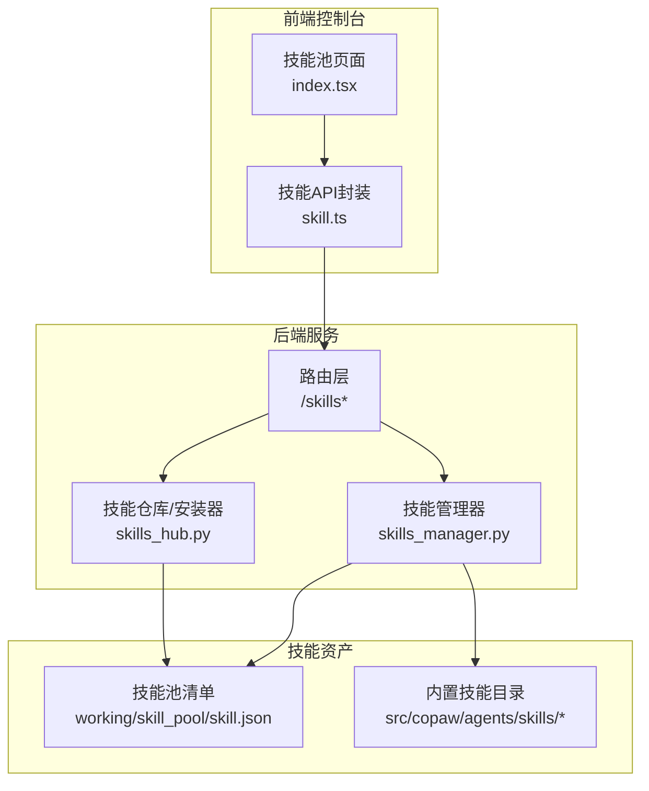
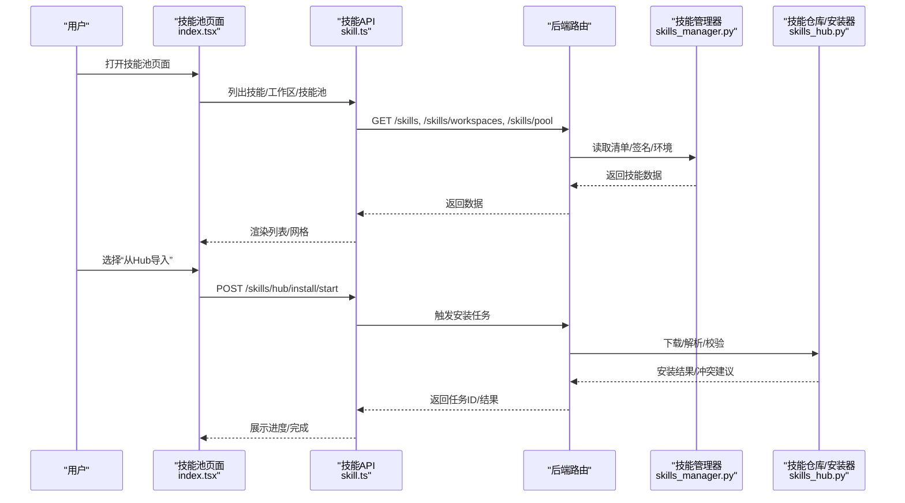
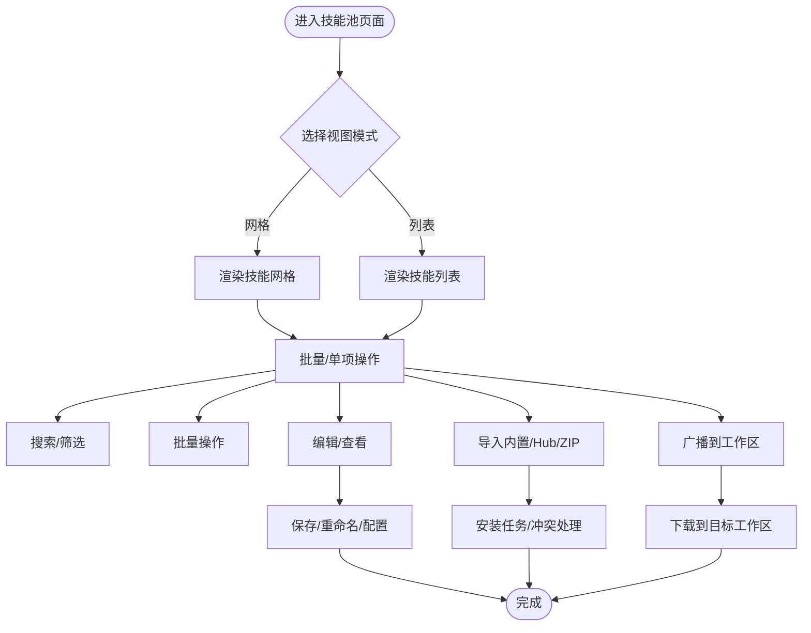
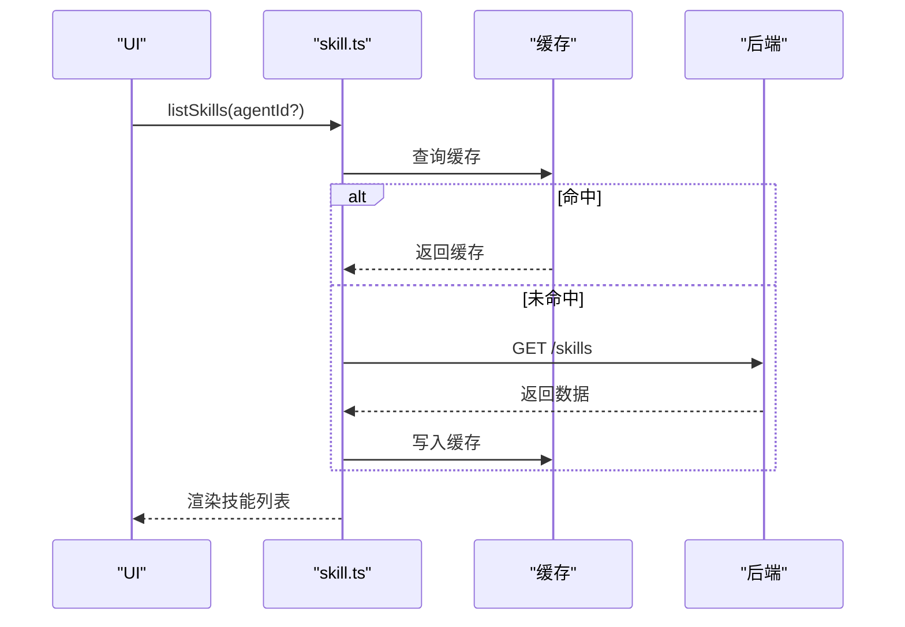
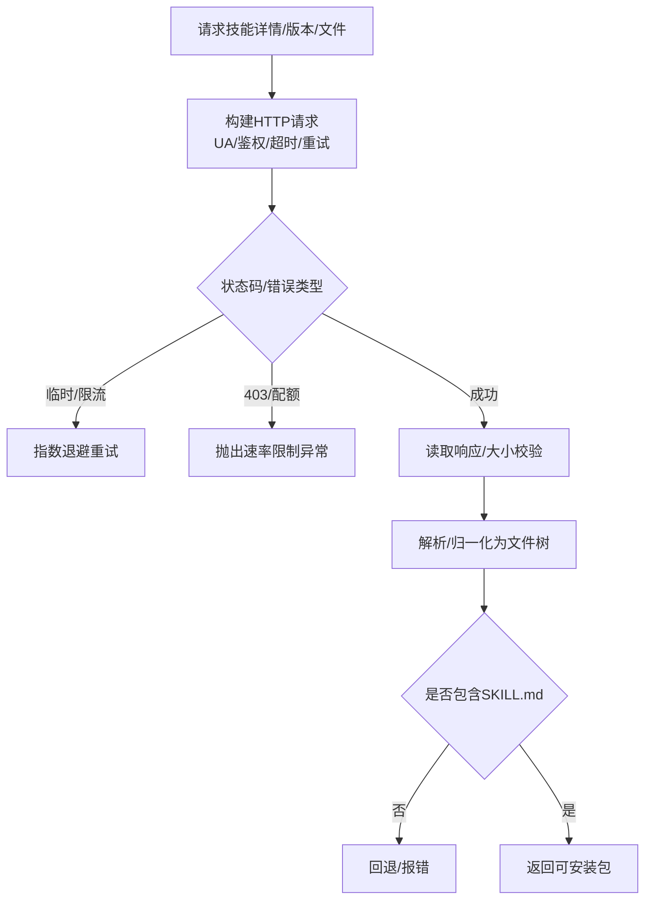
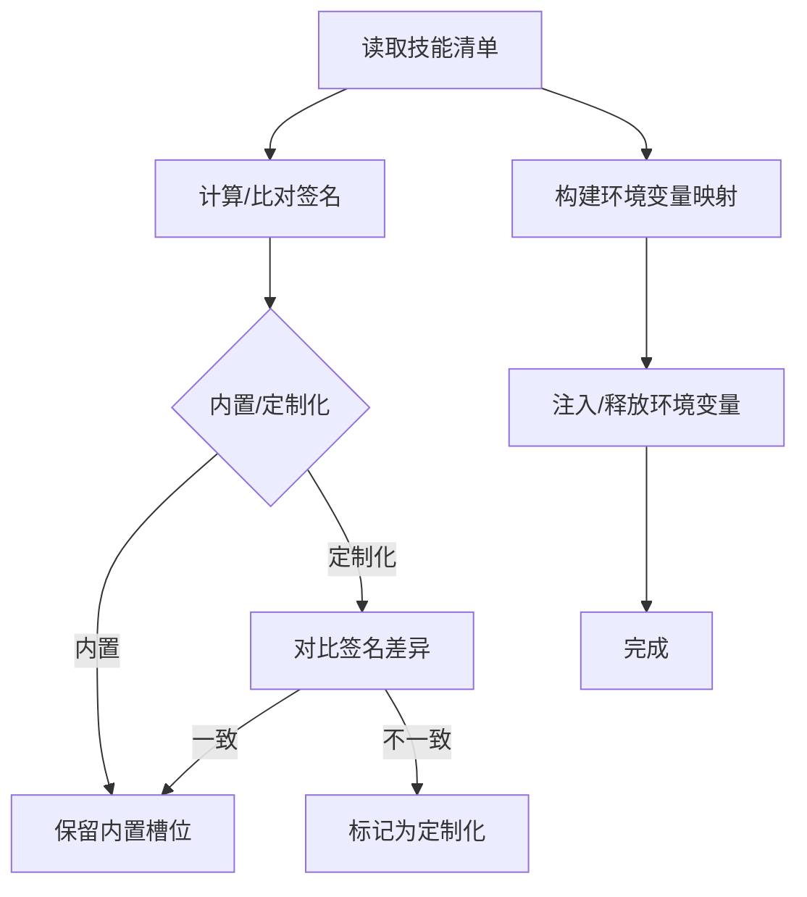
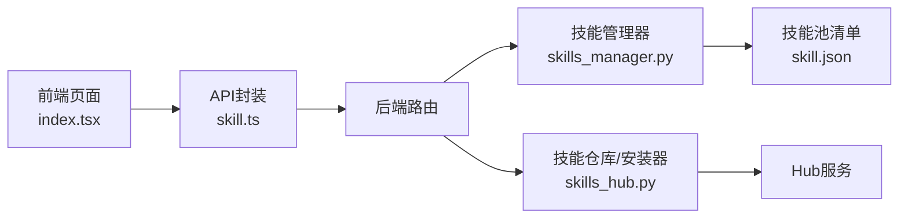

# 技能使用

<cite>
**本文引用的文件**
- [skill.json](file://working/skill_pool/skill.json)
- [index.tsx](file://console/src/pages/Settings/SkillPool/index.tsx)
- [skill.ts](file://console/src/api/modules/skill.ts)
- [skills_hub.py](file://src/copaw/agents/skills_hub.py)
- [skills_manager.py](file://src/copaw/agents/skills_manager.py)
- [browser_cdp SKILL.md](file://src/copaw/agents/skills/browser_cdp/SKILL.md)
- [pdf SKILL.md](file://src/copaw/agents/skills/pdf/SKILL.md)
- [docx SKILL.md](file://src/copaw/agents/skills/docx/SKILL.md)
- [xlsx SKILL.md](file://src/copaw/agents/skills/xlsx/SKILL.md)
</cite>

## 目录
1. [简介](#简介)
2. [项目结构](#项目结构)
3. [核心组件](#核心组件)
4. [架构总览](#架构总览)
5. [详细组件分析](#详细组件分析)
6. [依赖分析](#依赖分析)
7. [性能考虑](#性能考虑)
8. [故障排查指南](#故障排查指南)
9. [结论](#结论)
10. [附录](#附录)

## 简介
本指南面向使用者与管理员，系统讲解技能池的浏览、搜索、安装、配置与使用方法；详解内置技能的功能特性与适用场景（浏览器操作、文件处理、报表生成、数据查询等）；给出自定义技能的开发、测试与部署流程；提供技能冲突解决、版本管理与权限控制的操作指引；并总结性能优化、缓存策略与错误处理等技术要点。最后结合实际工作场景，给出技能组合使用的最佳实践。

## 项目结构
围绕“技能”这一核心域，系统在前后端分别提供了可视化界面与后端服务支撑：
- 前端控制台提供技能池页面，支持刷新、导入内置、上传ZIP、批量操作、广播分发、编辑与查看等能力
- 后端提供技能清单、安装、配置、通道与标签管理、AI优化等接口
- 技能仓库与安装器负责从Hub或本地ZIP导入技能，并进行签名校验与冲突处理
- 技能管理器负责技能清单、签名、环境注入、广播下载、工作区同步等

图示来源
- [index.tsx:30-290](file://console/src/pages/Settings/SkillPool/index.tsx#L30-L290)
- [skill.ts:112-551](file://console/src/api/modules/skill.ts#L112-L551)
- [skills_manager.py:1-200](file://src/copaw/agents/skills_manager.py#L1-L200)
- [skills_hub.py:1-120](file://src/copaw/agents/skills_hub.py#L1-L120)
- [skill.json:1-370](file://working/skill_pool/skill.json#L1-L370)

章节来源
- [index.tsx:30-290](file://console/src/pages/Settings/SkillPool/index.tsx#L30-L290)
- [skill.ts:112-551](file://console/src/api/modules/skill.ts#L112-L551)
- [skills_manager.py:119-169](file://src/copaw/agents/skills_manager.py#L119-L169)
- [skills_hub.py:190-224](file://src/copaw/agents/skills_hub.py#L190-L224)
- [skill.json:1-370](file://working/skill_pool/skill.json#L1-L370)

## 核心组件
- 技能池页面：提供技能列表/网格视图、搜索过滤、批量操作、导入内置、上传ZIP、广播分发、编辑查看等交互
- 技能API封装：统一缓存、流式优化、批量操作、安装任务状态轮询、配置读写等
- 技能管理器：技能清单读写、签名计算、冲突建议、环境变量注入、广播下载、工作区同步
- 技能仓库/安装器：Hub搜索/详情/文件拉取、ZIP解压安全校验、冲突检测与重命名建议
- 技能清单：技能池manifest，记录技能元数据、来源、签名、更新时间等

章节来源
- [index.tsx:150-242](file://console/src/pages/Settings/SkillPool/index.tsx#L150-L242)
- [skill.ts:174-340](file://console/src/api/modules/skill.ts#L174-L340)
- [skills_manager.py:407-446](file://src/copaw/agents/skills_manager.py#L407-L446)
- [skills_hub.py:37-49](file://src/copaw/agents/skills_hub.py#L37-L49)

## 架构总览
技能使用涉及“前端展示—后端路由—技能管理—技能仓库—工作区”的全链路协作。下图展示了典型技能安装与使用的序列：

图示来源
- [index.tsx:244-267](file://console/src/pages/Settings/SkillPool/index.tsx#L244-L267)
- [skill.ts:272-312](file://console/src/api/modules/skill.ts#L272-L312)
- [skills_manager.py:119-169](file://src/copaw/agents/skills_manager.py#L119-L169)
- [skills_hub.py:552-636](file://src/copaw/agents/skills_hub.py#L552-L636)

## 详细组件分析

### 技能池页面与操作流程
- 列表/网格视图：支持卡片与列表双模式，滚动懒加载
- 搜索与筛选：多选标签、输入框搜索、下拉过滤
- 批量操作：全选、清空、批量删除、批量启用/禁用
- 导入与上传：内置导入、Hub导入、ZIP上传
- 广播分发：将技能广播到多个工作区，支持覆盖与冲突提示
- 编辑与查看：抽屉式编辑、Markdown预览、配置编辑

图示来源
- [index.tsx:30-290](file://console/src/pages/Settings/SkillPool/index.tsx#L30-L290)

章节来源
- [index.tsx:39-242](file://console/src/pages/Settings/SkillPool/index.tsx#L39-L242)

### 技能API与缓存策略
- 缓存：针对技能列表、工作区列表、技能池列表设置30秒TTL内存缓存，支持按需失效
- 流式优化：提供AI优化流式接口，支持中止信号
- 批量操作：批量启用/禁用、批量删除、批量导入
- 安装任务：开始安装、轮询状态、取消任务
- 配置管理：技能/技能池配置的增删改查

图示来源
- [skill.ts:17-61](file://console/src/api/modules/skill.ts#L17-L61)
- [skill.ts:113-123](file://console/src/api/modules/skill.ts#L113-L123)

章节来源
- [skill.ts:17-61](file://console/src/api/modules/skill.ts#L17-L61)
- [skill.ts:112-551](file://console/src/api/modules/skill.ts#L112-L551)

### 技能仓库与安装器
- Hub集成：支持ClawHub/Skills.sh等源，自动拼接URL、鉴权头、超时与重试
- 文件拉取：按文件列表逐个拉取，限制最大字节数与条目数，避免过大包
- 内容归一化：从多种响应形态提取内容，确保SKILL.md存在
- 冲突处理：冲突时返回建议重命名，避免覆盖

图示来源
- [skills_hub.py:286-400](file://src/copaw/agents/skills_hub.py#L286-L400)
- [skills_hub.py:552-636](file://src/copaw/agents/skills_hub.py#L552-L636)

章节来源
- [skills_hub.py:77-159](file://src/copaw/agents/skills_hub.py#L77-L159)
- [skills_hub.py:286-400](file://src/copaw/agents/skills_hub.py#L286-L400)
- [skills_hub.py:552-636](file://src/copaw/agents/skills_hub.py#L552-L636)

### 技能管理器与清单
- 清单路径：技能池清单位于工作区根下的skill_pool/skill.json；工作区清单位于workspace/skill.json
- 签名机制：基于技能目录树与文件内容计算SHA256，用于冲突检测与版本一致性
- 冲突建议：提供时间戳后缀的建议重命名，避免同名冲突
- 环境注入：根据技能配置与声明的环境需求，注入环境变量，支持并发安全
- 广播下载：将技能从技能池下载到多个工作区，返回冲突与覆盖结果

图示来源
- [skills_manager.py:407-446](file://src/copaw/agents/skills_manager.py#L407-L446)
- [skills_manager.py:666-711](file://src/copaw/agents/skills_manager.py#L666-L711)

章节来源
- [skills_manager.py:119-169](file://src/copaw/agents/skills_manager.py#L119-L169)
- [skills_manager.py:273-291](file://src/copaw/agents/skills_manager.py#L273-L291)
- [skills_manager.py:748-770](file://src/copaw/agents/skills_manager.py#L748-L770)
- [skills_manager.py:666-711](file://src/copaw/agents/skills_manager.py#L666-L711)

### 内置技能：浏览器操作（browser_cdp）
- 使用场景：需要连接已有Chrome、扫描本地CDP端口、或启动暴露CDP端口的浏览器
- 风险提示：CDP模式会暴露历史、Cookies等敏感信息，需告知用户并谨慎使用
- 单实例限制：同一工作区同时只能运行/连接一个浏览器
- 常用动作：扫描端口、连接、启动带端口、清除缓存、停止行为差异说明

章节来源
- [browser_cdp SKILL.md:1-182](file://src/copaw/agents/skills/browser_cdp/SKILL.md#L1-L182)

### 内置技能：PDF处理（pdf）
- 使用场景：PDF读取、文本/表格提取、合并/拆分、旋转、加水印、创建、填表、加密/解密、图片提取、扫描版OCR
- 工具链：pypdf、pdfplumber、reportlab、pdftotext、pdftoppm、qpdf等
- 建议：命令行工具与Python库配合使用，复杂场景参考REFERENCE.md与FORMS.md

章节来源
- [pdf SKILL.md:1-330](file://src/copaw/agents/skills/pdf/SKILL.md#L1-L330)

### 内置技能：Word文档（docx）
- 使用场景：创建/编辑/分析DOCX，转换/导出，接受修订，图像插入，样式与表格规范
- 工具链：docx-js（JavaScript）、LibreOffice、pandoc、pdftoppm等
- 关键规则：页面尺寸、编号/列表、表格宽度与列宽、图像类型参数、页眉页脚、目录、样式覆盖等

章节来源
- [docx SKILL.md:1-488](file://src/copaw/agents/skills/docx/SKILL.md#L1-L488)

### 内置技能：电子表格（xlsx）
- 使用场景：读取/分析/编辑/新建Excel，公式驱动、格式化、图表、模板维护
- 工具链：openpyxl、pandas、LibreOffice公式重算脚本
- 关键规范：零公式错误、颜色编码标准、数字格式规则、公式构造原则、公式验证清单

章节来源
- [xlsx SKILL.md:1-306](file://src/copaw/agents/skills/xlsx/SKILL.md#L1-L306)

### 自定义技能：开发、测试与部署
- 开发准备：编写SKILL.md（frontmatter含name/description/metadata），必要时提供scripts/references
- 测试方法：在工作区内创建/编辑技能，利用配置与通道设置验证行为
- 部署步骤：通过技能池页面上传ZIP或从Hub导入；如遇冲突，采用建议重命名；最终通过广播分发到目标工作区

章节来源
- [index.tsx:112-142](file://console/src/pages/Settings/SkillPool/index.tsx#L112-L142)
- [skills_manager.py:748-770](file://src/copaw/agents/skills_manager.py#L748-L770)
- [skills_hub.py:552-636](file://src/copaw/agents/skills_hub.py#L552-L636)

## 依赖分析
- 前端依赖后端API，API依赖路由层，路由层调用技能管理器与仓库模块
- 技能管理器依赖工作区与技能池清单路径，以及内置技能目录
- 技能仓库依赖外部Hub服务，具备超时、重试、速率限制与缓存策略

图示来源
- [index.tsx:30-290](file://console/src/pages/Settings/SkillPool/index.tsx#L30-L290)
- [skill.ts:112-551](file://console/src/api/modules/skill.ts#L112-L551)
- [skills_manager.py:119-169](file://src/copaw/agents/skills_manager.py#L119-L169)
- [skills_hub.py:190-224](file://src/copaw/agents/skills_hub.py#L190-L224)
- [skill.json:1-370](file://working/skill_pool/skill.json#L1-L370)

章节来源
- [skill.ts:112-551](file://console/src/api/modules/skill.ts#L112-L551)
- [skills_manager.py:119-169](file://src/copaw/agents/skills_manager.py#L119-L169)
- [skills_hub.py:190-224](file://src/copaw/agents/skills_hub.py#L190-L224)

## 性能考虑
- 前端缓存：技能列表/工作区/技能池接口设置30秒TTL，减少重复请求
- Hub拉取：限制ZIP解压总量与条目数，避免过大包导致内存压力
- 签名计算：仅对有效文件与受控路径计算，忽略系统缓存文件，保证跨平台一致性
- 环境注入：并发安全的环境变量注册/释放，避免竞态与泄漏
- I/O优化：清单写入采用原子替换，降低锁竞争与损坏风险

章节来源
- [skill.ts:16-32](file://console/src/api/modules/skill.ts#L16-L32)
- [skills_manager.py:452-473](file://src/copaw/agents/skills_manager.py#L452-L473)
- [skills_manager.py:273-291](file://src/copaw/agents/skills_manager.py#L273-L291)
- [skills_manager.py:352-375](file://src/copaw/agents/skills_manager.py#L352-L375)
- [skills_manager.py:627-664](file://src/copaw/agents/skills_manager.py#L627-L664)

## 故障排查指南
- Hub速率限制：出现403/429时，设置GITHUB_TOKEN提升配额
- 安装失败：检查ZIP安全性（禁止绝对路径、符号链接），确认SKILL.md存在
- 冲突处理：安装/保存时如遇同名冲突，采用建议重命名；必要时清理旧版本
- 环境变量冲突：注入失败时检查是否已被占用，释放后重试
- 缓存污染：按需调用缓存失效接口，确保数据一致性

章节来源
- [skills_hub.py:315-364](file://src/copaw/agents/skills_hub.py#L315-L364)
- [skills_hub.py:552-636](file://src/copaw/agents/skills_hub.py#L552-L636)
- [skills_manager.py:771-791](file://src/copaw/agents/skills_manager.py#L771-L791)
- [skills_manager.py:627-664](file://src/copaw/agents/skills_manager.py#L627-L664)
- [skill.ts:34-61](file://console/src/api/modules/skill.ts#L34-L61)

## 结论
通过“前端可视化—后端路由—技能管理—仓库安装—工作区同步”的闭环，系统实现了技能的全生命周期管理。内置技能覆盖浏览器、文档、表格、PDF等高频场景；自定义技能可通过ZIP或Hub导入并广播分发。遵循冲突处理、版本管理与权限控制的最佳实践，可显著提升稳定性与可维护性。

## 附录

### 技能池清单字段说明
- schema_version：清单版本标识
- version：清单版本号（递增）
- skills：技能条目集合
  - name：技能名称
  - description：描述
  - version_text：版本号
  - commit_text：提交信息摘要
  - signature：内容签名（用于冲突检测）
  - source：来源（builtin/customized）
  - protected：是否受保护
  - requirements.require_bins/require_envs：系统依赖
  - updated_at：更新时间
- builtin_skill_names：内置技能名称列表

章节来源
- [skill.json:1-370](file://working/skill_pool/skill.json#L1-L370)