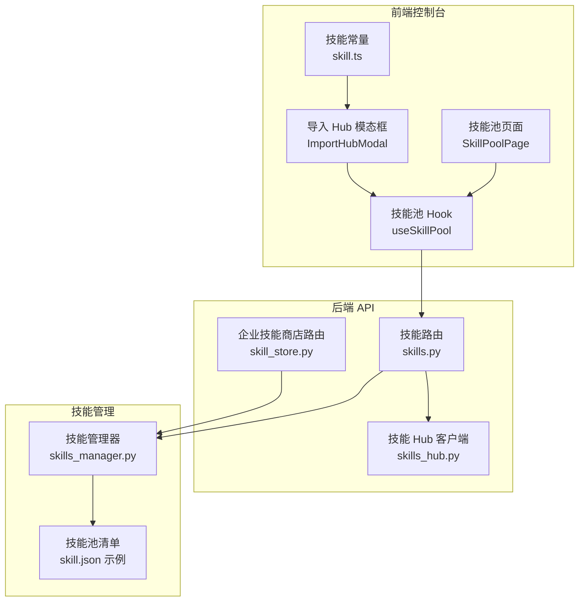
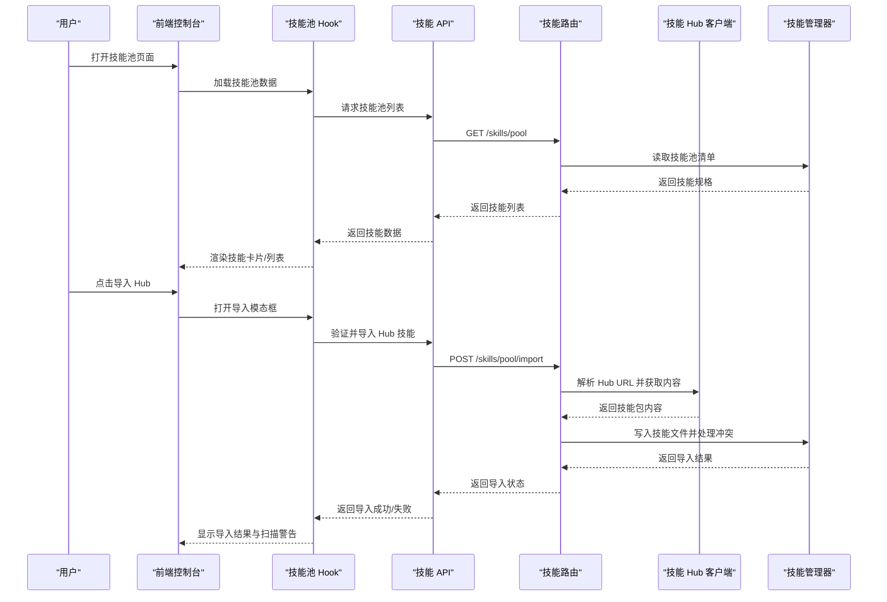
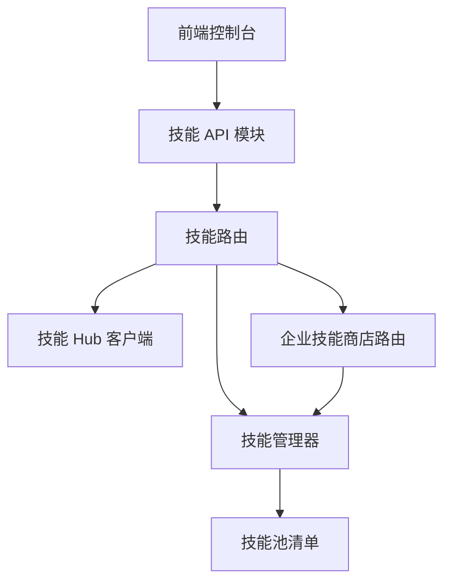

# 技能安装与导入

<cite>
**本文档引用的文件**
- [SkillPoolPage 组件](file://console/src/pages/Settings/SkillPool/index.tsx)
- [技能池 Hook](file://console/src/pages/Settings/SkillPool/useSkillPool.tsx)
- [技能 API 模块](file://console/src/api/modules/skill.ts)
- [导入 Hub 技能模态框](file://console/src/pages/Agent/Skills/components/ImportHubModal.tsx)
- [技能常量定义](file://console/src/constants/skill.ts)
- [技能管理器](file://src/copaw/agents/skills_manager.py)
- [技能 Hub 客户端](file://src/copaw/agents/skills_hub.py)
- [技能路由](file://src/copaw/app/routers/skills.py)
- [企业技能商店路由](file://src/copaw/app/routers/skill_store.py)
- [技能池清单示例](file://working/skill_pool/skill.json)
- [CLI 技能命令](file://src/copaw/cli/skills_cmd.py)
</cite>

## 目录
1. [简介](#简介)
2. [项目结构概览](#项目结构概览)
3. [核心组件分析](#核心组件分析)
4. [架构总览](#架构总览)
5. [详细操作指南](#详细操作指南)
6. [依赖关系分析](#依赖关系分析)
7. [性能考虑](#性能考虑)
8. [故障排除指南](#故障排除指南)
9. [结论](#结论)

## 简介
本指南详细说明如何在 Copaw 系统中进行技能安装与导入操作，涵盖以下场景：
- 从技能池导入技能到工作空间（单个与批量）
- 从外部 Hub 导入技能（URL 导入、版本检查、冲突处理）
- 通过 ZIP 文件上传安装技能（文件格式、大小限制、自动重命名）
- 技能冲突检测与解决机制（重命名建议、版本升级提示）
- 技能权限设置与渠道绑定操作

## 项目结构概览
Copaw 的技能安装与导入功能由前端控制台、后端 API 路由和技能管理器共同实现。前端提供用户界面与交互逻辑，后端负责业务处理与安全扫描，技能管理器负责文件系统层面的技能同步与冲突处理。

**图表来源**
- [SkillPoolPage 组件:30-290](file://console/src/pages/Settings/SkillPool/index.tsx#L30-L290)
- [技能池 Hook:25-800](file://console/src/pages/Settings/SkillPool/useSkillPool.tsx#L25-L800)
- [技能路由:62-800](file://src/copaw/app/routers/skills.py#L62-L800)
- [技能 Hub 客户端:1-800](file://src/copaw/agents/skills_hub.py#L1-L800)
- [技能管理器:1-800](file://src/copaw/agents/skills_manager.py#L1-L800)
- [技能池清单示例:1-370](file://working/skill_pool/skill.json#L1-L370)

**章节来源**
- [SkillPoolPage 组件:30-290](file://console/src/pages/Settings/SkillPool/index.tsx#L30-L290)
- [技能池 Hook:25-800](file://console/src/pages/Settings/SkillPool/useSkillPool.tsx#L25-L800)
- [技能路由:62-800](file://src/copaw/app/routers/skills.py#L62-L800)

## 核心组件分析

### 前端组件
- 技能池页面：提供刷新、导入、上传、广播等操作入口，支持列表/网格视图切换与批量操作。
- 技能池 Hook：封装加载数据、导入、广播、删除等业务逻辑，处理冲突重命名与扫描警告。
- 导入 Hub 模态框：验证支持的 Hub URL 前缀，提供示例与错误提示。
- 技能常量：定义支持的 Hub URL 前缀与标签过滤前缀。

**章节来源**
- [SkillPoolPage 组件:30-290](file://console/src/pages/Settings/SkillPool/index.tsx#L30-L290)
- [技能池 Hook:25-800](file://console/src/pages/Settings/SkillPool/useSkillPool.tsx#L25-L800)
- [导入 Hub 技能模态框:1-132](file://console/src/pages/Agent/Skills/components/ImportHubModal.tsx#L1-L132)
- [技能常量定义:1-21](file://console/src/constants/skill.ts#L1-L21)

### 后端组件
- 技能路由：提供技能列表、刷新、上传、导入 Hub、批量操作等接口，包含安全扫描与冲突处理。
- 企业技能商店路由：支持企业级技能商店的发现与安装。
- 技能 Hub 客户端：实现 Hub 技能搜索、版本解析、文件下载与内容提取。
- 技能管理器：负责 ZIP 解压校验、冲突检测、签名计算、文件写入与锁定。

**章节来源**
- [技能路由:62-800](file://src/copaw/app/routers/skills.py#L62-L800)
- [企业技能商店路由:1-73](file://src/copaw/app/routers/skill_store.py#L1-L73)
- [技能 Hub 客户端:1-800](file://src/copaw/agents/skills_hub.py#L1-L800)
- [技能管理器:1-800](file://src/copaw/agents/skills_manager.py#L1-L800)

## 架构总览
技能安装与导入的端到端流程如下：

**图表来源**
- [技能池 Hook:654-698](file://console/src/pages/Settings/SkillPool/useSkillPool.tsx#L654-L698)
- [技能 API 模块:284-298](file://console/src/api/modules/skill.ts#L284-L298)
- [技能路由:746-768](file://src/copaw/app/routers/skills.py#L746-L768)
- [技能 Hub 客户端:553-636](file://src/copaw/agents/skills_hub.py#L553-L636)
- [技能管理器:748-791](file://src/copaw/agents/skills_manager.py#L748-L791)

## 详细操作指南

### 从技能池导入技能到工作空间
支持单个与批量导入，自动处理冲突与扫描警告。

- 单个导入
  1. 在技能池页面选择目标技能，点击“导入到工作空间”。
  2. 前端 Hook 调用 API 导入接口，后端路由解析 Hub URL 或直接导入。
  3. 技能管理器写入文件并处理冲突，返回导入结果。
  4. 成功后显示扫描警告，失败则提示错误原因。

- 批量导入
  1. 点击“批量操作”，勾选多个技能。
  2. 逐个处理导入，支持重命名与覆盖选项。
  3. 处理冲突时弹出重命名确认对话框。

**章节来源**
- [技能池 Hook:248-390](file://console/src/pages/Settings/SkillPool/useSkillPool.tsx#L248-L390)
- [技能 API 模块:360-381](file://console/src/api/modules/skill.ts#L360-L381)
- [技能路由:746-768](file://src/copaw/app/routers/skills.py#L746-L768)

### 从外部 Hub 导入技能
支持多种 Hub URL 前缀，自动版本检查与冲突处理。

- 支持的 Hub 前缀
  - skills.sh、clawhub.ai、skillsmp.com、lobehub.com、market.lobehub.com、github.com、modelscope.cn/skills/

- 导入流程
  1. 在导入模态框输入 Hub URL，前端验证 URL 前缀。
  2. 调用导入接口，后端路由启动 Hub 安装任务。
  3. 技能 Hub 客户端解析 URL，获取版本信息与文件内容。
  4. 技能管理器写入技能文件，处理冲突与签名。
  5. 返回导入结果，显示扫描警告或错误。

- 版本检查
  - 自动提取最新版本或请求指定版本，确保内容一致性。

- 冲突处理
  - 若技能名冲突，返回建议的新名称，用户可选择重命名或覆盖。

**章节来源**
- [导入 Hub 技能模态框:1-132](file://console/src/pages/Agent/Skills/components/ImportHubModal.tsx#L1-L132)
- [技能常量定义:3-11](file://console/src/constants/skill.ts#L3-L11)
- [技能路由:582-641](file://src/copaw/app/routers/skills.py#L582-L641)
- [技能 Hub 客户端:553-636](file://src/copaw/agents/skills_hub.py#L553-L636)
- [技能管理器:748-791](file://src/copaw/agents/skills_manager.py#L748-L791)

### 通过 ZIP 文件上传安装技能
支持 ZIP 包上传，自动解压与冲突检测。

- 文件格式与大小限制
  - 仅支持 .zip 格式，最大 100MB（前端限制 100MB，后端限制 100MB）。
  - ZIP 内容需为技能目录结构，包含 SKILL.md 等必要文件。

- 上传流程
  1. 在技能池页面点击“上传 ZIP”，选择本地文件。
  2. 前端 Hook 校验文件类型与大小，调用上传接口。
  3. 后端路由读取并校验 ZIP 文件，调用技能管理器导入。
  4. 技能管理器解压 ZIP，写入文件系统，处理冲突与签名。
  5. 返回导入结果，显示扫描警告或错误。

- 自动重命名
  - 若检测到冲突，返回建议的新名称，用户可选择重命名或覆盖。

**章节来源**
- [技能池 Hook:577-652](file://console/src/pages/Settings/SkillPool/useSkillPool.tsx#L577-L652)
- [技能 API 模块:533-549](file://console/src/api/modules/skill.ts#L533-L549)
- [技能路由:698-744](file://src/copaw/app/routers/skills.py#L698-L744)
- [技能管理器:452-473](file://src/copaw/agents/skills_manager.py#L452-L473)

### 技能冲突检测与解决
系统提供自动冲突检测与重命名建议，支持版本升级提示。

- 冲突检测
  - 基于技能签名与名称进行冲突判断，避免覆盖现有技能。
  - 对于内置技能，支持升级提示与覆盖确认。

- 重命名建议
  - 自动生成时间戳后缀的建议名称，避免重复。
  - 用户可在对话框中自定义重命名。

- 版本升级提示
  - 当检测到内置技能升级时，弹出确认对话框，允许用户选择覆盖。

**章节来源**
- [技能池 Hook:284-350](file://console/src/pages/Settings/SkillPool/useSkillPool.tsx#L284-L350)
- [技能管理器:748-791](file://src/copaw/agents/skills_manager.py#L748-L791)

### 技能权限设置与渠道绑定
支持为技能设置权限与绑定特定渠道。

- 权限设置
  - 通过技能配置字段设置运行所需的环境变量与二进制依赖。
  - 系统根据需求注入环境变量，缺失时记录警告。

- 渠道绑定
  - 为技能设置 channels 字段，限制在特定渠道生效。
  - 支持通配符 "all" 或具体渠道列表。

**章节来源**
- [技能管理器:568-711](file://src/copaw/agents/skills_manager.py#L568-L711)
- [技能路由:111-127](file://src/copaw/app/routers/skills.py#L111-L127)

## 依赖关系分析

**图表来源**
- [技能 API 模块:112-551](file://console/src/api/modules/skill.ts#L112-L551)
- [技能路由:62-800](file://src/copaw/app/routers/skills.py#L62-L800)
- [技能 Hub 客户端:1-800](file://src/copaw/agents/skills_hub.py#L1-L800)
- [技能管理器:1-800](file://src/copaw/agents/skills_manager.py#L1-L800)
- [企业技能商店路由:1-73](file://src/copaw/app/routers/skill_store.py#L1-L73)

**章节来源**
- [技能 API 模块:112-551](file://console/src/api/modules/skill.ts#L112-L551)
- [技能路由:62-800](file://src/copaw/app/routers/skills.py#L62-L800)

## 性能考虑
- 缓存策略：前端对技能列表与工作空间信息进行缓存，减少重复请求。
- 异步处理：Hub 安装任务采用异步执行，支持取消与状态查询。
- 文件大小限制：严格限制 ZIP 文件大小，避免内存与磁盘压力。
- 扫描优化：安全扫描在导入过程中执行，失败时返回标准化错误。

## 故障排除指南
- ZIP 文件过大：超过 100MB 时拒绝上传，需压缩文件或拆分技能。
- 不支持的 ZIP 类型：仅接受标准 ZIP 格式，确保文件未被加密。
- 冲突处理失败：若多次重命名仍冲突，检查技能名称是否符合规范。
- Hub 连接超时：网络不稳定导致下载失败，可稍后重试或更换网络。
- 权限不足：技能依赖的环境变量或二进制未满足，检查配置与系统环境。

**章节来源**
- [技能池 Hook:577-652](file://console/src/pages/Settings/SkillPool/useSkillPool.tsx#L577-L652)
- [技能路由:352-372](file://src/copaw/app/routers/skills.py#L352-L372)
- [技能管理器:452-473](file://src/copaw/agents/skills_manager.py#L452-L473)

## 结论
Copaw 提供了完整的技能安装与导入解决方案，涵盖从技能池导入、外部 Hub 导入到 ZIP 文件上传等多种方式，并内置冲突检测、版本升级提示与安全扫描机制。通过清晰的前端交互与健壮的后端处理，用户可以高效、安全地管理技能资源。