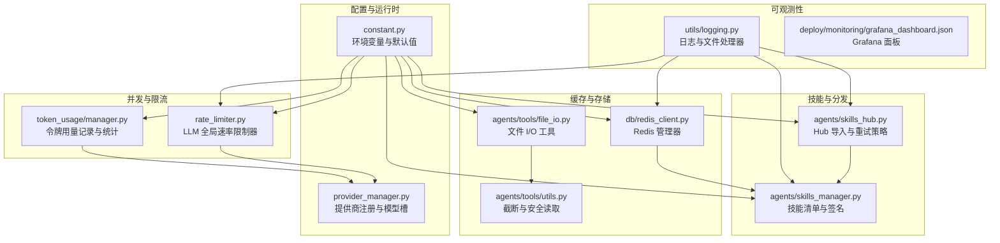
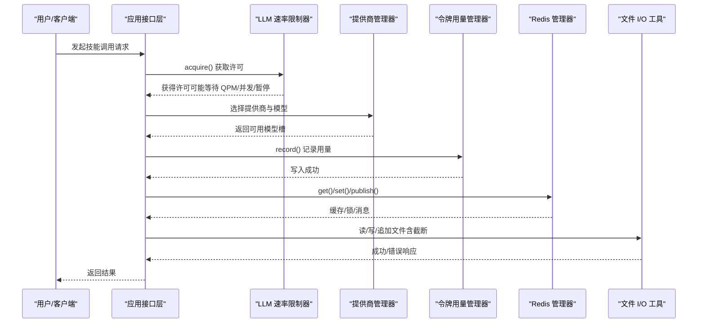
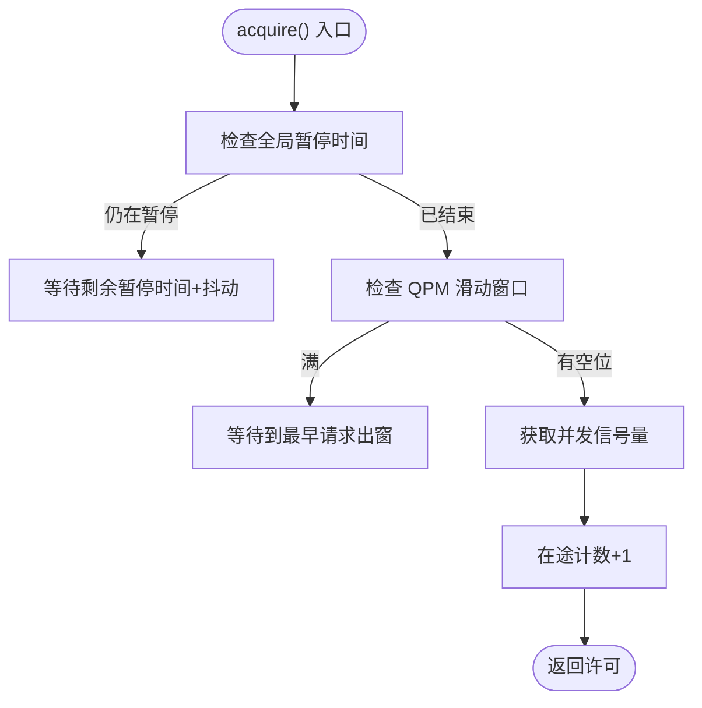
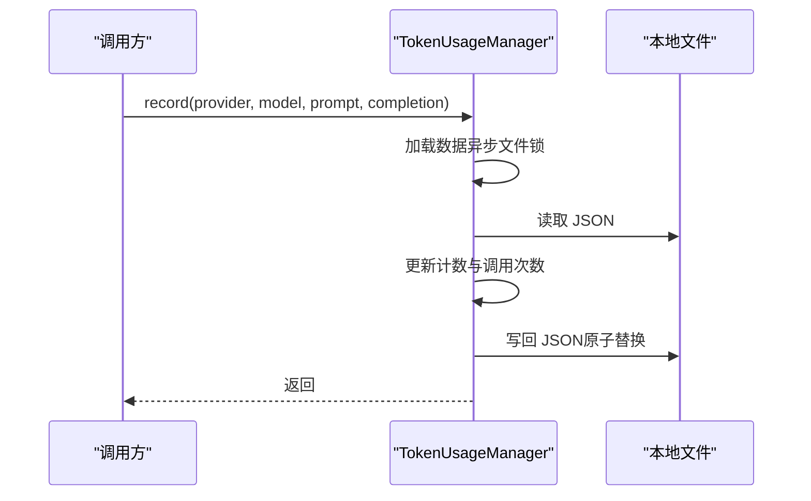
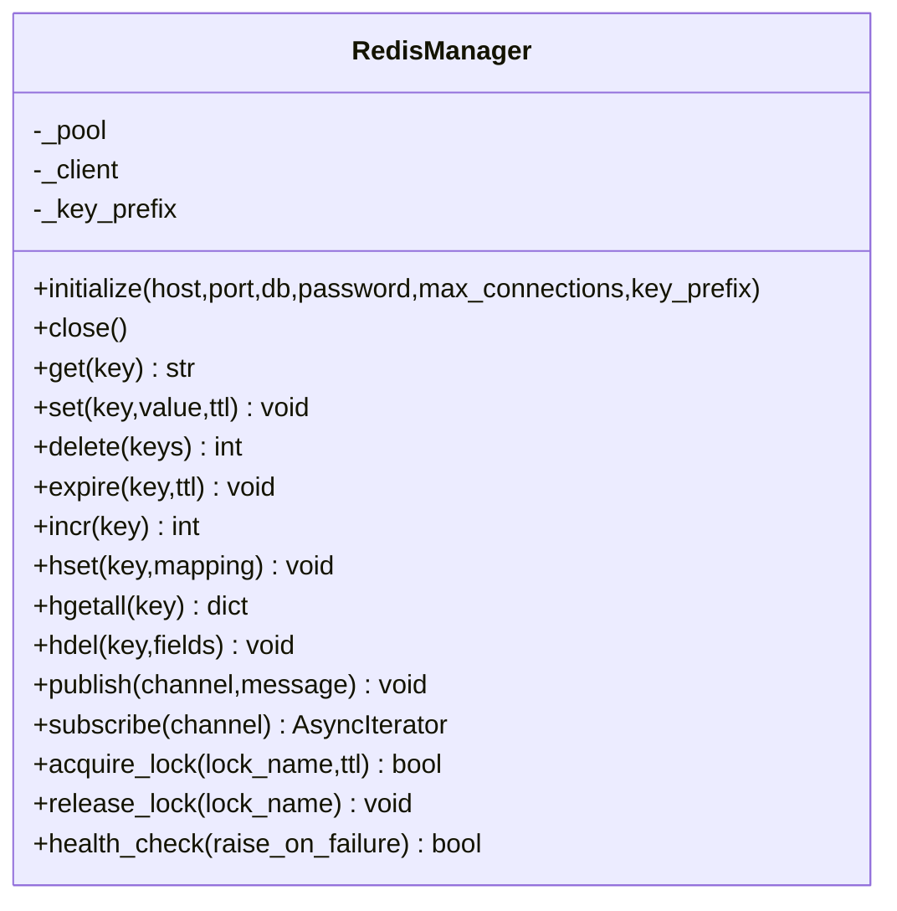
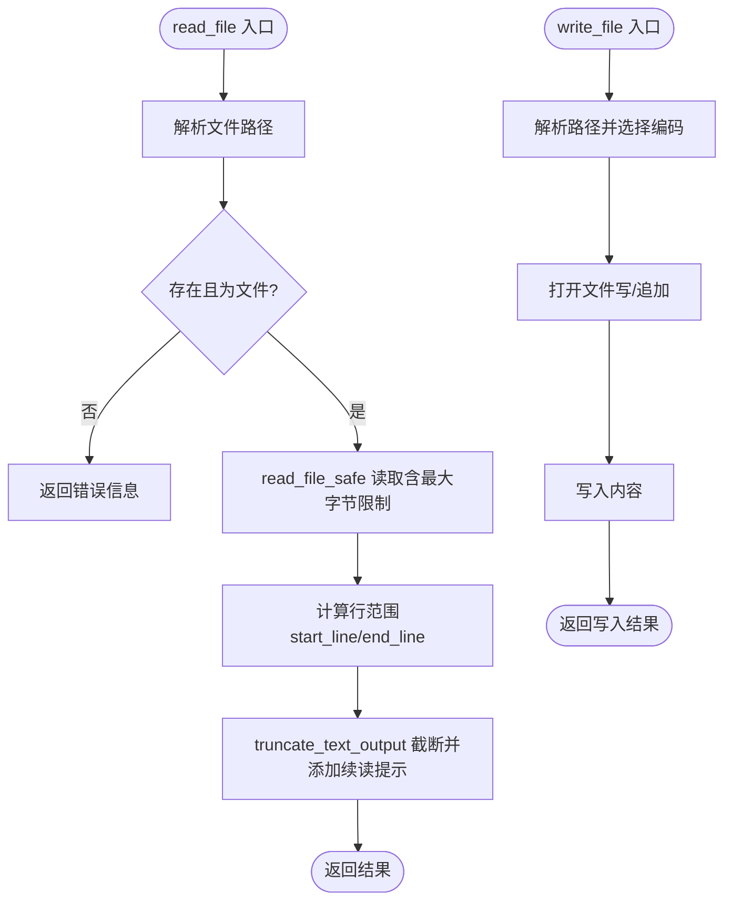
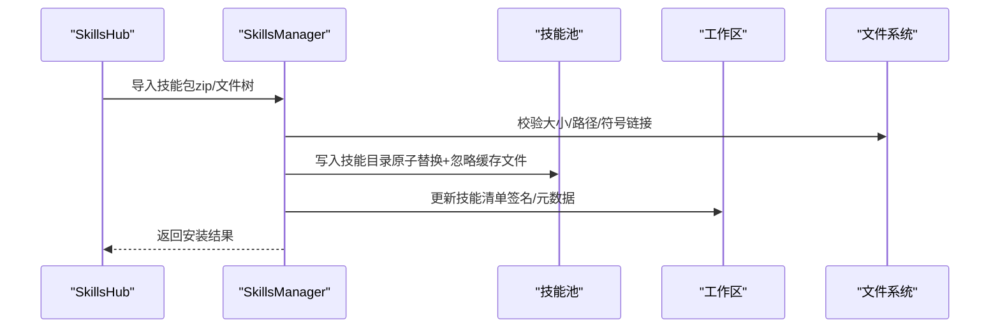
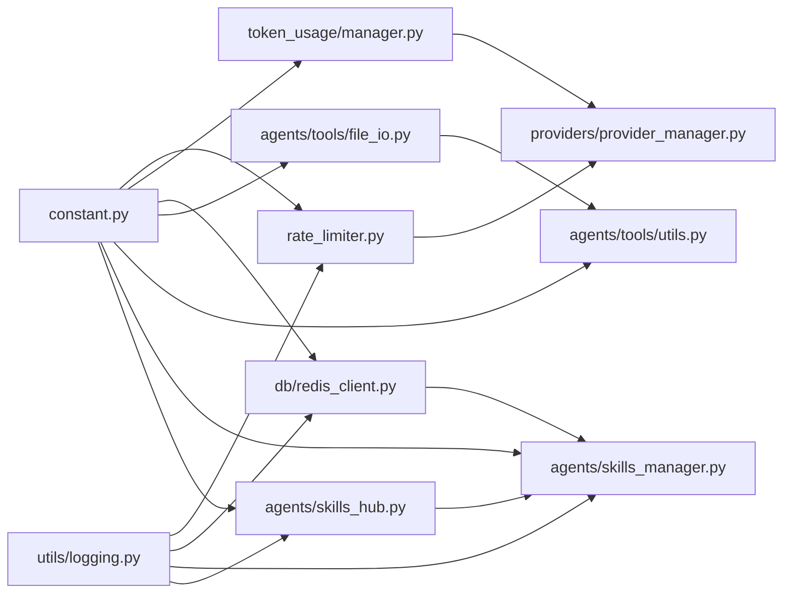

# 技能性能优化

<cite>
**本文引用的文件**
- [src/copaw/constant.py](file://src/copaw/constant.py)
- [src/copaw/providers/rate_limiter.py](file://src/copaw/providers/rate_limiter.py)
- [src/copaw/token_usage/manager.py](file://src/copaw/token_usage/manager.py)
- [src/copaw/utils/logging.py](file://src/copaw/utils/logging.py)
- [src/copaw/db/redis_client.py](file://src/copaw/db/redis_client.py)
- [src/copaw/local_models/manager.py](file://src/copaw/local_models/manager.py)
- [src/copaw/agents/tools/file_io.py](file://src/copaw/agents/tools/file_io.py)
- [src/copaw/agents/tools/utils.py](file://src/copaw/agents/tools/utils.py)
- [src/copaw/agents/skills_manager.py](file://src/copaw/agents/skills_manager.py)
- [src/copaw/agents/skills_hub.py](file://src/copaw/agents/skills_hub.py)
- [src/copaw/providers/provider_manager.py](file://src/copaw/providers/provider_manager.py)
- [src/copaw/app/utils.py](file://src/copaw/app/utils.py)
- [deploy/monitoring/grafana_dashboard.json](file://deploy/monitoring/grafana_dashboard.json)
- [deploy/config/supervisord.conf.template](file://deploy/config/supervisord.conf.template)
</cite>

## 目录
1. [引言](#引言)
2. [项目结构](#项目结构)
3. [核心组件](#核心组件)
4. [架构总览](#架构总览)
5. [详细组件分析](#详细组件分析)
6. [依赖关系分析](#依赖关系分析)
7. [性能考虑](#性能考虑)
8. [故障排查指南](#故障排查指南)
9. [结论](#结论)
10. [附录](#附录)

## 引言
本文件面向技能（Skill）在 CoPaw 平台中的性能优化，系统性梳理内存管理、缓存策略、并发控制、调用频率控制、资源限制、执行时间监控与分析、错误处理与异常恢复、依赖管理与外部 API 优化、文件 I/O 性能提升，以及大规模部署下的性能考量与最佳实践。内容基于仓库中实际实现进行提炼，并提供可操作的配置建议与优化路径。

## 项目结构
围绕“技能性能优化”的关键模块分布如下：
- 配置与环境变量：通过统一常量与环境变量加载器集中管理性能相关参数（如并发、QPM、重试、超时等）
- 提供商与速率限制：统一的 LLM 速率限制器，支持 QPM 滑动窗口、并发信号量、全局暂停与抖动
- 计费与用量统计：异步文件锁保护的令牌用量记录与聚合统计
- 缓存与分布式协调：Redis 管理器提供缓存、发布订阅、分布式锁等能力
- 文件 I/O 工具：安全读写、编码选择、智能截断与续读提示
- 技能管理与分发：技能池同步、导入、冲突处理、并发环境注入
- 日志与可观测性：结构化日志、文件轮转、访问日志过滤
- 部署与监控：Supervisord 进程管理模板、Grafana 监控面板

**图表来源**
- [src/copaw/constant.py:129-249](file://src/copaw/constant.py#L129-L249)
- [src/copaw/providers/rate_limiter.py:30-196](file://src/copaw/providers/rate_limiter.py#L30-L196)
- [src/copaw/token_usage/manager.py:62-308](file://src/copaw/token_usage/manager.py#L62-L308)
- [src/copaw/db/redis_client.py:22-217](file://src/copaw/db/redis_client.py#L22-L217)
- [src/copaw/agents/tools/file_io.py:66-395](file://src/copaw/agents/tools/file_io.py#L66-L395)
- [src/copaw/agents/tools/utils.py:15-227](file://src/copaw/agents/tools/utils.py#L15-L227)
- [src/copaw/agents/skills_manager.py:64-128](file://src/copaw/agents/skills_manager.py#L64-L128)
- [src/copaw/agents/skills_hub.py:77-159](file://src/copaw/agents/skills_hub.py#L77-L159)
- [src/copaw/utils/logging.py:119-199](file://src/copaw/utils/logging.py#L119-L199)
- [deploy/monitoring/grafana_dashboard.json](file://deploy/monitoring/grafana_dashboard.json)

**章节来源**
- [src/copaw/constant.py:129-249](file://src/copaw/constant.py#L129-L249)
- [src/copaw/utils/logging.py:119-199](file://src/copaw/utils/logging.py#L119-L199)

## 核心组件
- 环境变量与默认值：集中定义并发上限、QPM、重试、超时、日志级别等关键性能参数，便于统一调优
- LLM 速率限制器：滑动窗口 QPM + 并发信号量 + 全局暂停 + 抖动，避免 429 并抑制惊群效应
- 令牌用量管理：异步文件锁保护的 JSON 记录与聚合统计，支持按日期/模型/提供商维度汇总
- Redis 管理器：连接池、缓存键空间前缀、发布订阅、分布式锁，支撑高吞吐场景
- 文件 I/O 工具：安全读取、编码适配、智能截断与续读提示，避免大文件内存压力
- 技能管理：技能池签名校验、冲突命名、并发环境注入、文件级互斥锁，保障导入一致性
- 日志系统：彩色/纯文本格式、文件轮转、访问日志过滤，降低 IO 压力并提升可观测性

**章节来源**
- [src/copaw/constant.py:129-249](file://src/copaw/constant.py#L129-L249)
- [src/copaw/providers/rate_limiter.py:30-196](file://src/copaw/providers/rate_limiter.py#L30-L196)
- [src/copaw/token_usage/manager.py:62-308](file://src/copaw/token_usage/manager.py#L62-L308)
- [src/copaw/db/redis_client.py:22-217](file://src/copaw/db/redis_client.py#L22-L217)
- [src/copaw/agents/tools/file_io.py:66-395](file://src/copaw/agents/tools/file_io.py#L66-L395)
- [src/copaw/agents/skills_manager.py:317-387](file://src/copaw/agents/skills_manager.py#L317-L387)

## 架构总览
下图展示技能执行链路中的关键性能控制点：请求进入后经速率限制与并发控制，结合令牌用量统计与缓存层，最终落盘或返回结果；同时通过日志与监控持续观测性能指标。

**图表来源**
- [src/copaw/providers/rate_limiter.py:70-151](file://src/copaw/providers/rate_limiter.py#L70-L151)
- [src/copaw/providers/provider_manager.py:736-751](file://src/copaw/providers/provider_manager.py#L736-L751)
- [src/copaw/token_usage/manager.py:110-156](file://src/copaw/token_usage/manager.py#L110-L156)
- [src/copaw/db/redis_client.py:109-137](file://src/copaw/db/redis_client.py#L109-L137)
- [src/copaw/agents/tools/file_io.py:66-254](file://src/copaw/agents/tools/file_io.py#L66-L254)

## 详细组件分析

### 组件A：LLM 速率限制器（并发与频率控制）
- 滑动窗口 QPM：60 秒窗口内记录请求时间戳，超出则等待
- 并发信号量：限制同时在途请求数，防止资源过载
- 全局暂停：收到 429 后设置暂停时间，避免惊群重试
- 抖动：为唤醒等待者增加随机偏移，分散突发
- 统计输出：暴露当前在途、剩余并发、QPM 使用、暂停状态等指标

**图表来源**
- [src/copaw/providers/rate_limiter.py:70-151](file://src/copaw/providers/rate_limiter.py#L70-L151)

**章节来源**
- [src/copaw/providers/rate_limiter.py:30-196](file://src/copaw/providers/rate_limiter.py#L30-L196)
- [src/copaw/constant.py:206-249](file://src/copaw/constant.py#L206-L249)

### 组件B：令牌用量统计（资源限制与成本控制）
- 单例模式 + 线程锁：确保并发写入安全
- 异步文件锁：避免多进程竞争导致的数据损坏
- 聚合维度：按日期、提供商、模型聚合，支持范围查询与汇总
- 容错设计：JSON 解析失败与磁盘错误均降级记录，不阻塞主流程

**图表来源**
- [src/copaw/token_usage/manager.py:73-156](file://src/copaw/token_usage/manager.py#L73-L156)

**章节来源**
- [src/copaw/token_usage/manager.py:62-308](file://src/copaw/token_usage/manager.py#L62-L308)

### 组件C：Redis 缓存与分布式协调
- 连接池与健康检查：最大连接数、命名空间前缀、Ping 校验
- 缓存接口：字符串、哈希、TTL、自增等常用模式
- 分布式锁：NX+EX 锁定，避免竞态
- 发布订阅：通道消息监听，适合事件驱动的异步任务

**图表来源**
- [src/copaw/db/redis_client.py:22-217](file://src/copaw/db/redis_client.py#L22-L217)

**章节来源**
- [src/copaw/db/redis_client.py:22-217](file://src/copaw/db/redis_client.py#L22-L217)

### 组件D：文件 I/O 工具（大文件与跨平台兼容）
- 路径解析：绝对路径直接使用，相对路径从工作区或工作目录解析
- 编码适配：CSV/TSV/TXT 优先 UTF-8-BOM（Windows Excel 兼容），其他文件使用 UTF-8
- 安全读取：最大内存读取限制，避免 OOM
- 智能截断：按字节截断并保留完整行，附加续读提示，支持二次截断更新
- 写入/追加：自动选择编码，异常安全返回

**图表来源**
- [src/copaw/agents/tools/file_io.py:66-254](file://src/copaw/agents/tools/file_io.py#L66-L254)
- [src/copaw/agents/tools/utils.py:151-204](file://src/copaw/agents/tools/utils.py#L151-L204)

**章节来源**
- [src/copaw/agents/tools/file_io.py:66-395](file://src/copaw/agents/tools/file_io.py#L66-L395)
- [src/copaw/agents/tools/utils.py:15-227](file://src/copaw/agents/tools/utils.py#L15-L227)

### 组件E：技能管理（导入、签名与并发环境）
- 技能池与工作区：技能清单、签名构建、冲突检测与命名建议
- 并发环境注入：按需注入环境变量，避免重复与冲突
- 文件级互斥：manifest 写入采用临时文件与原子替换，配合文件锁序列化变更
- Hub 导入：HTTP 重试、背压退避、大小限制、取消检查

**图表来源**
- [src/copaw/agents/skills_hub.py:287-400](file://src/copaw/agents/skills_hub.py#L287-L400)
- [src/copaw/agents/skills_manager.py:293-387](file://src/copaw/agents/skills_manager.py#L293-L387)

**章节来源**
- [src/copaw/agents/skills_manager.py:317-387](file://src/copaw/agents/skills_manager.py#L317-L387)
- [src/copaw/agents/skills_hub.py:77-159](file://src/copaw/agents/skills_hub.py#L77-L159)

### 组件F：日志与可观测性
- 控制台彩色/纯文本格式，自动检测终端能力
- 文件处理器：Windows/Linux 使用简单文件句柄，macOS 使用旋转文件处理器
- 访问日志过滤：可配置路径子串过滤，减少噪音
- 与速率限制器、Redis、技能管理器协同输出调试信息

**章节来源**
- [src/copaw/utils/logging.py:119-199](file://src/copaw/utils/logging.py#L119-L199)

## 依赖关系分析
- 配置层：constant.py 为所有性能相关组件提供默认值与边界约束
- 限流层：rate_limiter 依赖 constant 的并发、QPM、暂停、抖动等参数
- 统计层：token_usage 依赖 WORKING_DIR 与文件锁，避免并发写冲突
- 缓存层：redis_client 提供高性能缓存与分布式锁，支撑高并发场景
- 工具层：file_io 与 utils 依赖常量中的截断标记与默认阈值
- 技能层：skills_manager 与 skills_hub 依赖文件系统与网络 I/O，引入互斥与重试机制
- 观测层：logging 与 Grafana 面板共同构成监控闭环

**图表来源**
- [src/copaw/constant.py:129-249](file://src/copaw/constant.py#L129-L249)
- [src/copaw/providers/rate_limiter.py:236-272](file://src/copaw/providers/rate_limiter.py#L236-L272)
- [src/copaw/token_usage/manager.py:69-71](file://src/copaw/token_usage/manager.py#L69-L71)
- [src/copaw/db/redis_client.py:34-86](file://src/copaw/db/redis_client.py#L34-L86)
- [src/copaw/agents/tools/file_io.py:20-21](file://src/copaw/agents/tools/file_io.py#L20-L21)
- [src/copaw/agents/tools/utils.py:10-16](file://src/copaw/agents/tools/utils.py#L10-L16)
- [src/copaw/agents/skills_manager.py:317-387](file://src/copaw/agents/skills_manager.py#L317-L387)
- [src/copaw/agents/skills_hub.py:129-159](file://src/copaw/agents/skills_hub.py#L129-L159)
- [src/copaw/utils/logging.py:119-199](file://src/copaw/utils/logging.py#L119-L199)

**章节来源**
- [src/copaw/constant.py:129-249](file://src/copaw/constant.py#L129-L249)
- [src/copaw/providers/provider_manager.py:736-751](file://src/copaw/providers/provider_manager.py#L736-L751)

## 性能考虑
- 内存管理
  - 文件读取设置最大内存限制，避免 OOM；对大文件采用截断与续读，保持响应体可控
  - 令牌用量采用异步文件锁与原子写入，避免频繁 IO 与竞争
- 缓存策略
  - 使用 Redis 连接池与键空间前缀，合理设置 TTL；利用分布式锁避免缓存击穿
  - 对热点数据（如模型列表、会话状态）启用短 TTL 并结合后台刷新
- 并发控制
  - 严格限制并发在合理区间，结合 QPM 滑动窗口与全局暂停，避免 429 与资源争用
  - 抖动分散唤醒，降低惊群效应
- 资源限制
  - 通过环境变量统一配置最大并发、QPM、重试次数、超时等，便于在不同环境间快速切换
- 执行时间监控
  - 结合日志与 Grafana 面板，采集速率限制统计、Redis 命中率、文件 I/O 延迟、技能导入耗时等指标
- 外部 API 优化
  - Hub 导入采用指数退避与取消检查，避免无效重试；HTTP 读取分块与大小限制，防止慢读与内存膨胀
- 大规模部署
  - 使用 Supervisord 管理进程，结合 Redis 与文件系统共享，保证多实例一致性
  - 通过 ProviderManager 的并发与重试策略，统一对外部服务的访问行为

[本节为通用性能指导，无需特定文件引用]

## 故障排查指南
- 速率限制相关
  - 现象：频繁等待或 429
  - 排查：查看速率限制器统计，确认 QPM 是否达到上限、并发是否过高、是否存在全局暂停
  - 处置：适当提高并发或 QPM，或调整暂停/抖动参数
- 令牌用量异常
  - 现象：用量统计缺失或不一致
  - 排查：检查文件锁与原子写入逻辑，确认磁盘权限与路径正确
  - 处置：清理损坏文件，确保单实例写入
- Redis 连接问题
  - 现象：连接失败或健康检查失败
  - 排查：核对主机、端口、密码、DB 号与最大连接数
  - 处置：调整连接池参数，启用健康检查并告警
- 文件 I/O 错误
  - 现象：读写失败、编码异常、截断不生效
  - 排查：确认路径解析、编码选择、最大读取字节、截断标记
  - 处置：修正编码策略，增大最大读取限制，确保截断逻辑正确
- 技能导入失败
  - 现象：导入超时、包过大、路径不安全
  - 排查：检查 Hub 超时与重试、Zip 大小限制、路径合法性
  - 处置：优化网络与令牌，拆分大包，确保路径安全

**章节来源**
- [src/copaw/providers/rate_limiter.py:175-196](file://src/copaw/providers/rate_limiter.py#L175-L196)
- [src/copaw/token_usage/manager.py:85-108](file://src/copaw/token_usage/manager.py#L85-L108)
- [src/copaw/db/redis_client.py:198-206](file://src/copaw/db/redis_client.py#L198-L206)
- [src/copaw/agents/tools/file_io.py:114-132](file://src/copaw/agents/tools/file_io.py#L114-L132)
- [src/copaw/agents/skills_hub.py:287-400](file://src/copaw/agents/skills_hub.py#L287-L400)

## 结论
通过对速率限制、令牌统计、缓存与分布式协调、文件 I/O、技能管理与日志监控等关键环节的系统化优化，可在保证稳定性的同时显著提升技能执行效率与资源利用率。建议以环境变量为统一入口进行参数化配置，结合 Grafana 实时观测与告警，形成“配置—执行—观测—反馈”的闭环，持续迭代性能表现。

[本节为总结性内容，无需特定文件引用]

## 附录
- 部署与监控参考
  - Supervisord 进程管理模板：用于守护关键服务进程
  - Grafana 监控面板：采集并展示关键性能指标
- 最佳实践清单
  - 明确并发与 QPM 上限，结合业务峰值与供应商配额设定
  - 对热点数据启用短 TTL 并预热，避免冷启动抖动
  - 使用原子写入与文件锁保护关键状态文件
  - 对大文件采用分块读取与截断续读，控制响应体大小
  - 在 Hub 导入与外部 API 调用中启用指数退避与取消检查
  - 通过日志与监控建立性能基线，定期回归评估

**章节来源**
- [deploy/config/supervisord.conf.template](file://deploy/config/supervisord.conf.template)
- [deploy/monitoring/grafana_dashboard.json](file://deploy/monitoring/grafana_dashboard.json)