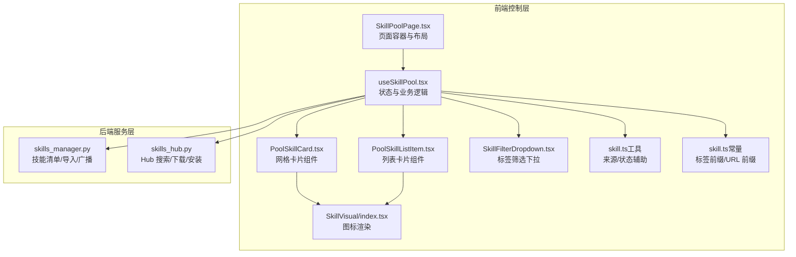
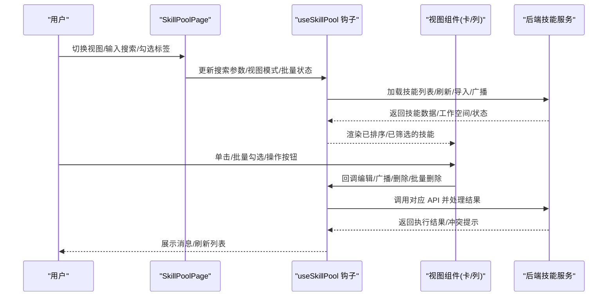
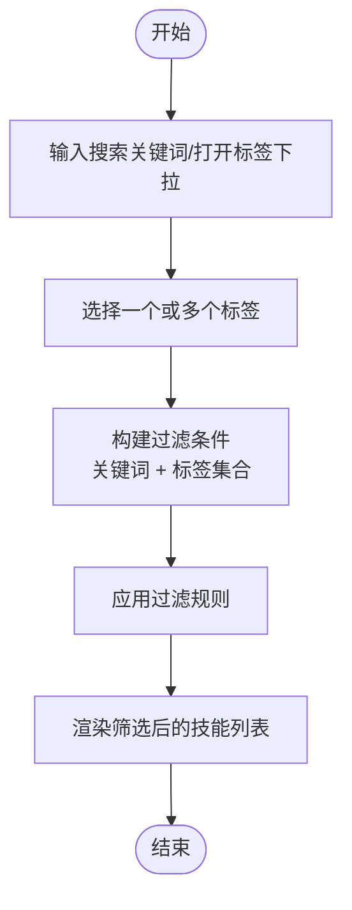
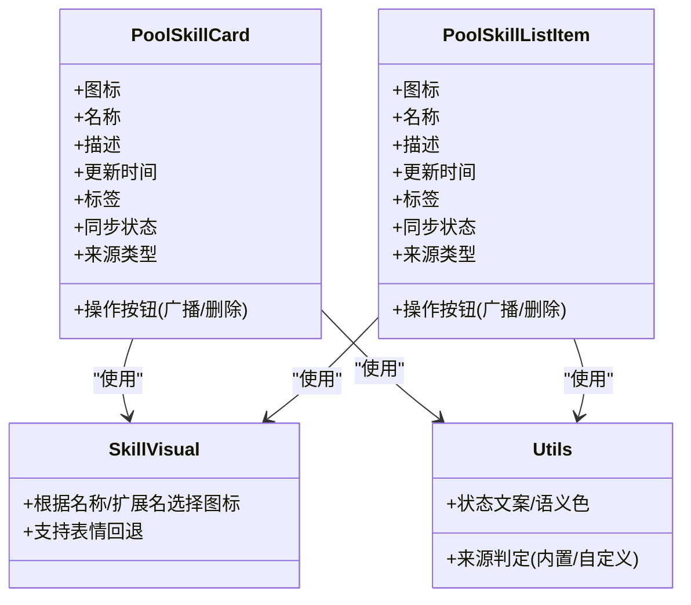
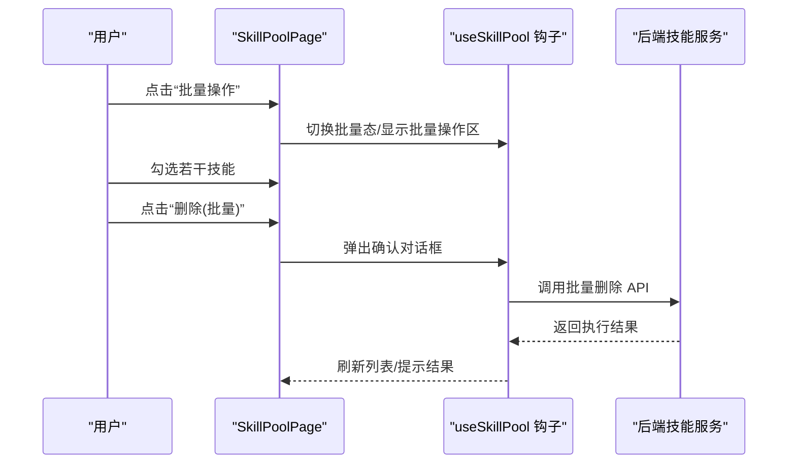
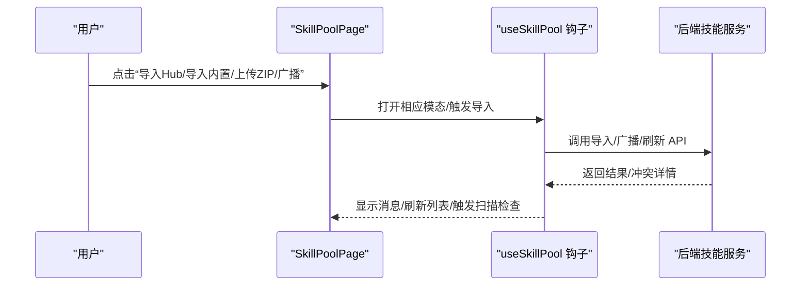
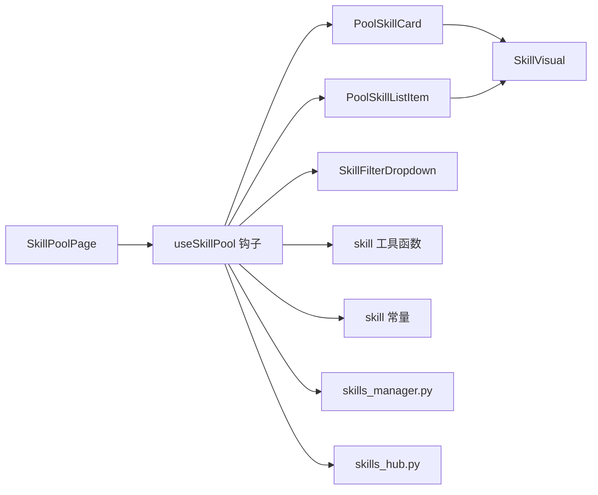

# 技能浏览与搜索

<cite>
**本文引用的文件**
- [SkillPoolPage.tsx](file://console/src/pages/Settings/SkillPool/index.tsx)
- [useSkillPool.tsx](file://console/src/pages/Settings/SkillPool/useSkillPool.tsx)
- [PoolSkillCard.tsx](file://console/src/pages/Settings/SkillPool/components/PoolSkillCard.tsx)
- [PoolSkillListItem.tsx](file://console/src/pages/Settings/SkillPool/components/PoolSkillListItem.tsx)
- [SkillFilterDropdown.tsx](file://console/src/pages/Agent/Skills/components/SkillFilterDropdown.tsx)
- [SkillVisual/index.tsx](file://console/src/components/SkillVisual/index.tsx)
- [skill.ts](file://console/src/utils/skill.ts)
- [skill.ts（常量）](file://console/src/constants/skill.ts)
- [skills_hub.py](file://src/copaw/agents/skills_hub.py)
- [skills_manager.py](file://src/copaw/agents/skills_manager.py)
</cite>

## 目录
1. [简介](#简介)
2. [项目结构](#项目结构)
3. [核心组件](#核心组件)
4. [架构总览](#架构总览)
5. [详细组件分析](#详细组件分析)
6. [依赖分析](#依赖分析)
7. [性能考虑](#性能考虑)
8. [故障排查指南](#故障排查指南)
9. [结论](#结论)

## 简介
本指南面向使用者，系统讲解“技能池”页面中的“技能浏览与搜索”功能，包括：
- 在网格视图与列表视图之间切换
- 按名称与标签进行搜索
- 技能卡片展示的信息项说明（图标、名称、描述、启用状态、来源类型等）
- 排序与筛选规则
- 批量选择、全选、清空选择与批量删除的操作流程

## 项目结构
技能浏览与搜索功能主要由前端页面与状态管理模块构成，并通过后端技能服务与技能中心（Hub）交互。

**图表来源**
- [SkillPoolPage.tsx:30-290](file://console/src/pages/Settings/SkillPool/index.tsx#L30-L290)
- [useSkillPool.tsx:25-806](file://console/src/pages/Settings/SkillPool/useSkillPool.tsx#L25-L806)
- [PoolSkillCard.tsx:1-161](file://console/src/pages/Settings/SkillPool/components/PoolSkillCard.tsx#L1-L161)
- [PoolSkillListItem.tsx:1-113](file://console/src/pages/Settings/SkillPool/components/PoolSkillListItem.tsx#L1-L113)
- [SkillFilterDropdown.tsx:1-55](file://console/src/pages/Agent/Skills/components/SkillFilterDropdown.tsx#L1-L55)
- [SkillVisual/index.tsx:1-115](file://console/src/components/SkillVisual/index.tsx#L1-L115)
- [skill.ts:1-42](file://console/src/utils/skill.ts#L1-L42)
- [skill.ts（常量）:1-21](file://console/src/constants/skill.ts#L1-L21)
- [skills_manager.py:1-800](file://src/copaw/agents/skills_manager.py#L1-L800)
- [skills_hub.py:1-800](file://src/copaw/agents/skills_hub.py#L1-L800)

**章节来源**
- [SkillPoolPage.tsx:30-290](file://console/src/pages/Settings/SkillPool/index.tsx#L30-L290)
- [useSkillPool.tsx:25-806](file://console/src/pages/Settings/SkillPool/useSkillPool.tsx#L25-L806)

## 核心组件
- 页面容器：负责顶部工具栏、视图切换、搜索输入、批量操作区、内容区域的布局与渲染。
- 状态钩子：统一管理技能数据、工作空间、加载状态、视图模式、搜索查询与标签筛选、批量选择集合等。
- 视图组件：网格卡片与列表条目，分别以卡片或列表形式展示技能信息，并支持悬停/批量态下的操作按钮。
- 筛选组件：下拉式标签筛选器，支持多选标签过滤。
- 图标组件：根据技能名称或文件扩展名自动匹配合适的图标。
- 工具函数：判断技能来源（内置/自定义）、同步状态文案与语义色、标签前缀识别等。
- 后端交互：技能池列表、刷新、导入内置、上传ZIP、从Hub导入、广播到工作空间、批量删除等。

**章节来源**
- [PoolSkillCard.tsx:1-161](file://console/src/pages/Settings/SkillPool/components/PoolSkillCard.tsx#L1-L161)
- [PoolSkillListItem.tsx:1-113](file://console/src/pages/Settings/SkillPool/components/PoolSkillListItem.tsx#L1-L113)
- [SkillFilterDropdown.tsx:1-55](file://console/src/pages/Agent/Skills/components/SkillFilterDropdown.tsx#L1-L55)
- [SkillVisual/index.tsx:1-115](file://console/src/components/SkillVisual/index.tsx#L1-L115)
- [skill.ts:1-42](file://console/src/utils/skill.ts#L1-L42)
- [skill.ts（常量）:1-21](file://console/src/constants/skill.ts#L1-L21)

## 架构总览
技能浏览与搜索的端到端流程如下：

**图表来源**
- [SkillPoolPage.tsx:30-290](file://console/src/pages/Settings/SkillPool/index.tsx#L30-L290)
- [useSkillPool.tsx:108-147](file://console/src/pages/Settings/SkillPool/useSkillPool.tsx#L108-L147)
- [PoolSkillCard.tsx:38-160](file://console/src/pages/Settings/SkillPool/components/PoolSkillCard.tsx#L38-L160)
- [PoolSkillListItem.tsx:37-112](file://console/src/pages/Settings/SkillPool/components/PoolSkillListItem.tsx#L37-L112)

## 详细组件分析

### 浏览与视图切换
- 支持两种视图：网格卡片（card）与列表条目（list）。点击顶部的切换按钮即可在两者间切换。
- 切换时，页面会渲染对应的子组件，保持相同的技能数据源与交互行为。
- 批量模式开启时，所有条目均显示复选框，便于批量选择。

**章节来源**
- [SkillPoolPage.tsx:181-201](file://console/src/pages/Settings/SkillPool/index.tsx#L181-L201)
- [PoolSkillCard.tsx:66-74](file://console/src/pages/Settings/SkillPool/components/PoolSkillCard.tsx#L66-L74)
- [PoolSkillListItem.tsx:51-58](file://console/src/pages/Settings/SkillPool/components/PoolSkillListItem.tsx#L51-L58)

### 搜索与筛选
- 名称搜索：顶部搜索框支持输入文本作为关键词，用于匹配技能名称。
- 标签筛选：使用多选下拉，标签值以特定前缀标识（例如 tag:），避免与普通文本混淆。
- 下拉菜单：展示全部可选标签，点击切换选中状态；选中后即参与过滤。
- 过滤生效：搜索关键词与标签集合共同作用于技能列表，最终在页面中呈现筛选结果。

**图表来源**
- [SkillPoolPage.tsx:155-179](file://console/src/pages/Settings/SkillPool/index.tsx#L155-L179)
- [SkillFilterDropdown.tsx:22-26](file://console/src/pages/Agent/Skills/components/SkillFilterDropdown.tsx#L22-L26)
- [useSkillPool.tsx:60-63](file://console/src/pages/Settings/SkillPool/useSkillPool.tsx#L60-L63)

**章节来源**
- [SkillPoolPage.tsx:155-179](file://console/src/pages/Settings/SkillPool/index.tsx#L155-L179)
- [SkillFilterDropdown.tsx:1-55](file://console/src/pages/Agent/Skills/components/SkillFilterDropdown.tsx#L1-L55)
- [skill.ts（常量）:19-21](file://console/src/constants/skill.ts#L19-L21)

### 技能卡片信息说明
- 图标：根据技能名称或文件扩展名自动匹配图标；若提供表情则优先显示。
- 名称：显示技能名称；内置/自定义来源以徽标形式标注。
- 描述：显示技能描述，未设置时显示占位符。
- 更新时间：显示最近更新的相对时间。
- 标签：显示技能的标签集合，为空时显示占位符。
- 同步状态：内置技能的同步状态（如“已更新/已过期”）以状态点与文案表示。
- 操作按钮：在悬停或批量模式下可见，支持广播与删除。

**图表来源**
- [PoolSkillCard.tsx:56-130](file://console/src/pages/Settings/SkillPool/components/PoolSkillCard.tsx#L56-L130)
- [PoolSkillListItem.tsx:60-84](file://console/src/pages/Settings/SkillPool/components/PoolSkillListItem.tsx#L60-L84)
- [SkillVisual/index.tsx:13-97](file://console/src/components/SkillVisual/index.tsx#L13-L97)
- [skill.ts:6-41](file://console/src/utils/skill.ts#L6-L41)

**章节来源**
- [PoolSkillCard.tsx:56-130](file://console/src/pages/Settings/SkillPool/components/PoolSkillCard.tsx#L56-L130)
- [PoolSkillListItem.tsx:60-84](file://console/src/pages/Settings/SkillPool/components/PoolSkillListItem.tsx#L60-L84)
- [SkillVisual/index.tsx:1-115](file://console/src/components/SkillVisual/index.tsx#L1-L115)
- [skill.ts:1-42](file://console/src/utils/skill.ts#L1-L42)

### 排序与筛选规则
- 排序：技能列表按名称进行本地排序（升序）。
- 筛选：基于关键词与标签集合进行过滤；关键词与标签同时存在时，需同时满足才会被保留。
- 分类：页面还提供“全部分类”的统计集合，便于理解标签分布。

**章节来源**
- [useSkillPool.tsx:60-63](file://console/src/pages/Settings/SkillPool/useSkillPool.tsx#L60-L63)
- [useSkillPool.tsx:65-73](file://console/src/pages/Settings/SkillPool/useSkillPool.tsx#L65-L73)

### 批量操作
- 开启批量模式：点击“批量操作”按钮进入批量态，所有条目显示复选框。
- 全选：在批量态下，一键勾选当前筛选结果中的全部技能。
- 清空选择：清空已选集合并退出批量态。
- 批量删除：在批量态下，选择若干技能后点击“删除”，弹出确认对话框，确认后执行批量删除并刷新列表。

**图表来源**
- [SkillPoolPage.tsx:52-79](file://console/src/pages/Settings/SkillPool/index.tsx#L52-L79)
- [useSkillPool.tsx:75-98](file://console/src/pages/Settings/SkillPool/useSkillPool.tsx#L75-L98)
- [useSkillPool.tsx:700-746](file://console/src/pages/Settings/SkillPool/useSkillPool.tsx#L700-L746)

**章节来源**
- [SkillPoolPage.tsx:52-79](file://console/src/pages/Settings/SkillPool/index.tsx#L52-L79)
- [useSkillPool.tsx:75-98](file://console/src/pages/Settings/SkillPool/useSkillPool.tsx#L75-L98)
- [useSkillPool.tsx:700-746](file://console/src/pages/Settings/SkillPool/useSkillPool.tsx#L700-L746)

### 导入与广播
- 从Hub导入：支持从外部Hub地址导入技能包，自动处理重名冲突与扫描告警。
- 广播到工作空间：将技能从技能池广播到一个或多个工作空间，支持重命名映射与覆盖升级。
- 导入内置：从内置源批量导入技能，支持覆盖冲突处理。
- ZIP上传：支持上传ZIP压缩包，自动解压并导入，处理冲突与扫描告警。

**图表来源**
- [SkillPoolPage.tsx:111-143](file://console/src/pages/Settings/SkillPool/index.tsx#L111-L143)
- [useSkillPool.tsx:176-191](file://console/src/pages/Settings/SkillPool/useSkillPool.tsx#L176-L191)
- [useSkillPool.tsx:248-390](file://console/src/pages/Settings/SkillPool/useSkillPool.tsx#L248-L390)
- [useSkillPool.tsx:392-463](file://console/src/pages/Settings/SkillPool/useSkillPool.tsx#L392-L463)
- [useSkillPool.tsx:577-652](file://console/src/pages/Settings/SkillPool/useSkillPool.tsx#L577-L652)
- [useSkillPool.tsx:654-698](file://console/src/pages/Settings/SkillPool/useSkillPool.tsx#L654-L698)

**章节来源**
- [SkillPoolPage.tsx:111-143](file://console/src/pages/Settings/SkillPool/index.tsx#L111-L143)
- [useSkillPool.tsx:176-191](file://console/src/pages/Settings/SkillPool/useSkillPool.tsx#L176-L191)
- [useSkillPool.tsx:248-390](file://console/src/pages/Settings/SkillPool/useSkillPool.tsx#L248-L390)
- [useSkillPool.tsx:392-463](file://console/src/pages/Settings/SkillPool/useSkillPool.tsx#L392-L463)
- [useSkillPool.tsx:577-652](file://console/src/pages/Settings/SkillPool/useSkillPool.tsx#L577-L652)
- [useSkillPool.tsx:654-698](file://console/src/pages/Settings/SkillPool/useSkillPool.tsx#L654-L698)

## 依赖分析
- 前端依赖：页面容器依赖状态钩子；视图组件依赖图标与工具函数；筛选组件依赖标签前缀常量。
- 后端依赖：技能池操作依赖技能管理与Hub客户端；导入/广播涉及安全扫描与冲突处理。

**图表来源**
- [SkillPoolPage.tsx:30-290](file://console/src/pages/Settings/SkillPool/index.tsx#L30-L290)
- [useSkillPool.tsx:25-806](file://console/src/pages/Settings/SkillPool/useSkillPool.tsx#L25-L806)
- [PoolSkillCard.tsx:1-161](file://console/src/pages/Settings/SkillPool/components/PoolSkillCard.tsx#L1-L161)
- [PoolSkillListItem.tsx:1-113](file://console/src/pages/Settings/SkillPool/components/PoolSkillListItem.tsx#L1-L113)
- [SkillFilterDropdown.tsx:1-55](file://console/src/pages/Agent/Skills/components/SkillFilterDropdown.tsx#L1-L55)
- [SkillVisual/index.tsx:1-115](file://console/src/components/SkillVisual/index.tsx#L1-L115)
- [skill.ts:1-42](file://console/src/utils/skill.ts#L1-L42)
- [skill.ts（常量）:1-21](file://console/src/constants/skill.ts#L1-L21)
- [skills_manager.py:1-800](file://src/copaw/agents/skills_manager.py#L1-L800)
- [skills_hub.py:1-800](file://src/copaw/agents/skills_hub.py#L1-L800)

**章节来源**
- [useSkillPool.tsx:25-806](file://console/src/pages/Settings/SkillPool/useSkillPool.tsx#L25-L806)
- [skills_manager.py:1-800](file://src/copaw/agents/skills_manager.py#L1-L800)
- [skills_hub.py:1-800](file://src/copaw/agents/skills_hub.py#L1-L800)

## 性能考虑
- 列表渲染：使用渐进渲染（哨兵节点）提升大数据量下的滚动性能。
- 本地过滤：关键词与标签过滤在前端完成，减少不必要的网络请求。
- 缓存失效：在导入/广播/删除等操作后主动失效缓存并重新加载，确保UI与后端一致。
- 扫描检查：导入/广播后进行安全扫描提示，避免阻塞主线程。

[本节为通用建议，不直接分析具体文件]

## 故障排查指南
- 导入失败/冲突：当出现同名冲突或扫描告警时，系统会弹窗提示并允许重命名或覆盖；请根据提示完成确认后再试。
- ZIP大小限制：上传ZIP时超过限制会提示超出大小；请压缩后重试。
- Hub访问问题：导入Hub时可能遇到网络超时/限流；请检查网络或配置令牌后重试。
- 广播失败：目标工作空间存在冲突时，系统会引导完成重命名映射；确认后再次尝试。

**章节来源**
- [useSkillPool.tsx:587-596](file://console/src/pages/Settings/SkillPool/useSkillPool.tsx#L587-L596)
- [useSkillPool.tsx:626-651](file://console/src/pages/Settings/SkillPool/useSkillPool.tsx#L626-L651)
- [useSkillPool.tsx:266-281](file://console/src/pages/Settings/SkillPool/useSkillPool.tsx#L266-L281)
- [useSkillPool.tsx:340-348](file://console/src/pages/Settings/SkillPool/useSkillPool.tsx#L340-L348)

## 结论
技能池的浏览与搜索功能提供了直观、高效的技能管理体验：通过视图切换、关键词+标签组合筛选、以及批量操作，用户可以快速定位、管理与分发技能。配合后端的Hub导入、内置源导入与广播能力，形成完整的技能生态闭环。