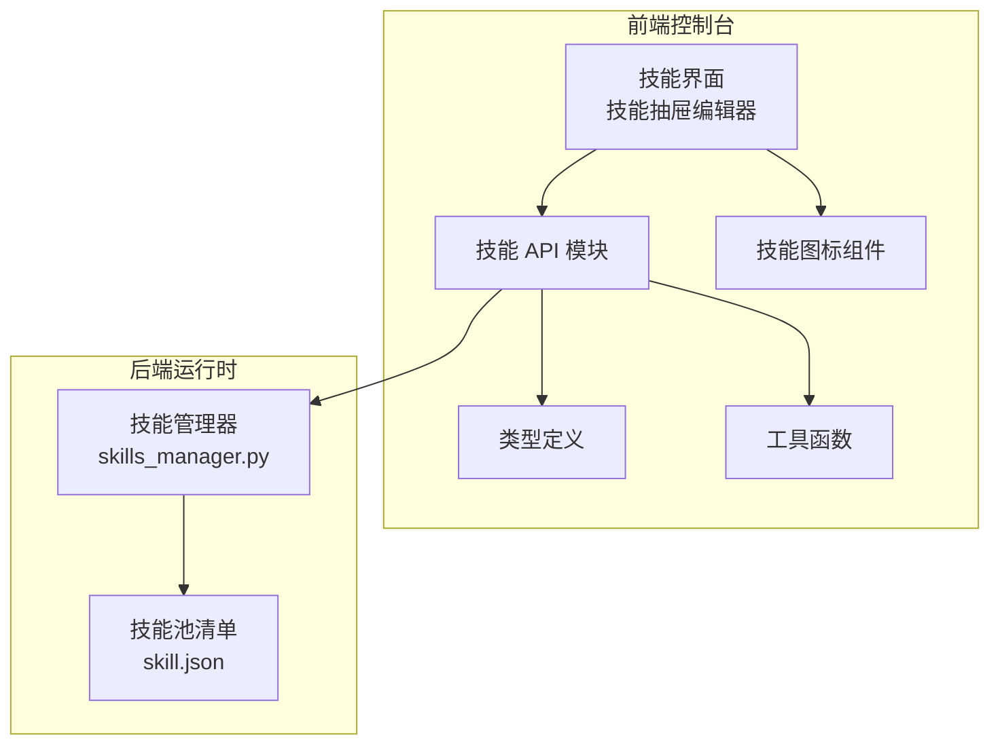
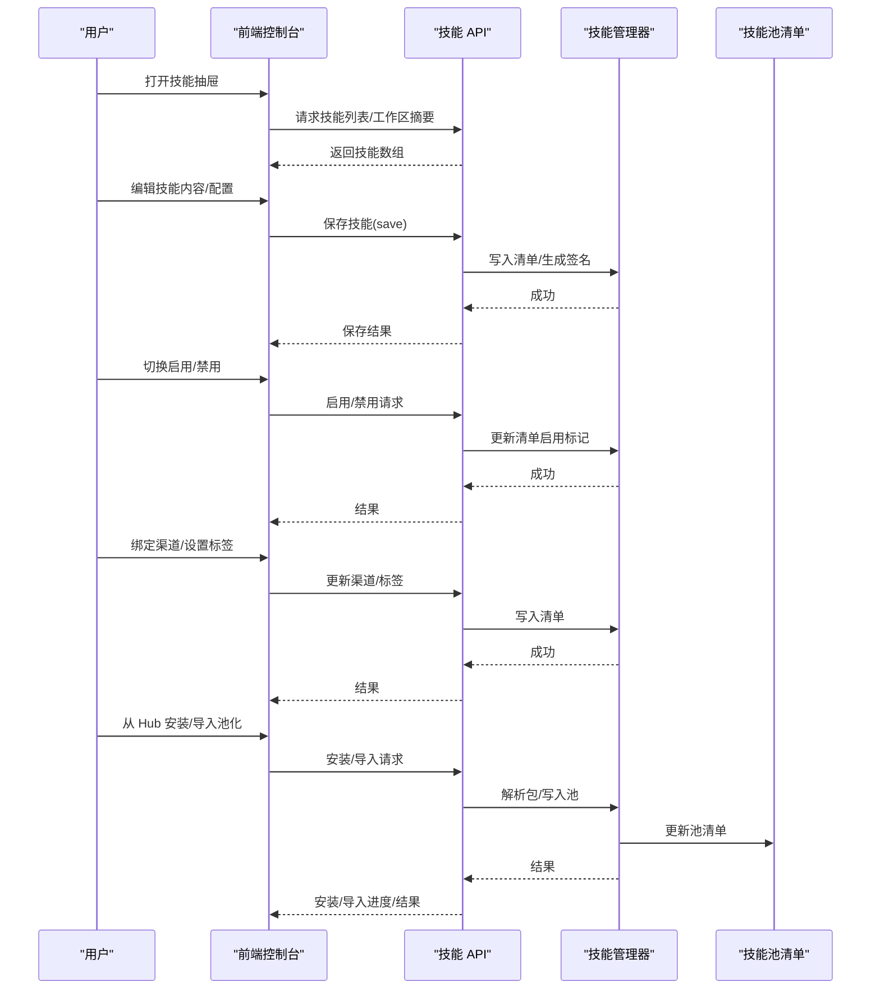
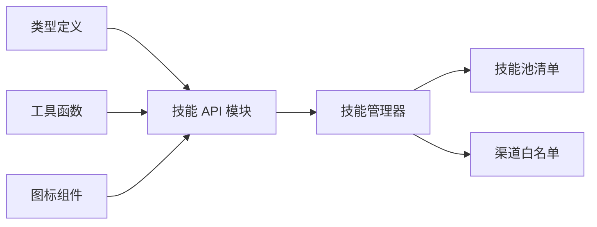

# 技能配置与管理

<cite>
**本文引用的文件**
- [console/src/api/modules/skill.ts](file://console/src/api/modules/skill.ts)
- [console/src/constants/skill.ts](file://console/src/constants/skill.ts)
- [console/src/utils/skill.ts](file://console/src/utils/skill.ts)
- [console/src/components/SkillVisual/index.tsx](file://console/src/components/SkillVisual/index.tsx)
- [console/src/api/types/skill.ts](file://console/src/api/types/skill.ts)
- [src/copaw/agents/skills_manager.py](file://src/copaw/agents/skills_manager.py)
- [working/skill_pool/skill.json](file://working/skill_pool/skill.json)
</cite>

## 目录
1. [简介](#简介)
2. [项目结构](#项目结构)
3. [核心组件](#核心组件)
4. [架构总览](#架构总览)
5. [详细组件分析](#详细组件分析)
6. [依赖关系分析](#依赖关系分析)
7. [性能考量](#性能考量)
8. [故障排查指南](#故障排查指南)
9. [结论](#结论)
10. [附录](#附录)

## 简介
本指南面向“技能配置与管理”的完整操作流程，覆盖技能抽屉编辑器的使用方法、技能基本信息与内容编辑、配置参数调整、启用/禁用切换、渠道绑定、标签分类、删除/重命名/复制、版本管理与变更历史、配置验证等高级功能。读者无需深入技术背景即可按步骤完成日常运维与管理任务。

## 项目结构
技能系统由前端控制台与后端运行时共同组成：
- 前端控制台通过 API 模块封装技能列表、刷新、保存、启用/禁用、批量操作、上传、池化导入/导出、渠道与标签更新、配置读写、AI 优化等能力。
- 后端运行时负责技能清单解析、签名校验、冲突检测、环境变量注入、工作区与技能池的同步与版本管理。
- 技能池清单用于记录内置/自定义技能元数据、版本号、签名、更新时间等信息。

图表来源
- [console/src/api/modules/skill.ts:112-551](file://console/src/api/modules/skill.ts#L112-L551)
- [console/src/api/types/skill.ts:8-85](file://console/src/api/types/skill.ts#L8-L85)
- [console/src/utils/skill.ts:6-42](file://console/src/utils/skill.ts#L6-L42)
- [console/src/components/SkillVisual/index.tsx:13-97](file://console/src/components/SkillVisual/index.tsx#L13-L97)
- [src/copaw/agents/skills_manager.py:119-168](file://src/copaw/agents/skills_manager.py#L119-L168)
- [working/skill_pool/skill.json:1-370](file://working/skill_pool/skill.json#L1-L370)

章节来源
- [console/src/api/modules/skill.ts:112-551](file://console/src/api/modules/skill.ts#L112-L551)
- [console/src/api/types/skill.ts:8-85](file://console/src/api/types/skill.ts#L8-L85)
- [src/copaw/agents/skills_manager.py:119-168](file://src/copaw/agents/skills_manager.py#L119-L168)
- [working/skill_pool/skill.json:1-370](file://working/skill_pool/skill.json#L1-L370)

## 核心组件
- 技能 API 模块：提供技能 CRUD、批量操作、上传下载、渠道/标签/配置更新、AI 优化、Hub 安装与状态查询等接口。
- 类型定义：统一技能规格、池技能规格、工作区技能摘要、内置导入候选、Hub 技能与安装任务响应的数据结构。
- 工具函数：来源识别、内置判断、池同步状态展示辅助。
- 图标组件：根据技能名或文件扩展名渲染对应图标。
- 技能管理器：负责工作区与技能池的目录结构、清单读写、签名计算、冲突检测、环境变量注入、内置/自定义分类等。
- 技能池清单：记录内置/自定义技能元数据、版本文本、签名、更新时间等。

章节来源
- [console/src/api/modules/skill.ts:112-551](file://console/src/api/modules/skill.ts#L112-L551)
- [console/src/api/types/skill.ts:8-85](file://console/src/api/types/skill.ts#L8-L85)
- [console/src/utils/skill.ts:6-42](file://console/src/utils/skill.ts#L6-L42)
- [console/src/components/SkillVisual/index.tsx:13-97](file://console/src/components/SkillVisual/index.tsx#L13-L97)
- [src/copaw/agents/skills_manager.py:119-168](file://src/copaw/agents/skills_manager.py#L119-L168)
- [working/skill_pool/skill.json:1-370](file://working/skill_pool/skill.json#L1-L370)

## 架构总览
技能配置与管理的端到端流程如下：
- 列表与刷新：前端拉取技能列表与工作区技能摘要，支持按代理刷新。
- 编辑与保存：编辑技能内容与配置，保存为新版本或重命名。
- 启用/禁用：按技能切换启用状态，支持批量。
- 渠道绑定与标签：更新技能可用渠道与标签集合。
- 配置管理：读取/更新/删除技能配置，支持环境变量注入。
- 版本与变更：基于清单记录版本文本、签名与更新时间，支持 AI 优化建议。
- 池化与 Hub：从 Hub 安装技能、导入内置、导出到工作区、批量下载/上传。

图表来源
- [console/src/api/modules/skill.ts:113-551](file://console/src/api/modules/skill.ts#L113-L551)
- [src/copaw/agents/skills_manager.py:377-446](file://src/copaw/agents/skills_manager.py#L377-L446)
- [working/skill_pool/skill.json:1-370](file://working/skill_pool/skill.json#L1-L370)

## 详细组件分析

### 技能抽屉编辑器与表单字段
- 字段说明
  - 名称：技能稳定运行标识，通常与目录/清单键一致，不可随意更改。
  - 描述：技能用途与限制说明，影响展示与搜索。
  - 内容：技能实现内容（如脚本、规则、提示词等），支持上传压缩包或直接编辑。
  - 通道设置：限定技能可在哪些渠道生效（如 console、telegram、dingtalk 等）。
  - 标签：用于分类筛选与搜索的关键词集合。
  - 配置：技能运行时的参数字典，可注入环境变量并受需求声明约束。
  - 启用状态：控制技能是否参与调度。
- 操作步骤
  - 新建：填写名称与内容，选择初始启用状态，保存。
  - 修改：编辑内容与配置，保存即生成新版本。
  - 删除：确认删除并清理相关配置与渠道绑定。
  - 复制/重命名：通过保存接口的重命名模式实现。
  - 渠道绑定：更新 channels 列表。
  - 标签分类：更新 tags 列表。
  - 配置验证：通过配置读取/更新接口进行校验；必要时结合 AI 优化建议。

章节来源
- [console/src/api/types/skill.ts:8-36](file://console/src/api/types/skill.ts#L8-L36)
- [console/src/api/modules/skill.ts:179-208](file://console/src/api/modules/skill.ts#L179-L208)
- [console/src/api/modules/skill.ts:383-428](file://console/src/api/modules/skill.ts#L383-L428)

### 启用/禁用切换与批量操作
- 单个技能启停：调用启用/禁用接口。
- 批量启停：提交技能名称数组，服务端原子处理。
- 注意事项：批量操作失败项会返回原因，便于逐项修复。

章节来源
- [console/src/api/modules/skill.ts:235-257](file://console/src/api/modules/skill.ts#L235-L257)

### 渠道绑定与标签分类
- 渠道绑定：更新技能的 channels 列表，确保与运行时路由一致。
- 标签分类：更新 tags 列表，支持使用标签过滤与搜索。
- 内置渠道白名单：系统维护通用渠道列表，避免非法值。

章节来源
- [console/src/api/modules/skill.ts:383-408](file://console/src/api/modules/skill.ts#L383-L408)
- [src/copaw/agents/skills_manager.py:47-58](file://src/copaw/agents/skills_manager.py#L47-L58)

### 配置参数调整与验证
- 读取配置：获取技能当前配置字典。
- 更新配置：提交新的配置对象，服务端写入并触发环境变量注入。
- 删除配置：清空技能配置。
- 验证要点：配置键需与技能声明的需求项匹配；未提供的必需项会记录警告。
- 环境变量注入：满足需求声明的键会被注入为环境变量，完整配置也会作为 JSON 字符串注入。

章节来源
- [console/src/api/modules/skill.ts:410-448](file://console/src/api/modules/skill.ts#L410-L448)
- [src/copaw/agents/skills_manager.py:583-711](file://src/copaw/agents/skills_manager.py#L583-L711)

### 技能删除、重命名、复制
- 删除：调用删除接口，清理清单与相关资源。
- 重命名/复制：通过保存接口的重命名模式实现，服务端生成新名称并保留内容。
- 批量删除：提交名称数组，返回每项结果与原因。

章节来源
- [console/src/api/modules/skill.ts:267-270](file://console/src/api/modules/skill.ts#L267-L270)
- [console/src/api/modules/skill.ts:195-208](file://console/src/api/modules/skill.ts#L195-L208)
- [console/src/api/modules/skill.ts:251-257](file://console/src/api/modules/skill.ts#L251-L257)

### 版本管理与变更历史
- 版本字段：技能清单包含版本文本与更新时间，用于追踪变更。
- 签名机制：基于技能树内容计算签名，用于池化同步与冲突检测。
- 冲突处理：当池中内置与打包内置不一致时，标记为自定义以保留用户修改。
- 时间戳命名：导入冲突时提供带时间戳的重命名建议。

章节来源
- [working/skill_pool/skill.json:1-370](file://working/skill_pool/skill.json#L1-L370)
- [src/copaw/agents/skills_manager.py:273-291](file://src/copaw/agents/skills_manager.py#L273-L291)
- [src/copaw/agents/skills_manager.py:407-446](file://src/copaw/agents/skills_manager.py#L407-L446)
- [src/copaw/agents/skills_manager.py:748-769](file://src/copaw/agents/skills_manager.py#L748-L769)

### 配置验证与安全扫描
- 配置验证：通过读取/更新/删除配置接口进行校验。
- 安全扫描：导入/保存技能时进行目录扫描，防止恶意内容。
- 环境变量注入：严格遵循需求声明，缺失项会记录警告。

章节来源
- [console/src/api/modules/skill.ts:410-448](file://console/src/api/modules/skill.ts#L410-L448)
- [src/copaw/agents/skills_manager.py:27-28](file://src/copaw/agents/skills_manager.py#L27-L28)
- [src/copaw/agents/skills_manager.py:583-711](file://src/copaw/agents/skills_manager.py#L583-L711)

### 技能池化与 Hub 集成
- Hub 技能安装：发起安装任务，轮询状态，支持取消。
- 池化导入：从 Hub 或本地压缩包导入技能至技能池。
- 池化导出：将技能池中的技能批量下载到工作区，支持覆盖与重命名。
- 内置导入：批量导入内置技能，处理冲突与版本差异。
- 池同步状态：显示“已同步/已过期/未同步/冲突”等状态，便于维护。

章节来源
- [console/src/api/modules/skill.ts:272-311](file://console/src/api/modules/skill.ts#L272-L311)
- [console/src/api/modules/skill.ts:316-347](file://console/src/api/modules/skill.ts#L316-L347)
- [console/src/api/modules/skill.ts:349-381](file://console/src/api/modules/skill.ts#L349-L381)
- [console/src/constants/skill.ts:3-15](file://console/src/constants/skill.ts#L3-L15)
- [console/src/utils/skill.ts:16-41](file://console/src/utils/skill.ts#L16-L41)

### 技能可视化与图标
- 图标选择：根据技能名或文件扩展名渲染 Ant Design 图标，支持多种文件类型与常用技能名。
- 表情符号回退：若未提供表情符号，则回退为文件类型图标。

章节来源
- [console/src/components/SkillVisual/index.tsx:13-97](file://console/src/components/SkillVisual/index.tsx#L13-L97)

## 依赖关系分析
- 前端 API 与类型：技能 API 模块依赖类型定义，工具函数与图标组件用于 UI 展示。
- 后端管理器与清单：技能管理器负责清单读写、签名计算、冲突检测；技能池清单提供元数据与版本信息。
- 渠道与路由：系统维护通用渠道白名单，确保技能仅在允许渠道生效。

图表来源
- [console/src/api/types/skill.ts:8-85](file://console/src/api/types/skill.ts#L8-L85)
- [console/src/api/modules/skill.ts:112-551](file://console/src/api/modules/skill.ts#L112-L551)
- [console/src/utils/skill.ts:6-42](file://console/src/utils/skill.ts#L6-L42)
- [console/src/components/SkillVisual/index.tsx:13-97](file://console/src/components/SkillVisual/index.tsx#L13-L97)
- [src/copaw/agents/skills_manager.py:47-58](file://src/copaw/agents/skills_manager.py#L47-L58)
- [working/skill_pool/skill.json:1-370](file://working/skill_pool/skill.json#L1-L370)

章节来源
- [console/src/api/modules/skill.ts:112-551](file://console/src/api/modules/skill.ts#L112-L551)
- [src/copaw/agents/skills_manager.py:47-58](file://src/copaw/agents/skills_manager.py#L47-L58)
- [working/skill_pool/skill.json:1-370](file://working/skill_pool/skill.json#L1-L370)

## 性能考量
- 列表缓存：前端对技能列表与工作区摘要采用短 TTL 缓存，减少重复请求。
- 压缩包大小限制：后端对导入压缩包进行大小与路径合法性检查，避免异常占用。
- 原子写入：清单更新采用临时文件与原子替换，保证并发安全。
- 环境变量注入：仅在满足需求声明时注入，避免不必要的环境污染。

章节来源
- [console/src/api/modules/skill.ts:16-61](file://console/src/api/modules/skill.ts#L16-L61)
- [src/copaw/agents/skills_manager.py:452-494](file://src/copaw/agents/skills_manager.py#L452-L494)
- [src/copaw/agents/skills_manager.py:352-387](file://src/copaw/agents/skills_manager.py#L352-L387)
- [src/copaw/agents/skills_manager.py:666-711](file://src/copaw/agents/skills_manager.py#L666-L711)

## 故障排查指南
- 安装/导入失败
  - 检查 Hub 地址前缀是否受支持。
  - 查看安装任务状态与错误信息，必要时取消并重试。
  - 关注冲突项与建议重命名。
- 启用/禁用异常
  - 确认技能名称正确且存在。
  - 查看批量操作返回的失败原因并逐项修复。
- 渠道/标签无效
  - 确保渠道在白名单内。
  - 标签应为纯文本关键词，避免特殊字符。
- 配置注入失败
  - 检查配置键是否与技能需求声明一致。
  - 未提供的必需键会记录警告，补齐后重试。
- 内容/签名不一致
  - 若池中内置与打包内置签名不同，系统会将其视为自定义以保留修改。
  - 导入冲突时使用时间戳建议名重命名。

章节来源
- [console/src/constants/skill.ts:3-15](file://console/src/constants/skill.ts#L3-L15)
- [console/src/api/modules/skill.ts:272-311](file://console/src/api/modules/skill.ts#L272-L311)
- [console/src/api/modules/skill.ts:245-257](file://console/src/api/modules/skill.ts#L245-L257)
- [console/src/api/modules/skill.ts:383-408](file://console/src/api/modules/skill.ts#L383-L408)
- [src/copaw/agents/skills_manager.py:583-711](file://src/copaw/agents/skills_manager.py#L583-L711)
- [src/copaw/agents/skills_manager.py:407-446](file://src/copaw/agents/skills_manager.py#L407-L446)
- [src/copaw/agents/skills_manager.py:748-769](file://src/copaw/agents/skills_manager.py#L748-L769)

## 结论
通过上述组件与流程，系统提供了完整的技能配置与管理能力：从前端编辑器到后端清单与签名校验，从渠道/标签到配置注入与 Hub 集成，覆盖了日常运维所需的全部关键环节。建议在变更前做好备份与测试，遵循配置验证与冲突处理的最佳实践，确保技能的稳定性与安全性。

## 附录
- 快速操作清单
  - 新建：填写名称/描述/内容，保存为新技能。
  - 编辑：修改内容/配置，保存生成新版本。
  - 启用/禁用：单个或批量切换。
  - 渠道绑定：更新 channels 列表。
  - 标签分类：更新 tags 列表。
  - 配置管理：读取/更新/删除配置。
  - 删除：确认删除并清理。
  - Hub 安装：发起安装任务并跟踪状态。
  - 池化导入/导出：从 Hub 或本地压缩包导入，或批量导出到工作区。
  - 版本与变更：查看版本文本、签名与更新时间，必要时使用 AI 优化建议。