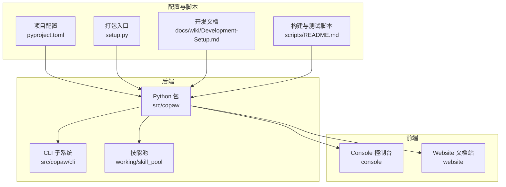
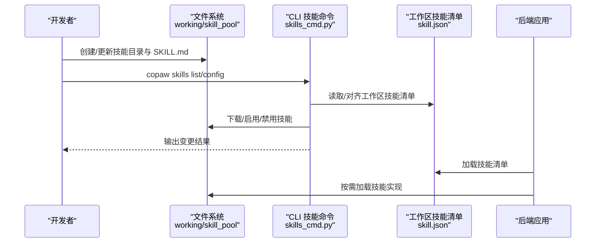
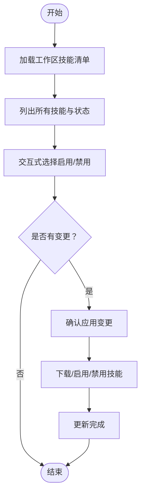
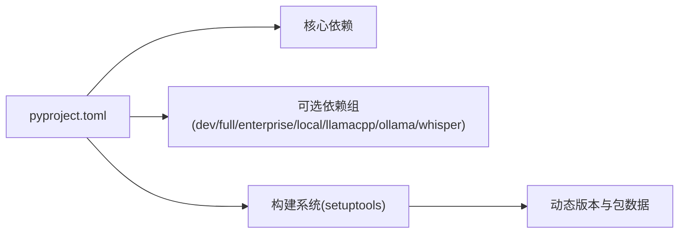

# 开发环境搭建

<cite>
**本文引用的文件**
- [pyproject.toml](file://pyproject.toml)
- [setup.py](file://setup.py)
- [src/copaw/__version__.py](file://src/copaw/__version__.py)
- [docs/wiki/Development-Setup.md](file://docs/wiki/Development-Setup.md)
- [scripts/README.md](file://scripts/README.md)
- [working/skill_pool/skill.json](file://working/skill_pool/skill.json)
- [working/skill_pool/browser_cdp/SKILL.md](file://working/skill_pool/browser_cdp/SKILL.md)
- [working/skill_pool/crm_sync/SKILL.md](file://working/skill_pool/crm_sync/SKILL.md)
- [working/skill_pool/cron/SKILL.md](file://working/skill_pool/cron/SKILL.md)
- [working/skill_pool/dingtalk_channel/SKILL.md](file://working/skill_pool/dingtalk_channel/SKILL.md)
- [working/skill_pool/pdf/SKILL.md](file://working/skill_pool/pdf/SKILL.md)
- [working/skill_pool/docx/SKILL.md](file://working/skill_pool/docx/SKILL.md)
- [src/copaw/cli/skills_cmd.py](file://src/copaw/cli/skills_cmd.py)
</cite>

## 目录
1. [引言](#引言)
2. [项目结构](#项目结构)
3. [核心组件](#核心组件)
4. [架构总览](#架构总览)
5. [详细组件分析](#详细组件分析)
6. [依赖分析](#依赖分析)
7. [性能考虑](#性能考虑)
8. [故障排查指南](#故障排查指南)
9. [结论](#结论)
10. [附录](#附录)

## 引言
本指南面向希望参与 CoPaw 技能开发的工程师与技术作者，提供从环境准备、依赖安装、技能目录结构与元数据规范，到开发模板与最佳实践的全流程说明。读者将学会：
- 搭建满足 Python 与前端构建要求的开发环境
- 理解技能清单与技能元数据的结构与作用
- 掌握 SKILL.md 的编写规范与必备字段
- 基于现有内置技能示例快速创建自定义技能
- 规范化地组织技能文件、命名与目录结构

## 项目结构
CoPaw 采用前后端分离与多模块组织方式：
- 后端 Python 包位于 src/copaw，包含代理、通道、路由、运行器、安全扫描等子系统
- 前端分为 Console 控制台与 Website 文档站，分别位于 console 与 website
- 技能资源集中于 working/skill_pool，每个技能以独立目录存放，包含 SKILL.md 与相关脚本
- 配置与脚本位于根目录的 pyproject.toml、scripts 与 docs/wiki

图表来源
- [pyproject.toml:1-124](file://pyproject.toml#L1-L124)
- [setup.py:1-5](file://setup.py#L1-L5)
- [docs/wiki/Development-Setup.md:1-457](file://docs/wiki/Development-Setup.md#L1-L457)
- [scripts/README.md:1-53](file://scripts/README.md#L1-L53)

章节来源
- [pyproject.toml:1-124](file://pyproject.toml#L1-L124)
- [docs/wiki/Development-Setup.md:1-457](file://docs/wiki/Development-Setup.md#L1-L457)

## 核心组件
- 项目配置与依赖
  - pyproject.toml 定义项目元数据、Python 版本范围、核心依赖与可选依赖组（dev、full、local、llamacpp、ollama、whisper、enterprise 等）
  - setup.py 作为打包入口，配合动态版本号
- 技能清单与技能池
  - working/skill_pool/skill.json 是技能清单，记录内置技能名称、版本、签名、依赖等
  - working/skill_pool/<技能名>/SKILL.md 描述技能能力、触发条件、使用示例与注意事项
- CLI 技能管理
  - src/copaw/cli/skills_cmd.py 提供技能列表、交互式启用/禁用、工作区技能清单对齐等功能

章节来源
- [pyproject.toml:1-124](file://pyproject.toml#L1-L124)
- [working/skill_pool/skill.json:1-370](file://working/skill_pool/skill.json#L1-L370)
- [src/copaw/cli/skills_cmd.py:1-275](file://src/copaw/cli/skills_cmd.py#L1-L275)

## 架构总览
下图展示了技能开发与运行的关键流程：开发者在本地创建/更新技能目录与 SKILL.md，通过 CLI 对工作区进行技能清单对齐与启用，后端根据技能清单加载对应能力。

图表来源
- [src/copaw/cli/skills_cmd.py:120-275](file://src/copaw/cli/skills_cmd.py#L120-L275)
- [working/skill_pool/skill.json:1-370](file://working/skill_pool/skill.json#L1-L370)

## 详细组件分析

### 环境与依赖要求
- Python 版本
  - 要求 Python 3.10 - 3.13，确保兼容性与新特性支持
- 前端构建
  - Node.js 18+（用于 Console 与 Website 构建）
- 可选依赖
  - 可选依赖组覆盖本地模型（local、llamacpp、mlx）、推理引擎（ollama）、语音识别（whisper）与企业版依赖（enterprise）
- 开发依赖
  - dev 组包含 pytest、pytest-asyncio、pre-commit、pytest-cov、hypothesis 等，便于测试与质量保障

章节来源
- [docs/wiki/Development-Setup.md:7-24](file://docs/wiki/Development-Setup.md#L7-L24)
- [pyproject.toml:6,73-116](file://pyproject.toml#L6,L73-L116)

### 安装与初始化流程
- 创建虚拟环境（venv/conda/uv 均可）
- 安装基础依赖与可选依赖（如 full、llamacpp、ollama、whisper）
- 构建前端（Console）并将产物复制至后端包内
- 初始化配置并启动应用

章节来源
- [docs/wiki/Development-Setup.md:27-118](file://docs/wiki/Development-Setup.md#L27-L118)

### 技能目录结构与清单
- 技能池结构
  - working/skill_pool/<技能名>/SKILL.md：技能说明与使用指南
  - working/skill_pool/skill.json：技能清单，包含技能元数据、版本、签名、依赖与更新时间
- 工作区技能清单
  - 工作区内的 skill.json 由 CLI 对齐，决定当前启用的技能集合

章节来源
- [working/skill_pool/skill.json:1-370](file://working/skill_pool/skill.json#L1-L370)
- [src/copaw/cli/skills_cmd.py:120-211](file://src/copaw/cli/skills_cmd.py#L120-L211)

### SKILL.md 编写规范与元数据字段
- 必备字段
  - name：技能唯一标识
  - description：技能简述，用于技能池展示与检索
- 可选元数据
  - metadata.builtin_skill_version：内置技能版本
  - metadata.copaw.emoji：用于界面显示的表情符号
  - metadata.copaw.requires：技能运行时的额外要求（示例见内置技能）
  - license：技能许可声明（如适用）
- 内容组织建议
  - 场景说明：何时使用、何时不使用
  - 触发条件：用户意图与关键词
  - 使用示例：典型动作与参数
  - 注意事项：隐私、安全、单实例限制等
  - 常见问题与排障

章节来源
- [working/skill_pool/browser_cdp/SKILL.md:1-182](file://working/skill_pool/browser_cdp/SKILL.md#L1-L182)
- [working/skill_pool/cron/SKILL.md:1-205](file://working/skill_pool/cron/SKILL.md#L1-L205)
- [working/skill_pool/dingtalk_channel/SKILL.md:1-193](file://working/skill_pool/dingtalk_channel/SKILL.md#L1-L193)
- [working/skill_pool/crm_sync/SKILL.md:1-18](file://working/skill_pool/crm_sync/SKILL.md#L1-L18)

### 技能开发模板与示例
- 模板结构
  - 技能目录：<技能名>/SKILL.md
  - 可选：scripts/（用于辅助脚本与工具链）
  - 可选：LICENSE.txt（如适用）
- 示例参考
  - 浏览器 CDP：涵盖扫描端口、连接已有浏览器、启动暴露 CDP 端口的场景与隐私提示
  - 定时任务：明确“未来定时/周期执行”的使用边界与硬规则（如必须显式传 agent-id）
  - 钉钉频道：可视化浏览器自动化接入流程、图片上传策略、凭证交付要求
  - CRM 同步：能力拆解与典型任务
  - PDF/DOCX：依赖说明、常用操作与注意事项（如表格宽度、图像类型、编号格式等）

章节来源
- [working/skill_pool/browser_cdp/SKILL.md:1-182](file://working/skill_pool/browser_cdp/SKILL.md#L1-L182)
- [working/skill_pool/cron/SKILL.md:1-205](file://working/skill_pool/cron/SKILL.md#L1-L205)
- [working/skill_pool/dingtalk_channel/SKILL.md:1-193](file://working/skill_pool/dingtalk_channel/SKILL.md#L1-L193)
- [working/skill_pool/crm_sync/SKILL.md:1-18](file://working/skill_pool/crm_sync/SKILL.md#L1-L18)
- [working/skill_pool/pdf/SKILL.md:1-330](file://working/skill_pool/pdf/SKILL.md#L1-L330)
- [working/skill_pool/docx/SKILL.md:1-488](file://working/skill_pool/docx/SKILL.md#L1-L488)

### 文件组织方式、命名规范与最佳实践
- 目录命名
  - 以英文小写与短横线组合，避免空格与特殊字符
- 文件命名
  - SKILL.md 固定为技能说明文件
  - 辅助脚本统一置于 scripts/，按功能细分
- 元数据与清单
  - 保持 skill.json 与 SKILL.md 的一致性，确保版本、签名、依赖与更新时间准确
- 安全与隐私
  - 涉及浏览器 CDP、Cookie、历史记录等高敏感场景，务必在 SKILL.md 中明确隐私提示与使用限制
- 可维护性
  - 在 SKILL.md 中提供“常见问题”与“最小工作流”，降低使用者理解成本

章节来源
- [working/skill_pool/browser_cdp/SKILL.md:19-45](file://working/skill_pool/browser_cdp/SKILL.md#L19-L45)
- [working/skill_pool/cron/SKILL.md:12-34](file://working/skill_pool/cron/SKILL.md#L12-L34)
- [working/skill_pool/dingtalk_channel/SKILL.md:15-32](file://working/skill_pool/dingtalk_channel/SKILL.md#L15-L32)

### CLI 技能管理流程
- 列表与配置
  - copaw skills list：查看工作区内技能与启用状态
  - copaw skills config：交互式选择启用/禁用技能，支持从技能池下载未安装技能
- 对齐与应用
  - reconcile_workspace_manifest：对齐工作区清单
  - reconcile_pool_manifest：对齐技能池清单
  - 下载/启用/禁用：按变更预览与确认后应用

图表来源
- [src/copaw/cli/skills_cmd.py:120-211](file://src/copaw/cli/skills_cmd.py#L120-L211)

章节来源
- [src/copaw/cli/skills_cmd.py:1-275](file://src/copaw/cli/skills_cmd.py#L1-L275)

## 依赖分析
- Python 版本约束
  - requires-python = ">=3.10,<3.14"，确保与现代生态兼容
- 核心依赖
  - agentscope、httpx、apscheduler、playwright、transformers、onnxruntime、pyyaml、pillow 等
- 可选依赖组
  - dev：测试与质量工具
  - full：本地模型、推理引擎与语音识别全量支持
  - enterprise：数据库、认证与可观测性相关依赖
- 构建与打包
  - setuptools 动态版本与包数据包含 console、md_files、security 规则与数据等

图表来源
- [pyproject.toml:1-124](file://pyproject.toml#L1-L124)

章节来源
- [pyproject.toml:1-124](file://pyproject.toml#L1-L124)
- [setup.py:1-5](file://setup.py#L1-L5)

## 性能考虑
- 本地模型与推理
  - 通过 optional-dependencies 选择 llamacpp、mlx、ollama 等后端，按硬件与平台优化推理性能
- 前端构建
  - Console 与 Website 使用 Node 生态工具链，合理配置缓存与并行构建可缩短等待时间
- 测试与覆盖率
  - 使用 pytest 与覆盖率报告，结合并行运行提升回归效率

## 故障排查指南
- Python 版本不兼容
  - 检查版本范围（3.10 - 3.13），必要时使用 pyenv 切换
- 前端构建失败
  - 清理 node_modules 并重装依赖，或更换包管理器
- 依赖冲突
  - 使用 pip-compile 或 uv 锁定依赖，避免版本漂移
- 端口占用
  - 更换端口或释放占用端口
- 权限问题
  - macOS/Linux 添加执行权限，Windows 以管理员身份运行

章节来源
- [docs/wiki/Development-Setup.md:331-387](file://docs/wiki/Development-Setup.md#L331-L387)

## 结论
通过遵循本指南，开发者可以快速搭建 CoPaw 技能开发环境，规范编写 SKILL.md 并组织技能目录，利用 CLI 实现技能的安装、启用与禁用，最终将高质量技能集成到工作区与技能池中。建议在开发过程中持续关注隐私与安全提示、保持清单与文档一致性，并借助测试与脚本工具提升迭代效率。

## 附录
- 版本信息
  - 项目版本与版本号由动态配置与 __version__ 提供
- 脚本与工具
  - scripts/README.md 提供构建、测试与 Docker 相关脚本说明

章节来源
- [src/copaw/__version__.py:1-5](file://src/copaw/__version__.py#L1-L5)
- [scripts/README.md:1-53](file://scripts/README.md#L1-L53)