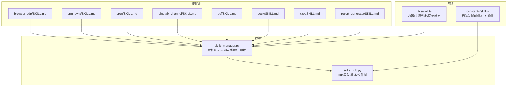
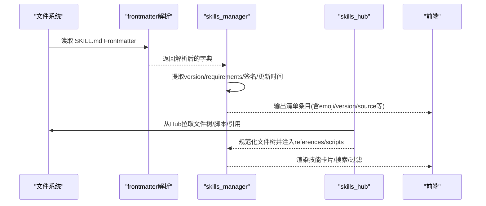
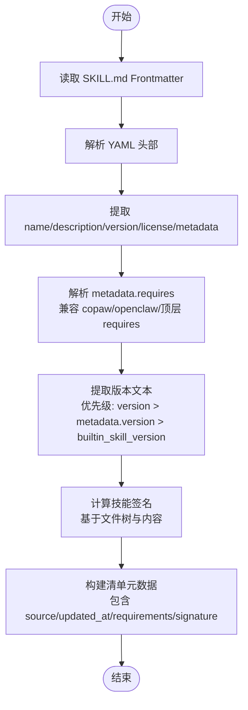
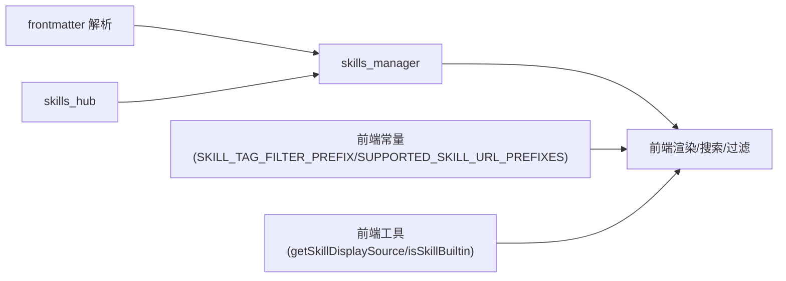

# 技能元数据配置

<cite>
**本文档引用的文件**
- [working/skill_pool/browser_cdp/SKILL.md](file://working/skill_pool/browser_cdp/SKILL.md)
- [working/skill_pool/crm_sync/SKILL.md](file://working/skill_pool/crm_sync/SKILL.md)
- [working/skill_pool/cron/SKILL.md](file://working/skill_pool/cron/SKILL.md)
- [working/skill_pool/dingtalk_channel/SKILL.md](file://working/skill_pool/dingtalk_channel/SKILL.md)
- [working/skill_pool/pdf/SKILL.md](file://working/skill_pool/pdf/SKILL.md)
- [working/skill_pool/docx/SKILL.md](file://working/skill_pool/docx/SKILL.md)
- [working/skill_pool/xlsx/SKILL.md](file://working/skill_pool/xlsx/SKILL.md)
- [working/skill_pool/report_generator/SKILL.md](file://working/skill_pool/report_generator/SKILL.md)
- [src/copaw/agents/skills_manager.py](file://src/copaw/agents/skills_manager.py)
- [src/copaw/agents/skills_hub.py](file://src/copaw/agents/skills_hub.py)
- [console/src/constants/skill.ts](file://console/src/constants/skill.ts)
- [console/src/utils/skill.ts](file://console/src/utils/skill.ts)
</cite>

## 目录
1. [引言](#引言)
2. [项目结构](#项目结构)
3. [核心组件](#核心组件)
4. [架构总览](#架构总览)
5. [详细组件分析](#详细组件分析)
6. [依赖关系分析](#依赖关系分析)
7. [性能考虑](#性能考虑)
8. [故障排除指南](#故障排除指南)
9. [结论](#结论)
10. [附录](#附录)

## 引言
本文件系统性阐述技能元数据配置，聚焦 SKILL.md 的 Frontmatter 格式与可用字段，解析 metadata 对象的配置项（如 requires、tags、emoji 等），并结合多种技能类型（工具类、服务类、数据处理类）给出配置示例。同时说明元数据如何影响技能分类、搜索、权限控制与可视化呈现。

## 项目结构
技能元数据主要位于每个技能目录下的 SKILL.md 文件中，Frontmatter 采用 YAML 格式声明元数据。系统通过技能管理模块解析 Frontmatter 并生成清单与运行时元信息。

**图表来源**
- [working/skill_pool/browser_cdp/SKILL.md:1-182](file://working/skill_pool/browser_cdp/SKILL.md#L1-L182)
- [working/skill_pool/crm_sync/SKILL.md:1-18](file://working/skill_pool/crm_sync/SKILL.md#L1-L18)
- [working/skill_pool/cron/SKILL.md:1-205](file://working/skill_pool/cron/SKILL.md#L1-L205)
- [working/skill_pool/dingtalk_channel/SKILL.md:1-193](file://working/skill_pool/dingtalk_channel/SKILL.md#L1-L193)
- [working/skill_pool/pdf/SKILL.md:1-330](file://working/skill_pool/pdf/SKILL.md#L1-L330)
- [working/skill_pool/docx/SKILL.md:1-488](file://working/skill_pool/docx/SKILL.md#L1-L488)
- [working/skill_pool/xlsx/SKILL.md:1-306](file://working/skill_pool/xlsx/SKILL.md#L1-L306)
- [working/skill_pool/report_generator/SKILL.md:1-18](file://working/skill_pool/report_generator/SKILL.md#L1-L18)
- [src/copaw/agents/skills_manager.py:206-246](file://src/copaw/agents/skills_manager.py#L206-L246)
- [src/copaw/agents/skills_hub.py:481-496](file://src/copaw/agents/skills_hub.py#L481-L496)
- [console/src/constants/skill.ts:1-21](file://console/src/constants/skill.ts#L1-L21)
- [console/src/utils/skill.ts:1-42](file://console/src/utils/skill.ts#L1-L42)

**章节来源**
- [src/copaw/agents/skills_manager.py:206-246](file://src/copaw/agents/skills_manager.py#L206-L246)
- [src/copaw/agents/skills_hub.py:481-496](file://src/copaw/agents/skills_hub.py#L481-L496)
- [console/src/constants/skill.ts:1-21](file://console/src/constants/skill.ts#L1-L21)
- [console/src/utils/skill.ts:1-42](file://console/src/utils/skill.ts#L1-L42)

## 核心组件
- Frontmatter 解析器：使用 frontmatter 库读取 SKILL.md 的 YAML 头部，提取 name、description、version、metadata 等字段。
- 元数据构建器：从解析结果派生技能清单条目，包含版本文本、签名、来源、更新时间、需求等。
- Hub 导入与文件树：将 Hub 返回的文件映射为 references/scripts/额外文件树，确保安全路径与内容清洗。
- 前端常量与工具：定义标签过滤前缀、URL 支持列表、内置/自定义来源判定、同步状态显示等。

**章节来源**
- [src/copaw/agents/skills_manager.py:206-246](file://src/copaw/agents/skills_manager.py#L206-L246)
- [src/copaw/agents/skills_manager.py:713-742](file://src/copaw/agents/skills_manager.py#L713-L742)
- [src/copaw/agents/skills_hub.py:481-496](file://src/copaw/agents/skills_hub.py#L481-L496)
- [console/src/constants/skill.ts:1-21](file://console/src/constants/skill.ts#L1-L21)
- [console/src/utils/skill.ts:1-42](file://console/src/utils/skill.ts#L1-L42)

## 架构总览
下图展示了从 SKILL.md 到清单与运行时使用的元数据流转过程。

**图表来源**
- [src/copaw/agents/skills_manager.py:206-246](file://src/copaw/agents/skills_manager.py#L206-L246)
- [src/copaw/agents/skills_manager.py:713-742](file://src/copaw/agents/skills_manager.py#L713-L742)
- [src/copaw/agents/skills_hub.py:481-496](file://src/copaw/agents/skills_hub.py#L481-L496)
- [console/src/constants/skill.ts:1-21](file://console/src/constants/skill.ts#L1-L21)

## 详细组件分析

### Frontmatter 字段详解
- name
  - 作用：技能稳定标识，用于路由、同步状态与渠道分发。
  - 位置：SKILL.md 头部必填。
  - 影响：作为工作区与 Hub 的键名，避免随 Frontmatter 变化而漂移。
  - 示例路径：[working/skill_pool/cron/SKILL.md:2-4](file://working/skill_pool/cron/SKILL.md#L2-L4)

- description
  - 作用：技能用途与行为概述，用于 UI 展示与搜索匹配。
  - 示例路径：[working/skill_pool/pdf/SKILL.md:2-4](file://working/skill_pool/pdf/SKILL.md#L2-L4)

- version
  - 作用：用户自定义版本号，便于追踪与升级。
  - 示例路径：[working/skill_pool/crm_sync/SKILL.md:5-6](file://working/skill_pool/crm_sync/SKILL.md#L5-L6)

- license
  - 作用：声明技能许可信息，如“Proprietary”。
  - 示例路径：[working/skill_pool/pdf/SKILL.md:4-7](file://working/skill_pool/pdf/SKILL.md#L4-L7)

- metadata
  - 作用：系统与平台相关配置的容器，支持多层命名空间。
  - 关键子项：
    - builtin_skill_version：内置技能版本，用于 Hub 同步与冲突检测。
      - 示例路径：[working/skill_pool/browser_cdp/SKILL.md:5-6](file://working/skill_pool/browser_cdp/SKILL.md#L5-L6)
    - copaw/emoji：技能表情符号，用于 UI 可视化。
      - 示例路径：[working/skill_pool/crm_sync/SKILL.md:4-5](file://working/skill_pool/crm_sync/SKILL.md#L4-L5)
    - copaw/requires：运行时依赖声明（环境变量/二进制），用于权限与环境校验。
      - 示例路径：[working/skill_pool/dingtalk_channel/SKILL.md:8-9](file://working/skill_pool/dingtalk_channel/SKILL.md#L8-L9)

- license（顶层）
  - 作用：许可证声明，与 metadata 内容互补。
  - 示例路径：[working/skill_pool/pdf/SKILL.md:4-7](file://working/skill_pool/pdf/SKILL.md#L4-L7)

**章节来源**
- [working/skill_pool/browser_cdp/SKILL.md:1-10](file://working/skill_pool/browser_cdp/SKILL.md#L1-L10)
- [working/skill_pool/crm_sync/SKILL.md:1-6](file://working/skill_pool/crm_sync/SKILL.md#L1-L6)
- [working/skill_pool/cron/SKILL.md:1-8](file://working/skill_pool/cron/SKILL.md#L1-L8)
- [working/skill_pool/dingtalk_channel/SKILL.md:4-9](file://working/skill_pool/dingtalk_channel/SKILL.md#L4-L9)
- [working/skill_pool/pdf/SKILL.md:1-7](file://working/skill_pool/pdf/SKILL.md#L1-L7)

### 元数据对系统的影响
- 分类与搜索
  - name/description 用于 UI 展示与关键词匹配。
  - 前端支持标签过滤前缀，便于按标签筛选技能。
  - 示例路径：[console/src/constants/skill.ts:19-21](file://console/src/constants/skill.ts#L19-L21)

- 权限与环境控制
  - metadata.copaw.requires 声明所需二进制与环境变量，运行时注入环境变量并进行缺失告警。
  - 示例路径：[src/copaw/agents/skills_manager.py:542-566](file://src/copaw/agents/skills_manager.py#L542-L566)

- 可视化与来源识别
  - emoji 用于技能卡片渲染。
  - 来源（builtin/customized/system）决定 UI 状态与同步状态显示。
  - 示例路径：[console/src/utils/skill.ts:6-12](file://console/src/utils/skill.ts#L6-L12)

- Hub 集成与文件树
  - Hub 返回的文件映射被规范化为 references/scripts/额外文件树，确保安全路径与内容清洗。
  - 示例路径：[src/copaw/agents/skills_hub.py:481-496](file://src/copaw/agents/skills_hub.py#L481-L496)

**章节来源**
- [console/src/constants/skill.ts:19-21](file://console/src/constants/skill.ts#L19-L21)
- [console/src/utils/skill.ts:6-12](file://console/src/utils/skill.ts#L6-L12)
- [src/copaw/agents/skills_manager.py:542-566](file://src/copaw/agents/skills_manager.py#L542-L566)
- [src/copaw/agents/skills_hub.py:481-496](file://src/copaw/agents/skills_hub.py#L481-L496)

### 元数据配置示例

#### 工具类技能（浏览器 CDP）
- 典型字段：name、description、metadata.copaw.emoji、metadata.copaw.requires
- 说明：强调隐私与单实例限制，requires 为空表示无额外依赖
- 示例路径：
  - [working/skill_pool/browser_cdp/SKILL.md:1-10](file://working/skill_pool/browser_cdp/SKILL.md#L1-L10)

#### 服务类技能（CRM 同步）
- 典型字段：name、description、emoji、version
- 说明：通过 emoji 与版本号提升可发现性与可追踪性
- 示例路径：
  - [working/skill_pool/crm_sync/SKILL.md:1-6](file://working/skill_pool/crm_sync/SKILL.md#L1-L6)

#### 定时任务技能（Cron）
- 典型字段：name、description、metadata.copaw.emoji、metadata.builtin_skill_version
- 说明：内置版本用于 Hub 同步与冲突检测
- 示例路径：
  - [working/skill_pool/cron/SKILL.md:1-8](file://working/skill_pool/cron/SKILL.md#L1-L8)

#### 可视化自动化技能（钉钉通道）
- 典型字段：name、description、metadata.copaw.emoji、metadata.copaw.requires
- 说明：requires 为空，但强调浏览器可视模式与登录暂停流程
- 示例路径：
  - [working/skill_pool/dingtalk_channel/SKILL.md:1-9](file://working/skill_pool/dingtalk_channel/SKILL.md#L1-L9)

#### 数据处理类技能（PDF/DOCX/XLSX）
- 典型字段：name、description、license、metadata.builtin_skill_version
- 说明：license 与内置版本用于合规与版本追踪
- 示例路径：
  - [working/skill_pool/pdf/SKILL.md:1-7](file://working/skill_pool/pdf/SKILL.md#L1-L7)
  - [working/skill_pool/docx/SKILL.md:1-7](file://working/skill_pool/docx/SKILL.md#L1-L7)
  - [working/skill_pool/xlsx/SKILL.md:1-7](file://working/skill_pool/xlsx/SKILL.md#L1-L7)

#### 报告生成技能
- 典型字段：name、description、emoji、version
- 说明：通过 emoji 与版本号增强识别度
- 示例路径：
  - [working/skill_pool/report_generator/SKILL.md:1-6](file://working/skill_pool/report_generator/SKILL.md#L1-L6)

**章节来源**
- [working/skill_pool/browser_cdp/SKILL.md:1-10](file://working/skill_pool/browser_cdp/SKILL.md#L1-L10)
- [working/skill_pool/crm_sync/SKILL.md:1-6](file://working/skill_pool/crm_sync/SKILL.md#L1-L6)
- [working/skill_pool/cron/SKILL.md:1-8](file://working/skill_pool/cron/SKILL.md#L1-L8)
- [working/skill_pool/dingtalk_channel/SKILL.md:1-9](file://working/skill_pool/dingtalk_channel/SKILL.md#L1-L9)
- [working/skill_pool/pdf/SKILL.md:1-7](file://working/skill_pool/pdf/SKILL.md#L1-L7)
- [working/skill_pool/docx/SKILL.md:1-7](file://working/skill_pool/docx/SKILL.md#L1-L7)
- [working/skill_pool/xlsx/SKILL.md:1-7](file://working/skill_pool/xlsx/SKILL.md#L1-L7)
- [working/skill_pool/report_generator/SKILL.md:1-6](file://working/skill_pool/report_generator/SKILL.md#L1-L6)

### 元数据提取与构建流程

**图表来源**
- [src/copaw/agents/skills_manager.py:206-246](file://src/copaw/agents/skills_manager.py#L206-L246)
- [src/copaw/agents/skills_manager.py:542-566](file://src/copaw/agents/skills_manager.py#L542-L566)
- [src/copaw/agents/skills_manager.py:248-257](file://src/copaw/agents/skills_manager.py#L248-L257)
- [src/copaw/agents/skills_manager.py:273-290](file://src/copaw/agents/skills_manager.py#L273-L290)

**章节来源**
- [src/copaw/agents/skills_manager.py:206-246](file://src/copaw/agents/skills_manager.py#L206-L246)
- [src/copaw/agents/skills_manager.py:542-566](file://src/copaw/agents/skills_manager.py#L542-L566)
- [src/copaw/agents/skills_manager.py:248-257](file://src/copaw/agents/skills_manager.py#L248-L257)
- [src/copaw/agents/skills_manager.py:273-290](file://src/copaw/agents/skills_manager.py#L273-L290)

## 依赖关系分析
- 前端依赖后端解析结果：
  - 标签过滤前缀与 URL 前缀由前端常量定义，影响搜索与过滤逻辑。
  - 来源判定与同步状态由前端工具函数统一处理。
- 后端依赖：
  - frontmatter 解析 SKILL.md。
  - Hub 返回文件映射，经规范化后注入 references/scripts。
  - 元数据驱动权限注入与 UI 渲染。

**图表来源**
- [src/copaw/agents/skills_manager.py:206-246](file://src/copaw/agents/skills_manager.py#L206-L246)
- [src/copaw/agents/skills_hub.py:481-496](file://src/copaw/agents/skills_hub.py#L481-L496)
- [console/src/constants/skill.ts:1-21](file://console/src/constants/skill.ts#L1-L21)
- [console/src/utils/skill.ts:1-42](file://console/src/utils/skill.ts#L1-L42)

**章节来源**
- [console/src/constants/skill.ts:1-21](file://console/src/constants/skill.ts#L1-L21)
- [console/src/utils/skill.ts:1-42](file://console/src/utils/skill.ts#L1-L42)
- [src/copaw/agents/skills_manager.py:206-246](file://src/copaw/agents/skills_manager.py#L206-L246)
- [src/copaw/agents/skills_hub.py:481-496](file://src/copaw/agents/skills_hub.py#L481-L496)

## 性能考虑
- Frontmatter 解析与文件树签名计算为 O(N)（N 为文件数量），在大型技能包中需注意 I/O 与哈希成本。
- Hub 导入限制最大压缩包大小与条目数，防止资源滥用。
- 前端搜索与过滤通过标签前缀与 URL 前缀快速筛选，减少不必要的渲染。

[本节为通用指导，无需特定文件引用]

## 故障排除指南
- Frontmatter 语法错误
  - 现象：解析失败，回退到最小 Frontmatter（仅 name/description）。
  - 处理：修正 YAML 语法，确保缩进与键名正确。
  - 参考路径：[src/copaw/agents/skills_manager.py:220-246](file://src/copaw/agents/skills_manager.py#L220-L246)

- 依赖缺失告警
  - 现象：声明的 require_envs 未提供，记录警告。
  - 处理：在技能配置中补齐所需环境变量。
  - 参考路径：[src/copaw/agents/skills_manager.py:613-618](file://src/copaw/agents/skills_manager.py#L613-L618)

- Hub 导入超大/异常文件
  - 现象：超过大小限制或包含危险路径/符号链接。
  - 处理：检查 Hub 返回文件映射，清理非法路径。
  - 参考路径：[src/copaw/agents/skills_hub.py:452-472](file://src/copaw/agents/skills_hub.py#L452-L472)

**章节来源**
- [src/copaw/agents/skills_manager.py:220-246](file://src/copaw/agents/skills_manager.py#L220-L246)
- [src/copaw/agents/skills_manager.py:613-618](file://src/copaw/agents/skills_manager.py#L613-L618)
- [src/copaw/agents/skills_hub.py:452-472](file://src/copaw/agents/skills_hub.py#L452-L472)

## 结论
SKILL.md 的 Frontmatter 是技能元数据的核心载体，通过标准化字段与 metadata 配置，系统实现了技能的可发现、可分类、可权限控制与可可视化呈现。遵循本文档的配置规范与最佳实践，可确保技能在工作区与 Hub 间顺畅同步，并在前端获得良好的用户体验。

## 附录
- 常用字段速查
  - name/description/version/license：基础信息
  - metadata.builtin_skill_version：内置版本
  - metadata.copaw.emoji：UI 表情
  - metadata.copaw.requires：运行时依赖
- 前端搜索与过滤
  - 标签过滤前缀：tag:
  - 支持的技能 URL 前缀：https://skills.sh/、https://clawhub.ai/、https://skillsmp.com/、https://lobehub.com/、https://market.lobehub.com/、https://github.com/、https://modelscope.cn/skills/
- 来源判定
  - builtin/system：内置/系统技能
  - customized：自定义覆盖

**章节来源**
- [console/src/constants/skill.ts:1-21](file://console/src/constants/skill.ts#L1-L21)
- [console/src/utils/skill.ts:6-12](file://console/src/utils/skill.ts#L6-L12)