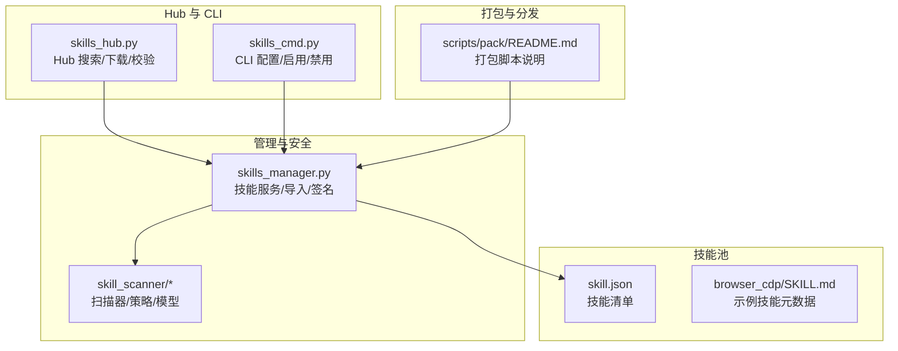
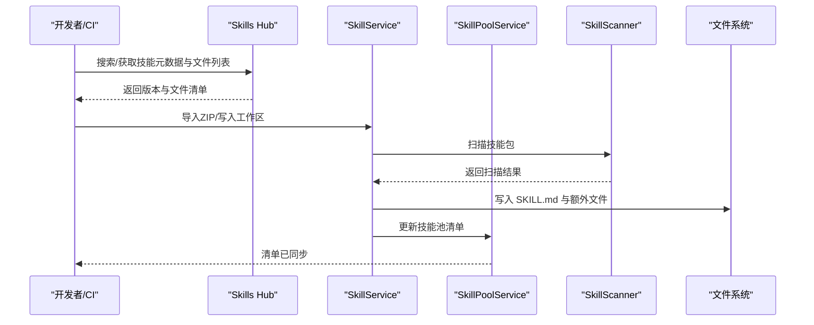
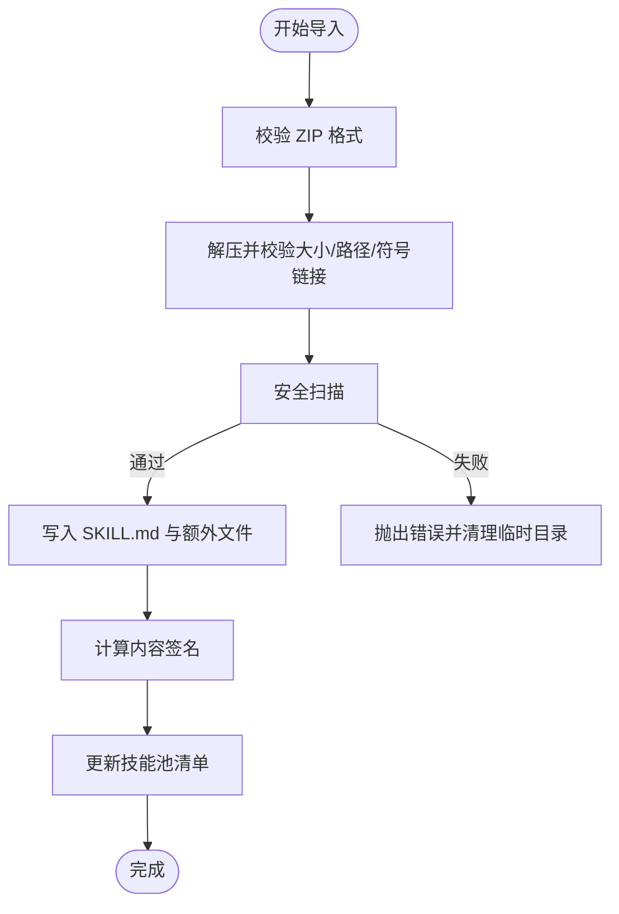
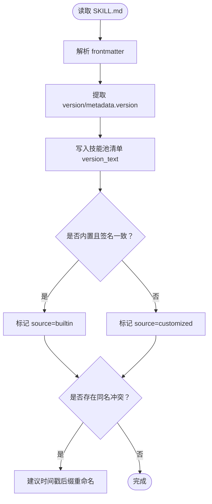
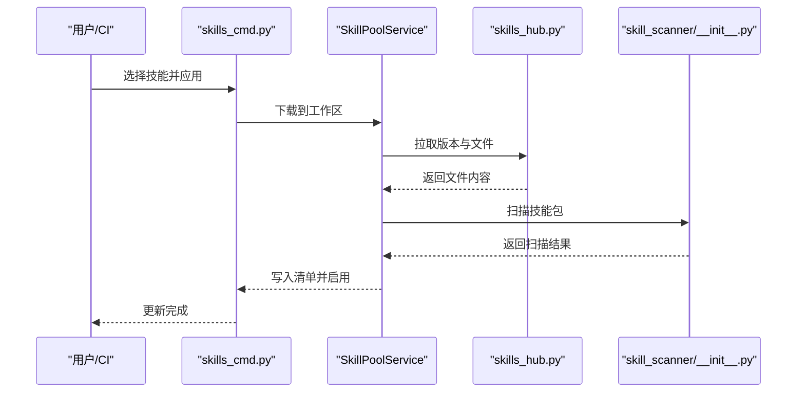
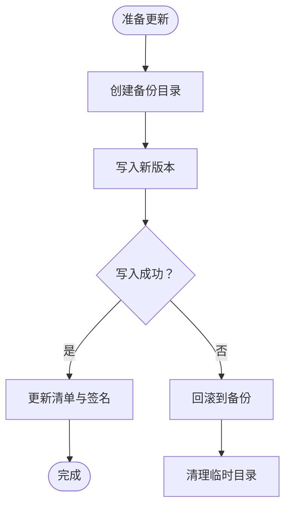
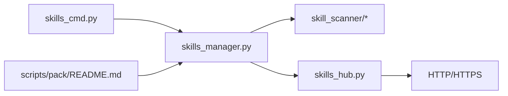

# 技能打包与发布

<cite>
**本文引用的文件**
- [skills_hub.py](file://src/copaw/agents/skills_hub.py)
- [skills_manager.py](file://src/copaw/agents/skills_manager.py)
- [skill_scanner/__init__.py](file://src/copaw/security/skill_scanner/__init__.py)
- [skill_scanner/scanner.py](file://src/copaw/security/skill_scanner/scanner.py)
- [skill_scanner/models.py](file://src/copaw/security/skill_scanner/models.py)
- [skills_cmd.py](file://src/copaw/cli/skills_cmd.py)
- [skill.json](file://working/skill_pool/skill.json)
- [SKILL.md](file://working/skill_pool/browser_cdp/SKILL.md)
- [README.md](file://scripts/pack/README.md)
</cite>

## 目录
1. [简介](#简介)
2. [项目结构](#项目结构)
3. [核心组件](#核心组件)
4. [架构总览](#架构总览)
5. [详细组件分析](#详细组件分析)
6. [依赖分析](#依赖分析)
7. [性能考虑](#性能考虑)
8. [故障排查指南](#故障排查指南)
9. [结论](#结论)
10. [附录](#附录)

## 简介
本指南面向技能开发者与运维人员，系统阐述 CoPaw 技能的打包、版本管理与发布流程。内容覆盖：
- 技能 ZIP 打包标准与要求（文件结构、压缩限制、安全检查）
- 技能版本管理最佳实践（版本号规则、变更记录、向后兼容）
- 技能发布到技能池的完整流程（Hub 发布、共享配置、权限管理）
- 技能更新与维护策略（增量更新、回滚机制、废弃处理）

## 项目结构
围绕技能生命周期的关键目录与文件：
- 技能池清单与内置技能：working/skill_pool/skill.json、working/skill_pool/<技能名>/SKILL.md
- 技能管理与安全扫描：src/copaw/agents/skills_manager.py、src/copaw/security/skill_scanner/*
- Hub 交互与下载：src/copaw/agents/skills_hub.py
- CLI 技能配置：src/copaw/cli/skills_cmd.py
- 打包与分发脚本：scripts/pack/README.md

**图表来源**
- [skill.json:1-370](file://working/skill_pool/skill.json#L1-L370)
- [SKILL.md:1-182](file://working/skill_pool/browser_cdp/SKILL.md#L1-L182)
- [skills_manager.py:1-200](file://src/copaw/agents/skills_manager.py#L1-L200)
- [skill_scanner/__init__.py:1-120](file://src/copaw/security/skill_scanner/__init__.py#L1-L120)
- [skills_hub.py:1-120](file://src/copaw/agents/skills_hub.py#L1-L120)
- [skills_cmd.py:1-120](file://src/copaw/cli/skills_cmd.py#L1-L120)
- [README.md:1-93](file://scripts/pack/README.md#L1-L93)

**章节来源**
- [skill.json:1-370](file://working/skill_pool/skill.json#L1-L370)
- [SKILL.md:1-182](file://working/skill_pool/browser_cdp/SKILL.md#L1-L182)
- [skills_manager.py:1-200](file://src/copaw/agents/skills_manager.py#L1-L200)
- [skill_scanner/__init__.py:1-120](file://src/copaw/security/skill_scanner/__init__.py#L1-L120)
- [skills_hub.py:1-120](file://src/copaw/agents/skills_hub.py#L1-L120)
- [skills_cmd.py:1-120](file://src/copaw/cli/skills_cmd.py#L1-L120)
- [README.md:1-93](file://scripts/pack/README.md#L1-L93)

## 核心组件
- 技能管理服务（SkillService）：负责工作区内的技能创建、编辑、启用/禁用、清单写入与签名计算。
- 技能池服务（SkillPoolService）：负责从 Hub 下载技能到工作区、同步技能池清单、冲突处理与重命名建议。
- 安全扫描器（SkillScanner）：对技能包进行文件发现、规则匹配与结果聚合，支持白名单、超时与缓存。
- Hub 客户端（skills_hub.py）：封装 Hub 搜索、版本解析、文件拉取、HTTP 重试与大小限制。

关键职责与边界：
- 技能包导入：校验 ZIP 结构、解压限制、路径安全、禁止符号链接，扫描后落盘。
- 版本与签名：基于 SKILL.md 与文件树构建内容签名，用于冲突检测与一致性校验。
- 发布与同步：将工作区技能写入技能池清单，记录版本、描述、依赖与更新时间戳。

**章节来源**
- [skills_manager.py:453-525](file://src/copaw/agents/skills_manager.py#L453-L525)
- [skills_manager.py:713-742](file://src/copaw/agents/skills_manager.py#L713-L742)
- [skills_manager.py:1447-1600](file://src/copaw/agents/skills_manager.py#L1447-L1600)
- [skill_scanner/scanner.py:148-242](file://src/copaw/security/skill_scanner/scanner.py#L148-L242)
- [skill_scanner/__init__.py:415-505](file://src/copaw/security/skill_scanner/__init__.py#L415-L505)
- [skills_hub.py:88-93](file://src/copaw/agents/skills_hub.py#L88-L93)
- [skills_hub.py:287-439](file://src/copaw/agents/skills_hub.py#L287-L439)

## 架构总览
技能从 Hub 下载到工作区，经安全扫描与签名校验后写入技能池清单；CLI 提供交互式启用/禁用与批量配置。

**图表来源**
- [skills_hub.py:553-636](file://src/copaw/agents/skills_hub.py#L553-L636)
- [skills_manager.py:1430-1445](file://src/copaw/agents/skills_manager.py#L1430-L1445)
- [skill_scanner/__init__.py:415-505](file://src/copaw/security/skill_scanner/__init__.py#L415-L505)
- [skills_manager.py:2433-2473](file://src/copaw/agents/skills_manager.py#L2433-L2473)

## 详细组件分析

### 技能 ZIP 打包与导入
- 标准格式与文件结构
  - 必需文件：根目录包含 SKILL.md；可选目录：references、scripts。
  - 支持多技能打包：顶层目录下每个子目录视为一个技能，名称由子目录名或内部 SKILL.md frontmatter 决定。
- 压缩限制与安全检查
  - 解压总大小上限：200MB（未压缩）。
  - 路径安全：拒绝绝对路径与路径穿越；禁止符号链接。
  - ZIP 校验：非 ZIP 文件直接拒绝。
- 写入与签名
  - 写入前进行安全扫描；扫描通过后复制到目标目录。
  - 基于文件树与 SKILL.md 的内容签名，用于冲突检测与一致性校验。

**图表来源**
- [skills_manager.py:453-473](file://src/copaw/agents/skills_manager.py#L453-L473)
- [skills_manager.py:1430-1432](file://src/copaw/agents/skills_manager.py#L1430-L1432)
- [skills_manager.py:1434-1445](file://src/copaw/agents/skills_manager.py#L1434-L1445)
- [skills_manager.py:273-291](file://src/copaw/agents/skills_manager.py#L273-L291)

**章节来源**
- [skills_manager.py:453-473](file://src/copaw/agents/skills_manager.py#L453-L473)
- [skills_manager.py:1387-1427](file://src/copaw/agents/skills_manager.py#L1387-L1427)
- [skills_manager.py:1430-1432](file://src/copaw/agents/skills_manager.py#L1430-L1432)
- [skills_manager.py:273-291](file://src/copaw/agents/skills_manager.py#L273-L291)

### 技能版本管理最佳实践
- 版本号规则
  - 来源于 SKILL.md frontmatter 的 metadata.version 或 builtin_skill_version 字段；未设置时为空字符串。
  - 技能池清单记录 version_text 与 commit_text（空值示例中未填充）。
- 变更记录与向后兼容
  - 建议在 SKILL.md 中维护清晰的变更摘要与兼容性说明；版本号遵循语义化版本（如 1.0.0、1.1、1.2）。
  - 内置技能与定制技能区分：内置签名一致则视为“builtin”，否则为“customized”，避免误覆盖。
- 冲突与重命名
  - 当同名技能冲突时，系统提供时间戳后缀的重命名建议，避免覆盖。

**图表来源**
- [skills_manager.py:248-257](file://src/copaw/agents/skills_manager.py#L248-L257)
- [skills_manager.py:417-446](file://src/copaw/agents/skills_manager.py#L417-L446)
- [skills_manager.py:748-769](file://src/copaw/agents/skills_manager.py#L748-L769)

**章节来源**
- [skills_manager.py:248-257](file://src/copaw/agents/skills_manager.py#L248-L257)
- [skills_manager.py:417-446](file://src/copaw/agents/skills_manager.py#L417-L446)
- [skills_manager.py:748-769](file://src/copaw/agents/skills_manager.py#L748-L769)
- [SKILL.md:4-8](file://working/skill_pool/browser_cdp/SKILL.md#L4-L8)

### 技能发布到技能池的完整流程
- Hub 发布与下载
  - Hub 支持搜索、版本解析与文件拉取；对响应体大小、HTTP 错误进行限制与重试。
  - 支持从 GitHub/GitLab 等仓库解析技能根目录与 SKILL.md。
- 共享配置与权限
  - 技能池清单记录每个技能的 source、version_text、requirements、updated_at 等字段。
  - CLI 提供交互式选择与批量应用，支持安装、启用、禁用操作。
- 安全前置
  - 导入前统一进行安全扫描，扫描模式可配置（block/warn/off），支持超时与缓存。

**图表来源**
- [skills_cmd.py:120-211](file://src/copaw/cli/skills_cmd.py#L120-L211)
- [skills_hub.py:553-636](file://src/copaw/agents/skills_hub.py#L553-L636)
- [skill_scanner/__init__.py:415-505](file://src/copaw/security/skill_scanner/__init__.py#L415-L505)

**章节来源**
- [skills_cmd.py:120-211](file://src/copaw/cli/skills_cmd.py#L120-L211)
- [skills_hub.py:553-636](file://src/copaw/agents/skills_hub.py#L553-L636)
- [skill_scanner/__init__.py:415-505](file://src/copaw/security/skill_scanner/__init__.py#L415-L505)

### 技能更新与维护
- 增量更新
  - 通过编辑 SKILL.md 与相关文件实现；导入时进行扫描与签名更新。
- 回滚机制
  - 写盘前创建备份目录，失败时可回滚至备份并恢复清单。
- 废弃处理
  - 禁用技能或删除文件；内置技能可通过“builtin”标记保持槽位一致性。

**图表来源**
- [skills_manager.py:1434-1445](file://src/copaw/agents/skills_manager.py#L1434-L1445)
- [skills_manager.py:2433-2473](file://src/copaw/agents/skills_manager.py#L2433-L2473)
- [skills_manager.py:282-307](file://src/copaw/agents/skills_manager.py#L282-L307)

**章节来源**
- [skills_manager.py:1434-1445](file://src/copaw/agents/skills_manager.py#L1434-L1445)
- [skills_manager.py:2433-2473](file://src/copaw/agents/skills_manager.py#L2433-L2473)
- [skills_manager.py:282-307](file://src/copaw/agents/skills_manager.py#L282-L307)

## 依赖分析
- 组件耦合
  - SkillService 依赖技能扫描器与文件系统；与技能池清单强耦合。
  - SkillPoolService 依赖 Hub 客户端与清单写入。
  - Hub 客户端依赖 HTTP 请求与响应解析，含重试与大小限制。
- 外部依赖
  - GitHub API：支持认证与速率限制处理。
  - 打包脚本：依赖 conda-pack 与 NSIS（Windows）。

**图表来源**
- [skills_manager.py:1-120](file://src/copaw/agents/skills_manager.py#L1-L120)
- [skill_scanner/__init__.py:1-120](file://src/copaw/security/skill_scanner/__init__.py#L1-L120)
- [skills_hub.py:1-120](file://src/copaw/agents/skills_hub.py#L1-L120)
- [skills_cmd.py:1-120](file://src/copaw/cli/skills_cmd.py#L1-L120)
- [README.md:1-93](file://scripts/pack/README.md#L1-L93)

**章节来源**
- [skills_manager.py:1-120](file://src/copaw/agents/skills_manager.py#L1-L120)
- [skill_scanner/__init__.py:1-120](file://src/copaw/security/skill_scanner/__init__.py#L1-L120)
- [skills_hub.py:1-120](file://src/copaw/agents/skills_hub.py#L1-L120)
- [skills_cmd.py:1-120](file://src/copaw/cli/skills_cmd.py#L1-L120)
- [README.md:1-93](file://scripts/pack/README.md#L1-L93)

## 性能考虑
- ZIP 解压与扫描
  - 200MB 未压缩上限与路径安全检查降低内存与磁盘风险。
  - 扫描器支持超时与缓存，避免重复扫描。
- HTTP 下载与重试
  - Hub 客户端支持指数退避与可配置超时/重试次数，提升稳定性。
- 清单写入
  - 原子写入与锁文件机制保证并发安全与一致性。

[本节为通用指导，无需特定文件引用]

## 故障排查指南
- ZIP 导入失败
  - 检查 ZIP 是否为有效归档、是否包含 SKILL.md、是否超出大小限制或包含非法路径/符号链接。
- 安全扫描阻断
  - 查看扫描结果与最高严重级别；根据策略调整为 warn 模式或修复高危问题。
- Hub 下载异常
  - 关注 HTTP 状态码与重试日志；设置 GITHUB_TOKEN 以提高配额。
- 回滚与恢复
  - 若写入失败，系统会保留备份目录；可手动回滚或通过回滚接口恢复。

**章节来源**
- [skills_manager.py:453-473](file://src/copaw/agents/skills_manager.py#L453-L473)
- [skill_scanner/__init__.py:393-505](file://src/copaw/security/skill_scanner/__init__.py#L393-L505)
- [skills_hub.py:312-399](file://src/copaw/agents/skills_hub.py#L312-L399)
- [skills_manager.py:282-307](file://src/copaw/agents/skills_manager.py#L282-L307)

## 结论
通过标准化的 ZIP 打包、严格的导入安全检查、清晰的版本与签名机制以及完善的 Hub/CLI 发布流程，CoPaw 为技能的开发、测试、发布与维护提供了可靠支撑。建议在团队内统一 SKILL.md 模板与版本规范，并结合扫描策略与回滚机制保障生产环境的稳定性。

[本节为总结性内容，无需特定文件引用]

## 附录

### 技能清单字段说明
- schema_version：清单版本标识
- version：清单版本号（递增）
- skills：技能条目集合
  - name：技能名称
  - description：技能描述
  - version_text：版本号
  - commit_text：提交信息（可空）
  - signature：内容签名
  - source：来源（builtin/customized）
  - protected：是否受保护
  - requirements：系统需求（bins/envs）
  - updated_at：更新时间戳

**章节来源**
- [skill.json:1-370](file://working/skill_pool/skill.json#L1-L370)
- [skills_manager.py:713-742](file://src/copaw/agents/skills_manager.py#L713-L742)

### 打包与分发要点
- 打包脚本支持一键构建桌面应用，包含前端与依赖打包、安装器生成与日志调试。
- 建议在 CI 中集成安全扫描与版本校验，确保发布质量。

**章节来源**
- [README.md:1-93](file://scripts/pack/README.md#L1-L93)