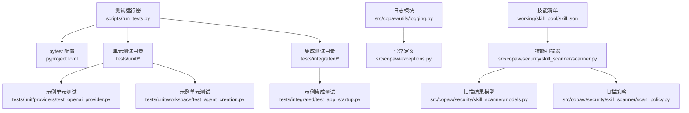
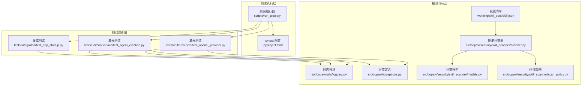
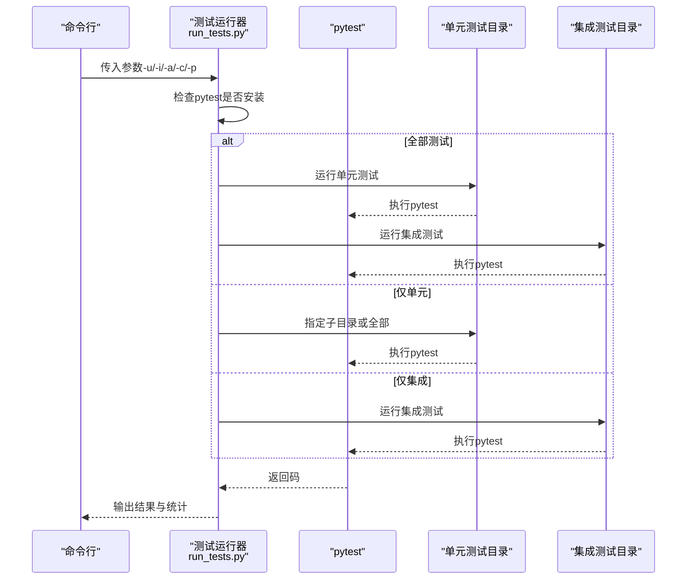
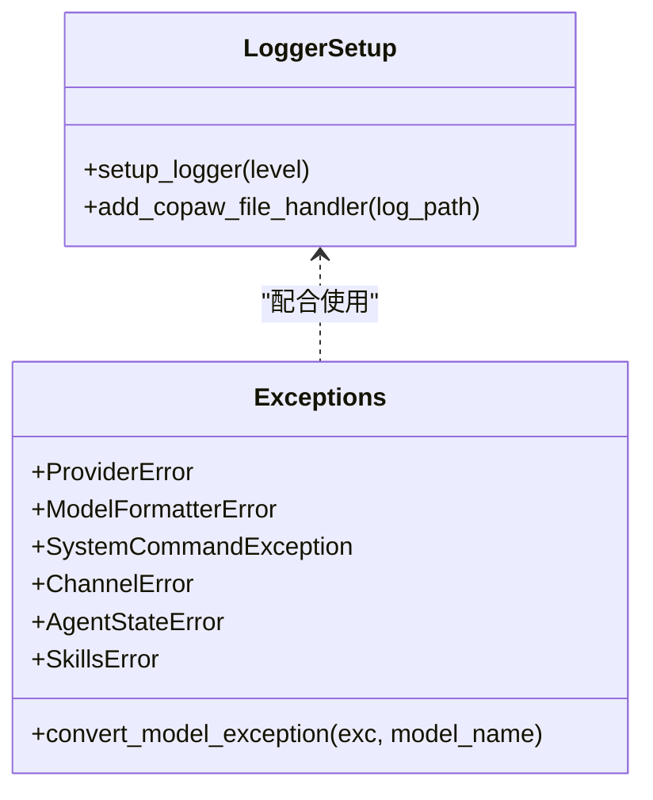
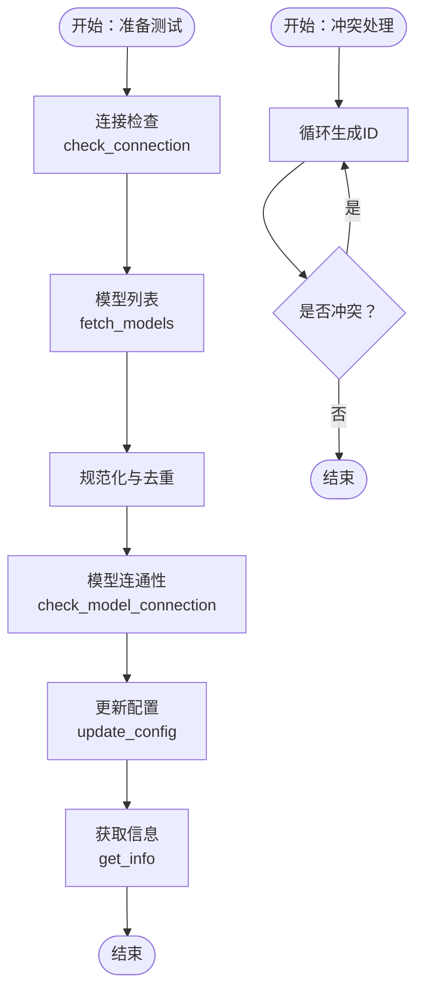
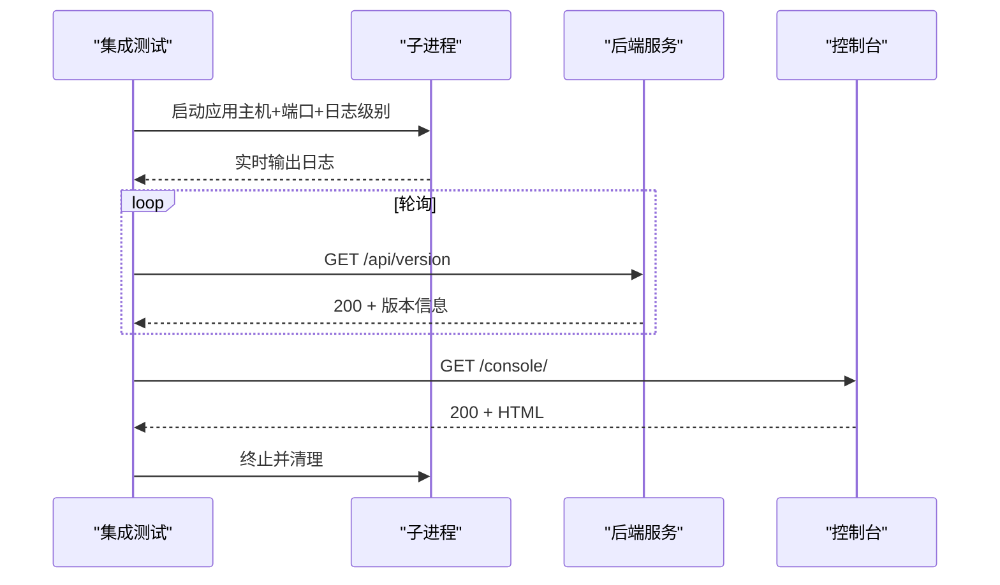
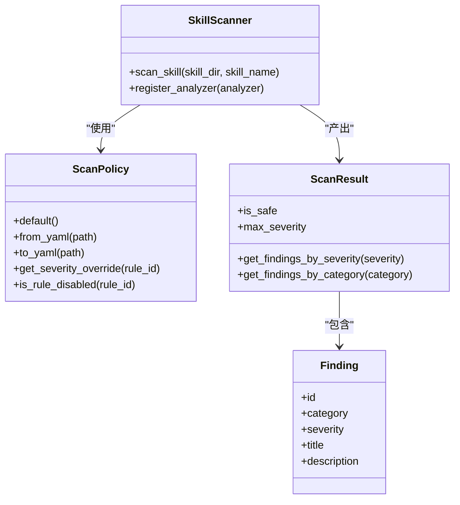
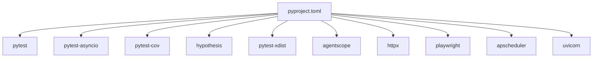

# 技能测试与调试

<cite>
**本文引用的文件**
- [scripts/run_tests.py](file://scripts/run_tests.py)
- [pyproject.toml](file://pyproject.toml)
- [src/copaw/utils/logging.py](file://src/copaw/utils/logging.py)
- [src/copaw/exceptions.py](file://src/copaw/exceptions.py)
- [tests/unit/providers/test_openai_provider.py](file://tests/unit/providers/test_openai_provider.py)
- [tests/unit/workspace/test_agent_creation.py](file://tests/unit/workspace/test_agent_creation.py)
- [tests/integrated/test_app_startup.py](file://tests/integrated/test_app_startup.py)
- [src/copaw/security/skill_scanner/scanner.py](file://src/copaw/security/skill_scanner/scanner.py)
- [src/copaw/security/skill_scanner/models.py](file://src/copaw/security/skill_scanner/models.py)
- [src/copaw/security/skill_scanner/scan_policy.py](file://src/copaw/security/skill_scanner/scan_policy.py)
- [working/skill_pool/skill.json](file://working/skill_pool/skill.json)
</cite>

## 目录
1. [简介](#简介)
2. [项目结构](#项目结构)
3. [核心组件](#核心组件)
4. [架构总览](#架构总览)
5. [详细组件分析](#详细组件分析)
6. [依赖分析](#依赖分析)
7. [性能考虑](#性能考虑)
8. [故障排查指南](#故障排查指南)
9. [结论](#结论)
10. [附录](#附录)

## 简介
本指南面向技能开发与调试场景，系统阐述以下内容：
- 单元测试与集成测试的编写与运行方式
- 日志输出、断点调试、错误追踪等调试技术
- 性能测试与优化（内存、执行时间、并发）
- 不同环境下的兼容性测试（操作系统、依赖版本）

## 项目结构
围绕“测试与调试”的关键目录与文件：
- 测试脚本与运行器：scripts/run_tests.py
- 测试配置与依赖：pyproject.toml（pytest、覆盖率、并行）
- 日志与异常：src/copaw/utils/logging.py、src/copaw/exceptions.py
- 单元测试样例：tests/unit/providers/test_openai_provider.py、tests/unit/workspace/test_agent_creation.py
- 集成测试样例：tests/integrated/test_app_startup.py
- 技能安全扫描：src/copaw/security/skill_scanner/* 与 working/skill_pool/skill.json

图表来源
- [scripts/run_tests.py:1-282](file://scripts/run_tests.py#L1-L282)
- [pyproject.toml:123-129](file://pyproject.toml#L123-L129)
- [src/copaw/utils/logging.py:1-199](file://src/copaw/utils/logging.py#L1-L199)
- [src/copaw/exceptions.py:1-254](file://src/copaw/exceptions.py#L1-L254)
- [tests/unit/providers/test_openai_provider.py:1-269](file://tests/unit/providers/test_openai_provider.py#L1-L269)
- [tests/unit/workspace/test_agent_creation.py:1-87](file://tests/unit/workspace/test_agent_creation.py#L1-L87)
- [tests/integrated/test_app_startup.py:1-133](file://tests/integrated/test_app_startup.py#L1-L133)
- [src/copaw/security/skill_scanner/scanner.py:1-319](file://src/copaw/security/skill_scanner/scanner.py#L1-L319)
- [src/copaw/security/skill_scanner/models.py:1-235](file://src/copaw/security/skill_scanner/models.py#L1-L235)
- [src/copaw/security/skill_scanner/scan_policy.py:1-476](file://src/copaw/security/skill_scanner/scan_policy.py#L1-L476)
- [working/skill_pool/skill.json:1-370](file://working/skill_pool/skill.json#L1-L370)

章节来源
- [scripts/run_tests.py:1-282](file://scripts/run_tests.py#L1-L282)
- [pyproject.toml:123-129](file://pyproject.toml#L123-L129)

## 核心组件
- 测试运行器与命令行接口：scripts/run_tests.py 提供统一入口，支持运行单元测试、集成测试、覆盖率、并行执行等。
- 测试框架与配置：pyproject.toml 中的 pytest 配置项（异步模式、标记、覆盖率参数）为测试提供基础能力。
- 日志与异常：src/copaw/utils/logging.py 提供彩色终端输出、文件处理器、访问日志过滤；src/copaw/exceptions.py 定义业务异常与模型异常转换逻辑。
- 单元测试样例：覆盖提供者连接检查、模型列表、配置更新等；覆盖代理短ID生成与冲突处理。
- 集成测试样例：通过子进程启动应用，验证后端与控制台可用性、HTML 返回等。
- 技能安全扫描：SkillScanner 负责扫描技能包、聚合发现、策略化过滤与去重；模型与策略定义支撑扫描结果与规则定制。

章节来源
- [scripts/run_tests.py:76-173](file://scripts/run_tests.py#L76-L173)
- [pyproject.toml:123-129](file://pyproject.toml#L123-L129)
- [src/copaw/utils/logging.py:119-199](file://src/copaw/utils/logging.py#L119-L199)
- [src/copaw/exceptions.py:165-254](file://src/copaw/exceptions.py#L165-L254)
- [tests/unit/providers/test_openai_provider.py:10-269](file://tests/unit/providers/test_openai_provider.py#L10-L269)
- [tests/unit/workspace/test_agent_creation.py:11-87](file://tests/unit/workspace/test_agent_creation.py#L11-L87)
- [tests/integrated/test_app_startup.py:33-133](file://tests/integrated/test_app_startup.py#L33-L133)
- [src/copaw/security/skill_scanner/scanner.py:76-319](file://src/copaw/security/skill_scanner/scanner.py#L76-L319)
- [src/copaw/security/skill_scanner/models.py:14-235](file://src/copaw/security/skill_scanner/models.py#L14-L235)
- [src/copaw/security/skill_scanner/scan_policy.py:156-476](file://src/copaw/security/skill_scanner/scan_policy.py#L156-L476)

## 架构总览
测试与调试相关模块的交互关系如下：

图表来源
- [scripts/run_tests.py:175-277](file://scripts/run_tests.py#L175-L277)
- [pyproject.toml:123-129](file://pyproject.toml#L123-L129)
- [src/copaw/utils/logging.py:119-199](file://src/copaw/utils/logging.py#L119-L199)
- [src/copaw/exceptions.py:165-254](file://src/copaw/exceptions.py#L165-L254)
- [src/copaw/security/skill_scanner/scanner.py:148-242](file://src/copaw/security/skill_scanner/scanner.py#L148-L242)
- [src/copaw/security/skill_scanner/models.py:168-235](file://src/copaw/security/skill_scanner/models.py#L168-L235)
- [src/copaw/security/skill_scanner/scan_policy.py:236-476](file://src/copaw/security/skill_scanner/scan_policy.py#L236-L476)
- [working/skill_pool/skill.json:1-370](file://working/skill_pool/skill.json#L1-L370)
- [tests/unit/providers/test_openai_provider.py:10-269](file://tests/unit/providers/test_openai_provider.py#L10-L269)
- [tests/unit/workspace/test_agent_creation.py:11-87](file://tests/unit/workspace/test_agent_creation.py#L11-L87)
- [tests/integrated/test_app_startup.py:33-133](file://tests/integrated/test_app_startup.py#L33-L133)

## 详细组件分析

### 组件A：测试运行器与命令行接口
- 功能要点
  - 支持运行全部测试、仅单元测试、仅集成测试
  - 支持覆盖率与并行执行（依赖 pytest-xdist）
  - 统一颜色输出与错误提示
- 关键流程
  - 解析参数，检测 pytest 是否安装
  - 分支选择：全量/单元/集成
  - 调用 pytest 并返回退出码

图表来源
- [scripts/run_tests.py:175-277](file://scripts/run_tests.py#L175-L277)
- [scripts/run_tests.py:76-173](file://scripts/run_tests.py#L76-L173)

章节来源
- [scripts/run_tests.py:76-173](file://scripts/run_tests.py#L76-L173)
- [scripts/run_tests.py:175-277](file://scripts/run_tests.py#L175-L277)

### 组件B：日志与异常体系
- 日志模块
  - 彩色终端输出、文件处理器（跨平台）、访问日志过滤
  - 命名空间隔离，避免第三方日志污染
- 异常模块
  - 业务异常类型（提供者、模型格式、系统命令、通道、代理状态、技能）
  - LLM 异常转换：根据状态码与关键字映射到统一异常类型

图表来源
- [src/copaw/utils/logging.py:119-199](file://src/copaw/utils/logging.py#L119-L199)
- [src/copaw/exceptions.py:165-254](file://src/copaw/exceptions.py#L165-L254)

章节来源
- [src/copaw/utils/logging.py:119-199](file://src/copaw/utils/logging.py#L119-L199)
- [src/copaw/exceptions.py:165-254](file://src/copaw/exceptions.py#L165-L254)

### 组件C：单元测试样例（提供者与代理）
- 提供者测试
  - 连接检查、模型列表规范化与去重、模型连通性检查
  - 配置更新（非None值更新、冻结URL、自定义提供者可更新聊天模型）
- 代理测试
  - 短UUID生成、冲突处理、保留默认ID、短ID属性校验

图表来源
- [tests/unit/providers/test_openai_provider.py:21-269](file://tests/unit/providers/test_openai_provider.py#L21-L269)
- [tests/unit/workspace/test_agent_creation.py:11-87](file://tests/unit/workspace/test_agent_creation.py#L11-L87)

章节来源
- [tests/unit/providers/test_openai_provider.py:21-269](file://tests/unit/providers/test_openai_provider.py#L21-L269)
- [tests/unit/workspace/test_agent_creation.py:11-87](file://tests/unit/workspace/test_agent_creation.py#L11-L87)

### 组件D：集成测试样例（应用启动与控制台）
- 启动流程
  - 自动寻找空闲端口
  - 子进程启动应用，实时输出日志
  - 轮询 /api/version，成功后访问 /console/
  - 校验响应状态、内容类型、HTML 结构

图表来源
- [tests/integrated/test_app_startup.py:33-133](file://tests/integrated/test_app_startup.py#L33-L133)

章节来源
- [tests/integrated/test_app_startup.py:33-133](file://tests/integrated/test_app_startup.py#L33-L133)

### 组件E：技能安全扫描器
- 扫描器职责
  - 发现技能目录文件、跳过符号链接与不合规路径
  - 应用策略与分析器，聚合发现，去重与失败记录
  - 记录扫描耗时、分析器使用情况
- 模型与策略
  - ScanResult、Finding、Severity、ThreatCategory
  - ScanPolicy：隐藏文件、规则范围、凭证、文件分类、文件限制、阈值、严重度覆盖、禁用规则

图表来源
- [src/copaw/security/skill_scanner/scanner.py:76-319](file://src/copaw/security/skill_scanner/scanner.py#L76-L319)
- [src/copaw/security/skill_scanner/models.py:168-235](file://src/copaw/security/skill_scanner/models.py#L168-L235)
- [src/copaw/security/skill_scanner/scan_policy.py:156-476](file://src/copaw/security/skill_scanner/scan_policy.py#L156-L476)

章节来源
- [src/copaw/security/skill_scanner/scanner.py:148-242](file://src/copaw/security/skill_scanner/scanner.py#L148-L242)
- [src/copaw/security/skill_scanner/models.py:168-235](file://src/copaw/security/skill_scanner/models.py#L168-L235)
- [src/copaw/security/skill_scanner/scan_policy.py:236-476](file://src/copaw/security/skill_scanner/scan_policy.py#L236-L476)

## 依赖分析
- 测试依赖
  - pytest、pytest-asyncio、pytest-cov、hypothesis、pytest-xdist（并行）
- 运行时依赖
  - agentscope、httpx、playwright、apscheduler、uvicorn 等
- 包数据与打包
  - 包含 console、agents/skills、security 规则与数据资源

图表来源
- [pyproject.toml:74-121](file://pyproject.toml#L74-L121)

章节来源
- [pyproject.toml:74-121](file://pyproject.toml#L74-L121)

## 性能考虑
- 单元测试
  - 使用 fixtures 与 monkeypatch 减少外部依赖开销
  - 对 I/O 与网络请求进行模拟，避免真实调用
- 集成测试
  - 使用空闲端口与超时控制，避免长时间阻塞
  - 仅验证关键路径（版本接口、控制台 HTML），减少负载
- 并行与覆盖率
  - 利用并行执行加速测试集；覆盖率报告用于识别热点路径
- 日志与异常
  - 合理的日志级别与过滤，避免高频 I/O 影响性能
  - 异常转换减少重复判断，提升错误处理效率

[本节为通用指导，无需特定文件分析]

## 故障排查指南
- 测试运行器报错
  - 缺少 pytest：按提示安装开发依赖
  - 子目录不存在：确认 tests/unit 下的子目录名称
- 日志与输出
  - 使用 setup_logger 设置合适级别；必要时添加文件处理器
  - 使用访问日志过滤器屏蔽无关日志
- 异常定位
  - 将第三方异常转换为统一模型异常，便于统一处理
  - 在提供者连接失败、模型不可用、权限错误等场景下，依据状态码与关键字快速归类
- 集成测试失败
  - 检查进程是否提前退出（依赖缺失）
  - 校验端口占用与防火墙设置
  - 确认控制台返回 HTML 结构与内容类型

章节来源
- [scripts/run_tests.py:221-227](file://scripts/run_tests.py#L221-L227)
- [src/copaw/utils/logging.py:119-199](file://src/copaw/utils/logging.py#L119-L199)
- [src/copaw/exceptions.py:165-254](file://src/copaw/exceptions.py#L165-L254)
- [tests/integrated/test_app_startup.py:73-104](file://tests/integrated/test_app_startup.py#L73-L104)

## 结论
本指南基于现有测试与调试基础设施，提供了从测试运行、日志与异常、单元/集成测试样例到技能安全扫描的完整实践路径。建议在技能开发中：
- 优先编写单元测试，覆盖关键分支与边界条件
- 使用集成测试验证端到端流程
- 通过日志与异常体系快速定位问题
- 利用扫描器与策略保障技能安全性
- 结合覆盖率与并行执行提升测试效率

[本节为总结，无需特定文件分析]

## 附录
- 技能清单参考：working/skill_pool/skill.json 展示了内置技能的描述与签名，可用于测试触发条件与行为验证。

章节来源
- [working/skill_pool/skill.json:1-370](file://working/skill_pool/skill.json#L1-L370)