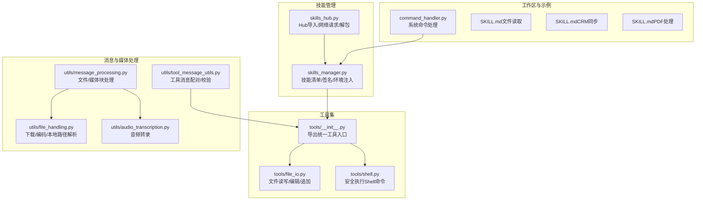
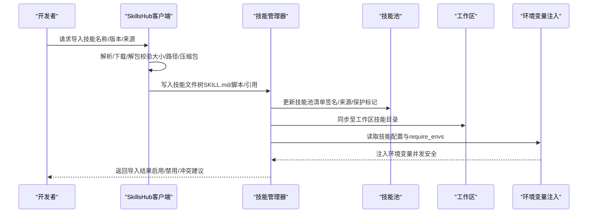
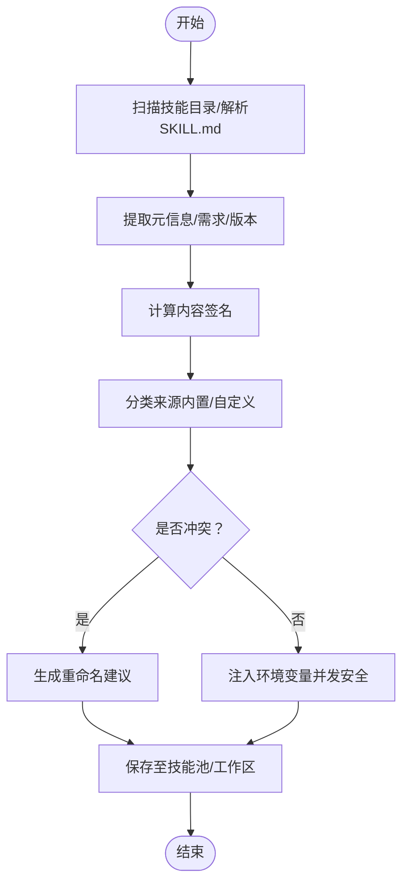
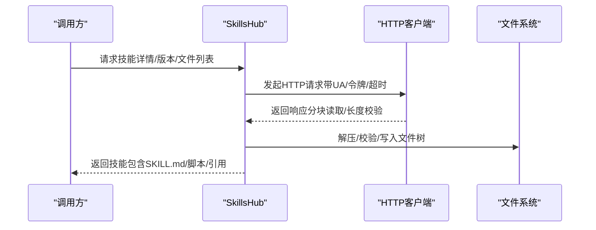
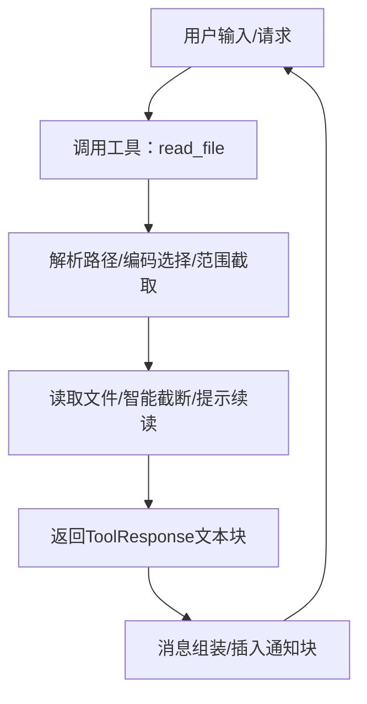
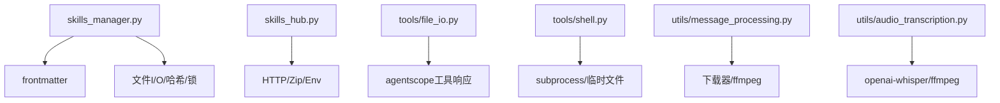

# 技能编程指南

<cite>
**本文档引用的文件**
- [skills_manager.py](file://src/copaw/agents/skills_manager.py)
- [skills_hub.py](file://src/copaw/agents/skills_hub.py)
- [tools/__init__.py](file://src/copaw/agents/tools/__init__.py)
- [file_io.py](file://src/copaw/agents/tools/file_io.py)
- [shell.py](file://src/copaw/agents/tools/shell.py)
- [tool_message_utils.py](file://src/copaw/agents/utils/tool_message_utils.py)
- [message_processing.py](file://src/copaw/agents/utils/message_processing.py)
- [file_handling.py](file://src/copaw/agents/utils/file_handling.py)
- [audio_transcription.py](file://src/copaw/agents/utils/audio_transcription.py)
- [command_handler.py](file://src/copaw/agents/command_handler.py)
- [SKILL.md（文件读取）](file://working/skill_pool/file_reader/SKILL.md)
- [SKILL.md（CRM同步）](file://working/skill_pool/crm_sync/SKILL.md)
- [SKILL.md（PDF处理）](file://working/skill_pool/pdf/SKILL.md)
</cite>

## 目录
1. [简介](#简介)
2. [项目结构](#项目结构)
3. [核心组件](#核心组件)
4. [架构总览](#架构总览)
5. [详细组件分析](#详细组件分析)
6. [依赖分析](#依赖分析)
7. [性能考虑](#性能考虑)
8. [故障排除指南](#故障排除指南)
9. [结论](#结论)
10. [附录](#附录)

## 简介
本指南面向希望在Copaw代理系统中开发“技能”的开发者，系统性阐述技能程序的编写规范、最佳实践与交互方式。内容涵盖：
- 技能文件组织与元数据规范（SKILL.md）
- 函数签名、参数传递与返回值处理
- 与代理系统的交互：上下文获取、工具函数调用、用户输入处理
- 常见技能类型模式：文件处理、网络请求、数据转换
- 错误处理、异常捕获与日志记录
- 技能安装、导入与版本管理流程

## 项目结构
Copaw的技能体系由“技能目录”“技能清单”“技能池”“Hub导入”“工具集”“消息处理”等模块协同组成。下图展示与技能编程相关的核心文件与职责：

图表来源
- [skills_manager.py](file://src/copaw/agents/skills_manager.py)
- [skills_hub.py](file://src/copaw/agents/skills_hub.py)
- [tools/__init__.py](file://src/copaw/agents/tools/__init__.py)
- [file_io.py](file://src/copaw/agents/tools/file_io.py)
- [shell.py](file://src/copaw/agents/tools/shell.py)
- [tool_message_utils.py](file://src/copaw/agents/utils/tool_message_utils.py)
- [message_processing.py](file://src/copaw/agents/utils/message_processing.py)
- [file_handling.py](file://src/copaw/agents/utils/file_handling.py)
- [audio_transcription.py](file://src/copaw/agents/utils/audio_transcription.py)
- [command_handler.py](file://src/copaw/agents/command_handler.py)
- [SKILL.md（文件读取）](file://working/skill_pool/file_reader/SKILL.md)
- [SKILL.md（CRM同步）](file://working/skill_pool/crm_sync/SKILL.md)
- [SKILL.md（PDF处理）](file://working/skill_pool/pdf/SKILL.md)

章节来源
- [skills_manager.py](file://src/copaw/agents/skills_manager.py)
- [skills_hub.py](file://src/copaw/agents/skills_hub.py)
- [tools/__init__.py](file://src/copaw/agents/tools/__init__.py)
- [file_io.py](file://src/copaw/agents/tools/file_io.py)
- [shell.py](file://src/copaw/agents/tools/shell.py)
- [tool_message_utils.py](file://src/copaw/agents/utils/tool_message_utils.py)
- [message_processing.py](file://src/copaw/agents/utils/message_processing.py)
- [file_handling.py](file://src/copaw/agents/utils/file_handling.py)
- [audio_transcription.py](file://src/copaw/agents/utils/audio_transcription.py)
- [command_handler.py](file://src/copaw/agents/command_handler.py)
- [SKILL.md（文件读取）](file://working/skill_pool/file_reader/SKILL.md)
- [SKILL.md（CRM同步）](file://working/skill_pool/crm_sync/SKILL.md)
- [SKILL.md（PDF处理）](file://working/skill_pool/pdf/SKILL.md)

## 核心组件
- 技能清单与签名：通过扫描技能目录、解析SKILL.md、计算内容签名，确保技能一致性与冲突检测。
- 环境变量注入：根据技能配置与声明的require_envs，动态注入环境变量，支持并发安全。
- Hub导入：从ClawHub等源拉取技能包，解包为文件树，校验与落盘。
- 工具集：统一导出文件读写、搜索、Shell执行、发送文件、浏览器控制、截图、媒体查看、时间与时长统计等工具。
- 消息与媒体处理：自动下载/转换文件与媒体，处理音频转录，保证消息块格式正确。
- 系统命令：支持/compact、/new、/clear等对话辅助命令。

章节来源
- [skills_manager.py](file://src/copaw/agents/skills_manager.py)
- [skills_hub.py](file://src/copaw/agents/skills_hub.py)
- [tools/__init__.py](file://src/copaw/agents/tools/__init__.py)
- [tool_message_utils.py](file://src/copaw/agents/utils/tool_message_utils.py)
- [message_processing.py](file://src/copaw/agents/utils/message_processing.py)

## 架构总览
下图展示技能从“导入/安装”到“运行时注入配置”的端到端流程：

图表来源
- [skills_hub.py](file://src/copaw/agents/skills_hub.py)
- [skills_manager.py](file://src/copaw/agents/skills_manager.py)

章节来源
- [skills_hub.py](file://src/copaw/agents/skills_hub.py)
- [skills_manager.py](file://src/copaw/agents/skills_manager.py)

## 详细组件分析

### 组件A：技能清单与环境注入（skills_manager.py）
- 职责
  - 扫描技能目录，解析frontmatter，构建技能元信息（名称、描述、版本、签名、来源、需求）。
  - 计算技能内容签名，用于池同步与冲突检测。
  - 将技能配置映射为环境变量，仅在未占用时注入，支持并发计数释放。
- 关键点
  - 签名计算排除平台无关的缓存与隐藏文件，确保跨平台一致性。
  - require_envs与config联动，缺失项会记录警告；全量JSON以COPAW_SKILL_CONFIG_<NAME>注入。
  - 提供apply_skill_config_env_overrides上下文管理器，在一次对话回合内生效。
- 典型流程（导入/保存/冲突处理）

图表来源
- [skills_manager.py](file://src/copaw/agents/skills_manager.py)

章节来源
- [skills_manager.py](file://src/copaw/agents/skills_manager.py)

### 组件B：技能Hub导入（skills_hub.py）
- 职责
  - 支持ClawHub等Hub源，按slug/version拉取技能包，自动补全文件树。
  - 校验Zip大小、路径合法性、禁止符号链接，避免安全风险。
  - 提供超时/重试/退避策略，支持取消检查。
- 关键点
  - 自动识别SKILL.md位置，支持多形态payload（直接content或files映射）。
  - 对GitHub速率限制进行友好提示，并可使用GITHUB_TOKEN提升限额。
  - 支持最大字节数限制，防止内存溢出。
- 导入流程

图表来源
- [skills_hub.py](file://src/copaw/agents/skills_hub.py)

章节来源
- [skills_hub.py](file://src/copaw/agents/skills_hub.py)

### 组件C：工具集与消息处理（tools与utils）
- 工具集导出
  - 文件：read_file/write_file/edit_file/append_file
  - 搜索：grep_search/glob_search
  - Shell：execute_shell_command（跨平台/超时/进程组/临时文件输出）
  - 媒体：send_file_to_user/desktop_screenshot/view_image/view_video
  - 浏览器：browser_use
  - 时间/用量：get_current_time/set_user_timezone/get_token_usage
  - 内存检索：create_memory_search_tool
- 消息与媒体处理
  - 下载/转换：base64/url到本地路径，音频转录或格式转换，更新消息块。
  - 工具消息配对：确保tool_use与tool_result一一对应，去重/修复/排序。
- 典型流程（文件读取）

图表来源
- [file_io.py](file://src/copaw/agents/tools/file_io.py)
- [tools/__init__.py](file://src/copaw/agents/tools/__init__.py)
- [message_processing.py](file://src/copaw/agents/utils/message_processing.py)
- [tool_message_utils.py](file://src/copaw/agents/utils/tool_message_utils.py)

章节来源
- [tools/__init__.py](file://src/copaw/agents/tools/__init__.py)
- [file_io.py](file://src/copaw/agents/tools/file_io.py)
- [shell.py](file://src/copaw/agents/tools/shell.py)
- [message_processing.py](file://src/copaw/agents/utils/message_processing.py)
- [tool_message_utils.py](file://src/copaw/agents/utils/tool_message_utils.py)

### 组件D：系统命令与代理交互（command_handler.py）
- 职责
  - 处理/compact、/new、/clear、/history、/message、/dump_history、/load_history、/await_summary、/long_term_memory等系统命令。
  - 与记忆组件协作，支持摘要任务异步化与等待。
- 交互要点
  - 命令解析与参数校验，异常封装为SystemCommandException。
  - 与Agent配置热加载结合，动态调整历史长度与显示策略。

章节来源
- [command_handler.py](file://src/copaw/agents/command_handler.py)

## 依赖分析
- 技能管理依赖
  - frontmatter解析、文件系统操作、哈希签名、并发锁、JSON原子写入。
- Hub导入依赖
  - urllib/HTTP、zip安全校验、环境变量控制超时/重试/退避。
- 工具集依赖
  - agentscope工具接口、子进程/管道、临时文件、路径解析。
- 消息处理依赖
  - ffmpeg（可选）、openai-whisper（可选）、下载器（wget/curl/urllib）。

图表来源
- [skills_manager.py](file://src/copaw/agents/skills_manager.py)
- [skills_hub.py](file://src/copaw/agents/skills_hub.py)
- [file_io.py](file://src/copaw/agents/tools/file_io.py)
- [shell.py](file://src/copaw/agents/tools/shell.py)
- [message_processing.py](file://src/copaw/agents/utils/message_processing.py)
- [audio_transcription.py](file://src/copaw/agents/utils/audio_transcription.py)

章节来源
- [skills_manager.py](file://src/copaw/agents/skills_manager.py)
- [skills_hub.py](file://src/copaw/agents/skills_hub.py)
- [file_io.py](file://src/copaw/agents/tools/file_io.py)
- [shell.py](file://src/copaw/agents/tools/shell.py)
- [message_processing.py](file://src/copaw/agents/utils/message_processing.py)
- [audio_transcription.py](file://src/copaw/agents/utils/audio_transcription.py)

## 性能考虑
- 文件读取
  - 使用智能截断与行号范围读取，避免一次性加载大文件。
  - 编码回退策略减少I/O失败重试成本。
- Shell执行
  - 跨平台子进程隔离，Windows使用线程池规避管道阻塞；Unix使用新会话组，超时后清理进程树。
- Hub导入
  - 分块读取响应、限制Zip总大小、路径合法性校验，降低内存峰值。
- 音频转录
  - 可选本地模型与远端API，按需启用，避免不必要的依赖与网络开销。

## 故障排除指南
- 导入失败
  - Zip过大/路径不合法/包含符号链接：检查环境变量与Zip校验逻辑。
  - GitHub速率限制：设置GITHUB_TOKEN。
- 工具调用异常
  - Shell命令超时：增大超时或拆分子任务；确认临时文件清理。
  - 文件读取失败：检查编码回退链与路径解析。
- 工具消息错配
  - 使用工具消息校验与重排，确保tool_use与tool_result顺序与ID一致。
- 音频转录失败
  - 检查ffmpeg与openai-whisper依赖；切换音频模式或提供本地Whisper。

章节来源
- [skills_hub.py](file://src/copaw/agents/skills_hub.py)
- [shell.py](file://src/copaw/agents/tools/shell.py)
- [file_io.py](file://src/copaw/agents/tools/file_io.py)
- [tool_message_utils.py](file://src/copaw/agents/utils/tool_message_utils.py)
- [audio_transcription.py](file://src/copaw/agents/utils/audio_transcription.py)

## 结论
Copaw的技能体系通过“清单/签名/环境注入”“Hub导入/安全校验”“工具集/消息处理”的协同，提供了可扩展、可审计、可复用的技能开发框架。遵循本文档的编写规范与最佳实践，可高效实现各类技能并稳定集成到代理系统中。

## 附录

### 技能编写规范与最佳实践
- 目录与元数据
  - 每个技能目录包含SKILL.md，使用YAML Front Matter声明name、description、metadata（含版本/要求/表情符号）。
  - 示例参考：[SKILL.md（文件读取）](file://working/skill_pool/file_reader/SKILL.md)、[SKILL.md（CRM同步）](file://working/skill_pool/crm_sync/SKILL.md)、[SKILL.md（PDF处理）](file://working/skill_pool/pdf/SKILL.md)
- 函数签名与参数传递
  - 工具函数统一返回ToolResponse（包含文本块），便于消息组装与流式输出。
  - Shell命令支持超时、工作目录、环境变量注入；文件路径支持相对/绝对解析。
- 返回值处理
  - 成功：返回ToolResponse（文本块），必要时附加stderr片段。
  - 失败：返回错误文本块，避免抛出未捕获异常。
- 与代理系统交互
  - 获取代理上下文：通过环境变量注入（apply_skill_config_env_overrides）在回合内生效。
  - 访问工具函数：从tools/__init__.py统一导入，避免直接依赖内部实现。
  - 处理用户输入：使用消息处理工具自动下载/转录媒体，保持消息块一致性。
- 常见技能类型模式
  - 文件处理：read_file/append_file/编辑替换，注意编码与截断。
  - 网络请求：通过Hub导入外部脚本/资源，严格校验Zip与路径。
  - 数据转换：音频转录（本地/远端）、文件下载与扩展名推断。
- 错误处理与日志
  - 统一捕获异常并返回错误文本块；对关键路径（下载/转录/Shell）记录详细日志。
  - 对缺失依赖（ffmpeg/openai-whisper）给出明确提示与替代方案。

章节来源
- [tools/__init__.py](file://src/copaw/agents/tools/__init__.py)
- [file_io.py](file://src/copaw/agents/tools/file_io.py)
- [shell.py](file://src/copaw/agents/tools/shell.py)
- [message_processing.py](file://src/copaw/agents/utils/message_processing.py)
- [audio_transcription.py](file://src/copaw/agents/utils/audio_transcription.py)
- [SKILL.md（文件读取）](file://working/skill_pool/file_reader/SKILL.md)
- [SKILL.md（CRM同步）](file://working/skill_pool/crm_sync/SKILL.md)
- [SKILL.md（PDF处理）](file://working/skill_pool/pdf/SKILL.md)