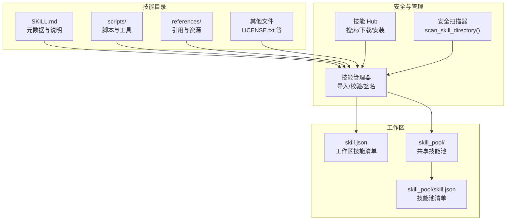
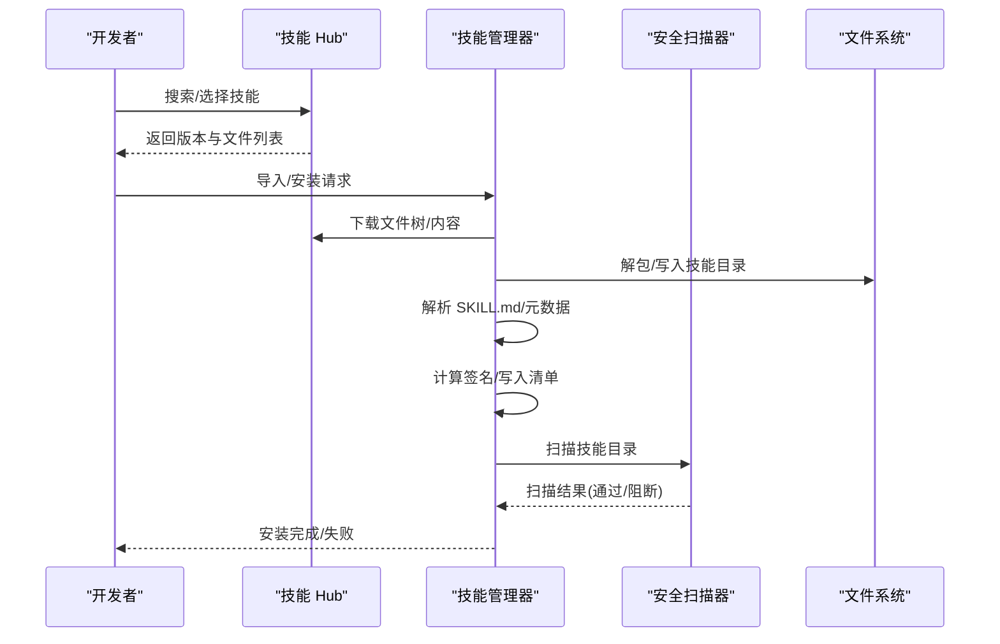
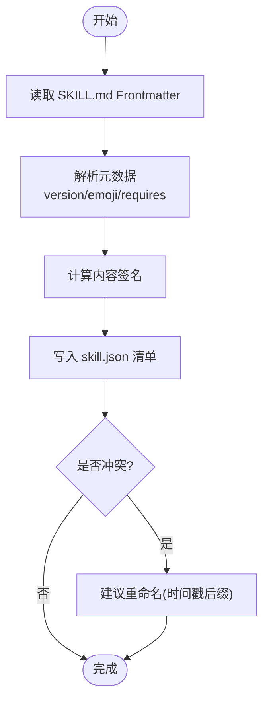
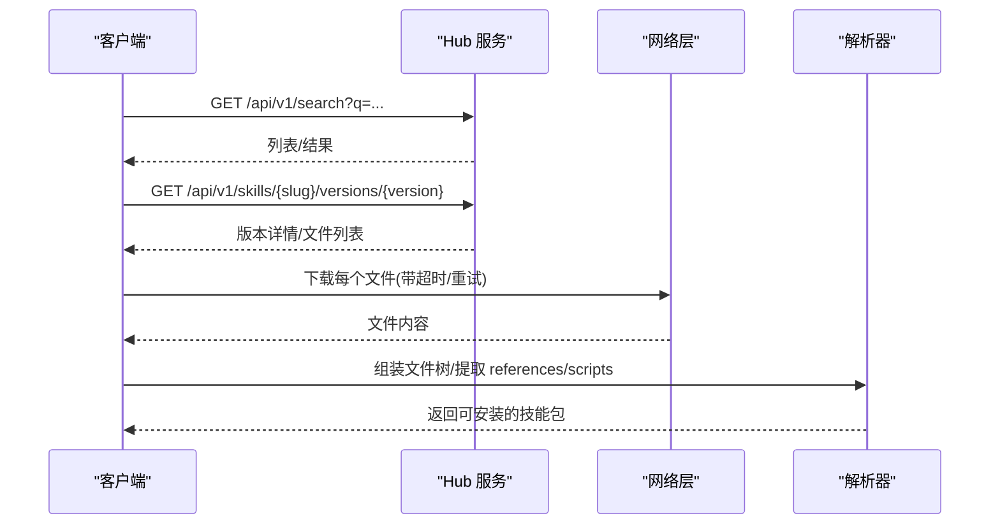
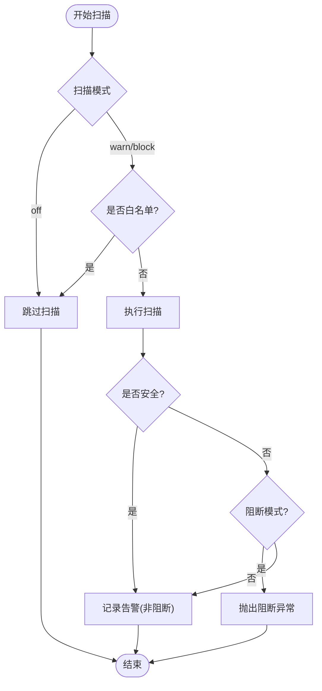
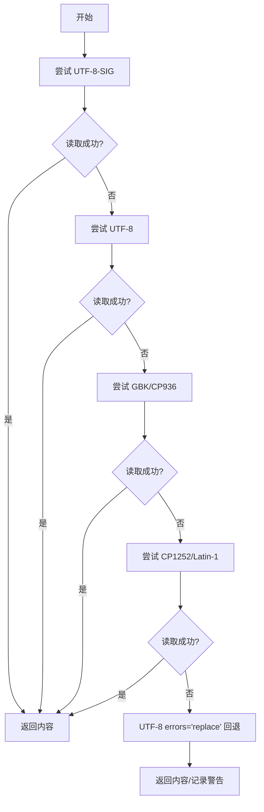
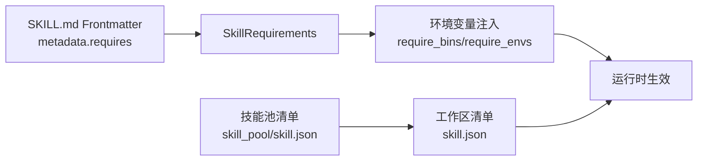

# 自定义技能开发

<cite>
**本文引用的文件**
- [skills_hub.py](file://src/copaw/agents/skills_hub.py)
- [skills_manager.py](file://src/copaw/agents/skills_manager.py)
- [skill_scanner/__init__.py](file://src/copaw/security/skill_scanner/__init__.py)
- [file_handling.py](file://src/copaw/agents/utils/file_handling.py)
- [constant.py](file://src/copaw/constant.py)
- [skill_pool/skill.json](file://working/skill_pool/skill.json)
- [workspaces/default/skill.json](file://working/workspaces/default/skill.json)
- [skill_pool/browser_cdp/SKILL.md](file://working/skill_pool/browser_cdp/SKILL.md)
- [skill_pool/pdf/SKILL.md](file://working/skill_pool/pdf/SKILL.md)
- [skill_pool/docx/SKILL.md](file://working/skill_pool/docx/SKILL.md)
- [skill_pool/xlsx/SKILL.md](file://working/skill_pool/xlsx/SKILL.md)
- [QUICK-START.md](file://docs/QUICK-START.md)
</cite>

## 目录
1. [简介](#简介)
2. [项目结构](#项目结构)
3. [核心组件](#核心组件)
4. [架构总览](#架构总览)
5. [详细组件分析](#详细组件分析)
6. [依赖分析](#依赖分析)
7. [性能考虑](#性能考虑)
8. [故障排查指南](#故障排查指南)
9. [结论](#结论)
10. [附录](#附录)

## 简介
本指南面向希望在 Copaw 平台上开发自定义技能（Skill）的开发者，系统讲解技能开发的概念、文件结构、元数据配置、主程序文件编写、依赖声明与安全扫描、环境搭建与调试、最佳实践与代码规范、打包发布流程（含 ZIP 打包、版本管理、Hub 发布）以及常见场景示例与解决方案。文档兼顾技术深度与易用性，帮助从入门到进阶逐步掌握 Copaw 技能体系。

## 项目结构
Copaw 将“技能”抽象为可被加载、校验、注册与运行的单元。技能的核心由以下要素构成：
- 技能元数据：位于 SKILL.md 的 Frontmatter，定义名称、描述、版本、许可与运行时要求等。
- 技能内容：Python/JS/Shell 脚本、文档与资源文件，放置于技能目录下。
- 技能清单：技能池与工作区分别维护 skill.json，记录技能来源、签名、版本与更新时间等。
- 安全扫描：在激活或安装前对技能进行安全扫描，阻断高危威胁。
- Hub 与安装：支持从 Hub 搜索、下载、解包与安装技能，具备重试、超时与取消机制。

图示来源
- [skills_manager.py:64-82](file://src/copaw/agents/skills_manager.py#L64-L82)
- [skills_hub.py:553-636](file://src/copaw/agents/skills_hub.py#L553-L636)
- [skill_pool/skill.json:1-370](file://working/skill_pool/skill.json#L1-L370)
- [workspaces/default/skill.json:1-5](file://working/workspaces/default/skill.json#L1-L5)

章节来源
- [skills_manager.py:64-82](file://src/copaw/agents/skills_manager.py#L64-L82)
- [skills_hub.py:553-636](file://src/copaw/agents/skills_hub.py#L553-L636)
- [skill_pool/skill.json:1-370](file://working/skill_pool/skill.json#L1-L370)
- [workspaces/default/skill.json:1-5](file://working/workspaces/default/skill.json#L1-L5)

## 核心组件
- 技能元数据与清单
  - 元数据：SKILL.md 的 Frontmatter，包含 name、description、metadata（含版本、copaw 配置、emoji、requires 等）。
  - 清单：技能池 skill_pool/skill.json 与工作区 skill.json，记录技能来源、签名、版本与更新时间等。
- 技能管理器
  - 负责读取 SKILL.md、解析元数据、构建技能签名、写入清单、应用配置环境变量、冲突检测与重命名建议。
- Hub 客户端
  - 支持从 Hub 搜索、拉取版本、下载文件树、解包为本地技能目录，并进行安全扫描。
- 安全扫描器
  - 在安装/激活前扫描技能，支持白名单、阻断/告警模式、缓存与历史记录。
- 文件处理工具
  - 提供跨平台编码兼容读取、下载、扩展名推断与空文件检测等能力。

章节来源
- [skills_manager.py:206-246](file://src/copaw/agents/skills_manager.py#L206-L246)
- [skills_manager.py:713-742](file://src/copaw/agents/skills_manager.py#L713-L742)
- [skills_hub.py:553-636](file://src/copaw/agents/skills_hub.py#L553-L636)
- [skill_scanner/__init__.py:415-505](file://src/copaw/security/skill_scanner/__init__.py#L415-L505)
- [file_handling.py:31-103](file://src/copaw/agents/utils/file_handling.py#L31-L103)

## 架构总览
Copaw 技能体系围绕“元数据驱动 + 安全前置 + 可移植分发”的设计展开。Hub 作为技能分发中心，管理版本与文件树；技能管理器负责本地导入、签名与清单同步；安全扫描器贯穿安装生命周期；工作区与技能池共同维护技能的启用状态与来源。

图示来源
- [skills_hub.py:553-636](file://src/copaw/agents/skills_hub.py#L553-L636)
- [skills_manager.py:713-742](file://src/copaw/agents/skills_manager.py#L713-L742)
- [skill_scanner/__init__.py:415-505](file://src/copaw/security/skill_scanner/__init__.py#L415-L505)

## 详细组件分析

### 组件A：技能元数据与清单
- 元数据来源与字段
  - SKILL.md Frontmatter：name、description、metadata（含版本、copaw 配置、emoji、requires 等）。
  - 清单字段：name、description、version_text、commit_text、signature、source、protected、requirements、updated_at。
- 解析与校验
  - 读取 Frontmatter，提取版本与依赖；计算内容签名；写入工作区与技能池清单。
- 冲突与重命名
  - 当同名技能冲突时，提供时间戳后缀的建议重命名，避免覆盖。

图示来源
- [skills_manager.py:206-246](file://src/copaw/agents/skills_manager.py#L206-L246)
- [skills_manager.py:713-742](file://src/copaw/agents/skills_manager.py#L713-L742)
- [skills_manager.py:748-769](file://src/copaw/agents/skills_manager.py#L748-L769)

章节来源
- [skills_manager.py:64-82](file://src/copaw/agents/skills_manager.py#L64-L82)
- [skills_manager.py:206-246](file://src/copaw/agents/skills_manager.py#L206-L246)
- [skills_manager.py:713-742](file://src/copaw/agents/skills_manager.py#L713-L742)
- [skills_manager.py:748-769](file://src/copaw/agents/skills_manager.py#L748-L769)

### 组件B：Hub 搜索与安装流程
- Hub 接口
  - 搜索、版本查询、文件下载、内容 Hydration（将 Hub 响应转换为包含文件内容的包）。
- 安全与容错
  - HTTP 超时、重试与指数退避；速率限制与 429/5xx 处理；响应大小限制；取消检查。
- 文件树与内容提取
  - 将 Hub 返回的文件列表转换为本地目录树；提取 references/scripts 与额外文件；保证 SKILL.md 存在。

图示来源
- [skills_hub.py:190-220](file://src/copaw/agents/skills_hub.py#L190-L220)
- [skills_hub.py:287-400](file://src/copaw/agents/skills_hub.py#L287-L400)
- [skills_hub.py:553-636](file://src/copaw/agents/skills_hub.py#L553-L636)

章节来源
- [skills_hub.py:190-220](file://src/copaw/agents/skills_hub.py#L190-L220)
- [skills_hub.py:287-400](file://src/copaw/agents/skills_hub.py#L287-L400)
- [skills_hub.py:553-636](file://src/copaw/agents/skills_hub.py#L553-L636)

### 组件C：安全扫描与策略
- 扫描模式与策略
  - 支持 block/warn/off 三种模式；可配置超时；支持白名单；缓存最近扫描结果。
- 历史记录与阻断
  - 记录阻断/警告历史；支持清除与移除；阻断时抛出异常。
- 内容哈希
  - 基于文件内容计算哈希，用于白名单匹配与缓存键。

图示来源
- [skill_scanner/__init__.py:85-114](file://src/copaw/security/skill_scanner/__init__.py#L85-L114)
- [skill_scanner/__init__.py:415-505](file://src/copaw/security/skill_scanner/__init__.py#L415-L505)

章节来源
- [skill_scanner/__init__.py:85-114](file://src/copaw/security/skill_scanner/__init__.py#L85-L114)
- [skill_scanner/__init__.py:415-505](file://src/copaw/security/skill_scanner/__init__.py#L415-L505)

### 组件D：文件处理与下载
- 编码兼容读取
  - 尝试 UTF-8-SIG、UTF-8、GBK/CP936、CP1252/Latin-1 等编码，最终回退到替换错误字符。
- 下载与扩展名推断
  - 支持 wget/curl/urllib 三路下载；HEAD 请求推断扩展名；魔数推断；空文件检测。
- 下载目录
  - 默认下载目录为当前工作区 downloads。

图示来源
- [file_handling.py:31-103](file://src/copaw/agents/utils/file_handling.py#L31-L103)
- [file_handling.py:287-357](file://src/copaw/agents/utils/file_handling.py#L287-L357)

章节来源
- [file_handling.py:31-103](file://src/copaw/agents/utils/file_handling.py#L31-L103)
- [file_handling.py:287-357](file://src/copaw/agents/utils/file_handling.py#L287-L357)

## 依赖分析
- 技能依赖声明
  - 元数据中 metadata.copaw.requires 可声明 bins/env 等系统依赖；管理器解析为 SkillRequirements 并注入环境变量。
- 环境变量注入
  - 仅注入在 require_envs 中声明的配置项；其余配置通过 JSON 字符串注入到 COPAW_SKILL_CONFIG_<SKILL_NAME>。
- 工作区与技能池
  - 技能池清单记录 builtin/customized 来源与签名；工作区清单记录启用技能及其配置。

图示来源
- [skills_manager.py:542-567](file://src/copaw/agents/skills_manager.py#L542-L567)
- [skills_manager.py:666-711](file://src/copaw/agents/skills_manager.py#L666-L711)
- [skill_pool/skill.json:1-370](file://working/skill_pool/skill.json#L1-L370)
- [workspaces/default/skill.json:1-5](file://working/workspaces/default/skill.json#L1-L5)

章节来源
- [skills_manager.py:542-567](file://src/copaw/agents/skills_manager.py#L542-L567)
- [skills_manager.py:666-711](file://src/copaw/agents/skills_manager.py#L666-L711)
- [skill_pool/skill.json:1-370](file://working/skill_pool/skill.json#L1-L370)
- [workspaces/default/skill.json:1-5](file://working/workspaces/default/skill.json#L1-L5)

## 性能考虑
- 扫描缓存
  - 基于目录 mtime 的缓存，最多保留固定条目，避免重复扫描。
- I/O 与压缩
  - ZIP 解压时限制总大小与路径合法性，防止过大或危险路径导致内存与磁盘压力。
- 网络与重试
  - Hub 下载采用超时、重试与指数退避，提升稳定性并降低失败率。
- 并发与锁
  - 清单写入使用原子替换与文件锁，避免并发写入冲突。

章节来源
- [skill_scanner/__init__.py:327-381](file://src/copaw/security/skill_scanner/__init__.py#L327-L381)
- [skills_manager.py:452-474](file://src/copaw/agents/skills_manager.py#L452-L474)
- [skills_manager.py:317-335](file://src/copaw/agents/skills_manager.py#L317-L335)

## 故障排查指南
- 安装失败
  - 检查 Hub 返回状态与错误消息；确认 GITHUB_TOKEN（如需）；查看重试次数与退避间隔。
  - 若 ZIP 超大或包含危险路径，将触发限制与异常。
- 安全扫描阻断
  - 查看扫描模式与白名单；检查历史记录；必要时调整规则或修复技能。
- 编码与下载问题
  - 使用编码回退读取；确认下载工具可用；检查 HEAD/魔数推断结果。
- 环境变量未生效
  - 确认 require_envs 与配置项一致；检查是否被其他环境变量覆盖。

章节来源
- [skills_hub.py:312-364](file://src/copaw/agents/skills_hub.py#L312-L364)
- [skills_manager.py:452-474](file://src/copaw/agents/skills_manager.py#L452-L474)
- [skill_scanner/__init__.py:415-505](file://src/copaw/security/skill_scanner/__init__.py#L415-L505)
- [file_handling.py:156-194](file://src/copaw/agents/utils/file_handling.py#L156-L194)

## 结论
Copaw 的技能体系以元数据为核心、以安全为前提、以可移植为目标，结合 Hub 分发与本地管理，形成从开发、测试、安装到运行的完整闭环。遵循本文档的文件结构、元数据配置、依赖声明与安全扫描流程，可显著提升技能开发效率与质量。

## 附录

### A. 技能开发文件结构与元数据
- 必备文件
  - SKILL.md：Frontmatter 包含 name、description、metadata（含版本、emoji、requires 等）。
  - scripts/：技能相关脚本与工具（相对路径以技能目录为根）。
  - references/：引用与资源文件。
  - 其他：LICENSE.txt 等。
- 示例参考
  - 浏览器 CDP 技能：隐私与单实例限制、CDP 端口扫描与连接、Cookies 与缓存处理。
  - PDF 技能：pypdf/pdfplumber/reportlab 等工具链与命令行工具使用。
  - DOCX 技能：docx-js 规则、表格宽度与阴影、图片类型参数、TOC 与页眉页脚。
  - XLSX 技能：openpyxl/pandas 使用、公式优先、LibreOffice 重算与错误检查。

章节来源
- [skill_pool/browser_cdp/SKILL.md:1-182](file://working/skill_pool/browser_cdp/SKILL.md#L1-L182)
- [skill_pool/pdf/SKILL.md:1-330](file://working/skill_pool/pdf/SKILL.md#L1-L330)
- [skill_pool/docx/SKILL.md:1-488](file://working/skill_pool/docx/SKILL.md#L1-L488)
- [skill_pool/xlsx/SKILL.md:1-306](file://working/skill_pool/xlsx/SKILL.md#L1-L306)

### B. 环境搭建与调试
- 快速起步
  - 参考快速入门文档，选择安装方式（pip/Docker/桌面应用/脚本安装），初始化配置并启动服务。
- 本地测试
  - 在工作区启用技能，使用 /skills 列表与 /<skill_name> 执行命令进行验证。
- 调试技巧
  - 查看日志级别与心跳文件；利用下载工具与编码回退读取；关注扫描器告警与阻断历史。

章节来源
- [QUICK-START.md:1-356](file://docs/QUICK-START.md#L1-L356)
- [constant.py:126-149](file://src/copaw/constant.py#L126-L149)

### C. 最佳实践与代码规范
- 安全性
  - 严格遵守安全扫描策略；避免硬编码敏感信息；使用白名单与最小权限原则。
- 错误处理
  - 明确异常类型与错误消息；对网络与 I/O 操作设置超时与重试；对空文件与无效路径进行校验。
- 资源管理
  - 控制 ZIP 大小与路径合法性；合理使用缓存与原子写入；避免竞态与死锁。
- 元数据与依赖
  - 正确填写 Frontmatter；声明系统依赖与环境变量；保持版本号与更新时间同步。

章节来源
- [skill_scanner/__init__.py:85-114](file://src/copaw/security/skill_scanner/__init__.py#L85-L114)
- [skills_manager.py:452-474](file://src/copaw/agents/skills_manager.py#L452-L474)
- [file_handling.py:156-194](file://src/copaw/agents/utils/file_handling.py#L156-L194)

### D. 打包发布流程
- ZIP 打包
  - 将技能目录内容打包为 ZIP；限制总大小与路径合法性；确保包含 SKILL.md 与 references/scripts。
- 版本管理
  - 在 Frontmatter 中维护版本号；更新 updated_at；与 Hub 版本对应。
- Hub 发布
  - 通过 Hub API 提交文件树与元数据；遵循搜索/版本/文件接口；处理重试与速率限制。
- 工作区与技能池
  - 安装后写入技能池与工作区清单；根据来源（builtin/customized）与签名判定一致性。

章节来源
- [skills_manager.py:452-474](file://src/copaw/agents/skills_manager.py#L452-L474)
- [skills_hub.py:553-636](file://src/copaw/agents/skills_hub.py#L553-L636)
- [skill_pool/skill.json:1-370](file://working/skill_pool/skill.json#L1-L370)
- [workspaces/default/skill.json:1-5](file://working/workspaces/default/skill.json#L1-L5)