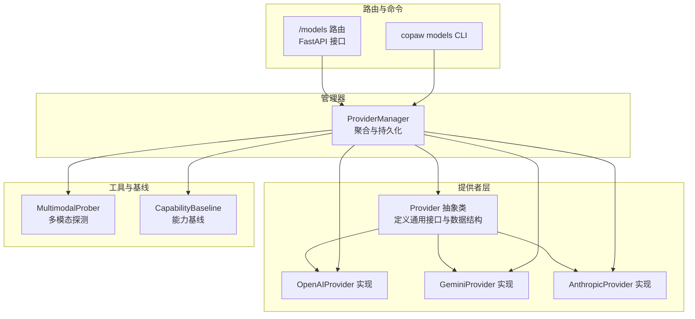
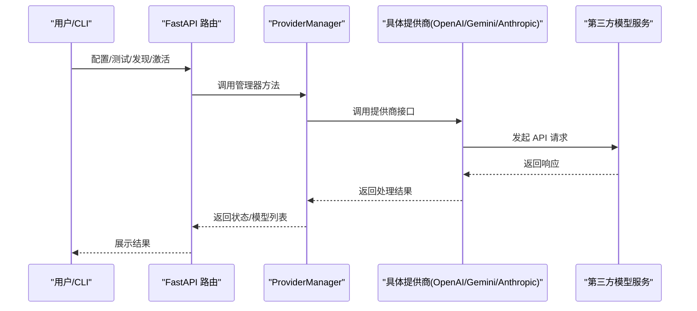
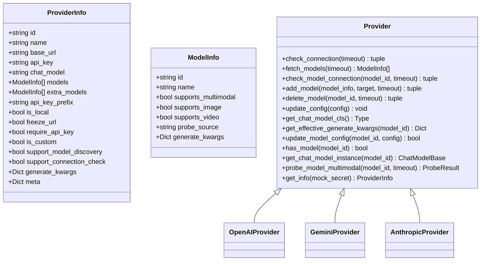
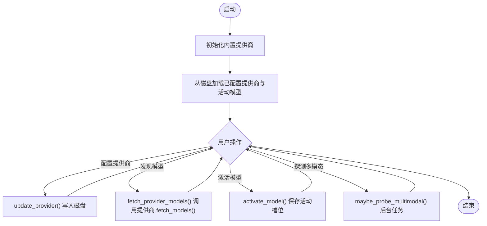
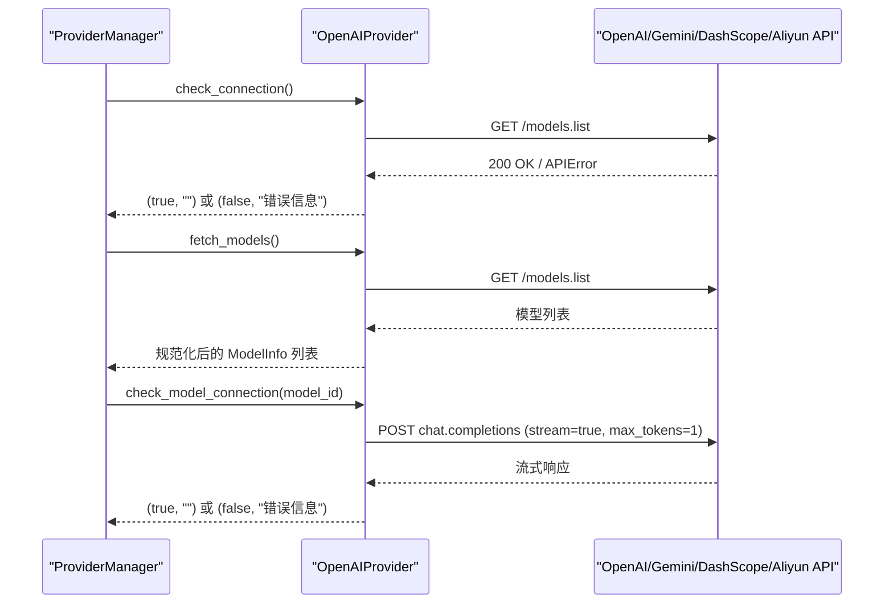
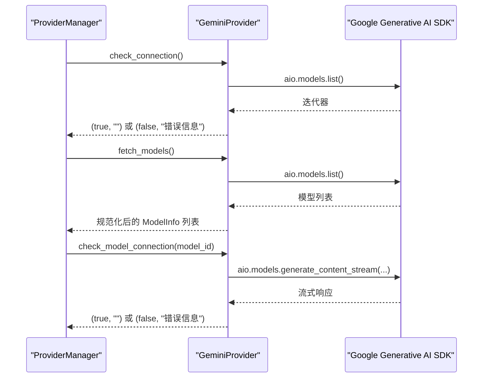
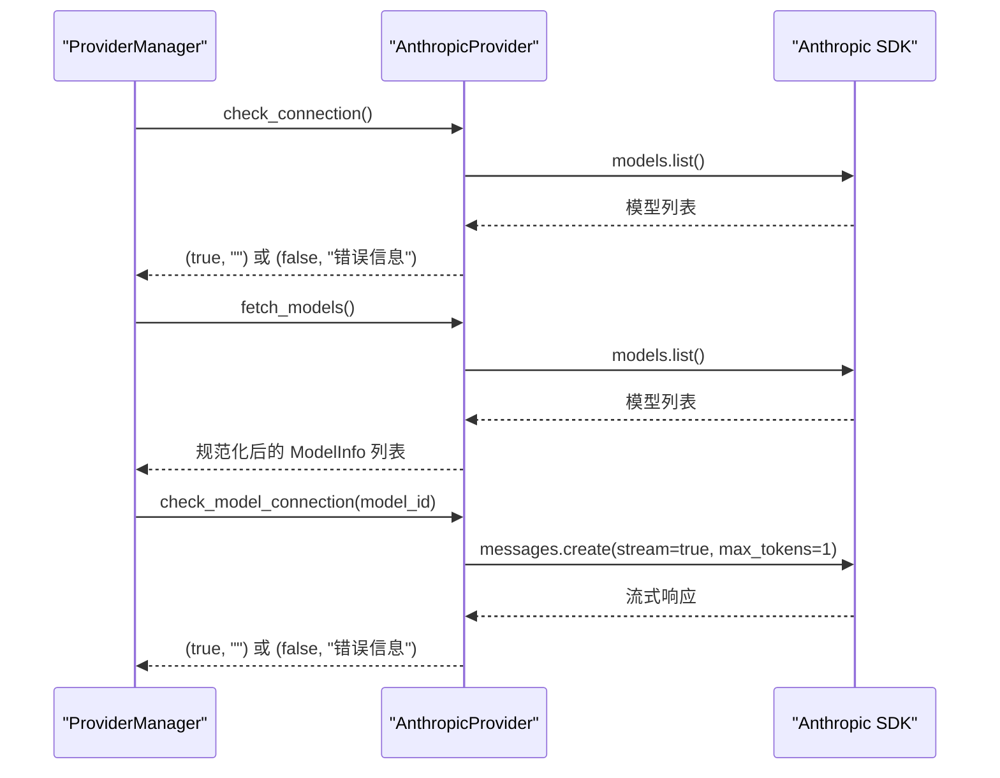
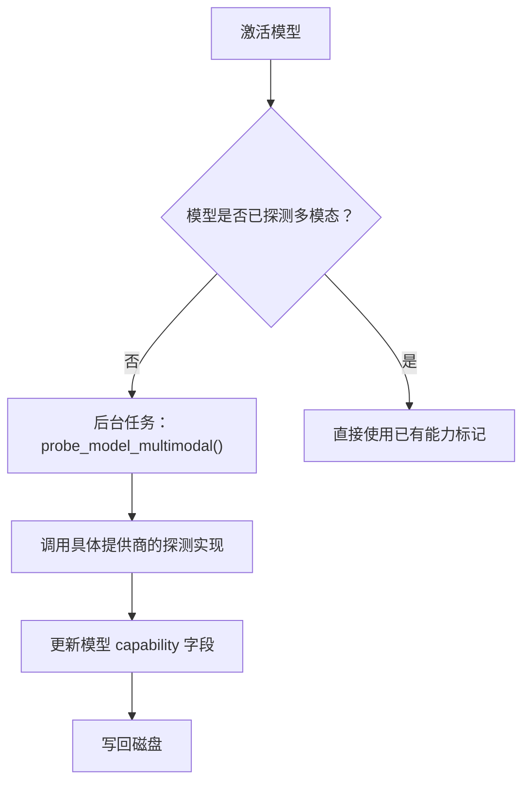
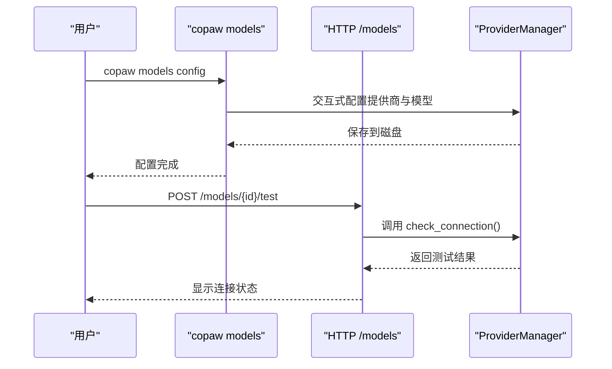
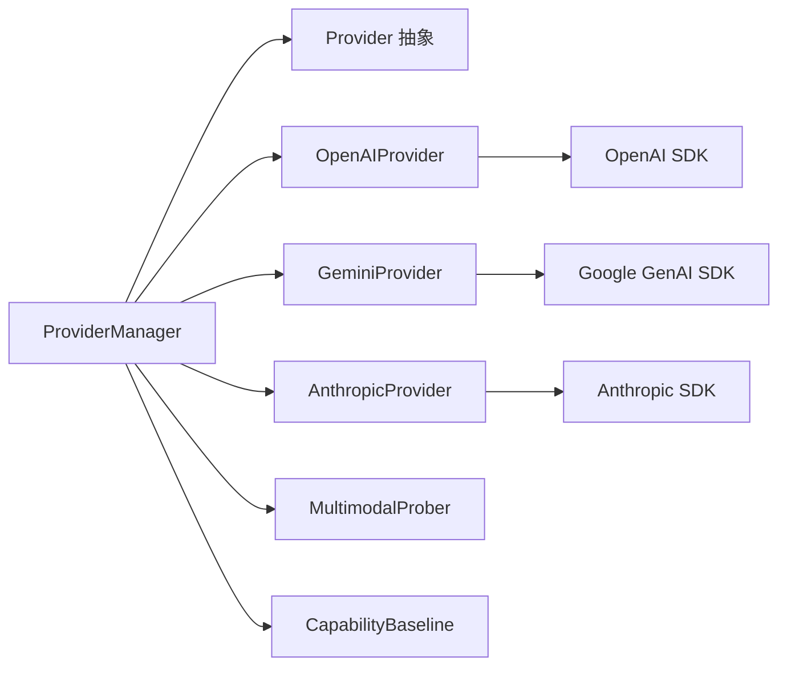

# 云端模型提供商

<cite>
**本文引用的文件**
- [provider.py](file://src/copaw/providers/provider.py)
- [provider_manager.py](file://src/copaw/providers/provider_manager.py)
- [openai_provider.py](file://src/copaw/providers/openai_provider.py)
- [gemini_provider.py](file://src/copaw/providers/gemini_provider.py)
- [anthropic_provider.py](file://src/copaw/providers/anthropic_provider.py)
- [multimodal_prober.py](file://src/copaw/providers/multimodal_prober.py)
- [models.py](file://src/copaw/providers/models.py)
- [capability_baseline.py](file://src/copaw/providers/capability_baseline.py)
- [providers.py](file://src/copaw/app/routers/providers.py)
- [providers_cmd.py](file://src/copaw/cli/providers_cmd.py)
- [QUICK-START.md](file://docs/QUICK-START.md)
</cite>

## 目录
1. [简介](#简介)
2. [项目结构](#项目结构)
3. [核心组件](#核心组件)
4. [架构总览](#架构总览)
5. [详细组件分析](#详细组件分析)
6. [依赖关系分析](#依赖关系分析)
7. [性能考量](#性能考量)
8. [故障排除指南](#故障排除指南)
9. [结论](#结论)
10. [附录](#附录)

## 简介
本指南面向需要在系统中配置与使用云端大语言模型提供商的用户与开发者，覆盖 OpenAI、Gemini、Claude（Anthropic）、Kimi 等主流服务的接入方式。内容包括：
- 如何添加与配置提供商（API 密钥、基础地址、协议适配）
- 连接测试、模型列表获取与可用性验证
- 各提供商的特性、价格差异、性能特点与适用场景
- 模型参数调优建议（温度、最大令牌数、频率惩罚等）
- 故障排除与常见问题解决

## 项目结构
围绕“云端模型提供商”的核心代码位于 src/copaw/providers 目录，配合 FastAPI 路由与 CLI 命令实现统一的配置与管理入口。

图示来源
- [provider.py:111-314](file://src/copaw/providers/provider.py#L111-L314)
- [openai_provider.py:25-164](file://src/copaw/providers/openai_provider.py#L25-L164)
- [gemini_provider.py:27-140](file://src/copaw/providers/gemini_provider.py#L27-L140)
- [anthropic_provider.py:27-164](file://src/copaw/providers/anthropic_provider.py#L27-L164)
- [provider_manager.py:670-732](file://src/copaw/providers/provider_manager.py#L670-L732)
- [providers.py:148-191](file://src/copaw/app/routers/providers.py#L148-L191)
- [providers_cmd.py:469-538](file://src/copaw/cli/providers_cmd.py#L469-L538)

章节来源
- [provider.py:17-109](file://src/copaw/providers/provider.py#L17-L109)
- [provider_manager.py:670-732](file://src/copaw/providers/provider_manager.py#L670-L732)
- [providers.py:148-191](file://src/copaw/app/routers/providers.py#L148-L191)
- [providers_cmd.py:469-538](file://src/copaw/cli/providers_cmd.py#L469-L538)

## 核心组件
- Provider 抽象类：定义提供商的通用配置、连接检查、模型发现、实例化等接口；提供生成参数合并、模型增删改查等通用能力。
- ProviderManager：负责内置与自定义提供商的注册、加载、持久化、激活模型槽位、后台自动探测多模态能力。
- 具体提供商实现：OpenAIProvider、GeminiProvider、AnthropicProvider，分别对接各平台 API，并实现各自的连接检查、模型发现、多模态探测。
- 多模态探测器：统一的探测常量与结果结构，支持图片与视频探测。
- 能力基线：记录官方文档标注的期望能力，用于对比实际探测结果。
- 路由与 CLI：提供统一的 HTTP 接口与命令行工具，便于配置、测试、发现与管理。

章节来源
- [provider.py:111-314](file://src/copaw/providers/provider.py#L111-L314)
- [provider_manager.py:670-732](file://src/copaw/providers/provider_manager.py#L670-L732)
- [openai_provider.py:25-164](file://src/copaw/providers/openai_provider.py#L25-L164)
- [gemini_provider.py:27-140](file://src/copaw/providers/gemini_provider.py#L27-L140)
- [anthropic_provider.py:27-164](file://src/copaw/providers/anthropic_provider.py#L27-L164)
- [multimodal_prober.py:75-102](file://src/copaw/providers/multimodal_prober.py#L75-L102)
- [capability_baseline.py:55-90](file://src/copaw/providers/capability_baseline.py#L55-L90)

## 架构总览
下图展示从 UI/CLI 到后端管理器与具体提供商实现的交互流程。

图示来源
- [providers.py:148-191](file://src/copaw/app/routers/providers.py#L148-L191)
- [provider_manager.py:833-855](file://src/copaw/providers/provider_manager.py#L833-L855)
- [openai_provider.py:57-84](file://src/copaw/providers/openai_provider.py#L57-L84)
- [gemini_provider.py:68-101](file://src/copaw/providers/gemini_provider.py#L68-L101)
- [anthropic_provider.py:66-86](file://src/copaw/providers/anthropic_provider.py#L66-L86)

## 详细组件分析

### Provider 抽象类与数据模型
- 数据模型
  - ProviderInfo：提供商基本信息（名称、ID、基础地址、API 密钥、聊天模型类名、是否本地、是否冻结地址、是否需要密钥、是否自定义、是否支持模型发现/连接检查、默认生成参数、元数据等）。
  - ModelInfo：模型信息（ID、名称、多模态支持标记、探测来源、模型级生成参数覆盖）。
  - ModelSlotConfig：当前激活的提供商与模型槽位。
- 关键能力
  - 连接检查、模型发现、单模型可用性检查。
  - 生成参数合并（提供者级与模型级深度合并）。
  - 模型增删改查与配置更新。
  - 多模态探测入口（默认返回空结果，子类可覆盖）。

图示来源
- [provider.py:17-109](file://src/copaw/providers/provider.py#L17-L109)
- [provider.py:111-314](file://src/copaw/providers/provider.py#L111-L314)
- [models.py:9-16](file://src/copaw/providers/models.py#L9-L16)

章节来源
- [provider.py:17-109](file://src/copaw/providers/provider.py#L17-L109)
- [provider.py:111-314](file://src/copaw/providers/provider.py#L111-L314)
- [models.py:9-16](file://src/copaw/providers/models.py#L9-L16)

### ProviderManager：聚合与持久化
- 初始化内置提供商（OpenAI、Gemini、Anthropic、Kimi、DeepSeek、MiniMax、Ollama、LM Studio、SiliconFlow 等），并注入默认模型清单。
- 提供以下关键能力：
  - 列出提供商信息（含 UI 友好展示）。
  - 更新提供商配置（API 密钥、基础地址、聊天模型类名、生成参数）。
  - 获取/保存活动模型槽位（全局或按代理）。
  - 自动探测多模态能力并在后台异步执行。
  - 插件提供商注册与持久化。
  - 加载/迁移旧配置格式。

图示来源
- [provider_manager.py:670-732](file://src/copaw/providers/provider_manager.py#L670-L732)
- [provider_manager.py:833-855](file://src/copaw/providers/provider_manager.py#L833-L855)
- [provider_manager.py:901-922](file://src/copaw/providers/provider_manager.py#L901-L922)
- [provider_manager.py:923-951](file://src/copaw/providers/provider_manager.py#L923-L951)

章节来源
- [provider_manager.py:670-732](file://src/copaw/providers/provider_manager.py#L670-L732)
- [provider_manager.py:833-855](file://src/copaw/providers/provider_manager.py#L833-L855)
- [provider_manager.py:901-922](file://src/copaw/providers/provider_manager.py#L901-L922)
- [provider_manager.py:923-951](file://src/copaw/providers/provider_manager.py#L923-L951)

### OpenAIProvider：兼容 OpenAI 协议的提供商
- 连接检查：通过 models.list 验证基础地址与密钥。
- 模型发现：调用 models.list 并去重规范化为 ModelInfo 列表。
- 单模型可用性：发送最小流式请求以验证可用性。
- 多模态探测：对图片与视频分别进行探测，支持两阶段验证（拒绝错误与语义验证），并具备格式回退策略。
- 聊天模型实例：根据提供商类型选择合适的 ChatModel 类并传入生成参数。

图示来源
- [openai_provider.py:57-125](file://src/copaw/providers/openai_provider.py#L57-L125)
- [openai_provider.py:73-84](file://src/copaw/providers/openai_provider.py#L73-L84)
- [openai_provider.py:85-125](file://src/copaw/providers/openai_provider.py#L85-L125)

章节来源
- [openai_provider.py:25-164](file://src/copaw/providers/openai_provider.py#L25-L164)
- [openai_provider.py:165-550](file://src/copaw/providers/openai_provider.py#L165-L550)

### GeminiProvider：Google Gemini
- 连接检查：调用 models.list 异步迭代器。
- 模型发现：异步遍历 models.list 并规范化。
- 单模型可用性：使用 generate_content_stream 验证。
- 多模态探测：基于 inline_data（图片）与 file_data（视频）进行探测，严格区分文本/视觉输入。

图示来源
- [gemini_provider.py:68-131](file://src/copaw/providers/gemini_provider.py#L68-L131)
- [gemini_provider.py:88-101](file://src/copaw/providers/gemini_provider.py#L88-L101)
- [gemini_provider.py:102-131](file://src/copaw/providers/gemini_provider.py#L102-L131)

章节来源
- [gemini_provider.py:27-332](file://src/copaw/providers/gemini_provider.py#L27-L332)

### AnthropicProvider：Claude（Anthropic）
- 连接检查：调用 models.list。
- 模型发现：解析返回数据并去重。
- 单模型可用性：messages.create 并消费流以验证。
- 多模态探测：仅支持图片输入（视频不支持），采用 base64 图片源格式探测。

图示来源
- [anthropic_provider.py:66-127](file://src/copaw/providers/anthropic_provider.py#L66-L127)
- [anthropic_provider.py:80-86](file://src/copaw/providers/anthropic_provider.py#L80-L86)
- [anthropic_provider.py:87-127](file://src/copaw/providers/anthropic_provider.py#L87-L127)

章节来源
- [anthropic_provider.py:27-256](file://src/copaw/providers/anthropic_provider.py#L27-L256)

### 多模态探测与能力基线
- 探测器提供统一的探测常量（如探测用图片/视频数据、探测结果结构）。
- ProviderManager 在激活模型时若模型未探测过，则异步后台执行探测并将结果持久化。
- 能力基线记录官方文档标注的期望能力，用于对比探测结果并输出差异日志。

图示来源
- [provider_manager.py:923-951](file://src/copaw/providers/provider_manager.py#L923-L951)
- [provider_manager.py:1009-1066](file://src/copaw/providers/provider_manager.py#L1009-L1066)
- [multimodal_prober.py:75-102](file://src/copaw/providers/multimodal_prober.py#L75-L102)
- [capability_baseline.py:55-90](file://src/copaw/providers/capability_baseline.py#L55-L90)

章节来源
- [provider_manager.py:1009-1066](file://src/copaw/providers/provider_manager.py#L1009-L1066)
- [multimodal_prober.py:75-102](file://src/copaw/providers/multimodal_prober.py#L75-L102)
- [capability_baseline.py:55-90](file://src/copaw/providers/capability_baseline.py#L55-L90)

### 路由与 CLI：统一的配置入口
- FastAPI 路由提供以下能力：
  - 列出提供商、配置提供商、创建/删除自定义提供商。
  - 连接测试、模型发现、单模型测试。
  - 多模态探测、模型参数配置（覆盖提供者级生成参数）。
  - 获取/设置活动模型（全局或按代理）。
- CLI 提供交互式配置：选择提供商、填写 API 密钥与基础地址、添加/删除模型、设置活动模型。

图示来源
- [providers.py:148-191](file://src/copaw/app/routers/providers.py#L148-L191)
- [providers.py:275-305](file://src/copaw/app/routers/providers.py#L275-L305)
- [providers_cmd.py:469-538](file://src/copaw/cli/providers_cmd.py#L469-L538)
- [providers_cmd.py:535-552](file://src/copaw/cli/providers_cmd.py#L535-L552)

章节来源
- [providers.py:148-632](file://src/copaw/app/routers/providers.py#L148-L632)
- [providers_cmd.py:469-812](file://src/copaw/cli/providers_cmd.py#L469-L812)

## 依赖关系分析
- 组件耦合
  - ProviderManager 对 Provider 抽象类与具体实现（OpenAI/Gemini/Anthropic）均存在依赖，但通过工厂/类型判断解耦。
  - 多模态探测与能力基线相互独立，仅在比较阶段产生关联。
- 外部依赖
  - OpenAI/Gemini/Anthropic 官方 SDK。
  - FastAPI 路由与 Pydantic 数据模型。
- 循环依赖
  - 未见循环导入；ProviderManager 在反序列化时按类型选择具体实现，避免循环。

图示来源
- [provider_manager.py:1166-1177](file://src/copaw/providers/provider_manager.py#L1166-L1177)
- [openai_provider.py:12-14](file://src/copaw/providers/openai_provider.py#L12-L14)
- [gemini_provider.py:11-14](file://src/copaw/providers/gemini_provider.py#L11-L14)
- [anthropic_provider.py:11-12](file://src/copaw/providers/anthropic_provider.py#L11-L12)

章节来源
- [provider_manager.py:1166-1177](file://src/copaw/providers/provider_manager.py#L1166-L1177)

## 性能考量
- 连接测试与模型发现
  - 默认超时较短（秒级），避免阻塞 UI/CLI。
  - 模型发现会拉取完整列表，建议在需要时触发，避免频繁调用。
- 多模态探测
  - 图片/视频探测可能产生额外网络开销，系统会在后台异步执行，不影响模型激活。
- 生成参数
  - 提供者级与模型级参数深度合并，避免重复配置；合理设置 max_tokens、temperature 等可减少无效往返。

## 故障排除指南
- 常见问题
  - API 密钥错误：检查 api_key_prefix 与密钥前缀是否匹配；确认密钥有效且未过期。
  - 基础地址错误：确认 base_url 正确，部分提供商（如 Azure OpenAI）需用户提供自定义端点。
  - 连接失败：先使用“测试提供商”接口验证；查看返回的错误信息定位问题。
  - 模型不可用：使用“测试模型”接口验证；确保模型 ID 正确且在该提供商账户下可用。
  - 多模态探测失败：某些模型可能不支持图片/视频输入，探测器会给出明确提示；可参考能力基线核对预期。
- 建议排查步骤
  - 使用 CLI 交互式配置：copaw models config，逐步选择提供商、填写密钥与基础地址、添加模型。
  - 使用路由接口进行验证：/models/{id}/test、/models/{id}/discover、/models/{id}/models/{model_id}/probe-multimodal。
  - 查看 ProviderManager 日志与异常信息，关注“未知异常/API 错误”。

章节来源
- [providers.py:275-305](file://src/copaw/app/routers/providers.py#L275-L305)
- [providers.py:307-341](file://src/copaw/app/routers/providers.py#L307-L341)
- [providers.py:343-369](file://src/copaw/app/routers/providers.py#L343-L369)
- [providers.py:435-450](file://src/copaw/app/routers/providers.py#L435-L450)
- [providers_cmd.py:157-239](file://src/copaw/cli/providers_cmd.py#L157-L239)

## 结论
通过 Provider 抽象与 ProviderManager 的统一设计，系统实现了对多家云端模型提供商的一致接入与管理。结合 FastAPI 路由与 CLI 工具，用户可以便捷地完成 API 密钥配置、连接测试、模型发现与多模态能力探测。建议在生产环境中：
- 明确各提供商的特性与价格差异，按场景选择合适模型。
- 合理设置生成参数，平衡质量与成本。
- 定期使用探测与发现功能，确保配置与可用性一致。

## 附录

### 快速开始与提供商入口
- 快速开始文档提供了各提供商的密钥获取入口与基本配置指引，适合首次上手。

章节来源
- [QUICK-START.md:221-244](file://docs/QUICK-START.md#L221-L244)

### 模型参数调优建议（温度、最大令牌数、频率惩罚等）
- 温度（temperature）
  - 较低值（如 0.2～0.5）：更稳定、确定性强，适合事实类与指令遵循任务。
  - 较高值（如 0.7～0.9）：更具创造性，适合创意写作与探索性对话，但可能增加不确定性。
- 最大令牌数（max_tokens）
  - 控制输出长度，避免过度消耗；对长文档摘要与翻译任务建议适当提高。
- 频率惩罚（frequency_penalty）
  - 减少重复词汇，提升多样性；适用于长文本生成。
- 上下文长度（context window）
  - 不同模型上下文窗口差异较大，需结合任务长度选择合适模型。
- 多模态输入
  - 图片/视频输入会显著影响延迟与成本，建议仅在必要时启用，并控制输入尺寸与帧率。

章节来源
- [provider.py:230-262](file://src/copaw/providers/provider.py#L230-L262)
- [openai_provider.py:165-550](file://src/copaw/providers/openai_provider.py#L165-L550)
- [gemini_provider.py:142-332](file://src/copaw/providers/gemini_provider.py#L142-L332)
- [anthropic_provider.py:166-256](file://src/copaw/providers/anthropic_provider.py#L166-L256)