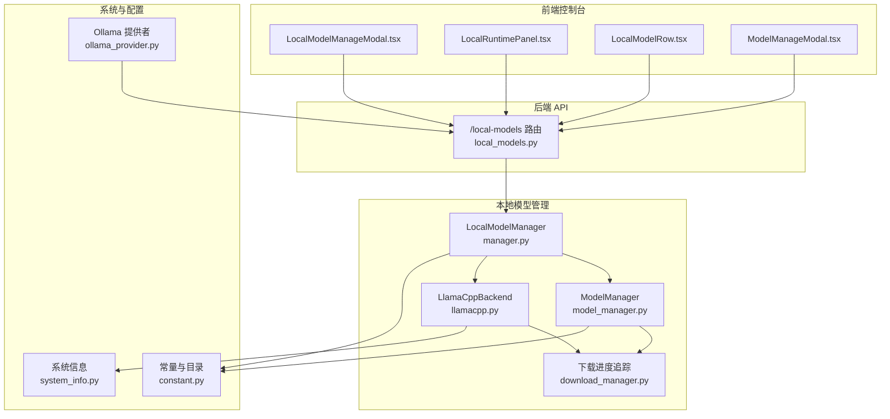
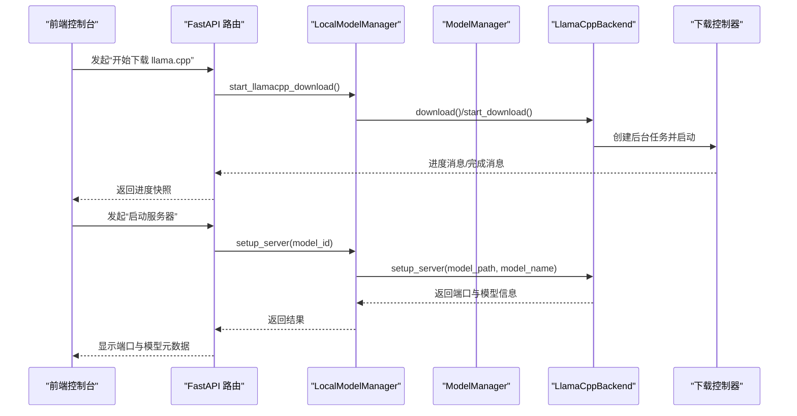
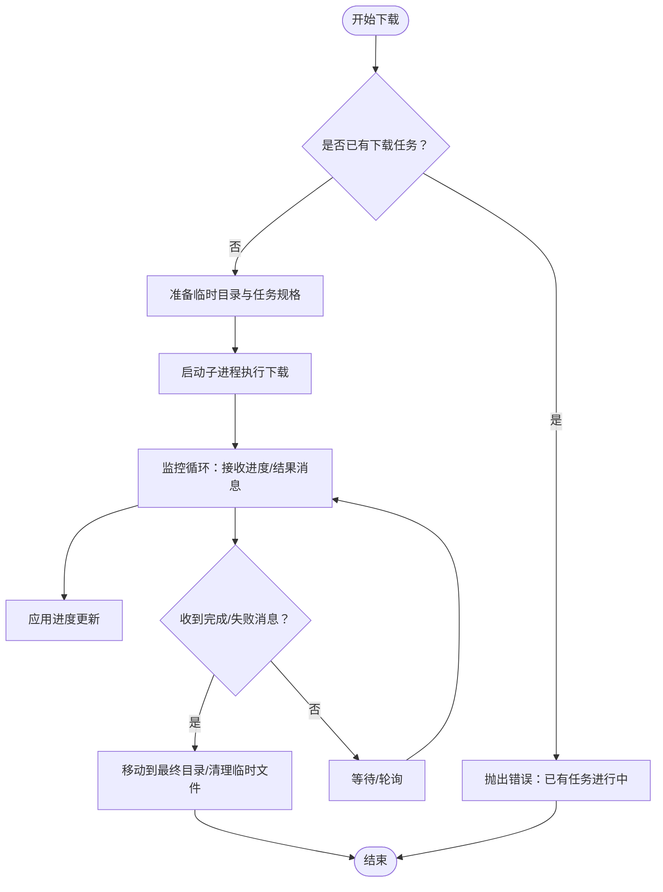
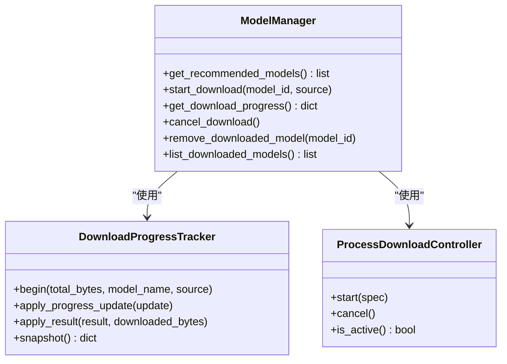
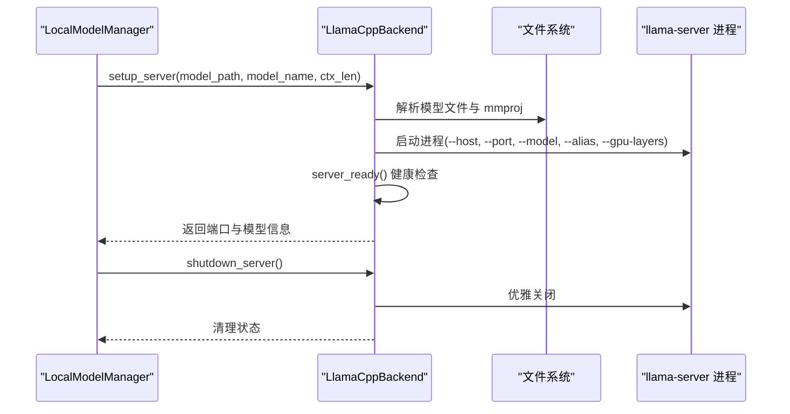
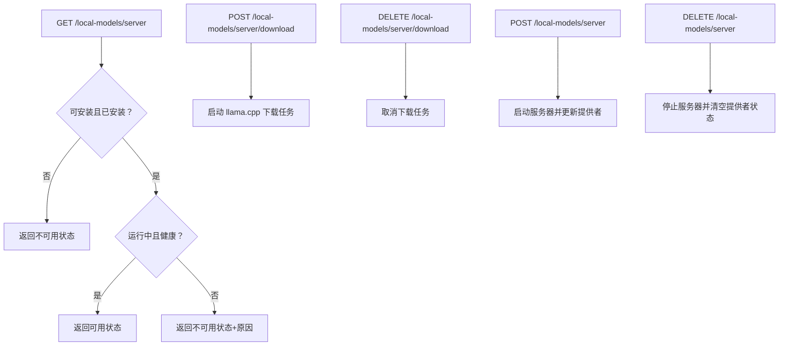
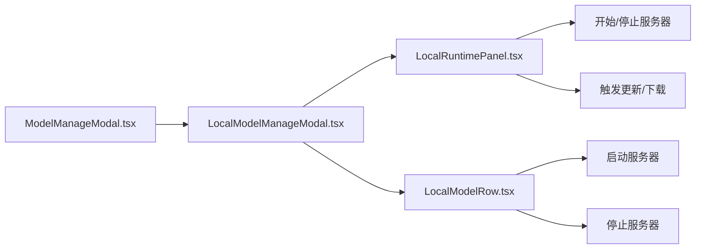
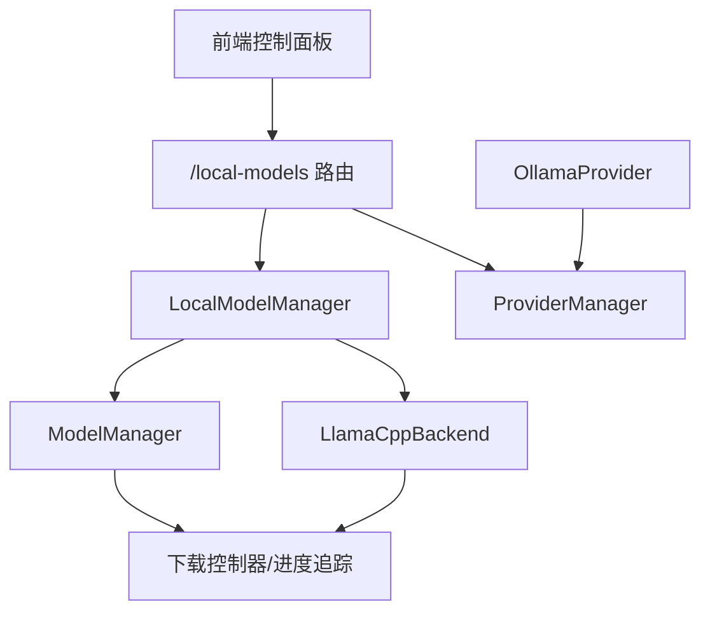

# 本地模型管理

<cite>
**本文引用的文件**
- [src/copaw/local_models/__init__.py](file://src/copaw/local_models/__init__.py)
- [src/copaw/local_models/download_manager.py](file://src/copaw/local_models/download_manager.py)
- [src/copaw/local_models/llamacpp.py](file://src/copaw/local_models/llamacpp.py)
- [src/copaw/local_models/manager.py](file://src/copaw/local_models/manager.py)
- [src/copaw/local_models/model_manager.py](file://src/copaw/local_models/model_manager.py)
- [src/copaw/app/routers/local_models.py](file://src/copaw/app/routers/local_models.py)
- [src/copaw/providers/ollama_provider.py](file://src/copaw/providers/ollama_provider.py)
- [src/copaw/utils/system_info.py](file://src/copaw/utils/system_info.py)
- [src/copaw/constant.py](file://src/copaw/constant.py)
- [console/src/pages/Settings/Models/components/modals/LocalModelManageModal.tsx](file://console/src/pages/Settings/Models/components/modals/LocalModelManageModal.tsx)
- [console/src/pages/Settings/Models/components/modals/local-models/LocalRuntimePanel.tsx](file://console/src/pages/Settings/Models/components/modals/local-models/LocalRuntimePanel.tsx)
- [console/src/pages/Settings/Models/components/modals/local-models/LocalModelRow.tsx](file://console/src/pages/Settings/Models/components/modals/local-models/LocalModelRow.tsx)
- [console/src/pages/Settings/Models/components/modals/ModelManageModal.tsx](file://console/src/pages/Settings/Models/components/modals/ModelManageModal.tsx)
</cite>

## 目录
1. [简介](#简介)
2. [项目结构](#项目结构)
3. [核心组件](#核心组件)
4. [架构总览](#架构总览)
5. [详细组件分析](#详细组件分析)
6. [依赖关系分析](#依赖关系分析)
7. [性能考量](#性能考量)
8. [故障排查指南](#故障排查指南)
9. [结论](#结论)
10. [附录](#附录)

## 简介
本操作手册面向需要在本地部署与管理推理模型的用户与运维人员，覆盖从模型下载、安装、启动到运行期管理的全流程，并解释 llama.cpp 与 Ollama 等本地推理引擎的配置方法。文档同时提供版本管理、更新升级、卸载删除的操作指引，以及内存占用优化、GPU 加速配置、模型量化等高级设置建议；最后给出本地模型与云端模型的切换策略与使用场景选择。

## 项目结构
本地模型管理由后端 API 路由、本地模型管理器、下载控制器、llama.cpp 后端、模型下载器与前端控制面板组成。整体采用分层设计：API 层负责对外暴露管理接口；管理器层协调下载与服务器生命周期；后端层封装具体推理引擎的安装与启动；前端层提供可视化操作界面。

**图表来源**
- [src/copaw/app/routers/local_models.py:1-454](file://src/copaw/app/routers/local_models.py#L1-L454)
- [src/copaw/local_models/manager.py:1-229](file://src/copaw/local_models/manager.py#L1-L229)
- [src/copaw/local_models/model_manager.py:1-638](file://src/copaw/local_models/model_manager.py#L1-L638)
- [src/copaw/local_models/llamacpp.py:1-887](file://src/copaw/local_models/llamacpp.py#L1-L887)
- [src/copaw/local_models/download_manager.py:1-599](file://src/copaw/local_models/download_manager.py#L1-L599)
- [src/copaw/utils/system_info.py:87-135](file://src/copaw/utils/system_info.py#L87-L135)
- [src/copaw/constant.py:91-93](file://src/copaw/constant.py#L91-L93)
- [src/copaw/providers/ollama_provider.py:1-86](file://src/copaw/providers/ollama_provider.py#L1-L86)
- [console/src/pages/Settings/Models/components/modals/LocalModelManageModal.tsx:44-286](file://console/src/pages/Settings/Models/components/modals/LocalModelManageModal.tsx#L44-L286)

**章节来源**
- [src/copaw/app/routers/local_models.py:1-454](file://src/copaw/app/routers/local_models.py#L1-L454)
- [src/copaw/local_models/__init__.py:1-17](file://src/copaw/local_models/__init__.py#L1-L17)

## 核心组件
- LocalModelManager：本地模型管理门面，统一协调 llama.cpp 下载、服务器启停、配置持久化与模型下载进度查询。
- ModelManager：负责本地模型仓库的下载、进度追踪、取消、删除与已下载模型枚举。
- LlamaCppBackend：封装 llama.cpp 二进制下载、解压、安装、进程启动、健康检查、日志采集与停止。
- 下载控制器与进度追踪：基于多进程与队列的消息机制，提供统一的下载生命周期状态与进度上报。
- 前端控制面板：提供“开始/停止服务器”、“下载/取消下载”、“查看更新”、“配置上下文长度”等交互入口。
- OllamaProvider：兼容 OpenAI 接口风格的 Ollama 本地推理提供者，便于与本地/远程模型切换。

**章节来源**
- [src/copaw/local_models/manager.py:1-229](file://src/copaw/local_models/manager.py#L1-L229)
- [src/copaw/local_models/model_manager.py:1-638](file://src/copaw/local_models/model_manager.py#L1-L638)
- [src/copaw/local_models/llamacpp.py:1-887](file://src/copaw/local_models/llamacpp.py#L1-L887)
- [src/copaw/local_models/download_manager.py:1-599](file://src/copaw/local_models/download_manager.py#L1-L599)
- [src/copaw/providers/ollama_provider.py:1-86](file://src/copaw/providers/ollama_provider.py#L1-L86)

## 架构总览
本地模型管理采用“API 路由 → 管理器 → 后端/下载器”的分层架构。API 路由负责请求解析与响应封装；管理器负责业务编排与状态持久化；后端负责具体引擎的安装与运行；下载器负责模型与引擎的后台下载与进度追踪。

**图表来源**
- [src/copaw/app/routers/local_models.py:233-318](file://src/copaw/app/routers/local_models.py#L233-L318)
- [src/copaw/local_models/manager.py:119-210](file://src/copaw/local_models/manager.py#L119-L210)
- [src/copaw/local_models/llamacpp.py:145-307](file://src/copaw/local_models/llamacpp.py#L145-L307)
- [src/copaw/local_models/download_manager.py:368-599](file://src/copaw/local_models/download_manager.py#L368-L599)

## 详细组件分析

### 组件一：下载与进度追踪
- 进度状态机：包含 idle/pending/downloading/canceling/completed/failed/cancelled 状态，支持并发安全的状态变更与快照。
- 多进程下载：通过子进程执行下载任务，使用队列进行进度与结果消息传递，支持取消与清理。
- 统一结果与进度消息：提供序列化/反序列化能力，便于跨进程边界传输。

**图表来源**
- [src/copaw/local_models/download_manager.py:198-599](file://src/copaw/local_models/download_manager.py#L198-L599)

**章节来源**
- [src/copaw/local_models/download_manager.py:1-599](file://src/copaw/local_models/download_manager.py#L1-L599)

### 组件二：模型下载器（ModelManager）
- 支持的源：HuggingFace、ModelScope 或自动选择（优先 HuggingFace）。
- 模型校验：确保仓库包含至少一个 .gguf 文件，否则拒绝下载。
- 推荐模型：根据系统内存（优先显存）推荐不同规模的本地模型。
- 下载进度：估算总大小、实时计算已下载字节数、进度消息上报。
- 删除与清理：删除模型目录并清理空父目录。

**图表来源**
- [src/copaw/local_models/model_manager.py:61-638](file://src/copaw/local_models/model_manager.py#L61-L638)
- [src/copaw/local_models/download_manager.py:198-599](file://src/copaw/local_models/download_manager.py#L198-L599)

**章节来源**
- [src/copaw/local_models/model_manager.py:1-638](file://src/copaw/local_models/model_manager.py#L1-L638)

### 组件三：llama.cpp 后端（LlamaCppBackend）
- 安装检测：判断可安装性与已安装状态，支持 macOS 版本检查。
- 下载与解压：从指定镜像地址下载压缩包，解压到目标目录，完成后重命名/移动。
- 服务器启动：解析模型路径（支持单文件或仓库内首个 .gguf），自动选择 GPU 层数，启动进程并等待健康检查。
- 设备列表与版本：支持列出可用设备与查询版本。
- 日志与停止：异步读取子进程日志，优雅关闭并清理资源。

**图表来源**
- [src/copaw/local_models/llamacpp.py:216-307](file://src/copaw/local_models/llamacpp.py#L216-L307)
- [src/copaw/local_models/llamacpp.py:398-421](file://src/copaw/local_models/llamacpp.py#L398-L421)

**章节来源**
- [src/copaw/local_models/llamacpp.py:1-887](file://src/copaw/local_models/llamacpp.py#L1-L887)

### 组件四：API 路由（/local-models）
- 服务器状态：检查可安装性、已安装性、运行状态与健康检查。
- 更新检查：查询当前 llama.cpp 是否有新版本。
- 下载控制：开始/取消下载 llama.cpp。
- 服务器控制：启动/停止本地服务器，并同步更新提供者配置。
- 模型管理：列举推荐与已下载模型、开始/取消下载模型、读取进度。
- 配置管理：设置最大上下文长度、生成参数等。

**图表来源**
- [src/copaw/app/routers/local_models.py:145-337](file://src/copaw/app/routers/local_models.py#L145-L337)

**章节来源**
- [src/copaw/app/routers/local_models.py:1-454](file://src/copaw/app/routers/local_models.py#L1-L454)

### 组件五：前端控制面板
- 本地运行时面板：展示安装状态、运行状态、下载进度、更新提示与操作按钮。
- 模型行组件：提供“启动/停止服务器”按钮，支持模型切换确认。
- 管理弹窗：统一入口，根据提供者类型路由到本地或远程管理弹窗。

**图表来源**
- [console/src/pages/Settings/Models/components/modals/local-models/LocalRuntimePanel.tsx:41-117](file://console/src/pages/Settings/Models/components/modals/local-models/LocalRuntimePanel.tsx#L41-L117)
- [console/src/pages/Settings/Models/components/modals/local-models/LocalModelRow.tsx:78-96](file://console/src/pages/Settings/Models/components/modals/local-models/LocalModelRow.tsx#L78-L96)
- [console/src/pages/Settings/Models/components/modals/LocalModelManageModal.tsx:648-737](file://console/src/pages/Settings/Models/components/modals/LocalModelManageModal.tsx#L648-L737)
- [console/src/pages/Settings/Models/components/modals/ModelManageModal.tsx:12-38](file://console/src/pages/Settings/Models/components/modals/ModelManageModal.tsx#L12-L38)

**章节来源**
- [console/src/pages/Settings/Models/components/modals/local-models/LocalRuntimePanel.tsx:41-117](file://console/src/pages/Settings/Models/components/modals/local-models/LocalRuntimePanel.tsx#L41-L117)
- [console/src/pages/Settings/Models/components/modals/local-models/LocalModelRow.tsx:78-96](file://console/src/pages/Settings/Models/components/modals/local-models/LocalModelRow.tsx#L78-L96)
- [console/src/pages/Settings/Models/components/modals/LocalModelManageModal.tsx:648-737](file://console/src/pages/Settings/Models/components/modals/LocalModelManageModal.tsx#L648-L737)
- [console/src/pages/Settings/Models/components/modals/ModelManageModal.tsx:12-38](file://console/src/pages/Settings/Models/components/modals/ModelManageModal.tsx#L12-L38)

## 依赖关系分析
- LocalModelManager 依赖 ModelManager 与 LlamaCppBackend，负责高层编排与配置持久化。
- ModelManager 依赖下载控制器与进度追踪器，负责模型仓库的下载与状态管理。
- LlamaCppBackend 依赖下载控制器与命令执行工具，负责引擎二进制的下载与服务器进程管理。
- API 路由依赖 LocalModelManager 与 ProviderManager，负责对外暴露管理接口。
- 前端控制面板依赖 API 路由与本地配置，负责用户交互与状态展示。
- OllamaProvider 与本地提供者协同工作，实现本地/远程模型的无缝切换。

**图表来源**
- [src/copaw/local_models/manager.py:33-229](file://src/copaw/local_models/manager.py#L33-L229)
- [src/copaw/local_models/model_manager.py:61-638](file://src/copaw/local_models/model_manager.py#L61-L638)
- [src/copaw/local_models/llamacpp.py:51-77](file://src/copaw/local_models/llamacpp.py#L51-L77)
- [src/copaw/app/routers/local_models.py:1-454](file://src/copaw/app/routers/local_models.py#L1-L454)
- [src/copaw/providers/ollama_provider.py:1-86](file://src/copaw/providers/ollama_provider.py#L1-L86)

**章节来源**
- [src/copaw/local_models/manager.py:1-229](file://src/copaw/local_models/manager.py#L1-L229)
- [src/copaw/local_models/model_manager.py:1-638](file://src/copaw/local_models/model_manager.py#L1-L638)
- [src/copaw/local_models/llamacpp.py:1-887](file://src/copaw/local_models/llamacpp.py#L1-L887)
- [src/copaw/app/routers/local_models.py:1-454](file://src/copaw/app/routers/local_models.py#L1-L454)
- [src/copaw/providers/ollama_provider.py:1-86](file://src/copaw/providers/ollama_provider.py#L1-L86)

## 性能考量
- 上下文长度：可通过配置调整最大上下文长度，影响内存占用与生成性能。
- GPU 加速：llama.cpp 启动时默认使用 GPU 层数为 auto，可在具备 CUDA/Metal 的设备上获得更好吞吐。
- 内存占用：根据系统内存与显存大小，推荐相应规模的模型；下载器会优先选择适合当前硬件的模型。
- 并发与超时：下载与服务器健康检查均设置了合理的超时与轮询间隔，避免阻塞主线程。

**章节来源**
- [src/copaw/local_models/manager.py:23-31](file://src/copaw/local_models/manager.py#L23-L31)
- [src/copaw/local_models/llamacpp.py:368-379](file://src/copaw/local_models/llamacpp.py#L368-L379)
- [src/copaw/local_models/model_manager.py:76-133](file://src/copaw/local_models/model_manager.py#L76-L133)
- [src/copaw/utils/system_info.py:111-121](file://src/copaw/utils/system_info.py#L111-L121)

## 故障排查指南
- 下载失败：检查网络连通性与镜像地址可达性；查看进度消息中的错误描述；必要时取消并重试。
- 服务器无法启动：确认已安装引擎且模型文件为 .gguf；检查端口占用与权限；查看健康检查超时与日志输出。
- 模型不被支持：确保仓库包含至少一个 .gguf 文件；若使用 HuggingFace，需保证仓库公开可访问。
- 更新检查异常：若版本号解析失败，将回退为“有更新”，可手动下载最新版本。
- Ollama 切换：通过提供者配置将本地提供者指向 Ollama 的 /v1 接口，实现与本地 llama.cpp 的无缝切换。

**章节来源**
- [src/copaw/local_models/download_manager.py:510-537](file://src/copaw/local_models/download_manager.py#L510-L537)
- [src/copaw/local_models/llamacpp.py:656-691](file://src/copaw/local_models/llamacpp.py#L656-L691)
- [src/copaw/local_models/model_manager.py:458-501](file://src/copaw/local_models/model_manager.py#L458-L501)
- [src/copaw/providers/ollama_provider.py:16-86](file://src/copaw/providers/ollama_provider.py#L16-L86)

## 结论
本手册提供了从下载、安装、启动到管理的完整本地模型操作指南，并结合 llama.cpp 与 Ollama 的配置说明，帮助用户在不同硬件环境下实现高性能、低延迟的本地推理。通过前端控制面板与后端 API 的配合，用户可以直观地完成版本管理、更新升级与卸载删除等操作，同时借助高级设置优化内存占用与 GPU 加速效果。

## 附录

### 模型文件格式与大小
- 文件格式：本地模型以 GGUF 格式存储，下载器会校验仓库内是否存在 .gguf 文件。
- 推荐规模：根据系统内存/显存大小，系统会推荐合适的模型规模（如 CoPaw-Flash-2B/4B/9B）。

**章节来源**
- [src/copaw/local_models/model_manager.py:44-58](file://src/copaw/local_models/model_manager.py#L44-L58)
- [src/copaw/local_models/model_manager.py:76-133](file://src/copaw/local_models/model_manager.py#L76-L133)

### 硬件要求与性能表现
- 系统信息：系统会检测操作系统、架构、CUDA 版本、内存与显存大小，用于推荐模型与安装检查。
- 性能表现：GPU 加速与上下文长度直接影响吞吐与延迟；建议在满足需求的前提下适度调优。

**章节来源**
- [src/copaw/utils/system_info.py:111-121](file://src/copaw/utils/system_info.py#L111-L121)
- [src/copaw/local_models/llamacpp.py:368-379](file://src/copaw/local_models/llamacpp.py#L368-L379)

### 本地与云端模型切换策略
- 本地提供者：通过 /local-models 路由启动本地 llama.cpp 服务器，并将提供者 base_url 指向本地端口。
- Ollama 提供者：通过 OllamaProvider 将本地 Ollama 服务映射为 OpenAI 兼容接口，便于统一管理。
- 使用场景：隐私敏感、离线可用、低延迟场景优先本地；需要多模型托管与弹性扩展时可考虑云端。

**章节来源**
- [src/copaw/app/routers/local_models.py:283-318](file://src/copaw/app/routers/local_models.py#L283-L318)
- [src/copaw/providers/ollama_provider.py:16-86](file://src/copaw/providers/ollama_provider.py#L16-L86)