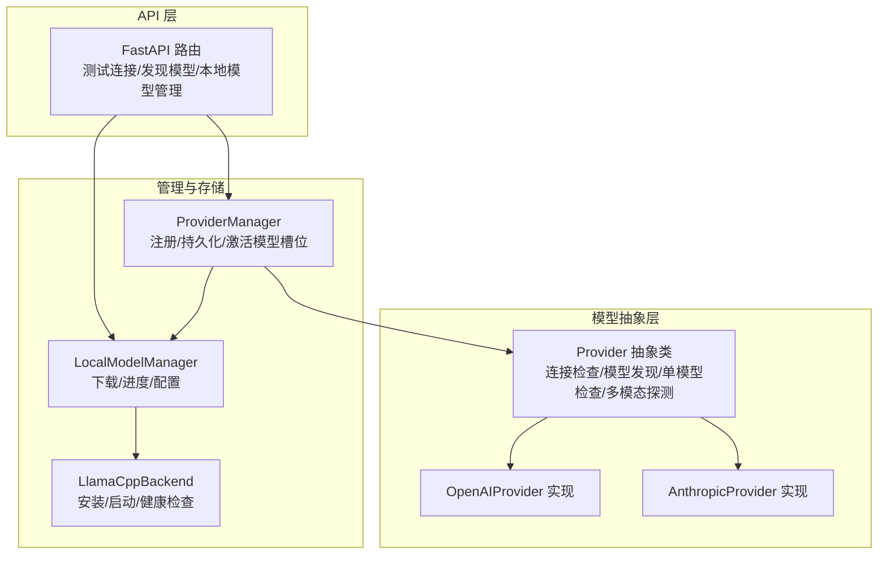
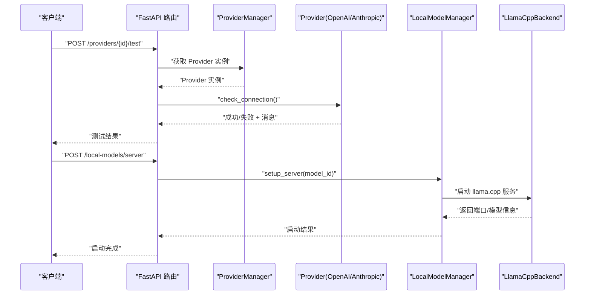
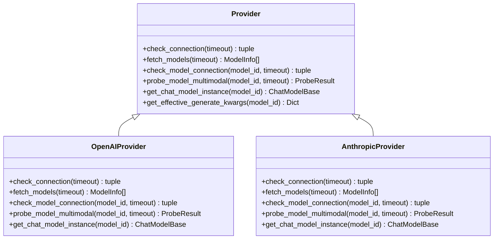
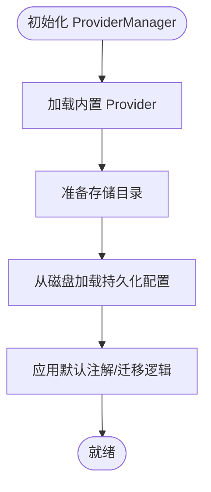
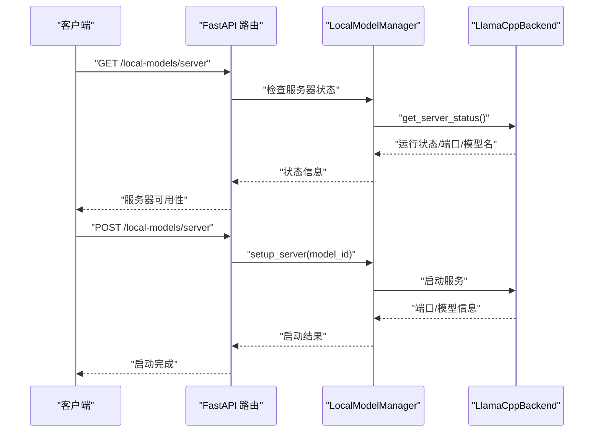
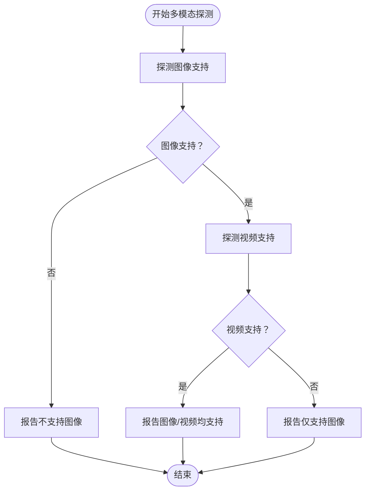
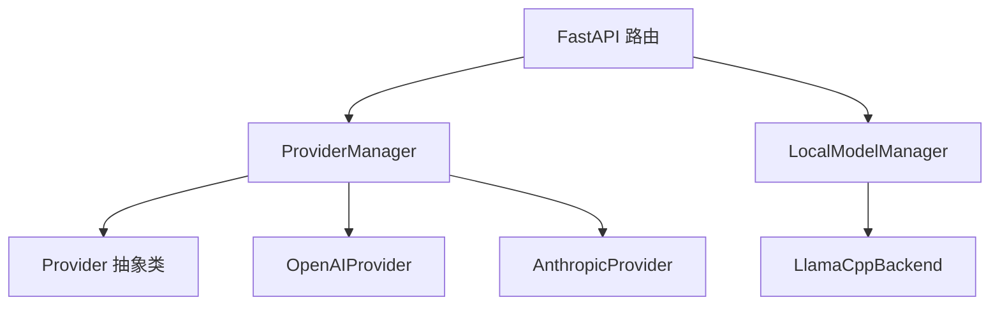

# 模型测试与验证

<cite>
**本文档引用的文件**
- [provider.py](file://src/copaw/providers/provider.py)
- [provider_manager.py](file://src/copaw/providers/provider_manager.py)
- [openai_provider.py](file://src/copaw/providers/openai_provider.py)
- [anthropic_provider.py](file://src/copaw/providers/anthropic_provider.py)
- [local_models.py](file://src/copaw/app/routers/local_models.py)
- [llamacpp.py](file://src/copaw/local_models/llamacpp.py)
- [model_manager.py](file://src/copaw/local_models/model_manager.py)
- [test_provider_manager.py](file://tests/unit/providers/test_provider_manager.py)
- [test_model_manager.py](file://tests/unit/local_models/test_model_manager.py)
- [API-Reference.md](file://docs/wiki/API-Reference.md)
- [run_tests.py](file://scripts/run_tests.py)
- [capability_baseline.py](file://src/copaw/providers/capability_baseline.py)
</cite>

## 目录
1. [简介](#简介)
2. [项目结构](#项目结构)
3. [核心组件](#核心组件)
4. [架构总览](#架构总览)
5. [详细组件分析](#详细组件分析)
6. [依赖关系分析](#依赖关系分析)
7. [性能考虑](#性能考虑)
8. [故障排除指南](#故障排除指南)
9. [结论](#结论)
10. [附录](#附录)

## 简介
本指南面向新增或变更模型连接后的测试与验证工作，涵盖以下目标：
- 验证新模型连接是否正常工作（简单问答、复杂推理、多轮对话）
- 设计并执行测试用例，覆盖连接性、可用性、多模态能力探测
- 解读测试结果（响应时间、成功率、错误信息）
- 建立性能基准测试方法与工具
- 提供常见连接问题的诊断与解决步骤（网络、密钥、模型不可用等）
- 支持 A/B 测试与性能对比流程

## 项目结构
围绕模型连接测试与验证的关键模块包括：
- Provider 抽象层：定义统一的连接检查、模型发现、单模型可用性检查、多模态探测接口
- 具体 Provider 实现：OpenAI、Anthropic 等兼容 API 的实现
- Provider 管理器：注册、持久化、激活模型槽位
- 本地模型管理：下载、安装、启动 llama.cpp 服务，暴露本地模型
- API 层：提供测试连接、发现模型、本地模型管理等 HTTP 接口
- 测试脚本与用例：单元测试与集成测试，覆盖 Provider 行为与本地模型生命周期

图表来源
- [provider.py:111-314](file://src/copaw/providers/provider.py#L111-L314)
- [openai_provider.py:25-164](file://src/copaw/providers/openai_provider.py#L25-L164)
- [anthropic_provider.py:27-164](file://src/copaw/providers/anthropic_provider.py#L27-L164)
- [provider_manager.py:670-800](file://src/copaw/providers/provider_manager.py#L670-L800)
- [local_models.py:23-454](file://src/copaw/app/routers/local_models.py#L23-L454)
- [llamacpp.py:51-307](file://src/copaw/local_models/llamacpp.py#L51-L307)

章节来源
- [provider.py:111-314](file://src/copaw/providers/provider.py#L111-L314)
- [provider_manager.py:670-800](file://src/copaw/providers/provider_manager.py#L670-L800)
- [local_models.py:23-454](file://src/copaw/app/routers/local_models.py#L23-L454)

## 核心组件
- Provider 抽象类：定义统一接口，包括连接检查、模型发现、单模型可用性检查、多模态探测、生成参数合并等
- OpenAIProvider：实现 OpenAI 兼容 API 的连接检查、模型发现、单模型可用性检查、多模态探测（图像/视频）
- AnthropicProvider：实现 Anthropic API 的连接检查、模型发现、单模型可用性检查、多模态探测（图像）
- ProviderManager：内置 Provider 注册、自定义 Provider 管理、持久化、激活模型槽位
- LocalModelManager/LlamaCppBackend：本地模型下载、安装、启动、健康检查、版本与更新检测
- FastAPI 路由：对外提供测试连接、发现模型、本地模型下载/启动/停止等接口

章节来源
- [provider.py:17-314](file://src/copaw/providers/provider.py#L17-L314)
- [openai_provider.py:25-550](file://src/copaw/providers/openai_provider.py#L25-L550)
- [anthropic_provider.py:27-256](file://src/copaw/providers/anthropic_provider.py#L27-L256)
- [provider_manager.py:670-800](file://src/copaw/providers/provider_manager.py#L670-L800)
- [local_models.py:23-454](file://src/copaw/app/routers/local_models.py#L23-L454)
- [llamacpp.py:51-800](file://src/copaw/local_models/llamacpp.py#L51-L800)

## 架构总览
下图展示从 API 请求到 Provider/本地模型处理的完整链路，以及测试与验证的关键节点。

图表来源
- [local_models.py:283-318](file://src/copaw/app/routers/local_models.py#L283-L318)
- [provider_manager.py:670-800](file://src/copaw/providers/provider_manager.py#L670-L800)
- [openai_provider.py:57-72](file://src/copaw/providers/openai_provider.py#L57-L72)
- [llamacpp.py:216-307](file://src/copaw/local_models/llamacpp.py#L216-L307)

## 详细组件分析

### Provider 抽象与具体实现
- Provider 抽象类定义了统一接口：check_connection、fetch_models、check_model_connection、probe_model_multimodal、get_chat_model_instance 等
- OpenAIProvider 实现了基于 OpenAI 兼容 API 的连接检查、模型发现、单模型可用性检查，并实现了图像/视频多模态探测
- AnthropicProvider 实现了基于 Anthropic API 的连接检查、模型发现、单模型可用性检查，并实现了图像多模态探测

图表来源
- [provider.py:111-314](file://src/copaw/providers/provider.py#L111-L314)
- [openai_provider.py:25-164](file://src/copaw/providers/openai_provider.py#L25-L164)
- [anthropic_provider.py:27-164](file://src/copaw/providers/anthropic_provider.py#L27-L164)

章节来源
- [provider.py:111-314](file://src/copaw/providers/provider.py#L111-L314)
- [openai_provider.py:57-125](file://src/copaw/providers/openai_provider.py#L57-L125)
- [anthropic_provider.py:66-126](file://src/copaw/providers/anthropic_provider.py#L66-L126)

### ProviderManager：注册、持久化与激活
- 内置 Provider 注册：集中初始化多个内置 Provider（OpenAI、Anthropic、Gemini、Ollama 等）
- 自定义 Provider 管理：支持添加、更新、删除自定义 Provider，并持久化到磁盘
- 激活模型槽位：保存当前活跃的 Provider 与模型配置，重启后可恢复

图表来源
- [provider_manager.py:670-732](file://src/copaw/providers/provider_manager.py#L670-L732)

章节来源
- [provider_manager.py:670-732](file://src/copaw/providers/provider_manager.py#L670-L732)

### 本地模型管理：下载、安装与启动
- LocalModelManager：负责推荐模型、下载进度跟踪、下载取消、配置更新
- LlamaCppBackend：负责 llama.cpp 二进制下载、安装、启动、健康检查、版本查询、设备枚举
- API 路由：提供本地模型服务器状态检查、下载、启动、停止等接口

图表来源
- [local_models.py:145-210](file://src/copaw/app/routers/local_models.py#L145-L210)
- [local_models.py:283-318](file://src/copaw/app/routers/local_models.py#L283-L318)
- [llamacpp.py:114-123](file://src/copaw/local_models/llamacpp.py#L114-L123)
- [llamacpp.py:216-307](file://src/copaw/local_models/llamacpp.py#L216-L307)

章节来源
- [local_models.py:145-318](file://src/copaw/app/routers/local_models.py#L145-L318)
- [llamacpp.py:89-123](file://src/copaw/local_models/llamacpp.py#L89-L123)
- [llamacpp.py:216-307](file://src/copaw/local_models/llamacpp.py#L216-L307)

### 多模态探测与能力基线
- OpenAIProvider/AnthropicProvider 实现了多模态探测：图像探测通过发送特定图片并要求识别主色调；视频探测通过发送特定视频并要求识别颜色
- capability_baseline 提供期望能力基线与差异日志，用于比较实际探测结果与官方文档标注的差异

图表来源
- [openai_provider.py:165-197](file://src/copaw/providers/openai_provider.py#L165-L197)
- [openai_provider.py:199-350](file://src/copaw/providers/openai_provider.py#L199-L350)
- [openai_provider.py:352-549](file://src/copaw/providers/openai_provider.py#L352-L549)
- [anthropic_provider.py:166-186](file://src/copaw/providers/anthropic_provider.py#L166-L186)
- [anthropic_provider.py:188-255](file://src/copaw/providers/anthropic_provider.py#L188-L255)
- [capability_baseline.py:604-678](file://src/copaw/providers/capability_baseline.py#L604-L678)

章节来源
- [openai_provider.py:165-549](file://src/copaw/providers/openai_provider.py#L165-L549)
- [anthropic_provider.py:166-255](file://src/copaw/providers/anthropic_provider.py#L166-L255)
- [capability_baseline.py:604-678](file://src/copaw/providers/capability_baseline.py#L604-L678)

## 依赖关系分析
- ProviderManager 依赖 Provider 抽象类及具体 Provider 实现（OpenAI、Anthropic、Gemini、Ollama 等）
- LocalModelManager 依赖 LlamaCppBackend 进行本地模型服务管理
- FastAPI 路由同时依赖 ProviderManager 和 LocalModelManager
- 测试用例覆盖 ProviderManager、LocalModelManager 的行为

图表来源
- [provider_manager.py:670-732](file://src/copaw/providers/provider_manager.py#L670-L732)
- [local_models.py:23-454](file://src/copaw/app/routers/local_models.py#L23-L454)
- [llamacpp.py:51-800](file://src/copaw/local_models/llamacpp.py#L51-L800)

章节来源
- [provider_manager.py:670-732](file://src/copaw/providers/provider_manager.py#L670-L732)
- [local_models.py:23-454](file://src/copaw/app/routers/local_models.py#L23-L454)

## 性能考虑
- 连接超时与重试：Provider 的连接检查与模型可用性检查均支持超时参数，默认 5 秒；OpenAIProvider 的模型探测默认 10 秒，视频探测默认 30 秒
- 生成参数合并：Provider 支持在 Provider 级别与模型级别分别设置生成参数，最终以深合并的方式生效
- 本地模型性能：llama.cpp 服务启动后通过健康检查确认可用；可通过设备枚举与上下文长度配置优化性能

章节来源
- [provider.py:230-244](file://src/copaw/providers/provider.py#L230-L244)
- [openai_provider.py:57-125](file://src/copaw/providers/openai_provider.py#L57-L125)
- [llamacpp.py:656-691](file://src/copaw/local_models/llamacpp.py#L656-L691)

## 故障排除指南
- 网络问题
  - 检查 Provider 的连接检查接口返回的错误消息
  - 对于本地模型，检查服务器状态与健康检查接口
- API 密钥错误
  - 确认 api_key 前缀与格式是否正确
  - 在测试连接时临时覆盖 api_key 进行验证
- 模型不可用
  - 使用单模型可用性检查接口验证指定模型
  - 对于多模态模型，使用多模态探测接口验证图像/视频支持
- 本地模型问题
  - 检查 llama.cpp 是否可安装与安装状态
  - 查看下载进度与错误信息
  - 启动后进行健康检查，确认端口与模型信息

章节来源
- [openai_provider.py:57-125](file://src/copaw/providers/openai_provider.py#L57-L125)
- [anthropic_provider.py:66-126](file://src/copaw/providers/anthropic_provider.py#L66-L126)
- [local_models.py:145-210](file://src/copaw/app/routers/local_models.py#L145-L210)
- [llamacpp.py:89-123](file://src/copaw/local_models/llamacpp.py#L89-L123)

## 结论
通过 Provider 抽象层与具体实现，结合 ProviderManager 的注册与持久化机制，以及本地模型管理的下载与启动能力，可以系统地对新增模型连接进行全面测试与验证。配合 API 层提供的测试接口与测试脚本，能够快速定位问题并形成性能与稳定性评估报告。

## 附录

### 测试用例设计与执行方法
- 简单问答
  - 使用 Provider 的单模型可用性检查接口验证模型连通性
  - 通过 API 的聊天接口发送简单消息，验证响应流式输出
- 复杂推理
  - 使用多模态探测接口验证图像/视频支持
  - 通过 capability_baseline 对比官方文档标注与实际探测结果
- 多轮对话
  - 通过 API 的会话接口维持对话历史，验证上下文传递与响应一致性

章节来源
- [openai_provider.py:85-125](file://src/copaw/providers/openai_provider.py#L85-L125)
- [anthropic_provider.py:87-126](file://src/copaw/providers/anthropic_provider.py#L87-L126)
- [API-Reference.md:117-161](file://docs/wiki/API-Reference.md#L117-L161)
- [capability_baseline.py:604-678](file://src/copaw/providers/capability_baseline.py#L604-L678)

### 测试结果解读
- 成功率：连接检查与模型可用性检查的成功/失败标记
- 响应时间：各阶段耗时（连接、模型探测、健康检查）
- 错误信息：具体的错误消息与建议修复方案

章节来源
- [openai_provider.py:57-125](file://src/copaw/providers/openai_provider.py#L57-L125)
- [anthropic_provider.py:66-126](file://src/copaw/providers/anthropic_provider.py#L66-L126)
- [local_models.py:145-210](file://src/copaw/app/routers/local_models.py#L145-L210)

### 性能基准测试方法与工具
- 基准测试流程
  - 准备测试数据集（简单问答、复杂推理、多轮对话）
  - 在相同硬件与网络条件下重复执行多次
  - 统计平均响应时间、吞吐量、错误率
- 工具与脚本
  - 使用项目内置的测试脚本运行单元测试与集成测试
  - 通过 API 接口进行自动化压力测试与回归测试

章节来源
- [run_tests.py:76-173](file://scripts/run_tests.py#L76-L173)
- [test_provider_manager.py:132-269](file://tests/unit/providers/test_provider_manager.py#L132-L269)
- [test_model_manager.py:48-369](file://tests/unit/local_models/test_model_manager.py#L48-L369)

### A/B 测试与性能对比
- A/B 测试流程
  - 将用户或会话随机分配到不同 Provider 或模型版本
  - 对比关键指标（响应时间、成功率、错误率、用户满意度）
- 性能对比
  - 使用 capability_baseline 生成差异报告，识别实际能力与预期的偏差
  - 对比不同 Provider/模型在相同场景下的表现

章节来源
- [capability_baseline.py:643-678](file://src/copaw/providers/capability_baseline.py#L643-L678)
- [provider_manager.py:670-732](file://src/copaw/providers/provider_manager.py#L670-L732)