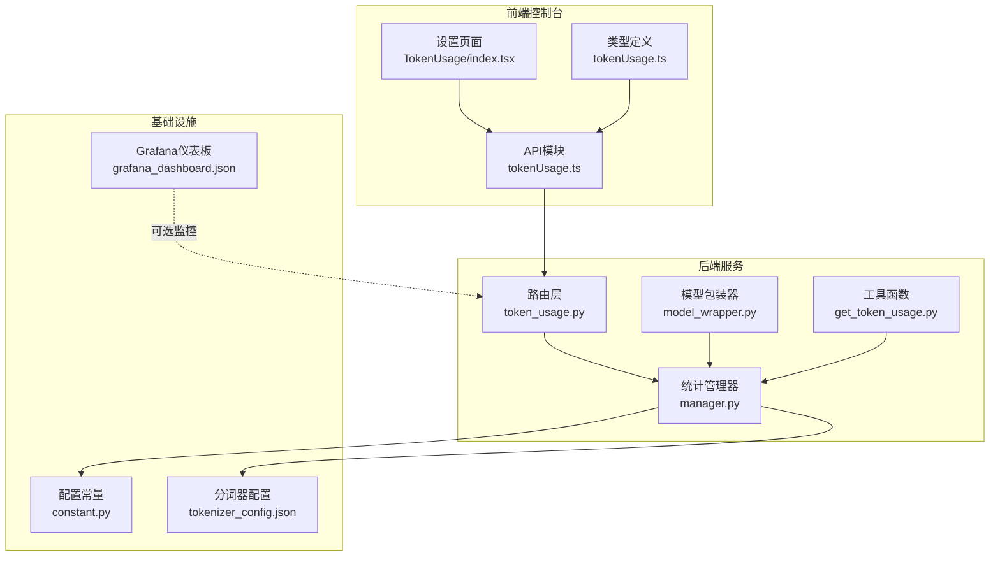
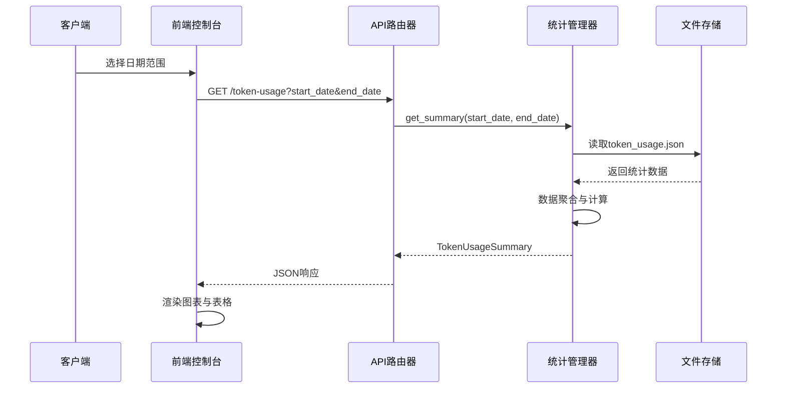
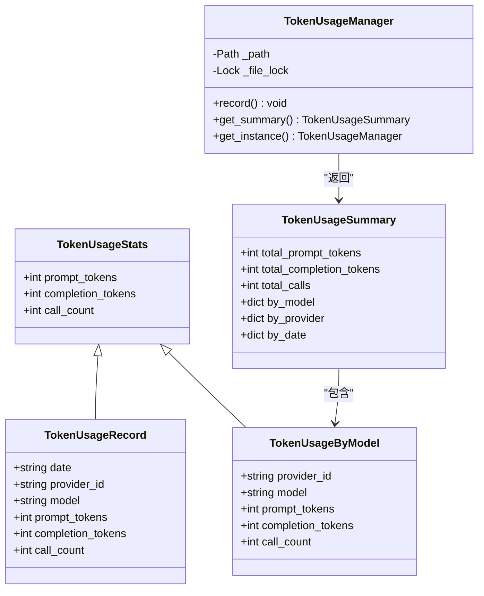
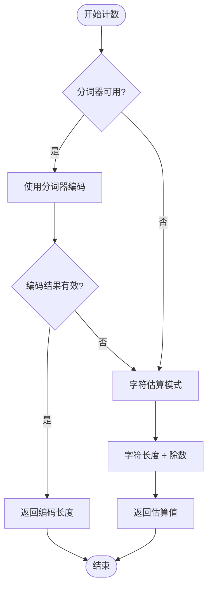
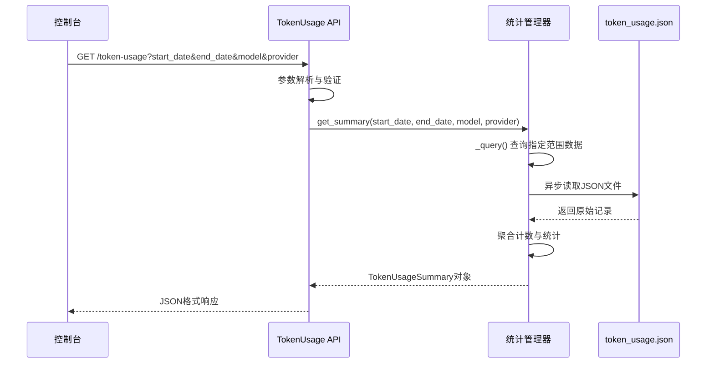
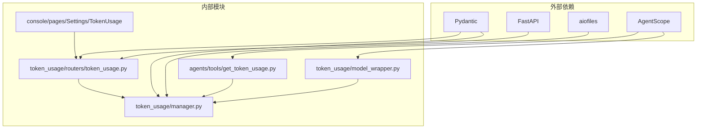
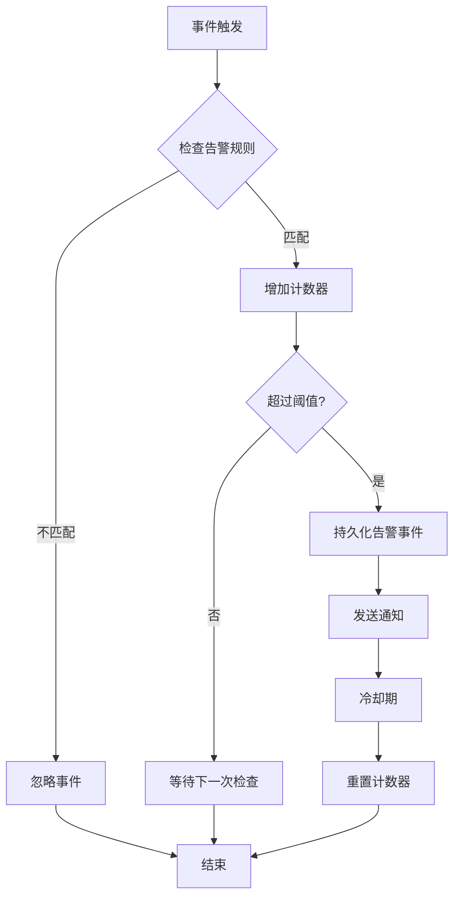

# 模型监控与统计

<cite>
**本文档引用的文件**
- [token_usage/manager.py](file://src/copaw/token_usage/manager.py)
- [token_usage/model_wrapper.py](file://src/copaw/token_usage/model_wrapper.py)
- [token_usage/routers/token_usage.py](file://src/copaw/app/routers/token_usage.py)
- [token_usage/tools/get_token_usage.py](file://src/copaw/agents/tools/get_token_usage.py)
- [token_usage/console/pages/Settings/TokenUsage/index.tsx](file://console/src/pages/Settings/TokenUsage/index.tsx)
- [token_usage/console/api/modules/tokenUsage.ts](file://console/src/api/modules/tokenUsage.ts)
- [token_usage/console/api/types/tokenUsage.ts](file://console/src/api/types/tokenUsage.ts)
- [token_usage/constant.py](file://src/copaw/constant.py)
- [token_usage/agents/utils/copaw_token_counter.py](file://src/copaw/agents/utils/copaw_token_counter.py)
- [token_usage/deploy/monitoring/grafana_dashboard.json](file://deploy/monitoring/grafana_dashboard.json)
- [token_usage/enterprise/alert_service.py](file://src/copaw/enterprise/alert_service.py)
- [token_usage/console/src/pages/Enterprise/Security/AlertRules.tsx](file://console/src/pages/Enterprise/Security/AlertRules.tsx)
- [token_usage/console/src/api/modules/enterprise-alerts.ts](file://console/src/api/modules/enterprise-alerts.ts)
</cite>

## 目录
1. [简介](#简介)
2. [项目结构](#项目结构)
3. [核心组件](#核心组件)
4. [架构概览](#架构概览)
5. [详细组件分析](#详细组件分析)
6. [依赖关系分析](#依赖关系分析)
7. [性能考虑](#性能考虑)
8. [故障排除指南](#故障排除指南)
9. [结论](#结论)
10. [附录](#附录)

## 简介
本指南详细介绍CoPaw模型使用监控与统计系统，涵盖以下关键能力：
- 实时查看和分析模型使用情况：请求次数、令牌消耗、费用统计等关键指标
- Token计数器工作原理与准确性说明
- 费用管理与预算控制：按月统计、按模型分类、按用户统计等多维分析
- 使用量预警与异常检测配置
- 历史数据查询、趋势分析、报表导出操作指导
- 模型使用成本与性能优化建议

该系统通过后端API聚合统计、前端控制台展示、以及可选的Grafana监控面板实现完整的监控闭环。

## 项目结构
监控与统计功能主要分布在以下模块：
- 后端统计管理：token_usage子系统负责数据采集、存储与聚合
- 前端控制台：提供可视化界面与交互式查询
- 预警与异常检测：企业级安全模块集成告警规则
- 监控仪表板：Grafana集成实现可视化监控

**图表来源**
- [token_usage/routers/token_usage.py:1-62](file://src/copaw/app/routers/token_usage.py#L1-L62)
- [token_usage/manager.py:62-309](file://src/copaw/token_usage/manager.py#L62-L309)
- [token_usage/model_wrapper.py:15-71](file://src/copaw/token_usage/model_wrapper.py#L15-L71)

**章节来源**
- [token_usage/routers/token_usage.py:1-62](file://src/copaw/app/routers/token_usage.py#L1-L62)
- [token_usage/manager.py:62-309](file://src/copaw/token_usage/manager.py#L62-L309)

## 核心组件
系统由四个核心组件构成，协同完成从数据采集到展示的完整流程：

### 统计管理器（TokenUsageManager）
- 单例模式设计，确保全局唯一实例
- 提供异步文件读写，支持并发安全
- 实现按日期、模型、提供商的多维聚合统计
- 支持30天默认时间范围查询

### 模型包装器（TokenRecordingModelWrapper）
- 包装ChatModelBase实现自动令牌记录
- 支持同步和流式响应两种调用模式
- 自动提取usage信息并调用统计管理器
- 透明地集成到现有模型调用流程中

### API路由器（TokenUsage Router）
- FastAPI路由提供REST接口
- 支持日期范围过滤、模型过滤、提供商过滤
- 返回标准化的统计摘要数据结构
- 内置参数验证与错误处理

### 前端控制台（TokenUsage页面）
- React组件实现交互式查询界面
- 支持日期范围选择与实时刷新
- 提供按模型和按日期的表格展示
- 集成加载状态与错误处理

**章节来源**
- [token_usage/manager.py:62-309](file://src/copaw/token_usage/manager.py#L62-L309)
- [token_usage/model_wrapper.py:15-71](file://src/copaw/token_usage/model_wrapper.py#L15-L71)
- [token_usage/routers/token_usage.py:23-62](file://src/copaw/app/routers/token_usage.py#L23-L62)
- [token_usage/console/pages/Settings/TokenUsage/index.tsx:21-224](file://console/src/pages/Settings/TokenUsage/index.tsx#L21-L224)

## 架构概览
系统采用分层架构设计，确保高内聚低耦合：

**图表来源**
- [token_usage/routers/token_usage.py:28-61](file://src/copaw/app/routers/token_usage.py#L28-L61)
- [token_usage/manager.py:198-294](file://src/copaw/token_usage/manager.py#L198-L294)

系统架构特点：
- **数据持久化**：使用本地文件存储，路径可通过环境变量配置
- **异步处理**：所有IO操作采用异步模式，提升并发性能
- **类型安全**：Pydantic模型确保数据结构一致性
- **可扩展性**：支持新增提供商与模型的无缝集成

## 详细组件分析

### 统计管理器类图

**图表来源**
- [token_usage/manager.py:19-60](file://src/copaw/token_usage/manager.py#L19-L60)

### Token计数器工作原理
系统提供两种Token计数策略以平衡精度与性能：

#### 精确计数器（CopawTokenCounter）
- 基于HuggingFace分词器的精确计算
- 支持远程镜像下载，适配国内网络环境
- 自动降级到估算模式，确保系统稳定性
- 缓存机制避免重复初始化开销

#### 估算计数器（CopawEstimateTokenCounter）
- 基于字符编码长度的快速估算
- 使用可配置除数实现不同精度级别
- 完全无外部依赖，极低资源消耗
- 适合大规模批量处理场景

**图表来源**
- [token_usage/agents/utils/copaw_token_counter.py:99-136](file://src/copaw/agents/utils/copaw_token_counter.py#L99-L136)

**章节来源**
- [token_usage/manager.py:62-309](file://src/copaw/token_usage/manager.py#L62-L309)
- [token_usage/model_wrapper.py:15-71](file://src/copaw/token_usage/model_wrapper.py#L15-L71)
- [token_usage/agents/utils/copaw_token_counter.py:20-301](file://src/copaw/agents/utils/copaw_token_counter.py#L20-L301)

### API工作流程

**图表来源**
- [token_usage/routers/token_usage.py:28-61](file://src/copaw/app/routers/token_usage.py#L28-L61)
- [token_usage/manager.py:157-294](file://src/copaw/token_usage/manager.py#L157-L294)

### 前端展示组件
控制台页面提供直观的数据可视化：
- **总览卡片**：显示提示词令牌、补全令牌总数
- **按模型表格**：展示各模型使用详情与调用次数
- **按日期表格**：提供日粒度使用趋势
- **交互功能**：日期范围选择、手动刷新、错误处理

**章节来源**
- [token_usage/console/pages/Settings/TokenUsage/index.tsx:21-224](file://console/src/pages/Settings/TokenUsage/index.tsx#L21-L224)
- [token_usage/console/api/modules/tokenUsage.ts:1-21](file://console/src/api/modules/tokenUsage.ts#L1-L21)

## 依赖关系分析
系统依赖关系清晰，遵循单一职责原则：

**图表来源**
- [token_usage/manager.py:1-16](file://src/copaw/token_usage/manager.py#L1-L16)
- [token_usage/routers/token_usage.py:1-10](file://src/copaw/app/routers/token_usage.py#L1-L10)

**章节来源**
- [token_usage/constant.py:72-110](file://src/copaw/constant.py#L72-L110)

## 性能考虑
系统在设计时充分考虑了性能优化：

### 存储优化
- **异步文件I/O**：使用aiofiles实现非阻塞文件操作
- **内存缓存**：Token计数器实例缓存减少重复初始化
- **增量更新**：仅在必要时进行文件写入操作

### 并发处理
- **线程锁保护**：确保文件访问的原子性
- **异步锁机制**：防止并发写入冲突
- **连接池管理**：数据库连接复用（如使用）

### 网络优化
- **超时控制**：HTTP请求设置合理超时时间
- **重试机制**：失败自动重试，提升可靠性
- **压缩传输**：大响应数据的压缩传输

## 故障排除指南

### 常见问题诊断
1. **统计数据为空**
   - 检查token_usage.json文件是否存在且可读
   - 验证模型调用是否正确包装
   - 确认时间范围选择是否合理

2. **API响应错误**
   - 查看后端日志获取详细错误信息
   - 验证日期格式是否符合YYYY-MM-DD规范
   - 检查网络连接状态

3. **Token计数不准确**
   - 切换到估算模式验证差异
   - 检查分词器配置与版本
   - 确认文本编码格式

### 配置检查清单
- 环境变量COPAW_TOKEN_USAGE_FILE是否正确设置
- 工作目录权限是否足够
- 分词器模型文件完整性
- 网络代理配置（如使用镜像）

**章节来源**
- [token_usage/manager.py:73-108](file://src/copaw/token_usage/manager.py#L73-L108)
- [token_usage/agents/utils/copaw_token_counter.py:95-98](file://src/copaw/agents/utils/copaw_token_counter.py#L95-L98)

## 结论
CoPaw模型监控与统计系统提供了完整的使用情况追踪解决方案。通过精确的Token计数、灵活的多维统计、直观的前端展示，以及可扩展的架构设计，系统能够满足从个人开发者到企业用户的多样化需求。

关键优势：
- **准确性与性能平衡**：提供精确计数与估算两种模式
- **多维分析能力**：支持按时间、模型、提供商的灵活查询
- **可视化体验**：直观的前端界面与实时数据更新
- **可扩展架构**：模块化设计便于功能扩展与维护

建议在生产环境中结合Grafana仪表板实现更高级的监控与告警功能。

## 附录

### 使用量预警与异常检测配置
系统提供企业级安全告警功能，支持自定义阈值与通知渠道：

**图表来源**
- [token_usage/enterprise/alert_service.py:117-152](file://src/copaw/enterprise/alert_service.py#L117-L152)

### 报表导出功能
前端控制台支持将当前查询结果导出为表格格式，便于进一步分析与归档。

### 成本优化建议
1. **选择合适的计数模式**：根据精度需求选择估算或精确计数
2. **合理设置时间范围**：避免过长的历史查询影响性能
3. **定期清理旧数据**：保持统计文件大小在合理范围内
4. **监控资源使用**：关注Token计数器的内存占用情况