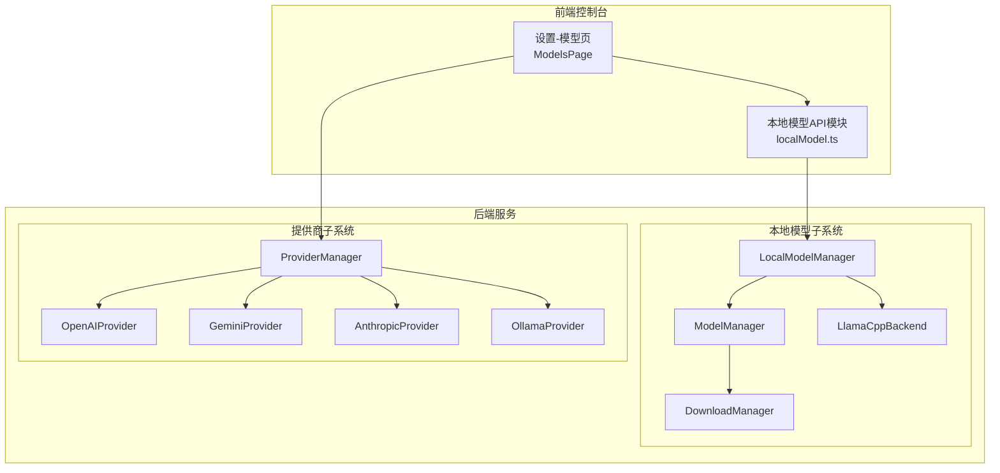
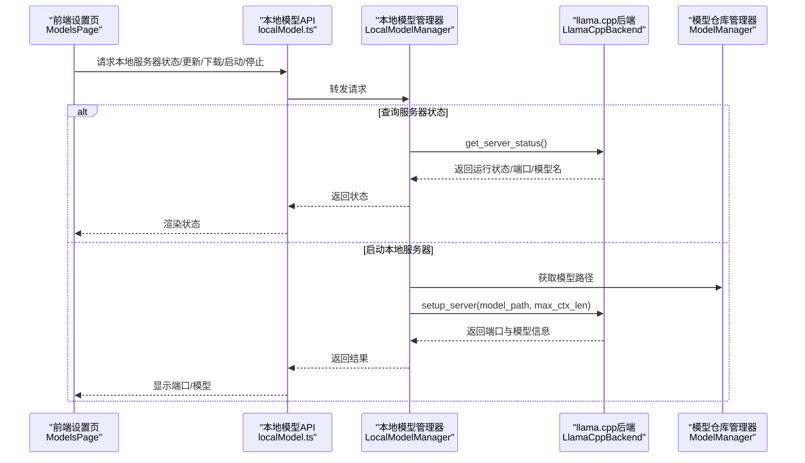
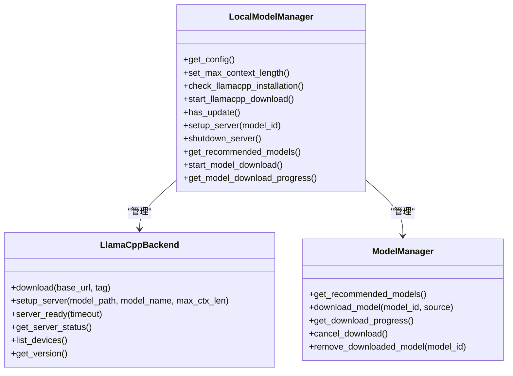
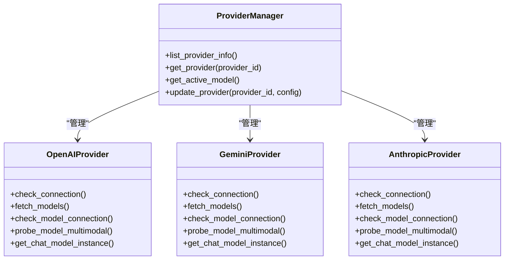
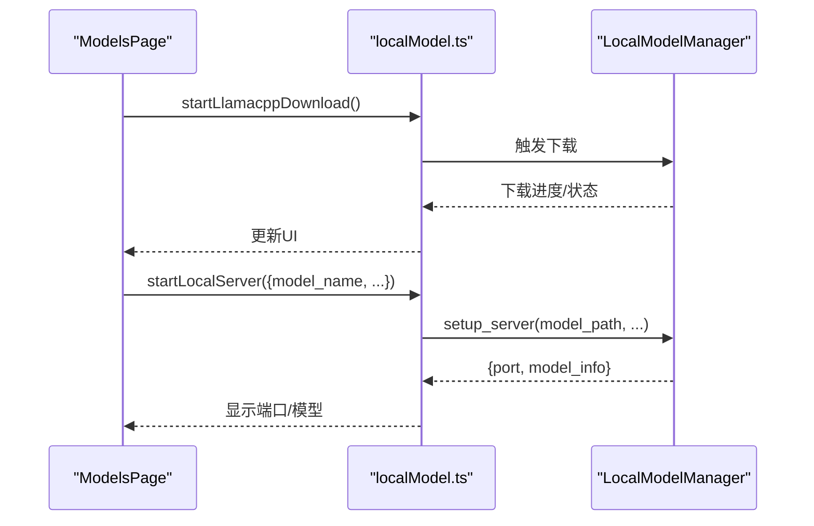
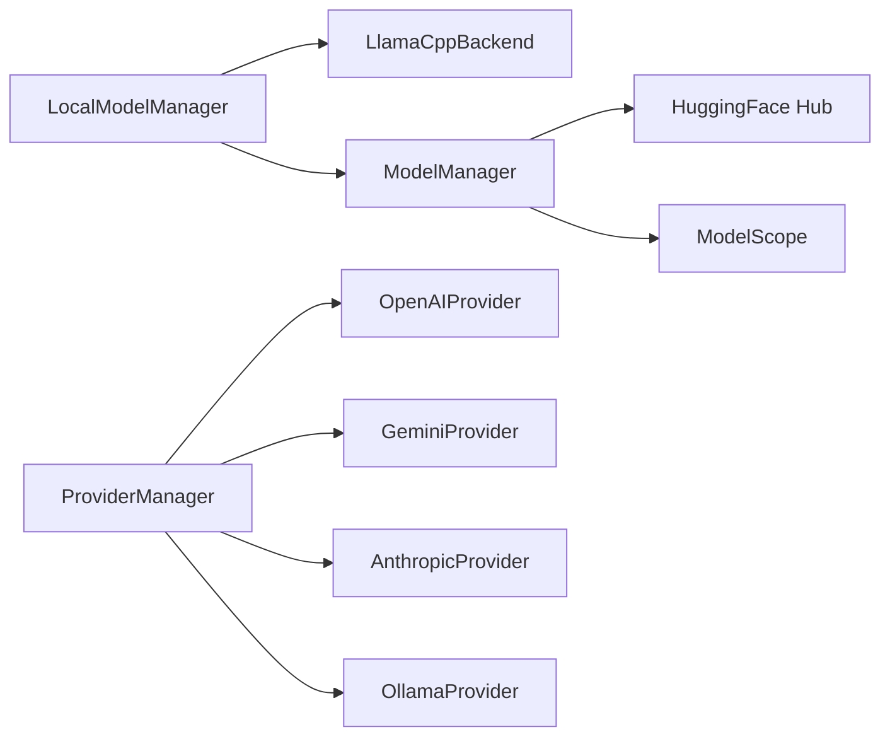

# 模型设置

<cite>
**本文引用的文件**
- [local_models/__init__.py](file://src/copaw/local_models/__init__.py)
- [local_models/manager.py](file://src/copaw/local_models/manager.py)
- [local_models/model_manager.py](file://src/copaw/local_models/model_manager.py)
- [local_models/download_manager.py](file://src/copaw/local_models/download_manager.py)
- [local_models/llamacpp.py](file://src/copaw/local_models/llamacpp.py)
- [providers/__init__.py](file://src/copaw/providers/__init__.py)
- [providers/provider_manager.py](file://src/copaw/providers/provider_manager.py)
- [providers/openai_provider.py](file://src/copaw/providers/openai_provider.py)
- [providers/gemini_provider.py](file://src/copaw/providers/gemini_provider.py)
- [providers/anthropic_provider.py](file://src/copaw/providers/anthropic_provider.py)
- [console/src/pages/Settings/Models/index.tsx](file://console/src/pages/Settings/Models/index.tsx)
- [console/src/api/modules/localModel.ts](file://console/src/api/modules/localModel.ts)
</cite>

## 目录
1. [简介](#简介)
2. [项目结构](#项目结构)
3. [核心组件](#核心组件)
4. [架构总览](#架构总览)
5. [详细组件分析](#详细组件分析)
6. [依赖分析](#依赖分析)
7. [性能考虑](#性能考虑)
8. [故障排查指南](#故障排查指南)
9. [结论](#结论)
10. [附录](#附录)

## 简介
本指南面向使用者与运维人员，系统讲解如何在本项目中完成“模型设置”的全生命周期管理：包括云端模型（如 OpenAI、Gemini、Anthropic 等）与本地模型（llama.cpp、Ollama）的接入、配置、切换、测试与优化；涵盖模型参数调优（如温度、上下文长度）、性能监控、费用统计与使用量查询；以及模型切换策略、负载均衡与故障转移的高级配置思路。同时提供本地模型的下载、安装、更新与卸载操作指引。

## 项目结构
围绕“模型设置”，后端主要由以下模块构成：
- 本地模型子系统：负责 llama.cpp 的下载、安装、服务器启动与状态管理，以及本地模型仓库的下载与进度跟踪。
- 提供商子系统：统一管理各类云端模型提供商（OpenAI、Gemini、Anthropic、Ollama 等），提供连接性检查、模型发现、多模态探测与实例化能力。
- 前端设置页面：提供模型与提供商的可视化配置入口，支持搜索、添加自定义提供商、查看状态与进度等。

图表来源
- [console/src/pages/Settings/Models/index.tsx:1-152](file://console/src/pages/Settings/Models/index.tsx#L1-L152)
- [console/src/api/modules/localModel.ts:1-60](file://console/src/api/modules/localModel.ts#L1-L60)
- [local_models/manager.py:1-229](file://src/copaw/local_models/manager.py#L1-L229)
- [local_models/model_manager.py:1-638](file://src/copaw/local_models/model_manager.py#L1-L638)
- [local_models/llamacpp.py:1-887](file://src/copaw/local_models/llamacpp.py#L1-L887)
- [providers/provider_manager.py:1-1508](file://src/copaw/providers/provider_manager.py#L1-L1508)
- [providers/openai_provider.py:1-550](file://src/copaw/providers/openai_provider.py#L1-L550)
- [providers/gemini_provider.py:1-332](file://src/copaw/providers/gemini_provider.py#L1-L332)
- [providers/anthropic_provider.py:1-256](file://src/copaw/providers/anthropic_provider.py#L1-L256)

章节来源
- [console/src/pages/Settings/Models/index.tsx:1-152](file://console/src/pages/Settings/Models/index.tsx#L1-L152)
- [console/src/api/modules/localModel.ts:1-60](file://console/src/api/modules/localModel.ts#L1-L60)

## 核心组件
- 本地模型管理器（LocalModelManager）
  - 聚合 llama.cpp 后端与本地模型仓库管理器，提供统一的下载、安装、服务器启停与状态查询接口。
  - 关键能力：最大上下文长度配置持久化、llama.cpp 下载与更新检测、服务器就绪检查、下载进度与取消。
- 本地模型仓库管理器（ModelManager）
  - 支持从 Hugging Face 或 ModelScope 自动选择源下载 GGUF 模型，提供进度追踪、取消、删除与推荐模型列表。
  - 关键能力：根据内存容量推荐模型、校验 GGUF 文件存在性、估算下载大小、跨进程下载任务管理。
- llama.cpp 后端（LlamaCppBackend）
  - 负责下载二进制包、解压、安装到本地目录、启动/停止本地推理服务器、健康检查与日志采集。
  - 关键能力：按平台与架构选择可执行文件、设备枚举、版本查询、端口分配与进程生命周期管理。
- 提供商管理器（ProviderManager）
  - 统一注册内置与自定义提供商，提供提供商信息列表、活动模型查询、配置更新与持久化。
  - 关键能力：内置 OpenAI、Gemini、Anthropic、Ollama 等；支持连接性检查、模型发现、多模态探测。
- 前端模型设置页（ModelsPage）
  - 展示提供商卡片、搜索过滤、添加自定义提供商、刷新与重试机制；通过 API 模块与后端交互。

章节来源
- [local_models/manager.py:33-229](file://src/copaw/local_models/manager.py#L33-L229)
- [local_models/model_manager.py:61-638](file://src/copaw/local_models/model_manager.py#L61-L638)
- [local_models/llamacpp.py:51-887](file://src/copaw/local_models/llamacpp.py#L51-L887)
- [providers/provider_manager.py:670-800](file://src/copaw/providers/provider_manager.py#L670-L800)
- [console/src/pages/Settings/Models/index.tsx:20-152](file://console/src/pages/Settings/Models/index.tsx#L20-L152)

## 架构总览
下图展示“模型设置”在前后端的交互路径与职责边界：

图表来源
- [console/src/pages/Settings/Models/index.tsx:1-152](file://console/src/pages/Settings/Models/index.tsx#L1-L152)
- [console/src/api/modules/localModel.ts:12-60](file://console/src/api/modules/localModel.ts#L12-L60)
- [local_models/manager.py:200-229](file://src/copaw/local_models/manager.py#L200-L229)
- [local_models/llamacpp.py:216-308](file://src/copaw/local_models/llamacpp.py#L216-L308)

## 详细组件分析

### 本地模型子系统（llama.cpp + 本地模型仓库）
- 配置与上下文长度
  - LocalModelConfig 提供最大上下文长度字段，LocalModelManager 在启动服务器时读取该配置传入 llama.cpp。
  - 可通过 set_max_context_length 动态更新并持久化，确保后续启动生效。
- llama.cpp 安装与更新
  - LlamaCppBackend 提供下载、解压、安装与版本检查；支持取消下载、健康检查与日志采集。
  - LocalModelManager 将下载与服务器启停进行互斥控制，避免并发冲突。
- 本地模型下载
  - ModelManager 根据可用内存推荐模型，自动探测 HuggingFace 或 ModelScope 可达性，优先选择可达源。
  - 支持 GGUF 文件存在性校验、估算下载大小、跨进程进度上报与最终归档。
- 进程与线程模型
  - 下载采用子进程执行阻塞 SDK 下载，配合队列与进度追踪器，保证 UI 流畅与可观测性。

图表来源
- [local_models/manager.py:33-229](file://src/copaw/local_models/manager.py#L33-L229)
- [local_models/llamacpp.py:51-887](file://src/copaw/local_models/llamacpp.py#L51-L887)
- [local_models/model_manager.py:61-638](file://src/copaw/local_models/model_manager.py#L61-L638)

章节来源
- [local_models/manager.py:23-110](file://src/copaw/local_models/manager.py#L23-L110)
- [local_models/llamacpp.py:145-308](file://src/copaw/local_models/llamacpp.py#L145-L308)
- [local_models/model_manager.py:175-257](file://src/copaw/local_models/model_manager.py#L175-L257)

### 云端模型提供商（OpenAI、Gemini、Anthropic、Ollama 等）
- ProviderManager 注册内置提供商（OpenAI、Gemini、Anthropic、Ollama、LM Studio 等），并支持自定义提供商与插件提供商。
- OpenAIProvider/GeminiProvider/AnthropicProvider 提供：
  - 连接性检查（models.list 或 aio.models.list）
  - 模型发现（normalize payload 并去重）
  - 单模型连通性测试（chat.completions.create 或 generate_content_stream）
  - 多模态探测（图像/视频支持判断）
  - 实例化聊天模型（返回 ChatModelBase 子类）

图表来源
- [providers/provider_manager.py:670-800](file://src/copaw/providers/provider_manager.py#L670-L800)
- [providers/openai_provider.py:25-550](file://src/copaw/providers/openai_provider.py#L25-L550)
- [providers/gemini_provider.py:27-332](file://src/copaw/providers/gemini_provider.py#L27-L332)
- [providers/anthropic_provider.py:27-256](file://src/copaw/providers/anthropic_provider.py#L27-L256)

章节来源
- [providers/provider_manager.py:46-631](file://src/copaw/providers/provider_manager.py#L46-L631)
- [providers/openai_provider.py:57-125](file://src/copaw/providers/openai_provider.py#L57-L125)
- [providers/gemini_provider.py:68-131](file://src/copaw/providers/gemini_provider.py#L68-L131)
- [providers/anthropic_provider.py:66-127](file://src/copaw/providers/anthropic_provider.py#L66-L127)

### 前端模型设置页面与本地模型 API
- ModelsPage 提供：
  - 顶部“LLM”与“提供商”分组展示
  - 搜索与刷新功能
  - 添加自定义提供商弹窗
  - 本地提供商与常规提供商分组渲染
- localModel.ts 提供：
  - 本地服务器状态、更新状态查询
  - llama.cpp 下载、进度与取消
  - 推荐模型列表、模型下载与进度
  - 启动/停止本地服务器

图表来源
- [console/src/pages/Settings/Models/index.tsx:20-152](file://console/src/pages/Settings/Models/index.tsx#L20-L152)
- [console/src/api/modules/localModel.ts:12-60](file://console/src/api/modules/localModel.ts#L12-L60)
- [local_models/manager.py:200-229](file://src/copaw/local_models/manager.py#L200-L229)

章节来源
- [console/src/pages/Settings/Models/index.tsx:20-152](file://console/src/pages/Settings/Models/index.tsx#L20-L152)
- [console/src/api/modules/localModel.ts:12-60](file://console/src/api/modules/localModel.ts#L12-L60)

## 依赖分析
- 组件耦合
  - LocalModelManager 作为门面，聚合 LlamaCppBackend 与 ModelManager，降低上层复杂度。
  - ProviderManager 统一管理多种提供商，便于扩展与替换。
- 外部依赖
  - 本地模型：huggingface_hub、modelscope（用于模型仓库下载与元数据查询）。
  - 云端提供商：openai、google-generativeai、anthropic（用于模型发现与调用）。
- 数据流
  - 本地模型：下载进度通过 DownloadProgressTracker 与队列在子进程中上报，主线程合并为统一快照。
  - 云端模型：通过各 Provider 的异步客户端发起请求，支持超时与错误分类处理。

图表来源
- [local_models/manager.py:45-53](file://src/copaw/local_models/manager.py#L45-L53)
- [local_models/model_manager.py:37-42](file://src/copaw/local_models/model_manager.py#L37-L42)
- [providers/provider_manager.py:21-26](file://src/copaw/providers/provider_manager.py#L21-L26)

章节来源
- [local_models/model_manager.py:37-42](file://src/copaw/local_models/model_manager.py#L37-L42)
- [providers/provider_manager.py:21-26](file://src/copaw/providers/provider_manager.py#L21-L26)

## 性能考虑
- 上下文长度（max_context_length）
  - 影响模型可处理的输入/历史长度，过小导致截断，过大可能增加显存占用与推理延迟。
  - 建议依据可用显存/内存与任务复杂度逐步调优，并结合实际对话长度评估。
- GPU 加速与设备选择
  - llama.cpp 启动时会自动选择 GPU 层数（auto），若需手动指定可参考后端命令行参数。
- 并发与资源竞争
  - 本地下载与服务器启停受互斥锁保护，避免竞态；建议在下载或更新期间暂停推理以减少资源争用。
- 网络与存储
  - 本地模型下载采用分块流式写入与进度上报，建议在稳定网络环境下进行，避免中断导致重试成本上升。
- 云端模型
  - 使用连接性检查与单模型连通性测试，提前验证可用性；对多模态能力进行探测，避免无效请求。

[本节为通用指导，不直接分析具体文件]

## 故障排查指南
- 本地服务器无法启动
  - 检查服务器状态与健康检查接口；确认端口未被占用；查看日志输出定位错误。
  - 若上次异常退出，先执行停止再重启。
- llama.cpp 下载失败
  - 检查网络连通性与目标版本是否支持当前平台；根据错误提示（如 404/403/5xx）调整版本或镜像源。
  - 可取消并重新开始下载，必要时清理临时目录。
- 本地模型下载失败
  - 确认仓库包含至少一个 .gguf 文件；检查 HuggingFace/ModelScope 可达性；查看进度与错误消息。
- 云端模型不可用
  - 先执行连接性检查与单模型连通性测试；核对 API Key、Base URL 与模型 ID；查看多模态探测结果。
- 前端无响应或状态不同步
  - 刷新页面或点击重试；确认 API 请求成功返回；检查浏览器控制台是否有异常。

章节来源
- [local_models/llamacpp.py:656-692](file://src/copaw/local_models/llamacpp.py#L656-L692)
- [local_models/llamacpp.py:614-648](file://src/copaw/local_models/llamacpp.py#L614-L648)
- [local_models/model_manager.py:458-501](file://src/copaw/local_models/model_manager.py#L458-L501)
- [providers/openai_provider.py:57-72](file://src/copaw/providers/openai_provider.py#L57-L72)
- [providers/gemini_provider.py:68-87](file://src/copaw/providers/gemini_provider.py#L68-L87)
- [providers/anthropic_provider.py:66-79](file://src/copaw/providers/anthropic_provider.py#L66-L79)

## 结论
本项目提供了从云端到本地的完整模型设置与管理能力：通过 ProviderManager 统一接入多家云端提供商，借助 LocalModelManager 与 LlamaCppBackend 实现本地模型的自动化部署与运行，配合前端设置页提供直观的配置入口。建议在生产环境中结合资源监控与多模态探测，持续优化上下文长度与并发策略，确保稳定性与性价比。

[本节为总结性内容，不直接分析具体文件]

## 附录

### 模型参数调优与最佳实践
- 温度（temperature）
  - 控制生成随机性；较低值更确定，较高值更具创造性。建议在 0.1~0.7 区间内尝试。
- 上下文长度（max_context_length）
  - 依据显存/内存与任务长度设定；过长可能引发 OOM 或显著延迟。
- 最大输出长度（max_tokens）
  - 防止冗长输出；结合任务目标合理设置。
- 多模态能力
  - 使用提供商的多模态探测能力，确认图像/视频输入支持后再启用相应功能。

[本节为通用指导，不直接分析具体文件]

### 云端模型接入步骤
- 在“提供商”区域添加或编辑提供商，填写 Base URL 与 API Key。
- 使用“连接性检查”与“单模型连通性测试”验证可用性。
- 如需多模态能力，先执行探测，再在会话中启用图片/视频输入。

章节来源
- [providers/openai_provider.py:57-125](file://src/copaw/providers/openai_provider.py#L57-L125)
- [providers/gemini_provider.py:68-131](file://src/copaw/providers/gemini_provider.py#L68-L131)
- [providers/anthropic_provider.py:66-127](file://src/copaw/providers/anthropic_provider.py#L66-L127)

### 本地模型接入与操作
- 下载与安装
  - 通过“llama.cpp 下载”触发安装；等待健康检查通过后进入可用状态。
- 选择与启动
  - 从“推荐模型”或已下载模型中选择，启动本地服务器后获得端口与模型信息。
- 更新与卸载
  - 检测更新并下载新版本；删除模型或服务器后清理缓存目录。

章节来源
- [console/src/api/modules/localModel.ts:19-59](file://console/src/api/modules/localModel.ts#L19-L59)
- [local_models/manager.py:119-148](file://src/copaw/local_models/manager.py#L119-L148)
- [local_models/model_manager.py:165-174](file://src/copaw/local_models/model_manager.py#L165-L174)

### 模型切换策略、负载均衡与故障转移
- 切换策略
  - 通过 ProviderManager 的活动模型配置实现快速切换；在前端页面可直观选择与保存。
- 负载均衡
  - 对于多实例或多提供商场景，建议在网关或代理层实现轮询/权重策略，结合健康检查动态摘除异常节点。
- 故障转移
  - 当某提供商/本地服务不可用时，自动降级至备用提供商或本地模型；记录失败原因并触发告警。

[本节为通用指导，不直接分析具体文件]