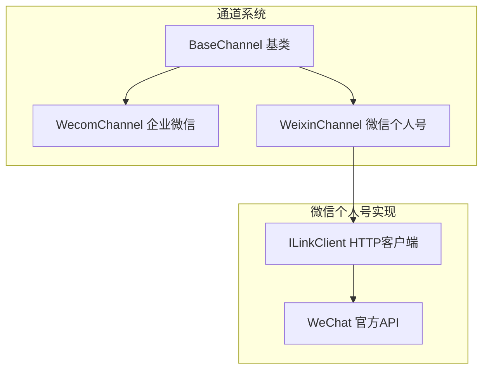
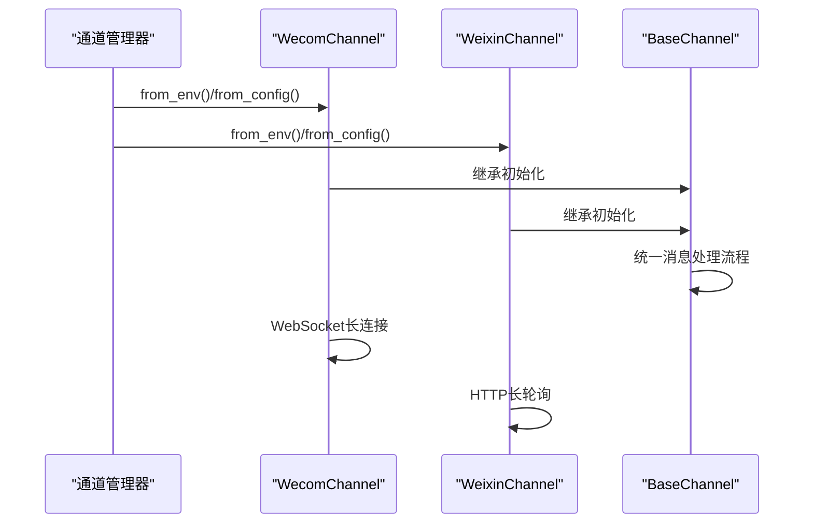
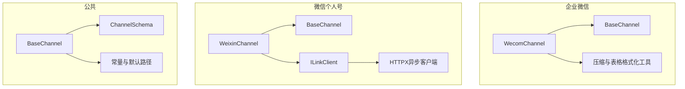

# 企业微信渠道

<cite>
**本文档引用的文件**
- [wecom/__init__.py](file://src/copaw/app/channels/wecom/__init__.py)
- [wecom/channel.py](file://src/copaw/app/channels/wecom/channel.py)
- [weixin/__init__.py](file://src/copaw/app/channels/weixin/__init__.py)
- [weixin/channel.py](file://src/copaw/app/channels/weixin/channel.py)
- [weixin/client.py](file://src/copaw/app/channels/weixin/client.py)
- [base.py](file://src/copaw/app/channels/base.py)
- [schema.py](file://src/copaw/app/channels/schema.py)
- [constant.py](file://src/copaw/constant.py)
- [channels.en.md](file://website/public/docs/channels.en.md)
- [ChannelDrawer.tsx](file://console/src/pages/Control/Channels/components/ChannelDrawer.tsx)
- [config.en.md](file://website/public/docs/config.en.md)
</cite>

## 目录
1. [简介](#简介)
2. [项目结构](#项目结构)
3. [核心组件](#核心组件)
4. [架构概览](#架构概览)
5. [详细组件分析](#详细组件分析)
6. [依赖关系分析](#依赖关系分析)
7. [性能考虑](#性能考虑)
8. [故障排除指南](#故障排除指南)
9. [结论](#结论)
10. [附录](#附录)

## 简介
本指南专注于Copaw项目中企业微信（WeCom）和微信个人号（WeChat iLink Bot）渠道的配置与使用。内容涵盖：
- 企业微信应用配置、机器人创建与绑定
- 微信公众号接入、小程序集成的准备工作
- 参数获取流程：企业ID、应用ID、应用密钥等
- 消息模板、菜单配置、用户标签管理等高级功能
- 客服接口、素材管理、群发消息等扩展功能
- 服务器域名配置、微信支付集成、小程序开发等

## 项目结构
企业微信与微信渠道位于Copaw应用的通道系统中，采用统一的BaseChannel抽象层，支持多种即时通讯平台。

**图表来源**
- [base.py:70-120](file://src/copaw/app/channels/base.py#L70-L120)
- [wecom/channel.py:89-150](file://src/copaw/app/channels/wecom/channel.py#L89-L150)
- [weixin/channel.py:60-120](file://src/copaw/app/channels/weixin/channel.py#L60-L120)
- [weixin/client.py:43-80](file://src/copaw/app/channels/weixin/client.py#L43-L80)

**章节来源**
- [wecom/__init__.py:1-7](file://src/copaw/app/channels/wecom/__init__.py#L1-L7)
- [weixin/__init__.py:1-7](file://src/copaw/app/channels/weixin/__init__.py#L1-L7)
- [base.py:1-120](file://src/copaw/app/channels/base.py#L1-L120)

## 核心组件
- **BaseChannel**：所有通道的抽象基类，定义统一的消息处理流程、会话管理、去重机制和发送策略。
- **WecomChannel**：企业微信AI机器人通道，基于WebSocket长连接接收和发送消息，支持文本、图片、语音、文件等多种媒体类型。
- **WeixinChannel**：微信个人号iLink Bot通道，基于HTTP长轮询接收消息，通过REST API发送消息，支持二维码登录和令牌持久化。
- **ILinkClient**：微信iLink Bot的HTTP客户端，封装QR码登录、消息收发、媒体上传下载等API。

**章节来源**
- [base.py:70-200](file://src/copaw/app/channels/base.py#L70-L200)
- [wecom/channel.py:89-215](file://src/copaw/app/channels/wecom/channel.py#L89-L215)
- [weixin/channel.py:60-202](file://src/copaw/app/channels/weixin/channel.py#L60-L202)
- [weixin/client.py:43-120](file://src/copaw/app/channels/weixin/client.py#L43-L120)

## 架构概览
企业微信与微信渠道共享统一的通道管理器，通过环境变量或配置文件注入参数，实现灵活的部署与热重载。

**图表来源**
- [base.py:538-556](file://src/copaw/app/channels/base.py#L538-L556)
- [wecom/channel.py:152-215](file://src/copaw/app/channels/wecom/channel.py#L152-L215)
- [weixin/channel.py:148-202](file://src/copaw/app/channels/weixin/channel.py#L148-L202)

**章节来源**
- [base.py:538-556](file://src/copaw/app/channels/base.py#L538-L556)
- [wecom/channel.py:152-215](file://src/copaw/app/channels/wecom/channel.py#L152-L215)
- [weixin/channel.py:148-202](file://src/copaw/app/channels/weixin/channel.py#L148-L202)

## 详细组件分析

### 企业微信（WeCom）配置指南

#### 1. 创建企业与机器人
- 访问企业微信官网注册企业账号，完成企业信息与管理员信息填写，并绑定微信账户。
- 在企业微信后台创建API模式机器人，选择“长连接”方式，获取Bot ID与Secret。

**章节来源**
- [channels.en.md:546-584](file://website/public/docs/channels.en.md#L546-L584)

#### 2. 参数配置与获取
- 企业ID（在企业微信后台获取）
- 应用ID（机器人ID）
- 应用密钥（Secret）

**章节来源**
- [channels.en.md:572-574](file://website/public/docs/channels.en.md#L572-L574)

#### 3. 配置方式
- 控制台配置：在控制台的通道设置中输入Bot ID与Secret，支持二维码登录。
- agent.json配置：在工作空间的agent.json中添加wecom通道配置。

**章节来源**
- [ChannelDrawer.tsx:654-725](file://console/src/pages/Control/Channels/components/ChannelDrawer.tsx#L654-L725)
- [config.en.md:283-304](file://website/public/docs/config.en.md#L283-L304)

#### 4. 环境变量配置
- WECOM_CHANNEL_ENABLED：启用企业微信通道
- WECOM_BOT_ID：机器人ID
- WECOM_SECRET：机器人密钥
- WECOM_BOT_PREFIX：前缀
- WECOM_MEDIA_DIR：媒体目录
- WECOM_DM_POLICY：私聊策略
- WECOM_GROUP_POLICY：群聊策略
- WECOM_ALLOW_FROM：允许列表
- WECOM_DENY_MESSAGE：拒绝消息
- WECOM_MAX_RECONNECT_ATTEMPTS：最大重连次数

**章节来源**
- [wecom/channel.py:152-179](file://src/copaw/app/channels/wecom/channel.py#L152-L179)

#### 5. 会话与消息处理
- 单聊会话ID格式：wecom:{userid}
- 群聊会话ID格式：wecom:group:{chatid}
- 支持文本、图片、语音、文件、混合消息类型
- 去重机制：基于消息ID的去重缓存
- 媒体下载：支持图片、文件、视频的下载与本地存储

**章节来源**
- [wecom/channel.py:220-234](file://src/copaw/app/channels/wecom/channel.py#L220-L234)
- [wecom/channel.py:322-331](file://src/copaw/app/channels/wecom/channel.py#L322-L331)
- [wecom/channel.py:637-667](file://src/copaw/app/channels/wecom/channel.py#L637-L667)

#### 6. 发送与回复
- 通过WebSocket长连接发送消息
- 支持流式回复（reply_stream）
- 媒体上传：分块上传，支持图片压缩与加密

**章节来源**
- [wecom/channel.py:672-705](file://src/copaw/app/channels/wecom/channel.py#L672-L705)
- [wecom/channel.py:706-800](file://src/copaw/app/channels/wecom/channel.py#L706-L800)

#### 7. 高级功能
- 欢迎语：enter_chat事件触发欢迎消息
- 允许列表与策略：支持私聊与群聊的访问控制
- 处理指示：发送"思考中"提示

**章节来源**
- [wecom/channel.py:623-632](file://src/copaw/app/channels/wecom/channel.py#L623-L632)
- [base.py:283-306](file://src/copaw/app/channels/base.py#L283-L306)

### 微信个人号（WeChat iLink Bot）配置指南

#### 1. 二维码登录与令牌管理
- 启动时自动获取二维码，扫描后等待确认
- 登录成功后保存bot_token到文件，后续启动自动加载
- 支持自定义token文件路径

**章节来源**
- [weixin/channel.py:371-411](file://src/copaw/app/channels/weixin/channel.py#L371-L411)
- [weixin/channel.py:287-312](file://src/copaw/app/channels/weixin/channel.py#L287-L312)

#### 2. 参数配置与获取
- bot_token：从二维码登录获取的Bearer Token
- bot_token_file：令牌文件路径
- base_url：iLink API基础URL
- bot_prefix：前缀
- media_dir：媒体目录

**章节来源**
- [weixin/channel.py:148-173](file://src/copaw/app/channels/weixin/channel.py#L148-L173)

#### 3. 环境变量配置
- WEIXIN_CHANNEL_ENABLED：启用微信个人号通道
- WEIXIN_BOT_TOKEN：机器人令牌
- WEIXIN_BOT_TOKEN_FILE：令牌文件路径
- WEIXIN_BASE_URL：API基础URL
- WEIXIN_BOT_PREFIX：前缀
- WEIXIN_MEDIA_DIR：媒体目录
- WEIXIN_DM_POLICY：私聊策略
- WEIXIN_GROUP_POLICY：群聊策略
- WEIXIN_ALLOW_FROM：允许列表
- WEIXIN_DENY_MESSAGE：拒绝消息

**章节来源**
- [weixin/channel.py:156-173](file://src/copaw/app/channels/weixin/channel.py#L156-L173)

#### 4. 消息处理与去重
- 长轮询获取消息，支持上下文令牌去重
- 支持文本、图片、语音（ASR）、文件、视频消息
- 缓存用户上下文令牌用于主动发送

**章节来源**
- [weixin/channel.py:416-486](file://src/copaw/app/channels/weixin/channel.py#L416-L486)
- [weixin/channel.py:358-366](file://src/copaw/app/channels/weixin/channel.py#L358-L366)
- [weixin/channel.py:713-717](file://src/copaw/app/channels/weixin/channel.py#L713-L717)

#### 5. 媒体处理与发送
- 媒体下载：支持AES-128-ECB解密
- 媒体上传：生成随机密钥与filekey，加密后上传至CDN
- 支持图片、视频、文件发送

**章节来源**
- [weixin/channel.py:769-800](file://src/copaw/app/channels/weixin/channel.py#L769-L800)
- [weixin/client.py:322-369](file://src/copaw/app/channels/weixin/client.py#L322-L369)
- [weixin/client.py:411-559](file://src/copaw/app/channels/weixin/client.py#L411-L559)

#### 6. Typing指示与主动发送
- 获取typing_ticket并发送"正在输入"指示
- 基于上下文令牌进行主动消息发送

**章节来源**
- [weixin/channel.py:718-743](file://src/copaw/app/channels/weixin/channel.py#L718-L743)
- [weixin/client.py:281-317](file://src/copaw/app/channels/weixin/client.py#L281-L317)

### 通用配置与管理

#### 1. 通道类型标识
- 企业微信：channel = "wecom"
- 微信个人号：channel = "wechat"

**章节来源**
- [wecom/channel.py:97-98](file://src/copaw/app/channels/wecom/channel.py#L97-L98)
- [weixin/channel.py:68-69](file://src/copaw/app/channels/weixin/channel.py#L68-L69)

#### 2. 会话解析与路由
- resolve_session_id：根据元数据解析会话ID
- get_to_handle_from_request：确定发送目标

**章节来源**
- [base.py:557-567](file://src/copaw/app/channels/base.py#L557-L567)
- [wecom/channel.py:220-234](file://src/copaw/app/channels/wecom/channel.py#L220-L234)
- [weixin/channel.py:207-217](file://src/copaw/app/channels/weixin/channel.py#L207-L217)

#### 3. 媒体目录与默认路径
- DEFAULT_MEDIA_DIR：默认媒体存储目录
- 可通过环境变量或配置覆盖

**章节来源**
- [constant.py:88-89](file://src/copaw/constant.py#L88-L89)
- [wecom/channel.py:134-136](file://src/copaw/app/channels/wecom/channel.py#L134-L136)
- [weixin/channel.py:111-113](file://src/copaw/app/channels/weixin/channel.py#L111-L113)

## 依赖关系分析

**图表来源**
- [wecom/channel.py:38-47](file://src/copaw/app/channels/wecom/channel.py#L38-L47)
- [weixin/channel.py:41-49](file://src/copaw/app/channels/weixin/channel.py#L41-L49)
- [base.py:36-46](file://src/copaw/app/channels/base.py#L36-L46)
- [schema.py:12-28](file://src/copaw/app/channels/schema.py#L12-L28)
- [constant.py:88-89](file://src/copaw/constant.py#L88-L89)

**章节来源**
- [wecom/channel.py:38-47](file://src/copaw/app/channels/wecom/channel.py#L38-L47)
- [weixin/channel.py:41-49](file://src/copaw/app/channels/weixin/channel.py#L41-L49)
- [base.py:36-46](file://src/copaw/app/channels/base.py#L36-L46)
- [schema.py:12-28](file://src/copaw/app/channels/schema.py#L12-L28)
- [constant.py:88-89](file://src/copaw/constant.py#L88-L89)

## 性能考虑
- 企业微信通道使用WebSocket长连接，减少HTTP开销，适合高频消息场景。
- 微信个人号通道采用长轮询，降低资源占用，但存在轮询延迟。
- 媒体处理：企业微信支持分块上传与图片压缩，微信个人号支持AES-128-ECB加密上传。
- 去重机制：两种通道均实现消息去重，避免重复处理。
- 会话合并：BaseChannel提供内容合并与去抖机制，优化多片段消息处理。

## 故障排除指南

### 企业微信常见问题
1. **连接失败**
   - 检查Bot ID与Secret是否正确
   - 确认网络可访问企业微信WebSocket服务
   - 查看最大重连次数配置

2. **媒体下载失败**
   - 检查媒体目录权限
   - 确认AES密钥与URL参数正确

**章节来源**
- [wecom/channel.py:152-179](file://src/copaw/app/channels/wecom/channel.py#L152-L179)
- [wecom/channel.py:637-667](file://src/copaw/app/channels/wecom/channel.py#L637-L667)

### 微信个人号常见问题
1. **二维码登录超时**
   - 检查网络连接与代理设置
   - 确认未超过最大等待时间（300秒）

2. **媒体上传失败**
   - 检查CDN响应头中的encrypt_query_param
   - 确认AES密钥格式正确

**章节来源**
- [weixin/channel.py:371-411](file://src/copaw/app/channels/weixin/channel.py#L371-L411)
- [weixin/client.py:542-558](file://src/copaw/app/channels/weixin/client.py#L542-L558)

## 结论
Copaw的企业微信与微信个人号通道提供了完整的IM集成解决方案。通过统一的BaseChannel抽象，实现了跨平台的一致性体验。企业微信适合企业级应用，微信个人号适合个人开发者与小规模应用。合理的配置与监控能够确保消息的稳定传输与处理。

## 附录

### 参数对照表
- 企业微信：Bot ID、Secret、媒体目录、欢迎语、策略配置
- 微信个人号：bot_token、bot_token_file、base_url、媒体目录、策略配置

### 扩展功能指引
- 消息模板：通过Agent端渲染与发送
- 菜单配置：企业微信管理后台配置
- 用户标签管理：企业微信管理后台配置
- 客服接口：企业微信客服API
- 素材管理：企业微信素材库
- 群发消息：企业微信群发接口
- 服务器域名配置：企业微信回调域名设置
- 微信支付集成：企业微信支付API
- 小程序开发：企业微信小程序平台

**章节来源**
- [channels.en.md:546-584](file://website/public/docs/channels.en.md#L546-L584)
- [config.en.md:283-304](file://website/public/docs/config.en.md#L283-L304)