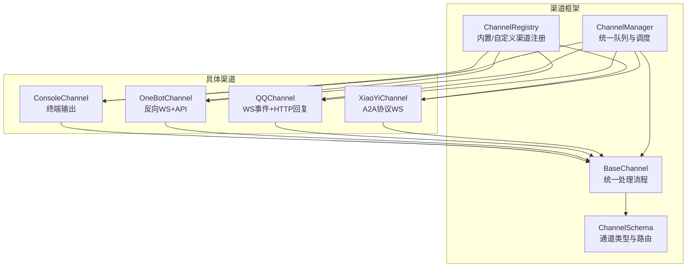
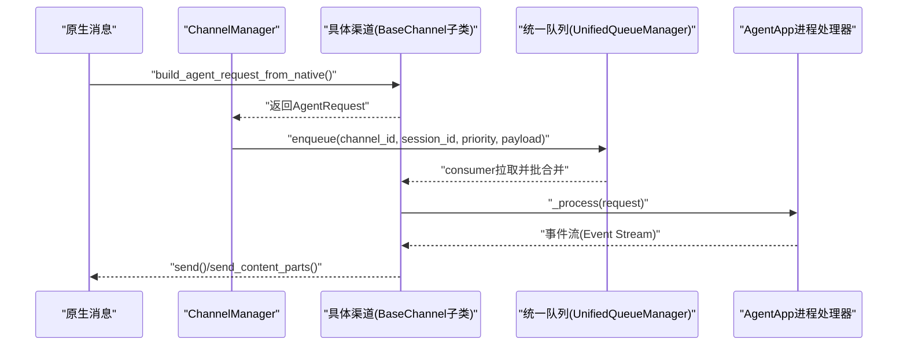
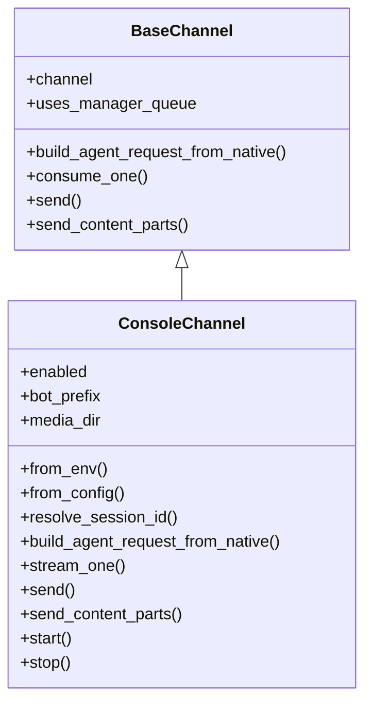
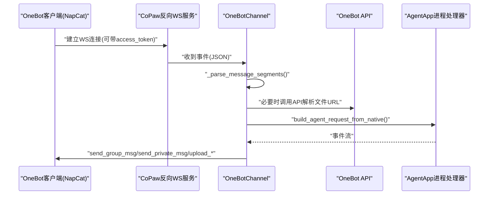
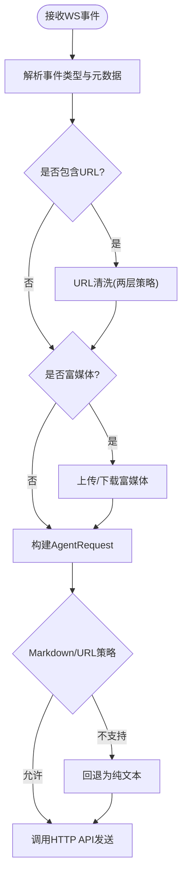
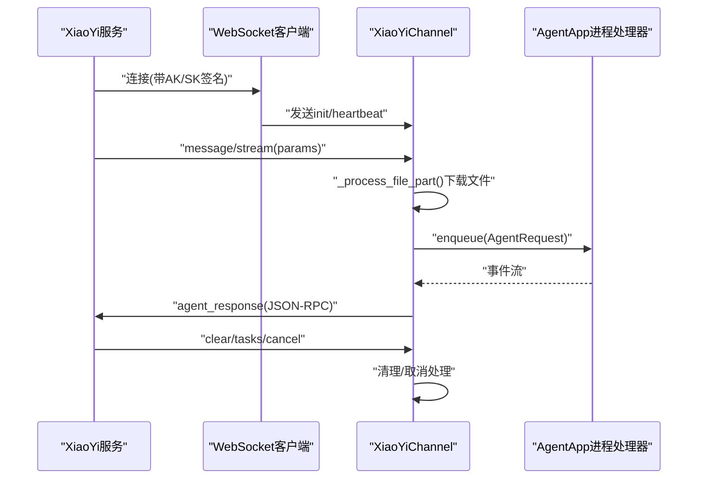
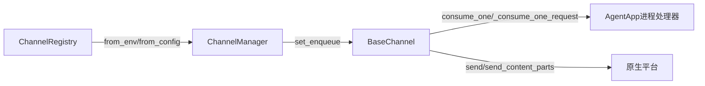

# 其他渠道

<cite>
**本文引用的文件**
- [src/copaw/app/channels/base.py](file://src/copaw/app/channels/base.py)
- [src/copaw/app/channels/console/channel.py](file://src/copaw/app/channels/console/channel.py)
- [src/copaw/app/channels/onebot/channel.py](file://src/copaw/app/channels/onebot/channel.py)
- [src/copaw/app/channels/qq/channel.py](file://src/copaw/app/channels/qq/channel.py)
- [src/copaw/app/channels/xiaoyi/channel.py](file://src/copaw/app/channels/xiaoyi/channel.py)
- [src/copaw/app/channels/schema.py](file://src/copaw/app/channels/schema.py)
- [src/copaw/app/channels/manager.py](file://src/copaw/app/channels/manager.py)
- [src/copaw/app/channels/registry.py](file://src/copaw/app/channels/registry.py)
- [src/copaw/app/channels/xiaoyi/constants.py](file://src/copaw/app/channels/xiaoyi/constants.py)
- [src/copaw/app/channels/xiaoyi/auth.py](file://src/copaw/app/channels/xiaoyi/auth.py)
</cite>

## 目录
1. [简介](#简介)
2. [项目结构](#项目结构)
3. [核心组件](#核心组件)
4. [架构总览](#架构总览)
5. [详细组件分析](#详细组件分析)
6. [依赖分析](#依赖分析)
7. [性能考虑](#性能考虑)
8. [故障排查指南](#故障排查指南)
9. [结论](#结论)
10. [附录](#附录)

## 简介
本指南聚焦于“其他类型渠道”的配置与使用，涵盖以下特殊平台：
- 控制台渠道（Console）：用于本地调试与测试，直接在终端输出对话结果。
- OneBot 协议（OneBot v11）：通过反向 WebSocket 接入 NapCat、go-cqhttp、Lagrange 等生态，支持私聊/群聊、媒体文件、提及机器人等。
- QQ 渠道：基于 WebSocket 的事件接入与 HTTP API 的回复路径，支持富媒体下载、Markdown 发送、URL 敏感处理等。
- 小艺语音助手（XiaoYi）：基于 A2A（Agent-to-Agent）协议的 WebSocket 渠道，支持任务取消、上下文清理、文件下载等。

本指南同时阐述各渠道的消息格式、会话路由、鉴权与安全、兼容性与限制，并给出配置要点与排障建议。

## 项目结构
围绕渠道的代码主要位于 src/copaw/app/channels 下，采用“基类 + 各渠道实现 + 管理器 + 注册表”的分层设计：
- 基类与通用能力：统一请求构建、内容渲染、去抖合并、队列与消费、会话路由等。
- 渠道实现：Console、OneBot、QQ、XiaoYi 等各自解析原生消息、构建 AgentRequest、发送响应。
- 管理器：负责通道生命周期、统一队列、批量合并、优先级调度。
- 注册表：内置与自定义渠道注册、动态加载、可用性检测。

图示来源
- [src/copaw/app/channels/base.py:70-127](file://src/copaw/app/channels/base.py#L70-L127)
- [src/copaw/app/channels/manager.py:68-106](file://src/copaw/app/channels/manager.py#L68-L106)
- [src/copaw/app/channels/registry.py:190-195](file://src/copaw/app/channels/registry.py#L190-L195)
- [src/copaw/app/channels/schema.py:12-48](file://src/copaw/app/channels/schema.py#L12-L48)

章节来源
- [src/copaw/app/channels/base.py:70-127](file://src/copaw/app/channels/base.py#L70-L127)
- [src/copaw/app/channels/manager.py:68-106](file://src/copaw/app/channels/manager.py#L68-L106)
- [src/copaw/app/channels/registry.py:190-195](file://src/copaw/app/channels/registry.py#L190-L195)
- [src/copaw/app/channels/schema.py:12-48](file://src/copaw/app/channels/schema.py#L12-L48)

## 核心组件
- BaseChannel：定义统一的请求构建、内容渲染、去抖合并、会话路由、发送接口等；子类仅需实现原生消息解析与发送逻辑。
- ChannelManager：统一启动/停止所有渠道，维护统一队列与消费者，按会话键合并批量消息，支持优先级与超时保护。
- ChannelRegistry：内置渠道映射（含 console、onebot、qq、xiaoyi 等），并支持从工作目录加载自定义渠道。
- ChannelSchema：内置通道类型集合、路由地址模型、转换协议接口。

章节来源
- [src/copaw/app/channels/base.py:70-127](file://src/copaw/app/channels/base.py#L70-L127)
- [src/copaw/app/channels/manager.py:68-106](file://src/copaw/app/channels/manager.py#L68-L106)
- [src/copaw/app/channels/registry.py:20-36](file://src/copaw/app/channels/registry.py#L20-L36)
- [src/copaw/app/channels/schema.py:12-48](file://src/copaw/app/channels/schema.py#L12-L48)

## 架构总览
下图展示从原生消息到 AgentRequest 的转换、统一队列与消费、以及渠道发送路径的整体流程。

图示来源
- [src/copaw/app/channels/base.py:604-631](file://src/copaw/app/channels/base.py#L604-L631)
- [src/copaw/app/channels/manager.py:362-446](file://src/copaw/app/channels/manager.py#L362-L446)

章节来源
- [src/copaw/app/channels/base.py:604-631](file://src/copaw/app/channels/base.py#L604-L631)
- [src/copaw/app/channels/manager.py:362-446](file://src/copaw/app/channels/manager.py#L362-L446)

## 详细组件分析

### 控制台渠道（Console）
- 角色定位：轻量输出通道，将 AgentResponse 的内容以人类可读形式打印到终端；适合本地调试与快速验证。
- 关键特性
  - 支持过滤选项：显示工具详情、过滤中间工具消息、过滤思考过程。
  - 上传媒体解析：将图片/视频/音频/文件内容解析为本地路径或 URL，便于前端推送与展示。
  - 终端编码与管道兼容：Windows 平台自动重配置 stdout 编码，避免 OSError。
  - 会话 ID 解析：支持显式 meta 中的 session_id，否则回退为 console:<sender_id>。
- 配置入口
  - 环境变量：CONSOLE_CHANNEL_ENABLED、CONSOLE_BOT_PREFIX、CONSOLE_MEDIA_DIR。
  - 配置对象：ConsoleChannelConfig。
- 使用建议
  - 调试阶段开启，生产环境谨慎启用，避免在无终端环境中输出噪声。
  - 如需媒体预览，确保媒体目录存在且可写。

图示来源
- [src/copaw/app/channels/base.py:70-127](file://src/copaw/app/channels/base.py#L70-L127)
- [src/copaw/app/channels/console/channel.py:63-190](file://src/copaw/app/channels/console/channel.py#L63-L190)

章节来源
- [src/copaw/app/channels/console/channel.py:63-190](file://src/copaw/app/channels/console/channel.py#L63-L190)
- [src/copaw/app/channels/console/channel.py:192-276](file://src/copaw/app/channels/console/channel.py#L192-L276)
- [src/copaw/app/channels/console/channel.py:319-431](file://src/copaw/app/channels/console/channel.py#L319-L431)
- [src/copaw/app/channels/console/channel.py:525-572](file://src/copaw/app/channels/console/channel.py#L525-L572)

### OneBot 渠道（OneBot v11）
- 连接模式：CoPaw 作为反向 WebSocket 服务器，由 NapCat/go-cqhttp/Lagrange 等客户端连接。
- 消息解析：将 OneBot v11 的 message 段落（文本、图片、语音、视频、文件、@）解析为运行时内容块。
- 文件处理：对 NapCat 的文件段落，调用 OneBot API 获取真实下载 URL。
- 会话路由：支持私聊与群聊，群内可选择共享会话或按用户隔离；支持 @ 机器人触发。
- 发送路径：根据消息类型调用 send_group_msg/send_private_msg/upload_group_file/upload_private_file。
- 安全与鉴权：支持 Authorization 头或查询参数 access_token 校验。
- 配置入口
  - 环境变量：ONEBOT_CHANNEL_ENABLED、ONEBOT_WS_HOST、ONEBOT_WS_PORT、ONEBOT_ACCESS_TOKEN、ONEBOT_BOT_PREFIX、ONEBOT_DM_POLICY、ONEBOT_GROUP_POLICY、ONEBOT_ALLOW_FROM、ONEBOT_DENY_MESSAGE、ONEBOT_REQUIRE_MENTION、ONEBOT_SHARE_SESSION_IN_GROUP。
  - 配置对象：OneBotChannelConfig。

图示来源
- [src/copaw/app/channels/onebot/channel.py:220-275](file://src/copaw/app/channels/onebot/channel.py#L220-L275)
- [src/copaw/app/channels/onebot/channel.py:304-377](file://src/copaw/app/channels/onebot/channel.py#L304-L377)
- [src/copaw/app/channels/onebot/channel.py:382-451](file://src/copaw/app/channels/onebot/channel.py#L382-L451)
- [src/copaw/app/channels/onebot/channel.py:453-523](file://src/copaw/app/channels/onebot/channel.py#L453-L523)
- [src/copaw/app/channels/onebot/channel.py:599-708](file://src/copaw/app/channels/onebot/channel.py#L599-L708)
- [src/copaw/app/channels/onebot/channel.py:713-778](file://src/copaw/app/channels/onebot/channel.py#L713-L778)

章节来源
- [src/copaw/app/channels/onebot/channel.py:47-170](file://src/copaw/app/channels/onebot/channel.py#L47-L170)
- [src/copaw/app/channels/onebot/channel.py:176-215](file://src/copaw/app/channels/onebot/channel.py#L176-L215)
- [src/copaw/app/channels/onebot/channel.py:220-275](file://src/copaw/app/channels/onebot/channel.py#L220-L275)
- [src/copaw/app/channels/onebot/channel.py:304-377](file://src/copaw/app/channels/onebot/channel.py#L304-L377)
- [src/copaw/app/channels/onebot/channel.py:382-451](file://src/copaw/app/channels/onebot/channel.py#L382-L451)
- [src/copaw/app/channels/onebot/channel.py:453-523](file://src/copaw/app/channels/onebot/channel.py#L453-L523)
- [src/copaw/app/channels/onebot/channel.py:599-708](file://src/copaw/app/channels/onebot/channel.py#L599-L708)
- [src/copaw/app/channels/onebot/channel.py:713-778](file://src/copaw/app/channels/onebot/channel.py#L713-L778)

### QQ 渠道
- 连接与鉴权：通过 HTTP API 获取 access_token，WebSocket 事件驱动，HTTP API 回复。
- 事件类型：C2C_MESSAGE_CREATE、AT_MESSAGE_CREATE、DIRECT_MESSAGE_CREATE、GROUP_AT_MESSAGE_CREATE 等。
- URL 与 Markdown 限制：纯文本不允许 URL，Markdown 也不允许原生 Markdown；提供两层清洗策略与回退。
- 富媒体：支持图片/视频/音频/文件上传与下载，本地缓存至工作区 media 目录。
- 会话与路由：区分私聊、频道/公会、群聊，按 intent 与事件类型提取 sender 与会话标识。
- 配置入口
  - 环境变量：QQ_CHANNEL_ENABLED、QQ_APP_ID、QQ_CLIENT_SECRET、QQ_BOT_PREFIX、QQ_MARKDOWN_ENABLED。
  - 配置对象：QQChannelConfig。

图示来源
- [src/copaw/app/channels/qq/channel.py:95-124](file://src/copaw/app/channels/qq/channel.py#L95-L124)
- [src/copaw/app/channels/qq/channel.py:205-272](file://src/copaw/app/channels/qq/channel.py#L205-L272)
- [src/copaw/app/channels/qq/channel.py:359-400](file://src/copaw/app/channels/qq/channel.py#L359-L400)
- [src/copaw/app/channels/qq/channel.py:420-506](file://src/copaw/app/channels/qq/channel.py#L420-L506)
- [src/copaw/app/channels/qq/channel.py:591-624](file://src/copaw/app/channels/qq/channel.py#L591-L624)

章节来源
- [src/copaw/app/channels/qq/channel.py:626-800](file://src/copaw/app/channels/qq/channel.py#L626-L800)
- [src/copaw/app/channels/qq/channel.py:205-272](file://src/copaw/app/channels/qq/channel.py#L205-L272)
- [src/copaw/app/channels/qq/channel.py:359-400](file://src/copaw/app/channels/qq/channel.py#L359-L400)
- [src/copaw/app/channels/qq/channel.py:420-506](file://src/copaw/app/channels/qq/channel.py#L420-L506)
- [src/copaw/app/channels/qq/channel.py:591-624](file://src/copaw/app/channels/qq/channel.py#L591-L624)

### 小艺语音助手（XiaoYi）
- 协议：基于 A2A（Agent-to-Agent）协议的 WebSocket，定时心跳、断线重连、任务取消与上下文清理。
- 认证：AK/SK 生成签名，携带时间戳与 Agent ID。
- 会话与任务：每个 session_id 对应一个 task_id；支持按 session 清理上下文、取消任务。
- 文件处理：下载远端文件到本地 media 目录，按 MIME 类型映射为图片或文件。
- 配置入口
  - 环境变量：XIAOYI_CHANNEL_ENABLED、XIAOYI_AK、XIAOYI_SK、XIAOYI_AGENT_ID、XIAOYI_WS_URL、XIAOYI_MEDIA_DIR。
  - 配置对象：XiaoYiChannelConfig。
- 常量：心跳间隔、重连延迟、最大重连次数、连接超时、任务超时、文本分片大小等。

图示来源
- [src/copaw/app/channels/xiaoyi/channel.py:350-448](file://src/copaw/app/channels/xiaoyi/channel.py#L350-L448)
- [src/copaw/app/channels/xiaoyi/channel.py:491-556](file://src/copaw/app/channels/xiaoyi/channel.py#L491-L556)
- [src/copaw/app/channels/xiaoyi/channel.py:598-684](file://src/copaw/app/channels/xiaoyi/channel.py#L598-L684)
- [src/copaw/app/channels/xiaoyi/channel.py:778-800](file://src/copaw/app/channels/xiaoyi/channel.py#L778-L800)
- [src/copaw/app/channels/xiaoyi/auth.py:31-50](file://src/copaw/app/channels/xiaoyi/auth.py#L31-L50)
- [src/copaw/app/channels/xiaoyi/constants.py:7-22](file://src/copaw/app/channels/xiaoyi/constants.py#L7-L22)

章节来源
- [src/copaw/app/channels/xiaoyi/channel.py:55-201](file://src/copaw/app/channels/xiaoyi/channel.py#L55-L201)
- [src/copaw/app/channels/xiaoyi/channel.py:212-384](file://src/copaw/app/channels/xiaoyi/channel.py#L212-L384)
- [src/copaw/app/channels/xiaoyi/channel.py:385-448](file://src/copaw/app/channels/xiaoyi/channel.py#L385-L448)
- [src/copaw/app/channels/xiaoyi/channel.py:449-556](file://src/copaw/app/channels/xiaoyi/channel.py#L449-L556)
- [src/copaw/app/channels/xiaoyi/channel.py:598-684](file://src/copaw/app/channels/xiaoyi/channel.py#L598-L684)
- [src/copaw/app/channels/xiaoyi/channel.py:778-800](file://src/copaw/app/channels/xiaoyi/channel.py#L778-L800)
- [src/copaw/app/channels/xiaoyi/auth.py:31-50](file://src/copaw/app/channels/xiaoyi/auth.py#L31-L50)
- [src/copaw/app/channels/xiaoyi/constants.py:7-22](file://src/copaw/app/channels/xiaoyi/constants.py#L7-L22)

## 依赖分析
- 渠道注册与发现：registry 维护内置渠道映射，支持从工作目录动态加载自定义渠道。
- 渠道生命周期：manager 统一启动/停止，注入队列回调，按通道类型与会话键合并批量消息。
- 基类契约：所有渠道必须实现 build_agent_request_from_native 与 send/send_content_parts；统一的去抖与会话路由减少重复逻辑。

图示来源
- [src/copaw/app/channels/registry.py:190-195](file://src/copaw/app/channels/registry.py#L190-L195)
- [src/copaw/app/channels/manager.py:447-478](file://src/copaw/app/channels/manager.py#L447-L478)
- [src/copaw/app/channels/base.py:604-631](file://src/copaw/app/channels/base.py#L604-L631)

章节来源
- [src/copaw/app/channels/registry.py:190-195](file://src/copaw/app/channels/registry.py#L190-L195)
- [src/copaw/app/channels/manager.py:447-478](file://src/copaw/app/channels/manager.py#L447-L478)
- [src/copaw/app/channels/base.py:604-631](file://src/copaw/app/channels/base.py#L604-L631)

## 性能考虑
- 去抖与合并：BaseChannel 提供按会话键的时间去抖与内容合并，减少重复处理与网络开销。
- 批量合并：ChannelManager 在同一会话键下合并多个原生消息，降低队列压力。
- 限流与重连：QQ 渠道对速率限制与快速断连有保护；XiaoYi 渠道提供指数退避与最大重连次数。
- 文本分片：XiaoYi 渠道对大文本进行分片发送，避免 WebSocket 连接断开。
- I/O 隔离：富媒体下载与上传使用异步 HTTP 会话，避免阻塞事件循环。

章节来源
- [src/copaw/app/channels/base.py:128-176](file://src/copaw/app/channels/base.py#L128-L176)
- [src/copaw/app/channels/manager.py:39-65](file://src/copaw/app/channels/manager.py#L39-L65)
- [src/copaw/app/channels/qq/channel.py:674-750](file://src/copaw/app/channels/qq/channel.py#L674-L750)
- [src/copaw/app/channels/xiaoyi/channel.py:778-800](file://src/copaw/app/channels/xiaoyi/channel.py#L778-L800)
- [src/copaw/app/channels/xiaoyi/constants.py:11-22](file://src/copaw/app/channels/xiaoyi/constants.py#L11-L22)

## 故障排查指南
- 控制台渠道
  - 终端乱码或管道错误：检查 Windows 平台编码重配置与回退打印逻辑。
  - 媒体无法显示：确认媒体目录存在且可写，检查上传引用解析。
- OneBot 渠道
  - 连接被拒绝：核对 access_token 是否正确传递（头或查询参数）。
  - 文件无法下载：确认 file_id 存在并调用相应 API 获取真实 URL。
  - @ 机器人无效：检查 require_mention 与群组策略。
- QQ 渠道
  - URL 被拒：遵循两层清洗策略，必要时回退为纯文本。
  - Markdown 不被允许：降级为纯文本或移除 Markdown 片段。
  - 快速断连：检查 intents 与重连策略，关注 token 刷新。
- XiaoYi 渠道
  - 认证失败：校验 AK/SK 与 Agent ID，确认签名生成与时间戳。
  - 断线重连：观察重连延迟与最大尝试次数，必要时调整。
  - 任务取消/上下文清理：确认 session_id 与 task_id 映射正确。

章节来源
- [src/copaw/app/channels/console/channel.py:434-500](file://src/copaw/app/channels/console/channel.py#L434-L500)
- [src/copaw/app/channels/onebot/channel.py:220-275](file://src/copaw/app/channels/onebot/channel.py#L220-L275)
- [src/copaw/app/channels/onebot/channel.py:453-523](file://src/copaw/app/channels/onebot/channel.py#L453-L523)
- [src/copaw/app/channels/qq/channel.py:205-272](file://src/copaw/app/channels/qq/channel.py#L205-L272)
- [src/copaw/app/channels/qq/channel.py:359-400](file://src/copaw/app/channels/qq/channel.py#L359-L400)
- [src/copaw/app/channels/xiaoyi/channel.py:350-448](file://src/copaw/app/channels/xiaoyi/channel.py#L350-L448)
- [src/copaw/app/channels/xiaoyi/auth.py:31-50](file://src/copaw/app/channels/xiaoyi/auth.py#L31-L50)

## 结论
- 控制台渠道适合开发与测试，具备良好的终端兼容性与媒体解析能力。
- OneBot 渠道覆盖主流 QQ 机器人生态，支持丰富的消息类型与文件处理。
- QQ 渠道针对平台限制（URL、Markdown）提供了稳健的清洗与回退策略。
- XiaoYi 渠道以 A2A 协议为基础，提供任务管理与富媒体下载能力，适合智能硬件场景。
- 通过统一的基类、管理器与注册表，新增渠道只需关注原生消息解析与发送即可无缝接入。

## 附录
- 内置通道类型：imessage、discord、dingtalk、feishu、qq、telegram、mattermost、mqtt、console、matrix、voice、wecom、xiaoyi、weixin、onebot。
- 默认通道：console。

章节来源
- [src/copaw/app/channels/schema.py:31-48](file://src/copaw/app/channels/schema.py#L31-L48)