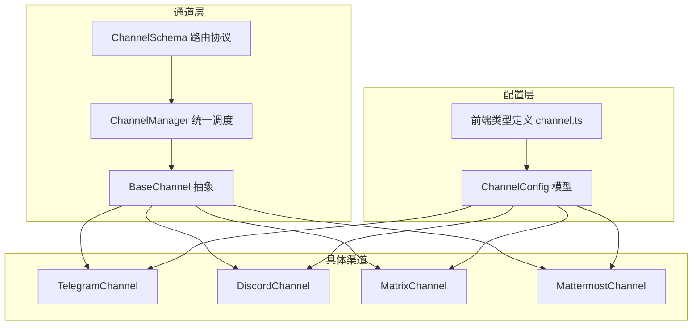
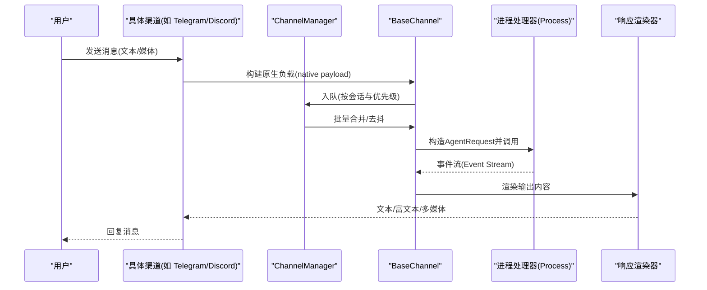
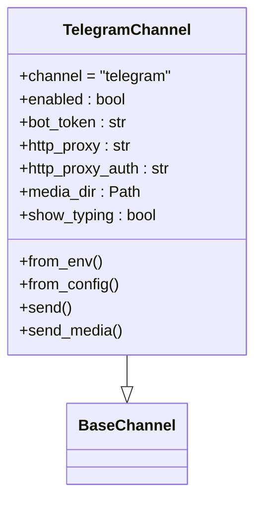
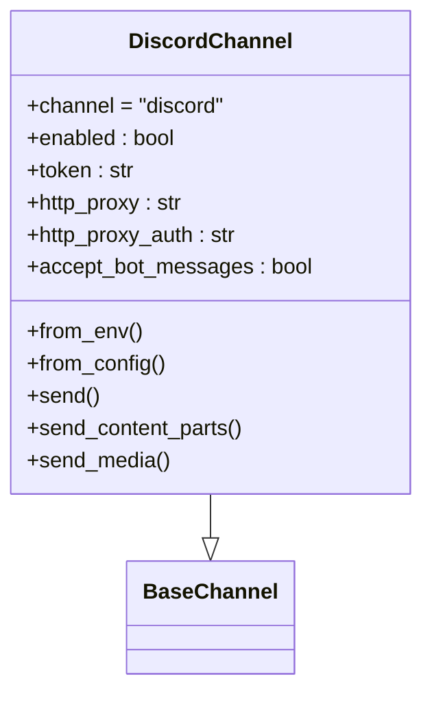
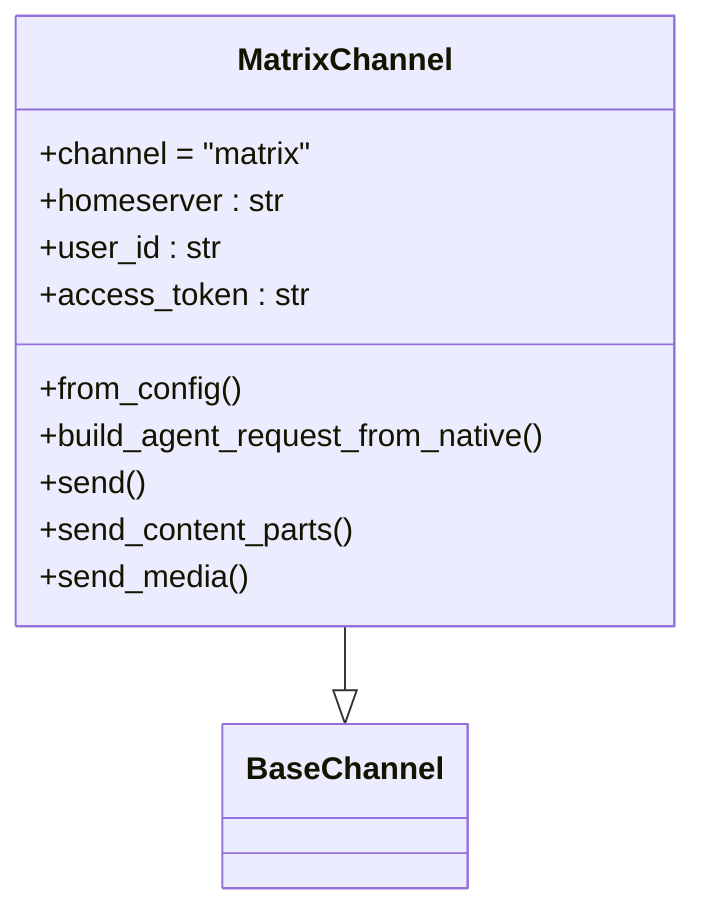
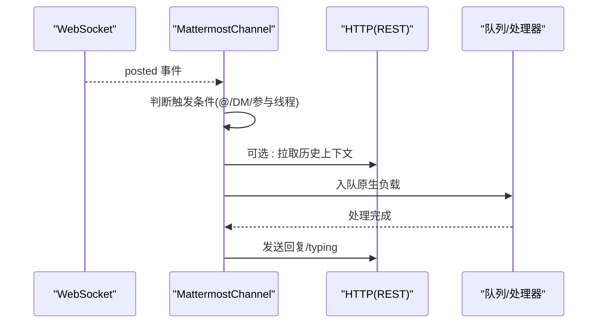
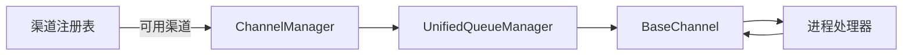

# 即时通讯渠道

<cite>
**本文引用的文件**
- [channels.en.md](file://website/public/docs/channels.en.md)
- [channel.ts](file://console/src/api/types/channel.ts)
- [base.py](file://src/copaw/app/channels/base.py)
- [manager.py](file://src/copaw/app/channels/manager.py)
- [telegram/channel.py](file://src/copaw/app/channels/telegram/channel.py)
- [discord_/channel.py](file://src/copaw/app/channels/discord_/channel.py)
- [matrix/channel.py](file://src/copaw/app/channels/matrix/channel.py)
- [mattermost/channel.py](file://src/copaw/app/channels/mattermost/channel.py)
- [config.py](file://src/copaw/config/config.py)
- [schema.py](file://src/copaw/app/channels/schema.py)
</cite>

## 目录
1. [简介](#简介)
2. [项目结构](#项目结构)
3. [核心组件](#核心组件)
4. [架构总览](#架构总览)
5. [详细组件分析](#详细组件分析)
6. [依赖分析](#依赖分析)
7. [性能考虑](#性能考虑)
8. [故障排除指南](#故障排除指南)
9. [结论](#结论)
10. [附录](#附录)

## 简介
本指南面向在生产环境中部署与运维 CoPaw 的工程团队，聚焦主流即时通讯渠道（Telegram、Discord、Matrix、Mattermost）的配置与使用。内容覆盖：
- 各平台机器人的创建与凭证获取
- 渠道配置项与环境变量映射
- 消息格式与多媒体内容处理策略
- 用户身份验证与访问控制
- 群组管理、私聊处理、消息转发等典型场景
- 网络配置、代理设置、SSL 证书等技术细节
- 常见问题定位与排障建议

## 项目结构
CoPaw 将“渠道”抽象为统一的通道层，通过 ChannelManager 统一调度，各具体渠道（Telegram、Discord、Matrix、Mattermost 等）实现各自的接收与发送逻辑，并复用统一的请求构建、渲染与队列机制。

图表来源
- [base.py:70-127](file://src/copaw/app/channels/base.py#L70-L127)
- [manager.py:68-106](file://src/copaw/app/channels/manager.py#L68-L106)
- [schema.py:30-48](file://src/copaw/app/channels/schema.py#L30-L48)
- [config.py:92-200](file://src/copaw/config/config.py#L92-L200)
- [channel.ts:70-82](file://console/src/api/types/channel.ts#L70-L82)

章节来源
- [base.py:70-127](file://src/copaw/app/channels/base.py#L70-L127)
- [manager.py:68-106](file://src/copaw/app/channels/manager.py#L68-L106)
- [schema.py:30-48](file://src/copaw/app/channels/schema.py#L30-L48)
- [config.py:92-200](file://src/copaw/config/config.py#L92-L200)
- [channel.ts:70-82](file://console/src/api/types/channel.ts#L70-L82)

## 核心组件
- BaseChannel：定义统一的消息解析、会话建模、内容渲染、去抖与队列合并、事件流与错误处理等通用能力。
- ChannelManager：负责通道实例化、统一队列与批处理、任务跟踪与取消、按会话隔离的并发控制。
- 具体渠道类：Telegram、Discord、Matrix、Mattermost 分别实现各自的接入方式（轮询/长连接/WebSocket）、消息解析、媒体下载/上传、会话标识与目标路由。
- 配置模型：Pydantic 模型定义各渠道字段、默认值与校验；前端类型定义与后端保持一致。
- 路由协议：ChannelAddress 统一发送目标路由，避免散落的 meta 字段。

章节来源
- [base.py:70-127](file://src/copaw/app/channels/base.py#L70-L127)
- [manager.py:68-106](file://src/copaw/app/channels/manager.py#L68-L106)
- [config.py:92-200](file://src/copaw/config/config.py#L92-L200)
- [schema.py:12-28](file://src/copaw/app/channels/schema.py#L12-L28)

## 架构总览
下图展示从消息进入、解析、入队、处理到回复的整体流程，以及各渠道的关键差异点。

图表来源
- [base.py:759-838](file://src/copaw/app/channels/base.py#L759-L838)
- [manager.py:39-66](file://src/copaw/app/channels/manager.py#L39-L66)
- [manager.py:362-446](file://src/copaw/app/channels/manager.py#L362-L446)

章节来源
- [base.py:759-838](file://src/copaw/app/channels/base.py#L759-L838)
- [manager.py:39-66](file://src/copaw/app/channels/manager.py#L39-L66)
- [manager.py:362-446](file://src/copaw/app/channels/manager.py#L362-L446)

## 详细组件分析

### Telegram 渠道
- 接入方式：基于 Bot API 的轮询与回调，支持代理与认证。
- 消息解析：识别文本、图片、视频、音频、文件等，自动下载媒体至本地目录。
- 会话建模：以 chat_id 作为会话键，支持主题线程（thread）上下文。
- 多媒体处理：根据大小限制进行分片或拒绝，错误分类提示。
- 访问控制：支持白名单/允许列表、@提及要求、打字指示。
- 配置项：bot_token、http_proxy、http_proxy_auth、show_typing、媒体目录等。

图表来源
- [telegram/channel.py:264-334](file://src/copaw/app/channels/telegram/channel.py#L264-L334)
- [base.py:70-127](file://src/copaw/app/channels/base.py#L70-L127)

章节来源
- [telegram/channel.py:264-334](file://src/copaw/app/channels/telegram/channel.py#L264-L334)
- [telegram/channel.py:456-527](file://src/copaw/app/channels/telegram/channel.py#L456-L527)
- [telegram/channel.py:599-770](file://src/copaw/app/channels/telegram/channel.py#L599-L770)
- [telegram/channel.py:771-800](file://src/copaw/app/channels/telegram/channel.py#L771-L800)

### Discord 渠道
- 接入方式：使用 discord.py 客户端，启用消息内容意图，支持代理与认证。
- 消息解析：识别文本与多种附件类型，自动去重与 @提及检测。
- 会话建模：区分私聊与群聊，会话键由频道/DM 与用户组合。
- 多媒体处理：支持图片/视频/音频/文件上传，自动分块与保留代码块边界。
- 访问控制：白名单/允许列表、@提及要求、可选接受其他机器人消息。
- 配置项：bot_token、http_proxy、http_proxy_auth、accept_bot_messages 等。

图表来源
- [discord_/channel.py:42-110](file://src/copaw/app/channels/discord_/channel.py#L42-L110)
- [base.py:70-127](file://src/copaw/app/channels/base.py#L70-L127)

章节来源
- [discord_/channel.py:42-110](file://src/copaw/app/channels/discord_/channel.py#L42-L110)
- [discord_/channel.py:275-337](file://src/copaw/app/channels/discord_/channel.py#L275-L337)
- [discord_/channel.py:432-572](file://src/copaw/app/channels/discord_/channel.py#L432-L572)

### Matrix 渠道
- 接入方式：基于 matrix-nio 的异步客户端，监听房间消息与媒体事件。
- 消息解析：支持文本与各类媒体，自动转换 mxc URL 为带令牌的 HTTP 下载地址。
- 会话建模：以房间 ID 为会话键，支持 @提及检测。
- 多媒体处理：支持上传并发送图片/视频/音频/文件，临时文件清理。
- 访问控制：白名单/允许列表、@提及要求。
- 配置项：homeserver、user_id、access_token 等。

图表来源
- [matrix/channel.py:45-86](file://src/copaw/app/channels/matrix/channel.py#L45-L86)
- [base.py:70-127](file://src/copaw/app/channels/base.py#L70-L127)

章节来源
- [matrix/channel.py:45-86](file://src/copaw/app/channels/matrix/channel.py#L45-L86)
- [matrix/channel.py:153-173](file://src/copaw/app/channels/matrix/channel.py#L153-L173)
- [matrix/channel.py:306-418](file://src/copaw/app/channels/matrix/channel.py#L306-L418)
- [matrix/channel.py:485-513](file://src/copaw/app/channels/matrix/channel.py#L485-L513)

### Mattermost 渠道
- 接入方式：WebSocket 实时事件 + REST API 回复，支持 typing 指示与线程上下文。
- 消息解析：识别文本与附件，按需拉取 DM/Thread 历史作为上下文补充。
- 会话建模：DM 使用频道 ID，Thread 使用 root_id，首次接触时拉取上下文。
- 多媒体处理：支持图片/音频/视频/文件下载，本地缓存与分发。
- 访问控制：白名单/允许列表、@提及要求、可选择“参与线程无需 @”。
- 配置项：url、bot_token、media_dir、show_typing、thread_follow_without_mention 等。

图表来源
- [mattermost/channel.py:461-572](file://src/copaw/app/channels/mattermost/channel.py#L461-L572)
- [mattermost/channel.py:666-765](file://src/copaw/app/channels/mattermost/channel.py#L666-L765)

章节来源
- [mattermost/channel.py:74-165](file://src/copaw/app/channels/mattermost/channel.py#L74-L165)
- [mattermost/channel.py:170-240](file://src/copaw/app/channels/mattermost/channel.py#L170-L240)
- [mattermost/channel.py:298-357](file://src/copaw/app/channels/mattermost/channel.py#L298-L357)
- [mattermost/channel.py:461-572](file://src/copaw/app/channels/mattermost/channel.py#L461-L572)
- [mattermost/channel.py:666-765](file://src/copaw/app/channels/mattermost/channel.py#L666-L765)

## 依赖分析
- 渠道注册与可用性：通过配置读取可用渠道集合，动态实例化对应通道。
- 统一队列与批处理：ChannelManager 对同会话消息进行批合并与去抖，提升吞吐与稳定性。
- 内容渲染与去噪：BaseChannel 提供统一的内容类型（文本/图片/视频/音频/文件/拒绝），并支持工具消息过滤与思考内容过滤。
- 路由协议：ChannelAddress 统一 kind/id/extra，简化发送目标解析。

图表来源
- [manager.py:108-213](file://src/copaw/app/channels/manager.py#L108-L213)
- [base.py:147-176](file://src/copaw/app/channels/base.py#L147-L176)
- [schema.py:12-28](file://src/copaw/app/channels/schema.py#L12-L28)

章节来源
- [manager.py:108-213](file://src/copaw/app/channels/manager.py#L108-L213)
- [base.py:147-176](file://src/copaw/app/channels/base.py#L147-L176)
- [schema.py:12-28](file://src/copaw/app/channels/schema.py#L12-L28)

## 性能考虑
- 去抖与批处理：对无文本的媒体消息进行缓冲合并，减少下游压力；同会话批量合并降低重复处理成本。
- 并发与限速：各渠道自行处理速率限制与网络异常（如 Telegram 的超时/限流、Discord 的分块与代理、Mattermost 的 WebSocket 重连与 typing 刷新）。
- 媒体处理：本地缓存与临时文件清理，避免重复下载；按平台限制进行分片与拒绝，保障稳定性。
- 会话隔离：按会话键隔离队列与任务，防止跨会话干扰。

章节来源
- [base.py:249-282](file://src/copaw/app/channels/base.py#L249-L282)
- [base.py:669-695](file://src/copaw/app/channels/base.py#L669-L695)
- [manager.py:39-66](file://src/copaw/app/channels/manager.py#L39-L66)
- [telegram/channel.py:528-548](file://src/copaw/app/channels/telegram/channel.py#L528-L548)
- [discord_/channel.py:358-430](file://src/copaw/app/channels/discord_/channel.py#L358-L430)
- [mattermost/channel.py:576-620](file://src/copaw/app/channels/mattermost/channel.py#L576-L620)

## 故障排除指南
- 代理与网络
  - Telegram：通过 http_proxy 与 http_proxy_auth 设置代理；若需鉴权，注意格式拼接。
  - Discord：通过 http_proxy 与 http_proxy_auth 设置代理；确保代理认证格式正确。
  - Mattermost：WebSocket 连接失败时检查 url 与 bot_token，关注重连延迟与日志。
- SSL 证书与域名
  - Matrix：确保 homeserver 地址可达且证书有效；mxc URL 转换需要 access_token。
  - Mattermost：确认 HTTPS 地址与证书链完整，WebSocket 与 REST API 均需可用。
- 权限与白名单
  - 各渠道均支持 dm_policy/group_policy 与 allow_from；未通过 ACL 的消息会被拒绝或提示。
- 媒体与大小限制
  - Telegram：超过上传上限会抛出错误并提示；请压缩或改用外部存储。
  - Discord：大文件上传失败时检查文件类型与大小限制。
  - Mattermost：下载失败时检查 file_ids 与权限。
- 重复消息与去重
  - Discord：内部维护已处理消息 ID 集合，避免重复处理。
- 控制命令与会话
  - BaseChannel 支持控制命令优先处理；会话键由渠道自定义（如 Mattermost 的 DM/Thread）。

章节来源
- [telegram/channel.py:344-361](file://src/copaw/app/channels/telegram/channel.py#L344-L361)
- [discord_/channel.py:99-108](file://src/copaw/app/channels/discord_/channel.py#L99-L108)
- [mattermost/channel.py:316-319](file://src/copaw/app/channels/mattermost/channel.py#L316-L319)
- [matrix/channel.py:88-101](file://src/copaw/app/channels/matrix/channel.py#L88-L101)
- [discord_/channel.py:119-133](file://src/copaw/app/channels/discord_/channel.py#L119-L133)
- [base.py:283-305](file://src/copaw/app/channels/base.py#L283-L305)

## 结论
通过统一的通道抽象与调度层，CoPaw 能够稳定地对接多个即时通讯平台。在实际部署中，建议：
- 明确各渠道的凭证与权限范围，优先使用白名单与 @提及策略；
- 合理配置代理与网络参数，确保 WebSocket/长连接与 REST API 可达；
- 关注媒体大小与分片策略，结合本地缓存优化性能；
- 借助统一队列与批处理机制，提升高并发下的稳定性与一致性。

## 附录

### 各平台配置要点与操作指引
- Telegram
  - 凭证：bot_token；可选 http_proxy/http_proxy_auth；可选 show_typing。
  - 功能：文本、图片、视频、音频、文件；媒体下载至本地目录；@提及与白名单控制。
  - 参考：[channels.en.md:724-730](file://website/public/docs/channels.en.md#L724-L730)
- Discord
  - 凭证：bot_token；可选 http_proxy/http_proxy_auth；可选 accept_bot_messages。
  - 功能：文本、图片、视频、音频、文件；分块与保留代码块；@提及与白名单控制。
  - 参考：[channels.en.md:1056-1058](file://website/public/docs/channels.en.md#L1056-L1058)
- Matrix
  - 凭证：homeserver、user_id、access_token。
  - 功能：文本、图片、视频、音频、文件；mxc URL 转换与令牌下载。
  - 参考：[channels.en.md](file://website/public/docs/channels.en.md#L1060)
- Mattermost
  - 凭证：url、bot_token；可选 media_dir、show_typing、thread_follow_without_mention。
  - 功能：WebSocket 事件 + REST API；typing 指示；线程上下文拉取；附件下载。
  - 参考：[channels.en.md:733-742](file://website/public/docs/channels.en.md#L733-L742)

章节来源
- [channels.en.md:724-730](file://website/public/docs/channels.en.md#L724-L730)
- [channels.en.md:1056-1058](file://website/public/docs/channels.en.md#L1056-L1058)
- [channels.en.md:1060](file://website/public/docs/channels.en.md#L1060)
- [channels.en.md:733-742](file://website/public/docs/channels.en.md#L733-L742)

### 配置模型与前端类型
- 后端模型：各渠道配置继承 BaseChannelConfig，包含 enabled、bot_prefix、dm_policy、group_policy、allow_from、deny_message、require_mention 等通用字段。
- 前端类型：与后端保持一致，确保 Console 前端与后端配置同步。

章节来源
- [config.py:92-200](file://src/copaw/config/config.py#L92-L200)
- [channel.ts:70-82](file://console/src/api/types/channel.ts#L70-L82)