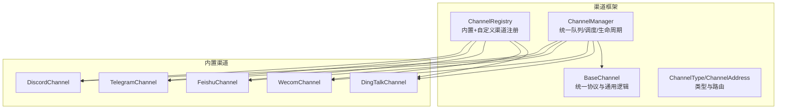
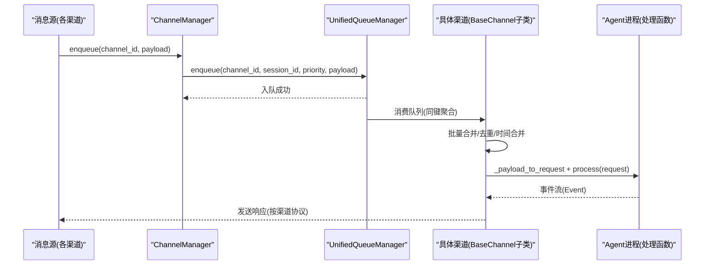
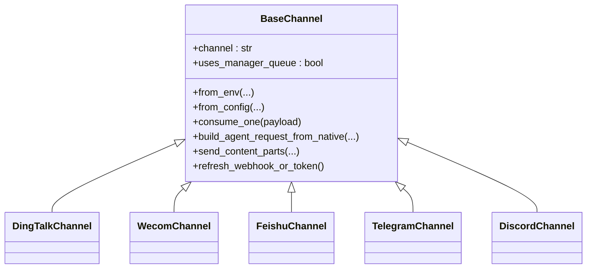
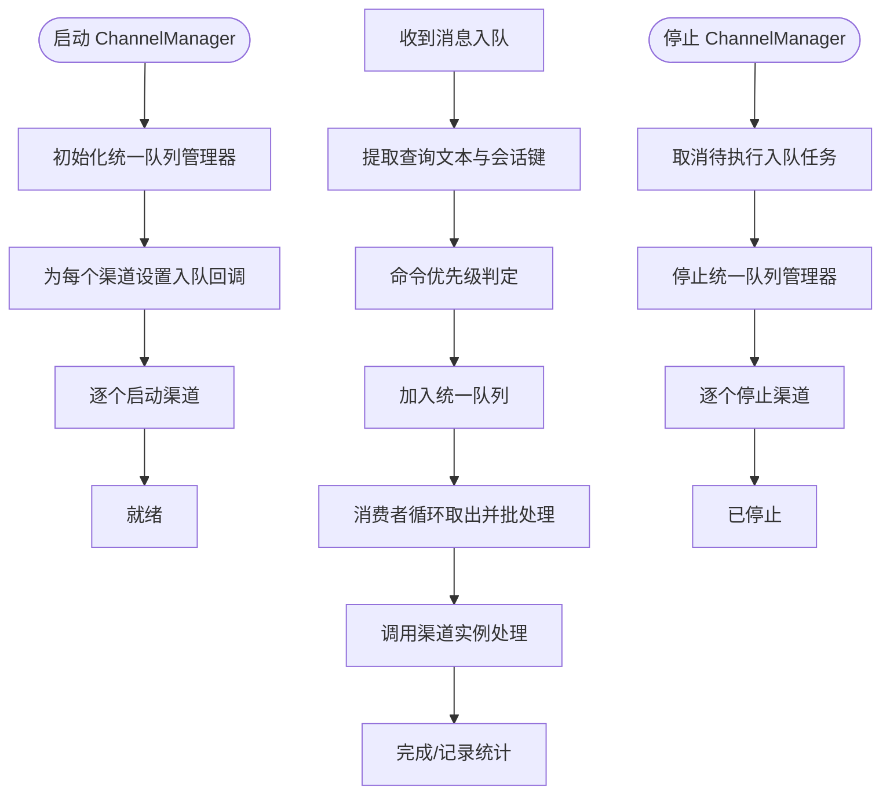
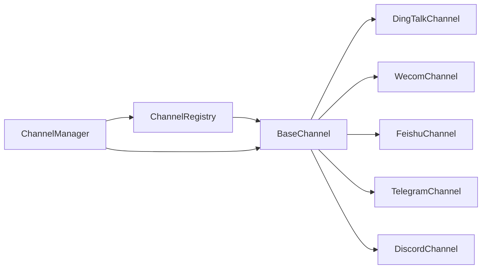

# 渠道集成

<cite>
**本文引用的文件**
- [src/copaw/app/channels/__init__.py](file://src/copaw/app/channels/__init__.py)
- [src/copaw/app/channels/base.py](file://src/copaw/app/channels/base.py)
- [src/copaw/app/channels/manager.py](file://src/copaw/app/channels/manager.py)
- [src/copaw/app/channels/registry.py](file://src/copaw/app/channels/registry.py)
- [src/copaw/app/channels/schema.py](file://src/copaw/app/channels/schema.py)
- [src/copaw/app/channels/dingtalk/channel.py](file://src/copaw/app/channels/dingtalk/channel.py)
- [src/copaw/app/channels/wecom/channel.py](file://src/copaw/app/channels/wecom/channel.py)
- [src/copaw/app/channels/feishu/channel.py](file://src/copaw/app/channels/feishu/channel.py)
- [src/copaw/app/channels/telegram/channel.py](file://src/copaw/app/channels/telegram/channel.py)
- [src/copaw/app/channels/discord_/channel.py](file://src/copaw/app/channels/discord_/channel.py)
</cite>

## 目录
1. [简介](#简介)
2. [项目结构](#项目结构)
3. [核心组件](#核心组件)
4. [架构总览](#架构总览)
5. [详细组件分析](#详细组件分析)
6. [依赖关系分析](#依赖关系分析)
7. [性能与并发特性](#性能与并发特性)
8. [运维与排障指南](#运维与排障指南)
9. [结论](#结论)
10. [附录：各渠道配置与使用要点](#附录各渠道配置与使用要点)

## 简介
本指南面向需要在系统中集成多种即时通讯渠道（如钉钉、企业微信、飞书、Telegram、Discord 等）的用户与运维人员。内容涵盖渠道的添加、配置、启动与停止、消息格式转换、媒体资源处理、状态监控、消息历史查询、群组管理、多渠道消息同步与转发规则、优先级设置、故障诊断、网络代理与安全策略等。

## 项目结构
渠道子系统位于应用层的 channels 包内，采用“统一基类 + 多实现 + 注册表 + 管理器”的分层设计：
- 基类定义统一的消息收发协议与通用能力（会话、去重、时间合并、渲染、控制命令识别等）
- 各渠道实现各自的消息解析、发送与生命周期管理
- 注册表负责内置与自定义渠道的发现与加载
- 管理器负责统一队列、批处理、优先级调度与任务跟踪

**图表来源**
- [src/copaw/app/channels/base.py](file://src/copaw/app/channels/base.py)
- [src/copaw/app/channels/schema.py](file://src/copaw/app/channels/schema.py)
- [src/copaw/app/channels/registry.py](file://src/copaw/app/channels/registry.py)
- [src/copaw/app/channels/manager.py](file://src/copaw/app/channels/manager.py)
- [src/copaw/app/channels/dingtalk/channel.py](file://src/copaw/app/channels/dingtalk/channel.py)
- [src/copaw/app/channels/wecom/channel.py](file://src/copaw/app/channels/wecom/channel.py)
- [src/copaw/app/channels/feishu/channel.py](file://src/copaw/app/channels/feishu/channel.py)
- [src/copaw/app/channels/telegram/channel.py](file://src/copaw/app/channels/telegram/channel.py)
- [src/copaw/app/channels/discord_/channel.py](file://src/copaw/app/channels/discord_/channel.py)

**章节来源**
- [src/copaw/app/channels/__init__.py](file://src/copaw/app/channels/__init__.py)
- [src/copaw/app/channels/registry.py](file://src/copaw/app/channels/registry.py)
- [src/copaw/app/channels/manager.py](file://src/copaw/app/channels/manager.py)

## 核心组件
- BaseChannel：抽象出渠道的统一协议，包括消息构建、会话解析、去重、时间合并、渲染、事件流、错误处理、工作区注入、控制命令识别等
- ChannelManager：统一队列、批处理、优先级调度、生命周期管理；负责将消息入队、合并、投递给对应渠道实例
- ChannelRegistry：内置渠道清单与自定义渠道发现；支持按可用性过滤与懒加载
- ChannelType/ChannelAddress：统一的渠道类型标识与路由句柄，便于跨渠道发送与管理

**章节来源**
- [src/copaw/app/channels/base.py](file://src/copaw/app/channels/base.py)
- [src/copaw/app/channels/manager.py](file://src/copaw/app/channels/manager.py)
- [src/copaw/app/channels/registry.py](file://src/copaw/app/channels/registry.py)
- [src/copaw/app/channels/schema.py](file://src/copaw/app/channels/schema.py)

## 架构总览
下图展示了从消息进入、统一队列、批处理合并、到具体渠道消费与回复的完整流程。

**图表来源**
- [src/copaw/app/channels/manager.py](file://src/copaw/app/channels/manager.py)
- [src/copaw/app/channels/base.py](file://src/copaw/app/channels/base.py)

## 详细组件分析

### 统一基类：BaseChannel
- 职责
  - 定义统一的消息构建与发送协议
  - 提供会话解析、去重、时间合并、渲染样式控制
  - 支持控制命令识别与直通路径
  - 提供工作区注入、任务跟踪、错误处理与回调
- 关键机制
  - 会话键生成与去重：通过 resolve_session_id 与 get_debounce_key 实现
  - 时间合并：对同一会话的多个原生负载进行合并，减少重复发送
  - 控制命令：通过 CommandRegistry 识别并绕过队列直接处理
  - 事件流：_stream_with_tracker 将 AgentResponse 序列化为 SSE 风格事件
- 可扩展点
  - from_env/from_config：从环境变量或配置对象创建实例
  - build_agent_request_from_native：将渠道原生消息转为统一请求
  - send_content_parts/send_event：按渠道协议发送响应

**图表来源**
- [src/copaw/app/channels/base.py](file://src/copaw/app/channels/base.py)
- [src/copaw/app/channels/dingtalk/channel.py](file://src/copaw/app/channels/dingtalk/channel.py)
- [src/copaw/app/channels/wecom/channel.py](file://src/copaw/app/channels/wecom/channel.py)
- [src/copaw/app/channels/feishu/channel.py](file://src/copaw/app/channels/feishu/channel.py)
- [src/copaw/app/channels/telegram/channel.py](file://src/copaw/app/channels/telegram/channel.py)
- [src/copaw/app/channels/discord_/channel.py](file://src/copaw/app/channels/discord_/channel.py)

**章节来源**
- [src/copaw/app/channels/base.py](file://src/copaw/app/channels/base.py)

### 渠道管理器：ChannelManager
- 职责
  - 统一初始化与启动/停止所有渠道
  - 维护统一队列与消费者循环，支持批处理与优先级
  - 提供发送接口（文本/事件），自动注入会话与前缀
  - 提供替换单个渠道的能力（热更新）
- 关键流程
  - 初始化：从注册表与可用渠道列表创建渠道实例
  - 启动：初始化统一队列管理器，为每个渠道设置入队回调并启动
  - 入队：提取查询文本确定优先级，归并 session_id，入队
  - 消费：按键聚合，批量合并，调用渠道实例的 _consume_one_request
  - 停止：取消待执行入队任务，停止队列与渠道

**图表来源**
- [src/copaw/app/channels/manager.py](file://src/copaw/app/channels/manager.py)

**章节来源**
- [src/copaw/app/channels/manager.py](file://src/copaw/app/channels/manager.py)

### 渠道注册表：ChannelRegistry
- 职责
  - 内置渠道清单（如钉钉、企业微信、飞书、Telegram、Discord 等）
  - 自定义渠道扫描与注册（CUSTOM_CHANNELS_DIR）
  - 缓存与懒加载，失败不影响启动（可配置必载项）
- 特性
  - 必载渠道失败时抛出异常
  - 自定义路由钩子（register_app_routes）挂载到主应用，确保 /api 前缀

**章节来源**
- [src/copaw/app/channels/registry.py](file://src/copaw/app/channels/registry.py)

### 渠道类型与路由：ChannelType/ChannelAddress
- ChannelType：字符串类型，允许插件自定义渠道键
- ChannelAddress：统一路由模型，包含 kind/id/extra，支持 to_handle 生成
- 作用：跨渠道发送与管理的基础数据结构

**章节来源**
- [src/copaw/app/channels/schema.py](file://src/copaw/app/channels/schema.py)

### 钉钉渠道：DingTalkChannel
- 连接与认证
  - 使用钉钉 Stream 客户端，支持机器人密钥与卡片模板
  - 支持会话 Webhook 主动发送，存储会话键以便后续推送
- 消息与媒体
  - 支持文本、Markdown、富文本卡片
  - 支持图片、文件上传与本地缓存目录
  - 去重基于消息 ID，时间合并关闭（由管理器合并）
- 会话与转发
  - 会话键短化，便于请求与定时任务使用
  - 支持通过 sessionWebhook 进行主动推送

**章节来源**
- [src/copaw/app/channels/dingtalk/channel.py](file://src/copaw/app/channels/dingtalk/channel.py)

### 企业微信渠道：WecomChannel
- 连接与认证
  - 使用 aibot WebSocket SDK，支持长连接接收与流式回复
  - 支持欢迎语、媒体目录、最大重连次数
- 消息与媒体
  - 支持文本、图片、语音、文件、混合消息
  - 上传采用分片协议，带超时与 ACK 机制
  - 媒体下载与压缩优化
- 会话与转发
  - 单聊与群聊会话键区分
  - 去重基于有序消息 ID 列表

**章节来源**
- [src/copaw/app/channels/wecom/channel.py](file://src/copaw/app/channels/wecom/channel.py)

### 飞书渠道：FeishuChannel
- 连接与认证
  - 使用 lark-oapi WebSocket 接收事件，Open API 发送
  - 支持加密密钥、验证令牌、域名选择
- 消息与媒体
  - 支持文本、图片、文件
  - 媒体大小限制、昵称缓存、过期消息阈值
- 会话与转发
  - 会话键包含 chat_id/open_id，首条消息写入 chat_id/message_id 用于下游去重

**章节来源**
- [src/copaw/app/channels/feishu/channel.py](file://src/copaw/app/channels/feishu/channel.py)

### Telegram 渠道：TelegramChannel
- 连接与认证
  - Bot API + 轮询，支持代理与重连退避
- 消息与媒体
  - 文本、图片、视频、音频、文件
  - 消息长度与文件大小限制，HTML/Markdown 转换
  - 文件下载到本地媒体目录，避免泄露 Token
- 会话与转发
  - 通过 chat_id 识别会话
  - 支持提及模式与命令识别

**章节来源**
- [src/copaw/app/channels/telegram/channel.py](file://src/copaw/app/channels/telegram/channel.py)

### Discord 渠道：DiscordChannel
- 连接与认证
  - 使用 discord.py 客户端，启用所需 Intents
  - 支持 HTTP 代理与认证
- 消息与媒体
  - 文本、图片、视频、音频、文件
  - 代码块识别、长度限制、消息 ID 去重
- 会话与转发
  - 通过消息 ID 去重，支持提及与角色提及

**章节来源**
- [src/copaw/app/channels/discord_/channel.py](file://src/copaw/app/channels/discord_/channel.py)

## 依赖关系分析
- 渠道实现均继承 BaseChannel，遵循统一协议
- ChannelManager 依赖注册表与统一队列，负责生命周期与调度
- 各渠道内部依赖第三方 SDK 或 API（如 dingtalk_stream、lark_oapi、aibot、python-telegram-bot、discord.py）

**图表来源**
- [src/copaw/app/channels/base.py](file://src/copaw/app/channels/base.py)
- [src/copaw/app/channels/registry.py](file://src/copaw/app/channels/registry.py)
- [src/copaw/app/channels/manager.py](file://src/copaw/app/channels/manager.py)

**章节来源**
- [src/copaw/app/channels/registry.py](file://src/copaw/app/channels/registry.py)
- [src/copaw/app/channels/manager.py](file://src/copaw/app/channels/manager.py)

## 性能与并发特性
- 统一队列与批处理
  - ChannelManager 使用 UnifiedQueueManager 对同键消息进行批处理，降低发送频率与 API 调用开销
  - 批处理逻辑在 _process_batch 中实现，先合并原生负载，再调用渠道实例
- 优先级调度
  - 基于 CommandRegistry 的命令识别，将控制命令提升优先级，绕过队列直通处理
- 时间合并与去重
  - BaseChannel 提供时间合并与去重机制，避免抖动与重复处理
- 并发与锁
  - 各渠道内部使用线程/事件循环与锁保护共享状态（如会话 Webhook、上传 ACK、消息 ID 去重）

**章节来源**
- [src/copaw/app/channels/manager.py](file://src/copaw/app/channels/manager.py)
- [src/copaw/app/channels/base.py](file://src/copaw/app/channels/base.py)

## 运维与排障指南
- 启停与替换
  - 使用 ChannelManager.start_all()/stop_all() 管理生命周期
  - 使用 replace_channel() 在不中断其他渠道的情况下热替换单个渠道
- 队列清理
  - clear_queue() 可清理指定键的队列，便于故障恢复
- 错误处理
  - BaseChannel 的事件流封装了异常捕获与日志记录，便于定位问题
  - 各渠道在发送/接收过程中对常见异常（如网络、权限、限流）有相应处理
- 日志与可观测性
  - 关键路径均有调试/警告/异常日志输出，建议结合系统日志集中收集
- 网络与代理
  - Telegram/Discord 渠道支持 HTTP 代理与认证
  - 飞书/钉钉等渠道涉及公网访问与回调，需确保防火墙与域名解析正常
- 安全与鉴权
  - 各渠道的密钥与令牌通过 from_env/from_config 注入，避免硬编码
  - Telegram 下载文件时避免暴露 Token，使用本地缓存目录

**章节来源**
- [src/copaw/app/channels/manager.py](file://src/copaw/app/channels/manager.py)
- [src/copaw/app/channels/base.py](file://src/copaw/app/channels/base.py)
- [src/copaw/app/channels/telegram/channel.py](file://src/copaw/app/channels/telegram/channel.py)
- [src/copaw/app/channels/discord_/channel.py](file://src/copaw/app/channels/discord_/channel.py)
- [src/copaw/app/channels/feishu/channel.py](file://src/copaw/app/channels/feishu/channel.py)
- [src/copaw/app/channels/dingtalk/channel.py](file://src/copaw/app/channels/dingtalk/channel.py)

## 结论
该渠道集成体系通过统一基类与管理器，实现了多渠道的一致接入与高效调度。内置渠道覆盖主流 IM 平台，具备完善的认证、消息格式转换、媒体处理、会话与去重、优先级与批处理等能力。配合统一队列与工作区集成，可满足企业级的多渠道协同与运维需求。

## 附录：各渠道配置与使用要点
- 渠道启用与禁用
  - 通过配置对象中的 enabled 字段控制是否启用
- 认证参数
  - 钉钉：client_id/client_secret、robot_code、bot_prefix
  - 企业微信：bot_id/secret、media_dir、welcome_text
  - 飞书：app_id/app_secret、encrypt_key/verification_token、domain
  - Telegram：bot_token、http_proxy/proxy_auth、media_dir
  - Discord：token、http_proxy/proxy_auth、accept_bot_messages
- 消息与媒体
  - 各渠道均支持文本与多种媒体类型；注意平台限制（长度、大小、格式）
- 会话与转发
  - 通过 session_id/会话键区分对话；部分渠道支持主动推送（如钉钉 Webhook）
- 控制命令与优先级
  - 通过命令识别提升控制命令优先级，绕过队列直通处理
- 环境变量
  - 各渠道支持 from_env，便于容器化部署与动态配置

**章节来源**
- [src/copaw/app/channels/dingtalk/channel.py](file://src/copaw/app/channels/dingtalk/channel.py)
- [src/copaw/app/channels/wecom/channel.py](file://src/copaw/app/channels/wecom/channel.py)
- [src/copaw/app/channels/feishu/channel.py](file://src/copaw/app/channels/feishu/channel.py)
- [src/copaw/app/channels/telegram/channel.py](file://src/copaw/app/channels/telegram/channel.py)
- [src/copaw/app/channels/discord_/channel.py](file://src/copaw/app/channels/discord_/channel.py)