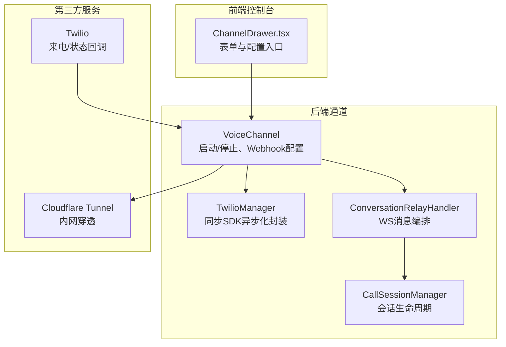
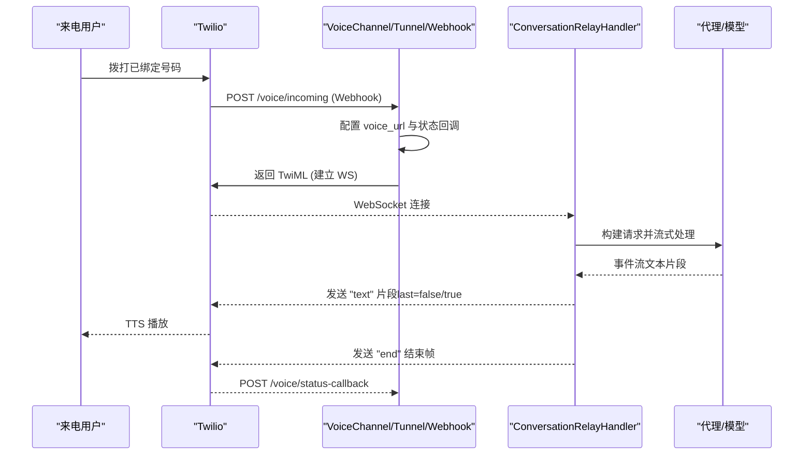
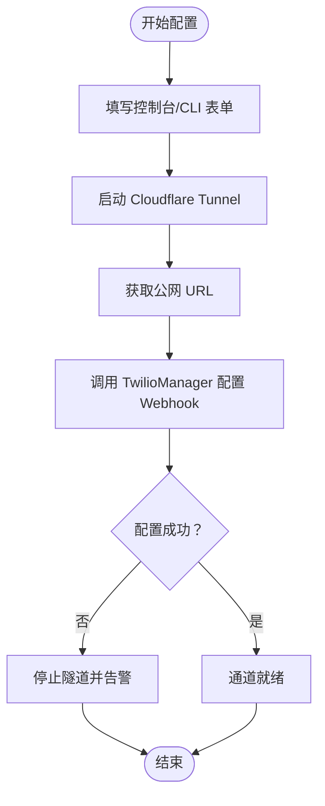
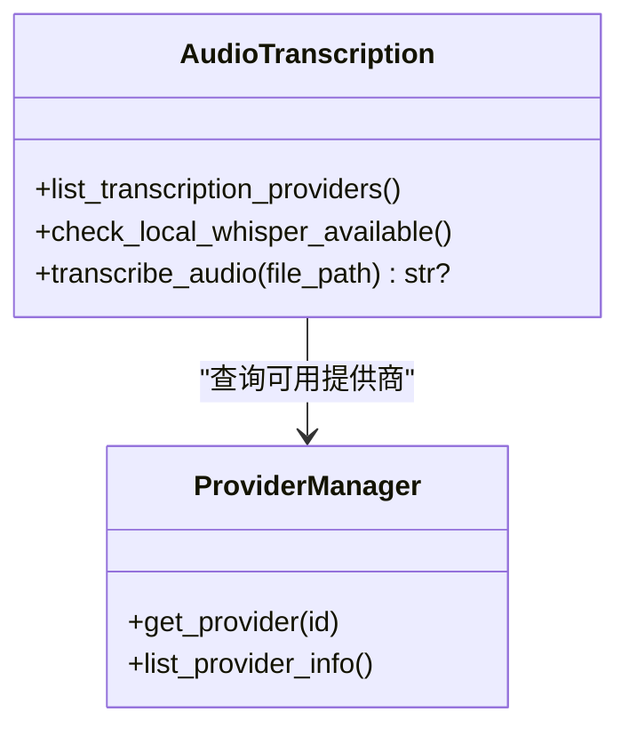
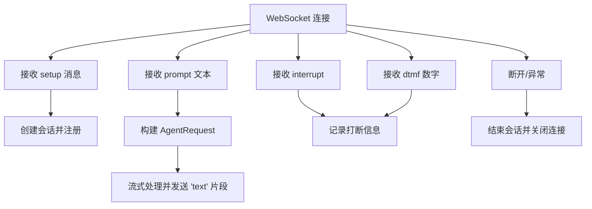
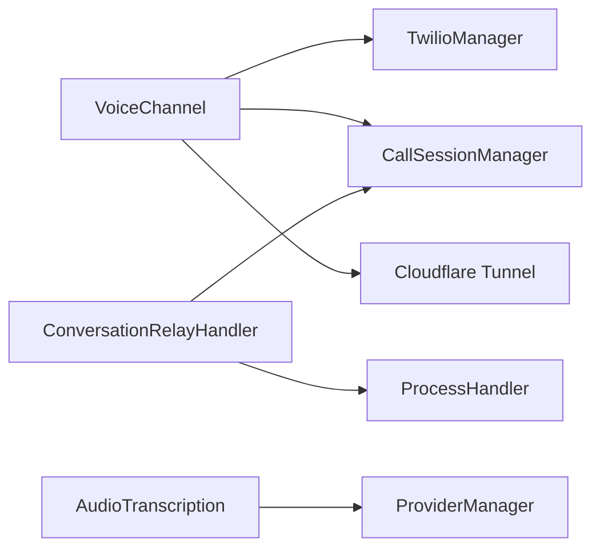

# 语音通话渠道

<cite>
**本文引用的文件**
- [voice/channel.py](file://src/copaw/app/channels/voice/channel.py)
- [voice/twilio_manager.py](file://src/copaw/app/channels/voice/twilio_manager.py)
- [voice/session.py](file://src/copaw/app/channels/voice/session.py)
- [voice/conversation_relay.py](file://src/copaw/app/channels/voice/conversation_relay.py)
- [channels/en.md](file://website/public/docs/channels.en.md)
- [channels_cmd.py](file://src/copaw/cli/channels_cmd.py)
- [ChannelDrawer.tsx](file://console/src/pages/Control/Channels/components/ChannelDrawer.tsx)
- [audio_transcription.py](file://src/copaw/agents/utils/audio_transcription.py)
- [provider_manager.py](file://src/copaw/providers/provider_manager.py)
</cite>

## 目录
1. [简介](#简介)
2. [项目结构](#项目结构)
3. [核心组件](#核心组件)
4. [架构总览](#架构总览)
5. [详细组件分析](#详细组件分析)
6. [依赖关系分析](#依赖关系分析)
7. [性能与质量优化](#性能与质量优化)
8. [故障排查指南](#故障排查指南)
9. [结论](#结论)
10. [附录](#附录)

## 简介
本指南面向在 CoPaw 中启用与使用“语音通话渠道”的工程与运营人员，覆盖以下主题：
- 电话号码绑定与 Twilio 配置
- 语音网关（Cloudflare Tunnel）与 Webhook 暴露
- 语音转文字（STT）与文字转语音（TTS）能力接入
- 多方通话与会话管理
- 通话质量优化、网络延迟处理与音频编码建议
- 安全与合规：密钥管理、传输加密与数据保护

## 项目结构
语音通话渠道由后端通道模块、前端控制台与命令行工具协同组成，并通过第三方服务（Twilio、Cloudflare Tunnel）完成公网可达与通话编排。

图表来源
- [voice/channel.py:81-136](file://src/copaw/app/channels/voice/channel.py#L81-L136)
- [voice/twilio_manager.py:31-57](file://src/copaw/app/channels/voice/twilio_manager.py#L31-L57)
- [voice/conversation_relay.py:60-102](file://src/copaw/app/channels/voice/conversation_relay.py#L60-L102)
- [voice/session.py:28-73](file://src/copaw/app/channels/voice/session.py#L28-L73)

章节来源
- [voice/channel.py:81-136](file://src/copaw/app/channels/voice/channel.py#L81-L136)
- [voice/twilio_manager.py:31-57](file://src/copaw/app/channels/voice/twilio_manager.py#L31-L57)
- [voice/conversation_relay.py:60-102](file://src/copaw/app/channels/voice/conversation_relay.py#L60-L102)
- [voice/session.py:28-73](file://src/copaw/app/channels/voice/session.py#L28-L73)

## 核心组件
- 语音通道（VoiceChannel）
  - 负责启动/停止通道、配置 Twilio Webhook、管理 Cloudflare Tunnel、生成一次性 WebSocket 认证令牌、派发文本到活跃会话。
- Twilio 管理器（TwilioManager）
  - 将 Twilio 同步 SDK 包装为异步调用，更新来电号码的 voice_url 与状态回调。
- 会话管理（CallSessionManager）
  - 维护活跃会话集合，记录来电主被叫号码、开始时间与状态。
- 通话中继处理器（ConversationRelayHandler）
  - 通过 WebSocket 接收 Twilio 的“setup/prompt/interrupt/dtmf”消息，构建 AgentRequest 并流式回传 TTS 文本；支持中断与按键事件处理。
- 前端控制台与命令行
  - 控制台表单填写 Twilio 凭据、号码与 TTS/STT 提供商；CLI 支持交互式配置。

章节来源
- [voice/channel.py:17-240](file://src/copaw/app/channels/voice/channel.py#L17-L240)
- [voice/twilio_manager.py:12-58](file://src/copaw/app/channels/voice/twilio_manager.py#L12-L58)
- [voice/session.py:16-73](file://src/copaw/app/channels/voice/session.py#L16-L73)
- [voice/conversation_relay.py:29-289](file://src/copaw/app/channels/voice/conversation_relay.py#L29-L289)
- [ChannelDrawer.tsx:611-643](file://console/src/pages/Control/Channels/components/ChannelDrawer.tsx#L611-L643)
- [channels_cmd.py:532-576](file://src/copaw/cli/channels_cmd.py#L532-L576)

## 架构总览
语音通话从外部来电开始，经由 Twilio 回调至 CoPaw 的 Webhook，再通过 WebSocket 进入 ConversationRelay 流水线，最终由代理模型生成文本并回传 Twilio 播放。

图表来源
- [voice/channel.py:115-136](file://src/copaw/app/channels/voice/channel.py#L115-L136)
- [voice/conversation_relay.py:185-226](file://src/copaw/app/channels/voice/conversation_relay.py#L185-L226)
- [channels/en.md:968-1046](file://website/public/docs/channels.en.md#L968-L1046)

章节来源
- [voice/channel.py:115-136](file://src/copaw/app/channels/voice/channel.py#L115-L136)
- [voice/conversation_relay.py:185-226](file://src/copaw/app/channels/voice/conversation_relay.py#L185-L226)
- [channels/en.md:968-1046](file://website/public/docs/channels.en.md#L968-L1046)

## 详细组件分析

### 1) 电话号码绑定与 Twilio 配置
- 控制台表单字段
  - Twilio Account SID、Twilio Auth Token、Phone Number、Phone Number SID、TTS Provider、TTS Voice、STT Provider、Language、Welcome Greeting 等。
- CLI 交互式配置
  - 支持逐项输入 Account SID、Auth Token、号码与 SID，以及 TTS/STT 设置。
- Webhook 配置
  - 启动时通过 TwilioManager 更新 incoming_phone_numbers 的 voice_url 与 status_callback，确保 Twilio 能回调到当前公网地址。

图表来源
- [ChannelDrawer.tsx:611-643](file://console/src/pages/Control/Channels/components/ChannelDrawer.tsx#L611-L643)
- [channels_cmd.py:532-576](file://src/copaw/cli/channels_cmd.py#L532-L576)
- [voice/channel.py:100-136](file://src/copaw/app/channels/voice/channel.py#L100-L136)
- [voice/twilio_manager.py:31-57](file://src/copaw/app/channels/voice/twilio_manager.py#L31-L57)

章节来源
- [ChannelDrawer.tsx:611-643](file://console/src/pages/Control/Channels/components/ChannelDrawer.tsx#L611-L643)
- [channels_cmd.py:532-576](file://src/copaw/cli/channels_cmd.py#L532-L576)
- [voice/channel.py:100-136](file://src/copaw/app/channels/voice/channel.py#L100-L136)
- [voice/twilio_manager.py:31-57](file://src/copaw/app/channels/voice/twilio_manager.py#L31-L57)

### 2) 语音网关与内网穿透
- 使用 Cloudflare Tunnel 将本地服务暴露到公网，确保 Twilio 可以访问 /voice/incoming 与 /voice/status-callback。
- VoiceChannel 在启动时读取本地监听端口，创建隧道并返回 public_url 与 WSS URL，用于 WebSocket 连接。

章节来源
- [voice/channel.py:100-136](file://src/copaw/app/channels/voice/channel.py#L100-L136)
- [channels/en.md:944-967](file://website/public/docs/channels.en.md#L944-L967)

### 3) 语音转文字（STT）与文字转语音（TTS）
- STT（语音转文字）
  - 通过音频转写工具链支持本地 Whisper 与远端 Whisper API 两种模式，结合 ProviderManager 管理可用提供商。
  - 默认关闭，需显式开启并选择提供商。
- TTS（文字转语音）
  - 通过 ConversationRelayHandler 将代理输出的文本片段发送给 Twilio，由 Twilio 播放。
  - 控制台/CLI 提供 TTS Provider 与 TTS Voice 配置项。

图表来源
- [audio_transcription.py:87-147](file://src/copaw/agents/utils/audio_transcription.py#L87-L147)
- [audio_transcription.py:295-317](file://src/copaw/agents/utils/audio_transcription.py#L295-L317)
- [provider_manager.py:736-751](file://src/copaw/providers/provider_manager.py#L736-L751)

章节来源
- [audio_transcription.py:87-147](file://src/copaw/agents/utils/audio_transcription.py#L87-L147)
- [audio_transcription.py:295-317](file://src/copaw/agents/utils/audio_transcription.py#L295-L317)
- [provider_manager.py:736-751](file://src/copaw/providers/provider_manager.py#L736-L751)
- [ChannelDrawer.tsx:633-643](file://console/src/pages/Control/Channels/components/ChannelDrawer.tsx#L633-L643)

### 4) 通话中继与会话管理
- ConversationRelayHandler
  - 处理 setup/prompt/interrupt/dtmf 等消息类型，构建 AgentRequest 并流式发送文本片段。
  - 对异常进行捕获与降级，必要时发送错误提示并结束连接。
- CallSessionManager
  - 创建/维护/结束会话，记录 call_sid、主被叫号码与状态，便于统计与清理。

图表来源
- [voice/conversation_relay.py:103-163](file://src/copaw/app/channels/voice/conversation_relay.py#L103-L163)
- [voice/conversation_relay.py:185-226](file://src/copaw/app/channels/voice/conversation_relay.py#L185-L226)
- [voice/session.py:34-73](file://src/copaw/app/channels/voice/session.py#L34-L73)

章节来源
- [voice/conversation_relay.py:103-163](file://src/copaw/app/channels/voice/conversation_relay.py#L103-L163)
- [voice/conversation_relay.py:185-226](file://src/copaw/app/channels/voice/conversation_relay.py#L185-L226)
- [voice/session.py:34-73](file://src/copaw/app/channels/voice/session.py#L34-L73)

### 5) 多方通话与并发处理
- 当前实现基于每通电话独立的 WebSocket 会话与 ConversationRelayHandler，不采用统一队列。
- 会话管理器维护活跃会话列表，停止通道时逐一关闭活动会话并释放资源。

章节来源
- [voice/channel.py:26](file://src/copaw/app/channels/voice/channel.py#L26)
- [voice/channel.py:138-157](file://src/copaw/app/channels/voice/channel.py#L138-L157)
- [voice/session.py:65-73](file://src/copaw/app/channels/voice/session.py#L65-L73)

## 依赖关系分析
- 组件耦合
  - VoiceChannel 依赖 TwilioManager、CloudflareTunnelDriver 与 CallSessionManager。
  - ConversationRelayHandler 依赖 ProcessHandler 与 CallSessionManager。
- 外部依赖
  - Twilio SDK（同步）、Cloudflare Tunnel 客户端、可选的本地 Whisper 与远端 Whisper API。
- 安全与密钥
  - 控制台/CLI 输入的 Twilio 凭据与号码 SID 存储于配置中，应配合密钥存储与最小权限原则使用。

图表来源
- [voice/channel.py:100-136](file://src/copaw/app/channels/voice/channel.py#L100-L136)
- [voice/conversation_relay.py:44-54](file://src/copaw/app/channels/voice/conversation_relay.py#L44-L54)
- [audio_transcription.py:71-79](file://src/copaw/agents/utils/audio_transcription.py#L71-L79)
- [provider_manager.py:670-732](file://src/copaw/providers/provider_manager.py#L670-L732)

章节来源
- [voice/channel.py:100-136](file://src/copaw/app/channels/voice/channel.py#L100-L136)
- [voice/conversation_relay.py:44-54](file://src/copaw/app/channels/voice/conversation_relay.py#L44-L54)
- [audio_transcription.py:71-79](file://src/copaw/agents/utils/audio_transcription.py#L71-L79)
- [provider_manager.py:670-732](file://src/copaw/providers/provider_manager.py#L670-L732)

## 性能与质量优化
- 网络与延迟
  - 使用稳定的内网穿透方案（如 Cloudflare Tunnel），避免频繁重连。
  - WebSocket 连接失败时及时关闭并清理会话，减少资源占用。
- 语音转文字
  - 优先使用本地 Whisper 降低网络抖动影响；若需高准确率可切换远端 Whisper API。
  - 合理设置超时与重试策略，避免阻塞代理响应。
- 文字转语音
  - 控制文本分片大小，确保 last=true 的标记及时触发播放，减少等待。
  - 选择低延迟的 TTS 提供商与合适的声音模型。
- 并发与资源
  - 限制一次性待验证的 WebSocket 令牌数量，防止内存膨胀。
  - 停止通道时主动关闭所有活动会话，避免悬挂连接。

章节来源
- [voice/channel.py:211-226](file://src/copaw/app/channels/voice/channel.py#L211-L226)
- [voice/conversation_relay.py:192-203](file://src/copaw/app/channels/voice/conversation_relay.py#L192-L203)
- [audio_transcription.py:155-201](file://src/copaw/agents/utils/audio_transcription.py#L155-L201)
- [audio_transcription.py:236-287](file://src/copaw/agents/utils/audio_transcription.py#L236-L287)

## 故障排查指南
- 启动失败
  - 检查 Twilio 凭据与号码 SID 是否正确；确认 Cloudflare Tunnel 已成功启动并返回公网 URL。
  - 若 Webhook 配置失败，检查网络连通性与防火墙设置。
- 通话无声音或卡顿
  - 确认 TTS Provider 与 Voice 配置有效；尝试切换到备用 TTS 提供商。
  - 检查 WebSocket 连接是否稳定，关注断开日志。
- 转写不工作
  - 若使用本地 Whisper，确认 ffmpeg 与 whisper 库已安装；若使用远端 Whisper API，确认已配置可用提供商与 API Key。
- 会话未结束
  - 停止通道后检查会话管理器中的活跃会话，确保全部被清理。

章节来源
- [voice/channel.py:81-136](file://src/copaw/app/channels/voice/channel.py#L81-L136)
- [voice/twilio_manager.py:31-57](file://src/copaw/app/channels/voice/twilio_manager.py#L31-L57)
- [voice/conversation_relay.py:83-101](file://src/copaw/app/channels/voice/conversation_relay.py#L83-L101)
- [audio_transcription.py:122-147](file://src/copaw/agents/utils/audio_transcription.py#L122-L147)

## 结论
语音通话渠道通过 Twilio 与 Cloudflare Tunnel 实现公网可达，借助 ConversationRelayHandler 完成实时语音与文本的双向编排。结合 ProviderManager 与音频转写工具，系统支持灵活的 STT/TTS 能力组合。建议在生产环境采用稳定内网穿透、合理的超时与重试策略，并完善密钥与日志审计机制，以保障通话质量与合规性。

## 附录
- 配置项速览（来自控制台/CLI）
  - Twilio Account SID、Twilio Auth Token、Phone Number、Phone Number SID、TTS Provider、TTS Voice、STT Provider、Language、Welcome Greeting 等。
- 相关文档
  - 语音通道配置步骤与注意事项详见网站文档。

章节来源
- [ChannelDrawer.tsx:611-643](file://console/src/pages/Control/Channels/components/ChannelDrawer.tsx#L611-L643)
- [channels_cmd.py:532-576](file://src/copaw/cli/channels_cmd.py#L532-L576)
- [channels/en.md:968-1046](file://website/public/docs/channels.en.md#L968-L1046)