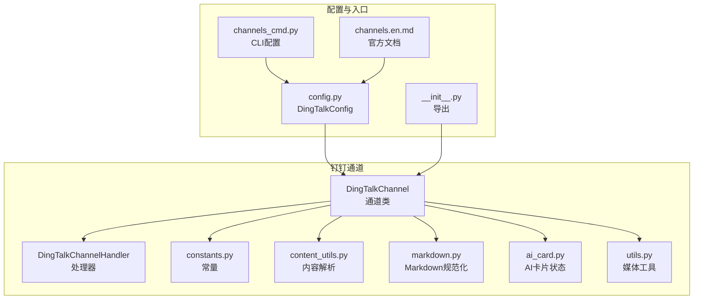
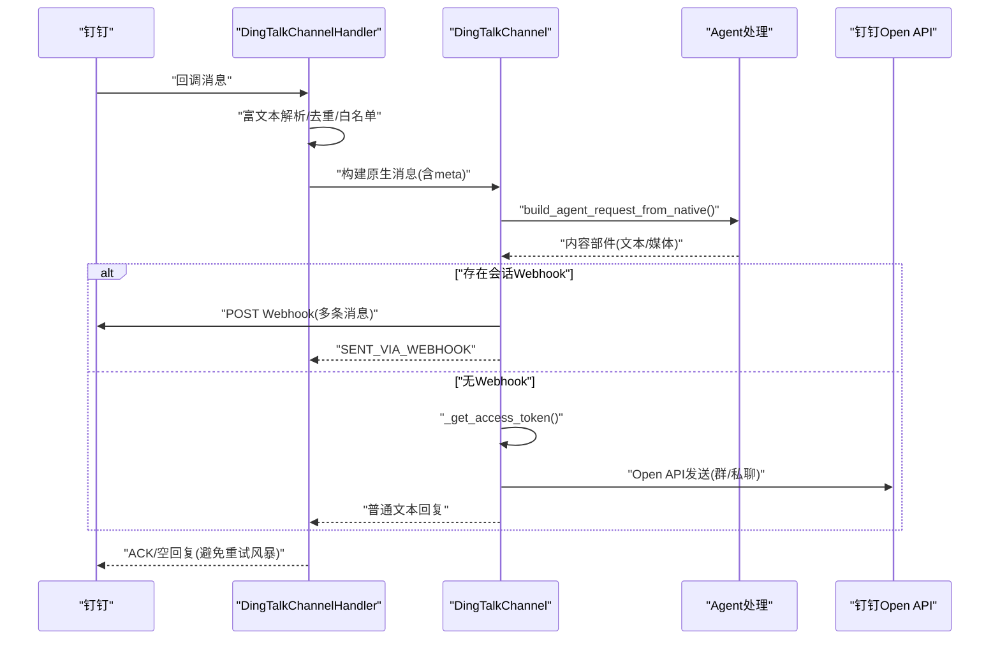
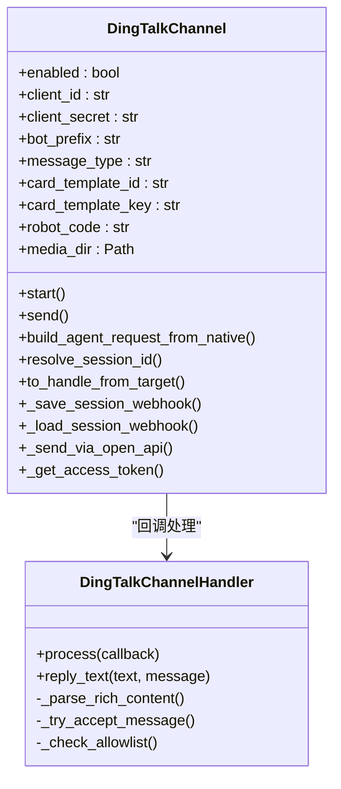
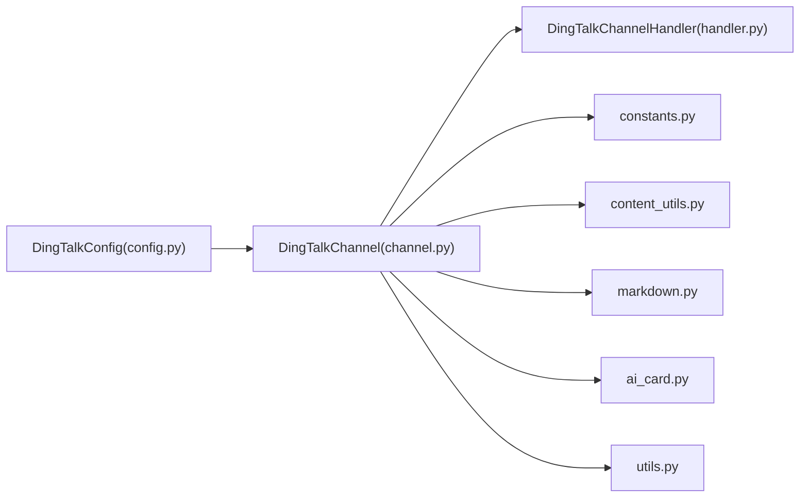

# 钉钉渠道

<cite>
**本文引用的文件**
- [channel.py](file://src/copaw/app/channels/dingtalk/channel.py)
- [handler.py](file://src/copaw/app/channels/dingtalk/handler.py)
- [constants.py](file://src/copaw/app/channels/dingtalk/constants.py)
- [content_utils.py](file://src/copaw/app/channels/dingtalk/content_utils.py)
- [ai_card.py](file://src/copaw/app/channels/dingtalk/ai_card.py)
- [markdown.py](file://src/copaw/app/channels/dingtalk/markdown.py)
- [utils.py](file://src/copaw/app/channels/dingtalk/utils.py)
- [config.py](file://src/copaw/config/config.py)
- [channels.en.md](file://website/public/docs/channels.en.md)
- [__init__.py](file://src/copaw/app/channels/dingtalk/__init__.py)
- [channels_cmd.py](file://src/copaw/cli/channels_cmd.py)
</cite>

## 目录
1. [简介](#简介)
2. [项目结构](#项目结构)
3. [核心组件](#核心组件)
4. [架构总览](#架构总览)
5. [详细组件分析](#详细组件分析)
6. [依赖关系分析](#依赖关系分析)
7. [性能考量](#性能考量)
8. [故障排查指南](#故障排查指南)
9. [结论](#结论)
10. [附录](#附录)

## 简介
本指南面向在 CoPaw 中集成和使用钉钉渠道的工程师与运维人员，覆盖以下主题：
- 钉钉机器人的接入方式与配置：包括企业内部应用、机器人能力、Stream 模式、Webhook 存储与主动推送。
- 关键参数获取与配置：应用ID（AppKey）、应用密钥（AppSecret）、机器人编码（robotCode）、消息类型（markdown/card）等。
- 消息格式转换与媒体处理：文本、图片、音频、视频、文件的解析与落盘、下载链接获取。
- AI 互动卡片（AI Card）与按钮交互：模板变量、状态机、恢复机制与持久化。
- 群组管理与权限控制：允许白名单、提及开关、私聊/群聊策略。
- 主动发送与回执：会话 Webhook 存储、Open API 回退、去重与幂等。
- 常见配置错误排查、网络代理与安全证书配置。

## 项目结构
钉钉渠道位于应用层通道模块中，采用“通道类 + 处理器 + 工具集”的分层设计：
- 通道类负责生命周期、配置注入、消息路由、主动发送与回执。
- 处理器负责将钉钉回调转为统一的 Agent 请求，并进行去重、富文本解析与回复。
- 工具模块提供常量、内容解析、Markdown 规范化、媒体后缀猜测、AI 卡片状态管理等。

图表来源
- [channel.py](file://src/copaw/app/channels/dingtalk/channel.py)
- [handler.py](file://src/copaw/app/channels/dingtalk/handler.py)
- [constants.py](file://src/copaw/app/channels/dingtalk/constants.py)
- [content_utils.py](file://src/copaw/app/channels/dingtalk/content_utils.py)
- [markdown.py](file://src/copaw/app/channels/dingtalk/markdown.py)
- [ai_card.py](file://src/copaw/app/channels/dingtalk/ai_card.py)
- [utils.py](file://src/copaw/app/channels/dingtalk/utils.py)
- [config.py](file://src/copaw/config/config.py)
- [__init__.py](file://src/copaw/app/channels/dingtalk/__init__.py)
- [channels_cmd.py](file://src/copaw/cli/channels_cmd.py)
- [channels.en.md](file://website/public/docs/channels.en.md)

章节来源
- [channel.py](file://src/copaw/app/channels/dingtalk/channel.py)
- [handler.py](file://src/copaw/app/channels/dingtalk/handler.py)
- [config.py](file://src/copaw/config/config.py)
- [channels.en.md](file://website/public/docs/channels.en.md)

## 核心组件
- 通道类（DingTalkChannel）
  - 负责从环境变量或配置对象加载参数，建立钉钉 Stream 客户端，维护会话 Webhook 存储，处理去重与幂等，支持主动发送与 Open API 回退。
  - 支持 AI Card 模式与 Markdown 模式，具备卡片状态持久化与恢复能力。
- 处理器（DingTalkChannelHandler）
  - 将钉钉回调消息解析为统一内容列表（文本、图片、音频、视频、文件），支持富文本与多类型混合消息。
  - 提供去重、白名单校验、提及检测、会话元数据提取与回复。
- 工具模块
  - 常量定义（令牌缓存时长、最小流间隔、会话ID截断长度、类型映射等）。
  - 内容解析（会话ID、会话类型、发送者、富文本解析、数据URL解析）。
  - Markdown 规范化（列表间距、代码块缩进、代码行前缀）。
  - 媒体工具（magic bytes 推断后缀）。
  - AI 卡片状态（ActiveAICard、AICardPendingStore、终端态判断、恢复文案）。

章节来源
- [channel.py](file://src/copaw/app/channels/dingtalk/channel.py)
- [handler.py](file://src/copaw/app/channels/dingtalk/handler.py)
- [constants.py](file://src/copaw/app/channels/dingtalk/constants.py)
- [content_utils.py](file://src/copaw/app/channels/dingtalk/content_utils.py)
- [markdown.py](file://src/copaw/app/channels/dingtalk/markdown.py)
- [utils.py](file://src/copaw/app/channels/dingtalk/utils.py)
- [ai_card.py](file://src/copaw/app/channels/dingtalk/ai_card.py)

## 架构总览
钉钉渠道的运行流程分为“入站回调处理”和“出站消息发送”两大路径：
- 入站：钉钉 Stream 回调 → 处理器解析 → 统一内容与元数据 → 通道类构建请求 → Agent 处理 → 通道类回复。
- 出站：通道类根据是否具备会话 Webhook 选择直接 Webhook 或 Open API；AI Card 模式下通过卡片接口与状态机管理。

图表来源
- [handler.py](file://src/copaw/app/channels/dingtalk/handler.py)
- [channel.py](file://src/copaw/app/channels/dingtalk/channel.py)

## 详细组件分析

### 通道类（DingTalkChannel）
- 生命周期与配置
  - 支持从环境变量与配置对象两种方式初始化，关键字段包括 client_id、client_secret、message_type、card_template_id、card_template_key、robot_code、media_dir、dm_policy、group_policy、require_mention、card_auto_layout 等。
  - 启动时校验必要参数，建立 DingTalk Stream 客户端凭证。
- 会话 Webhook 存储与主动发送
  - 在入站消息中保存 sessionWebhook 到内存与磁盘，键由会话ID派生；支持按 to_handle 解析目标（dingtalk:sw:、dingtalk:webhook:、URL）。
  - 发送失败时可清空 webhook 并保留元数据以便 Open API 回退。
- 去重与幂等
  - 基于原始 msgId 进行去重，避免重复处理与幂等冲突。
- 回复策略
  - Webhook 路径：合并批量回复，一次性返回 ACK，避免钉钉重试风暴。
  - Open API 路径：当无 sessionWebhook 或无法解析会话时，使用 access_token 获取与 Open API 发送。
- AI Card 模式
  - 通过卡片模板与变量键渲染卡片；持久化卡片状态，崩溃后可恢复。
- 媒体与 Markdown
  - 下载用户上传的图片/音频/视频/文件，生成本地路径或下载URL；对 Markdown 进行规范化处理。

图表来源
- [channel.py](file://src/copaw/app/channels/dingtalk/channel.py)
- [handler.py](file://src/copaw/app/channels/dingtalk/handler.py)

章节来源
- [channel.py](file://src/copaw/app/channels/dingtalk/channel.py)
- [handler.py](file://src/copaw/app/channels/dingtalk/handler.py)

### 处理器（DingTalkChannelHandler）
- 富文本解析
  - 支持 richText 与单个 downloadCode 场景，自动推断类型并拉取下载链接，生成统一内容部件。
- 白名单与提及
  - 可选白名单校验与提及开关，不满足条件时直接回复 bot_prefix + 错误信息。
- 去重与元数据
  - 使用原始 msgId 去重；提取 conversation_id、conversation_type、sender_staff_id、is_group、bot_mentioned 等元数据。
- 回复策略
  - 根据通道类返回值决定是否通过 Webhook/AI Card 或普通文本回复。

章节来源
- [handler.py](file://src/copaw/app/channels/dingtalk/handler.py)
- [content_utils.py](file://src/copaw/app/channels/dingtalk/content_utils.py)

### 常量与工具
- 常量
  - 令牌缓存时长、最小流间隔、会话ID截断长度、类型映射、过期安全余量等。
- 内容解析
  - 会话ID/类型提取、发送者构造、富文本拆解、数据URL解析。
- Markdown 规范化
  - 列表间距、代码块缩进、代码行前缀，提升渲染一致性。
- 媒体工具
  - 基于 magic bytes 推断文件后缀，增强兼容性。
- AI 卡片
  - ActiveAICard 数据结构、AICardPendingStore 持久化、终端态判断、恢复文案。

章节来源
- [constants.py](file://src/copaw/app/channels/dingtalk/constants.py)
- [content_utils.py](file://src/copaw/app/channels/dingtalk/content_utils.py)
- [markdown.py](file://src/copaw/app/channels/dingtalk/markdown.py)
- [utils.py](file://src/copaw/app/channels/dingtalk/utils.py)
- [ai_card.py](file://src/copaw/app/channels/dingtalk/ai_card.py)

### 配置与使用指南

#### 获取应用ID与应用密钥
- 登录钉钉开放平台开发者门户，创建“企业内部应用”，开启“机器人”能力，设置消息接收模式为“Stream”，并发布新版本。
- 在应用详情中复制“Client ID（AppKey）”和“Client Secret（AppSecret）”。

章节来源
- [channels.en.md](file://website/public/docs/channels.en.md)

#### 配置参数说明
- 必填项
  - client_id：应用ID（AppKey）
  - client_secret：应用密钥（AppSecret）
- 可选项
  - message_type：消息类型，支持 "markdown" 或 "card"
  - card_template_id：当 message_type 为 "card" 时必填
  - card_template_key：卡片模板变量键名（需与模板一致）
  - robot_code：机器人编码（推荐在群聊卡片投递场景显式配置）
  - media_dir：媒体文件下载目录（留空则不保存）
  - dm_policy/group_policy：私聊/群聊策略（open/allowlist）
  - allow_from：允许来源列表（白名单）
  - require_mention：是否要求被提及
  - card_auto_layout：卡片自动布局（布尔）

章节来源
- [channels.en.md](file://website/public/docs/channels.en.md)
- [config.py](file://src/copaw/config/config.py)
- [channels_cmd.py](file://src/copaw/cli/channels_cmd.py)

#### 主动发送与会话 Webhook
- 通道类会在入站消息中保存 sessionWebhook，后续可通过 to_handle（dingtalk:sw:、dingtalk:webhook:、URL）进行主动发送。
- 发送失败时可清空 webhook 并保留元数据，以便 Open API 回退。

章节来源
- [channel.py](file://src/copaw/app/channels/dingtalk/channel.py)

#### 图片、音频、视频与文件处理
- 通道类通过 Open API 下载用户上传的媒体文件，生成可访问的下载链接或本地路径；对未知后缀文件基于 magic bytes 推断后缀。
- 富文本解析优先提取 richText 中的文本与媒体，避免丢失。

章节来源
- [channel.py](file://src/copaw/app/channels/dingtalk/channel.py)
- [handler.py](file://src/copaw/app/channels/dingtalk/handler.py)
- [utils.py](file://src/copaw/app/channels/dingtalk/utils.py)

#### AI 互动卡片与按钮交互
- 当 message_type 为 "card" 时，通道类使用卡片模板与变量键渲染卡片；卡片状态持久化，崩溃后可恢复。
- 支持最小流间隔与预刷新，保证卡片更新体验。

章节来源
- [channel.py](file://src/copaw/app/channels/dingtalk/channel.py)
- [ai_card.py](file://src/copaw/app/channels/dingtalk/ai_card.py)

#### 群组管理与权限验证
- 通过 dm_policy/group_policy 控制私聊/群聊接入策略，结合 allow_from 实现白名单。
- require_mention 可强制要求被机器人提及后才响应。

章节来源
- [channel.py](file://src/copaw/app/channels/dingtalk/channel.py)
- [handler.py](file://src/copaw/app/channels/dingtalk/handler.py)

#### 消息回执与去重
- 基于原始 msgId 去重，避免重复处理；Webhook 路径下通过 ACK 快速返回，减少重试风暴。

章节来源
- [handler.py](file://src/copaw/app/channels/dingtalk/handler.py)
- [channel.py](file://src/copaw/app/channels/dingtalk/channel.py)

## 依赖关系分析
- 通道类依赖处理器、常量、内容解析、Markdown 规范化、AI 卡片与媒体工具。
- 配置模型 DingTalkConfig 作为通道类的输入，CLI 与文档提供参数来源与示例。

图表来源
- [config.py](file://src/copaw/config/config.py)
- [channel.py](file://src/copaw/app/channels/dingtalk/channel.py)
- [handler.py](file://src/copaw/app/channels/dingtalk/handler.py)
- [constants.py](file://src/copaw/app/channels/dingtalk/constants.py)
- [content_utils.py](file://src/copaw/app/channels/dingtalk/content_utils.py)
- [markdown.py](file://src/copaw/app/channels/dingtalk/markdown.py)
- [ai_card.py](file://src/copaw/app/channels/dingtalk/ai_card.py)
- [utils.py](file://src/copaw/app/channels/dingtalk/utils.py)

章节来源
- [config.py](file://src/copaw/config/config.py)
- [channel.py](file://src/copaw/app/channels/dingtalk/channel.py)

## 性能考量
- 流式回复与 ACK 早返回：在 Webhook/AI Card 路径下尽早 ACK，避免钉钉重试风暴，降低延迟抖动。
- 最小流间隔与令牌预刷新：限制卡片更新频率与令牌提前刷新，平衡用户体验与 API 成本。
- 去重与批处理：同一会话内去重与批处理，减少重复计算与网络往返。
- 媒体下载与落盘：对用户上传媒体进行下载与本地化存储，避免二次拉取；magic bytes 推断后缀提升兼容性。

## 故障排查指南
- 缺少必要参数
  - 现象：启动时报错，提示缺少 client_id 或 client_secret。
  - 处理：确保配置文件或环境变量正确设置。
- 未发布机器人导致无效
  - 现象：配置完成后仍无法接收消息。
  - 处理：在开发者后台完成“创建新版本 + 发布”。
- IP 白名单限制
  - 现象：下载图片/文件报 Forbidden.AccessDenied.IpNotInWhiteList。
  - 处理：在应用设置中添加 CoPaw 运行机器人的公网IP至“安全与合规 → IP 白名单”。
- 会话 Webhook 过期
  - 现象：主动发送失败或超时。
  - 处理：通道类内置过期安全余量；若仍失败，检查会话有效期并尝试 Open API 回退。
- 代理与证书
  - 现象：网络受限或证书校验失败。
  - 处理：通过 CLI 配置 HTTP 代理与认证；确保系统证书链可用或提供正确的 CA 证书路径（参考其他通道的代理与证书配置实践）。

章节来源
- [channels.en.md](file://website/public/docs/channels.en.md)
- [channels_cmd.py](file://src/copaw/cli/channels_cmd.py)

## 结论
钉钉渠道在 CoPaw 中提供了完善的入站回调处理、主动发送与回执、AI 卡片与富媒体支持。通过合理的配置与运维策略，可在企业内部高效地实现机器人消息的双向交互与扩展能力。建议优先启用 Webhook/AI Card 路径以获得更佳的实时性与用户体验，并配合白名单与提及策略保障安全与可控性。

## 附录
- 配置示例字段与默认值可参考配置模型与官方文档。
- CLI 提供交互式配置入口，便于快速完成钉钉渠道的初始配置。

章节来源
- [config.py](file://src/copaw/config/config.py)
- [channels.en.md](file://website/public/docs/channels.en.md)
- [channels_cmd.py](file://src/copaw/cli/channels_cmd.py)