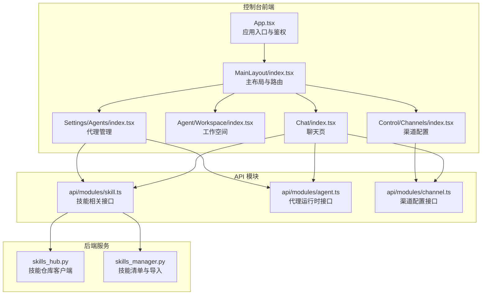
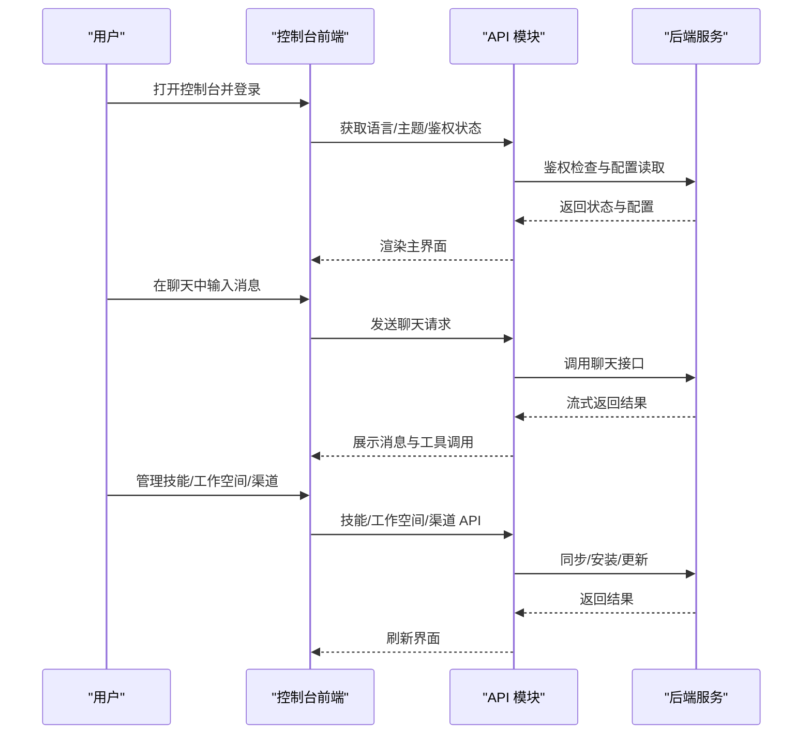
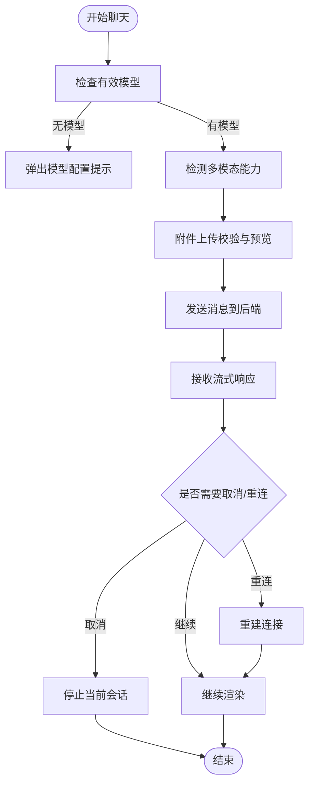
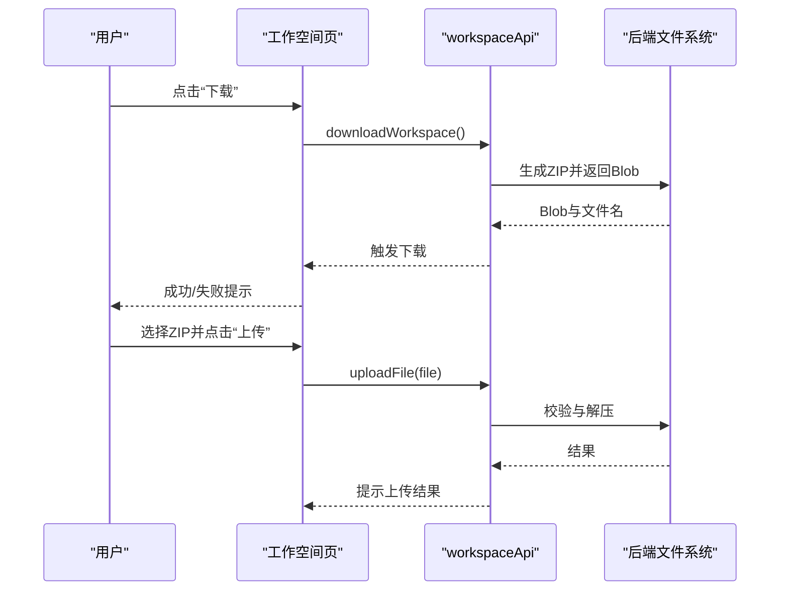
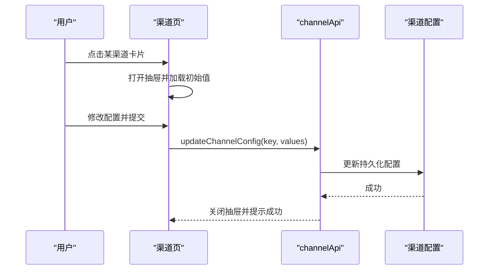
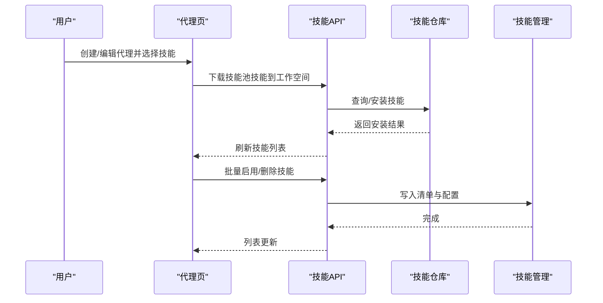
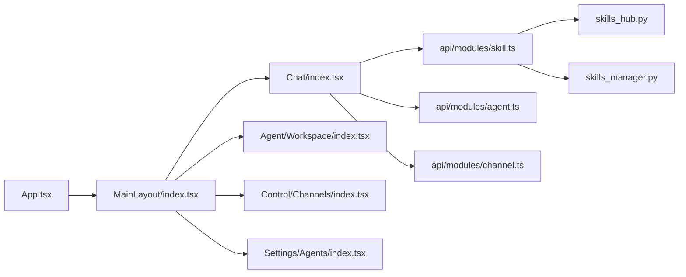

# 用户指南

<cite>
**本文引用的文件**
- [README.md](file://README.md)
- [QUICK-START.md](file://docs/QUICK-START.md)
- [walkthrough.md](file://docs/walkthrough.md)
- [App.tsx](file://console/src/App.tsx)
- [MainLayout/index.tsx](file://console/src/layouts/MainLayout/index.tsx)
- [Chat/index.tsx](file://console/src/pages/Chat/index.tsx)
- [Agent/Workspace/index.tsx](file://console/src/pages/Agent/Workspace/index.tsx)
- [Control/Channels/index.tsx](file://console/src/pages/Control/Channels/index.tsx)
- [Settings/Agents/index.tsx](file://console/src/pages/Settings/Agents/index.tsx)
- [api/modules/skill.ts](file://console/src/api/modules/skill.ts)
- [api/modules/agent.ts](file://console/src/api/modules/agent.ts)
- [api/modules/channel.ts](file://console/src/api/modules/channel.ts)
- [skills_hub.py](file://src/copaw/agents/skills_hub.py)
- [skills_manager.py](file://src/copaw/agents/skills_manager.py)
</cite>

## 目录
1. [简介](#简介)
2. [项目结构](#项目结构)
3. [核心组件](#核心组件)
4. [架构总览](#架构总览)
5. [详细组件解析](#详细组件解析)
6. [依赖关系分析](#依赖关系分析)
7. [性能与可用性建议](#性能与可用性建议)
8. [故障排查指南](#故障排查指南)
9. [结论](#结论)
10. [附录：常用操作速查](#附录常用操作速查)

## 简介
CoPaw 是一款从个人助理到企业级平台的智能体工作站，支持本地或云端部署、多渠道连接、多代理协作、技能扩展与安全管控。本指南面向最终用户，帮助您快速上手控制台界面、配置模型与代理、管理技能与工作空间，并掌握聊天交互、任务执行、跨渠道同步等高频使用场景。

## 项目结构
控制台前端采用 React + Ant Design 架构，通过路由组织页面；后端提供 REST API，前端通过统一请求模块与后端交互。核心页面包括聊天、渠道管理、会话、定时任务、心跳监控、代理与技能管理、工作空间、设置等。

图表来源
- [App.tsx:1-228](file://console/src/App.tsx#L1-L228)
- [MainLayout/index.tsx:1-154](file://console/src/layouts/MainLayout/index.tsx#L1-L154)
- [Chat/index.tsx:1-894](file://console/src/pages/Chat/index.tsx#L1-L894)
- [Agent/Workspace/index.tsx:1-186](file://console/src/pages/Agent/Workspace/index.tsx#L1-L186)
- [Control/Channels/index.tsx:1-164](file://console/src/pages/Control/Channels/index.tsx#L1-L164)
- [Settings/Agents/index.tsx:1-186](file://console/src/pages/Settings/Agents/index.tsx#L1-L186)
- [api/modules/skill.ts:1-551](file://console/src/api/modules/skill.ts#L1-L551)
- [api/modules/agent.ts:1-86](file://console/src/api/modules/agent.ts#L1-L86)
- [api/modules/channel.ts:1-44](file://console/src/api/modules/channel.ts#L1-L44)
- [skills_hub.py:1-800](file://src/copaw/agents/skills_hub.py#L1-L800)
- [skills_manager.py:1-800](file://src/copaw/agents/skills_manager.py#L1-L800)

章节来源
- [App.tsx:1-228](file://console/src/App.tsx#L1-L228)
- [MainLayout/index.tsx:1-154](file://console/src/layouts/MainLayout/index.tsx#L1-L154)

## 核心组件
- 控制台应用与鉴权
  - 应用入口负责国际化、主题、路由与登录拦截；支持企业版与传统版鉴权切换。
- 主布局与导航
  - 聊天为默认页，其他页面按需懒加载；侧边栏导航与面包屑信息清晰。
- 聊天交互
  - 支持多模态能力检测、附件上传、命令提示、会话管理、取消与重连。
- 工作空间
  - 支持工作空间打包下载、ZIP 上传、文件列表与编辑器、启用/禁用与排序。
- 渠道管理
  - 分类筛选（全部/内置/自定义）、卡片式配置、表单保存、内置过滤开关。
- 代理与技能
  - 代理列表、创建/编辑/删除/启停、拖拽重排、技能池安装与下载、批量启用/删除。

章节来源
- [App.tsx:49-136](file://console/src/App.tsx#L49-L136)
- [MainLayout/index.tsx:64-92](file://console/src/layouts/MainLayout/index.tsx#L64-L92)
- [Chat/index.tsx:400-800](file://console/src/pages/Chat/index.tsx#L400-L894)
- [Agent/Workspace/index.tsx:11-186](file://console/src/pages/Agent/Workspace/index.tsx#L1-L186)
- [Control/Channels/index.tsx:18-164](file://console/src/pages/Control/Channels/index.tsx#L1-L164)
- [Settings/Agents/index.tsx:16-186](file://console/src/pages/Settings/Agents/index.tsx#L1-L186)

## 架构总览
下图展示从浏览器到后端的关键交互路径：控制台前端通过 API 模块访问后端，聊天与技能管理分别对接不同的后端服务与技能仓库。

图表来源
- [App.tsx:142-217](file://console/src/App.tsx#L142-L217)
- [Chat/index.tsx:632-800](file://console/src/pages/Chat/index.tsx#L632-L894)
- [api/modules/skill.ts:112-551](file://console/src/api/modules/skill.ts#L112-L551)
- [api/modules/agent.ts:5-86](file://console/src/api/modules/agent.ts#L1-L86)
- [api/modules/channel.ts:4-44](file://console/src/api/modules/channel.ts#L1-L44)

## 详细组件解析

### 聊天交互与会话管理
- 多模态能力检测：根据当前模型能力动态启用图片/视频附件。
- 命令提示：支持 /clear、/compact、/approve、/deny 等命令。
- 会话管理：支持多会话、URL 同步、自动选择与创建、移除后地址清理。
- 取消与重连：可取消当前流式响应，或重新建立连接。
- 附件上传：限制大小、类型提示与错误处理。

图表来源
- [Chat/index.tsx:566-800](file://console/src/pages/Chat/index.tsx#L566-L894)

章节来源
- [Chat/index.tsx:400-800](file://console/src/pages/Chat/index.tsx#L400-L894)

### 工作空间管理
- 下载工作空间：生成并下载包含文件与记忆的压缩包。
- 上传工作空间：仅接受 ZIP，限制大小与格式，成功/失败反馈。
- 文件列表与编辑：支持启用/禁用、拖拽排序、每日记忆点击。
- 保存与重置：变更内容保存或重置回滚。

图表来源
- [Agent/Workspace/index.tsx:36-104](file://console/src/pages/Agent/Workspace/index.tsx#L36-L104)

章节来源
- [Agent/Workspace/index.tsx:11-186](file://console/src/pages/Agent/Workspace/index.tsx#L1-L186)

### 渠道配置与同步
- 过滤与分组：内置/自定义/全部三类卡片，启用优先显示。
- 卡片详情：打开抽屉进行配置，支持过滤工具消息与思考内容。
- 保存与刷新：提交后拉取最新配置并提示成功/失败。

图表来源
- [Control/Channels/index.tsx:54-100](file://console/src/pages/Control/Channels/index.tsx#L54-L100)
- [api/modules/channel.ts:19-44](file://console/src/api/modules/channel.ts#L19-L44)

章节来源
- [Control/Channels/index.tsx:18-164](file://console/src/pages/Control/Channels/index.tsx#L1-L164)
- [api/modules/channel.ts:1-44](file://console/src/api/modules/channel.ts#L1-L44)

### 代理与技能管理
- 代理管理：创建/编辑/删除/启停、切换默认代理、拖拽重排。
- 技能池：从技能池批量安装到工作空间、标签与通道管理、AI优化流。
- 技能清单：刷新、搜索、启用/禁用、批量删除、上传/下载 ZIP。

图表来源
- [Settings/Agents/index.tsx:79-141](file://console/src/pages/Settings/Agents/index.tsx#L79-L141)
- [api/modules/skill.ts:112-551](file://console/src/api/modules/skill.ts#L112-L551)
- [skills_hub.py:552-800](file://src/copaw/agents/skills_hub.py#L552-L800)
- [skills_manager.py:1-800](file://src/copaw/agents/skills_manager.py#L1-L800)

章节来源
- [Settings/Agents/index.tsx:16-186](file://console/src/pages/Settings/Agents/index.tsx#L1-L186)
- [api/modules/skill.ts:112-551](file://console/src/api/modules/skill.ts#L112-L551)

## 依赖关系分析
- 前端依赖
  - 路由与懒加载：主布局统一挂载，聊天默认加载，其余页面按需加载。
  - 国际化与主题：全局样式与 Ant Design 主题注入，暗色模式随主题切换。
  - 鉴权：先尝试企业版 /me，失败则回退传统版 /auth/verify。
- 后端依赖
  - 技能仓库：支持 ClawHub 等源，带超时、重试与速率限制处理。
  - 技能管理：清单写入、签名计算、冲突命名、环境变量注入。

图表来源
- [App.tsx:184-216](file://console/src/App.tsx#L184-L216)
- [MainLayout/index.tsx:100-152](file://console/src/layouts/MainLayout/index.tsx#L100-L152)
- [Chat/index.tsx:1-800](file://console/src/pages/Chat/index.tsx#L1-L894)
- [Agent/Workspace/index.tsx:1-186](file://console/src/pages/Agent/Workspace/index.tsx#L1-L186)
- [Control/Channels/index.tsx:1-164](file://console/src/pages/Control/Channels/index.tsx#L1-L164)
- [Settings/Agents/index.tsx:1-186](file://console/src/pages/Settings/Agents/index.tsx#L1-L186)
- [api/modules/skill.ts:1-551](file://console/src/api/modules/skill.ts#L1-L551)
- [api/modules/agent.ts:1-86](file://console/src/api/modules/agent.ts#L1-L86)
- [api/modules/channel.ts:1-44](file://console/src/api/modules/channel.ts#L1-L44)
- [skills_hub.py:1-800](file://src/copaw/agents/skills_hub.py#L1-L800)
- [skills_manager.py:1-800](file://src/copaw/agents/skills_manager.py#L1-L800)

章节来源
- [App.tsx:1-228](file://console/src/App.tsx#L1-L228)
- [MainLayout/index.tsx:1-154](file://console/src/layouts/MainLayout/index.tsx#L1-L154)

## 性能与可用性建议
- 使用懒加载页面与缓存策略，减少首屏与切换延迟。
- 聊天时注意大文件与多模态能力限制，避免不必要的资源消耗。
- 技能池批量安装与刷新时，关注网络与磁盘 IO，合理安排时间。
- 代理与技能的频繁切换可通过本地缓存减少重复请求。

## 故障排查指南
- 登录与鉴权
  - 若出现鉴权失败，检查企业版 /me 与传统版 /auth/verify 接口返回，确认令牌是否过期或被清除。
- 聊天无响应
  - 确认已配置有效模型；若无模型，前端会弹出提示；检查网络与后端流式接口。
- 上传失败
  - 工作空间上传仅支持 ZIP，且有大小限制；检查文件格式与体积。
- 渠道配置异常
  - 确认渠道类型与参数正确；提交后刷新页面查看最新配置。
- 技能安装/刷新失败
  - 检查技能仓库可达性与网络超时；必要时重试或更换源。

章节来源
- [App.tsx:54-125](file://console/src/App.tsx#L54-L125)
- [Chat/index.tsx:566-642](file://console/src/pages/Chat/index.tsx#L566-L642)
- [Agent/Workspace/index.tsx:56-104](file://console/src/pages/Agent/Workspace/index.tsx#L56-L104)
- [Control/Channels/index.tsx:70-100](file://console/src/pages/Control/Channels/index.tsx#L70-L100)
- [api/modules/skill.ts:287-400](file://console/src/api/modules/skill.ts#L287-L400)

## 结论
通过本指南，您可以完成从安装、配置到日常使用的全流程操作。建议在个人使用阶段先熟悉聊天与工作空间，再逐步引入多代理与技能池；在团队协作场景下，配合渠道与权限体系实现高效协同。

## 附录：常用操作速查
- 快速启动与访问
  - 安装后启动服务，打开浏览器访问 http://127.0.0.1:8088/，在“设置 → 模型”中配置 API Key 或本地模型。
- 常用命令
  - /new：新建会话；/compact：压缩历史；/skills：列出技能；/<技能名>：执行指定技能；/model：切换模型。
- 多代理协作
  - 在“代理管理”中创建多个代理，为每个代理分配专属技能与工作空间，实现角色化分工。
- 复杂技能调用
  - 使用技能池集中管理通用技能，按需下载到工作空间；对技能进行标签与通道配置以控制触发范围。
- 跨渠道消息同步
  - 在“渠道管理”中开启所需渠道，配置过滤规则与前缀，确保消息在各平台间一致呈现。

章节来源
- [QUICK-START.md:247-356](file://docs/QUICK-START.md#L247-L356)
- [README.md:255-266](file://README.md#L255-L266)