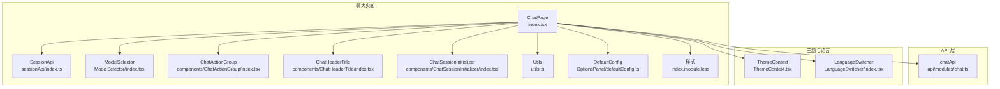
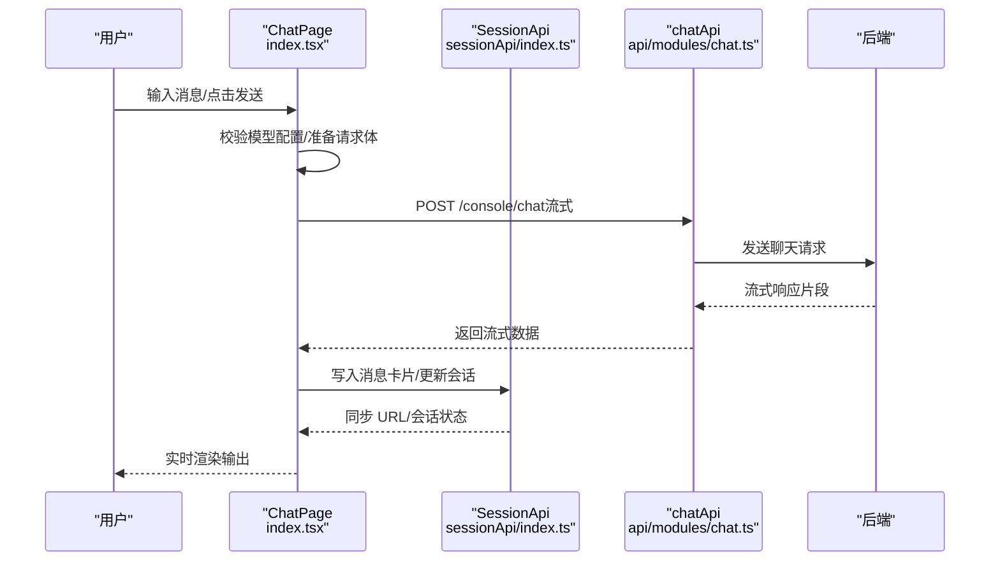
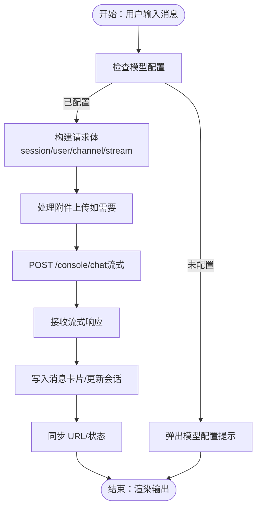
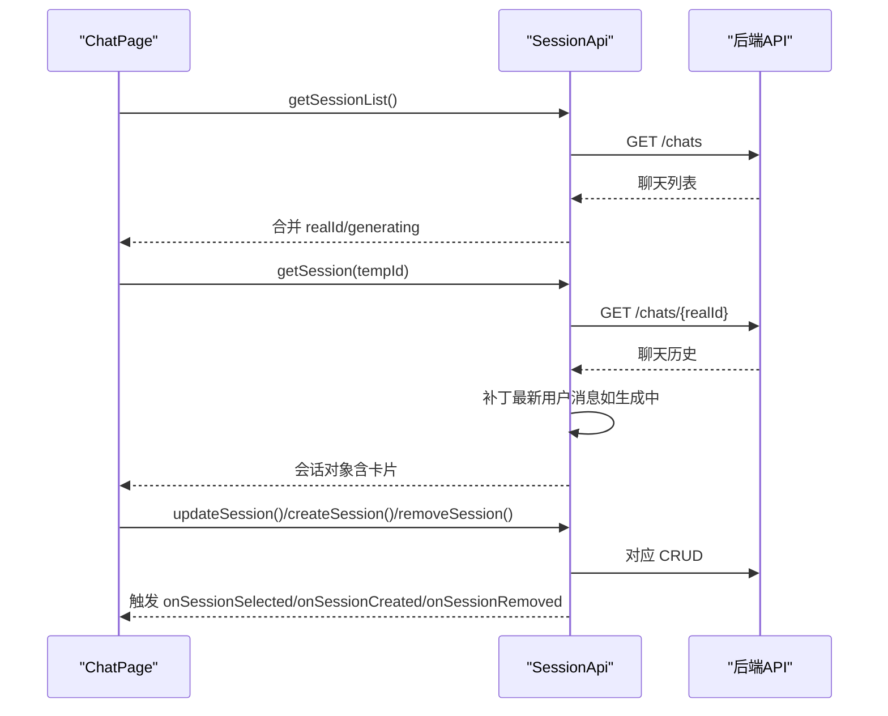
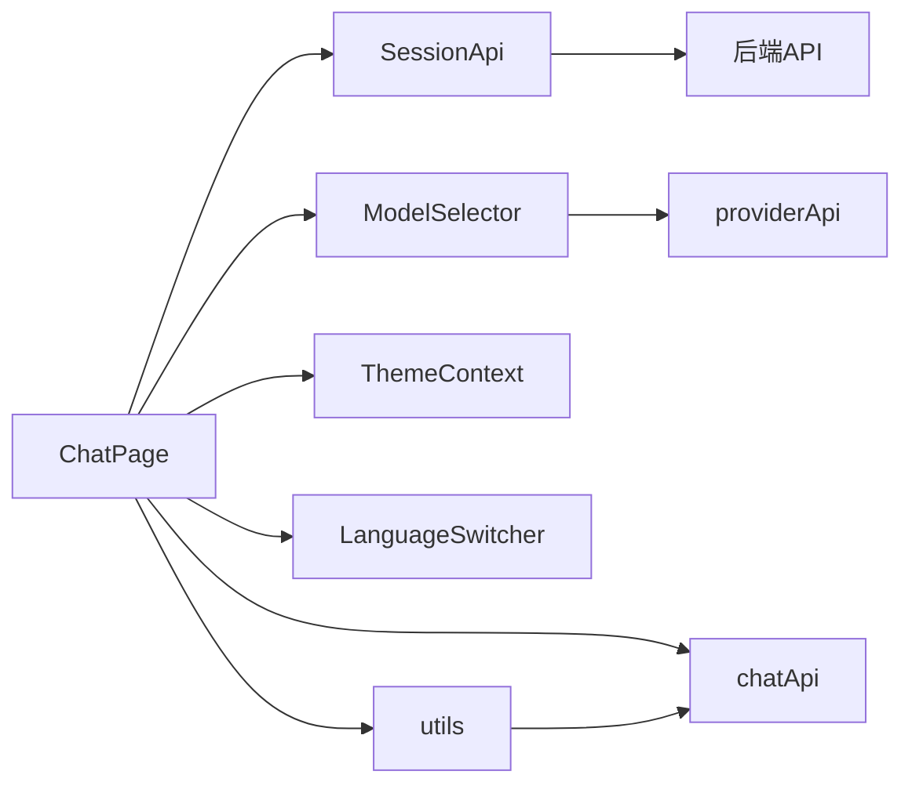

# 聊天交互

<cite>
**本文引用的文件**
- [console/src/pages/Chat/index.tsx](file://console/src/pages/Chat/index.tsx)
- [console/src/pages/Chat/utils.ts](file://console/src/pages/Chat/utils.ts)
- [console/src/pages/Chat/OptionsPanel/defaultConfig.ts](file://console/src/pages/Chat/OptionsPanel/defaultConfig.ts)
- [console/src/pages/Chat/sessionApi/index.ts](file://console/src/pages/Chat/sessionApi/index.ts)
- [console/src/pages/Chat/ModelSelector/index.tsx](file://console/src/pages/Chat/ModelSelector/index.tsx)
- [console/src/pages/Chat/components/ChatActionGroup/index.tsx](file://console/src/pages/Chat/components/ChatActionGroup/index.tsx)
- [console/src/pages/Chat/components/ChatHeaderTitle/index.tsx](file://console/src/pages/Chat/components/ChatHeaderTitle/index.tsx)
- [console/src/pages/Chat/components/ChatSessionInitializer/index.tsx](file://console/src/pages/Chat/components/ChatSessionInitializer/index.tsx)
- [console/src/api/modules/chat.ts](file://console/src/api/modules/chat.ts)
- [console/src/contexts/ThemeContext.tsx](file://console/src/contexts/ThemeContext.tsx)
- [console/src/components/LanguageSwitcher/index.tsx](file://console/src/components/LanguageSwitcher/index.tsx)
- [console/src/locales/en.json](file://console/src/locales/en.json)
- [console/src/locales/zh.json](file://console/src/locales/zh.json)
- [console/src/pages/Chat/index.module.less](file://console/src/pages/Chat/index.module.less)
</cite>

## 目录
1. [简介](#简介)
2. [项目结构](#项目结构)
3. [核心组件](#核心组件)
4. [架构总览](#架构总览)
5. [详细组件分析](#详细组件分析)
6. [依赖关系分析](#依赖关系分析)
7. [性能与可用性建议](#性能与可用性建议)
8. [故障排查指南](#故障排查指南)
9. [结论](#结论)
10. [附录](#附录)

## 简介
本指南面向控制台聊天界面的使用者与维护者，系统讲解如何在控制台中进行聊天交互，包括消息发送、编辑、删除、回复等基础操作；如何通过模型选择器切换模型、参数与历史记录管理；如何进行多轮对话、保持上下文、管理会话；以及消息格式支持、Markdown 渲染、代码高亮、文件上传等特性；最后介绍主题切换、语言设置、快捷键等个性化配置。

## 项目结构
控制台聊天页面位于前端工程 console/src/pages/Chat 下，采用模块化组织：
- 页面入口与主流程：index.tsx
- 会话与消息桥接：sessionApi/index.ts
- 工具函数：utils.ts（文本提取、复制、URL 规范化、加载状态桥接）
- 选项面板默认配置：OptionsPanel/defaultConfig.ts
- 组件：ModelSelector、ChatActionGroup、ChatHeaderTitle、ChatSessionInitializer
- API 封装：api/modules/chat.ts（上传、会话 CRUD、停止）
- 主题与语言：ThemeContext.tsx、LanguageSwitcher/index.tsx
- 国际化词条：locales/en.json、locales/zh.json
- 样式：pages/Chat/index.module.less

图表来源
- [console/src/pages/Chat/index.tsx:400-800](file://console/src/pages/Chat/index.tsx#L400-L800)
- [console/src/pages/Chat/sessionApi/index.ts:339-735](file://console/src/pages/Chat/sessionApi/index.ts#L339-L735)
- [console/src/pages/Chat/ModelSelector/index.tsx:24-267](file://console/src/pages/Chat/ModelSelector/index.tsx#L24-L267)
- [console/src/pages/Chat/components/ChatActionGroup/index.tsx:14-53](file://console/src/pages/Chat/components/ChatActionGroup/index.tsx#L14-L53)
- [console/src/pages/Chat/components/ChatHeaderTitle/index.tsx:5-14](file://console/src/pages/Chat/components/ChatHeaderTitle/index.tsx#L5-L14)
- [console/src/pages/Chat/components/ChatSessionInitializer/index.tsx:12-40](file://console/src/pages/Chat/components/ChatSessionInitializer/index.tsx#L12-L40)
- [console/src/pages/Chat/utils.ts:1-208](file://console/src/pages/Chat/utils.ts#L1-L208)
- [console/src/pages/Chat/OptionsPanel/defaultConfig.ts:1-57](file://console/src/pages/Chat/OptionsPanel/defaultConfig.ts#L1-L57)
- [console/src/pages/Chat/index.module.less:1-134](file://console/src/pages/Chat/index.module.less#L1-L134)
- [console/src/api/modules/chat.ts:21-97](file://console/src/api/modules/chat.ts#L21-L97)
- [console/src/contexts/ThemeContext.tsx:51-105](file://console/src/contexts/ThemeContext.tsx#L51-L105)
- [console/src/components/LanguageSwitcher/index.tsx:13-69](file://console/src/components/LanguageSwitcher/index.tsx#L13-L69)

章节来源
- [console/src/pages/Chat/index.tsx:1-894](file://console/src/pages/Chat/index.tsx#L1-L894)
- [console/src/pages/Chat/sessionApi/index.ts:1-735](file://console/src/pages/Chat/sessionApi/index.ts#L1-L735)
- [console/src/pages/Chat/utils.ts:1-208](file://console/src/pages/Chat/utils.ts#L1-L208)
- [console/src/pages/Chat/OptionsPanel/defaultConfig.ts:1-57](file://console/src/pages/Chat/OptionsPanel/defaultConfig.ts#L1-L57)
- [console/src/pages/Chat/ModelSelector/index.tsx:1-267](file://console/src/pages/Chat/ModelSelector/index.tsx#L1-L267)
- [console/src/pages/Chat/components/ChatActionGroup/index.tsx:1-53](file://console/src/pages/Chat/components/ChatActionGroup/index.tsx#L1-L53)
- [console/src/pages/Chat/components/ChatHeaderTitle/index.tsx:1-14](file://console/src/pages/Chat/components/ChatHeaderTitle/index.tsx#L1-L14)
- [console/src/pages/Chat/components/ChatSessionInitializer/index.tsx:1-40](file://console/src/pages/Chat/components/ChatSessionInitializer/index.tsx#L1-L40)
- [console/src/api/modules/chat.ts:1-137](file://console/src/api/modules/chat.ts#L1-L137)
- [console/src/contexts/ThemeContext.tsx:1-105](file://console/src/contexts/ThemeContext.tsx#L1-L105)
- [console/src/components/LanguageSwitcher/index.tsx:1-69](file://console/src/components/LanguageSwitcher/index.tsx#L1-L69)
- [console/src/pages/Chat/index.module.less:1-134](file://console/src/pages/Chat/index.module.less#L1-L134)

## 核心组件
- 聊天页面 ChatPage：负责渲染聊天 UI、绑定发送器、附件上传、命令建议、会话 URL 同步、主题与语言注入、模型能力检测、消息历史导航等。
- SessionApi：封装与后端的会话与消息交互，负责消息卡片转换、URL 同步、本地草稿缓存、并发请求去重、实时生成状态等。
- ModelSelector：提供模型选择下拉菜单，支持提供商与模型两级选择，切换后通知 ChatPage 更新能力。
- ChatActionGroup：提供新建会话、搜索、历史抽屉等快捷入口。
- ChatHeaderTitle：显示当前会话标题。
- ChatSessionInitializer：根据 URL 初始化当前会话。
- Utils：提供复制、文本提取、URL 规范化、加载状态桥接等工具。
- DefaultConfig：提供默认主题、欢迎语、发送器配置等。
- chatApi：封装上传、会话 CRUD、停止等接口。
- ThemeContext/LanguageSwitcher：主题与语言切换。

章节来源
- [console/src/pages/Chat/index.tsx:400-800](file://console/src/pages/Chat/index.tsx#L400-L800)
- [console/src/pages/Chat/sessionApi/index.ts:339-735](file://console/src/pages/Chat/sessionApi/index.ts#L339-L735)
- [console/src/pages/Chat/ModelSelector/index.tsx:24-267](file://console/src/pages/Chat/ModelSelector/index.tsx#L24-L267)
- [console/src/pages/Chat/components/ChatActionGroup/index.tsx:14-53](file://console/src/pages/Chat/components/ChatActionGroup/index.tsx#L14-L53)
- [console/src/pages/Chat/components/ChatHeaderTitle/index.tsx:5-14](file://console/src/pages/Chat/components/ChatHeaderTitle/index.tsx#L5-L14)
- [console/src/pages/Chat/components/ChatSessionInitializer/index.tsx:12-40](file://console/src/pages/Chat/components/ChatSessionInitializer/index.tsx#L12-L40)
- [console/src/pages/Chat/utils.ts:1-208](file://console/src/pages/Chat/utils.ts#L1-L208)
- [console/src/pages/Chat/OptionsPanel/defaultConfig.ts:1-57](file://console/src/pages/Chat/OptionsPanel/defaultConfig.ts#L1-L57)
- [console/src/api/modules/chat.ts:21-97](file://console/src/api/modules/chat.ts#L21-L97)
- [console/src/contexts/ThemeContext.tsx:51-105](file://console/src/contexts/ThemeContext.tsx#L51-L105)
- [console/src/components/LanguageSwitcher/index.tsx:13-69](file://console/src/components/LanguageSwitcher/index.tsx#L13-L69)

## 架构总览
控制台聊天采用“组件 + 会话 API + 后端服务”的分层架构：
- 前端组件层：ChatPage、ModelSelector、ChatActionGroup 等
- 会话桥接层：SessionApi 负责消息卡片转换、URL 同步、并发去重、生成状态管理
- API 层：chatApi 提供上传、会话 CRUD、停止等
- 主题与语言：ThemeContext、LanguageSwitcher 提供全局切换
- 外部库：@agentscope-ai/chat 提供聊天运行时 UI 与会话上下文

图表来源
- [console/src/pages/Chat/index.tsx:566-642](file://console/src/pages/Chat/index.tsx#L566-L642)
- [console/src/pages/Chat/sessionApi/index.ts:522-560](file://console/src/pages/Chat/sessionApi/index.ts#L522-L560)
- [console/src/api/modules/chat.ts:21-97](file://console/src/api/modules/chat.ts#L21-L97)

## 详细组件分析

### 控制台聊天页面（ChatPage）
- 功能要点
  - 主题与语言注入：通过 ThemeContext 获取 isDark，注入到运行时主题配置
  - 会话 URL 同步：监听 sessionApi 的事件回调，动态更新路由
  - 模型能力检测：通过 providerApi 获取有效模型与提供商，判断是否支持多模态
  - 附件上传：限制大小、类型提示、上传至后端并生成预览链接
  - 命令建议：支持 /clear、/compact、/approve、/deny 等命令
  - 发送前校验：防止输入法组合阶段误触发提交
  - 加载状态桥接：通过 useChatAnywhereInput 暴露 setLoading/getLoading
  - 消息历史导航：支持上下方向键在用户消息间跳转
- 关键流程
  - 自定义 fetch：构建请求体，携带 session_id、user_id、channel，开启流式响应
  - 取消与重连：cancel/reconnect 分别调用后端停止与重新连接逻辑
  - URL 同步：onSessionIdResolved/onSessionSelected/onSessionRemoved/onSessionCreated
  - 代理 URL：replaceMediaURL 将后端存储路径转换为可访问的预览 URL

图表来源
- [console/src/pages/Chat/index.tsx:566-642](file://console/src/pages/Chat/index.tsx#L566-L642)
- [console/src/pages/Chat/index.tsx:772-800](file://console/src/pages/Chat/index.tsx#L772-L800)
- [console/src/pages/Chat/sessionApi/index.ts:522-560](file://console/src/pages/Chat/sessionApi/index.ts#L522-L560)

章节来源
- [console/src/pages/Chat/index.tsx:400-800](file://console/src/pages/Chat/index.tsx#L400-L800)

### 会话 API（SessionApi）
- 职责
  - 列表与详情：listChats/getChat，合并 realId 与 generating 状态
  - 并发去重：getSessionList 与 getSession 的请求缓存
  - 本地草稿：在会话生成中缓存最新用户消息，重连时补丁
  - URL 同步：onSessionIdResolved/onSessionSelected/onSessionCreated/onSessionRemoved
  - 卡片转换：将后端扁平消息转换为 UI 所需的卡片格式
- 关键点
  - 本地时间戳会话：在真实 UUID 解析前，使用临时 id 并等待解析
  - 生成状态：根据最后一条消息的角色与状态判断是否仍在生成
  - 真实 id 映射：resolveRealId 将临时 id 与真实 UUID 绑定

图表来源
- [console/src/pages/Chat/sessionApi/index.ts:522-731](file://console/src/pages/Chat/sessionApi/index.ts#L522-L731)

章节来源
- [console/src/pages/Chat/sessionApi/index.ts:339-735](file://console/src/pages/Chat/sessionApi/index.ts#L339-L735)

### 模型选择器（ModelSelector）
- 功能
  - 列出已配置且有模型的提供商
  - 支持二级菜单：提供商 → 模型
  - 切换当前 Agent 的有效 LLM，触发 model-switched 事件以刷新能力
- 注意
  - 仅展示满足“有模型 + 配置完整”的提供商
  - 切换时显示保存中的状态指示

章节来源
- [console/src/pages/Chat/ModelSelector/index.tsx:24-267](file://console/src/pages/Chat/ModelSelector/index.tsx#L24-L267)

### 聊天动作组（ChatActionGroup）
- 快捷入口
  - 新建会话：创建本地时间戳会话，随后解析真实 id
  - 搜索：打开搜索面板
  - 历史：打开会话抽屉，浏览历史会话
- 与会话 API 的协作
  - 通过 useChatAnywhereSessions 创建会话，交由 SessionApi 管理

章节来源
- [console/src/pages/Chat/components/ChatActionGroup/index.tsx:14-53](file://console/src/pages/Chat/components/ChatActionGroup/index.tsx#L14-L53)

### 会话标题与初始化（ChatHeaderTitle、ChatSessionInitializer）
- ChatHeaderTitle：显示当前会话名称
- ChatSessionInitializer：根据 URL 中的 chatId 初始化当前会话，避免双向同步导致的循环刷新

章节来源
- [console/src/pages/Chat/components/ChatHeaderTitle/index.tsx:5-14](file://console/src/pages/Chat/components/ChatHeaderTitle/index.tsx#L5-L14)
- [console/src/pages/Chat/components/ChatSessionInitializer/index.tsx:12-40](file://console/src/pages/Chat/components/ChatSessionInitializer/index.tsx#L12-L40)

### 工具函数（Utils）
- 文本提取：从响应中提取可复制文本，支持纯文本与多模态内容
- 复制：优先使用 Clipboard API，回退到 textarea 方案
- URL 规范化：将后端存储路径转换为预览 URL，兼容 Windows 绝对路径
- 加载状态桥接：通过 useChatAnywhereInput 暴露 setLoading/getLoading

章节来源
- [console/src/pages/Chat/utils.ts:1-208](file://console/src/pages/Chat/utils.ts#L1-L208)

### 默认配置（OptionsPanel/defaultConfig）
- 主题：主色、深色模式、左侧标题
- 发送器：附件开关、长度限制、免责声明
- 欢迎语：问候语、描述、提示词
- API：基础地址与令牌（可扩展）

章节来源
- [console/src/pages/Chat/OptionsPanel/defaultConfig.ts:1-57](file://console/src/pages/Chat/OptionsPanel/defaultConfig.ts#L1-L57)

### API 封装（chatApi）
- 上传：POST /console/upload，返回存储路径
- 预览：/files/preview 路径拼接与带 token 访问
- 会话：list/create/get/update/delete/batch-delete
- 停止：POST /console/chat/stop

章节来源
- [console/src/api/modules/chat.ts:21-97](file://console/src/api/modules/chat.ts#L21-L97)

### 主题与语言
- ThemeContext：持久化主题偏好，支持 light/dark/system，自动应用到 <html> 类名
- LanguageSwitcher：切换语言并保存到本地与后端

章节来源
- [console/src/contexts/ThemeContext.tsx:51-105](file://console/src/contexts/ThemeContext.tsx#L51-L105)
- [console/src/components/LanguageSwitcher/index.tsx:13-69](file://console/src/components/LanguageSwitcher/index.tsx#L13-L69)

## 依赖关系分析
- ChatPage 依赖
  - SessionApi：会话生命周期与消息卡片转换
  - ModelSelector：模型能力检测与切换
  - chatApi：上传与会话管理
  - ThemeContext/LanguageSwitcher：主题与语言
  - utils：复制、URL 规范化、加载状态桥接
- SessionApi 依赖
  - 后端 API：listChats/getChat/create/update/delete
  - utils.toDisplayUrl：媒体 URL 预览
- ModelSelector 依赖
  - providerApi：列出提供商与有效模型
- 组件间耦合
  - ChatActionGroup 与 SessionApi 通过 useChatAnywhereSessions 协作
  - ChatSessionInitializer 与 ChatPage 通过 URL 同步事件协作

图表来源
- [console/src/pages/Chat/index.tsx:400-800](file://console/src/pages/Chat/index.tsx#L400-L800)
- [console/src/pages/Chat/sessionApi/index.ts:339-735](file://console/src/pages/Chat/sessionApi/index.ts#L339-L735)
- [console/src/pages/Chat/ModelSelector/index.tsx:24-267](file://console/src/pages/Chat/ModelSelector/index.tsx#L24-L267)
- [console/src/api/modules/chat.ts:21-97](file://console/src/api/modules/chat.ts#L21-L97)
- [console/src/pages/Chat/utils.ts:1-208](file://console/src/pages/Chat/utils.ts#L1-L208)

章节来源
- [console/src/pages/Chat/index.tsx:400-800](file://console/src/pages/Chat/index.tsx#L400-L800)
- [console/src/pages/Chat/sessionApi/index.ts:339-735](file://console/src/pages/Chat/sessionApi/index.ts#L339-L735)

## 性能与可用性建议
- 并发请求去重：SessionApi 已对 getSessionList 与 getSession 做去重，避免重复网络请求
- 本地草稿缓存：在会话生成中缓存最新用户消息，减少丢失风险
- 滚动条优化：样式中提供自定义滚动条，适配深色模式
- 附件大小限制：统一限制上传大小，避免超大文件影响性能
- 主题与语言持久化：ThemeContext 与 LanguageSwitcher 将用户偏好保存到本地存储

章节来源
- [console/src/pages/Chat/sessionApi/index.ts:364-442](file://console/src/pages/Chat/sessionApi/index.ts#L364-L442)
- [console/src/pages/Chat/index.module.less:25-78](file://console/src/pages/Chat/index.module.less#L25-L78)
- [console/src/pages/Chat/index.tsx:644-686](file://console/src/pages/Chat/index.tsx#L644-L686)
- [console/src/contexts/ThemeContext.tsx:51-105](file://console/src/contexts/ThemeContext.tsx#L51-L105)
- [console/src/components/LanguageSwitcher/index.tsx:13-69](file://console/src/components/LanguageSwitcher/index.tsx#L13-L69)

## 故障排查指南
- 模型未配置
  - 现象：发送按钮被禁用或返回 400 错误
  - 排查：在模型选择器中选择有效提供商与模型；确保 API Key、Base URL 等配置正确
  - 参考：自定义 fetch 中对 activeModels 的检查与错误响应
- 附件上传失败
  - 现象：上传报错或超出大小限制
  - 排查：检查文件类型与大小（默认上限 10MB），确认模型支持多模态
  - 参考：handleFileUpload 的警告与错误处理
- 无法复制输出
  - 现象：复制失败
  - 排查：浏览器是否为非安全上下文；检查 Clipboard API 权限
  - 参考：utils.copyText 的回退方案
- 会话 URL 不同步
  - 现象：切换会话后 URL 未更新
  - 排查：确认 onSessionSelected/onSessionCreated/onSessionRemoved 是否触发；检查 ChatSessionInitializer 的初始化逻辑
- 生成状态异常
  - 现象：会话长时间处于生成中
  - 排查：检查后端状态与最后一条消息角色；确认本地草稿补丁逻辑

章节来源
- [console/src/pages/Chat/index.tsx:566-642](file://console/src/pages/Chat/index.tsx#L566-L642)
- [console/src/pages/Chat/index.tsx:644-686](file://console/src/pages/Chat/index.tsx#L644-L686)
- [console/src/pages/Chat/utils.ts:82-108](file://console/src/pages/Chat/utils.ts#L82-L108)
- [console/src/pages/Chat/sessionApi/index.ts:522-560](file://console/src/pages/Chat/sessionApi/index.ts#L522-L560)
- [console/src/pages/Chat/components/ChatSessionInitializer/index.tsx:12-40](file://console/src/pages/Chat/components/ChatSessionInitializer/index.tsx#L12-L40)

## 结论
本聊天交互系统通过组件化与会话 API 的解耦设计，提供了稳定的消息发送、多模态附件、命令建议、会话管理与上下文保持能力。配合主题与语言切换、国际化词条与样式定制，能够满足多场景下的控制台聊天需求。建议在实际使用中关注模型配置、附件大小与并发去重策略，以获得更佳体验。

## 附录

### 基础交互操作
- 发送消息：在输入框中输入文本或插入图片/文件，点击发送或按回车（Shift+回车换行）
- 编辑消息：在会话列表中选择对应会话，重新输入并发送
- 删除消息：通过会话管理或后端接口删除
- 回复消息：在多轮对话中自然延续上下文

章节来源
- [console/src/pages/Chat/index.tsx:743-771](file://console/src/pages/Chat/index.tsx#L743-L771)

### 聊天选项面板与配置
- 模型选择：在顶部模型选择器中选择提供商与模型
- 参数调整：通过 OptionsPanel/defaultConfig 进行主题、欢迎语、发送器等配置
- 历史记录管理：通过 ChatActionGroup 的历史抽屉查看与管理会话

章节来源
- [console/src/pages/Chat/ModelSelector/index.tsx:24-267](file://console/src/pages/Chat/ModelSelector/index.tsx#L24-L267)
- [console/src/pages/Chat/OptionsPanel/defaultConfig.ts:1-57](file://console/src/pages/Chat/OptionsPanel/defaultConfig.ts#L1-L57)
- [console/src/pages/Chat/components/ChatActionGroup/index.tsx:14-53](file://console/src/pages/Chat/components/ChatActionGroup/index.tsx#L14-L53)

### 多轮对话与上下文保持
- 上下文保持：SessionApi 将后端消息转换为卡片，保证连续输出的完整性
- 生成状态：根据最后一条消息角色与状态判断是否仍在生成
- 本地草稿：在生成中缓存最新用户消息，重连时补丁

章节来源
- [console/src/pages/Chat/sessionApi/index.ts:233-252](file://console/src/pages/Chat/sessionApi/index.ts#L233-L252)
- [console/src/pages/Chat/sessionApi/index.ts:271-279](file://console/src/pages/Chat/sessionApi/index.ts#L271-L279)
- [console/src/pages/Chat/sessionApi/index.ts:410-442](file://console/src/pages/Chat/sessionApi/index.ts#L410-L442)

### 消息格式、Markdown 渲染与代码高亮
- 消息格式：支持文本、图片、音频、视频、文件等多种内容类型
- 预览 URL：toDisplayUrl 将后端存储路径转换为可访问的预览链接
- Markdown 渲染：由运行时组件负责渲染（具体实现由 @agentscope-ai/chat 提供）

章节来源
- [console/src/pages/Chat/utils.ts:179-185](file://console/src/pages/Chat/utils.ts#L179-L185)
- [console/src/pages/Chat/index.tsx:780-782](file://console/src/pages/Chat/index.tsx#L780-L782)

### 文件上传与多模态支持
- 上传接口：POST /console/upload，返回存储路径
- 多模态能力：根据模型能力动态启用附件按钮与提示
- 大小限制：默认 10MB，超限时提示错误

章节来源
- [console/src/api/modules/chat.ts:21-55](file://console/src/api/modules/chat.ts#L21-L55)
- [console/src/pages/Chat/index.tsx:644-686](file://console/src/pages/Chat/index.tsx#L644-L686)
- [console/src/pages/Chat/ModelSelector/index.tsx:137-166](file://console/src/pages/Chat/ModelSelector/index.tsx#L137-L166)

### 主题切换与语言设置
- 主题：支持 light/dark/system，自动应用到 <html> 类名
- 语言：支持英语、简体中文、日语、俄语，切换后持久化

章节来源
- [console/src/contexts/ThemeContext.tsx:51-105](file://console/src/contexts/ThemeContext.tsx#L51-L105)
- [console/src/components/LanguageSwitcher/index.tsx:13-69](file://console/src/components/LanguageSwitcher/index.tsx#L13-L69)
- [console/src/locales/en.json:1-200](file://console/src/locales/en.json#L1-L200)
- [console/src/locales/zh.json:1-200](file://console/src/locales/zh.json#L1-L200)