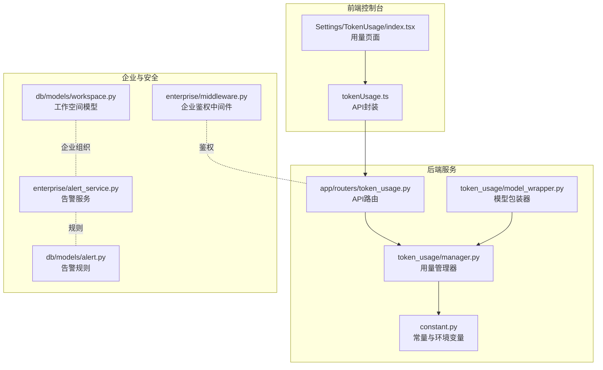
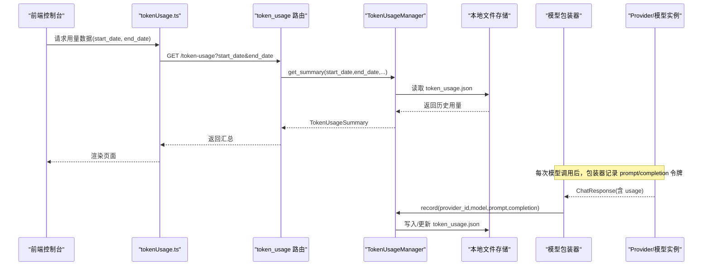
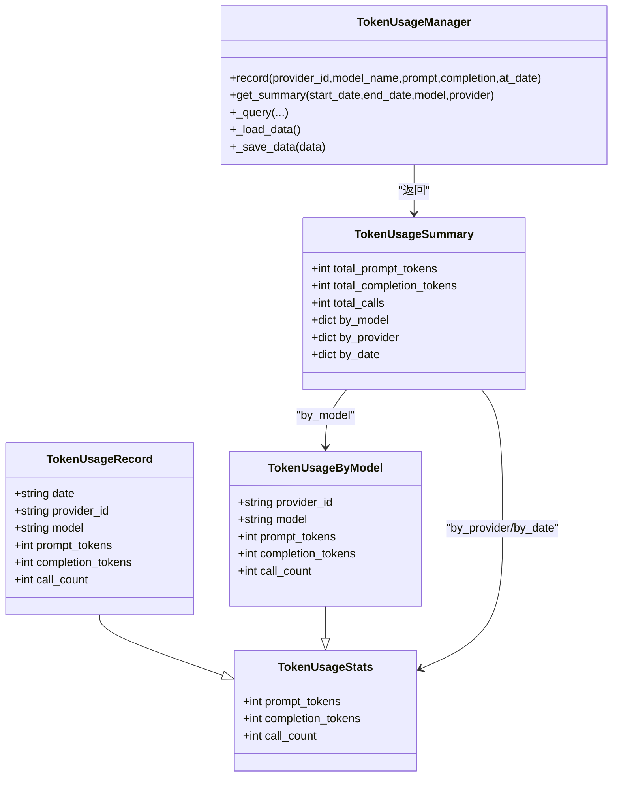
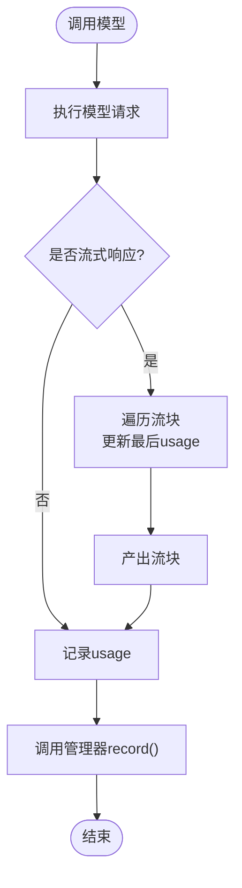
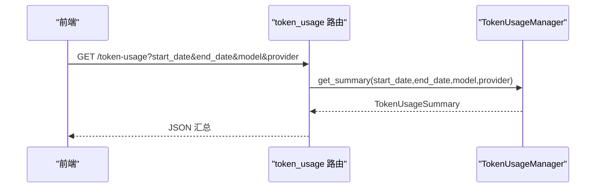
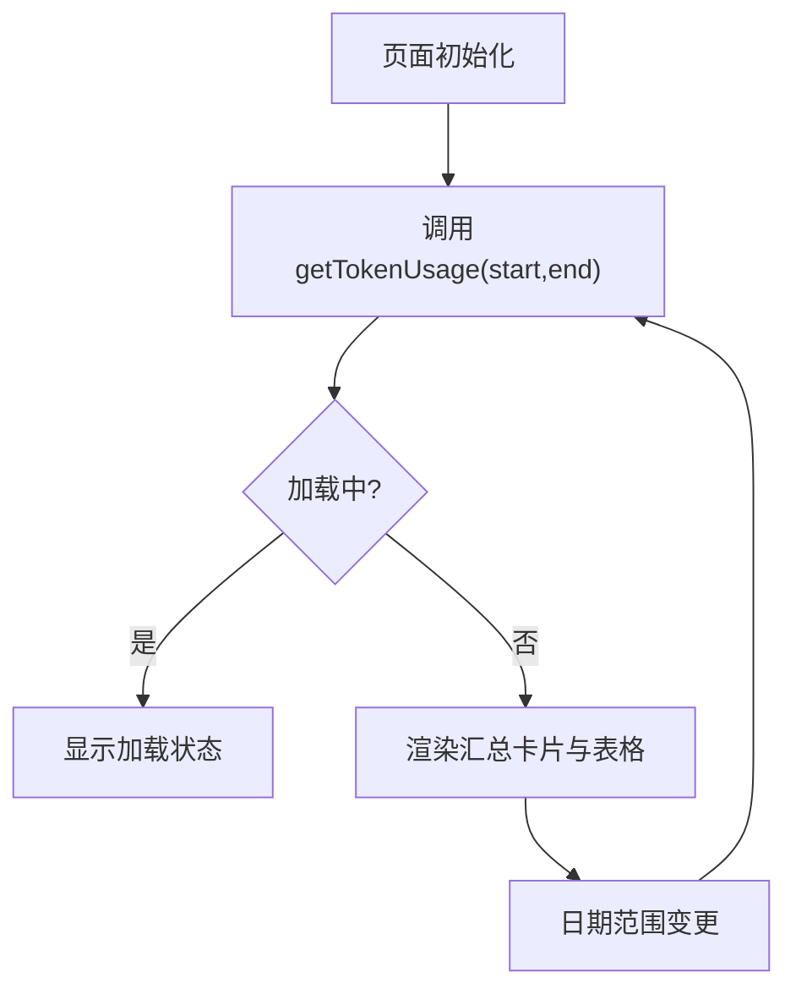
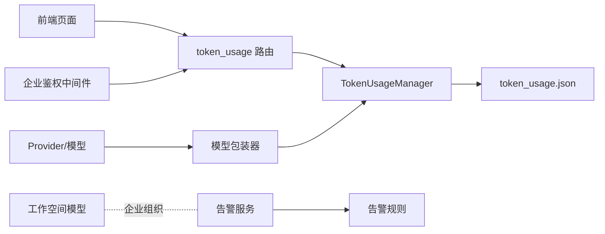

# 令牌用量监控

<cite>
**本文引用的文件**
- [src/copaw/tokend_usage/manager.py](file://src/copaw/token_usage/manager.py)
- [src/copaw/token_usage/model_wrapper.py](file://src/copaw/token_usage/model_wrapper.py)
- [src/copaw/app/routers/token_usage.py](file://src/copaw/app/routers/token_usage.py)
- [console/src/api/modules/tokenUsage.ts](file://console/src/api/modules/tokenUsage.ts)
- [console/src/pages/Settings/TokenUsage/index.tsx](file://console/src/pages/Settings/TokenUsage/index.tsx)
- [src/copaw/constant.py](file://src/copaw/constant.py)
- [src/copaw/providers/provider.py](file://src/copaw/providers/provider.py)
- [src/copaw/agents/utils/copaw_token_counter.py](file://src/copaw/agents/utils/copaw_token_counter.py)
- [src/copaw/db/models/workspace.py](file://src/copaw/db/models/workspace.py)
- [src/copaw/enterprise/alert_service.py](file://src/copaw/enterprise/alert_service.py)
- [src/copaw/db/models/alert.py](file://src/copaw/db/models/alert.py)
- [src/copaw/enterprise/middleware.py](file://src/copaw/enterprise/middleware.py)
</cite>

## 目录
1. [简介](#简介)
2. [项目结构](#项目结构)
3. [核心组件](#核心组件)
4. [架构总览](#架构总览)
5. [详细组件分析](#详细组件分析)
6. [依赖分析](#依赖分析)
7. [性能考虑](#性能考虑)
8. [故障排查指南](#故障排查指南)
9. [结论](#结论)
10. [附录](#附录)

## 简介
本指南面向企业与团队用户，系统化讲解 CoPaw 的“令牌用量监控”能力：从令牌计数器配置、统计周期与阈值设置，到不同模型的令牌计算方式、成本统计与费用估算；覆盖用量报表的生成、导出与分享；以及用量预警（告警规则、通知渠道、自动限制）与团队/部门预算控制等企业管理功能。文档同时提供可视化图示与操作路径，帮助非技术读者也能快速上手。

## 项目结构
围绕“令牌用量监控”的关键文件分布如下：
- 后端数据层与服务：token_usage 管理器、模型包装器、API 路由
- 前端控制台：用量查询接口封装、用量页面与表格展示
- 配置与常量：工作目录、用量数据文件名、环境变量
- 模型与计数：Provider 抽象、HuggingFace 计数器与估算计数器
- 企业级：工作空间模型、告警服务与规则、鉴权中间件

图表来源
- [src/copaw/app/routers/token_usage.py:1-62](file://src/copaw/app/routers/token_usage.py#L1-L62)
- [src/copaw/token_usage/manager.py:1-309](file://src/copaw/token_usage/manager.py#L1-L309)
- [src/copaw/token_usage/model_wrapper.py:1-71](file://src/copaw/token_usage/model_wrapper.py#L1-L71)
- [console/src/api/modules/tokenUsage.ts:1-21](file://console/src/api/modules/tokenUsage.ts#L1-L21)
- [console/src/pages/Settings/TokenUsage/index.tsx:1-224](file://console/src/pages/Settings/TokenUsage/index.tsx#L1-L224)
- [src/copaw/constant.py:72-110](file://src/copaw/constant.py#L72-L110)
- [src/copaw/db/models/workspace.py:20-112](file://src/copaw/db/models/workspace.py#L20-L112)
- [src/copaw/enterprise/alert_service.py:1-217](file://src/copaw/enterprise/alert_service.py#L1-L217)
- [src/copaw/db/models/alert.py:18-66](file://src/copaw/db/models/alert.py#L18-L66)
- [src/copaw/enterprise/middleware.py:57-103](file://src/copaw/enterprise/middleware.py#L57-L103)

章节来源
- [src/copaw/app/routers/token_usage.py:1-62](file://src/copaw/app/routers/token_usage.py#L1-L62)
- [src/copaw/token_usage/manager.py:1-309](file://src/copaw/token_usage/manager.py#L1-L309)
- [src/copaw/token_usage/model_wrapper.py:1-71](file://src/copaw/token_usage/model_wrapper.py#L1-L71)
- [console/src/api/modules/tokenUsage.ts:1-21](file://console/src/api/modules/tokenUsage.ts#L1-L21)
- [console/src/pages/Settings/TokenUsage/index.tsx:1-224](file://console/src/pages/Settings/TokenUsage/index.tsx#L1-L224)
- [src/copaw/constant.py:72-110](file://src/copaw/constant.py#L72-L110)
- [src/copaw/db/models/workspace.py:20-112](file://src/copaw/db/models/workspace.py#L20-L112)
- [src/copaw/enterprise/alert_service.py:1-217](file://src/copaw/enterprise/alert_service.py#L1-L217)
- [src/copaw/db/models/alert.py:18-66](file://src/copaw/db/models/alert.py#L18-L66)
- [src/copaw/enterprise/middleware.py:57-103](file://src/copaw/enterprise/middleware.py#L57-L103)

## 核心组件
- 令牌用量管理器：负责按日期/供应商/模型聚合统计、持久化与查询
- 模型包装器：在调用 LLM 后自动记录 prompt/completion 令牌用量
- 控制台用量 API：提供按日期范围与过滤条件的汇总查询
- 前端用量页面：日期筛选、汇总卡片、按模型/按日期表格展示
- 配置与常量：工作目录、用量数据文件名、环境变量
- 企业级：工作空间模型、告警规则与通知、鉴权中间件

章节来源
- [src/copaw/token_usage/manager.py:62-309](file://src/copaw/token_usage/manager.py#L62-L309)
- [src/copaw/token_usage/model_wrapper.py:15-71](file://src/copaw/token_usage/model_wrapper.py#L15-L71)
- [src/copaw/app/routers/token_usage.py:23-62](file://src/copaw/app/routers/token_usage.py#L23-L62)
- [console/src/pages/Settings/TokenUsage/index.tsx:21-224](file://console/src/pages/Settings/TokenUsage/index.tsx#L21-L224)
- [src/copaw/constant.py:72-110](file://src/copaw/constant.py#L72-L110)

## 架构总览
下图展示了从模型调用到用量统计、再到前端展示与企业告警的整体流程。

图表来源
- [src/copaw/app/routers/token_usage.py:23-62](file://src/copaw/app/routers/token_usage.py#L23-L62)
- [src/copaw/token_usage/manager.py:110-156](file://src/copaw/token_usage/manager.py#L110-L156)
- [src/copaw/token_usage/model_wrapper.py:26-39](file://src/copaw/token_usage/model_wrapper.py#L26-L39)
- [console/src/api/modules/tokenUsage.ts:17-20](file://console/src/api/modules/tokenUsage.ts#L17-L20)

## 详细组件分析

### 令牌用量管理器（TokenUsageManager）
- 数据模型
  - 统计项：prompt_tokens、completion_tokens、call_count
  - 聚合维度：按模型(provider_id:model)、按供应商(provider_id)、按日期(YYYY-MM-DD)
- 关键能力
  - 记录：按 provider_id、model_name、at_date 聚合累加
  - 查询：支持日期范围、模型名、供应商 ID 过滤
  - 汇总：返回 total_prompt_tokens、total_completion_tokens、total_calls，以及分组统计
- 存储：使用异步文件锁保护的本地 JSON 文件，默认位于工作目录下的 token_usage.json

图表来源
- [src/copaw/token_usage/manager.py:19-60](file://src/copaw/token_usage/manager.py#L19-L60)
- [src/copaw/token_usage/manager.py:198-294](file://src/copaw/token_usage/manager.py#L198-L294)

章节来源
- [src/copaw/token_usage/manager.py:62-309](file://src/copaw/token_usage/manager.py#L62-L309)

### 模型包装器（TokenRecordingModelWrapper）
- 在每次模型调用后，从 ChatResponse.usage 中提取 input_tokens/output_tokens 并调用管理器记录
- 支持同步与流式响应：流式时仅保留最后一个 usage

图表来源
- [src/copaw/token_usage/model_wrapper.py:40-71](file://src/copaw/token_usage/model_wrapper.py#L40-L71)

章节来源
- [src/copaw/token_usage/model_wrapper.py:15-71](file://src/copaw/token_usage/model_wrapper.py#L15-L71)

### 控制台用量 API（FastAPI 路由）
- 提供 GET /token-usage 接口，支持 start_date、end_date、model、provider 查询参数
- 默认统计周期为 30 天，可自定义起止日期
- 返回 TokenUsageSummary 结构

图表来源
- [src/copaw/app/routers/token_usage.py:23-62](file://src/copaw/app/routers/token_usage.py#L23-L62)

章节来源
- [src/copaw/app/routers/token_usage.py:1-62](file://src/copaw/app/routers/token_usage.py#L1-L62)

### 前端用量页面（React 页面）
- 功能：日期范围选择、刷新按钮、汇总卡片、按模型/按日期表格
- 数据来源：tokenUsageApi.getTokenUsage(start_date, end_date)
- 展示：紧凑数字格式、空态提示、错误处理与重试

图表来源
- [console/src/pages/Settings/TokenUsage/index.tsx:21-224](file://console/src/pages/Settings/TokenUsage/index.tsx#L21-L224)
- [console/src/api/modules/tokenUsage.ts:17-20](file://console/src/api/modules/tokenUsage.ts#L17-L20)

章节来源
- [console/src/pages/Settings/TokenUsage/index.tsx:1-224](file://console/src/pages/Settings/TokenUsage/index.tsx#L1-L224)
- [console/src/api/modules/tokenUsage.ts:1-21](file://console/src/api/modules/tokenUsage.ts#L1-L21)

### 配置与常量（工作目录与文件名）
- 工作目录：COPAW_WORKING_DIR（默认 ~/.copaw），用于存放 token_usage.json
- 用量数据文件：COPAW_TOKEN_USAGE_FILE（默认 token_usage.json）

章节来源
- [src/copaw/constant.py:72-110](file://src/copaw/constant.py#L72-L110)

### 模型与令牌计算
- Provider 抽象：定义模型信息、连接检查、模型发现、生成参数合并等
- 令牌计数器：
  - CopawTokenCounter：基于 HuggingFace 分词器，支持镜像加速与估算下限
  - CopawEstimateTokenCounter：纯字符估算，低开销但精度较低
- 使用建议：
  - 生产优先精确计数（CopawTokenCounter），在资源受限场景可用估算计数器

章节来源
- [src/copaw/providers/provider.py:17-109](file://src/copaw/providers/provider.py#L17-L109)
- [src/copaw/agents/utils/copaw_token_counter.py:20-301](file://src/copaw/agents/utils/copaw_token_counter.py#L20-L301)

## 依赖分析
- 组件耦合
  - TokenRecordingModelWrapper 依赖 TokenUsageManager.record
  - TokenUsageManager 依赖本地文件系统进行持久化
  - 控制台前端通过 tokenUsage.ts 调用 /token-usage
- 外部依赖
  - 前端：Ant Design 表格与日期选择器
  - 后端：FastAPI、aiofiles（异步文件读写）
- 企业集成
  - 工作空间模型用于团队/部门组织
  - 告警服务与规则用于用量异常检测与通知
  - 企业鉴权中间件保障受控访问

图表来源
- [src/copaw/app/routers/token_usage.py:1-62](file://src/copaw/app/routers/token_usage.py#L1-L62)
- [src/copaw/token_usage/manager.py:1-309](file://src/copaw/token_usage/manager.py#L1-L309)
- [src/copaw/token_usage/model_wrapper.py:1-71](file://src/copaw/token_usage/model_wrapper.py#L1-L71)
- [src/copaw/db/models/workspace.py:20-112](file://src/copaw/db/models/workspace.py#L20-L112)
- [src/copaw/enterprise/alert_service.py:1-217](file://src/copaw/enterprise/alert_service.py#L1-L217)
- [src/copaw/db/models/alert.py:18-66](file://src/copaw/db/models/alert.py#L18-L66)
- [src/copaw/enterprise/middleware.py:57-103](file://src/copaw/enterprise/middleware.py#L57-L103)

章节来源
- [src/copaw/token_usage/manager.py:1-309](file://src/copaw/token_usage/manager.py#L1-L309)
- [src/copaw/token_usage/model_wrapper.py:1-71](file://src/copaw/token_usage/model_wrapper.py#L1-L71)
- [src/copaw/app/routers/token_usage.py:1-62](file://src/copaw/app/routers/token_usage.py#L1-L62)
- [src/copaw/db/models/workspace.py:20-112](file://src/copaw/db/models/workspace.py#L20-L112)
- [src/copaw/enterprise/alert_service.py:1-217](file://src/copaw/enterprise/alert_service.py#L1-L217)
- [src/copaw/db/models/alert.py:18-66](file://src/copaw/db/models/alert.py#L18-L66)
- [src/copaw/enterprise/middleware.py:57-103](file://src/copaw/enterprise/middleware.py#L57-L103)

## 性能考虑
- 异步文件访问：TokenUsageManager 使用 aiofiles 与 asyncio.Lock，避免阻塞
- 缓存策略：前端页面在日期范围内缓存请求结果，减少重复网络请求
- 计数器选择：在高并发或资源受限场景，可优先使用 CopawEstimateTokenCounter 降低开销
- I/O 路径：建议将工作目录指向高性能磁盘，避免频繁小文件写入导致抖动

## 故障排查指南
- 无法加载用量数据
  - 检查 token_usage.json 是否存在且可读写
  - 确认 COPAW_WORKING_DIR 与 COPAW_TOKEN_USAGE_FILE 环境变量
- 用量为 0 或不更新
  - 确认模型调用路径是否经过 TokenRecordingModelWrapper 包装
  - 检查 ChatResponse.usage 是否包含 input_tokens/output_tokens
- 前端报错
  - 查看浏览器网络面板，确认 /token-usage 返回 2xx
  - 检查日期格式是否为 YYYY-MM-DD
- 企业告警未触发
  - 检查 COPAW_WECOM_WEBHOOK_URL、COPAW_DINGTALK_WEBHOOK_URL、SMTP 相关环境变量
  - 确认 AlertRule 是否启用且阈值合理

章节来源
- [src/copaw/constant.py:72-110](file://src/copaw/constant.py#L72-L110)
- [src/copaw/token_usage/model_wrapper.py:26-39](file://src/copaw/token_usage/model_wrapper.py#L26-L39)
- [src/copaw/app/routers/token_usage.py:23-62](file://src/copaw/app/routers/token_usage.py#L23-L62)
- [src/copaw/enterprise/alert_service.py:32-96](file://src/copaw/enterprise/alert_service.py#L32-L96)
- [src/copaw/db/models/alert.py:18-66](file://src/copaw/db/models/alert.py#L18-L66)

## 结论
CoPaw 的令牌用量监控以“模型调用即记录、API 即查询、前端即展示”为核心设计，结合企业级工作空间与告警体系，为企业提供了从单机到多租户的完整用量观测闭环。通过合理配置统计周期、阈值与通知渠道，可实现成本可控、风险可察、团队协同可视化的用量治理。

## 附录

### 配置清单与参数说明
- 环境变量
  - COPAW_WORKING_DIR：工作目录（默认 ~/.copaw）
  - COPAW_TOKEN_USAGE_FILE：用量数据文件名（默认 token_usage.json）
- API 参数
  - start_date：开始日期（YYYY-MM-DD，默认 30 天前）
  - end_date：结束日期（YYYY-MM-DD，默认今日）
  - model：模型名（可选）
  - provider：供应商 ID（可选）
- 告警配置（企业）
  - COPAW_WECOM_WEBHOOK_URL、COPAW_DINGTALK_WEBHOOK_URL、SMTP 主机/端口/账号/收件人
  - AlertRule：规则类型、阈值、窗口秒数、通知渠道、是否启用

章节来源
- [src/copaw/constant.py:72-110](file://src/copaw/constant.py#L72-L110)
- [src/copaw/app/routers/token_usage.py:23-62](file://src/copaw/app/routers/token_usage.py#L23-L62)
- [src/copaw/enterprise/alert_service.py:32-96](file://src/copaw/enterprise/alert_service.py#L32-L96)
- [src/copaw/db/models/alert.py:18-66](file://src/copaw/db/models/alert.py#L18-L66)

### 团队与预算控制（企业级）
- 工作空间模型：支持团队/协作空间、成员与可见性控制
- 告警规则：可针对登录失败、权限变更等敏感事件配置阈值与通知
- 鉴权中间件：统一 JWT 验证与会话撤销检查，保障 API 安全

章节来源
- [src/copaw/db/models/workspace.py:20-112](file://src/copaw/db/models/workspace.py#L20-L112)
- [src/copaw/enterprise/alert_service.py:101-217](file://src/copaw/enterprise/alert_service.py#L101-L217)
- [src/copaw/db/models/alert.py:18-66](file://src/copaw/db/models/alert.py#L18-L66)
- [src/copaw/enterprise/middleware.py:57-103](file://src/copaw/enterprise/middleware.py#L57-L103)