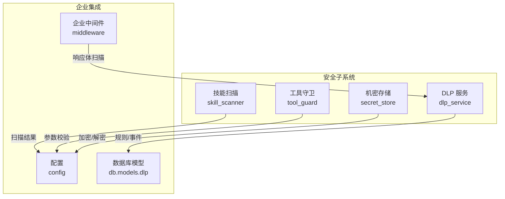
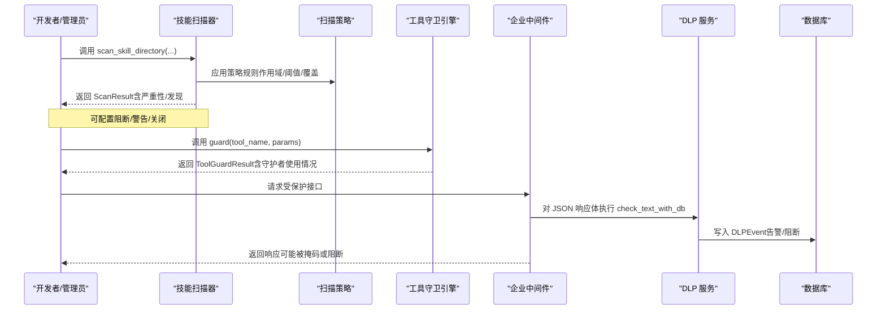
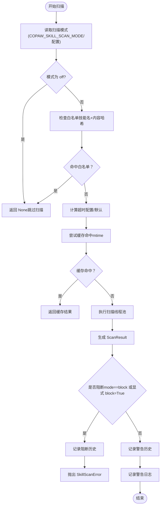
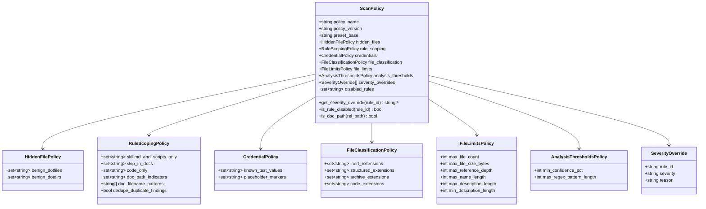
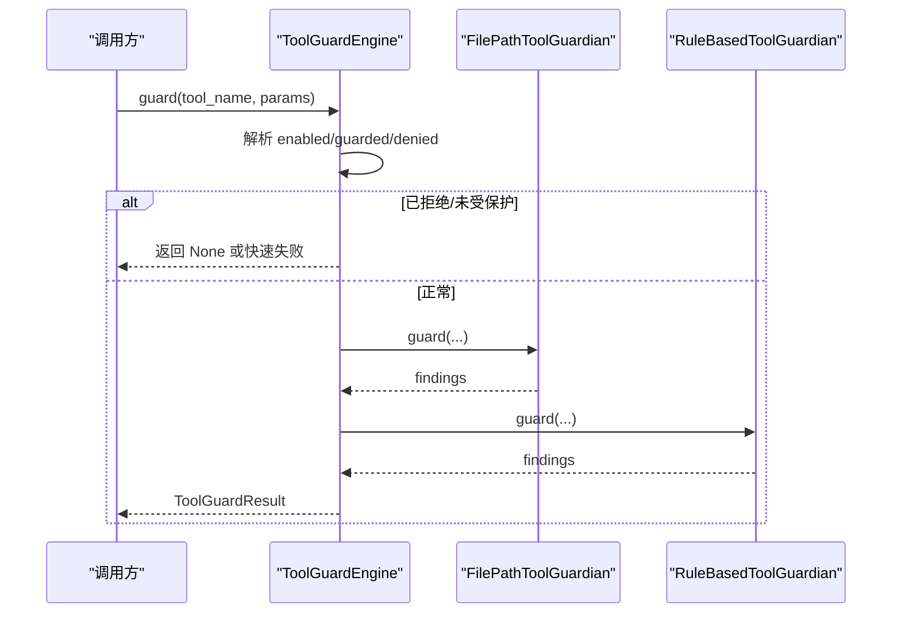
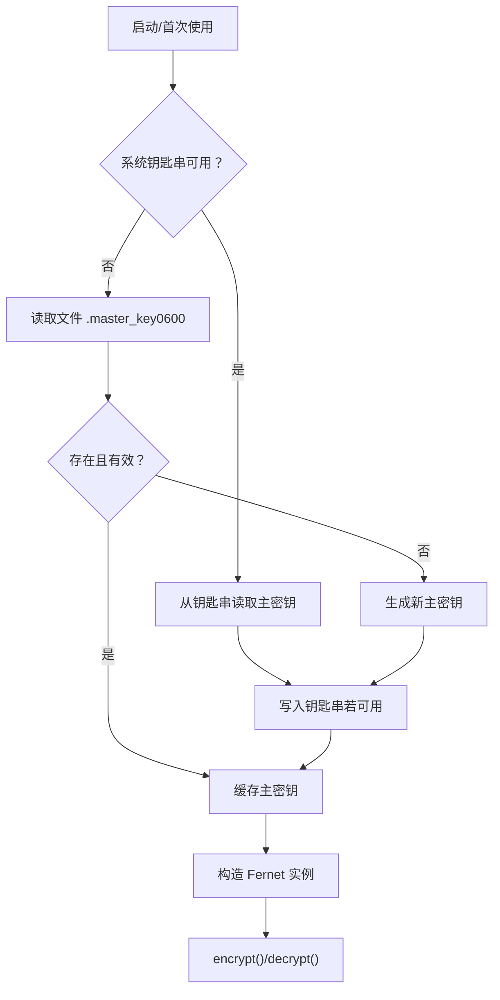
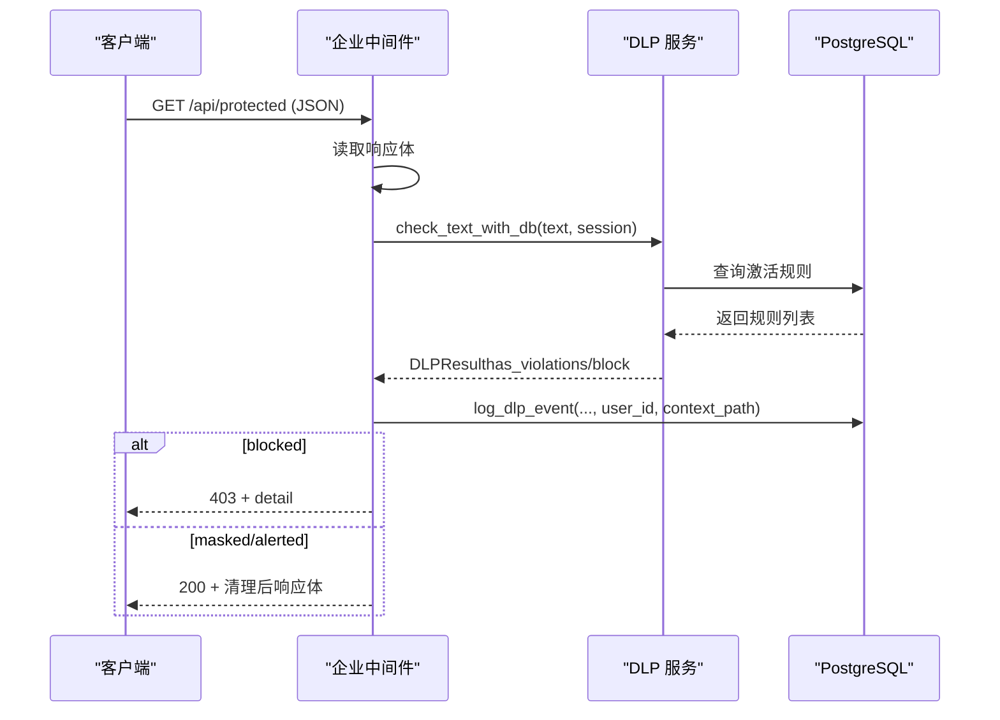
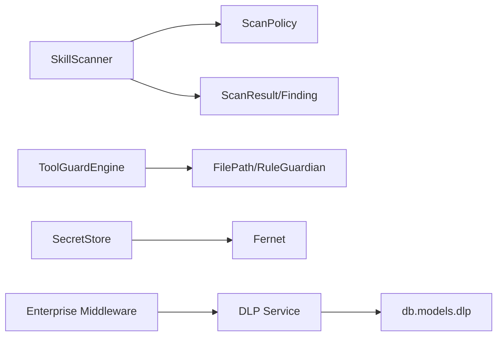

# 安全策略配置

<cite>
**本文引用的文件**
- [security/__init__.py](file://src/copaw/security/__init__.py)
- [security/skill_scanner/__init__.py](file://src/copaw/security/skill_scanner/__init__.py)
- [security/skill_scanner/models.py](file://src/copaw/security/skill_scanner/models.py)
- [security/skill_scanner/scan_policy.py](file://src/copaw/security/skill_scanner/scan_policy.py)
- [security/skill_scanner/scanner.py](file://src/copaw/security/skill_scanner/scanner.py)
- [security/skill_scanner/data/default_policy.yaml](file://src/copaw/security/skill_scanner/data/default_policy.yaml)
- [security/tool_guard/__init__.py](file://src/copaw/security/tool_guard/__init__.py)
- [security/tool_guard/engine.py](file://src/copaw/security/tool_guard/engine.py)
- [security/secret_store.py](file://src/copaw/security/secret_store.py)
- [enterprise/dlp_service.py](file://src/copaw/enterprise/dlp_service.py)
- [enterprise/middleware.py](file://src/copaw/enterprise/middleware.py)
- [db/models/dlp.py](file://src/copaw/db/models/dlp.py)
- [config/config.py](file://src/copaw/config/config.py)
</cite>

## 目录
1. [简介](#简介)
2. [项目结构](#项目结构)
3. [核心组件](#核心组件)
4. [架构总览](#架构总览)
5. [详细组件分析](#详细组件分析)
6. [依赖分析](#依赖分析)
7. [性能考虑](#性能考虑)
8. [故障排查指南](#故障排查指南)
9. [结论](#结论)
10. [附录](#附录)

## 简介
本指南面向企业与平台管理员，系统性讲解 CoPaw 的安全策略配置与运行机制，覆盖以下主题：
- 技能扫描规则与扫描策略：如何配置扫描模式、白名单、黑名单、规则作用域、严重性覆盖与阈值。
- 工具守卫（Tool Guard）：如何启用/禁用、配置危险命令防护、文件路径检查、规则重载与工具范围。
- 威胁检测参数：超时、缓存、并发、文件大小与数量限制、重复项去重等。
- 安全日志与告警：扫描记录持久化、阻断历史、DLP 事件记录与审计。
- 企业级安全能力：DLP 规则（内置与自定义）、审计日志、合规检查、中间件集成。
- 最佳实践与常见风险防范。

## 项目结构
安全相关能力主要分布在以下模块：
- 技能扫描：security/skill_scanner（扫描器、策略、模型、默认策略）
- 工具守卫：security/tool_guard（引擎、守护者、规则）
- 机密存储：security/secret_store（主密钥管理、加密/解密）
- 企业 DLP：enterprise/dlp_service（规则、检查、事件）
- 中间件：enterprise/middleware（JWT 验证、DLP 响应扫描）
- 数据模型：db/models/dlp（DLP 规则与事件）
- 配置：config/config.py（企业开关、数据库/Redis）

图表来源
- [security/skill_scanner/__init__.py:1-505](file://src/copaw/security/skill_scanner/__init__.py#L1-L505)
- [security/tool_guard/engine.py:1-238](file://src/copaw/security/tool_guard/engine.py#L1-L238)
- [security/secret_store.py:1-285](file://src/copaw/security/secret_store.py#L1-L285)
- [enterprise/dlp_service.py:1-231](file://src/copaw/enterprise/dlp_service.py#L1-L231)
- [enterprise/middleware.py:1-191](file://src/copaw/enterprise/middleware.py#L1-L191)
- [db/models/dlp.py:1-107](file://src/copaw/db/models/dlp.py#L1-L107)
- [config/config.py:1-200](file://src/copaw/config/config.py#L1-L200)

章节来源
- [security/__init__.py:1-21](file://src/copaw/security/__init__.py#L1-L21)
- [config/config.py:60-81](file://src/copaw/config/config.py#L60-L81)

## 核心组件
- 技能扫描器：对技能包进行静态分析，支持多分析器、策略驱动、缓存与超时控制。
- 扫描策略：组织级策略，覆盖隐藏文件、规则作用域、凭证处理、文件分类、阈值与严重性覆盖。
- 工具守卫引擎：在工具调用前扫描参数，支持规则型与文件路径型守护者。
- 机密存储：基于 Fernet 的透明加解密，主密钥来自系统钥匙串或文件。
- DLP 服务：内置 PII 规则与数据库可配置规则，支持掩码、告警、阻断三类动作。
- 企业中间件：JWT 验证、请求上下文注入、响应体 DLP 扫描与事件记录。

章节来源
- [security/skill_scanner/__init__.py:82-114](file://src/copaw/security/skill_scanner/__init__.py#L82-L114)
- [security/skill_scanner/scan_policy.py:156-178](file://src/copaw/security/skill_scanner/scan_policy.py#L156-L178)
- [security/tool_guard/engine.py:53-79](file://src/copaw/security/tool_guard/engine.py#L53-L79)
- [security/secret_store.py:148-183](file://src/copaw/security/secret_store.py#L148-L183)
- [enterprise/dlp_service.py:29-80](file://src/copaw/enterprise/dlp_service.py#L29-L80)
- [enterprise/middleware.py:57-144](file://src/copaw/enterprise/middleware.py#L57-L144)

## 架构总览
下图展示从“技能安装/激活”到“工具调用”的安全链路，以及“响应体 DLP 扫描”的企业中间件流程。

图表来源
- [security/skill_scanner/__init__.py:415-505](file://src/copaw/security/skill_scanner/__init__.py#L415-L505)
- [security/tool_guard/engine.py:169-227](file://src/copaw/security/tool_guard/engine.py#L169-L227)
- [enterprise/middleware.py:107-143](file://src/copaw/enterprise/middleware.py#L107-L143)
- [enterprise/dlp_service.py:202-231](file://src/copaw/enterprise/dlp_service.py#L202-L231)

## 详细组件分析

### 技能扫描：规则与策略配置
- 扫描模式与环境变量
  - 支持通过环境变量 COPAW_SKILL_SCAN_MODE 设置扫描模式（block/warn/off），优先级高于配置文件。
  - 默认模式为 warn；当模式为 off 时跳过扫描。
- 白名单与内容哈希
  - 支持按技能名与目录内容哈希进行白名单匹配；仅当内容哈希一致时才生效。
- 阻断历史与记录
  - 每次阻断/警告会写入阻断历史文件，包含技能名、最大严重性、发现列表、内容哈希与动作。
- 缓存与超时
  - 基于目录 mtime 的轻量缓存，避免重复扫描；超时由配置决定，默认 30 秒。
- 公共 API
  - scan_skill_directory(...) 提供统一入口，支持 block 参数与超时控制；返回 ScanResult 或抛出 SkillScanError。

图表来源
- [security/skill_scanner/__init__.py:95-114](file://src/copaw/security/skill_scanner/__init__.py#L95-L114)
- [security/skill_scanner/__init__.py:141-168](file://src/copaw/security/skill_scanner/__init__.py#L141-L168)
- [security/skill_scanner/__init__.py:231-260](file://src/copaw/security/skill_scanner/__init__.py#L231-L260)
- [security/skill_scanner/__init__.py:347-380](file://src/copaw/security/skill_scanner/__init__.py#L347-L380)
- [security/skill_scanner/__init__.py:415-505](file://src/copaw/security/skill_scanner/__init__.py#L415-L505)

章节来源
- [security/skill_scanner/__init__.py:82-114](file://src/copaw/security/skill_scanner/__init__.py#L82-L114)
- [security/skill_scanner/__init__.py:141-168](file://src/copaw/security/skill_scanner/__init__.py#L141-L168)
- [security/skill_scanner/__init__.py:231-260](file://src/copaw/security/skill_scanner/__init__.py#L231-L260)
- [security/skill_scanner/__init__.py:347-380](file://src/copaw/security/skill_scanner/__init__.py#L347-L380)
- [security/skill_scanner/__init__.py:415-505](file://src/copaw/security/skill_scanner/__init__.py#L415-L505)

### 扫描策略：自定义、优先级与例外
- 策略加载与合并
  - 默认策略位于 data/default_policy.yaml；可通过 ScanPolicy.from_yaml 加载组织策略并覆盖默认值。
  - 支持预设策略名（当前为 balanced）。
- 关键策略项
  - hidden_files：受保护的点文件/点目录白名单。
  - rule_scoping：规则作用域（仅在 SKILL.md 与脚本、仅在代码文件、文档路径跳过、文档文件名模式、重复项去重）。
  - credentials：测试值与占位符标记自动抑制。
  - file_classification：扩展名分类（惰性文件、结构化文件、归档、代码）。
  - file_limits：文件数量、单文件大小、引用深度、名称/描述长度阈值。
  - analysis_thresholds：最小置信度、正则最大长度。
  - severity_overrides：按规则调整严重性。
  - disabled_rules：禁用的规则集合。
- 使用建议
  - 将组织特有的规则作用域与严重性覆盖放入自定义策略文件，保持默认策略稳定。

图表来源
- [security/skill_scanner/scan_policy.py:156-178](file://src/copaw/security/skill_scanner/scan_policy.py#L156-L178)
- [security/skill_scanner/scan_policy.py:74-120](file://src/copaw/security/skill_scanner/scan_policy.py#L74-L120)
- [security/skill_scanner/scan_policy.py:134-140](file://src/copaw/security/skill_scanner/scan_policy.py#L134-L140)
- [security/skill_scanner/scan_policy.py:183-193](file://src/copaw/security/skill_scanner/scan_policy.py#L183-L193)
- [security/skill_scanner/scan_policy.py:194-231](file://src/copaw/security/skill_scanner/scan_policy.py#L194-L231)

章节来源
- [security/skill_scanner/scan_policy.py:236-282](file://src/copaw/security/skill_scanner/scan_policy.py#L236-L282)
- [security/skill_scanner/data/default_policy.yaml:1-243](file://src/copaw/security/skill_scanner/data/default_policy.yaml#L1-L243)

### 工具守卫：危险命令与文件访问控制
- 启用与禁用
  - 通过环境变量 COPAW_TOOL_GUARD_ENABLED 控制（true/1/yes 生效），否则读取配置文件 security.tool_guard.enabled，默认开启。
- 守护者注册
  - 默认包含 FilePathToolGuardian 与 RuleBasedToolGuardian；支持动态注册/注销。
- 工具范围与拒绝列表
  - 支持解析受保护工具集与无条件拒绝工具集；未指定时默认保护所有工具。
- 规则重载
  - reload_rules() 可刷新规则并重新解析受保护/拒绝工具集。
- 结果聚合
  - ToolGuardResult 聚合各守护者的发现与失败信息，记录耗时。

图表来源
- [security/tool_guard/engine.py:35-51](file://src/copaw/security/tool_guard/engine.py#L35-L51)
- [security/tool_guard/engine.py:141-158](file://src/copaw/security/tool_guard/engine.py#L141-L158)
- [security/tool_guard/engine.py:169-227](file://src/copaw/security/tool_guard/engine.py#L169-L227)

章节来源
- [security/tool_guard/engine.py:53-79](file://src/copaw/security/tool_guard/engine.py#L53-L79)
- [security/tool_guard/engine.py:108-118](file://src/copaw/security/tool_guard/engine.py#L108-L118)
- [security/tool_guard/engine.py:148-154](file://src/copaw/security/tool_guard/engine.py#L148-L154)
- [security/tool_guard/engine.py:169-227](file://src/copaw/security/tool_guard/engine.py#L169-L227)

### 机密存储：主密钥与透明加解密
- 主密钥来源
  - 优先从系统钥匙串读取；容器/无桌面/Linux 无显示/CI 环境下回退到 SECRET_DIR/.master_key 文件（0600 权限）。
- 加密算法
  - Fernet（AES-128-CBC + HMAC-SHA256），密钥经 base64.urlsafe_b64encode 处理。
- 字段加密
  - 提供 encrypt_dict_fields/decrypt_dict_fields，按字段集透明加密/解密。
- 容错与降级
  - 解密失败时返回原始密文，避免崩溃。

图表来源
- [security/secret_store.py:46-69](file://src/copaw/security/secret_store.py#L46-L69)
- [security/secret_store.py:148-183](file://src/copaw/security/secret_store.py#L148-L183)
- [security/secret_store.py:207-236](file://src/copaw/security/secret_store.py#L207-L236)

章节来源
- [security/secret_store.py:14-13](file://src/copaw/security/secret_store.py#L14-L13)
- [security/secret_store.py:148-183](file://src/copaw/security/secret_store.py#L148-L183)
- [security/secret_store.py:207-236](file://src/copaw/security/secret_store.py#L207-L236)

### DLP：内置规则与数据库规则、事件记录
- 动作类型
  - mask（掩码）、alert（告警）、block（阻断）。
- 内置规则
  - 中文身份证、手机号、银行卡号、邮箱、公网 IPv4、API Key 类似模式等。
- 文本检查
  - check_text(text, extra_rules)：遍历规则匹配，记录匹配项，按动作生成清理文本，必要时阻断。
- 数据库规则
  - load_db_rules(session)：从 PostgreSQL 表 sys_dlp_rules 加载激活规则并编译。
  - check_text_with_db(text, session)：整合内置与数据库规则。
- 事件记录
  - log_dlp_event(session, result, user_id, context_path)：将触发事件写入 sys_dlp_events。
- 企业中间件集成
  - 对受保护路径的 JSON 响应体进行 DLP 检查，若触发阻断返回 403，否则替换响应体并移除 content-length。

图表来源
- [enterprise/middleware.py:107-143](file://src/copaw/enterprise/middleware.py#L107-L143)
- [enterprise/dlp_service.py:114-165](file://src/copaw/enterprise/dlp_service.py#L114-L165)
- [enterprise/dlp_service.py:174-198](file://src/copaw/enterprise/dlp_service.py#L174-L198)
- [enterprise/dlp_service.py:210-231](file://src/copaw/enterprise/dlp_service.py#L210-L231)
- [db/models/dlp.py:18-66](file://src/copaw/db/models/dlp.py#L18-L66)

章节来源
- [enterprise/dlp_service.py:29-80](file://src/copaw/enterprise/dlp_service.py#L29-L80)
- [enterprise/dlp_service.py:114-165](file://src/copaw/enterprise/dlp_service.py#L114-L165)
- [enterprise/dlp_service.py:174-198](file://src/copaw/enterprise/dlp_service.py#L174-L198)
- [enterprise/dlp_service.py:210-231](file://src/copaw/enterprise/dlp_service.py#L210-L231)
- [db/models/dlp.py:18-66](file://src/copaw/db/models/dlp.py#L18-L66)
- [enterprise/middleware.py:107-143](file://src/copaw/enterprise/middleware.py#L107-L143)

## 依赖分析
- 组件耦合
  - 技能扫描器与扫描策略松耦合：策略以 YAML 形式注入，便于组织级定制。
  - 工具守卫引擎与守护者接口抽象：新增守护者无需修改引擎。
  - DLP 服务与数据库模型解耦：通过 ORM 层隔离。
- 外部依赖
  - 系统钥匙串（keyring）用于主密钥存储；容器/CI 环境下自动降级。
  - 正则表达式（re）用于规则匹配；内置规则预编译提升性能。
  - SQLAlchemy 用于 DLP 规则与事件的持久化。

图表来源
- [security/skill_scanner/scanner.py:76-98](file://src/copaw/security/skill_scanner/scanner.py#L76-L98)
- [security/skill_scanner/scan_policy.py:156-178](file://src/copaw/security/skill_scanner/scan_policy.py#L156-L178)
- [security/tool_guard/engine.py:53-79](file://src/copaw/security/tool_guard/engine.py#L53-L79)
- [security/secret_store.py:193-204](file://src/copaw/security/secret_store.py#L193-L204)
- [enterprise/dlp_service.py:174-198](file://src/copaw/enterprise/dlp_service.py#L174-L198)
- [db/models/dlp.py:18-66](file://src/copaw/db/models/dlp.py#L18-L66)
- [enterprise/middleware.py:107-143](file://src/copaw/enterprise/middleware.py#L107-L143)

章节来源
- [security/skill_scanner/scanner.py:76-98](file://src/copaw/security/skill_scanner/scanner.py#L76-L98)
- [security/tool_guard/engine.py:53-79](file://src/copaw/security/tool_guard/engine.py#L53-L79)
- [security/secret_store.py:193-204](file://src/copaw/security/secret_store.py#L193-L204)
- [enterprise/dlp_service.py:174-198](file://src/copaw/enterprise/dlp_service.py#L174-L198)
- [db/models/dlp.py:18-66](file://src/copaw/db/models/dlp.py#L18-L66)
- [enterprise/middleware.py:107-143](file://src/copaw/enterprise/middleware.py#L107-L143)

## 性能考虑
- 技能扫描
  - 缓存：基于目录 mtime 的轻量缓存，避免重复扫描；LRU 最大条目数限制为 64。
  - 并发：扫描在单线程池中执行，避免阻塞主线程。
  - 限流：文件数量与单文件大小阈值可配置，防止资源滥用。
- 工具守卫
  - 默认守护者初始化失败会记录警告但不影响整体运行。
- DLP
  - 内置规则预编译；数据库规则按需加载并编译；掩码替换采用逆序索引，保证偏移稳定。
- 机密存储
  - 主密钥与 Fernet 实例缓存，减少重复开销。

章节来源
- [security/skill_scanner/__init__.py:327-380](file://src/copaw/security/skill_scanner/__init__.py#L327-L380)
- [security/skill_scanner/scanner.py:116-134](file://src/copaw/security/skill_scanner/scanner.py#L116-L134)
- [security/tool_guard/engine.py:84-102](file://src/copaw/security/tool_guard/engine.py#L84-L102)
- [enterprise/dlp_service.py:82-86](file://src/copaw/enterprise/dlp_service.py#L82-L86)
- [security/secret_store.py:190-204](file://src/copaw/security/secret_store.py#L190-L204)

## 故障排查指南
- 技能扫描
  - 模式为 off：确认 COPAW_SKILL_SCAN_MODE 是否被错误设置为 off。
  - 白名单误判：检查技能名与内容哈希是否匹配；必要时清空阻断历史或移除对应条目。
  - 超时：提高 timeout 或优化技能包规模；检查缓存是否命中。
  - 阻断异常：查看阻断历史文件，定位最高严重性与具体发现。
- 工具守卫
  - 未生效：检查 COPAW_TOOL_GUARD_ENABLED 或配置文件 security.tool_guard.enabled。
  - 规则未触发：确认工具是否在受保护集合内；使用 reload_rules() 刷新规则。
- DLP
  - 响应未被掩码/阻断：确认中间件是否拦截该路径；检查数据库规则是否激活。
  - 事件未记录：确认数据库连接与权限；检查 log_dlp_event 调用链。
- 机密存储
  - 解密失败：检查主密钥是否变更或文件损坏；观察日志警告并降级处理。

章节来源
- [security/skill_scanner/__init__.py:95-114](file://src/copaw/security/skill_scanner/__init__.py#L95-L114)
- [security/skill_scanner/__init__.py:231-302](file://src/copaw/security/skill_scanner/__init__.py#L231-L302)
- [security/tool_guard/engine.py:35-51](file://src/copaw/security/tool_guard/engine.py#L35-L51)
- [security/tool_guard/engine.py:148-154](file://src/copaw/security/tool_guard/engine.py#L148-L154)
- [enterprise/middleware.py:107-143](file://src/copaw/enterprise/middleware.py#L107-L143)
- [enterprise/dlp_service.py:210-231](file://src/copaw/enterprise/dlp_service.py#L210-L231)
- [security/secret_store.py:231-236](file://src/copaw/security/secret_store.py#L231-L236)

## 结论
CoPaw 的安全体系以“策略驱动 + 多层防护”为核心：技能扫描器通过可定制策略实现细粒度规则控制；工具守卫在执行前拦截高危参数；DLP 在响应阶段保障数据外泄风险可控；机密存储提供透明加密能力。结合企业中间件与数据库模型，形成从“安装/激活—执行—响应—审计”的闭环安全方案。

## 附录
- 企业配置开关
  - 企业功能总开关、审计日志、任务管理、工作流引擎等在配置中集中管理。
- 常用操作清单
  - 自定义扫描策略：复制默认策略文件，仅覆盖差异项。
  - 设置扫描模式：通过环境变量或配置文件调整。
  - 启用工具守卫：确保环境变量或配置为 true。
  - 新增 DLP 规则：在数据库表 sys_dlp_rules 中添加激活规则。
  - 查看阻断历史：检查阻断历史文件；支持清空与删除条目。
  - 审计日志：启用企业功能后，审计日志写入 PostgreSQL。

章节来源
- [config/config.py:60-81](file://src/copaw/config/config.py#L60-L81)
- [security/skill_scanner/data/default_policy.yaml:1-243](file://src/copaw/security/skill_scanner/data/default_policy.yaml#L1-L243)
- [enterprise/middleware.py:107-143](file://src/copaw/enterprise/middleware.py#L107-L143)
- [db/models/dlp.py:18-66](file://src/copaw/db/models/dlp.py#L18-L66)
- [security/skill_scanner/__init__.py:231-302](file://src/copaw/security/skill_scanner/__init__.py#L231-L302)