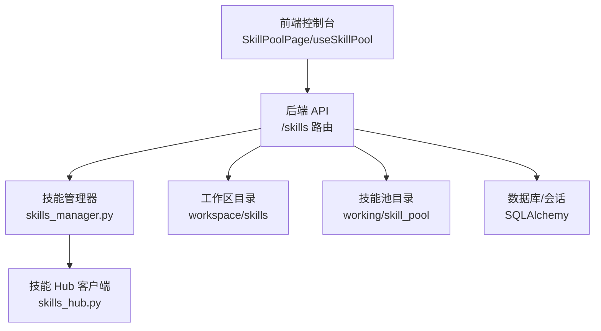
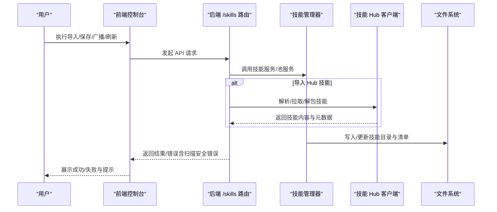
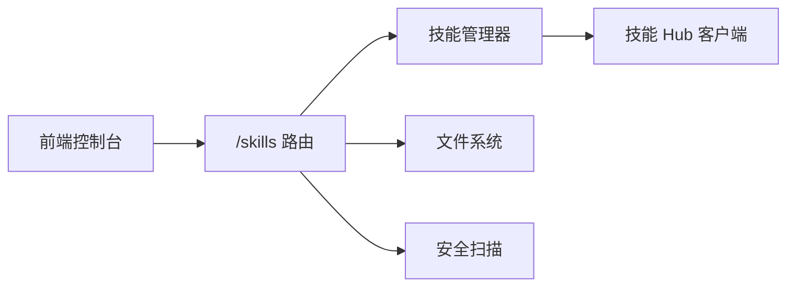

# 技能池管理

<cite>
**本文引用的文件**
- [SkillPoolPage 组件](file://console/src/pages/Settings/SkillPool/index.tsx)
- [技能池状态与交互逻辑](file://console/src/pages/Settings/SkillPool/useSkillPool.tsx)
- [技能 API 封装](file://console/src/api/modules/skill.ts)
- [技能池清单示例](file://working/skill_pool/skill.json)
- [技能 Hub 客户端](file://src/copaw/agents/skills_hub.py)
- [技能管理器](file://src/copaw/agents/skills_manager.py)
- [技能路由（FastAPI）](file://src/copaw/app/routers/skills.py)
- [企业技能商店路由](file://src/copaw/app/routers/skill_store.py)
</cite>

## 目录
1. [简介](#简介)
2. [项目结构](#项目结构)
3. [核心组件](#核心组件)
4. [架构总览](#架构总览)
5. [详细组件分析](#详细组件分析)
6. [依赖分析](#依赖分析)
7. [性能考量](#性能考量)
8. [故障排查指南](#故障排查指南)
9. [结论](#结论)
10. [附录](#附录)

## 简介
本指南面向 CoPaw 技能池管理的使用者与维护者，系统讲解如何在前端控制台中进行技能池的配置与管理，涵盖内置技能的启用/禁用/更新、导入/导出/同步、分类与标签、搜索过滤、版本与依赖、冲突处理、共享与广播、批量操作、开发者配置与权限、以及备份恢复与迁移等。文档同时给出前后端交互流程图与关键实现位置，帮助读者快速定位与扩展。

## 项目结构
技能池管理由“前端控制台 + 后端 API + 技能服务层”三层构成：
- 前端控制台：提供技能池列表、卡片/列表视图、筛选、批量操作、导入导出、广播分发、编辑保存、内置技能导入等界面与交互。
- 后端 API：提供技能池清单查询、刷新、内置来源列举、批量导入、下载到工作区、上传 ZIP、标签/配置更新、安全扫描错误标准化等接口。
- 技能服务层：负责技能清单解析、签名校验、冲突建议、ZIP 校验与解压、内置技能签名缓存、广播下载冲突处理、环境变量注入等。

图表来源
- [SkillPoolPage 组件:30-290](file://console/src/pages/Settings/SkillPool/index.tsx#L30-L290)
- [技能池状态与交互逻辑:1-806](file://console/src/pages/Settings/SkillPool/useSkillPool.tsx#L1-L806)
- [技能路由（FastAPI）:62-800](file://src/copaw/app/routers/skills.py#L62-L800)
- [技能管理器:1-800](file://src/copaw/agents/skills_manager.py#L1-L800)
- [技能 Hub 客户端:1-800](file://src/copaw/agents/skills_hub.py#L1-L800)

章节来源
- [SkillPoolPage 组件:30-290](file://console/src/pages/Settings/SkillPool/index.tsx#L30-L290)
- [技能池状态与交互逻辑:1-806](file://console/src/pages/Settings/SkillPool/useSkillPool.tsx#L1-L806)
- [技能路由（FastAPI）:62-800](file://src/copaw/app/routers/skills.py#L62-L800)

## 核心组件
- 前端页面与状态
  - 技能池页面组件：提供刷新、广播、导入内置、上传 ZIP、导入 Hub、批量操作、视图切换、搜索与筛选、卡片/列表展示等。
  - 技能池状态钩子：封装加载、刷新、导入、保存、删除、广播、批量删除、冲突重命名弹窗、表单校验等逻辑。
- 后端 API
  - 技能池清单与刷新、内置来源、批量导入、下载到工作区、上传 ZIP、标签/配置更新、Hub 安装任务等。
- 技能服务层
  - 技能清单读写、签名计算、冲突建议、ZIP 校验、内置签名缓存、广播下载冲突处理、环境变量注入等。

章节来源
- [SkillPoolPage 组件:30-290](file://console/src/pages/Settings/SkillPool/index.tsx#L30-L290)
- [技能池状态与交互逻辑:1-806](file://console/src/pages/Settings/SkillPool/useSkillPool.tsx#L1-L806)
- [技能路由（FastAPI）:62-800](file://src/copaw/app/routers/skills.py#L62-L800)
- [技能管理器:1-800](file://src/copaw/agents/skills_manager.py#L1-L800)

## 架构总览
下图展示从用户操作到后端处理与存储的关键流程：

图表来源
- [技能池状态与交互逻辑:108-147](file://console/src/pages/Settings/SkillPool/useSkillPool.tsx#L108-L147)
- [技能路由（FastAPI）:582-641](file://src/copaw/app/routers/skills.py#L582-L641)
- [技能 Hub 客户端:553-636](file://src/copaw/agents/skills_hub.py#L553-L636)
- [技能管理器:293-375](file://src/copaw/agents/skills_manager.py#L293-L375)

## 详细组件分析

### 1) 技能池页面与交互（前端）
- 功能要点
  - 列表/卡片视图切换、搜索与标签筛选、批量选择与批量删除。
  - 刷新技能池、导入内置、上传 ZIP、导入 Hub、创建/编辑技能抽屉、广播到工作区。
  - 标签与配置的增删改、AI 优化流式返回（前端接收）。
- 关键实现位置
  - 页面布局与工具栏、模态框与抽屉：[SkillPoolPage 组件:30-290](file://console/src/pages/Settings/SkillPool/index.tsx#L30-L290)
  - 加载/刷新/导入/保存/删除/广播/批量删除/冲突重命名：[技能池状态与交互逻辑:108-746](file://console/src/pages/Settings/SkillPool/useSkillPool.tsx#L108-L746)
  - API 调用封装与缓存失效：[技能 API 封装:34-61](file://console/src/api/modules/skill.ts#L34-L61)

章节来源
- [SkillPoolPage 组件:30-290](file://console/src/pages/Settings/SkillPool/index.tsx#L30-L290)
- [技能池状态与交互逻辑:108-746](file://console/src/pages/Settings/SkillPool/useSkillPool.tsx#L108-L746)
- [技能 API 封装:34-61](file://console/src/api/modules/skill.ts#L34-L61)

### 2) 技能池清单与版本管理（后端）
- 清单结构
  - 技能池清单包含 schema 版本、版本号、技能条目集合、内置技能名称列表等。
  - 条目字段包括名称、描述、版本文本、签名、来源、受保护标记、系统需求、更新时间等。
- 版本与同步
  - 支持内置技能来源识别与“内置/自定义”分类，内置签名缓存用于检测是否需要升级。
  - 广播下载时区分“内置升级”与普通冲突，并提供覆盖策略。
- 关键实现位置
  - 清单示例：[技能池清单示例:1-370](file://working/skill_pool/skill.json#L1-L370)
  - 清单读写与签名计算、冲突建议、ZIP 校验：[技能管理器:377-525](file://src/copaw/agents/skills_manager.py#L377-L525)
  - 内置签名缓存与分类：[技能管理器:97-117](file://src/copaw/agents/skills_manager.py#L97-L117)

章节来源
- [技能池清单示例:1-370](file://working/skill_pool/skill.json#L1-L370)
- [技能管理器:97-117](file://src/copaw/agents/skills_manager.py#L97-L117)
- [技能管理器:377-525](file://src/copaw/agents/skills_manager.py#L377-L525)

### 3) 导入/导出与同步（Hub/ZIP/工作区）
- 导入内置技能
  - 列举内置来源、批量导入、冲突处理（覆盖或建议重命名）。
- 导入 Hub 技能
  - 搜索 Hub、发起安装任务、轮询状态、取消安装、安全扫描错误标准化。
- 上传 ZIP
  - 校验类型与大小、解压、冲突处理、可选启用与目标名/重命名映射。
- 下载到工作区（广播）
  - 从技能池批量下载到多个工作区，处理内置升级与普通冲突，支持覆盖。
- 关键实现位置
  - 前端导入/保存/广播流程：[技能池状态与交互逻辑:392-391](file://console/src/pages/Settings/SkillPool/useSkillPool.tsx#L392-L391)
  - 后端 Hub 安装任务与状态：[技能路由（FastAPI）:582-641](file://src/copaw/app/routers/skills.py#L582-L641)
  - Hub 客户端：[技能 Hub 客户端:553-636](file://src/copaw/agents/skills_hub.py#L553-L636)
  - ZIP 上传与冲突处理：[技能路由（FastAPI）:698-744](file://src/copaw/app/routers/skills.py#L698-L744)
  - 广播下载与冲突处理：[技能路由（FastAPI）:180-185](file://src/copaw/app/routers/skills.py#L180-L185)

章节来源
- [技能池状态与交互逻辑:392-391](file://console/src/pages/Settings/SkillPool/useSkillPool.tsx#L392-L391)
- [技能路由（FastAPI）:582-641](file://src/copaw/app/routers/skills.py#L582-L641)
- [技能 Hub 客户端:553-636](file://src/copaw/agents/skills_hub.py#L553-L636)
- [技能路由（FastAPI）:698-744](file://src/copaw/app/routers/skills.py#L698-L744)
- [技能路由（FastAPI）:180-185](file://src/copaw/app/routers/skills.py#L180-L185)

### 4) 分类、标签与搜索过滤
- 标签与分类
  - 技能条目支持 tags 字段；前端聚合所有标签并提供多选筛选。
  - 支持为技能设置/更新标签与配置。
- 搜索与过滤
  - 支持按关键词与标签组合搜索；支持展开/收起过滤面板。
- 关键实现位置
  - 标签聚合与筛选：[技能池状态与交互逻辑:65-73](file://console/src/pages/Settings/SkillPool/useSkillPool.tsx#L65-L73)
  - 更新标签/配置：[技能 API 封装:401-408](file://console/src/api/modules/skill.ts#L401-L408)

章节来源
- [技能池状态与交互逻辑:65-73](file://console/src/pages/Settings/SkillPool/useSkillPool.tsx#L65-L73)
- [技能 API 封装:401-408](file://console/src/api/modules/skill.ts#L401-L408)

### 5) 版本管理与依赖处理
- 版本与签名
  - 技能条目包含 version_text、commit_text、signature 等，用于版本识别与一致性校验。
  - 内置技能签名缓存，用于判断是否需要升级。
- 依赖声明
  - metadata.requires 支持 bins/env 两类依赖，运行时可注入环境变量。
- 关键实现位置
  - 版本提取与签名构建：[技能管理器:248-290](file://src/copaw/agents/skills_manager.py#L248-L290)
  - 内置签名缓存：[技能管理器:97-117](file://src/copaw/agents/skills_manager.py#L97-L117)
  - 依赖解析与环境变量注入：[技能管理器:542-624](file://src/copaw/agents/skills_manager.py#L542-L624)

章节来源
- [技能管理器:248-290](file://src/copaw/agents/skills_manager.py#L248-L290)
- [技能管理器:97-117](file://src/copaw/agents/skills_manager.py#L97-L117)
- [技能管理器:542-624](file://src/copaw/agents/skills_manager.py#L542-L624)

### 6) 冲突解决与安全扫描
- 冲突类型
  - 名称冲突（建议重命名）、内置升级（可覆盖）、ZIP/Hub 导入冲突。
- 处理流程
  - 前端弹窗提示与重命名映射；后端返回冲突详情，支持覆盖或重新导入。
- 安全扫描
  - 导入/保存/广播均可能触发扫描，失败时返回标准化错误结构（含严重级别与发现项）。
- 关键实现位置
  - 冲突建议与重命名：[技能管理器:748-769](file://src/copaw/agents/skills_manager.py#L748-L769)
  - 广播冲突处理与覆盖：[技能池状态与交互逻辑:248-390](file://console/src/pages/Settings/SkillPool/useSkillPool.tsx#L248-L390)
  - 扫描错误标准化：[技能路由（FastAPI）:68-108](file://src/copaw/app/routers/skills.py#L68-L108)

章节来源
- [技能管理器:748-769](file://src/copaw/agents/skills_manager.py#L748-L769)
- [技能池状态与交互逻辑:248-390](file://console/src/pages/Settings/SkillPool/useSkillPool.tsx#L248-L390)
- [技能路由（FastAPI）:68-108](file://src/copaw/app/routers/skills.py#L68-L108)

### 7) 共享、广播与批量操作
- 共享与广播
  - 从技能池选择技能，广播到一个或多个工作区；支持覆盖与重命名映射。
- 批量操作
  - 批量启用/禁用（工作区侧）、批量删除（技能池侧）。
- 关键实现位置
  - 广播流程与覆盖策略：[技能池状态与交互逻辑:248-390](file://console/src/pages/Settings/SkillPool/useSkillPool.tsx#L248-L390)
  - 批量删除：[技能池状态与交互逻辑:700-746](file://console/src/pages/Settings/SkillPool/useSkillPool.tsx#L700-L746)
  - 后端广播下载请求模型：[技能路由（FastAPI）:180-185](file://src/copaw/app/routers/skills.py#L180-L185)

章节来源
- [技能池状态与交互逻辑:248-390](file://console/src/pages/Settings/SkillPool/useSkillPool.tsx#L248-L390)
- [技能池状态与交互逻辑:700-746](file://console/src/pages/Settings/SkillPool/useSkillPool.tsx#L700-L746)
- [技能路由（FastAPI）:180-185](file://src/copaw/app/routers/skills.py#L180-L185)

### 8) 开发者配置、API 访问控制与权限
- 配置注入
  - 通过环境变量注入技能配置，满足 require_envs 声明；提供完整 JSON 配置变量。
- 访问控制
  - 后端基于 FastAPI 路由与依赖注入，结合会话/认证中间件进行访问控制。
- 关键实现位置
  - 环境变量注入与释放：[技能管理器:666-711](file://src/copaw/agents/skills_manager.py#L666-L711)
  - 路由与依赖：[技能路由（FastAPI）:62-63](file://src/copaw/app/routers/skills.py#L62-L63)

章节来源
- [技能管理器:666-711](file://src/copaw/agents/skills_manager.py#L666-L711)
- [技能路由（FastAPI）:62-63](file://src/copaw/app/routers/skills.py#L62-L63)

### 9) 数据保护：备份、恢复与迁移
- 回滚机制
  - 工作区技能变更前快照，失败时可回滚至备份。
- 迁移与同步
  - 技能池与工作区之间通过广播/下载进行同步；内置技能通过“内置槽位”保持意图。
- 关键实现位置
  - 快照与回滚：[技能路由（FastAPI）:260-309](file://src/copaw/app/routers/skills.py#L260-L309)
  - 内置槽位与来源分类：[技能管理器:417-446](file://src/copaw/agents/skills_manager.py#L417-L446)

章节来源
- [技能路由（FastAPI）:260-309](file://src/copaw/app/routers/skills.py#L260-L309)
- [技能管理器:417-446](file://src/copaw/agents/skills_manager.py#L417-L446)

## 依赖分析
- 前端依赖
  - 控制台页面依赖 API 模块与本地状态钩子；API 模块内部实现缓存与错误处理。
- 后端依赖
  - 路由依赖技能管理器与 Hub 客户端；技能管理器依赖文件系统与安全扫描模块。
- 外部集成
  - 技能 Hub 提供搜索、版本与文件拉取能力；ZIP 上传受内容类型与大小限制。

图表来源
- [技能路由（FastAPI）:62-800](file://src/copaw/app/routers/skills.py#L62-L800)
- [技能管理器:1-800](file://src/copaw/agents/skills_manager.py#L1-L800)
- [技能 Hub 客户端:1-800](file://src/copaw/agents/skills_hub.py#L1-L800)

章节来源
- [技能路由（FastAPI）:62-800](file://src/copaw/app/routers/skills.py#L62-L800)
- [技能管理器:1-800](file://src/copaw/agents/skills_manager.py#L1-L800)
- [技能 Hub 客户端:1-800](file://src/copaw/agents/skills_hub.py#L1-L800)

## 性能考量
- 前端渲染
  - 技能池采用渐进渲染与视图切换，避免大数据量一次性渲染带来的卡顿。
- 缓存策略
  - 前端对 /skills 与 /skills/pool 等接口做短 TTL 缓存，刷新时主动失效。
- I/O 与并发
  - ZIP 上传与 Hub 安装采用异步任务与锁，避免竞态；文件写入使用原子替换与锁文件。
- 安全扫描
  - 导入/保存/广播均可能触发扫描，建议在后台任务中执行并提供状态轮询。

章节来源
- [技能池状态与交互逻辑:108-147](file://console/src/pages/Settings/SkillPool/useSkillPool.tsx#L108-L147)
- [技能路由（FastAPI）:318-350](file://src/copaw/app/routers/skills.py#L318-L350)
- [技能管理器:352-375](file://src/copaw/agents/skills_manager.py#L352-L375)

## 故障排查指南
- 常见错误与处理
  - ZIP 文件过大/类型不正确：检查上传限制与内容类型。
  - 冲突与重命名：根据建议重命名或覆盖；内置升级需确认覆盖。
  - Hub 安装失败：查看任务状态与错误详情，必要时取消并重试。
  - 安全扫描失败：根据扫描结果修正风险项后再导入。
- 建议步骤
  - 先刷新技能池与工作区清单，再尝试导入/广播。
  - 对于批量操作，先预览影响范围，再执行。
  - 出现异常时，查看前端提示与后端返回的标准化错误结构。

章节来源
- [技能路由（FastAPI）:352-372](file://src/copaw/app/routers/skills.py#L352-L372)
- [技能路由（FastAPI）:440-471](file://src/copaw/app/routers/skills.py#L440-L471)
- [技能池状态与交互逻辑:577-652](file://console/src/pages/Settings/SkillPool/useSkillPool.tsx#L577-L652)

## 结论
CoPaw 技能池管理通过清晰的前后端分工与完善的错误处理机制，提供了从导入、编辑、广播到批量操作与安全扫描的全链路能力。内置技能的签名与升级策略确保了稳定性与可维护性；ZIP 与 Hub 的双通道导入满足不同场景需求；标签与搜索提升了组织效率；回滚与原子写入保障了数据安全。建议在团队协作中规范标签与版本策略，配合安全扫描与备份机制，持续提升技能池的可靠性与可演进性。

## 附录
- 企业技能商店
  - 提供企业级技能发现与安装到指定工作区的能力，便于集中治理与分发。
- 关键实现位置
  - 企业技能商店路由：[企业技能商店路由:1-73](file://src/copaw/app/routers/skill_store.py#L1-L73)

章节来源
- [企业技能商店路由:1-73](file://src/copaw/app/routers/skill_store.py#L1-L73)