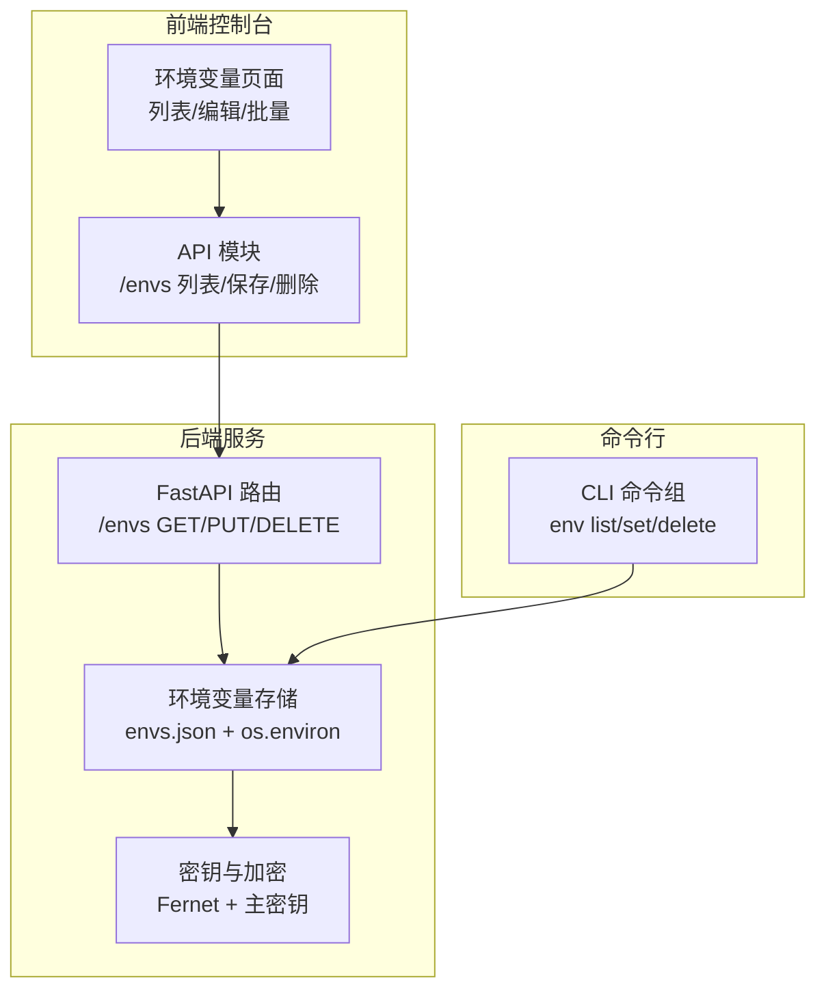
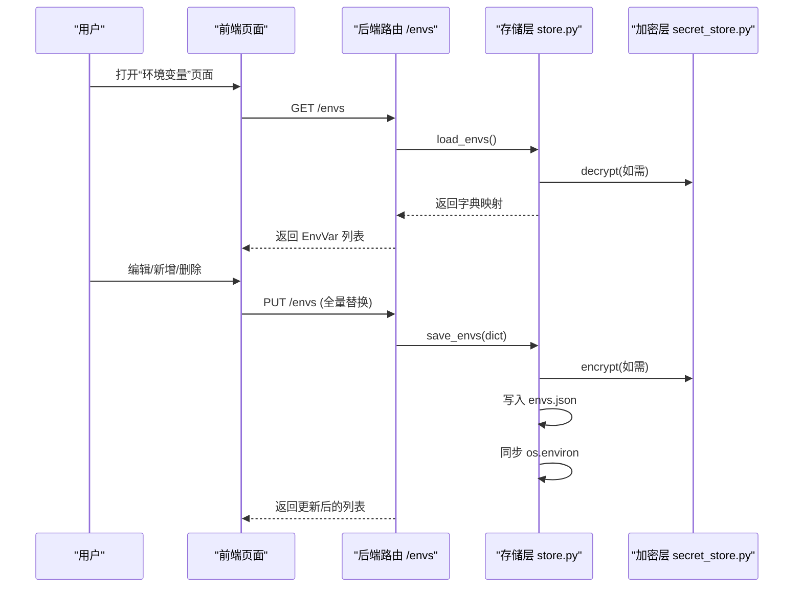
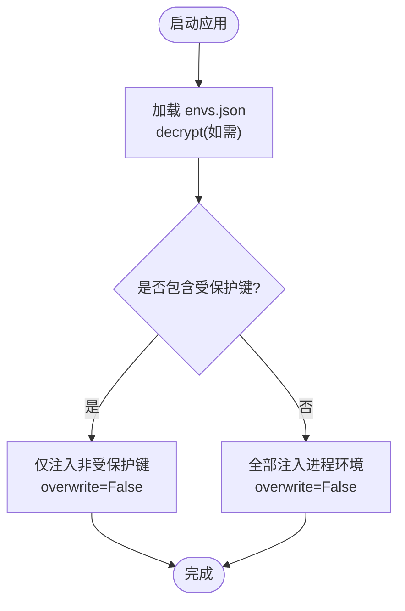
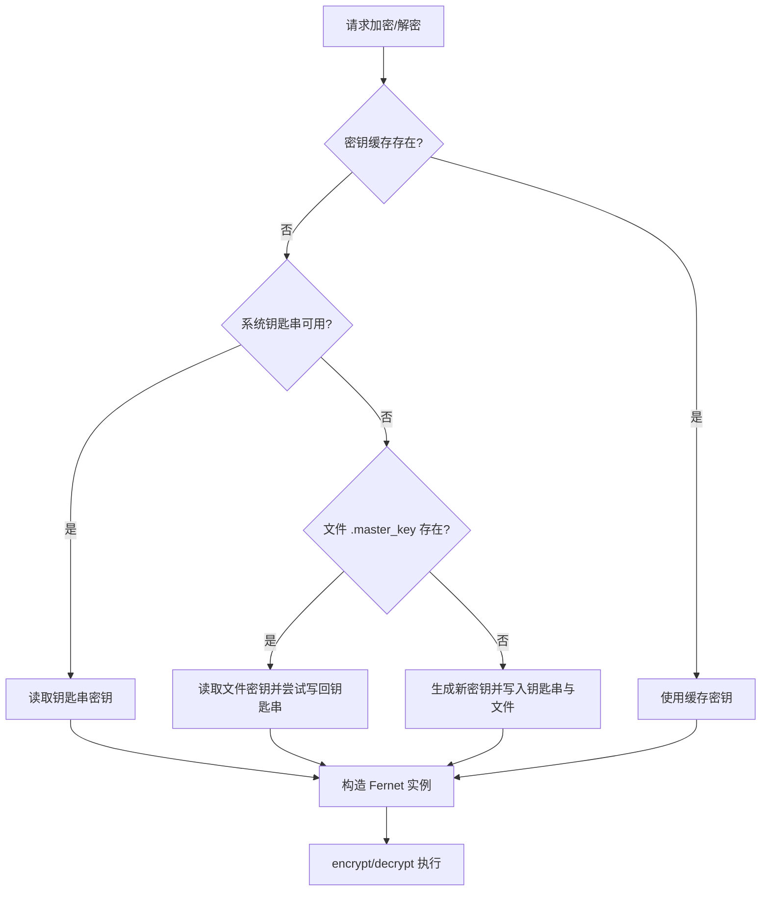
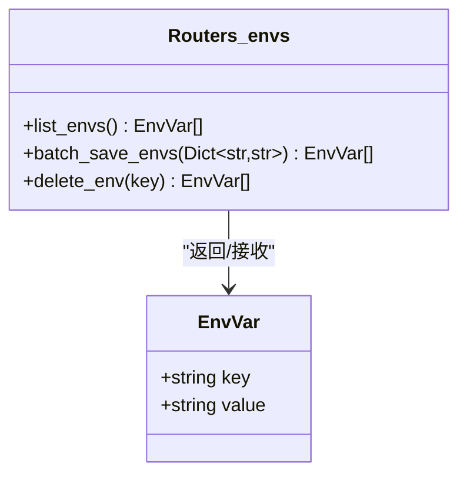
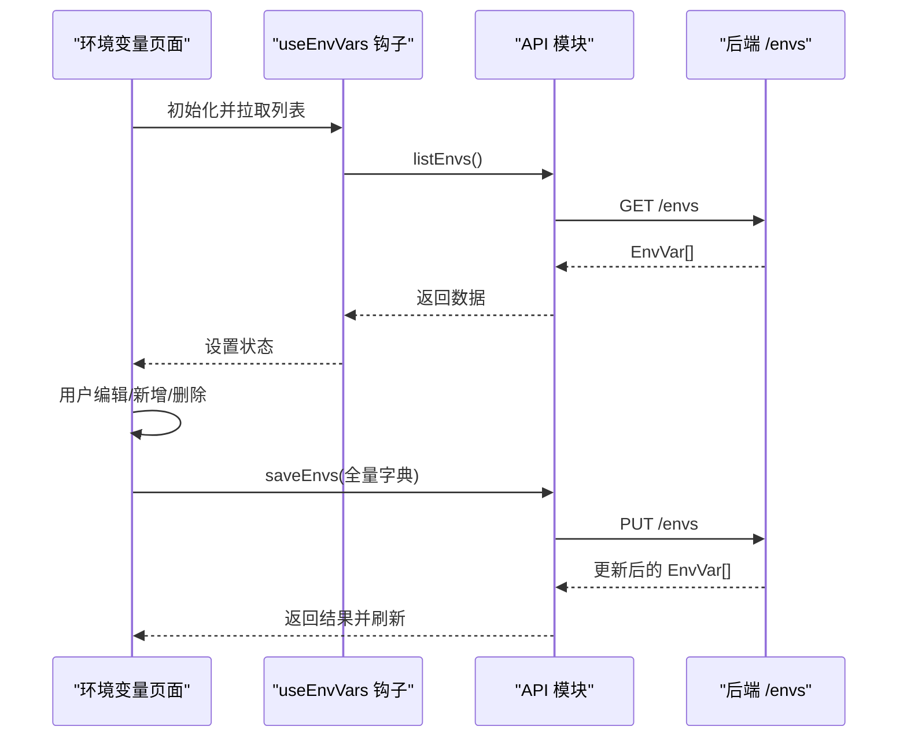
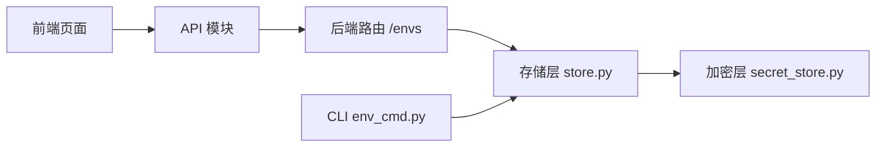

# 环境变量管理

<cite>
**本文引用的文件**
- [src\copaw\envs\store.py](file://src\copaw\envs\store.py)
- [src\copaw\app\routers\envs.py](file://src\copaw\app\routers\envs.py)
- [src\copaw\cli\env_cmd.py](file://src\copaw\cli\env_cmd.py)
- [src\copaw\security\secret_store.py](file://src\copaw\security\secret_store.py)
- [console\src\api\modules\env.ts](file://console\src\api\modules\env.ts)
- [console\src\api\types\env.ts](file://console\src\api\types\env.ts)
- [console\src\pages\Settings\Environments\index.tsx](file://console\src\pages\Settings\Environments\index.tsx)
- [console\src\pages\Settings\Environments\useEnvVars.ts](file://console\src\pages\Settings\Environments\useEnvVars.ts)
</cite>

## 目录
1. [简介](#简介)
2. [项目结构](#项目结构)
3. [核心组件](#核心组件)
4. [架构总览](#架构总览)
5. [详细组件分析](#详细组件分析)
6. [依赖分析](#依赖分析)
7. [性能考虑](#性能考虑)
8. [故障排查指南](#故障排查指南)
9. [结论](#结论)
10. [附录](#附录)

## 简介
本指南面向 CoPaw 的环境变量管理系统，覆盖从后端存储与加密、到 Web 控制台与 CLI 的完整使用路径。内容包括：
- 环境变量的添加、编辑、删除、批量保存与全量替换
- 命名规则、值格式与作用域约束
- 分类管理、搜索过滤、排序等使用建议
- 导入导出、备份恢复、版本管理的数据保护策略
- 不同环境（开发、测试、生产）的配置差异与最佳实践
- 常见配置错误的排查与解决

## 项目结构
围绕“环境变量”主题，系统由以下层次构成：
- 后端 API：提供列表、批量保存、删除等接口
- 存储层：以 JSON 文件持久化，并对敏感值进行透明加解密
- 安全层：主密钥管理与 Fernet 加解密
- 前端控制台：可视化编辑、校验、批量操作
- CLI：命令行增删查改与交互式配置

图表来源
- [console\src\pages\Settings\Environments\index.tsx:30-326](file://console\src\pages\Settings\Environments\index.tsx#L30-L326)
- [console\src\api\modules\env.ts:1-19](file://console\src\api\modules\env.ts#L1-L19)
- [src\copaw\app\routers\envs.py:1-81](file://src\copaw\app\routers\envs.py#L1-L81)
- [src\copaw\envs\store.py:1-274](file://src\copaw\envs\store.py#L1-L274)
- [src\copaw\security\secret_store.py:1-285](file://src\copaw\security\secret_store.py#L1-L285)
- [src\copaw\cli\env_cmd.py:1-99](file://src\copaw\cli\env_cmd.py#L1-L99)

章节来源
- [src\copaw\envs\store.py:1-274](file://src\copaw\envs\store.py#L1-L274)
- [src\copaw\app\routers\envs.py:1-81](file://src\copaw\app\routers\envs.py#L1-L81)
- [src\copaw\cli\env_cmd.py:1-99](file://src\copaw\cli\env_cmd.py#L1-L99)
- [src\copaw\security\secret_store.py:1-285](file://src\copaw\security\secret_store.py#L1-L285)
- [console\src\api\modules\env.ts:1-19](file://console\src\api\modules\env.ts#L1-L19)
- [console\src\api\types\env.ts:1-5](file://console\src\api\types\env.ts#L1-L5)
- [console\src\pages\Settings\Environments\index.tsx:1-326](file://console\src\pages\Settings\Environments\index.tsx#L1-L326)
- [console\src\pages\Settings\Environments\useEnvVars.ts:1-34](file://console\src\pages\Settings\Environments\useEnvVars.ts#L1-L34)

## 核心组件
- 存储与同步
  - 两层持久化策略：envs.json（磁盘持久）与 os.environ（进程注入）
  - 启动时仅注入非受保护键，避免覆盖运行时显式设置
- 加密与安全
  - 敏感值统一以 ENC: 前缀加密存储；首次访问自动迁移明文
  - 主密钥支持系统钥匙串或文件落盘，双重容错
- API 与前端
  - 列表、批量保存（全量替换）、按键删除
  - 前端提供本地编辑、校验、批量选择与删除
- CLI
  - list、set、delete 三类命令；支持交互式配置

章节来源
- [src\copaw\envs\store.py:1-274](file://src\copaw\envs\store.py#L1-L274)
- [src\copaw\security\secret_store.py:1-285](file://src\copaw\security\secret_store.py#L1-L285)
- [src\copaw\app\routers\envs.py:1-81](file://src\copaw\app\routers\envs.py#L1-L81)
- [console\src\api\modules\env.ts:1-19](file://console\src\api\modules\env.ts#L1-L19)
- [console\src\pages\Settings\Environments\index.tsx:1-326](file://console\src\pages\Settings\Environments\index.tsx#L1-L326)
- [src\copaw\cli\env_cmd.py:1-99](file://src\copaw\cli\env_cmd.py#L1-L99)

## 架构总览
下图展示从用户操作到数据落盘与进程注入的完整链路。

图表来源
- [console\src\pages\Settings\Environments\index.tsx:230-251](file://console\src\pages\Settings\Environments\index.tsx#L230-L251)
- [console\src\api\modules\env.ts:7-12](file://console\src\api\modules\env.ts#L7-L12)
- [src\copaw\app\routers\envs.py:43-63](file://src\copaw\app\routers\envs.py#L43-L63)
- [src\copaw\envs\store.py:194-232](file://src\copaw\envs\store.py#L194-L232)
- [src\copaw\security\secret_store.py:207-241](file://src\copaw\security\secret_store.py#L207-L241)

## 详细组件分析

### 存储与同步（store.py）
- 关键职责
  - 读写 envs.json 并透明处理加密/解密
  - 将非受保护键注入当前进程 os.environ，且不覆盖已存在的运行时键
  - 提供单键 set/delete 与全量 save/load 接口
- 数据保护
  - 旧版明文自动迁移为加密存储
  - 文件权限严格限制（父目录 0700，文件 0600）
- 受保护键
  - COPAW_WORKING_DIR、COPAW_SECRET_DIR 不注入进程环境，防止被覆盖

图表来源
- [src\copaw\envs\store.py:253-274](file://src\copaw\envs\store.py#L253-L274)
- [src\copaw\envs\store.py:95-102](file://src\copaw\envs\store.py#L95-L102)

章节来源
- [src\copaw\envs\store.py:1-274](file://src\copaw\envs\store.py#L1-L274)

### 加密与密钥管理（secret_store.py）
- 主密钥来源与顺序
  - 进程缓存 → 系统钥匙串 → 文件 .master_key → 生成新密钥
- 加解密
  - 使用 Fernet(AES-128-CBC + HMAC-SHA256)，密文带 ENC: 前缀
  - 解密失败时返回原文，保证降级可用
- 性能与并发
  - 双重检查锁确保多线程安全初始化
  - 结果缓存减少重复计算

图表来源
- [src\copaw\security\secret_store.py:148-182](file://src\copaw\security\secret_store.py#L148-L182)
- [src\copaw\security\secret_store.py:207-241](file://src\copaw\security\secret_store.py#L207-L241)

章节来源
- [src\copaw\security\secret_store.py:1-285](file://src\copaw\security\secret_store.py#L1-L285)

### 后端 API（routers/envs.py）
- 接口定义
  - GET /envs：返回所有环境变量（按键排序）
  - PUT /envs：全量替换（空键拒绝），清理前后空格
  - DELETE /envs/{key}：删除指定键（未找到返回 404）
- 数据模型
  - EnvVar：key、value 字段

图表来源
- [src\copaw\app\routers\envs.py:20-25](file://src\copaw\app\routers\envs.py#L20-L25)
- [src\copaw\app\routers\envs.py:32-81](file://src\copaw\app\routers\envs.py#L32-L81)

章节来源
- [src\copaw\app\routers\envs.py:1-81](file://src\copaw\app\routers\envs.py#L1-L81)

### 前端页面与交互（console/pages/Settings/Environments）
- 功能概览
  - 列表展示、本地编辑、新增/插入/删除行
  - 多选删除、整表保存、重置
  - 表单校验：键必填、合法命名、唯一性
- 交互流程
  - 保存前校验，通过后调用 PUT /envs 全量替换
  - 删除单个或多个变量，调用 DELETE /envs/{key}

图表来源
- [console\src\pages\Settings\Environments\index.tsx:30-326](file://console\src\pages\Settings\Environments\index.tsx#L30-L326)
- [console\src\pages\Settings\Environments\useEnvVars.ts:1-34](file://console\src\pages\Settings\Environments\useEnvVars.ts#L1-L34)
- [console\src\api\modules\env.ts:4-18](file://console\src\api\modules\env.ts#L4-L18)

章节来源
- [console\src\pages\Settings\Environments\index.tsx:1-326](file://console\src\pages\Settings\Environments\index.tsx#L1-L326)
- [console\src\pages\Settings\Environments\useEnvVars.ts:1-34](file://console\src\pages\Settings\Environments\useEnvVars.ts#L1-L34)
- [console\src\api\modules\env.ts:1-19](file://console\src\api\modules\env.ts#L1-L19)
- [console\src\api\types\env.ts:1-5](file://console\src\api\types\env.ts#L1-L5)

### CLI 工具（cli/env_cmd.py）
- 命令
  - env list：列出所有变量
  - env set KEY VALUE：设置单个变量
  - env delete KEY：删除单个变量
  - 交互式配置：逐项输入键值，支持继续添加
- 适用场景
  - 快速配置、自动化脚本、容器内无图形界面

章节来源
- [src\copaw\cli\env_cmd.py:1-99](file://src\copaw\cli\env_cmd.py#L1-L99)

## 依赖分析
- 组件耦合
  - 前端 API 模块仅依赖类型定义与通用请求封装
  - 后端路由依赖存储模块，存储模块依赖安全模块
  - CLI 直接依赖存储模块
- 外部依赖
  - 加密：cryptography.Fernet
  - 钥匙串：keyring（可选）
  - 文件系统：json、os、pathlib

图表来源
- [console\src\api\modules\env.ts:1-19](file://console\src\api\modules\env.ts#L1-L19)
- [src\copaw\app\routers\envs.py:1-81](file://src\copaw\app\routers\envs.py#L1-L81)
- [src\copaw\envs\store.py:1-274](file://src\copaw\envs\store.py#L1-L274)
- [src\copaw\security\secret_store.py:1-285](file://src\copaw\security\secret_store.py#L1-L285)
- [src\copaw\cli\env_cmd.py:1-99](file://src\copaw\cli\env_cmd.py#L1-L99)

章节来源
- [console\src\api\modules\env.ts:1-19](file://console\src\api\modules\env.ts#L1-L19)
- [src\copaw\app\routers\envs.py:1-81](file://src\copaw\app\routers\envs.py#L1-L81)
- [src\copaw\envs\store.py:1-274](file://src\copaw\envs\store.py#L1-L274)
- [src\copaw\security\secret_store.py:1-285](file://src\copaw\security\secret_store.py#L1-L285)
- [src\copaw\cli\env_cmd.py:1-99](file://src\copaw\cli\env_cmd.py#L1-L99)

## 性能考虑
- 存储层
  - 单次全量读写：复杂度 O(n)，n 为变量数量
  - 写入时先加密再落盘，I/O 成本与变量数量线性相关
- 注入进程环境
  - 仅在启动阶段同步一次，后续通过全量替换实现增量更新
- 加密层
  - 主密钥读取采用缓存与双重检查锁，避免重复初始化
  - Fernet 计算开销较小，适合高频读写场景

## 故障排查指南
- 常见问题与定位
  - 无法读取 envs.json
    - 检查文件是否存在、是否为常规文件、权限是否正确（0600）
    - 查看日志中关于 OS 错误的警告
  - 解密失败或返回原文
    - 可能为主密钥变更或数据损坏；确认钥匙串/文件密钥一致
  - 变量未注入进程环境
    - 确认键不在受保护集合内；确认运行时环境未显式覆盖
  - 保存后未生效
    - 确认调用 PUT /envs 成功；检查 os.environ 是否同步
- 操作建议
  - 在容器/CI/无桌面环境：确保主密钥可通过文件落盘方式读取
  - 对于敏感键（如 API 密钥），优先通过后端接口进行全量替换，避免明文暴露

章节来源
- [src\copaw\envs\store.py:163-191](file://src\copaw\envs\store.py#L163-L191)
- [src\copaw\envs\store.py:218-221](file://src\copaw\envs\store.py#L218-L221)
- [src\copaw\security\secret_store.py:223-235](file://src\copaw\security\secret_store.py#L223-L235)

## 结论
CoPaw 的环境变量系统以“磁盘持久 + 进程注入 + 透明加密”为核心设计，配合前后端一体化的可视化与 CLI 支持，实现了从开发到生产的全链路管理能力。遵循本文的命名与格式规范、数据保护策略与最佳实践，可有效降低配置风险并提升运维效率。

## 附录

### 环境变量命名规则与值格式
- 命名规则
  - 必须非空
  - 仅允许字母、数字、下划线，且必须以字母或下划线开头
  - 建议使用大写，单词间以下划线分隔（如 MY_VAR）
- 值格式
  - 任意字符串；建议对敏感信息使用后端加密存储
- 作用域范围
  - 进程环境：仅在当前进程及其子进程可见
  - 系统环境：可通过运行时显式覆盖
  - 受保护键：不会被注入进程环境，避免被覆盖

章节来源
- [console\src\pages\Settings\Environments\index.tsx:212-228](file://console\src\pages\Settings\Environments\index.tsx#L212-L228)
- [src\copaw\envs\store.py:95-102](file://src\copaw\envs\store.py#L95-L102)
- [src\copaw\envs\store.py:253-274](file://src\copaw\envs\store.py#L253-L274)

### 操作流程与最佳实践

- 添加/编辑
  - 前端：在表格中新增一行，填写键值后保存
  - CLI：使用 set 命令或交互式配置
- 删除
  - 前端：单个删除或批量删除；删除前会弹窗确认
  - CLI：使用 delete 命令
- 批量操作
  - 前端：整表保存即执行全量替换；支持多选删除
  - 后端：PUT /envs 会移除未提供的键
- 分类管理与搜索过滤
  - 当前实现未内置分类字段；可在键名中约定前缀进行逻辑分组
  - 排序：按键升序展示
- 导入导出与备份恢复
  - 导出：从 envs.json 中读取并复制
  - 导入：将目标字典写入 envs.json 并调用保存接口
  - 备份：定期复制 SECRET_DIR 下的 envs.json
  - 恢复：停止服务后替换 envs.json，重启后自动注入
- 版本管理
  - 建议结合外部版本控制系统管理 envs.json 的历史快照
- 不同环境差异
  - 开发：可使用本地文件密钥；允许临时明文调试
  - 测试：与开发一致，但应避免硬编码敏感信息
  - 生产：优先使用系统钥匙串；严格限制文件权限；最小化明文暴露面

章节来源
- [console\src\pages\Settings\Environments\index.tsx:157-208](file://console\src\pages\Settings\Environments\index.tsx#L157-L208)
- [console\src\api\modules\env.ts:7-12](file://console\src\api\modules\env.ts#L7-L12)
- [src\copaw\app\routers\envs.py:43-63](file://src\copaw\app\routers\envs.py#L43-L63)
- [src\copaw\envs\store.py:194-232](file://src\copaw\envs\store.py#L194-L232)
- [src\copaw\security\secret_store.py:46-69](file://src\copaw\security\secret_store.py#L46-L69)