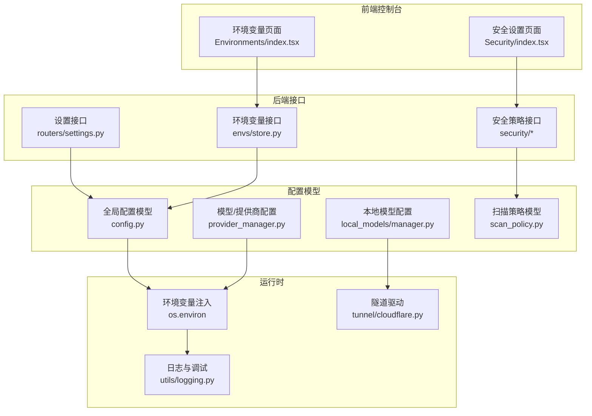
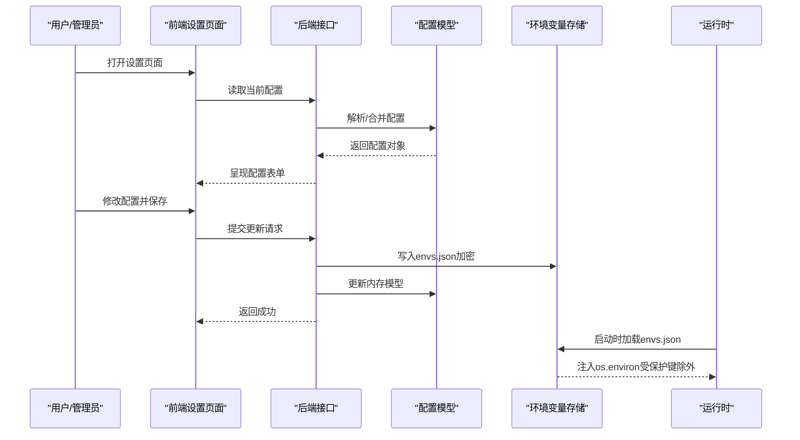
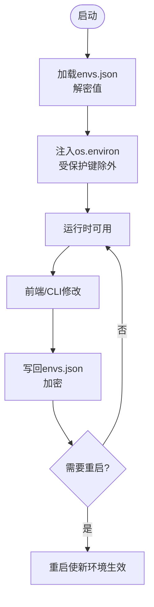
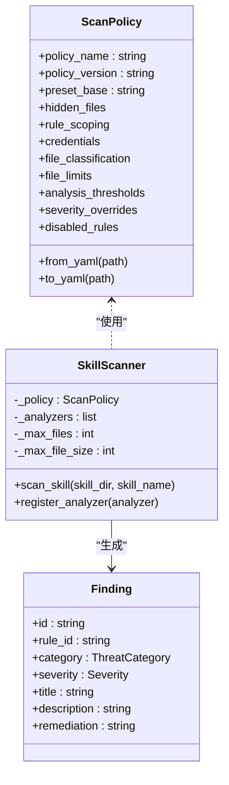
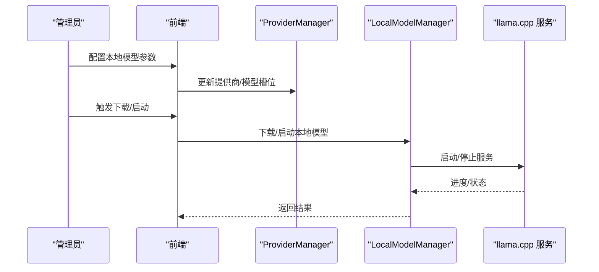
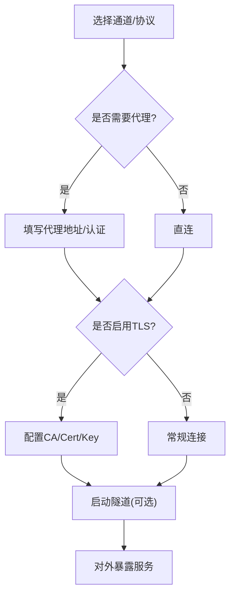
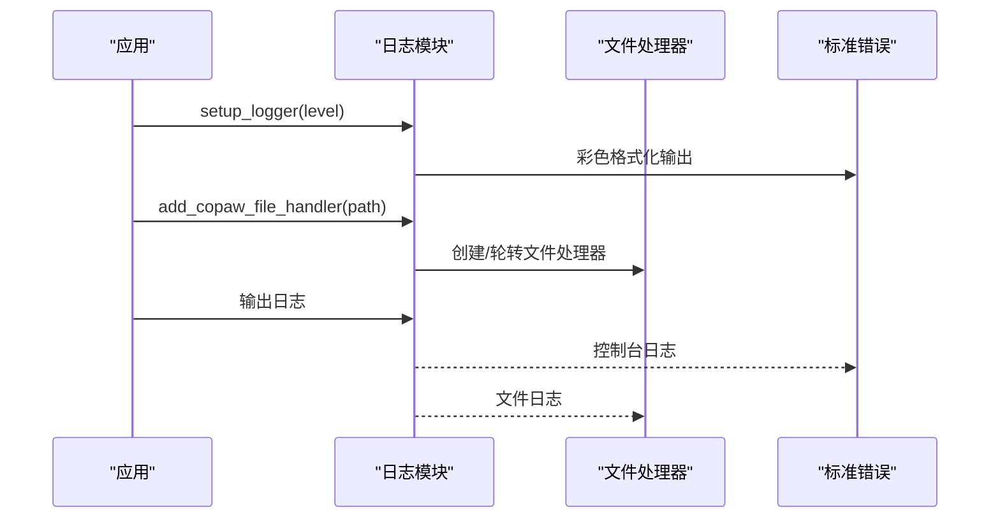
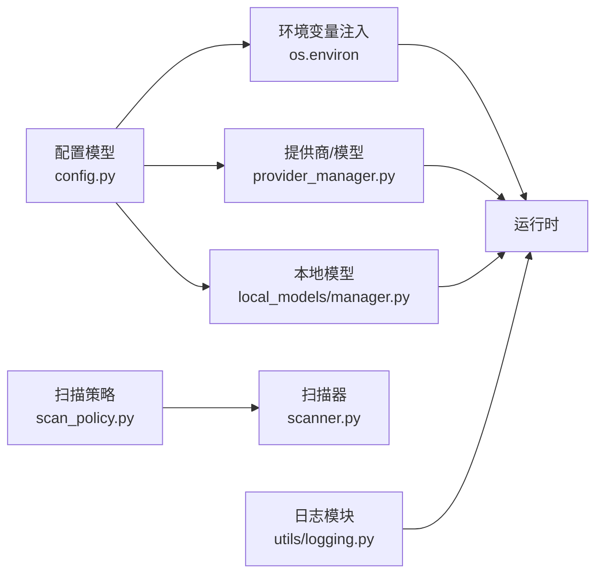

# 设置配置

<cite>
**本文引用的文件**
- [config.py](file://src/copaw/config/config.py)
- [store.py](file://src/copaw/envs/store.py)
- [scanner.py](file://src/copaw/security/skill_scanner/scanner.py)
- [scan_policy.py](file://src/copaw/security/skill_scanner/scan_policy.py)
- [default_policy.yaml](file://src/copaw/security/skill_scanner/data/default_policy.yaml)
- [models.py](file://src/copaw/security/skill_scanner/models.py)
- [logging.py](file://src/copaw/utils/logging.py)
- [manager.py](file://src/copaw/local_models/manager.py)
- [cloudflare.py](file://src/copaw/tunnel/cloudflare.py)
- [provider_manager.py](file://src/copaw/providers/provider_manager.py)
- [settings.py](file://src/copaw/app/routers/settings.py)
- [context.py](file://src/copaw/config/context.py)
- [env_cmd.py](file://src/copaw/cli/env_cmd.py)
- [index.tsx（环境变量）](file://console/src/pages/Settings/Environments/index.tsx)
- [index.tsx（安全设置）](file://console/src/pages/Settings/Security/index.tsx)
</cite>

## 目录
1. [简介](#简介)
2. [项目结构](#项目结构)
3. [核心组件](#核心组件)
4. [架构总览](#架构总览)
5. [详细组件分析](#详细组件分析)
6. [依赖分析](#依赖分析)
7. [性能考虑](#性能考虑)
8. [故障排查指南](#故障排查指南)
9. [结论](#结论)
10. [附录](#附录)

## 简介
本指南面向 CoPaw 用户与运维人员，系统性讲解如何进行系统设置与配置管理，覆盖以下主题：
- 全局与代理配置、网络与隧道、SSL 证书
- 环境变量管理（持久化、注入、加密）
- 安全策略配置（工具守卫、文件守卫、技能扫描规则）
- 语音转录与本地模型配置
- 日志级别、调试模式、性能监控
- 配置备份、恢复、导入导出
- 配置生效范围与重启要求
- 配置优化建议与常见问题

## 项目结构
CoPaw 的配置体系由“后端配置模型 + 前端设置页面 + CLI/HTTP 接口 + 环境变量持久化”构成，形成“模型定义—持久化—运行时注入”的闭环。

图示来源
- [config.py](file://src/copaw/config/config.py)
- [store.py](file://src/copaw/envs/store.py)
- [settings.py](file://src/copaw/app/routers/settings.py)
- [provider_manager.py](file://src/copaw/providers/provider_manager.py)
- [manager.py](file://src/copaw/local_models/manager.py)
- [scan_policy.py](file://src/copaw/security/skill_scanner/scan_policy.py)
- [cloudflare.py](file://src/copaw/tunnel/cloudflare.py)
- [logging.py](file://src/copaw/utils/logging.py)

章节来源
- [config.py](file://src/copaw/config/config.py)
- [store.py](file://src/copaw/envs/store.py)
- [settings.py](file://src/copaw/app/routers/settings.py)
- [provider_manager.py](file://src/copaw/providers/provider_manager.py)
- [manager.py](file://src/copaw/local_models/manager.py)
- [scan_policy.py](file://src/copaw/security/skill_scanner/scan_policy.py)
- [cloudflare.py](file://src/copaw/tunnel/cloudflare.py)
- [logging.py](file://src/copaw/utils/logging.py)

## 核心组件
- 全局配置模型：定义数据库、Redis、通道、心跳、嵌入、上下文压缩、工具结果压缩、记忆摘要、运行参数、LLM 路由等。
- 环境变量持久化与注入：以密文存储在秘密目录，启动时注入进程环境，支持 CLI 与前端编辑。
- 安全策略：工具守卫（内置/自定义规则）、文件守卫、技能扫描策略（可加载组织级 YAML）。
- 本地模型与隧道：本地模型最大上下文长度、下载与服务器生命周期管理；Cloudflare 隧道驱动。
- 日志与调试：统一日志命名空间、彩色输出、文件轮转、访问日志过滤。
- UI 设置：语言、主题等全局 UI 设置独立于代理配置。

章节来源
- [config.py](file://src/copaw/config/config.py)
- [store.py](file://src/copaw/envs/store.py)
- [scanner.py](file://src/copaw/security/skill_scanner/scanner.py)
- [scan_policy.py](file://src/copaw/security/skill_scanner/scan_policy.py)
- [models.py](file://src/copaw/security/skill_scanner/models.py)
- [logging.py](file://src/copaw/utils/logging.py)
- [manager.py](file://src/copaw/local_models/manager.py)
- [cloudflare.py](file://src/copaw/tunnel/cloudflare.py)
- [settings.py](file://src/copaw/app/routers/settings.py)

## 架构总览
下图展示“配置读取—持久化—运行时应用”的关键流程。

图示来源
- [index.tsx（环境变量）](file://console/src/pages/Settings/Environments/index.tsx)
- [index.tsx（安全设置）](file://console/src/pages/Settings/Security/index.tsx)
- [store.py](file://src/copaw/envs/store.py)
- [config.py](file://src/copaw/config/config.py)

## 详细组件分析

### 环境变量管理
- 存储位置与安全
  - envs.json 默认位于秘密目录（与工作目录分离），仅限运行用户访问权限。
  - 支持迁移旧路径，自动加密明文值。
- 注入策略
  - 启动时从 envs.json 加载并注入 os.environ，优先保留系统/进程已存在的同名变量。
  - 受保护键（如工作目录、秘密目录）不注入到进程环境。
- 编辑方式
  - 前端页面支持增删改查、批量保存、校验键名格式与重复。
  - CLI 提供 list/set/delete 交互式命令。
- 备份与恢复
  - 备份：直接复制秘密目录下的 envs.json。
  - 恢复：替换 envs.json 并重启服务，新值将被注入到进程环境。

图示来源
- [store.py](file://src/copaw/envs/store.py)
- [index.tsx（环境变量）](file://console/src/pages/Settings/Environments/index.tsx)
- [env_cmd.py](file://src/copaw/cli/env_cmd.py)

章节来源
- [store.py](file://src/copaw/envs/store.py)
- [index.tsx（环境变量）](file://console/src/pages/Settings/Environments/index.tsx)
- [env_cmd.py](file://src/copaw/cli/env_cmd.py)

### 安全策略配置
- 工具守卫（Tool Guard）
  - 开关、受保护工具列表、禁用工具列表、自定义规则集。
  - 规则支持按工具、参数、正则模式与排除模式组合，支持严重等级与修复建议。
- 文件守卫（File Guard）
  - 通过专用组件页进行配置与保存，支持保存/重置。
- 技能扫描（Skill Scanner）
  - 扫描器聚合多个分析器结果，支持策略化规则集、文件分类、阈值与去重。
  - 策略默认来自内置 YAML，可叠加组织级 YAML，支持导出/导入策略文件。

图示来源
- [scan_policy.py](file://src/copaw/security/skill_scanner/scan_policy.py)
- [scanner.py](file://src/copaw/security/skill_scanner/scanner.py)
- [models.py](file://src/copaw/security/skill_scanner/models.py)
- [default_policy.yaml](file://src/copaw/security/skill_scanner/data/default_policy.yaml)

章节来源
- [index.tsx（安全设置）](file://console/src/pages/Settings/Security/index.tsx)
- [scan_policy.py](file://src/copaw/security/skill_scanner/scan_policy.py)
- [scanner.py](file://src/copaw/security/skill_scanner/scanner.py)
- [models.py](file://src/copaw/security/skill_scanner/models.py)
- [default_policy.yaml](file://src/copaw/security/skill_scanner/data/default_policy.yaml)

### 语音转录与本地模型
- 语音转录
  - 语音通道配置包含 TTS/STT 提供商、语言、问候语等参数，用于语音消息处理。
- 本地模型
  - 本地运行时设置（如最大上下文长度）持久化在本地提供者目录，支持下载、服务器生命周期管理、进度查询与取消。
  - 本地模型推荐、下载进度、删除与服务器启停均通过统一管理器控制。

图示来源
- [config.py](file://src/copaw/config/config.py)
- [manager.py](file://src/copaw/local_models/manager.py)
- [provider_manager.py](file://src/copaw/providers/provider_manager.py)

章节来源
- [config.py](file://src/copaw/config/config.py)
- [manager.py](file://src/copaw/local_models/manager.py)
- [provider_manager.py](file://src/copaw/providers/provider_manager.py)

### 网络设置、代理与隧道
- 通用网络
  - 通道配置中包含 HTTP 代理与认证字段（如 Discord/TG），可用于上游 API 访问。
- 代理配置
  - 在对应通道配置中填写代理地址与认证信息；若使用企业代理，建议结合环境变量注入。
- SSL 证书
  - 通道 TLS 参数（如 MQTT/语音）支持 CA/Cert/Key 配置，满足私有部署场景。
- 隧道
  - Cloudflare Quick Tunnel 驱动负责启动/停止子进程、解析公网 URL、健康检查与错误处理。

图示来源
- [config.py](file://src/copaw/config/config.py)
- [cloudflare.py](file://src/copaw/tunnel/cloudflare.py)

章节来源
- [config.py](file://src/copaw/config/config.py)
- [cloudflare.py](file://src/copaw/tunnel/cloudflare.py)

### 日志级别、调试模式与性能监控
- 日志命名空间与级别
  - 仅输出 copaw.* 命名空间日志，避免第三方库噪声；支持从字符串映射为数值级别。
- 控制台与文件输出
  - 控制台彩色输出；在 macOS 使用轮转文件处理器，在 Windows/Linux 使用普通文件处理器。
- 访问日志过滤
  - 可按路径片段抑制特定访问日志，降低噪音。
- 性能监控
  - 结合 LLM 并发限制、速率限制与退避策略，减少 429/超时；通过日志观察延迟与失败率。

图示来源
- [logging.py](file://src/copaw/utils/logging.py)

章节来源
- [logging.py](file://src/copaw/utils/logging.py)

### 全局 UI 设置
- 语言设置
  - 保存在工作目录 settings.json，支持 en/zh/ja/ru。
- 主题等其他 UI 项
  - 通过相同机制持久化，独立于代理配置。

章节来源
- [settings.py](file://src/copaw/app/routers/settings.py)

### 配置生效范围与重启要求
- 环境变量
  - 新增/修改后立即注入到当前进程；对子进程同样可见；无需重启即可生效。
  - 对已启动且依赖旧值的服务，建议重启以确保一致性。
- 通道/代理/SSL
  - 通道配置变更通常即时生效；若涉及外部服务（如 MQTT/TLS），建议重启以确保握手参数正确。
- 本地模型
  - 更改最大上下文长度需重启服务器以应用新参数。
- 日志
  - 级别与文件处理器在运行时可动态调整；文件轮转策略在初始化阶段设定。

章节来源
- [store.py](file://src/copaw/envs/store.py)
- [config.py](file://src/copaw/config/config.py)
- [manager.py](file://src/copaw/local_models/manager.py)
- [logging.py](file://src/copaw/utils/logging.py)

### 配置备份、恢复与导入导出
- 备份
  - 环境变量：复制秘密目录中的 envs.json。
  - 安全策略：导出 scan_policy.yaml（含默认策略叠加）。
  - 本地模型：备份本地提供者目录与配置文件。
  - UI 设置：备份工作目录 settings.json。
- 恢复
  - 将备份文件放回原位，重启服务后生效。
- 导入导出
  - 环境变量：通过前端或 CLI 进行批量导入/导出。
  - 安全策略：使用策略 YAML 的 from_yaml/to_yaml 接口。

章节来源
- [store.py](file://src/copaw/envs/store.py)
- [scan_policy.py](file://src/copaw/security/skill_scanner/scan_policy.py)
- [settings.py](file://src/copaw/app/routers/settings.py)
- [manager.py](file://src/copaw/local_models/manager.py)

## 依赖分析
- 配置模型与运行时耦合
  - 全局配置模型与通道配置在运行时被注入到进程环境，影响工具函数与通道行为。
  - 本地模型管理器与隧道驱动作为运行时组件，依赖配置模型中的参数。
- 安全策略与扫描器
  - 扫描器依赖策略对象，策略可来自内置默认或组织 YAML；策略变更直接影响扫描结果。
- 日志模块
  - 仅对 copaw.* 命名空间输出，避免污染第三方日志；文件处理器与平台特性相关。

图示来源
- [config.py](file://src/copaw/config/config.py)
- [provider_manager.py](file://src/copaw/providers/provider_manager.py)
- [manager.py](file://src/copaw/local_models/manager.py)
- [scan_policy.py](file://src/copaw/security/skill_scanner/scan_policy.py)
- [scanner.py](file://src/copaw/security/skill_scanner/scanner.py)
- [logging.py](file://src/copaw/utils/logging.py)

章节来源
- [config.py](file://src/copaw/config/config.py)
- [provider_manager.py](file://src/copaw/providers/provider_manager.py)
- [manager.py](file://src/copaw/local_models/manager.py)
- [scan_policy.py](file://src/copaw/security/skill_scanner/scan_policy.py)
- [scanner.py](file://src/copaw/security/skill_scanner/scanner.py)
- [logging.py](file://src/copaw/utils/logging.py)

## 性能考虑
- LLM 并发与速率限制
  - 合理设置并发上限与 QPM，避免上游限流；启用退避与抖动，降低同时等待导致的抖动。
- 上下文压缩与记忆摘要
  - 启用上下文压缩与记忆摘要可显著降低长对话开销；根据业务调优触发阈值与保留比例。
- 工具结果压缩
  - 控制近期/历史字节阈值与保留天数，平衡检索质量与存储成本。
- 日志级别
  - 生产环境建议 INFO 或以上，避免 DEBUG 带来的 IO 压力；必要时临时提升以定位问题。

## 故障排查指南
- 环境变量未生效
  - 检查是否为受保护键；确认启动时已调用注入逻辑；查看进程环境是否被系统变量覆盖。
- 代理/SSL 连接失败
  - 校验代理地址与认证；确认证书链完整；对通道 TLS 参数逐项核对。
- 技能扫描误报/漏报
  - 调整策略中的文件分类、阈值与规则禁用/覆盖；必要时导出策略进行组织级定制。
- 本地模型启动异常
  - 查看下载进度与服务器状态；确认最大上下文长度与硬件资源匹配；必要时清理缓存后重试。
- 日志过多/过少
  - 调整日志级别；启用访问日志过滤；检查文件轮转策略。

章节来源
- [store.py](file://src/copaw/envs/store.py)
- [config.py](file://src/copaw/config/config.py)
- [scan_policy.py](file://src/copaw/security/skill_scanner/scan_policy.py)
- [manager.py](file://src/copaw/local_models/manager.py)
- [logging.py](file://src/copaw/utils/logging.py)

## 结论
CoPaw 的配置体系以“强约束的安全存储 + 明确的注入策略 + 可观测的日志与监控”为核心，既保证了生产环境的稳定性，也为安全策略与性能优化提供了灵活手段。建议在变更配置前做好备份，并结合日志与监控持续验证效果。

## 附录
- 关键配置入口
  - 全局配置模型：[config.py](file://src/copaw/config/config.py)
  - 环境变量持久化：[store.py](file://src/copaw/envs/store.py)
  - 安全策略：[scan_policy.py](file://src/copaw/security/skill_scanner/scan_policy.py)
  - 技能扫描器：[scanner.py](file://src/copaw/security/skill_scanner/scanner.py)
  - 本地模型：[manager.py](file://src/copaw/local_models/manager.py)
  - 隧道驱动：[cloudflare.py](file://src/copaw/tunnel/cloudflare.py)
  - 日志模块：[logging.py](file://src/copaw/utils/logging.py)
  - UI 设置：[settings.py](file://src/copaw/app/routers/settings.py)
  - 前端页面：[环境变量](file://console/src/pages/Settings/Environments/index.tsx)、[安全设置](file://console/src/pages/Settings/Security/index.tsx)
  - CLI 环境变量：[env_cmd.py](file://src/copaw/cli/env_cmd.py)
  - 上下文变量：[context.py](file://src/copaw/config/context.py)