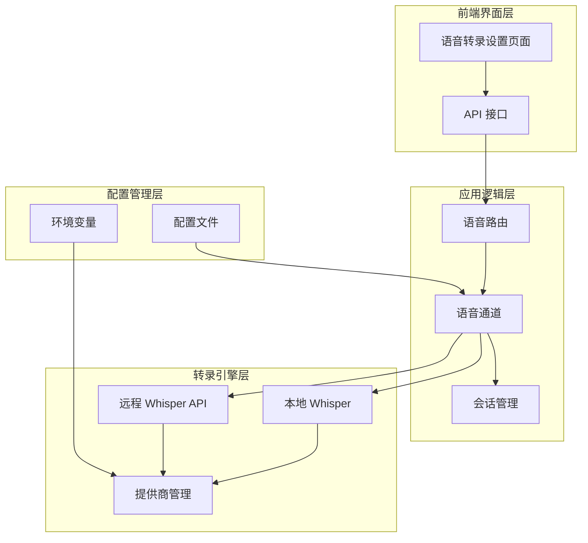
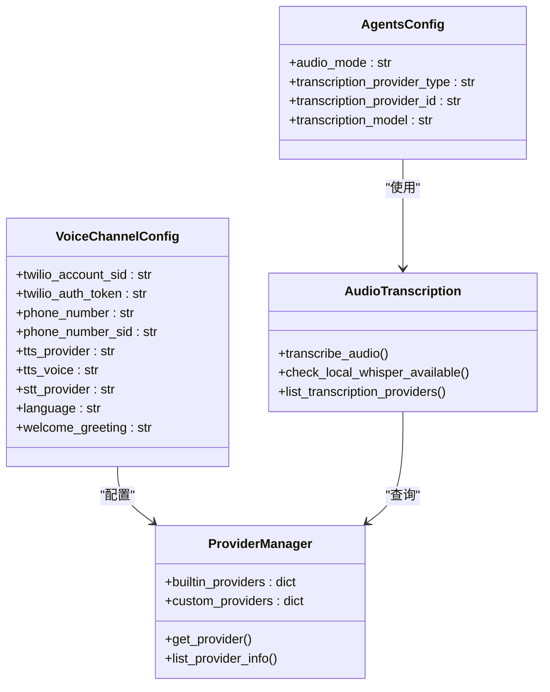
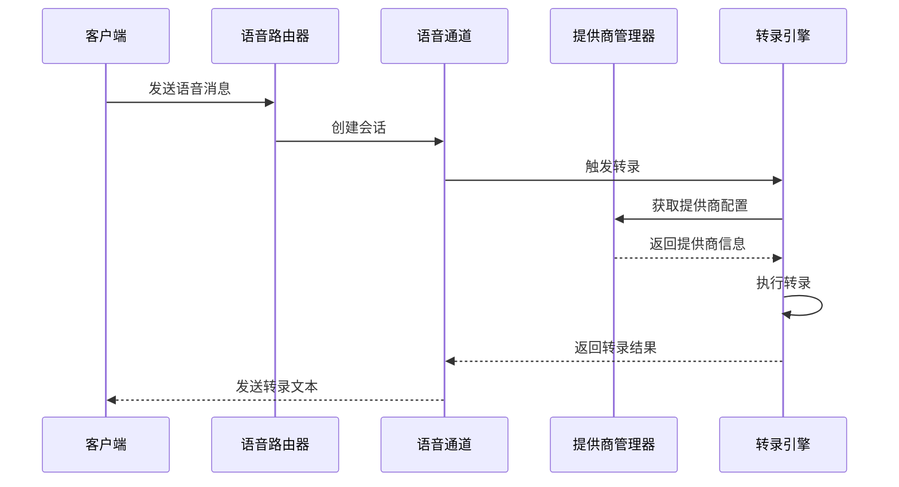
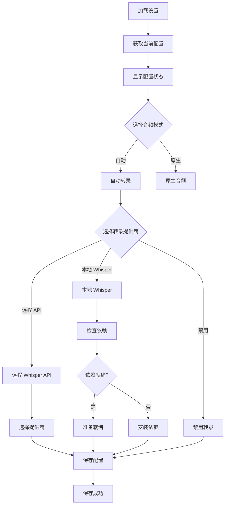
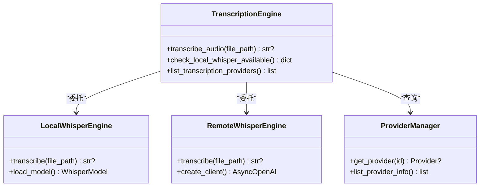
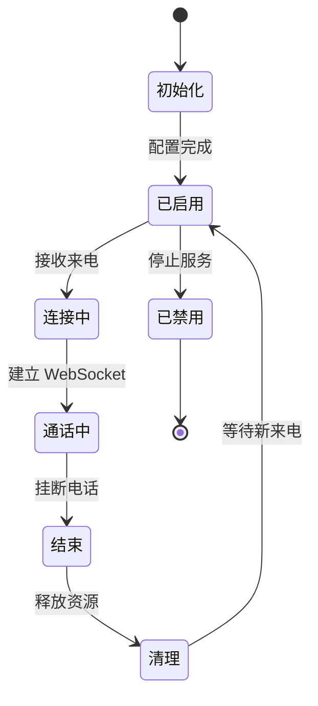
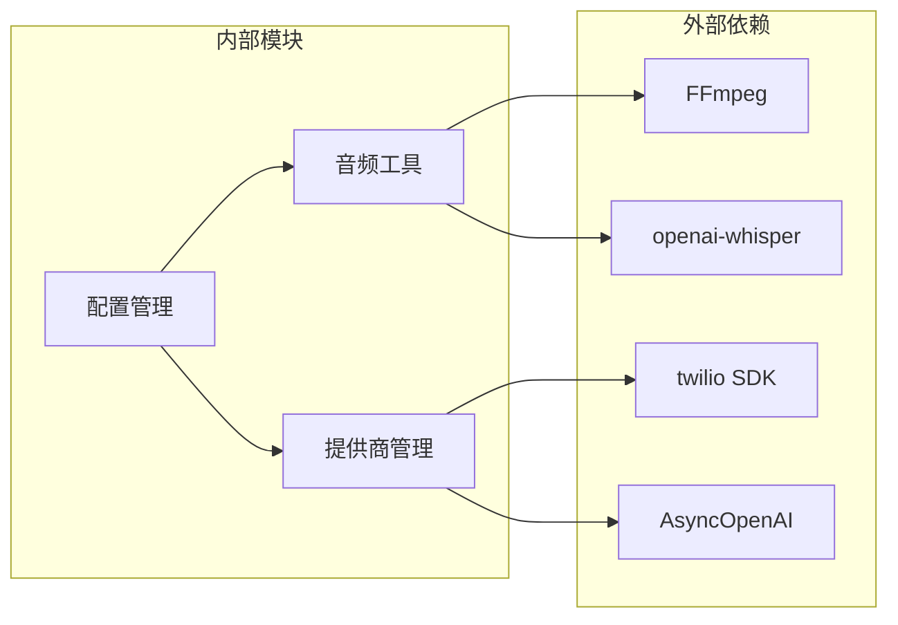
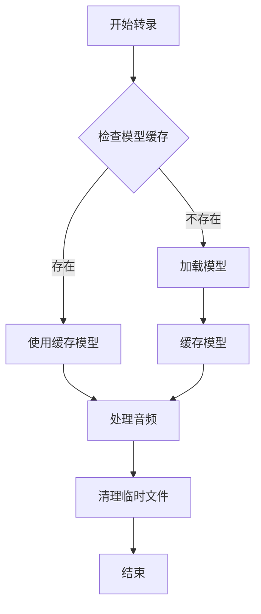
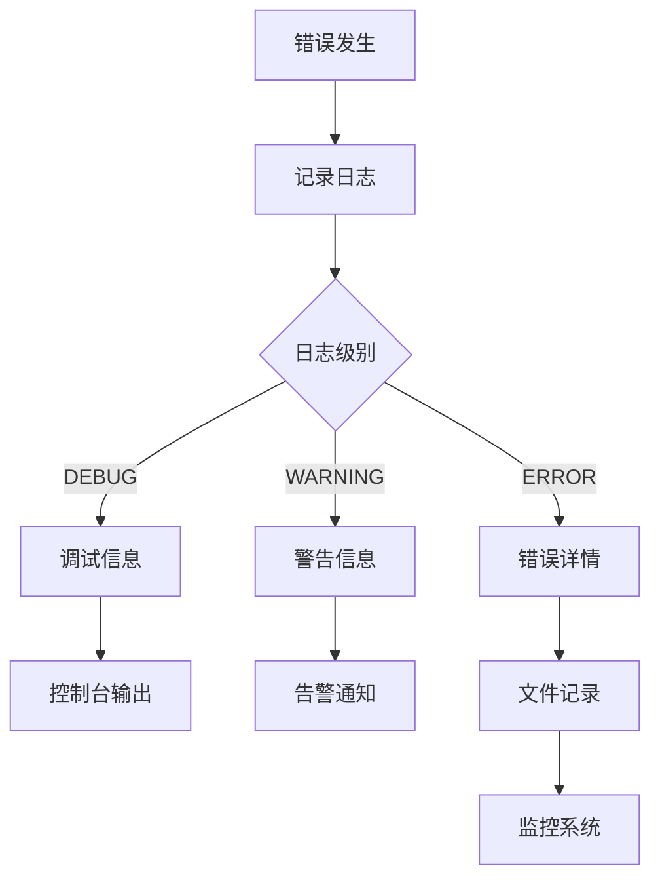

# 语音转录设置

<cite>
**本文档引用的文件**
- [audio_transcription.py](file://src/copaw/agents/utils/audio_transcription.py)
- [index.tsx](file://console/src/pages/Settings/VoiceTranscription/index.tsx)
- [voice.py](file://src/copaw/app/routers/voice.py)
- [channel.py](file://src/copaw/app/channels/voice/channel.py)
- [config.py](file://src/copaw/config/config.py)
- [provider_manager.py](file://src/copaw/providers/provider_manager.py)
- [twilio_manager.py](file://src/copaw/app/channels/voice/twilio_manager.py)
- [env.ts](file://console/src/api/modules/env.ts)
</cite>

## 目录
1. [简介](#简介)
2. [项目结构](#项目结构)
3. [核心组件](#核心组件)
4. [架构概览](#架构概览)
5. [详细组件分析](#详细组件分析)
6. [依赖关系分析](#依赖关系分析)
7. [性能考虑](#性能考虑)
8. [故障排除指南](#故障排除指南)
9. [结论](#结论)
10. [附录](#附录)

## 简介

CoPaw 语音转录功能是一个完整的端到端解决方案，支持本地和云端两种转录模式。该系统提供了灵活的配置选项，包括多种语音转录引擎选择、模型配置、语言设置等功能。本文档将详细介绍如何配置和优化 CoPaw 的语音转录功能，涵盖从基础设置到高级特性的各个方面。

## 项目结构

CoPaw 的语音转录功能分布在多个模块中，形成了清晰的分层架构：

**图表来源**
- [index.tsx:22-287](file://console/src/pages/Settings/VoiceTranscription/index.tsx#L22-L287)
- [voice.py:25-184](file://src/copaw/app/routers/voice.py#L25-L184)
- [channel.py:17-240](file://src/copaw/app/channels/voice/channel.py#L17-L240)

**章节来源**
- [index.tsx:1-288](file://console/src/pages/Settings/VoiceTranscription/index.tsx#L1-L288)
- [voice.py:1-184](file://src/copaw/app/routers/voice.py#L1-L184)
- [channel.py:1-240](file://src/copaw/app/channels/voice/channel.py#L1-L240)

## 核心组件

### 配置管理系统

CoPaw 使用 Pydantic 模型定义了完整的配置结构，包括语音转录相关的所有参数：

**图表来源**
- [config.py:793-832](file://src/copaw/config/config.py#L793-L832)
- [config.py:221-233](file://src/copaw/config/config.py#L221-L233)
- [provider_manager.py:670-800](file://src/copaw/providers/provider_manager.py#L670-L800)
- [audio_transcription.py:295-318](file://src/copaw/agents/utils/audio_transcription.py#L295-L318)

### 转录引擎架构

系统支持三种转录模式：

1. **禁用模式**: 不进行语音转录
2. **本地 Whisper 模式**: 使用本地安装的 openai-whisper 库
3. **远程 Whisper API 模式**: 使用兼容 OpenAI 接口的远程服务

**章节来源**
- [audio_transcription.py:1-318](file://src/copaw/agents/utils/audio_transcription.py#L1-L318)
- [config.py:804-831](file://src/copaw/config/config.py#L804-L831)

## 架构概览

CoPaw 的语音转录系统采用事件驱动的异步架构，支持高并发处理：

**图表来源**
- [voice.py:84-184](file://src/copaw/app/routers/voice.py#L84-L184)
- [channel.py:159-200](file://src/copaw/app/channels/voice/channel.py#L159-L200)
- [audio_transcription.py:295-318](file://src/copaw/agents/utils/audio_transcription.py#L295-L318)

## 详细组件分析

### 前端配置界面

语音转录设置界面提供了直观的用户交互体验：

**图表来源**
- [index.tsx:34-78](file://console/src/pages/Settings/VoiceTranscription/index.tsx#L34-L78)

**章节来源**
- [index.tsx:22-287](file://console/src/pages/Settings/VoiceTranscription/index.tsx#L22-L287)

### 后端转录引擎

转录引擎实现了智能的转录策略：

**图表来源**
- [audio_transcription.py:155-318](file://src/copaw/agents/utils/audio_transcription.py#L155-L318)
- [provider_manager.py:760-779](file://src/copaw/providers/provider_manager.py#L760-L779)

**章节来源**
- [audio_transcription.py:1-318](file://src/copaw/agents/utils/audio_transcription.py#L1-L318)

### 语音通道管理

语音通道负责处理实时语音通信：

**图表来源**
- [channel.py:81-158](file://src/copaw/app/channels/voice/channel.py#L81-L158)

**章节来源**
- [channel.py:1-240](file://src/copaw/app/channels/voice/channel.py#L1-L240)

## 依赖关系分析

### 外部依赖管理

系统对外部依赖进行了严格的版本控制和验证：

**图表来源**
- [audio_transcription.py:122-147](file://src/copaw/agents/utils/audio_transcription.py#L122-L147)
- [provider_manager.py:1-50](file://src/copaw/providers/provider_manager.py#L1-L50)

**章节来源**
- [audio_transcription.py:122-147](file://src/copaw/agents/utils/audio_transcription.py#L122-L147)
- [provider_manager.py:1-800](file://src/copaw/providers/provider_manager.py#L1-L800)

## 性能考虑

### 并发处理优化

系统通过以下机制优化并发性能：

1. **异步转录**: 使用 asyncio 实现非阻塞转录处理
2. **线程池管理**: 本地 Whisper 使用独立线程避免阻塞事件循环
3. **连接池复用**: 远程 API 调用使用连接池减少建立连接的开销
4. **缓存机制**: 本地 Whisper 模型使用单例模式避免重复加载

### 内存管理

**图表来源**
- [audio_transcription.py:27-38](file://src/copaw/agents/utils/audio_transcription.py#L27-L38)

**章节来源**
- [audio_transcription.py:155-201](file://src/copaw/agents/utils/audio_transcription.py#L155-L201)

## 故障排除指南

### 常见问题诊断

| 问题类型 | 症状 | 可能原因 | 解决方案 |
|---------|------|----------|----------|
| 本地转录失败 | 返回空文本或错误日志 | ffmpeg 或 whisper 未安装 | 安装依赖并重启服务 |
| 远程 API 调用超时 | 请求超时异常 | 网络连接或 API 密钥问题 | 检查网络和 API 凭据 |
| 提供商不可用 | 转录被跳过 | 配置的提供商不存在 | 重新配置提供商 |
| 语音通道无法启动 | Twilio 配置错误 | 凭据无效或号码未配置 | 验证 Twilio 凭据 |

### 日志分析

系统提供了详细的日志记录机制：

**图表来源**
- [audio_transcription.py:183-200](file://src/copaw/agents/utils/audio_transcription.py#L183-L200)

**章节来源**
- [audio_transcription.py:155-201](file://src/copaw/agents/utils/audio_transcription.py#L155-L201)

## 结论

CoPaw 的语音转录功能提供了企业级的语音处理能力，具有以下优势：

1. **灵活性**: 支持多种转录模式和提供商选择
2. **可扩展性**: 模块化设计便于功能扩展
3. **可靠性**: 完善的错误处理和监控机制
4. **易用性**: 直观的配置界面和自动化检测

通过合理配置和优化，可以满足不同规模和场景下的语音转录需求。

## 附录

### 配置参数参考

| 参数名称 | 类型 | 默认值 | 描述 |
|---------|------|--------|------|
| audio_mode | enum | "auto" | 音频处理模式 |
| transcription_provider_type | enum | "disabled" | 转录提供商类型 |
| transcription_provider_id | string | "" | 配置的提供商 ID |
| transcription_model | string | "whisper-1" | Whisper 模型名称 |
| twilio_account_sid | string | "" | Twilio 账户 SID |
| twilio_auth_token | string | "" | Twilio 认证令牌 |
| phone_number_sid | string | "" | Twilio 电话号码 SID |
| language | string | "en-US" | 语音语言代码 |

### 部署建议

1. **生产环境**: 建议使用远程 Whisper API 模式
2. **开发环境**: 可以使用本地 Whisper 模式进行测试
3. **性能优化**: 根据负载情况调整并发数和缓存策略
4. **安全配置**: 确保 API 密钥的安全存储和传输