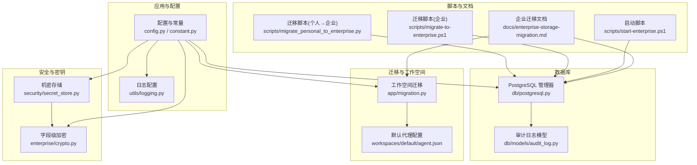
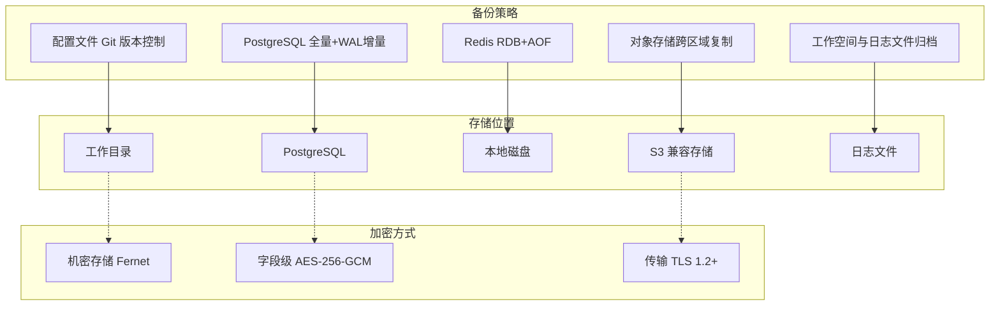
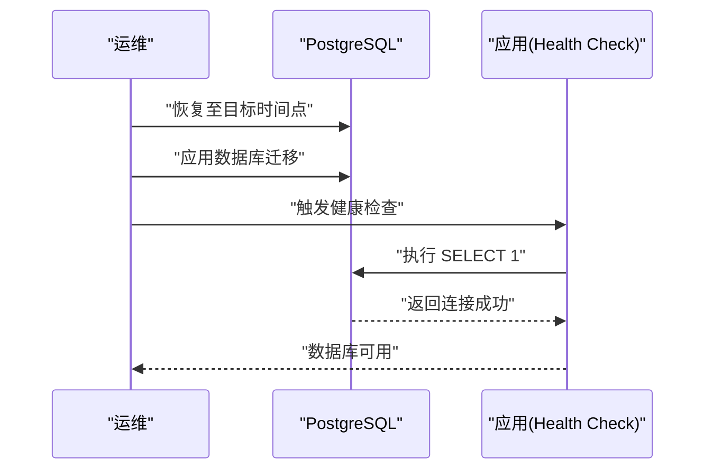
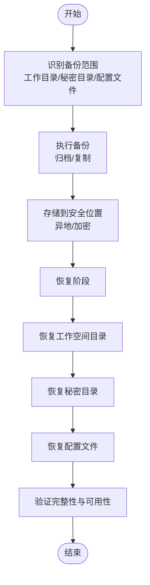
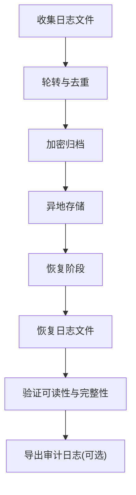
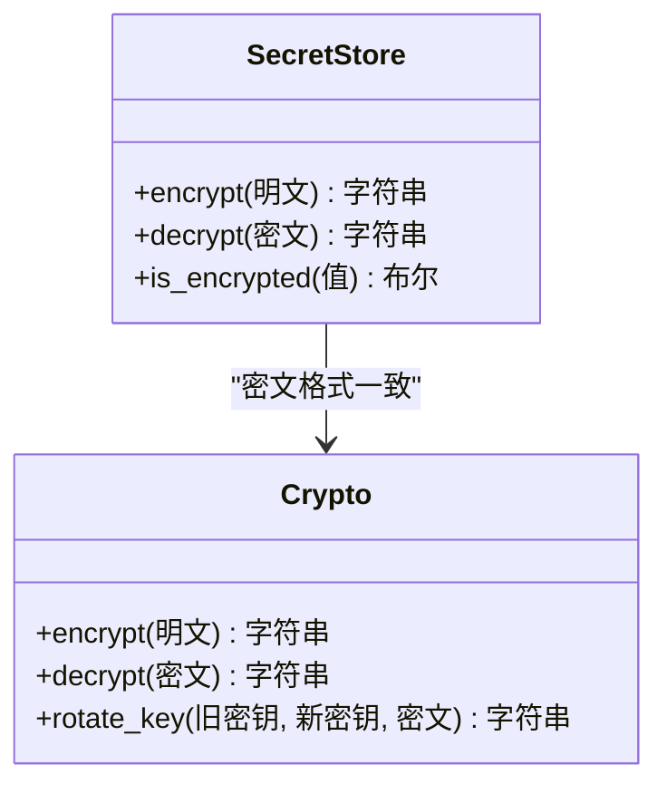
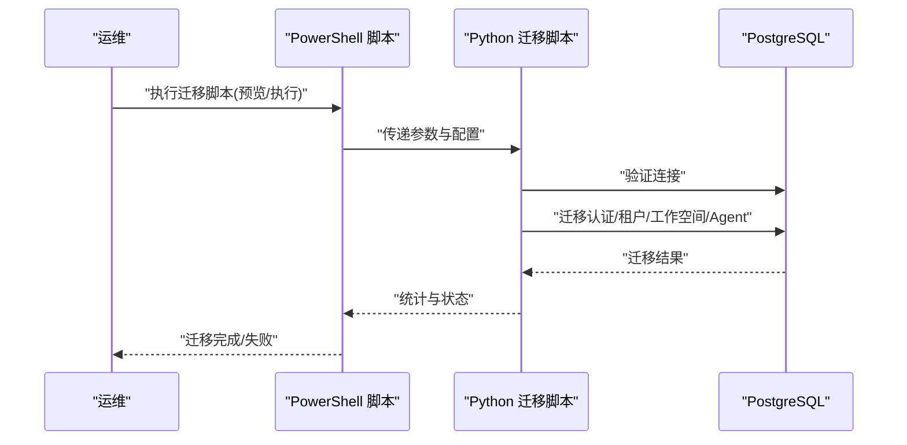
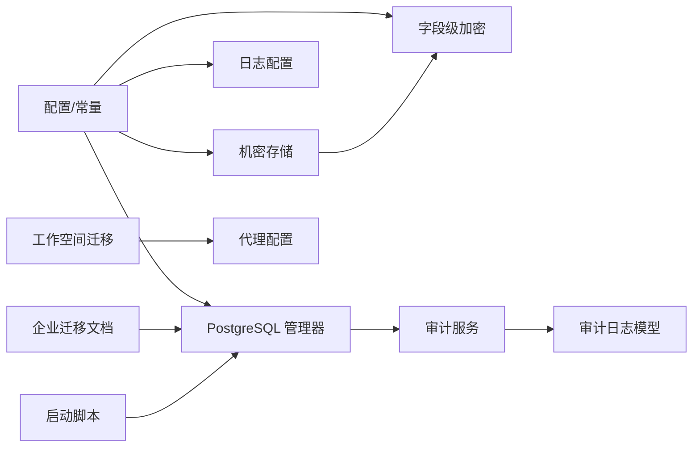

# 备份恢复

<cite>
**本文引用的文件**
- [src/copaw/db/postgresql.py](file://src/copaw/db/postgresql.py)
- [src/copaw/config/config.py](file://src/copaw/config/config.py)
- [src/copaw/constant.py](file://src/copaw/constant.py)
- [src/copaw/utils/logging.py](file://src/copaw/utils/logging.py)
- [src/copaw/app/migration.py](file://src/copaw/app/migration.py)
- [src/copaw/enterprise/audit_service.py](file://src/copaw/enterprise/audit_service.py)
- [src/copaw/db/models/audit_log.py](file://src/copaw/db/models/audit_log.py)
- [src/copaw/security/secret_store.py](file://src/copaw/security/secret_store.py)
- [src/copaw/enterprise/crypto.py](file://src/copaw/enterprise/crypto.py)
- [src/copaw/enterprise/middleware.py](file://src/copaw/enterprise/middleware.py)
- [working/workspaces/default/agent.json](file://working/workspaces/default/agent.json)
- [docs/enterprise-storage-migration.md](file://docs/enterprise-storage-migration.md)
- [scripts/start-enterprise.ps1](file://scripts/start-enterprise.ps1)
- [scripts/migrate-to-enterprise.ps1](file://scripts/migrate-to-enterprise.ps1)
- [scripts/migrate_personal_to_enterprise.py](file://scripts/migrate_personal_to_enterprise.py)
</cite>

## 目录
1. [简介](#简介)
2. [项目结构](#项目结构)
3. [核心组件](#核心组件)
4. [架构总览](#架构总览)
5. [详细组件分析](#详细组件分析)
6. [依赖分析](#依赖分析)
7. [性能考量](#性能考量)
8. [故障排查指南](#故障排查指南)
9. [结论](#结论)
10. [附录](#附录)

## 简介
本指南面向运维与平台工程团队，提供 CoPaw 备份与恢复系统的完整操作手册。内容覆盖数据库备份策略（全量、增量、时间点恢复）、配置文件与工作空间数据备份、日志文件备份、备份数据的存储位置、加密方式与版本管理，以及完整的恢复流程（含数据验证、完整性检查与业务验证）。同时给出灾难恢复计划、RTO/RPO 指标建议与测试演练方法，确保在紧急情况下能够快速恢复服务。

## 项目结构
围绕备份恢复的关键目录与文件如下：
- 数据库：PostgreSQL 异步连接管理与会话工厂
- 配置与路径：全局工作目录、秘密目录、配置文件与日志路径
- 审计与日志：结构化审计日志表与应用日志轮转
- 加密与密钥：机密存储与字段级加密工具
- 迁移与升级：工作空间迁移与企业版迁移脚本
- 文档与脚本：企业存储迁移文档、启动与迁移 PowerShell 脚本

**图表来源**
- [src/copaw/config/config.py:32-81](file://src/copaw/config/config.py#L32-L81)
- [src/copaw/constant.py:72-96](file://src/copaw/constant.py#L72-L96)
- [src/copaw/db/postgresql.py:41-114](file://src/copaw/db/postgresql.py#L41-L114)
- [src/copaw/db/models/audit_log.py:18-105](file://src/copaw/db/models/audit_log.py#L18-L105)
- [src/copaw/utils/logging.py:119-199](file://src/copaw/utils/logging.py#L119-L199)
- [src/copaw/security/secret_store.py:1-249](file://src/copaw/security/secret_store.py#L1-L249)
- [src/copaw/enterprise/crypto.py:26-140](file://src/copaw/enterprise/crypto.py#L26-L140)
- [src/copaw/app/migration.py:152-226](file://src/copaw/app/migration.py#L152-L226)
- [working/workspaces/default/agent.json:1-456](file://working/workspaces/default/agent.json#L1-L456)
- [docs/enterprise-storage-migration.md:10-2035](file://docs/enterprise-storage-migration.md#L10-L2035)
- [scripts/start-enterprise.ps1:168-214](file://scripts/start-enterprise.ps1#L168-L214)
- [scripts/migrate-to-enterprise.ps1:124-187](file://scripts/migrate-to-enterprise.ps1#L124-L187)
- [scripts/migrate_personal_to_enterprise.py:100-138](file://scripts/migrate_personal_to_enterprise.py#L100-L138)

**章节来源**
- [src/copaw/config/config.py:32-81](file://src/copaw/config/config.py#L32-L81)
- [src/copaw/constant.py:72-96](file://src/copaw/constant.py#L72-L96)
- [src/copaw/db/postgresql.py:41-114](file://src/copaw/db/postgresql.py#L41-L114)
- [src/copaw/utils/logging.py:119-199](file://src/copaw/utils/logging.py#L119-L199)
- [src/copaw/app/migration.py:152-226](file://src/copaw/app/migration.py#L152-L226)
- [docs/enterprise-storage-migration.md:10-2035](file://docs/enterprise-storage-migration.md#L10-L2035)

## 核心组件
- 数据库连接与健康检查：PostgreSQL 异步连接池、会话工厂与健康检查，确保备份前后的连通性验证。
- 配置与路径：工作目录、秘密目录、配置文件与日志文件路径，决定备份范围与存储位置。
- 审计日志：结构化审计日志表，支持按时间、用户、资源类型等过滤，用于恢复后验证与取证。
- 日志轮转：应用日志文件处理器，支持跨平台轮转与去重，便于备份与归档。
- 机密存储与字段级加密：机密存储层与 AES-256-GCM 字段级加密，保障备份数据中敏感信息的保密性。
- 迁移与工作空间：工作空间迁移逻辑与默认代理配置，指导备份与恢复时的工作空间一致性。
- 文档与脚本：企业存储迁移文档与 PowerShell/Python 迁移脚本，提供备份策略与恢复流程参考。

**章节来源**
- [src/copaw/db/postgresql.py:41-114](file://src/copaw/db/postgresql.py#L41-L114)
- [src/copaw/config/config.py:32-81](file://src/copaw/config/config.py#L32-L81)
- [src/copaw/constant.py:72-96](file://src/copaw/constant.py#L72-L96)
- [src/copaw/db/models/audit_log.py:18-105](file://src/copaw/db/models/audit_log.py#L18-L105)
- [src/copaw/utils/logging.py:119-199](file://src/copaw/utils/logging.py#L119-L199)
- [src/copaw/security/secret_store.py:1-249](file://src/copaw/security/secret_store.py#L1-L249)
- [src/copaw/enterprise/crypto.py:26-140](file://src/copaw/enterprise/crypto.py#L26-L140)
- [src/copaw/app/migration.py:152-226](file://src/copaw/app/migration.py#L152-L226)
- [working/workspaces/default/agent.json:1-456](file://working/workspaces/default/agent.json#L1-L456)
- [docs/enterprise-storage-migration.md:10-2035](file://docs/enterprise-storage-migration.md#L10-L2035)
- [scripts/migrate-to-enterprise.ps1:124-187](file://scripts/migrate-to-enterprise.ps1#L124-L187)
- [scripts/migrate_personal_to_enterprise.py:100-138](file://scripts/migrate_personal_to_enterprise.py#L100-L138)

## 架构总览
备份与恢复涉及以下关键流程：
- 备份策略：数据库（全量+WAL增量）、对象存储（跨区域复制）、Redis（RDB+AOF）、配置文件（Git 版本控制）、工作空间与日志文件（定期归档）。
- 存储位置：数据库位于 PostgreSQL；对象存储位于 S3 兼容存储；Redis 本地持久化；配置与工作空间位于工作目录；日志文件位于工作目录下的日志文件。
- 加密方式：机密存储采用 Fernet（AES-128-CBC+HMAC-SHA256）；字段级加密采用 AES-256-GCM；传输加密采用 TLS 1.2+。
- 恢复流程：先恢复基础设施（数据库、对象存储、Redis），再恢复配置与工作空间，最后进行数据验证与业务验证。

**图表来源**
- [docs/enterprise-storage-migration.md:2238-2247](file://docs/enterprise-storage-migration.md#L2238-L2247)
- [src/copaw/security/secret_store.py:1-249](file://src/copaw/security/secret_store.py#L1-L249)
- [src/copaw/enterprise/crypto.py:26-140](file://src/copaw/enterprise/crypto.py#L26-L140)
- [docs/enterprise-storage-migration.md:1944-1964](file://docs/enterprise-storage-migration.md#L1944-L1964)

## 详细组件分析

### 数据库备份与恢复（PostgreSQL）
- 备份策略
  - 全量备份：使用数据库管理工具进行全量导出，保留时间戳以便回溯。
  - 增量备份：启用并监控 WAL 归档，确保可进行基于时间点的精确恢复。
  - 时间点恢复：结合全量与 WAL，定位到目标时间点进行恢复。
- 存储位置：PostgreSQL 数据库存放于服务器磁盘或托管实例。
- 连接与健康检查：应用侧提供异步连接池与健康检查，可用于恢复后连通性验证。
- 恢复流程
  - 恢复数据库至目标时间点。
  - 应用 Alembic 迁移（如适用）。
  - 使用健康检查确认数据库可用。
  - 验证审计日志与关键业务表完整性。

**图表来源**
- [src/copaw/db/postgresql.py:144-156](file://src/copaw/db/postgresql.py#L144-L156)
- [docs/enterprise-storage-migration.md:2238-2247](file://docs/enterprise-storage-migration.md#L2238-L2247)

**章节来源**
- [src/copaw/db/postgresql.py:41-114](file://src/copaw/db/postgresql.py#L41-L114)
- [src/copaw/db/postgresql.py:144-156](file://src/copaw/db/postgresql.py#L144-L156)
- [docs/enterprise-storage-migration.md:2238-2247](file://docs/enterprise-storage-migration.md#L2238-L2247)

### 配置文件与工作空间备份与恢复
- 配置文件
  - 全局配置：config.json（由常量确定路径）。
  - 代理配置：每个工作空间内的 agent.json（默认工作空间示例）。
  - 模型提供商配置：providers.json（位于秘密目录）。
  - 环境变量：envs.json（位于秘密目录）。
- 工作空间
  - 包含对话、媒体、内存、技能、工具结果等目录。
  - 默认工作空间示例位于 working/workspaces/default。
- 备份范围
  - 工作目录（包含工作空间、媒体、内存、技能等）。
  - 秘密目录（包含 providers.json、envs.json 等）。
  - 配置文件（config.json、agent.json）。
- 恢复流程
  - 恢复工作目录与秘密目录。
  - 恢复配置文件（config.json、agent.json）。
  - 验证工作空间内文件完整性与可访问性。

**图表来源**
- [src/copaw/constant.py:72-96](file://src/copaw/constant.py#L72-L96)
- [working/workspaces/default/agent.json:1-456](file://working/workspaces/default/agent.json#L1-L456)
- [src/copaw/app/migration.py:152-226](file://src/copaw/app/migration.py#L152-L226)

**章节来源**
- [src/copaw/constant.py:72-96](file://src/copaw/constant.py#L72-L96)
- [working/workspaces/default/agent.json:1-456](file://working/workspaces/default/agent.json#L1-L456)
- [src/copaw/app/migration.py:152-226](file://src/copaw/app/migration.py#L152-L226)

### 日志文件备份与恢复
- 日志文件
  - 应用日志：位于工作目录下的日志文件，支持跨平台轮转与去重。
  - 审计日志：结构化写入 PostgreSQL，支持查询与导出。
- 备份范围
  - 应用日志文件（按大小轮转，保留多份）。
  - 审计日志（可导出 CSV/JSON 作为补充证据）。
- 恢复流程
  - 恢复日志文件至原路径。
  - 验证日志文件完整性与可读性。
  - 如需，导出审计日志并比对关键事件。

**图表来源**
- [src/copaw/utils/logging.py:119-199](file://src/copaw/utils/logging.py#L119-L199)
- [src/copaw/db/models/audit_log.py:18-105](file://src/copaw/db/models/audit_log.py#L18-L105)

**章节来源**
- [src/copaw/utils/logging.py:119-199](file://src/copaw/utils/logging.py#L119-L199)
- [src/copaw/db/models/audit_log.py:18-105](file://src/copaw/db/models/audit_log.py#L18-L105)

### 加密与密钥管理
- 机密存储（Fernet）
  - 透明加密/解密，密钥存储于系统钥匙串或本地文件，带前缀标识。
  - 适用于 providers.json、envs.json 等敏感配置。
- 字段级加密（AES-256-GCM）
  - 通过 SQLAlchemy 类型装饰器实现，适合数据库中的敏感字段。
  - 密钥来自环境变量，生产环境需设置有效密钥。
- 传输加密（TLS 1.2+）
  - API 与对象存储、数据库、Redis 之间的传输均采用 TLS。
- 恢复注意事项
  - 恢复备份时需同步恢复密钥材料（钥匙串/密钥文件）。
  - 若密钥变更，需进行密文重加密（Key Rotation）。

**图表来源**
- [src/copaw/security/secret_store.py:207-241](file://src/copaw/security/secret_store.py#L207-L241)
- [src/copaw/enterprise/crypto.py:53-98](file://src/copaw/enterprise/crypto.py#L53-L98)

**章节来源**
- [src/copaw/security/secret_store.py:1-249](file://src/copaw/security/secret_store.py#L1-L249)
- [src/copaw/enterprise/crypto.py:26-140](file://src/copaw/enterprise/crypto.py#L26-L140)
- [docs/enterprise-storage-migration.md:1944-1964](file://docs/enterprise-storage-migration.md#L1944-L1964)

### 迁移与恢复（工作空间与企业版）
- 工作空间迁移
  - 默认工作空间迁移逻辑与原子写入策略，避免损坏。
  - 支持从旧工作目录复制到新位置。
- 企业版迁移
  - PowerShell 脚本引导 Python 迁移脚本，支持预览与执行模式。
  - 迁移步骤包括连接验证、认证数据迁移、租户与工作空间迁移、Agent 配置迁移。
- 恢复流程
  - 恢复数据库与对象存储。
  - 恢复工作空间与配置文件。
  - 执行迁移脚本（如需要）以对齐结构。
  - 验证业务功能与数据一致性。

**图表来源**
- [scripts/migrate-to-enterprise.ps1:124-187](file://scripts/migrate-to-enterprise.ps1#L124-L187)
- [scripts/migrate_personal_to_enterprise.py:100-138](file://scripts/migrate_personal_to_enterprise.py#L100-L138)
- [src/copaw/app/migration.py:152-226](file://src/copaw/app/migration.py#L152-L226)

**章节来源**
- [src/copaw/app/migration.py:152-226](file://src/copaw/app/migration.py#L152-L226)
- [scripts/migrate-to-enterprise.ps1:124-187](file://scripts/migrate-to-enterprise.ps1#L124-L187)
- [scripts/migrate_personal_to_enterprise.py:100-138](file://scripts/migrate_personal_to_enterprise.py#L100-L138)

## 依赖分析
- 组件耦合
  - 数据库管理器与会话工厂：被应用路由与审计服务广泛使用。
  - 配置与常量：决定工作目录、秘密目录、配置文件与日志路径。
  - 审计服务：依赖数据库会话与审计日志模型。
  - 加密模块：机密存储与字段级加密相互配合，共同保障敏感数据安全。
- 外部依赖
  - PostgreSQL：数据库备份与恢复的核心对象。
  - 对象存储：跨区域复制与版本控制。
  - Redis：缓存与会话存储，需配合 RDB/AOF 备份。
  - TLS：传输加密，贯穿 API、对象存储、数据库与 Redis。

**图表来源**
- [src/copaw/config/config.py:32-81](file://src/copaw/config/config.py#L32-L81)
- [src/copaw/constant.py:72-96](file://src/copaw/constant.py#L72-L96)
- [src/copaw/db/postgresql.py:41-114](file://src/copaw/db/postgresql.py#L41-L114)
- [src/copaw/enterprise/audit_service.py:51-87](file://src/copaw/enterprise/audit_service.py#L51-L87)
- [src/copaw/db/models/audit_log.py:18-105](file://src/copaw/db/models/audit_log.py#L18-L105)
- [src/copaw/security/secret_store.py:1-249](file://src/copaw/security/secret_store.py#L1-L249)
- [src/copaw/enterprise/crypto.py:26-140](file://src/copaw/enterprise/crypto.py#L26-L140)
- [src/copaw/app/migration.py:152-226](file://src/copaw/app/migration.py#L152-L226)
- [working/workspaces/default/agent.json:1-456](file://working/workspaces/default/agent.json#L1-L456)
- [docs/enterprise-storage-migration.md:10-2035](file://docs/enterprise-storage-migration.md#L10-L2035)
- [scripts/start-enterprise.ps1:168-214](file://scripts/start-enterprise.ps1#L168-L214)

**章节来源**
- [src/copaw/db/postgresql.py:41-114](file://src/copaw/db/postgresql.py#L41-L114)
- [src/copaw/enterprise/audit_service.py:51-87](file://src/copaw/enterprise/audit_service.py#L51-L87)
- [src/copaw/db/models/audit_log.py:18-105](file://src/copaw/db/models/audit_log.py#L18-L105)
- [src/copaw/security/secret_store.py:1-249](file://src/copaw/security/secret_store.py#L1-L249)
- [src/copaw/enterprise/crypto.py:26-140](file://src/copaw/enterprise/crypto.py#L26-L140)
- [src/copaw/app/migration.py:152-226](file://src/copaw/app/migration.py#L152-L226)
- [docs/enterprise-storage-migration.md:10-2035](file://docs/enterprise-storage-migration.md#L10-L2035)

## 性能考量
- 备份窗口与并发
  - 数据库全量备份建议在业务低峰期执行，避免阻塞。
  - 对象存储跨区域复制可能产生带宽占用，需规划复制窗口。
- 恢复速度
  - 使用增量备份与 WAL 归档可显著缩短 RTO。
  - 机密数据加密/解密会增加 CPU 开销，建议在恢复阶段预留额外时间。
- 存储与成本
  - 日志与工作空间数据量大，建议启用压缩与分层存储。
  - 审计日志导出与归档需考虑长期保留策略与成本。

[本节为通用指导，无需特定文件来源]

## 故障排查指南
- 数据库健康检查
  - 使用数据库管理器的健康检查方法，快速判断连接状态。
- 启动脚本诊断
  - 启动脚本包含数据库初始化检查与 Redis 连接测试，可辅助定位连接问题。
- 审计日志查询
  - 通过审计服务提供的查询接口，按时间、用户、资源类型筛选，辅助恢复后验证。
- 日志轮转与文件完整性
  - 检查日志文件是否存在轮转、权限与编码问题，确保可读性。
- 迁移与恢复验证
  - 恢复后运行迁移脚本（如企业版迁移）以对齐结构。
  - 验证工作空间与配置文件完整性，确保业务功能正常。

**章节来源**
- [src/copaw/db/postgresql.py:144-156](file://src/copaw/db/postgresql.py#L144-L156)
- [scripts/start-enterprise.ps1:168-214](file://scripts/start-enterprise.ps1#L168-L214)
- [src/copaw/enterprise/audit_service.py:90-121](file://src/copaw/enterprise/audit_service.py#L90-L121)
- [src/copaw/utils/logging.py:119-199](file://src/copaw/utils/logging.py#L119-L199)
- [scripts/migrate-to-enterprise.ps1:124-187](file://scripts/migrate-to-enterprise.ps1#L124-L187)

## 结论
通过明确的备份策略（全量+WAL增量）、严格的加密与密钥管理、规范的备份范围与存储位置，以及完善的恢复流程与验证机制，CoPaw 可在发生故障时快速恢复服务。建议将备份纳入自动化流程，并定期进行恢复演练，持续优化 RTO/RPO 指标，确保业务连续性。

[本节为总结，无需特定文件来源]

## 附录
- RTO/RPO 指标建议
  - RTO：关键业务 ≤ 4 小时；非关键业务 ≤ 8 小时。
  - RPO：关键业务 ≤ 15 分钟；非关键业务 ≤ 1 小时。
- 测试演练方法
  - 定期进行“离线”恢复演练，模拟数据库、对象存储、Redis 与工作空间的多点故障。
  - 验证恢复流程的自动化程度与所需时间，记录并优化。
  - 对比实际 RTO/RPO 与指标，持续改进备份与恢复策略。

[本节为通用指导，无需特定文件来源]