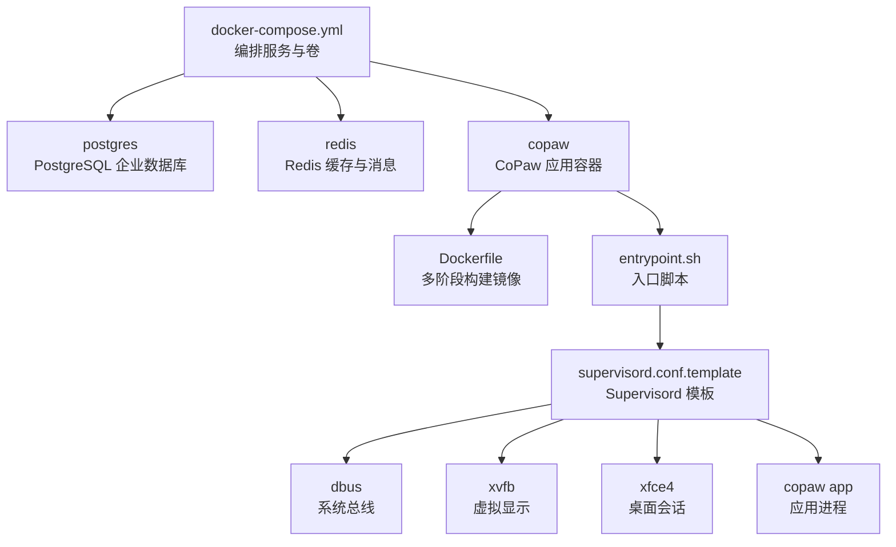
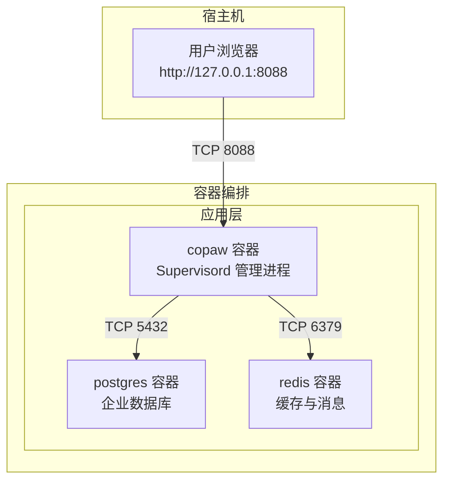
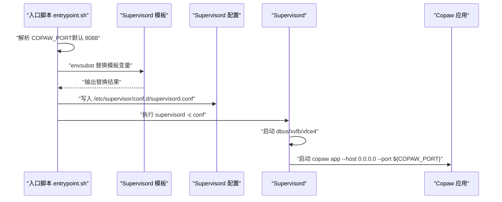
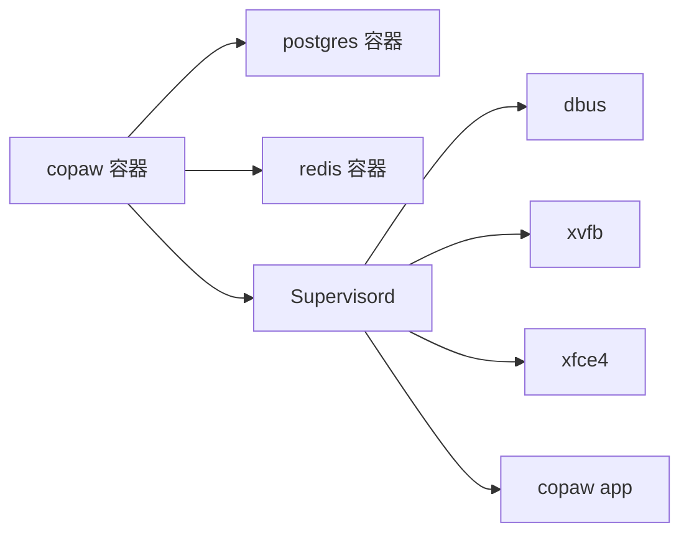

# 容器化部署

<cite>
**本文引用的文件**
- [docker-compose.yml](file://docker-compose.yml)
- [Dockerfile](file://deploy/Dockerfile)
- [entrypoint.sh](file://deploy/entrypoint.sh)
- [supervisord.conf.template](file://deploy/config/supervisord.conf.template)
- [Deployment.md](file://docs/wiki/Deployment.md)
- [README.md](file://README.md)
- [docker_build.sh](file://scripts/docker_build.sh)
</cite>

## 目录
1. [简介](#简介)
2. [项目结构](#项目结构)
3. [核心组件](#核心组件)
4. [架构总览](#架构总览)
5. [详细组件分析](#详细组件分析)
6. [依赖关系分析](#依赖关系分析)
7. [性能与稳定性建议](#性能与稳定性建议)
8. [故障排查指南](#故障排查指南)
9. [结论](#结论)
10. [附录](#附录)

## 简介
本指南面向希望使用 Docker Compose 对 CoPaw 进行容器化部署的用户，系统讲解编排文件的配置项、入口脚本与进程管理机制、环境变量传递、卷挂载策略、网络与端口映射、健康检查与重启策略，并提供完整的部署命令与验证步骤，帮助您在生产环境中稳定运行 CoPaw。

## 项目结构
围绕容器化部署的相关文件主要位于以下路径：
- docker-compose.yml：Compose 编排文件，定义服务、卷、网络与环境变量
- deploy/Dockerfile：多阶段构建镜像，包含前端构建、运行时依赖与应用安装
- deploy/entrypoint.sh：容器入口脚本，负责模板替换与启动进程管理器
- deploy/config/supervisord.conf.template：Supervisord 配置模板，定义 dbus、Xvfb、XFCE 与应用进程
- scripts/docker_build.sh：自定义镜像构建脚本，支持通道过滤等构建参数
- docs/wiki/Deployment.md：官方部署文档，涵盖多种部署方式与最佳实践

图表来源
- [docker-compose.yml:13-92](file://docker-compose.yml#L13-L92)
- [Dockerfile:10-103](file://deploy/Dockerfile#L10-L103)
- [entrypoint.sh:1-10](file://deploy/entrypoint.sh#L1-L10)
- [supervisord.conf.template:1-40](file://deploy/config/supervisord.conf.template#L1-L40)

章节来源
- [docker-compose.yml:1-92](file://docker-compose.yml#L1-L92)
- [Dockerfile:10-103](file://deploy/Dockerfile#L10-L103)
- [entrypoint.sh:1-10](file://deploy/entrypoint.sh#L1-L10)
- [supervisord.conf.template:1-40](file://deploy/config/supervisord.conf.template#L1-L40)

## 核心组件
- 数据库服务（PostgreSQL）：用于企业模式的数据存储，提供健康检查与持久化卷
- 缓存与消息服务（Redis）：提供会话缓存与消息队列能力，具备密码保护与内存策略
- 应用服务（CoPaw）：基于多阶段构建的运行时镜像，通过 Supervisord 管理多个子进程，提供浏览器自动化所需的显示环境

章节来源
- [docker-compose.yml:17-35](file://docker-compose.yml#L17-L35)
- [docker-compose.yml:40-58](file://docker-compose.yml#L40-L58)
- [docker-compose.yml:63-92](file://docker-compose.yml#L63-L92)

## 架构总览
下图展示了容器化部署的整体交互关系：应用容器依赖数据库与缓存服务，通过端口映射对外提供控制台与 API；Supervisord 管理 dbus、Xvfb、XFCE 与应用进程，确保浏览器自动化功能可用。

图表来源
- [docker-compose.yml:17-92](file://docker-compose.yml#L17-L92)
- [supervisord.conf.template:7-21](file://deploy/config/supervisord.conf.template#L7-L21)

## 详细组件分析

### Docker Compose 编排文件详解
- 卷定义
  - copaw-data：持久化工作目录（应用运行时数据）
  - copaw-secrets：持久化密钥与敏感配置
  - copaw-pg-data、copaw-redis-data：数据库与缓存的持久化卷
- 服务定义
  - postgres：企业数据库，设置数据库名、用户名、密码与数据目录；暴露 5432 端口并绑定到 127.0.0.1；配置健康检查
  - redis：缓存与消息中间件，设置密码、最大内存与淘汰策略；暴露 6379 端口并绑定到 127.0.0.1；配置健康检查
  - copaw：应用容器，依赖 postgres 与 redis 健康后启动；映射 8088 端口；传递企业模式与数据库、缓存、JWT 密钥等环境变量；挂载工作目录与密钥目录
- 环境变量要点
  - 企业模式开关：COPAW_ENTERPRISE_ENABLED
  - 数据库连接：COPAW_DB_HOST、COPAW_DB_PORT、COPAW_DB_NAME、COPAW_DB_USER、COPAW_DB_PASSWORD
  - 缓存连接：COPAW_REDIS_HOST、COPAW_REDIS_PORT、COPAW_REDIS_PASSWORD
  - JWT 密钥：COPAW_JWT_SECRET（生产环境必须覆盖）
- 健康检查与重启策略
  - postgres 与 redis 均配置健康检查，copaw 通过 depends_on 的健康条件启动
  - 服务均设置 restart: always，实现异常自动重启

章节来源
- [docker-compose.yml:3-11](file://docker-compose.yml#L3-L11)
- [docker-compose.yml:17-35](file://docker-compose.yml#L17-L35)
- [docker-compose.yml:40-58](file://docker-compose.yml#L40-L58)
- [docker-compose.yml:63-92](file://docker-compose.yml#L63-L92)

### 入口脚本与进程管理
- 入口脚本职责
  - 设置 COPAW_PORT 默认值（如未显式传入），使用 envsubst 将模板中的端口变量替换为实际值
  - 输出替换后的配置到 supervisord.conf 并启动 supervisord
- Supervisord 模板要点
  - dbus：系统总线守护，保证桌面环境可用
  - xvfb：虚拟显示服务，为浏览器自动化提供无头显示
  - xfce4：桌面会话，等待显示可用后启动
  - app：Copaw 应用进程，监听 0.0.0.0:PORT，注入显示与容器运行标记
- 端口映射
  - Dockerfile 中 EXPOSE 8088，Compose 中将宿主 8088 映射到容器 8088

图表来源
- [entrypoint.sh:5-9](file://deploy/entrypoint.sh#L5-L9)
- [supervisord.conf.template:14-21](file://deploy/config/supervisord.conf.template#L14-L21)

章节来源
- [entrypoint.sh:1-10](file://deploy/entrypoint.sh#L1-L10)
- [supervisord.conf.template:1-40](file://deploy/config/supervisord.conf.template#L1-L40)
- [Dockerfile:100-103](file://deploy/Dockerfile#L100-L103)

### 环境变量与配置文件替换
- 环境变量传递
  - 在 docker-compose.yml 的 environment 字段中设置企业模式、数据库与缓存连接参数、JWT 密钥
  - 可通过 -e 或 .env 文件在运行时覆盖
- 配置文件替换
  - 入口脚本使用 envsubst 将模板中的端口变量替换为实际值，再由 supervisord 加载
- 通道过滤（可选）
  - 构建阶段可通过构建参数 COPAW_DISABLED_CHANNELS 或 COPAW_ENABLED_CHANNELS 控制通道打包

章节来源
- [docker-compose.yml:74-88](file://docker-compose.yml#L74-L88)
- [entrypoint.sh:6-8](file://deploy/entrypoint.sh#L6-L8)
- [Dockerfile:20-25](file://deploy/Dockerfile#L20-L25)
- [docker_build.sh:21-27](file://scripts/docker_build.sh#L21-L27)

### 卷挂载与持久化
- 工作目录：/app/working → copaw-data
- 密钥目录：/app/working.secret → copaw-secrets
- 数据库与缓存：分别挂载至各自的数据目录，确保重启后数据不丢失

章节来源
- [docker-compose.yml:28-29](file://docker-compose.yml#L28-L29)
- [docker-compose.yml:51-52](file://docker-compose.yml#L51-L52)
- [docker-compose.yml:89-91](file://docker-compose.yml#L89-L91)

### 网络与端口映射
- copaw 容器暴露 8088 端口，Compose 将宿主机 8088 映射到容器 8088
- 数据库与缓存服务仅映射到 127.0.0.1，避免外部直连
- 应用容器通过服务名访问数据库与缓存（容器内网络）

章节来源
- [Dockerfile:100](file://deploy/Dockerfile#L100)
- [docker-compose.yml:26-27](file://docker-compose.yml#L26-L27)
- [docker-compose.yml:49-50](file://docker-compose.yml#L49-L50)
- [docker-compose.yml:72-73](file://docker-compose.yml#L72-L73)

### 健康检查与重启策略
- 健康检查
  - postgres：使用 pg_isready 检查数据库可用性
  - redis：使用 redis-cli ping 检查连接与密码
- 重启策略
  - 服务设置 restart: always，异常退出自动重启
  - copaw 通过 depends_on 的健康条件启动，确保依赖服务就绪

章节来源
- [docker-compose.yml:30-35](file://docker-compose.yml#L30-L35)
- [docker-compose.yml:53-58](file://docker-compose.yml#L53-L58)
- [docker-compose.yml:67-71](file://docker-compose.yml#L67-L71)

## 依赖关系分析
- 组件耦合
  - copaw 依赖 postgres 与 redis 的健康状态
  - 应用进程依赖 dbus、xvfb、xfce4 提供的显示环境
- 外部依赖
  - 镜像来源与运行时依赖在 Dockerfile 中声明
  - 浏览器自动化依赖 Chromium 与 Xvfb

图表来源
- [docker-compose.yml:67-71](file://docker-compose.yml#L67-L71)
- [supervisord.conf.template:7-39](file://deploy/config/supervisord.conf.template#L7-L39)

章节来源
- [docker-compose.yml:63-92](file://docker-compose.yml#L63-L92)
- [supervisord.conf.template:1-40](file://deploy/config/supervisord.conf.template#L1-L40)

## 性能与稳定性建议
- 内存与缓存
  - 为 redis 设置合理的 maxmemory 与淘汰策略，避免内存溢出
  - PostgreSQL 使用独立卷并定期备份
- 进程管理
  - Supervisord 的 autorestart 与优先级有助于快速恢复
- 端口与网络
  - 将数据库与缓存端口绑定到 127.0.0.1，避免外部直连
- 日志与监控
  - 通过容器日志与应用日志定位问题
  - 健康检查作为服务可用性指标

章节来源
- [docker-compose.yml:44-48](file://docker-compose.yml#L44-L48)
- [supervisord.conf.template:14-21](file://deploy/config/supervisord.conf.template#L14-L21)

## 故障排查指南
- 容器无法启动
  - 查看容器日志：docker logs <容器名或ID>
  - 进入容器调试：docker exec -it <容器名或ID> bash
- 端口冲突
  - 修改 COPAW_PORT 并重新映射端口
- 数据库或缓存不可用
  - 检查健康检查输出与依赖服务状态
- API Key 或认证问题
  - 在控制台或配置文件中正确设置 API Key 与认证开关
- 日志查看
  - 应用日志：容器内应用生成的日志
  - Supervisord 日志：/var/log/supervisord.log 与各程序日志文件

章节来源
- [Deployment.md:470-477](file://docs/wiki/Deployment.md#L470-L477)
- [Deployment.md:445-456](file://docs/wiki/Deployment.md#L445-L456)
- [Deployment.md:407-415](file://docs/wiki/Deployment.md#L407-L415)
- [supervisord.conf.template:1-40](file://deploy/config/supervisord.conf.template#L1-L40)

## 结论
通过 Docker Compose 编排，CoPaw 可以在企业环境中稳定运行。Compose 文件提供了清晰的服务定义、卷与网络配置、环境变量传递以及健康检查与重启策略。入口脚本与 Supervisord 配合，确保应用进程与显示环境协同工作。遵循本文提供的部署命令、验证步骤与故障排查方法，可有效保障容器化部署的可靠性与可维护性。

## 附录

### 部署命令与验证步骤
- 拉取镜像并运行（个人使用）
  - docker pull agentscope/copaw:latest
  - docker run -p 127.0.0.1:8088:8088 -v copaw-data:/app/working -v copaw-secrets:/app/working.secret agentscope/copaw:latest
- 使用 Compose（企业模式）
  - docker-compose -f docker-compose.yml up -d
- 验证
  - 访问 http://127.0.0.1:8088 检查控制台
  - 健康检查：docker-compose ps
  - 日志：docker-compose logs copaw

章节来源
- [README.md:139-154](file://README.md#L139-L154)
- [docker-compose.yml:13-92](file://docker-compose.yml#L13-L92)

### 环境变量清单（示例）
- 企业模式：COPAW_ENTERPRISE_ENABLED
- 数据库：COPAW_DB_HOST、COPAW_DB_PORT、COPAW_DB_NAME、COPAW_DB_USER、COPAW_DB_PASSWORD
- 缓存：COPAW_REDIS_HOST、COPAW_REDIS_PORT、COPAW_REDIS_PASSWORD
- JWT：COPAW_JWT_SECRET
- 端口：COPAW_PORT（默认 8088）

章节来源
- [docker-compose.yml:74-88](file://docker-compose.yml#L74-L88)
- [entrypoint.sh:5](file://deploy/entrypoint.sh#L5)
- [Dockerfile:94-95](file://deploy/Dockerfile#L94-L95)