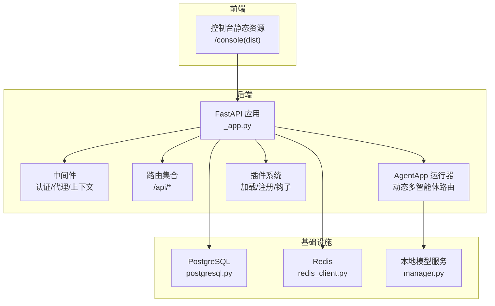
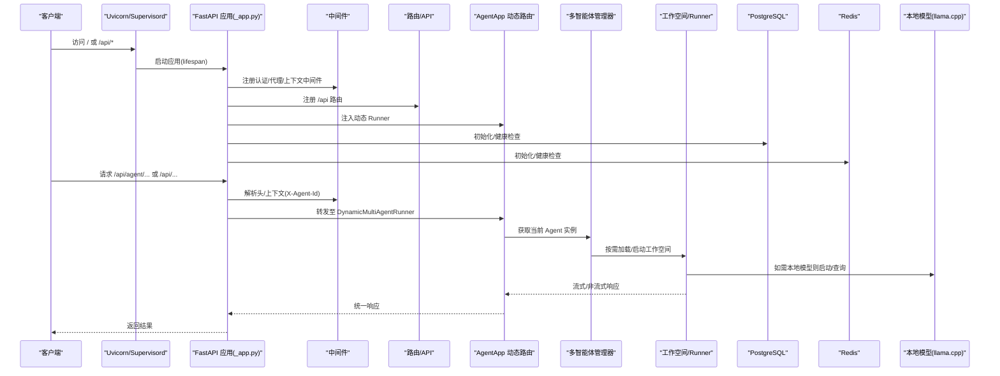
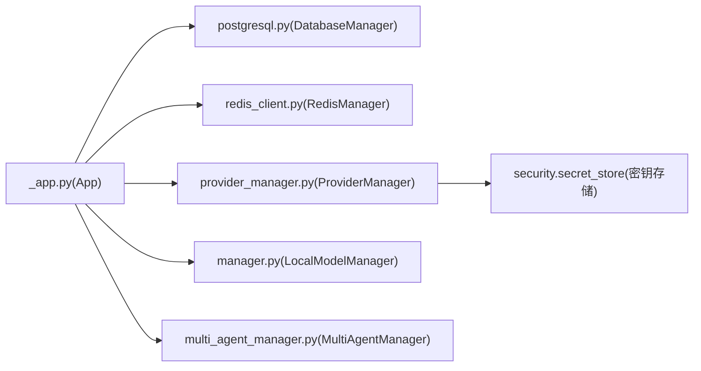

# 故障排除

<cite>
**本文引用的文件**
- [README.md](file://README.md)
- [QUICK-START.md](file://docs/QUICK-START.md)
- [_app.py](file://src/copaw/app/_app.py)
- [logging.py](file://src/copaw/utils/logging.py)
- [exceptions.py](file://src/copaw/exceptions.py)
- [Dockerfile](file://deploy/Dockerfile)
- [supervisord.conf.template](file://deploy/config/supervisord.conf.template)
- [start-enterprise.sh](file://scripts/start-enterprise.sh)
- [main.py](file://src/copaw/cli/main.py)
- [config.py](file://src/copaw/config/config.py)
- [postgresql.py](file://src/copaw/db/postgresql.py)
- [redis_client.py](file://src/copaw/db/redis_client.py)
- [manager.py](file://src/copaw/local_models/manager.py)
- [provider_manager.py](file://src/copaw/providers/provider_manager.py)
- [multi_agent_manager.py](file://src/copaw/app/multi_agent_manager.py)
- [__main__.py](file://src/copaw/__main__.py)
</cite>

## 目录
1. [简介](#简介)
2. [项目结构](#项目结构)
3. [核心组件](#核心组件)
4. [架构总览](#架构总览)
5. [详细组件分析](#详细组件分析)
6. [依赖关系分析](#依赖关系分析)
7. [性能考虑](#性能考虑)
8. [故障排除指南](#故障排除指南)
9. [结论](#结论)
10. [附录](#附录)

## 简介
本指南面向运维与平台工程师，聚焦 CoPaw 在生产环境中的故障诊断与快速恢复。内容覆盖启动失败、连接异常、性能问题与功能故障的识别与处置；提供日志分析方法、错误码解读、系统检查清单、性能调优建议与安全修复方案，并给出紧急处理流程与回滚策略，以最小化业务影响。

## 项目结构
CoPaw 采用“Python 后端 + 前端控制台 + 多通道适配 + 插件体系”的分层架构。后端基于 FastAPI，通过多智能体管理器统一调度多个工作空间；企业版集成 PostgreSQL 与 Redis，支持多租户、审计与权限等能力；本地模型通过 llama.cpp 管理器提供离线推理能力；CLI 提供安装、初始化、数据库迁移与应用启停等命令。

图示来源
- [_app.py:475-685](file://src/copaw/app/_app.py#L475-L685)
- [postgresql.py:41-187](file://src/copaw/db/postgresql.py#L41-L187)
- [redis_client.py:22-218](file://src/copaw/db/redis_client.py#L22-L218)
- [manager.py:33-229](file://src/copaw/local_models/manager.py#L33-L229)

章节来源
- [_app.py:1-685](file://src/copaw/app/_app.py#L1-L685)
- [README.md:113-174](file://README.md#L113-L174)

## 核心组件
- 应用生命周期与监控：FastAPI 应用、Prometheus 指标、启动/关闭钩子、CORS、静态资源与 SPA 回退。
- 日志系统：彩色终端输出、可选文件落盘、跨平台兼容、访问日志过滤。
- 异常与错误转换：统一异常类型与模型相关错误映射，便于前端与 API 返回一致的错误语义。
- 数据库与缓存：PostgreSQL（异步）与 Redis（异步）连接管理与健康检查。
- 多智能体管理：按需加载、零停机热重载、任务跟踪与清理。
- 本地模型：llama.cpp 下载、服务器启动/停止、上下文长度配置。
- 提供商管理：内置与自定义提供商、模型槽位、密钥加密存储。
- CLI 与部署：命令入口、容器镜像、Supervisord 管理脚本、企业初始化脚本。

章节来源
- [_app.py:162-473](file://src/copaw/app/_app.py#L162-L473)
- [logging.py:119-199](file://src/copaw/utils/logging.py#L119-L199)
- [exceptions.py:165-254](file://src/copaw/exceptions.py#L165-L254)
- [postgresql.py:41-187](file://src/copaw/db/postgresql.py#L41-L187)
- [redis_client.py:22-218](file://src/copaw/db/redis_client.py#L22-L218)
- [multi_agent_manager.py:21-470](file://src/copaw/app/multi_agent_manager.py#L21-L470)
- [manager.py:33-229](file://src/copaw/local_models/manager.py#L33-L229)
- [provider_manager.py:670-800](file://src/copaw/providers/provider_manager.py#L670-L800)
- [main.py:58-168](file://src/copaw/cli/main.py#L58-L168)
- [Dockerfile:1-103](file://deploy/Dockerfile#L1-L103)
- [supervisord.conf.template:1-40](file://deploy/config/supervisord.conf.template#L1-L40)
- [start-enterprise.sh:1-510](file://scripts/start-enterprise.sh#L1-L510)

## 架构总览
下图展示从请求到响应的关键路径，以及企业版依赖项与本地模型服务的交互。

图示来源
- [_app.py:162-473](file://src/copaw/app/_app.py#L162-L473)
- [multi_agent_manager.py:38-90](file://src/copaw/app/multi_agent_manager.py#L38-L90)
- [manager.py:200-229](file://src/copaw/local_models/manager.py#L200-L229)
- [postgresql.py:144-156](file://src/copaw/db/postgresql.py#L144-L156)
- [redis_client.py:198-206](file://src/copaw/db/redis_client.py#L198-L206)

## 详细组件分析

### 启动与生命周期（应用）
- 关键点：lifespan 中完成企业数据库/缓存初始化、插件加载与注册、启动钩子执行、多智能体管理器与本地模型管理器初始化；关闭时执行关闭钩子、优雅关停本地模型与多智能体管理器、关闭数据库与缓存连接池。
- 常见问题：数据库/缓存不可达导致启动失败；插件启动钩子抛错中断；本地模型服务启动超时或端口冲突。
- 排查要点：查看 copaw.log 文件；确认企业模式开关与环境变量；检查插件目录与配置；验证本地模型二进制下载与服务器状态。

章节来源
- [_app.py:162-473](file://src/copaw/app/_app.py#L162-L473)
- [logging.py:157-199](file://src/copaw/utils/logging.py#L157-L199)

### 日志系统
- 输出：控制台彩色输出与可选文件落盘；跨平台路径显示；访问日志可按路径片段过滤。
- 使用建议：生产默认 info 级别；调试时提升到 debug 并启用文件落盘；结合启动时间线与初始化计时进行定位。

章节来源
- [logging.py:119-199](file://src/copaw/utils/logging.py#L119-L199)
- [main.py:52-56](file://src/copaw/cli/main.py#L52-L56)

### 异常与错误转换
- 统一异常基类与模型相关错误映射：根据状态码与关键字自动归类为未授权、配额超限、超时、上下文过长或通用模型执行错误。
- 建议：前端与 API 层统一消费这些错误类型，避免业务侧重复判断。

章节来源
- [exceptions.py:165-254](file://src/copaw/exceptions.py#L165-L254)

### 数据库与缓存
- PostgreSQL：异步引擎、预检连接、会话工厂、健康检查。
- Redis：连接池、键前缀、缓存/哈希/PubSub/分布式锁、健康检查。
- 常见问题：连接字符串错误、SSL 模式不匹配、连接池耗尽、Ping 失败。

章节来源
- [postgresql.py:41-187](file://src/copaw/db/postgresql.py#L41-L187)
- [redis_client.py:22-218](file://src/copaw/db/redis_client.py#L22-L218)

### 多智能体管理
- 特性：按需加载、零停机热重载、后台延迟清理旧实例、并发启动、任务跟踪。
- 常见问题：重载过程中旧实例仍有活跃任务导致延迟清理；配置变更后未生效；Agent 未找到。

章节来源
- [multi_agent_manager.py:21-470](file://src/copaw/app/multi_agent_manager.py#L21-L470)

### 本地模型管理
- 功能：llama.cpp 安装/更新检测、下载进度、服务器状态、上下文长度配置、同步/异步关停。
- 常见问题：下载中断/失败、服务器未就绪、端口占用、磁盘空间不足。

章节来源
- [manager.py:33-229](file://src/copaw/local_models/manager.py#L33-L229)

### 提供商与模型槽位
- 内置提供商：OpenAI、Azure OpenAI、Anthropic、Gemini、Ollama、LM Studio、SiliconFlow 等。
- 管理器：加载/保存提供商配置、密钥加密存储、模型发现与连接检查。
- 常见问题：API Key 无效/过期、模型不可用、连接检查失败。

章节来源
- [provider_manager.py:670-800](file://src/copaw/providers/provider_manager.py#L670-L800)
- [config.py:31-81](file://src/copaw/config/config.py#L31-L81)

### CLI 入口与命令组织
- 使用 LazyGroup 延迟加载子命令，减少启动开销；记录初始化耗时以便定位慢启动。
- 常见问题：命令不存在、模块导入失败、编码问题（Windows UTF-8）。

章节来源
- [main.py:58-168](file://src/copaw/cli/main.py#L58-L168)
- [__main__.py:1-7](file://src/copaw/__main__.py#L1-L7)

### 部署与进程管理
- Dockerfile：构建前端产物、安装运行时依赖、设置环境变量、容器内无沙箱参数、Playwright 使用系统浏览器。
- Supervisord：守护应用、Xvfb/桌面会话、环境变量注入。
- 企业脚本：测试数据库/Redis、初始化数据库、创建管理员、启动/停止/状态查询。

章节来源
- [Dockerfile:1-103](file://deploy/Dockerfile#L1-L103)
- [supervisord.conf.template:1-40](file://deploy/config/supervisord.conf.template#L1-L40)
- [start-enterprise.sh:1-510](file://scripts/start-enterprise.sh#L1-L510)

## 依赖关系分析
- 应用对数据库与缓存的依赖在 lifespan 中集中初始化，失败即中止启动，保证运行时一致性。
- 多智能体管理器与本地模型管理器作为全局共享对象注入应用状态，供路由与 AgentApp 使用。
- 插件系统在启动阶段加载并注册控制命令与启动/关闭钩子，影响启动时延与稳定性。

图示来源
- [_app.py:236-317](file://src/copaw/app/_app.py#L236-L317)
- [postgresql.py:41-114](file://src/copaw/db/postgresql.py#L41-L114)
- [redis_client.py:22-78](file://src/copaw/db/redis_client.py#L22-L78)
- [provider_manager.py:670-732](file://src/copaw/providers/provider_manager.py#L670-L732)
- [manager.py:33-56](file://src/copaw/local_models/manager.py#L33-L56)
- [multi_agent_manager.py:31-36](file://src/copaw/app/multi_agent_manager.py#L31-L36)

## 性能考虑
- 启动性能：启用 LazyGroup 延迟加载；记录初始化耗时；避免在 lifespan 中执行阻塞操作。
- 并发与限流：全局 LLM 最大并发、每分钟请求数限制、指数退避与抖动；合理配置以避免 429。
- 上下文压缩：根据最大输入长度与保留比例动态压缩，降低延迟与成本。
- 本地模型：合理设置上下文长度与服务器参数，避免内存与 CPU 峰值过高。
- 监控指标：启用 Prometheus 指标与自定义租户用量计数器，结合 Grafana 可视化。

章节来源
- [main.py:52-56](file://src/copaw/cli/main.py#L52-L56)
- [config.py:502-651](file://src/copaw/config/config.py#L502-L651)
- [_app.py:482-511](file://src/copaw/app/_app.py#L482-L511)

## 故障排除指南

### 启动失败
- 现象
  - 应用无法启动或启动后立即退出。
  - 控制台提示缺少前端静态资源或需要先构建。
- 快速检查
  - 确认企业模式开关与数据库/缓存环境变量是否正确。
  - 检查 copaw.log 是否出现数据库/缓存健康检查失败。
  - 若使用容器，确认 Supervisor 正常拉起应用与 Xvfb/桌面会话。
- 处置步骤
  - 企业模式：使用企业初始化脚本检查并初始化数据库与管理员账户。
  - 单用户模式：确认配置文件与工作目录权限。
  - 前端缺失：在源码目录执行前端构建并将 dist 复制到包内 console 目录。
- 相关参考
  - [start-enterprise.sh:436-506](file://scripts/start-enterprise.sh#L436-L506)
  - [Dockerfile:82-92](file://deploy/Dockerfile#L82-L92)
  - [_app.py:572-591](file://src/copaw/app/_app.py#L572-L591)

章节来源
- [start-enterprise.sh:436-506](file://scripts/start-enterprise.sh#L436-L506)
- [Dockerfile:82-92](file://deploy/Dockerfile#L82-L92)
- [_app.py:572-591](file://src/copaw/app/_app.py#L572-L591)

### 连接异常
- 数据库（PostgreSQL）
  - 现象：启动时报连接失败或健康检查失败。
  - 排查：核对主机、端口、数据库名、用户名、密码与 SSL 模式；使用 psql 或 Python 脚本验证。
  - 处置：修正环境变量或配置文件；确保网络连通与防火墙放行。
- 缓存（Redis）
  - 现象：ping 失败或健康检查失败。
  - 排查：核对主机、端口、DB、密码与最大连接数；使用 redis-cli 或 Python 脚本验证。
  - 处置：调整连接参数或扩容连接池。
- 本地模型
  - 现象：下载失败、服务器未就绪、端口冲突。
  - 排查：查看下载进度与服务器状态；确认端口可用与磁盘空间充足。
  - 处置：重试下载、释放端口、清理缓存后重启。
- 相关参考
  - [postgresql.py:144-156](file://src/copaw/db/postgresql.py#L144-L156)
  - [redis_client.py:198-206](file://src/copaw/db/redis_client.py#L198-L206)
  - [manager.py:119-160](file://src/copaw/local_models/manager.py#L119-L160)

章节来源
- [postgresql.py:144-156](file://src/copaw/db/postgresql.py#L144-L156)
- [redis_client.py:198-206](file://src/copaw/db/redis_client.py#L198-L206)
- [manager.py:119-160](file://src/copaw/local_models/manager.py#L119-L160)

### 性能问题
- 现象
  - 响应延迟高、CPU/内存占用异常、频繁超时。
- 排查
  - 查看 Prometheus 指标与应用日志；确认 LLM 并发与 QPM 配置是否合理。
  - 检查上下文压缩阈值与工具结果压缩策略。
  - 评估本地模型上下文长度与服务器参数。
- 处置
  - 调整并发与速率限制；优化上下文压缩；必要时切换到更高性能的云模型。
- 相关参考
  - [_app.py:482-511](file://src/copaw/app/_app.py#L482-L511)
  - [config.py:502-651](file://src/copaw/config/config.py#L502-L651)

章节来源
- [_app.py:482-511](file://src/copaw/app/_app.py#L482-L511)
- [config.py:502-651](file://src/copaw/config/config.py#L502-L651)

### 功能故障
- 多智能体
  - 现象：Agent 未找到、重载后旧实例未清理、活跃任务中断。
  - 处置：检查配置文件中的 agent 引用；等待延迟清理完成或强制关停；确认新实例已接管。
- 本地模型
  - 现象：模型未下载、服务器启动失败、推理报错。
  - 处置：重新触发下载与服务器启动；检查磁盘与端口；必要时清理后重试。
- 提供商
  - 现象：API Key 无效、模型不可用、连接检查失败。
  - 处置：更新密钥与基础地址；启用模型发现；检查网络与代理。
- 相关参考
  - [multi_agent_manager.py:208-319](file://src/copaw/app/multi_agent_manager.py#L208-L319)
  - [manager.py:200-229](file://src/copaw/local_models/manager.py#L200-L229)
  - [provider_manager.py:760-778](file://src/copaw/providers/provider_manager.py#L760-L778)

章节来源
- [multi_agent_manager.py:208-319](file://src/copaw/app/multi_agent_manager.py#L208-L319)
- [manager.py:200-229](file://src/copaw/local_models/manager.py#L200-L229)
- [provider_manager.py:760-778](file://src/copaw/providers/provider_manager.py#L760-L778)

### 日志分析与错误码解读
- 日志位置与级别
  - 控制台：彩色输出；文件：copaw.log（按平台选择简单文件句柄或轮转文件句柄）。
  - 建议：生产默认 info，调试时设为 debug 并启用文件落盘。
- 错误码映射
  - 401/403 → 未授权模型访问
  - 429 → 配额超限
  - 超时/Deadline exceeded → 模型超时
  - 上下文过长 → 上下文长度超限
  - 其他 → 模型执行错误
- 相关参考
  - [logging.py:157-199](file://src/copaw/utils/logging.py#L157-L199)
  - [exceptions.py:165-254](file://src/copaw/exceptions.py#L165-L254)

章节来源
- [logging.py:157-199](file://src/copaw/utils/logging.py#L157-L199)
- [exceptions.py:165-254](file://src/copaw/exceptions.py#L165-L254)

### 系统检查清单
- 启动阶段
  - 确认企业模式开关与环境变量；数据库/缓存健康检查通过；插件加载成功；本地模型准备就绪。
- 运行阶段
  - 指标采集正常；多智能体实例在线；本地模型服务器稳定；提供商连接可用。
- 安全与合规
  - 密钥加密存储；审计日志开启；敏感数据处理符合 DLP 规则。
- 相关参考
  - [_app.py:162-270](file://src/copaw/app/_app.py#L162-L270)
  - [start-enterprise.sh:436-506](file://scripts/start-enterprise.sh#L436-L506)

章节来源
- [_app.py:162-270](file://src/copaw/app/_app.py#L162-L270)
- [start-enterprise.sh:436-506](file://scripts/start-enterprise.sh#L436-L506)

### 紧急处理流程
- 立即措施
  - 降级：临时禁用高风险技能或通道；切换到本地模型或备用提供商。
  - 限流：降低并发与 QPM 配置；暂停批量任务。
  - 重启：使用 Supervisord 或企业脚本重启应用；如本地模型异常，先关停再重启。
- 诊断步骤
  - 收集 copaw.log 与数据库/缓存日志；抓取 Prometheus 指标快照；复现问题并记录请求上下文。
- 相关参考
  - [supervisord.conf.template:14-21](file://deploy/config/supervisord.conf.template#L14-L21)
  - [start-enterprise.sh:368-396](file://scripts/start-enterprise.sh#L368-L396)

章节来源
- [supervisord.conf.template:14-21](file://deploy/config/supervisord.conf.template#L14-L21)
- [start-enterprise.sh:368-396](file://scripts/start-enterprise.sh#L368-L396)

### 回滚策略
- 快速回滚
  - 使用容器镜像标签回退；恢复数据库到上一个已知版本；回滚提供商配置。
- 渐进回滚
  - 分批停止旧实例，逐步替换为新实例；观察指标与告警，确认稳定后再完成回滚。
- 相关参考
  - [Dockerfile:94-102](file://deploy/Dockerfile#L94-L102)
  - [postgresql.py:115-120](file://src/copaw/db/postgresql.py#L115-L120)

章节来源
- [Dockerfile:94-102](file://deploy/Dockerfile#L94-L102)
- [postgresql.py:115-120](file://src/copaw/db/postgresql.py#L115-L120)

## 结论
通过明确的启动流程、完善的日志与错误映射、严格的数据库/缓存健康检查、可热重载的多智能体管理与本地模型服务，以及企业级的安全与监控能力，CoPaw 在生产环境中具备较强的可观测性与可维护性。遵循本指南的检查清单与处置步骤，可显著缩短故障定位与恢复时间，保障业务连续性。

## 附录
- 快速开始与常见问题
  - [QUICK-START.md:309-337](file://docs/QUICK-START.md#L309-L337)
- 企业部署与初始化
  - [start-enterprise.sh:436-506](file://scripts/start-enterprise.sh#L436-L506)
- 容器与进程管理
  - [Dockerfile:1-103](file://deploy/Dockerfile#L1-L103)
  - [supervisord.conf.template:1-40](file://deploy/config/supervisord.conf.template#L1-L40)