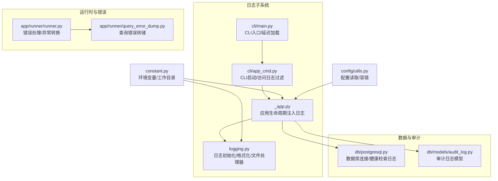
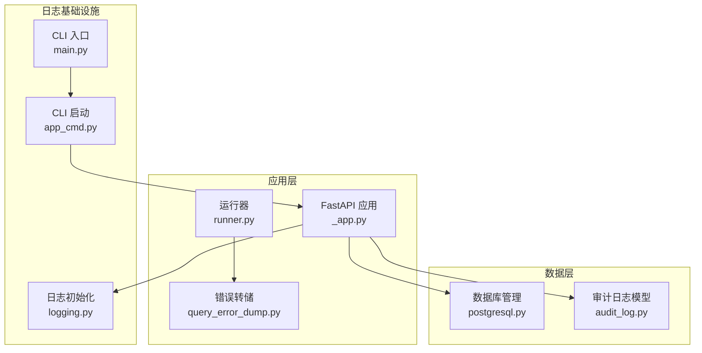
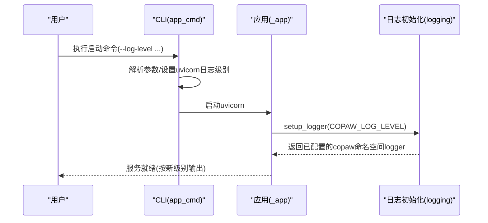
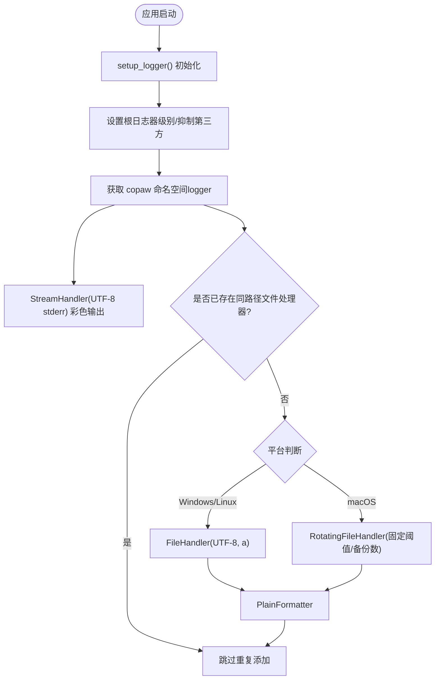
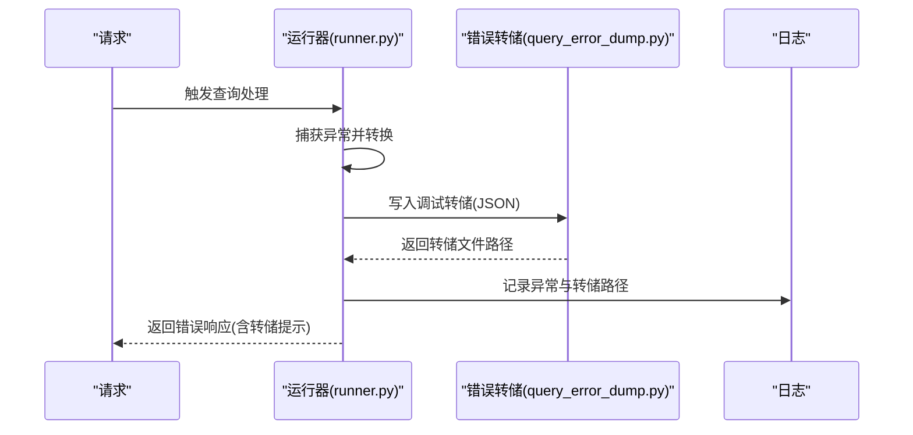
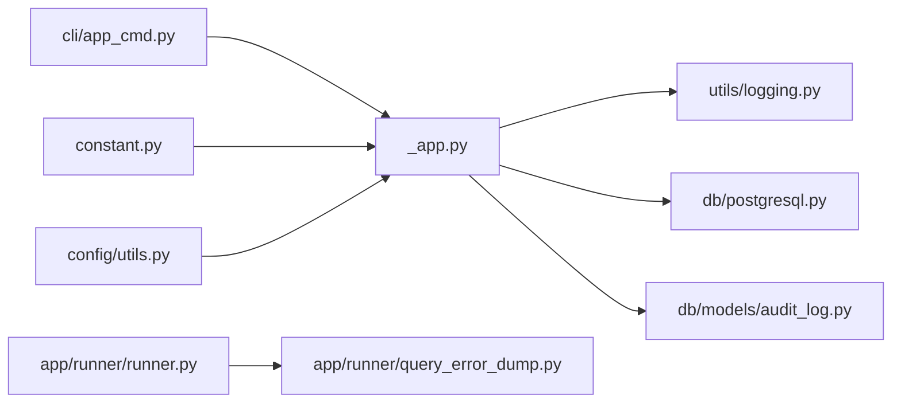

# 日志管理

<cite>
**本文引用的文件**
- [src/copaw/utils/logging.py](file://src/copaw/utils/logging.py)
- [src/copaw/app/_app.py](file://src/copaw/app/_app.py)
- [src/copaw/cli/app_cmd.py](file://src/copaw/cli/app_cmd.py)
- [src/copaw/cli/main.py](file://src/copaw/cli/main.py)
- [src/copaw/db/postgresql.py](file://src/copaw/db/postgresql.py)
- [src/copaw/db/models/audit_log.py](file://src/copaw/db/models/audit_log.py)
- [src/copaw/app/runner/query_error_dump.py](file://src/copaw/app/runner/query_error_dump.py)
- [src/copaw/app/runner/runner.py](file://src/copaw/app/runner/runner.py)
- [src/copaw/constant.py](file://src/copaw/constant.py)
- [src/copaw/config/utils.py](file://src/copaw/config/utils.py)
</cite>

## 目录
1. [简介](#简介)
2. [项目结构](#项目结构)
3. [核心组件](#核心组件)
4. [架构总览](#架构总览)
5. [详细组件分析](#详细组件分析)
6. [依赖分析](#依赖分析)
7. [性能考虑](#性能考虑)
8. [故障排查指南](#故障排查指南)
9. [结论](#结论)
10. [附录](#附录)

## 简介
本指南面向 CoPaw 日志管理系统，提供从配置到运维的完整说明。内容覆盖：
- 日志级别设置与生效路径
- 输出格式与终端/文件双通道
- 文件轮转策略与平台差异
- 应用日志、数据库日志、通道日志与错误追踪的记录方式
- 日志收集、存储与检索最佳实践（集中化、分析与搜索）
- 清理策略、存储优化与性能影响评估

## 项目结构
围绕日志的关键模块与文件如下：
- 日志初始化与格式化：src/copaw/utils/logging.py
- 应用生命周期注入日志：src/copaw/app/_app.py
- CLI 启动参数与访问日志过滤：src/copaw/cli/app_cmd.py
- CLI 入口与延迟加载：src/copaw/cli/main.py
- 数据库连接与健康检查日志：src/copaw/db/postgresql.py
- 审计日志模型与查询接口：src/copaw/db/models/audit_log.py
- 查询错误堆栈与调试转储：src/copaw/app/runner/query_error_dump.py
- 错误处理与异常转换：src/copaw/app/runner/runner.py
- 环境变量与工作目录：src/copaw/constant.py
- 配置读写与容错：src/copaw/config/utils.py

**图表来源**
- [src/copaw/utils/logging.py:119-198](file://src/copaw/utils/logging.py#L119-L198)
- [src/copaw/app/_app.py:42-44](file://src/copaw/app/_app.py#L42-L44)
- [src/copaw/cli/app_cmd.py:55-111](file://src/copaw/cli/app_cmd.py#L55-L111)
- [src/copaw/cli/main.py:58-93](file://src/copaw/cli/main.py#L58-L93)
- [src/copaw/db/postgresql.py:41-187](file://src/copaw/db/postgresql.py#L41-L187)
- [src/copaw/db/models/audit_log.py:18-37](file://src/copaw/db/models/audit_log.py#L18-L37)
- [src/copaw/app/runner/runner.py:544-577](file://src/copaw/app/runner/runner.py#L544-L577)
- [src/copaw/app/runner/query_error_dump.py:76-104](file://src/copaw/app/runner/query_error_dump.py#L76-L104)
- [src/copaw/constant.py:72-127](file://src/copaw/constant.py#L72-L127)
- [src/copaw/config/utils.py:487-541](file://src/copaw/config/utils.py#L487-L541)

**章节来源**
- [src/copaw/utils/logging.py:119-198](file://src/copaw/utils/logging.py#L119-L198)
- [src/copaw/app/_app.py:42-44](file://src/copaw/app/_app.py#L42-L44)
- [src/copaw/cli/app_cmd.py:55-111](file://src/copaw/cli/app_cmd.py#L55-L111)
- [src/copaw/cli/main.py:58-93](file://src/copaw/cli/main.py#L58-L93)
- [src/copaw/db/postgresql.py:41-187](file://src/copaw/db/postgresql.py#L41-L187)
- [src/copaw/db/models/audit_log.py:18-37](file://src/copaw/db/models/audit_log.py#L18-L37)
- [src/copaw/app/runner/runner.py:544-577](file://src/copaw/app/runner/runner.py#L544-L577)
- [src/copaw/app/runner/query_error_dump.py:76-104](file://src/copaw/app/runner/query_error_dump.py#L76-L104)
- [src/copaw/constant.py:72-127](file://src/copaw/constant.py#L72-L127)
- [src/copaw/config/utils.py:487-541](file://src/copaw/config/utils.py#L487-L541)

## 核心组件
- 日志初始化与格式化
  - 提供彩色/纯文本两种格式化器，自动识别终端并按需启用颜色
  - 仅输出 copaw 命名空间下的日志，避免第三方库噪声
  - 控制根日志器级别，抑制第三方日志
- 文件处理器与轮转
  - 在应用生命周期中添加文件处理器
  - Windows/Linux 使用简单文件处理器；macOS 使用带轮转的处理器
  - 轮转阈值与备份数量固定，避免重复句柄
- CLI 启动与访问日志过滤
  - 支持通过命令行设置日志级别
  - 对 uvicorn 访问日志进行路径过滤，隐藏敏感或高频路径
- 数据库日志
  - 连接建立、健康检查、关闭等关键节点均输出日志
- 审计日志
  - 审计日志模型与查询接口，支持多维过滤与分页
- 错误追踪
  - 统一捕获异常并转换，生成查询错误转储文件，便于离线分析

**章节来源**
- [src/copaw/utils/logging.py:119-198](file://src/copaw/utils/logging.py#L119-L198)
- [src/copaw/app/_app.py:162-168](file://src/copaw/app/_app.py#L162-L168)
- [src/copaw/cli/app_cmd.py:55-111](file://src/copaw/cli/app_cmd.py#L55-L111)
- [src/copaw/db/postgresql.py:87-120](file://src/copaw/db/postgresql.py#L87-L120)
- [src/copaw/db/models/audit_log.py:18-37](file://src/copaw/db/models/audit_log.py#L18-L37)
- [src/copaw/app/runner/runner.py:544-577](file://src/copaw/app/runner/runner.py#L544-L577)
- [src/copaw/app/runner/query_error_dump.py:76-104](file://src/copaw/app/runner/query_error_dump.py#L76-L104)

## 架构总览
CoPaw 日志体系由“应用层日志”“数据库层日志”“通道层日志”“错误追踪日志”四部分组成，并通过统一的初始化与格式化模块实现一致的输出风格。

**图表来源**
- [src/copaw/app/_app.py:42-44](file://src/copaw/app/_app.py#L42-L44)
- [src/copaw/app/_app.py:162-168](file://src/copaw/app/_app.py#L162-L168)
- [src/copaw/cli/app_cmd.py:55-111](file://src/copaw/cli/app_cmd.py#L55-L111)
- [src/copaw/cli/main.py:58-93](file://src/copaw/cli/main.py#L58-L93)
- [src/copaw/utils/logging.py:119-198](file://src/copaw/utils/logging.py#L119-L198)
- [src/copaw/db/postgresql.py:87-120](file://src/copaw/db/postgresql.py#L87-L120)
- [src/copaw/db/models/audit_log.py:18-37](file://src/copaw/db/models/audit_log.py#L18-L37)
- [src/copaw/app/runner/runner.py:544-577](file://src/copaw/app/runner/runner.py#L544-L577)
- [src/copaw/app/runner/query_error_dump.py:76-104](file://src/copaw/app/runner/query_error_dump.py#L76-L104)

## 详细组件分析

### 日志级别与生效路径
- CLI 设置日志级别
  - CLI 提供 --log-level 参数，支持 critical/error/warning/info/debug/trace
  - 启动后在 uvicorn 运行前设置日志级别
- 应用加载时生效
  - 应用模块在导入时调用日志初始化函数，应用环境变量 COPAW_LOG_LEVEL
  - 保证热重载子进程继承同一日志级别
- 根日志器控制
  - 将非 copaw 命名空间的日志级别提升至 WARNING 或 INFO，降低噪音

**图表来源**
- [src/copaw/cli/app_cmd.py:55-111](file://src/copaw/cli/app_cmd.py#L55-L111)
- [src/copaw/app/_app.py:42-44](file://src/copaw/app/_app.py#L42-L44)
- [src/copaw/utils/logging.py:119-154](file://src/copaw/utils/logging.py#L119-L154)

**章节来源**
- [src/copaw/cli/app_cmd.py:30-54](file://src/copaw/cli/app_cmd.py#L30-L54)
- [src/copaw/app/_app.py:42-44](file://src/copaw/app/_app.py#L42-L44)
- [src/copaw/utils/logging.py:119-154](file://src/copaw/utils/logging.py#L119-L154)
- [src/copaw/constant.py:126-127](file://src/copaw/constant.py#L126-L127)

### 输出格式与终端/文件双通道
- 终端输出
  - 彩色格式化器：根据级别着色，自动检测终端能力
  - 显示时间、级别、文件路径与行号、消息
- 文件输出
  - 生命周期中添加文件处理器：Windows/Linux 使用普通文件处理器；macOS 使用带轮转的处理器
  - 文件路径默认位于工作目录，文件名 copaw.log
  - 纯文本格式化器：统一时间、级别、位置与消息格式

**图表来源**
- [src/copaw/utils/logging.py:119-198](file://src/copaw/utils/logging.py#L119-L198)
- [src/copaw/app/_app.py:162-168](file://src/copaw/app/_app.py#L162-L168)

**章节来源**
- [src/copaw/utils/logging.py:49-95](file://src/copaw/utils/logging.py#L49-L95)
- [src/copaw/utils/logging.py:119-198](file://src/copaw/utils/logging.py#L119-L198)
- [src/copaw/app/_app.py:162-168](file://src/copaw/app/_app.py#L162-L168)

### 文件轮转策略与平台差异
- 轮转阈值与备份数
  - 固定阈值与备份数，避免过大日志文件
- 平台差异
  - Windows/Linux：直接使用 FileHandler，规避文件锁问题
  - macOS：使用 RotatingFileHandler，自动轮转
- 幂等性
  - 若同路径文件处理器已存在，则不重复添加，防止句柄泄漏与重复输出

**章节来源**
- [src/copaw/utils/logging.py:11-13](file://src/copaw/utils/logging.py#L11-L13)
- [src/copaw/utils/logging.py:157-198](file://src/copaw/utils/logging.py#L157-L198)

### 访问日志过滤
- 功能
  - 通过 CLI 参数 hide-access-paths 指定需要隐藏的路径片段
  - 为 uvicorn.access 日志器添加过滤器，屏蔽匹配的消息
- 适用场景
  - 隐藏高频或敏感接口（如推送接口）以降低噪音

**章节来源**
- [src/copaw/cli/app_cmd.py:40-54](file://src/copaw/cli/app_cmd.py#L40-L54)
- [src/copaw/cli/app_cmd.py:98-102](file://src/copaw/cli/app_cmd.py#L98-L102)
- [src/copaw/utils/logging.py:97-117](file://src/copaw/utils/logging.py#L97-L117)

### 应用日志
- 初始化与注入
  - 应用模块导入时即执行日志初始化
  - 生命周期中添加文件处理器
- 关键事件日志
  - 启动/停止、插件注册、企业模式连接、本地模型服务启停、通道启停等

**章节来源**
- [src/copaw/app/_app.py:42-44](file://src/copaw/app/_app.py#L42-L44)
- [src/copaw/app/_app.py:162-168](file://src/copaw/app/_app.py#L162-L168)
- [src/copaw/app/_app.py:188-208](file://src/copaw/app/_app.py#L188-L208)
- [src/copaw/app/_app.py:381-393](file://src/copaw/app/_app.py#L381-L393)
- [src/copaw/app/_app.py:565-569](file://src/copaw/app/_app.py#L565-L569)
- [src/copaw/app/_app.py:431-454](file://src/copaw/app/_app.py#L431-L454)

### 数据库日志
- 连接与健康检查
  - 连接参数、池大小、溢出、预检等信息均记录
  - 健康检查失败会输出错误日志
- 生命周期
  - 应用启动时初始化，关闭时释放连接池

**章节来源**
- [src/copaw/db/postgresql.py:87-120](file://src/copaw/db/postgresql.py#L87-L120)
- [src/copaw/db/postgresql.py:144-156](file://src/copaw/db/postgresql.py#L144-L156)
- [src/copaw/db/postgresql.py:115-120](file://src/copaw/db/postgresql.py#L115-L120)

### 通道日志
- 控制台通道
  - 启动/停止时输出日志
  - Windows 下对 stdout/stderr 编码进行适配
- 其他通道
  - 通道管理器在切换通道时记录日志，包含启动/停止流程

**章节来源**
- [src/copaw/app/channels/console/channel.py:125-135](file://src/copaw/app/channels/console/channel.py#L125-L135)
- [src/copaw/app/channels/console/channel.py:562-571](file://src/copaw/app/channels/console/channel.py#L562-L571)
- [src/copaw/app/channels/manager.py:594-630](file://src/copaw/app/channels/manager.py#L594-L630)

### 错误追踪与调试转储
- 异常转换
  - 运行器捕获异常并转换为统一异常类型，保留原始异常信息
- 调试转储
  - 生成临时 JSON 文件，包含异常类型、消息、请求上下文、代理状态、时间戳等
  - 将转储路径附加到异常对象，便于客户端提示与后续定位

**图表来源**
- [src/copaw/app/runner/runner.py:544-577](file://src/copaw/app/runner/runner.py#L544-L577)
- [src/copaw/app/runner/query_error_dump.py:76-104](file://src/copaw/app/runner/query_error_dump.py#L76-L104)

**章节来源**
- [src/copaw/app/runner/runner.py:544-577](file://src/copaw/app/runner/runner.py#L544-L577)
- [src/copaw/app/runner/query_error_dump.py:76-104](file://src/copaw/app/runner/query_error_dump.py#L76-L104)

### 审计日志
- 模型与索引
  - 审计日志模型定义字段与索引，满足 ISO 27001 要求
- 查询接口
  - 支持按用户、动作类型、资源类型、结果、时间范围、敏感标记等过滤
  - 支持分页与总数统计

**章节来源**
- [src/copaw/db/models/audit_log.py:18-37](file://src/copaw/db/models/audit_log.py#L18-L37)
- [src/copaw/enterprise/audit_service.py:91-121](file://src/copaw/enterprise/audit_service.py#L91-L121)

## 依赖分析
- 日志初始化依赖于应用生命周期与 CLI 启动参数
- 数据库日志依赖于数据库管理器的初始化与健康检查
- 审计日志依赖于配置与数据库模型
- 错误转储依赖于运行器捕获与临时文件写入

**图表来源**
- [src/copaw/cli/app_cmd.py:55-111](file://src/copaw/cli/app_cmd.py#L55-L111)
- [src/copaw/app/_app.py:42-44](file://src/copaw/app/_app.py#L42-L44)
- [src/copaw/utils/logging.py:119-198](file://src/copaw/utils/logging.py#L119-L198)
- [src/copaw/db/postgresql.py:87-120](file://src/copaw/db/postgresql.py#L87-L120)
- [src/copaw/db/models/audit_log.py:18-37](file://src/copaw/db/models/audit_log.py#L18-L37)
- [src/copaw/app/runner/runner.py:544-577](file://src/copaw/app/runner/runner.py#L544-L577)
- [src/copaw/app/runner/query_error_dump.py:76-104](file://src/copaw/app/runner/query_error_dump.py#L76-L104)
- [src/copaw/constant.py:72-127](file://src/copaw/constant.py#L72-L127)
- [src/copaw/config/utils.py:487-541](file://src/copaw/config/utils.py#L487-L541)

**章节来源**
- [src/copaw/cli/app_cmd.py:55-111](file://src/copaw/cli/app_cmd.py#L55-L111)
- [src/copaw/app/_app.py:42-44](file://src/copaw/app/_app.py#L42-L44)
- [src/copaw/utils/logging.py:119-198](file://src/copaw/utils/logging.py#L119-L198)
- [src/copaw/db/postgresql.py:87-120](file://src/copaw/db/postgresql.py#L87-L120)
- [src/copaw/db/models/audit_log.py:18-37](file://src/copaw/db/models/audit_log.py#L18-L37)
- [src/copaw/app/runner/runner.py:544-577](file://src/copaw/app/runner/runner.py#L544-L577)
- [src/copaw/app/runner/query_error_dump.py:76-104](file://src/copaw/app/runner/query_error_dump.py#L76-L104)
- [src/copaw/constant.py:72-127](file://src/copaw/constant.py#L72-L127)
- [src/copaw/config/utils.py:487-541](file://src/copaw/config/utils.py#L487-L541)

## 性能考虑
- 日志级别
  - 生产建议使用 info 或 warning，避免 debug 的高 IO 开销
- 终端输出
  - 彩色输出在非终端环境下自动降级为纯文本，减少不必要的转义开销
- 文件写入
  - Windows/Linux 使用普通文件处理器，避免轮转带来的额外开销
  - macOS 使用轮转处理器，注意磁盘写入与 inode 更新成本
- 访问日志过滤
  - 隐藏高频路径可显著降低日志体量与解析成本
- 数据库日志
  - 健康检查与连接池参数需结合实例规模调整，避免频繁 ping 导致额外网络开销
- 错误转储
  - 转储文件为临时文件，建议定期清理，避免磁盘占用

[本节为通用指导，无需特定文件引用]

## 故障排查指南
- 启动后日志级别未生效
  - 检查 CLI 是否正确传入 --log-level
  - 确认应用导入时已读取 COPAW_LOG_LEVEL 环境变量
- 日志过多或噪音大
  - 使用 hide-access-paths 过滤高频路径
  - 提升根日志器级别至 WARNING
- 文件写入失败或锁冲突
  - Windows/Linux 平台使用普通文件处理器，避免轮转
  - 确认文件处理器幂等性，避免重复添加
- 数据库连接异常
  - 查看数据库日志中的连接参数与健康检查失败原因
- 审计日志查询无结果
  - 检查过滤条件与时间范围
  - 确认索引是否存在
- 错误转储未生成
  - 检查运行器异常捕获逻辑与临时目录权限
  - 查看日志中关于转储写入失败的警告

**章节来源**
- [src/copaw/cli/app_cmd.py:98-102](file://src/copaw/cli/app_cmd.py#L98-L102)
- [src/copaw/utils/logging.py:129-139](file://src/copaw/utils/logging.py#L129-L139)
- [src/copaw/utils/logging.py:173-177](file://src/copaw/utils/logging.py#L173-L177)
- [src/copaw/db/postgresql.py:144-156](file://src/copaw/db/postgresql.py#L144-L156)
- [src/copaw/db/models/audit_log.py:33-37](file://src/copaw/db/models/audit_log.py#L33-L37)
- [src/copaw/app/runner/query_error_dump.py:102-104](file://src/copaw/app/runner/query_error_dump.py#L102-L104)

## 结论
CoPaw 的日志体系通过统一的初始化与格式化、平台化的文件轮转、CLI 层面的日志级别与访问日志过滤，以及完善的数据库与审计日志记录，形成了覆盖应用、数据、通道与错误的全链路日志方案。配合错误转储与审计查询接口，可在保障性能的同时满足可观测性与合规需求。

[本节为总结，无需特定文件引用]

## 附录

### 日志级别与输出格式对照
- 级别映射
  - 支持 critical/error/warning/info/debug/trace
- 终端输出
  - 彩色格式化器：级别着色，显示时间、级别、文件路径与行号、消息
- 文件输出
  - 纯文本格式化器：统一时间、级别、位置与消息格式

**章节来源**
- [src/copaw/utils/logging.py:16-22](file://src/copaw/utils/logging.py#L16-L22)
- [src/copaw/utils/logging.py:49-95](file://src/copaw/utils/logging.py#L49-L95)

### 默认日志文件与工作目录
- 工作目录
  - 通过环境变量 COPAW_WORKING_DIR 指定，默认位于用户主目录下的 .copaw
- 日志文件
  - 默认 copaw.log，位于工作目录下

**章节来源**
- [src/copaw/constant.py:72-86](file://src/copaw/constant.py#L72-L86)
- [src/copaw/app/_app.py:162-168](file://src/copaw/app/_app.py#L162-L168)

### 集中式日志管理与检索建议
- 收集
  - 将 copaw.log 采集至集中式日志系统（如 ELK、Loki、Splunk）
- 存储
  - 按天/周/月切分，保留必要备份数量
- 检索
  - 为审计日志与错误转储建立索引，支持按用户、动作、时间、结果等维度查询
- 分析
  - 利用访问日志过滤后的数据进行流量分析与异常检测

[本节为通用指导，无需特定文件引用]