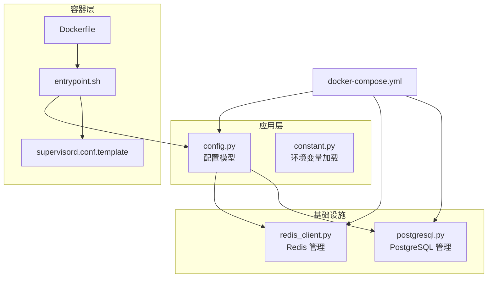
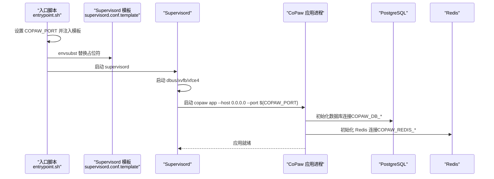
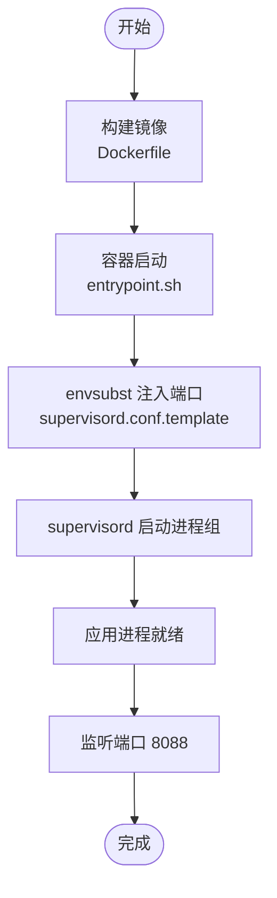
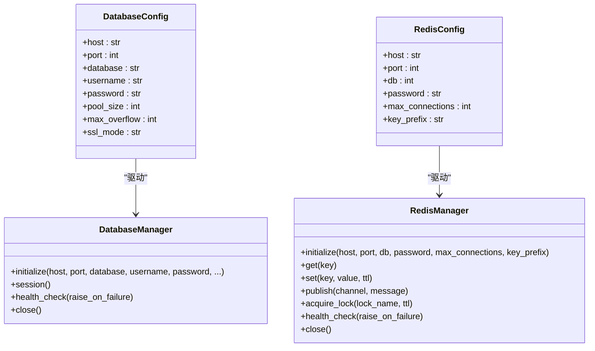
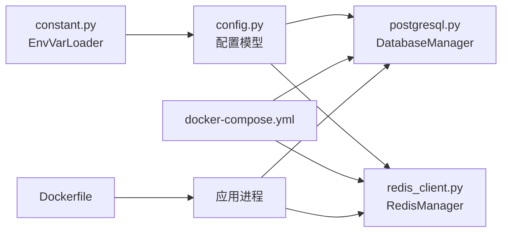

# 环境配置

<cite>
**本文引用的文件**   
- [Dockerfile](file://deploy/Dockerfile)
- [docker-compose.yml](file://docker-compose.yml)
- [entrypoint.sh](file://deploy/entrypoint.sh)
- [supervisord.conf.template](file://deploy/config/supervisord.conf.template)
- [Deployment.md](file://docs/wiki/Deployment.md)
- [config.py](file://src/copaw/config/config.py)
- [constant.py](file://src/copaw/constant.py)
- [postgresql.py](file://src/copaw/db/postgresql.py)
- [redis_client.py](file://src/copaw/db/redis_client.py)
- [docker_build.sh](file://scripts/docker_build.sh)
</cite>

## 目录
1. [简介](#简介)
2. [项目结构](#项目结构)
3. [核心组件](#核心组件)
4. [架构总览](#架构总览)
5. [详细组件分析](#详细组件分析)
6. [依赖分析](#依赖分析)
7. [性能考虑](#性能考虑)
8. [故障排查指南](#故障排查指南)
9. [结论](#结论)
10. [附录](#附录)

## 简介
本指南面向生产环境与开发环境的 CoPaw 环境配置，覆盖以下主题：
- 硬件与系统要求
- 操作系统兼容性
- 网络与反向代理
- 安全与认证
- Docker 环境搭建（镜像构建、容器配置、网络连接）
- 环境变量配置（数据库、Redis、端口、认证等）
- 不同部署场景的配置模板与最佳实践

## 项目结构
CoPaw 的环境配置涉及多处关键文件：
- Docker 构建与编排：Dockerfile、docker-compose.yml、entrypoint.sh、supervisord.conf.template
- 配置与常量：config.py、constant.py
- 数据库与缓存：postgresql.py、redis_client.py
- 部署与脚本：Deployment.md、docker_build.sh

**图表来源**
- [Dockerfile:1-103](file://deploy/Dockerfile#L1-L103)
- [docker-compose.yml:1-92](file://docker-compose.yml#L1-L92)
- [entrypoint.sh:1-10](file://deploy/entrypoint.sh#L1-L10)
- [supervisord.conf.template:1-40](file://deploy/config/supervisord.conf.template#L1-L40)
- [config.py:30-81](file://src/copaw/config/config.py#L30-L81)
- [constant.py:12-133](file://src/copaw/constant.py#L12-L133)
- [postgresql.py:41-114](file://src/copaw/db/postgresql.py#L41-L114)
- [redis_client.py:22-78](file://src/copaw/db/redis_client.py#L22-L78)

**章节来源**
- [Dockerfile:1-103](file://deploy/Dockerfile#L1-L103)
- [docker-compose.yml:1-92](file://docker-compose.yml#L1-L92)
- [entrypoint.sh:1-10](file://deploy/entrypoint.sh#L1-L10)
- [supervisord.conf.template:1-40](file://deploy/config/supervisord.conf.template#L1-L40)
- [config.py:30-81](file://src/copaw/config/config.py#L30-L81)
- [constant.py:12-133](file://src/copaw/constant.py#L12-L133)
- [postgresql.py:41-114](file://src/copaw/db/postgresql.py#L41-L114)
- [redis_client.py:22-78](file://src/copaw/db/redis_client.py#L22-L78)

## 核心组件
- 环境变量加载与解析：通过 EnvVarLoader 提供类型安全的环境变量读取与默认值处理，支持布尔、整数、浮点、字符串。
- 企业级配置：DatabaseConfig、RedisConfig、EnterpriseConfig 等，支持从 COPAW_DB_* 与 COPAW_REDIS_* 环境变量注入。
- 数据库连接管理：PostgreSQL 异步连接池，初始化时进行健康检查。
- 缓存与会话：Redis 异步连接池，提供缓存、哈希、发布订阅、分布式锁等常用模式。
- Docker 运行时：多阶段构建前端产物，容器内通过 supervisord 启动 dbus、xvfb、xfce4 以及应用进程。

**章节来源**
- [constant.py:12-133](file://src/copaw/constant.py#L12-L133)
- [config.py:30-81](file://src/copaw/config/config.py#L30-L81)
- [postgresql.py:41-114](file://src/copaw/db/postgresql.py#L41-L114)
- [redis_client.py:22-78](file://src/copaw/db/redis_client.py#L22-L78)
- [Dockerfile:1-103](file://deploy/Dockerfile#L1-L103)

## 架构总览
下图展示容器内应用启动流程与外部依赖关系：

**图表来源**
- [entrypoint.sh:1-10](file://deploy/entrypoint.sh#L1-L10)
- [supervisord.conf.template:14-21](file://deploy/config/supervisord.conf.template#L14-L21)
- [postgresql.py:61-114](file://src/copaw/db/postgresql.py#L61-L114)
- [redis_client.py:43-78](file://src/copaw/db/redis_client.py#L43-L78)

## 详细组件分析

### Docker 环境搭建
- 多阶段构建：前端构建与应用打包分离；最终镜像包含 Python、Chromium、Supervisord 等运行时依赖。
- 环境变量：
  - 默认工作目录与密钥目录
  - 渠道过滤（COPAW_DISABLED_CHANNELS/COPAW_ENABLED_CHANNELS）
  - 应用端口（COPAW_PORT，默认 8088）
  - 容器内运行标记（COPAW_RUNNING_IN_CONTAINER）
- 容器启动：entrypoint.sh 注入端口到 supervisord.conf.template，再由 supervisord 启动 dbus、xvfb、xfce4 与应用进程。
- Compose 编排：postgres（16-alpine）、redis（7-alpine）与 copaw 服务，分别暴露端口并持久化数据卷。

**图表来源**
- [Dockerfile:1-103](file://deploy/Dockerfile#L1-L103)
- [entrypoint.sh:1-10](file://deploy/entrypoint.sh#L1-L10)
- [supervisord.conf.template:14-21](file://deploy/config/supervisord.conf.template#L14-L21)

**章节来源**
- [Dockerfile:1-103](file://deploy/Dockerfile#L1-L103)
- [docker-compose.yml:63-92](file://docker-compose.yml#L63-L92)
- [entrypoint.sh:1-10](file://deploy/entrypoint.sh#L1-L10)
- [supervisord.conf.template:1-40](file://deploy/config/supervisord.conf.template#L1-L40)
- [docker_build.sh:1-32](file://scripts/docker_build.sh#L1-L32)

### 环境变量配置
- 工作目录与密钥目录：COPAW_WORKING_DIR、COPAW_SECRET_DIR
- 日志级别：COPAW_LOG_LEVEL
- 运行容器标记：COPAW_RUNNING_IN_CONTAINER
- CORS 开发来源：COPAW_CORS_ORIGINS
- 企业模式开关：COPAW_ENTERPRISE_ENABLED
- 数据库连接：COPAW_DB_HOST、COPAW_DB_PORT、COPAW_DB_NAME、COPAW_DB_USER、COPAW_DB_PASSWORD、COPAW_DB_SSL_MODE
- Redis 连接：COPAW_REDIS_HOST、COPAW_REDIS_PORT、COPAW_REDIS_PASSWORD、COPAW_REDIS_DB、COPAW_REDIS_MAX_CONNECTIONS
- JWT 密钥：COPAW_JWT_SECRET（生产必须覆盖）
- 应用端口：COPAW_PORT（默认 8088）
- LLM 速率限制与并发：COPAW_LLM_MAX_RETRIES、COPAW_LLM_BACKOFF_BASE、COPAW_LLM_BACKOFF_CAP、COPAW_LLM_MAX_CONCURRENT、COPAW_LLM_MAX_QPM、COPAW_LLM_RATE_LIMIT_PAUSE、COPAW_LLM_RATE_LIMIT_JITTER、COPAW_LLM_ACQUIRE_TIMEOUT
- 技能中心与工具：COPAW_GITHUB_CACHE_TTL、COPAW_SKILLS_HUB_* 系列、COPAW_SKILL_CONFIG_* 等
- 浏览器与 Playwright：PLAYWRIGHT_CHROMIUM_EXECUTABLE_PATH、COPAW_BROWSER_USE_DEFAULT 等

**章节来源**
- [constant.py:12-274](file://src/copaw/constant.py#L12-L274)
- [config.py:30-81](file://src/copaw/config/config.py#L30-L81)
- [docker-compose.yml:74-88](file://docker-compose.yml#L74-L88)
- [Dockerfile:14-95](file://deploy/Dockerfile#L14-L95)

### 数据库与缓存配置
- PostgreSQL
  - 通过 DatabaseConfig 与 COPAW_DB_* 环境变量注入
  - 初始化时建立异步引擎与会话工厂，并执行健康检查
- Redis
  - 通过 RedisConfig 与 COPAW_REDIS_* 环境变量注入
  - 提供缓存、哈希、发布订阅、分布式锁等常用操作，并进行健康检查

**图表来源**
- [config.py:32-58](file://src/copaw/config/config.py#L32-L58)
- [postgresql.py:41-114](file://src/copaw/db/postgresql.py#L41-L114)
- [redis_client.py:22-78](file://src/copaw/db/redis_client.py#L22-L78)

**章节来源**
- [config.py:30-81](file://src/copaw/config/config.py#L30-L81)
- [postgresql.py:41-114](file://src/copaw/db/postgresql.py#L41-L114)
- [redis_client.py:22-78](file://src/copaw/db/redis_client.py#L22-L78)

### 网络与反向代理
- 容器端口映射：默认 8088，可通过 COPAW_PORT 调整
- Compose 暴露策略：建议仅绑定 127.0.0.1，结合反向代理对外提供服务
- 反向代理示例：Nginx、Caddy、Apache，均支持 WebSocket 升级
- 本地模型访问：可使用 host.docker.internal 或 host 网络模式

**章节来源**
- [docker-compose.yml:73-73](file://docker-compose.yml#L73-L73)
- [Deployment.md:286-332](file://docs/wiki/Deployment.md#L286-L332)
- [Deployment.md:168-192](file://docs/wiki/Deployment.md#L168-L192)

### 安全与认证
- Web 认证：COPAW_AUTH_ENABLED（可在环境变量或配置文件中启用）
- HTTPS：建议使用 Let’s Encrypt 自动签发与续期
- 防火墙：开放 80/443/8088 端口（按需）
- JWT 密钥：COPAW_JWT_SECRET 必须在生产环境覆盖默认值

**章节来源**
- [Deployment.md:335-380](file://docs/wiki/Deployment.md#L335-L380)
- [docker-compose.yml:87-88](file://docker-compose.yml#L87-L88)

## 依赖分析
- 组件耦合
  - 应用通过 config.py 的配置类读取 constant.py 中的环境变量解析结果
  - 数据库与缓存模块通过各自的 Manager 类初始化并注入到应用生命周期
  - Docker 编排将数据库与缓存作为独立服务，应用通过环境变量连接
- 外部依赖
  - PostgreSQL 16、Redis 7
  - Chromium（容器内）用于浏览器自动化
  - Supervisord 管理多进程

**图表来源**
- [constant.py:12-133](file://src/copaw/constant.py#L12-L133)
- [config.py:30-81](file://src/copaw/config/config.py#L30-L81)
- [postgresql.py:41-114](file://src/copaw/db/postgresql.py#L41-L114)
- [redis_client.py:22-78](file://src/copaw/db/redis_client.py#L22-L78)
- [docker-compose.yml:17-92](file://docker-compose.yml#L17-L92)
- [Dockerfile:1-103](file://deploy/Dockerfile#L1-L103)

**章节来源**
- [constant.py:12-133](file://src/copaw/constant.py#L12-L133)
- [config.py:30-81](file://src/copaw/config/config.py#L30-L81)
- [postgresql.py:41-114](file://src/copaw/db/postgresql.py#L41-L114)
- [redis_client.py:22-78](file://src/copaw/db/redis_client.py#L22-L78)
- [docker-compose.yml:17-92](file://docker-compose.yml#L17-L92)
- [Dockerfile:1-103](file://deploy/Dockerfile#L1-L103)

## 性能考虑
- 速率限制与并发：通过 LLM_MAX_CONCURRENT、LLM_MAX_QPM、LLM_RATE_LIMIT_PAUSE 等控制请求并发与节流
- 内存与上下文压缩：通过配置项控制上下文压缩阈值与保留比例
- 本地模型加速：可利用 GPU/Metal 加速本地推理
- 缓存与会话：合理设置 Redis 最大连接数与密码，避免成为瓶颈

**章节来源**
- [constant.py:187-249](file://src/copaw/constant.py#L187-L249)
- [config.py:497-650](file://src/copaw/config/config.py#L497-L650)
- [Deployment.md:486-527](file://docs/wiki/Deployment.md#L486-L527)

## 故障排查指南
- 端口占用：检查 8088 端口占用情况，必要时修改 COPAW_PORT
- 内存不足：查看系统内存与交换分区，必要时增加 swap
- 容器启动失败：查看容器日志，进入容器进行调试
- API Key 无效：确认 Key 格式、配额与网络连通性
- 健康检查：通过 /api/health 或 copaw status 检查服务状态

**章节来源**
- [Deployment.md:443-484](file://docs/wiki/Deployment.md#L443-L484)
- [Deployment.md:407-415](file://docs/wiki/Deployment.md#L407-L415)

## 结论
通过上述配置与最佳实践，可在生产环境中稳定运行 CoPaw。建议：
- 使用 Docker Compose 编排数据库与缓存服务
- 在生产环境覆盖默认 JWT 密钥与敏感参数
- 通过反向代理统一接入与安全加固
- 结合速率限制与内存压缩策略提升稳定性与性能

## 附录

### 硬件与系统要求
- 最低配置：2 vCPU、4 GB 内存
- 推荐配置：4 vCPU、8 GB 内存
- 本地模型（含 GPU）：8 vCPU、16 GB 内存 + GPU

**章节来源**
- [Deployment.md:263-267](file://docs/wiki/Deployment.md#L263-L267)

### 操作系统兼容性
- 容器内基于 Debian/Alpine，支持 Linux、macOS、Windows（通过容器运行）
- 桌面应用提供 Windows/macOS 安装包

**章节来源**
- [Deployment.md:270-284](file://docs/wiki/Deployment.md#L270-L284)

### Docker 环境搭建步骤
- 拉取官方镜像或构建自定义镜像
- 使用 docker run 或 docker-compose 启动
- 映射工作目录与密钥目录，设置 COPAW_PORT 与企业模式参数

**章节来源**
- [Deployment.md:119-244](file://docs/wiki/Deployment.md#L119-L244)
- [docker_build.sh:1-32](file://scripts/docker_build.sh#L1-L32)

### 环境变量清单（摘要）
- 工作目录与密钥目录：COPAW_WORKING_DIR、COPAW_SECRET_DIR
- 日志级别：COPAW_LOG_LEVEL
- 运行容器标记：COPAW_RUNNING_IN_CONTAINER
- CORS 来源：COPAW_CORS_ORIGINS
- 企业模式：COPAW_ENTERPRISE_ENABLED
- 数据库：COPAW_DB_HOST、COPAW_DB_PORT、COPAW_DB_NAME、COPAW_DB_USER、COPAW_DB_PASSWORD、COPAW_DB_SSL_MODE
- Redis：COPAW_REDIS_HOST、COPAW_REDIS_PORT、COPAW_REDIS_PASSWORD、COPAW_REDIS_DB、COPAW_REDIS_MAX_CONNECTIONS
- JWT：COPAW_JWT_SECRET
- 应用端口：COPAW_PORT
- LLM 限流与并发：COPAW_LLM_MAX_RETRIES、COPAW_LLM_BACKOFF_BASE、COPAW_LLM_BACKOFF_CAP、COPAW_LLM_MAX_CONCURRENT、COPAW_LLM_MAX_QPM、COPAW_LLM_RATE_LIMIT_PAUSE、COPAW_LLM_RATE_LIMIT_JITTER、COPAW_LLM_ACQUIRE_TIMEOUT
- 技能中心与工具：COPAW_GITHUB_CACHE_TTL、COPAW_SKILLS_HUB_*、COPAW_SKILL_CONFIG_*
- 浏览器与 Playwright：PLAYWRIGHT_CHROMIUM_EXECUTABLE_PATH、COPAW_BROWSER_USE_DEFAULT

**章节来源**
- [constant.py:12-274](file://src/copaw/constant.py#L12-L274)
- [config.py:30-81](file://src/copaw/config/config.py#L30-L81)
- [docker-compose.yml:74-88](file://docker-compose.yml#L74-L88)
- [Dockerfile:14-95](file://deploy/Dockerfile#L14-L95)