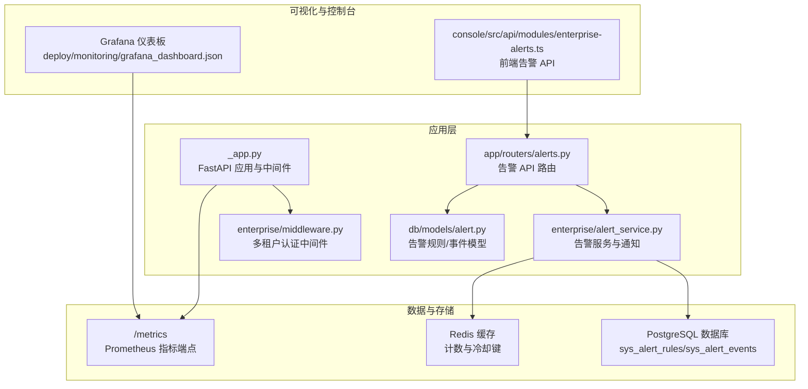
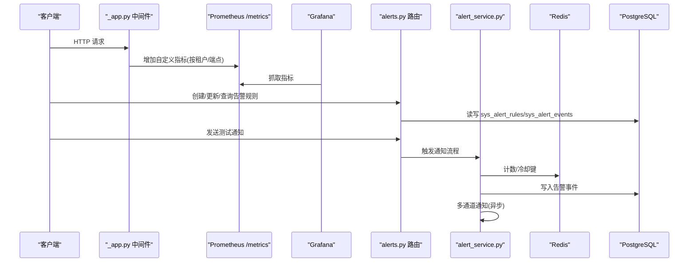
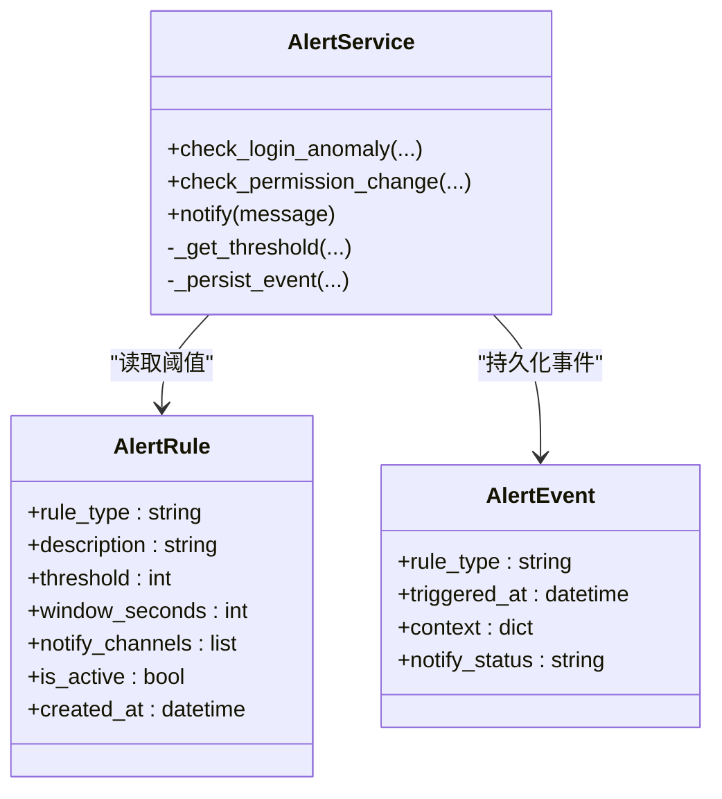
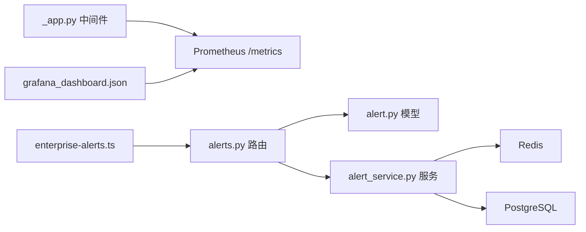

# 监控告警

<cite>
**本文引用的文件**
- [grafana_dashboard.json](file://deploy/monitoring/grafana_dashboard.json)
- [alert.py](file://src/copaw/db/models/alert.py)
- [alert_service.py](file://src/copaw/enterprise/alert_service.py)
- [alerts.py](file://src/copaw/app/routers/alerts.py)
- [_app.py](file://src/copaw/app/_app.py)
- [middleware.py](file://src/copaw/enterprise/middleware.py)
- [docker-compose.yml](file://docker-compose.yml)
- [pyproject.toml](file://pyproject.toml)
- [implementation_plan-D.md](file://docs/implementation_plan-D.md)
- [enterprise-alerts.ts](file://console/src/api/modules/enterprise-alerts.ts)
</cite>

## 目录
1. [简介](#简介)
2. [项目结构](#项目结构)
3. [核心组件](#核心组件)
4. [架构总览](#架构总览)
5. [组件详解](#组件详解)
6. [依赖关系分析](#依赖关系分析)
7. [性能与可观测性](#性能与可观测性)
8. [故障排查指南](#故障排查指南)
9. [结论](#结论)
10. [附录](#附录)

## 简介
本指南面向运维与平台管理员，围绕 CoPaw 的监控与告警体系提供从安装到使用的完整操作手册。内容涵盖：
- Grafana 仪表板的安装与配置（数据源、面板导入、时间范围）
- 指标采集与 Prometheus 集成（多租户请求量、速率、技能调用分布）
- 告警规则的创建与管理（阈值、窗口、通知渠道、升级策略）
- 可视化展示与历史趋势分析，辅助快速定位问题

## 项目结构
与监控告警相关的关键位置如下：
- 监控仪表板定义：deploy/monitoring/grafana_dashboard.json
- 应用指标注入：src/copaw/app/_app.py（Prometheus 中间件与自定义指标）
- 告警规则与事件模型：src/copaw/db/models/alert.py
- 告警服务与通知通道：src/copaw/enterprise/alert_service.py
- 告警 API 路由：src/copaw/app/routers/alerts.py
- 多租户认证中间件：src/copaw/enterprise/middleware.py
- 部署编排（含 Postgres、Redis、应用容器）：docker-compose.yml
- 依赖声明（含 Prometheus 适配器）：pyproject.toml
- 实施计划文档（含监控与仪表板说明）：docs/implementation_plan-D.md
- 控制台前端告警模块 API 定义：console/src/api/modules/enterprise-alerts.ts

图表来源
- [_app.py:482-511](file://src/copaw/app/_app.py#L482-L511)
- [middleware.py:57-103](file://src/copaw/enterprise/middleware.py#L57-L103)
- [alert.py:18-66](file://src/copaw/db/models/alert.py#L18-L66)
- [alert_service.py:101-162](file://src/copaw/enterprise/alert_service.py#L101-L162)
- [alerts.py:74-152](file://src/copaw/app/routers/alerts.py#L74-L152)
- [grafana_dashboard.json:28-127](file://deploy/monitoring/grafana_dashboard.json#L28-L127)
- [enterprise-alerts.ts:22-63](file://console/src/api/modules/enterprise-alerts.ts#L22-L63)

章节来源
- [docker-compose.yml:13-92](file://docker-compose.yml#L13-L92)
- [pyproject.toml:115-116](file://pyproject.toml#L115-L116)
- [implementation_plan-D.md:30-42](file://docs/implementation_plan-D.md#L30-L42)

## 核心组件
- 指标采集与暴露
  - 应用通过中间件在每次请求后对多租户请求进行计数，并暴露 Prometheus 指标端点。
  - 自定义指标名称与标签用于区分租户、方法与端点。
- 告警规则与事件
  - 规则模型包含规则类型、阈值、窗口、通知渠道与启用状态；事件模型记录触发时间、上下文与通知状态。
- 告警服务与通知
  - 支持 WeCom、DingTalk Webhook 与 SMTP 邮件通知；内置冷却机制防止重复告警。
- Grafana 仪表板
  - 提供“每租户请求速率”和“技能使用分布”两个核心面板，基于 Prometheus 查询语言构建。

章节来源
- [_app.py:482-511](file://src/copaw/app/_app.py#L482-L511)
- [alert.py:18-102](file://src/copaw/db/models/alert.py#L18-L102)
- [alert_service.py:31-97](file://src/copaw/enterprise/alert_service.py#L31-L97)
- [grafana_dashboard.json:28-127](file://deploy/monitoring/grafana_dashboard.json#L28-L127)

## 架构总览
下图展示了从应用到指标、存储与可视化的整体链路，以及告警服务如何基于规则与事件进行通知。

图表来源
- [_app.py:499-511](file://src/copaw/app/_app.py#L499-L511)
- [alerts.py:74-195](file://src/copaw/app/routers/alerts.py#L74-L195)
- [alert_service.py:101-162](file://src/copaw/enterprise/alert_service.py#L101-L162)
- [alert.py:18-102](file://src/copaw/db/models/alert.py#L18-L102)
- [grafana_dashboard.json:28-127](file://deploy/monitoring/grafana_dashboard.json#L28-L127)

## 组件详解

### Grafana 仪表板安装与配置
- 导入仪表板
  - 在 Grafana 中选择“导入”，粘贴 deploy/monitoring/grafana_dashboard.json 的内容或上传该文件。
  - 仪表板包含两个面板：
    - Requests per Tenant (Rate 5m)：按租户聚合的请求速率曲线。
    - Skill Usage Distribution：按端点匹配技能调用的饼图。
- 数据源设置
  - 确保 Grafana 已添加 Prometheus 数据源，抓取地址指向应用的 /metrics 端点。
  - 仪表板中已预置数据源引用 UID，请根据实际环境调整数据源配置。
- 时间范围与刷新
  - 仪表板默认时间范围为最近 6 小时，可根据需要调整。
  - 建议开启自动刷新以观察实时趋势。

章节来源
- [grafana_dashboard.json:28-127](file://deploy/monitoring/grafana_dashboard.json#L28-L127)

### 指标采集与查询
- 指标暴露
  - 应用启动后在 /metrics 暴露标准指标，同时注入自定义指标 copaw_tenant_usage_total，包含租户、方法与端点标签。
- 关键查询示例
  - 每租户请求速率（5 分钟窗口）：sum by (tenant_id) (rate(copaw_tenant_usage_total[5m]))
  - 技能调用分布（按端点过滤）：sum by (endpoint) (copaw_tenant_usage_total{endpoint=~"/api/agents/.*/skills/.*"})
- 多租户上下文
  - 租户 ID 来源于认证中间件注入的请求上下文，确保不同租户的指标可被独立追踪。

章节来源
- [_app.py:482-511](file://src/copaw/app/_app.py#L482-L511)
- [middleware.py:96-103](file://src/copaw/enterprise/middleware.py#L96-L103)
- [grafana_dashboard.json:111-126](file://deploy/monitoring/grafana_dashboard.json#L111-L126)

### 告警规则与事件管理
- 规则模型
  - 字段：规则类型、描述、阈值、窗口秒数、通知渠道数组、启用状态、创建时间。
  - 规则类型示例：登录失败、权限变更、DLP 阻断等。
- 事件模型
  - 字段：规则类型、触发时间、上下文（如用户名、IP、失败次数）、通知状态（已发送/失败/抑制）。
- API 能力
  - 列出规则、创建规则、查询单条规则、更新规则、删除规则、列出事件、测试通知。

图表来源
- [alert.py:18-102](file://src/copaw/db/models/alert.py#L18-L102)
- [alert_service.py:101-217](file://src/copaw/enterprise/alert_service.py#L101-L217)

章节来源
- [alert.py:18-102](file://src/copaw/db/models/alert.py#L18-L102)
- [alerts.py:74-195](file://src/copaw/app/routers/alerts.py#L74-L195)

### 通知渠道与升级策略
- 支持渠道
  - 企业微信 Webhook
  - 钉钉 Webhook
  - SMTP 邮件（需配置 SMTP 主机、端口、账号、密码与接收人）
- 升级策略
  - 登录异常检测具备冷却期（默认 5 分钟），同一目标在冷却期内不会重复告警。
  - 权限变更类告警即时记录并通知，不设冷却。
- 环境变量配置
  - 通过环境变量启用并配置各通知通道，未配置的通道将被跳过。

章节来源
- [alert_service.py:31-97](file://src/copaw/enterprise/alert_service.py#L31-L97)

### 控制台集成与前端交互
- 前端模块
  - 提供获取规则列表、创建/更新/删除规则、分页查询事件、发送测试通知的接口封装。
- 使用建议
  - 在控制台“企业/告警”页面中，先创建规则并配置通知渠道，再通过“测试通知”验证通道可用性。

章节来源
- [enterprise-alerts.ts:22-63](file://console/src/api/modules/enterprise-alerts.ts#L22-L63)

## 依赖关系分析
- 应用与指标
  - 应用中间件负责在每次请求后增加自定义指标；Prometheus 适配器负责暴露 /metrics。
- 告警服务
  - 读取规则阈值与事件持久化；使用 Redis 进行计数与冷却；通过 HTTP/SMTP 发送通知。
- 数据存储
  - 规则与事件存储于 PostgreSQL；计数与冷却键存储于 Redis。
- 可视化
  - Grafana 通过 Prometheus 数据源抓取指标并渲染仪表板。

图表来源
- [_app.py:482-511](file://src/copaw/app/_app.py#L482-L511)
- [alerts.py:74-195](file://src/copaw/app/routers/alerts.py#L74-L195)
- [alert_service.py:101-217](file://src/copaw/enterprise/alert_service.py#L101-L217)
- [alert.py:18-102](file://src/copaw/db/models/alert.py#L18-L102)
- [grafana_dashboard.json:28-127](file://deploy/monitoring/grafana_dashboard.json#L28-L127)
- [enterprise-alerts.ts:22-63](file://console/src/api/modules/enterprise-alerts.ts#L22-L63)

章节来源
- [pyproject.toml:115-116](file://pyproject.toml#L115-L116)
- [docker-compose.yml:13-92](file://docker-compose.yml#L13-L92)

## 性能与可观测性
- 指标维度
  - 建议按租户、端点与方法拆分指标，便于定位热点与异常。
- 查询优化
  - 使用 rate() 与 sum by() 结合，避免在大时间窗口内进行高基数聚合。
- 通知节流
  - 合理设置阈值与窗口，结合冷却键降低噪声。
- 安全访问
  - /metrics 在生产环境中应限制访问来源或仅本地访问，避免泄露敏感指标。

章节来源
- [_app.py:482-511](file://src/copaw/app/_app.py#L482-L511)
- [implementation_plan-D.md:50-51](file://docs/implementation_plan-D.md#L50-L51)

## 故障排查指南
- Grafana 无法抓取指标
  - 检查 Prometheus 数据源连接与抓取间隔；确认应用 /metrics 可达且返回有效指标。
- 告警规则未生效
  - 确认规则处于启用状态；检查阈值与窗口设置；核对通知渠道环境变量是否正确。
- 通知未送达
  - 检查企业微信/钉钉 Webhook 地址与网络连通性；检查 SMTP 配置与收件人；查看应用日志中的告警服务警告信息。
- 事件未记录
  - 确认数据库连接正常；检查 sys_alert_events 表写入权限；必要时手动触发测试通知验证路径。

章节来源
- [alert_service.py:45-97](file://src/copaw/enterprise/alert_service.py#L45-L97)
- [alerts.py:188-195](file://src/copaw/app/routers/alerts.py#L188-L195)
- [docker-compose.yml:17-92](file://docker-compose.yml#L17-L92)

## 结论
通过上述配置与实践，运维团队可以：
- 快速完成 Grafana 仪表板的安装与数据源对接，实现多租户请求与技能使用情况的可视化。
- 基于规则阈值与窗口构建告警，结合冷却与多通道通知，提升问题响应效率。
- 依托 Prometheus 指标与 PostgreSQL/Redis 存储，形成闭环的可观测性体系。

## 附录

### 快速操作清单
- 安装与启动
  - 使用 docker-compose 启动 Postgres、Redis 与应用容器。
- Grafana 配置
  - 添加 Prometheus 数据源，导入 grafana_dashboard.json，设置时间范围与刷新。
- 指标验证
  - 访问 /metrics，确认 copaw_tenant_usage_total 指标存在且带有租户/端点标签。
- 告警规则
  - 通过控制台或 API 创建规则，配置阈值、窗口与通知渠道。
- 测试通知
  - 使用“测试通知”接口验证各通道可用性。

章节来源
- [docker-compose.yml:63-92](file://docker-compose.yml#L63-L92)
- [implementation_plan-D.md:55-66](file://docs/implementation_plan-D.md#L55-L66)