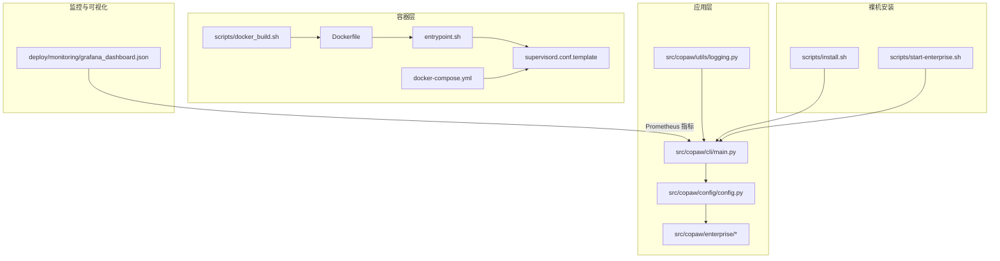
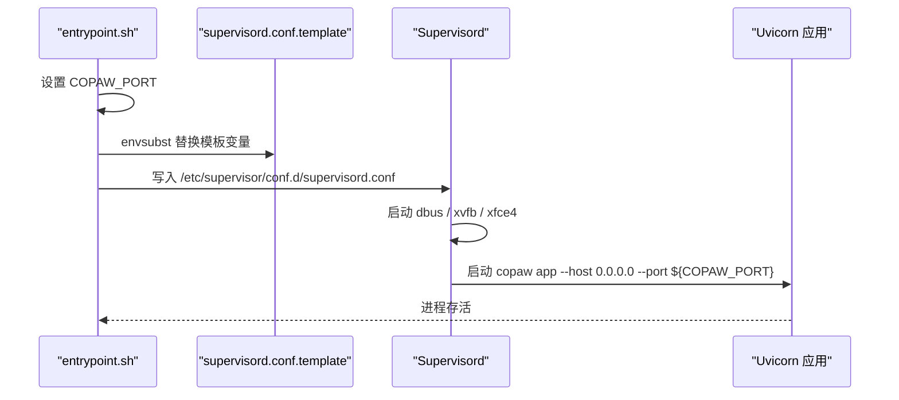
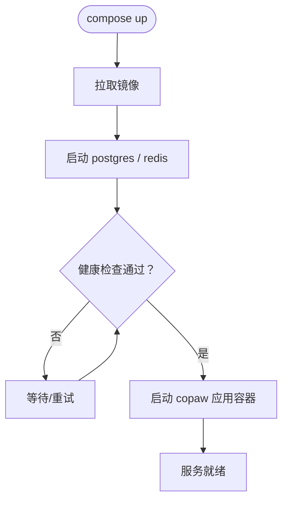
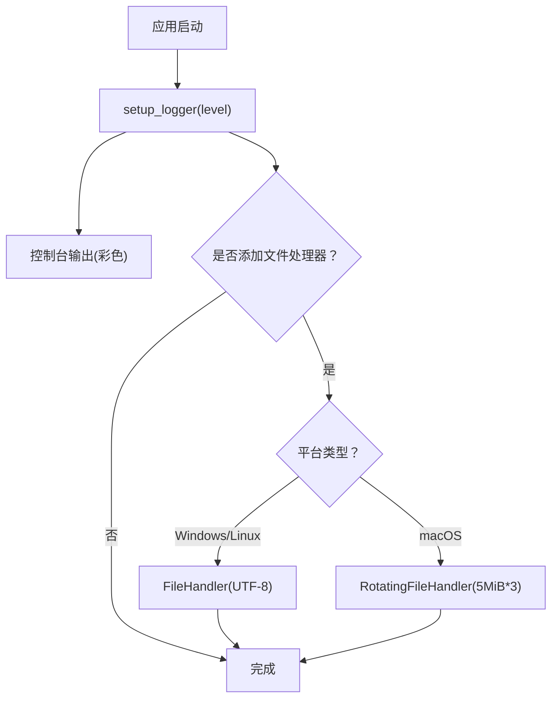
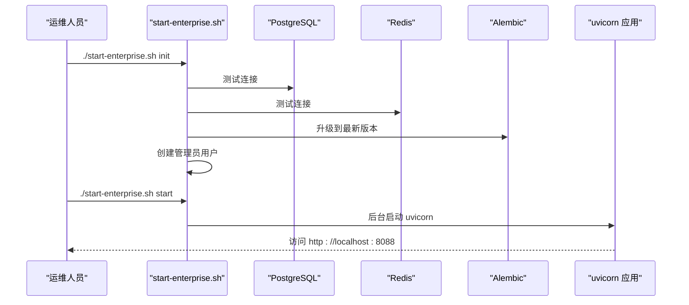
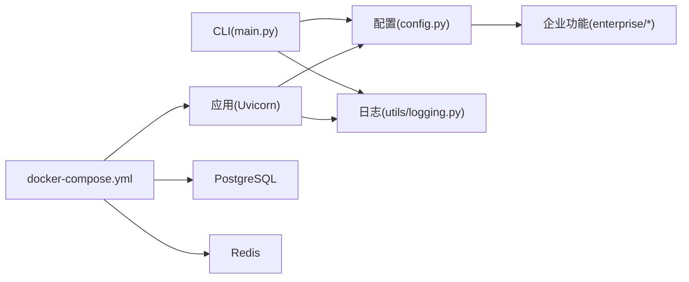

# 部署运维

<cite>
**本文引用的文件**
- [Dockerfile](file://deploy/Dockerfile)
- [entrypoint.sh](file://deploy/entrypoint.sh)
- [supervisord.conf.template](file://deploy/config/supervisord.conf.template)
- [docker-compose.yml](file://docker-compose.yml)
- [docker_build.sh](file://scripts/docker_build.sh)
- [grafana_dashboard.json](file://deploy/monitoring/grafana_dashboard.json)
- [logging.py](file://src/copaw/utils/logging.py)
- [config.py](file://src/copaw/config/config.py)
- [install.sh](file://scripts/install.sh)
- [start-enterprise.sh](file://scripts/start-enterprise.sh)
- [main.py](file://src/copaw/cli/main.py)
</cite>

## 目录
1. [简介](#简介)
2. [项目结构](#项目结构)
3. [核心组件](#核心组件)
4. [架构总览](#架构总览)
5. [详细组件分析](#详细组件分析)
6. [依赖分析](#依赖分析)
7. [性能考虑](#性能考虑)
8. [故障排除指南](#故障排除指南)
9. [结论](#结论)
10. [附录](#附录)

## 简介
本文件面向运维工程师与平台管理员，提供 CoPaw 在生产环境中的完整部署与运维指导。内容覆盖生产环境配置、容器编排、监控告警与日志管理的最佳实践；对比 Docker 部署、Kubernetes 编排与裸机部署的优缺点与适用场景；给出性能监控、故障排除、备份恢复与安全加固的具体方案，并对部署脚本的使用方法、关键配置参数进行详解，帮助您稳定可靠地运行 CoPaw 服务。

## 项目结构
CoPaw 的部署与运维涉及以下关键目录与文件：
- 容器化与编排：Dockerfile、entrypoint.sh、supervisord.conf.template、docker-compose.yml、scripts/docker_build.sh
- 日志与可观测性：deploy/monitoring/grafana_dashboard.json、src/copaw/utils/logging.py
- 配置与企业能力：src/copaw/config/config.py、src/copaw/enterprise/*
- 裸机安装与启动：scripts/install.sh、scripts/start-enterprise.sh、src/copaw/cli/main.py



图表来源
- [Dockerfile:1-103](file://deploy/Dockerfile#L1-L103)
- [entrypoint.sh:1-10](file://deploy/entrypoint.sh#L1-L10)
- [supervisord.conf.template:1-40](file://deploy/config/supervisord.conf.template#L1-L40)
- [docker-compose.yml:1-92](file://docker-compose.yml#L1-L92)
- [docker_build.sh:1-32](file://scripts/docker_build.sh#L1-L32)
- [config.py:1-800](file://src/copaw/config/config.py#L1-L800)
- [logging.py:1-199](file://src/copaw/utils/logging.py#L1-L199)
- [main.py:1-168](file://src/copaw/cli/main.py#L1-L168)
- [start-enterprise.sh:1-510](file://scripts/start-enterprise.sh#L1-L510)
- [install.sh:1-340](file://scripts/install.sh#L1-L340)
- [grafana_dashboard.json:1-146](file://deploy/monitoring/grafana_dashboard.json#L1-L146)

章节来源
- [Dockerfile:1-103](file://deploy/Dockerfile#L1-L103)
- [docker-compose.yml:1-92](file://docker-compose.yml#L1-L92)
- [config.py:1-800](file://src/copaw/config/config.py#L1-L800)
- [logging.py:1-199](file://src/copaw/utils/logging.py#L1-L199)
- [main.py:1-168](file://src/copaw/cli/main.py#L1-L168)
- [start-enterprise.sh:1-510](file://scripts/start-enterprise.sh#L1-L510)
- [install.sh:1-340](file://scripts/install.sh#L1-L340)
- [grafana_dashboard.json:1-146](file://deploy/monitoring/grafana_dashboard.json#L1-L146)

## 核心组件
- 应用入口与 CLI
  - CLI 入口负责加载子命令与延迟初始化，支持主机与端口参数，默认监听本地回环地址与 8088 端口。
  - 参考路径：[main.py:144-168](file://src/copaw/cli/main.py#L144-L168)
- 企业级配置与基础设施
  - 数据库与 Redis 配置模型，支持通过 COPAW_DB_* 与 COPAW_REDIS_* 环境变量注入，便于容器编排时统一管理。
  - 参考路径：[config.py:32-58](file://src/copaw/config/config.py#L32-L58)
- 日志系统
  - 控制台彩色输出与可选文件落盘，按平台差异选择 FileHandler 或 RotatingFileHandler，避免锁冲突。
  - 参考路径：[logging.py:157-199](file://src/copaw/utils/logging.py#L157-L199)
- 容器运行时
  - 多阶段构建前端产物，安装 Chromium 与桌面虚拟显示栈，Supervisord 启动 dbus、Xvfb、xfce4 与应用进程。
  - 参考路径：[Dockerfile:12-103](file://deploy/Dockerfile#L12-L103)，[supervisord.conf.template:14-40](file://deploy/config/supervisord.conf.template#L14-L40)
- 编排与健康检查
  - docker-compose 提供 PostgreSQL 与 Redis 健康检查与持久卷，应用容器暴露 8088 端口并挂载工作目录与密钥目录。
  - 参考路径：[docker-compose.yml:17-92](file://docker-compose.yml#L17-L92)
- 裸机安装与企业启动
  - install.sh 使用 uv 创建隔离 Python 环境并安装包，start-enterprise.sh 提供数据库连接测试、迁移与管理员用户创建，以及服务启停与状态查询。
  - 参考路径：[install.sh:104-245](file://scripts/install.sh#L104-L245)，[start-enterprise.sh:59-366](file://scripts/start-enterprise.sh#L59-L366)

章节来源
- [main.py:144-168](file://src/copaw/cli/main.py#L144-L168)
- [config.py:32-58](file://src/copaw/config/config.py#L32-L58)
- [logging.py:157-199](file://src/copaw/utils/logging.py#L157-L199)
- [Dockerfile:12-103](file://deploy/Dockerfile#L12-L103)
- [supervisord.conf.template:14-40](file://deploy/config/supervisord.conf.template#L14-L40)
- [docker-compose.yml:17-92](file://docker-compose.yml#L17-L92)
- [install.sh:104-245](file://scripts/install.sh#L104-L245)
- [start-enterprise.sh:59-366](file://scripts/start-enterprise.sh#L59-L366)

## 架构总览
下图展示 CoPaw 在容器与裸机两种模式下的典型部署拓扑，以及与外部依赖（PostgreSQL、Redis）的关系。

```mermaid
graph TB
subgraph "容器编排"
Uvicorn["Uvicorn 应用进程<br/>监听 0.0.0.0:8088"]
Postgres["PostgreSQL 16<br/>企业数据存储"]
Redis["Redis 7<br/>会话缓存/消息代理"]
Volumes["卷: working / working.secret"]
end
subgraph "容器镜像"
Supervisor["Supervisord"]
Xvfb["Xvfb 显示服务"]
DBus["DBus 系统总线"]
XFCE["XFCE 桌面会话"]
end
subgraph "裸机模式"
Installer["install.sh<br/>uv 虚拟环境"]
Enterprise["start-enterprise.sh<br/>数据库迁移/管理员"]
end
Postgres <- --> Uvicorn
Redis <- --> Uvicorn
Volumes --- Uvicorn
Supervisor --> DBus
Supervisor --> Xvfb
Supervisor --> XFCE
Supervisor --> Uvicorn
Installer --> Uvicorn
Enterprise --> Uvicorn
```

图表来源
- [docker-compose.yml:17-92](file://docker-compose.yml#L17-L92)
- [Dockerfile:12-103](file://deploy/Dockerfile#L12-L103)
- [supervisord.conf.template:14-40](file://deploy/config/supervisord.conf.template#L14-L40)
- [install.sh:104-245](file://scripts/install.sh#L104-L245)
- [start-enterprise.sh:59-366](file://scripts/start-enterprise.sh#L59-L366)

## 详细组件分析

### 容器镜像与运行时
- 多阶段构建
  - 第一阶段构建前端静态资源，第二阶段安装 Python、Chromium 与桌面依赖，启用无沙箱模式以适配容器环境。
  - 参考路径：[Dockerfile:2-8](file://deploy/Dockerfile#L2-L8)，[Dockerfile:12-89](file://deploy/Dockerfile#L12-L89)
- 运行时进程编排
  - Supervisord 启动 dbus、Xvfb、xfce4 与应用进程，应用进程绑定 0.0.0.0 并通过环境变量控制端口。
  - 参考路径：[supervisord.conf.template:7-40](file://deploy/config/supervisord.conf.template#L7-L40)，[entrypoint.sh:5-9](file://deploy/entrypoint.sh#L5-L9)
- 端口与环境变量
  - 默认端口 8088，可通过 COPAW_PORT 覆盖；容器内设置工作目录与密钥目录环境变量。
  - 参考路径：[Dockerfile:94-96](file://deploy/Dockerfile#L94-L96)，[Dockerfile:14-19](file://deploy/Dockerfile#L14-L19)，[entrypoint.sh:5](file://deploy/entrypoint.sh#L5-L5)



图表来源
- [entrypoint.sh:5-9](file://deploy/entrypoint.sh#L5-L9)
- [supervisord.conf.template:14-21](file://deploy/config/supervisord.conf.template#L14-L21)
- [Dockerfile:94-100](file://deploy/Dockerfile#L94-L100)

章节来源
- [Dockerfile:2-8](file://deploy/Dockerfile#L2-L8)
- [Dockerfile:12-89](file://deploy/Dockerfile#L12-L89)
- [Dockerfile:94-100](file://deploy/Dockerfile#L94-L100)
- [entrypoint.sh:5-9](file://deploy/entrypoint.sh#L5-L9)
- [supervisord.conf.template:7-40](file://deploy/config/supervisord.conf.template#L7-L40)

### docker-compose 编排与健康检查
- 服务定义
  - postgres:16-alpine，健康检查基于 pg_isready；redis:7-alpine，开启密码认证与内存限制。
  - 参考路径：[docker-compose.yml:17-58](file://docker-compose.yml#L17-L58)
- 应用容器
  - 依赖 postgres 与 redis 健康后启动；映射 8088 端口；通过 COPAW_* 环境变量注入数据库与 Redis 连接信息；挂载工作目录与密钥目录。
  - 参考路径：[docker-compose.yml:63-92](file://docker-compose.yml#L63-L92)



图表来源
- [docker-compose.yml:17-92](file://docker-compose.yml#L17-L92)

章节来源
- [docker-compose.yml:17-92](file://docker-compose.yml#L17-L92)

### 企业配置与环境变量
- 数据库与 Redis
  - 支持通过 COPAW_DB_HOST/PORT/NAME/USER/PASSWORD 与 COPAW_REDIS_HOST/PORT/PASSWORD 注入，便于在容器编排中集中管理。
  - 参考路径：[config.py:32-58](file://src/copaw/config/config.py#L32-L58)，[docker-compose.yml:77-86](file://docker-compose.yml#L77-L86)
- 企业特性开关
  - EnterpriseConfig.enabled 控制企业功能（多租户、RBAC、审计日志、任务管理、工作流引擎等）。
  - 参考路径：[config.py:60-81](file://src/copaw/config/config.py#L60-L81)

章节来源
- [config.py:32-58](file://src/copaw/config/config.py#L32-L58)
- [config.py:60-81](file://src/copaw/config/config.py#L60-L81)
- [docker-compose.yml:77-86](file://docker-compose.yml#L77-L86)

### 日志管理与可观测性
- 日志模块
  - 控制台输出带颜色，自动检测终端是否支持 ANSI；在非 macOS 平台使用普通文件句柄，在 macOS 使用旋转文件处理器；可按需添加文件处理器。
  - 参考路径：[logging.py:119-154](file://src/copaw/utils/logging.py#L119-L154)，[logging.py:157-199](file://src/copaw/utils/logging.py#L157-L199)
- 监控仪表板
  - 提供 Grafana 仪表板 JSON，包含按租户请求速率与技能使用分布的面板，便于观察企业版指标。
  - 参考路径：[grafana_dashboard.json:104-127](file://deploy/monitoring/grafana_dashboard.json#L104-L127)



图表来源
- [logging.py:119-154](file://src/copaw/utils/logging.py#L119-L154)
- [logging.py:157-199](file://src/copaw/utils/logging.py#L157-L199)

章节来源
- [logging.py:119-154](file://src/copaw/utils/logging.py#L119-L154)
- [logging.py:157-199](file://src/copaw/utils/logging.py#L157-L199)
- [grafana_dashboard.json:104-127](file://deploy/monitoring/grafana_dashboard.json#L104-L127)

### 裸机部署与企业启动脚本
- install.sh
  - 自动检测网络选择 PyPI 源，使用 uv 创建 Python 3.12 虚拟环境，安装 copaw 包与可选 extras，生成 CLI 包装脚本并更新 PATH。
  - 参考路径：[install.sh:34-44](file://scripts/install.sh#L34-L44)，[install.sh:104-147](file://scripts/install.sh#L104-L147)，[install.sh:233-245](file://scripts/install.sh#L233-L245)
- start-enterprise.sh
  - 提供 start/stop/restart/init/status 子命令；内置 PostgreSQL 与 Redis 连接测试、Alembic 迁移、管理员用户创建；后台启动 uvicorn 并记录 PID 与日志。
  - 参考路径：[start-enterprise.sh:59-98](file://scripts/start-enterprise.sh#L59-L98)，[start-enterprise.sh:197-213](file://scripts/start-enterprise.sh#L197-L213)，[start-enterprise.sh:316-366](file://scripts/start-enterprise.sh#L316-L366)



图表来源
- [start-enterprise.sh:436-458](file://scripts/start-enterprise.sh#L436-L458)
- [start-enterprise.sh:460-486](file://scripts/start-enterprise.sh#L460-L486)
- [start-enterprise.sh:316-366](file://scripts/start-enterprise.sh#L316-L366)

章节来源
- [install.sh:34-44](file://scripts/install.sh#L34-L44)
- [install.sh:104-147](file://scripts/install.sh#L104-L147)
- [install.sh:233-245](file://scripts/install.sh#L233-L245)
- [start-enterprise.sh:59-98](file://scripts/start-enterprise.sh#L59-L98)
- [start-enterprise.sh:197-213](file://scripts/start-enterprise.sh#L197-L213)
- [start-enterprise.sh:316-366](file://scripts/start-enterprise.sh#L316-L366)

## 依赖分析
- 组件耦合
  - CLI 作为入口，延迟加载各子命令模块；配置模块被企业功能与运行时使用；日志模块被 CLI 与应用共享。
- 外部依赖
  - PostgreSQL 与 Redis 由 docker-compose 管理；Chromium 与桌面依赖在容器镜像中安装；Grafana 仪表板依赖 Prometheus 指标采集。
- 循环依赖规避
  - 企业包初始化为空，避免模型导入循环。



图表来源
- [main.py:95-142](file://src/copaw/cli/main.py#L95-L142)
- [config.py:60-81](file://src/copaw/config/config.py#L60-L81)
- [logging.py:119-154](file://src/copaw/utils/logging.py#L119-L154)
- [docker-compose.yml:17-92](file://docker-compose.yml#L17-L92)

章节来源
- [main.py:95-142](file://src/copaw/cli/main.py#L95-L142)
- [config.py:60-81](file://src/copaw/config/config.py#L60-L81)
- [logging.py:119-154](file://src/copaw/utils/logging.py#L119-L154)
- [docker-compose.yml:17-92](file://docker-compose.yml#L17-L92)

## 性能考虑
- 端口与网络
  - 默认监听 0.0.0.0:8088，建议在生产中仅映射内网或通过反向代理暴露；容器内通过 COPAW_PORT 覆盖端口。
  - 参考路径：[Dockerfile:94-96](file://deploy/Dockerfile#L94-L96)，[entrypoint.sh:5](file://deploy/entrypoint.sh#L5-L5)
- 资源与并发
  - Redis 设置最大内存与淘汰策略；PostgreSQL 使用独立卷与健康检查；容器内 Chromium 无沙箱模式以适配容器环境。
  - 参考路径：[docker-compose.yml:44-48](file://docker-compose.yml#L44-L48)，[Dockerfile:71-78](file://deploy/Dockerfile#L71-L78)
- 日志与 I/O
  - 文件日志在非 macOS 平台采用普通文件句柄，避免文件锁；macOS 使用旋转文件处理器；建议结合外部日志收集器集中管理。
  - 参考路径：[logging.py:178-191](file://src/copaw/utils/logging.py#L178-L191)

[本节为通用性能建议，不直接分析具体文件，故无章节来源]

## 故障排除指南
- 容器启动失败
  - 检查 supervisord 配置是否正确替换 COPAW_PORT；确认 dbus、Xvfb、xfce4 是否成功启动；查看对应 stdout/stderr 日志。
  - 参考路径：[entrypoint.sh:6-8](file://deploy/entrypoint.sh#L6-L8)，[supervisord.conf.template:7-40](file://deploy/config/supervisord.conf.template#L7-L40)
- 数据库连接异常
  - 使用 start-enterprise.sh 的连接测试函数验证 PostgreSQL 与 Redis；若未初始化，先执行数据库迁移与管理员创建。
  - 参考路径：[start-enterprise.sh:59-98](file://scripts/start-enterprise.sh#L59-L98)，[start-enterprise.sh:197-213](file://scripts/start-enterprise.sh#L197-L213)
- 端口占用或权限问题
  - 修改 COPAW_PORT 或调整宿主机端口映射；确保容器以非 root 用户运行时具备写权限（如挂载目录权限）。
  - 参考路径：[Dockerfile:94-96](file://deploy/Dockerfile#L94-L96)，[docker-compose.yml:72-73](file://docker-compose.yml#L72-L73)
- 日志无法写入
  - 检查日志文件所在卷是否挂载；在 macOS 上使用旋转文件处理器；在非 macOS 平台使用普通文件句柄。
  - 参考路径：[logging.py:178-191](file://src/copaw/utils/logging.py#L178-L191)

章节来源
- [entrypoint.sh:6-8](file://deploy/entrypoint.sh#L6-L8)
- [supervisord.conf.template:7-40](file://deploy/config/supervisord.conf.template#L7-L40)
- [start-enterprise.sh:59-98](file://scripts/start-enterprise.sh#L59-L98)
- [start-enterprise.sh:197-213](file://scripts/start-enterprise.sh#L197-L213)
- [Dockerfile:94-96](file://deploy/Dockerfile#L94-L96)
- [docker-compose.yml:72-73](file://docker-compose.yml#L72-L73)
- [logging.py:178-191](file://src/copaw/utils/logging.py#L178-L191)

## 结论
通过容器化与 docker-compose 的标准化编排，结合企业配置模型与日志/监控工具链，CoPaw 能够在生产环境中实现高可用与可观测性。裸机部署则通过 install.sh 与 start-enterprise.sh 提供便捷的安装与初始化流程。建议在生产中强化安全基线（密钥轮换、最小权限、网络隔离）、完善备份策略（数据库与工作目录快照）与告警联动（Grafana/Prometheus），并持续优化资源与并发参数以满足业务峰值需求。

[本节为总结性内容，不直接分析具体文件，故无章节来源]

## 附录

### 部署方式对比与适用场景
- Docker 部署
  - 优点：打包完整、环境一致、易于扩展；适合中小规模与开发测试环境。
  - 缺点：单节点扩展受限；需要容器编排与存储管理。
  - 参考路径：[docker-compose.yml:17-92](file://docker-compose.yml#L17-L92)，[Dockerfile:12-103](file://deploy/Dockerfile#L12-L103)
- Kubernetes 集群
  - 优点：弹性伸缩、滚动更新、多副本高可用；适合大规模与多区域部署。
  - 缺点：运维复杂度较高；需要 Helm/Manifest 与存储/网络插件。
  - 适用：已具备 K8s 基础设施与 CI/CD 流水线的企业。
- 裸机部署
  - 优点：资源可控、延迟低、运维直观。
  - 缺点：环境一致性差、升级与回滚复杂。
  - 适用：小规模私有化或对延迟敏感的场景。

[本节为概念性说明，不直接分析具体文件，故无章节来源]

### 生产环境配置清单
- 环境变量（示例）
  - COPAW_ENTERPRISE_ENABLED=true
  - COPAW_DB_HOST/PORT/NAME/USER/PASSWORD
  - COPAW_REDIS_HOST/PORT/PASSWORD
  - COPAW_JWT_SECRET（必须强随机且保密）
  - COPAW_FIELD_ENCRYPT_KEY（必须 32 字节十六进制）
  - COPAW_PORT（默认 8088）
- 存储与备份
  - 工作目录与密钥目录卷持久化；定期备份 PostgreSQL 与 Redis 数据。
- 安全加固
  - 限制数据库与 Redis 访问白名单；启用 TLS 与强密码；最小权限原则；定期轮换密钥。
- 监控与告警
  - 部署 Prometheus/Grafana；导入企业仪表板；设置关键指标阈值与告警规则。

[本节为通用配置建议，不直接分析具体文件，故无章节来源]

### 部署脚本使用说明
- docker_build.sh
  - 用法：bash scripts/docker_build.sh [镜像标签] [额外参数]；支持 COPAW_DISABLED_CHANNELS 与 COPAW_ENABLED_CHANNELS 构建参数。
  - 参考路径：[docker_build.sh:24-27](file://scripts/docker_build.sh#L24-L27)
- install.sh
  - 用法：curl -fsSL <url>/install.sh | bash；支持 --version、--from-source、--extras 参数。
  - 参考路径：[install.sh:57-93](file://scripts/install.sh#L57-L93)
- start-enterprise.sh
  - 用法：./start-enterprise.sh {start|stop|restart|init|status}；支持数据库连接测试、迁移与管理员创建。
  - 参考路径：[start-enterprise.sh:436-506](file://scripts/start-enterprise.sh#L436-L506)

章节来源
- [docker_build.sh:24-27](file://scripts/docker_build.sh#L24-L27)
- [install.sh:57-93](file://scripts/install.sh#L57-L93)
- [start-enterprise.sh:436-506](file://scripts/start-enterprise.sh#L436-L506)