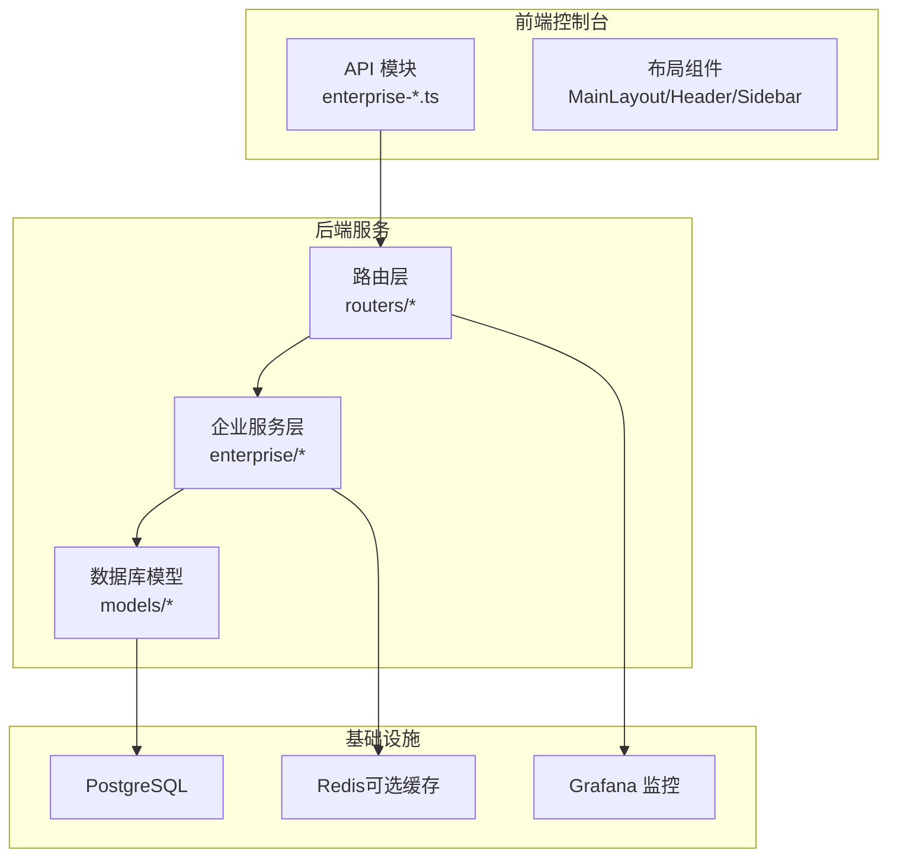
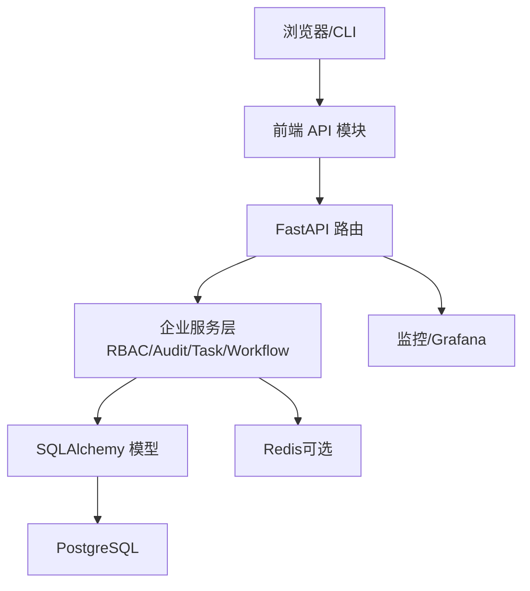
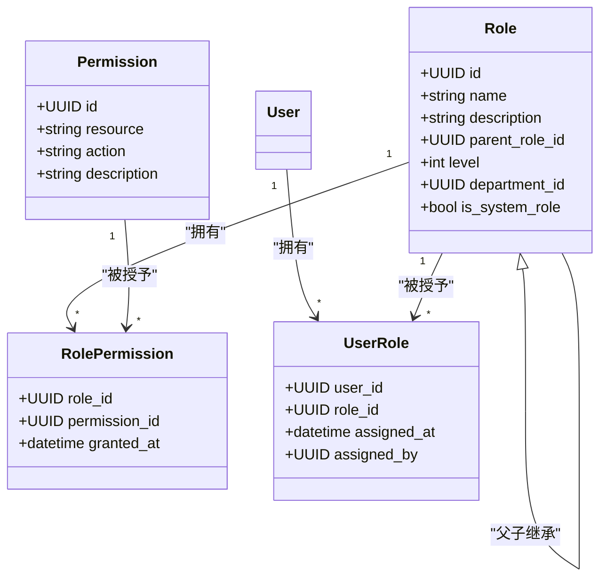
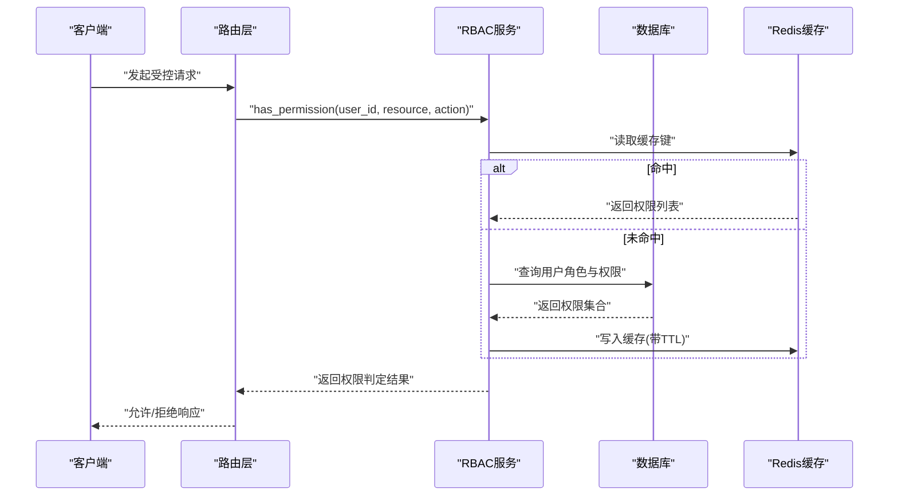
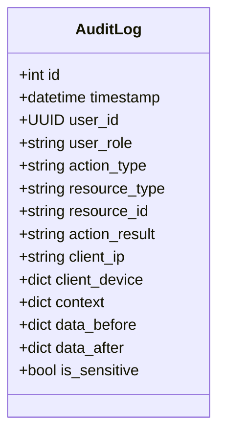
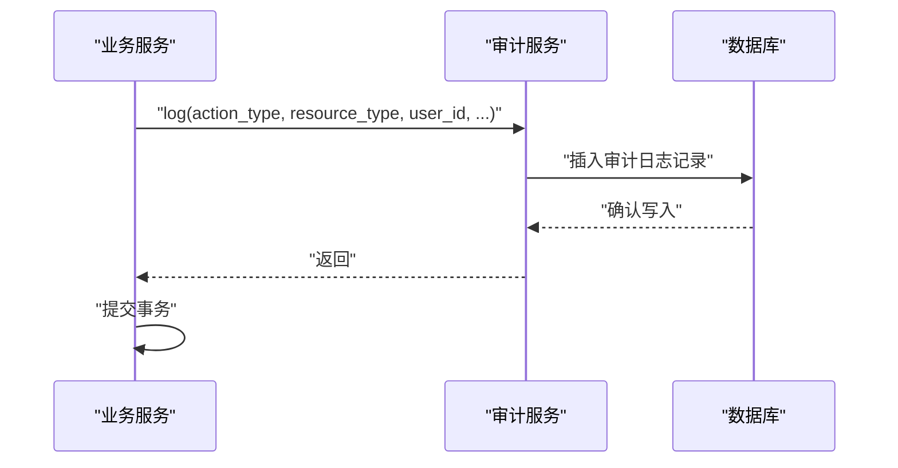
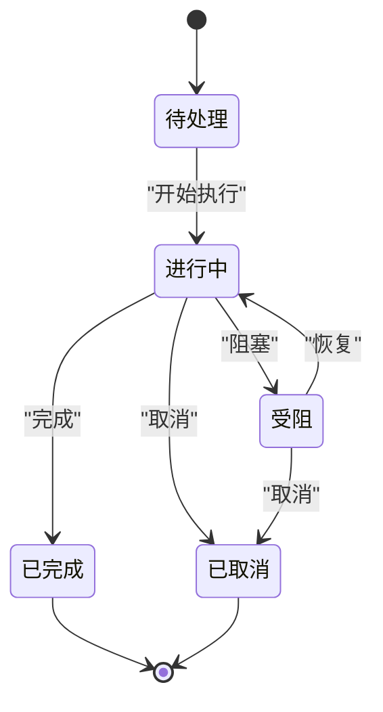
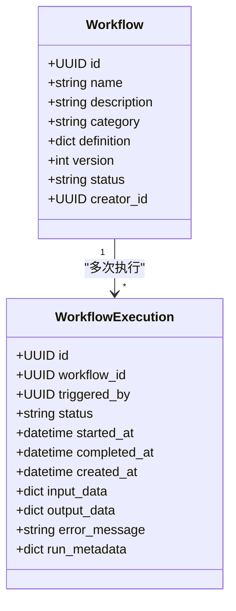
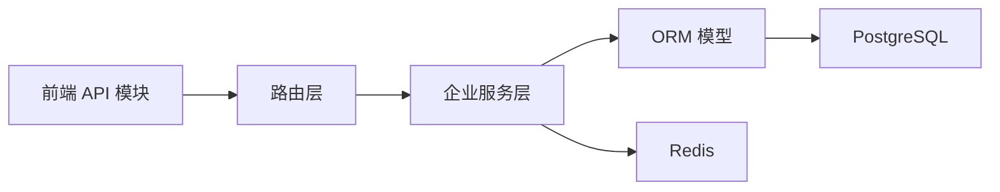

# 企业功能

<cite>
**本文引用的文件**
- [rbac_service.py](file://src/copaw/enterprise/rbac_service.py)
- [audit_service.py](file://src/copaw/enterprise/audit_service.py)
- [task_service.py](file://src/copaw/enterprise/task_service.py)
- [workflow_service.py](file://src/copaw/enterprise/workflow_service.py)
- [role.py](file://src/copaw/db/models/role.py)
- [permission.py](file://src/copaw/db/models/permission.py)
- [audit_log.py](file://src/copaw/db/models/audit_log.py)
- [task.py](file://src/copaw/db/models/task.py)
- [workflow.py](file://src/copaw/db/models/workflow.py)
- [enterprise-auth.ts](file://console/src/api/modules/enterprise-auth.ts)
- [enterprise-users.ts](file://console/src/api/modules/enterprise-users.ts)
- [enterprise-roles.ts](file://console/src/api/modules/enterprise-roles.ts)
- [enterprise-groups.ts](file://console/src/api/modules/enterprise-groups.ts)
- [enterprise-audit.ts](file://console/src/api/modules/enterprise-audit.ts)
- [enterprise-tasks.ts](file://console/src/api/modules/enterprise-tasks.ts)
- [enterprise-workflows.ts](file://console/src/api/modules/enterprise-workflows.ts)
- [enterprise-alerts.ts](file://console/src/api/modules/enterprise-alerts.ts)
- [enterprise-dlp.ts](file://console/src/api/modules/enterprise-dlp.ts)
- [enterprise-dify.ts](file://console/src/api/modules/enterprise-dify.ts)
- [security.ts](file://console/src/api/modules/security.ts)
- [env.ts](file://console/src/api/modules/env.ts)
- [heartbeat.ts](file://console/src/api/modules/heartbeat.ts)
- [tokenUsage.ts](file://console/src/api/modules/tokenUsage.ts)
- [userTimezone.ts](file://console/src/api/modules/userTimezone.ts)
- [workspace.ts](file://console/src/api/modules/workspace.ts)
- [MainLayout/index.tsx](file://console/src/layouts/MainLayout/index.tsx)
- [Header.tsx](file://console/src/layouts/Header.tsx)
- [Sidebar.tsx](file://console/src/layouts/Sidebar.tsx)
- [enterprise-auth.ts（服务端）](file://src/copaw/app/routers/enterprise_auth.py)
- [users.py（服务端）](file://src/copaw/app/routers/users.py)
- [roles.py（服务端）](file://src/copaw/app/routers/roles.py)
- [user_groups.py（服务端）](file://src/copaw/app/routers/user_groups.py)
- [audit.py（服务端）](file://src/copaw/app/routers/audit.py)
- [tasks.py（服务端）](file://src/copaw/app/routers/tasks.py)
- [workflows.py（服务端）](file://src/copaw/app/routers/workflows.py)
- [departments.py（服务端）](file://src/copaw/app/routers/departments.py)
- [README.md](file://README.md)
- [docs/ent-copaw.md](file://docs/ent-copaw.md)
- [docs/Deployment.md](file://docs/Deployment.md)
- [alembic/versions/002_enterprise_phase_a.py](file://alembic/versions/002_enterprise_phase_a.py)
- [alembic/versions/003_enterprise_phase_c.py](file://alembic/versions/003_enterprise_phase_c.py)
- [deploy/Dockerfile](file://deploy/Dockerfile)
- [deploy/config/supervisord.conf.template](file://deploy/config/supervisord.conf.template)
- [deploy/monitoring/grafana_dashboard.json](file://deploy/monitoring/grafana_dashboard.json)
- [scripts/start-enterprise.sh](file://scripts/start-enterprise.sh)
- [scripts/start-enterprise.ps1](file://scripts/start-enterprise.ps1)
</cite>

## 目录
1. [简介](#简介)
2. [项目结构](#项目结构)
3. [核心组件](#核心组件)
4. [架构总览](#架构总览)
5. [详细组件分析](#详细组件分析)
6. [依赖分析](#依赖分析)
7. [性能考虑](#性能考虑)
8. [故障排查指南](#故障排查指南)
9. [结论](#结论)
10. [附录](#附录)

## 简介
本文件面向企业用户与运维人员，系统化阐述 CoPaw 企业版的关键能力与实现：基于角色的权限控制（RBAC）、用户与组织管理、审计日志、任务与工作流编排、安全与合规配置、以及部署与运维最佳实践。文档以代码为依据，辅以架构图与时序图，帮助读者快速理解并落地使用。

## 项目结构
企业功能主要分布在以下区域：
- 后端服务层：位于 src/copaw/enterprise，封装企业特性（RBAC、审计、任务、工作流等），并与数据库模型交互。
- 数据模型层：位于 src/copaw/db/models，定义角色、权限、审计日志、任务、工作流等实体及关系。
- Web 控制台 API 模块：位于 console/src/api/modules，提供企业功能的前端接口封装。
- 部署与监控：位于 deploy、scripts、alembic 等目录，覆盖容器化、进程管理、数据库迁移与监控仪表盘。

图表来源
- [enterprise-auth.ts](file://console/src/api/modules/enterprise-auth.ts)
- [enterprise-users.ts](file://console/src/api/modules/enterprise-users.ts)
- [enterprise-roles.ts](file://console/src/api/modules/enterprise-roles.ts)
- [enterprise-audit.ts](file://console/src/api/modules/enterprise-audit.ts)
- [enterprise-tasks.ts](file://console/src/api/modules/enterprise-tasks.ts)
- [enterprise-workflows.ts](file://console/src/api/modules/enterprise-workflows.ts)
- [enterprise-auth.ts（服务端）](file://src/copaw/app/routers/enterprise_auth.py)
- [users.py（服务端）](file://src/copaw/app/routers/users.py)
- [roles.py（服务端）](file://src/copaw/app/routers/roles.py)
- [audit.py（服务端）](file://src/copaw/app/routers/audit.py)
- [tasks.py（服务端）](file://src/copaw/app/routers/tasks.py)
- [workflows.py（服务端）](file://src/copaw/app/routers/workflows.py)
- [rbac_service.py](file://src/copaw/enterprise/rbac_service.py)
- [audit_service.py](file://src/copaw/enterprise/audit_service.py)
- [task_service.py](file://src/copaw/enterprise/task_service.py)
- [workflow_service.py](file://src/copaw/enterprise/workflow_service.py)
- [role.py](file://src/copaw/db/models/role.py)
- [permission.py](file://src/copaw/db/models/permission.py)
- [audit_log.py](file://src/copaw/db/models/audit_log.py)
- [task.py](file://src/copaw/db/models/task.py)
- [workflow.py](file://src/copaw/db/models/workflow.py)

章节来源
- [README.md](file://README.md)
- [docs/ent-copaw.md](file://docs/ent-copaw.md)

## 核心组件
- RBAC 权限服务：提供角色/权限的创建、继承、用户赋权与权限检查，并支持 Redis 缓存加速。
- 审计服务：记录 ISO 27001 合规的审计日志，支持结构化查询与敏感操作数据对比。
- 任务服务：企业任务生命周期管理（创建、状态流转、评论、分页查询）。
- 工作流服务：工作流定义与执行管理，支持 Dify 类别与内部类型。
- 数据模型：角色、权限、审计日志、任务、工作流及其关联关系。
- 前端 API 封装：统一暴露企业功能的 HTTP 接口，供控制台页面调用。

章节来源
- [rbac_service.py](file://src/copaw/enterprise/rbac_service.py)
- [audit_service.py](file://src/copaw/enterprise/audit_service.py)
- [task_service.py](file://src/copaw/enterprise/task_service.py)
- [workflow_service.py](file://src/copaw/enterprise/workflow_service.py)
- [role.py](file://src/copaw/db/models/role.py)
- [permission.py](file://src/copaw/db/models/permission.py)
- [audit_log.py](file://src/copaw/db/models/audit_log.py)
- [task.py](file://src/copaw/db/models/task.py)
- [workflow.py](file://src/copaw/db/models/workflow.py)

## 架构总览
企业功能采用“前端 API 模块 + 后端路由 + 企业服务 + 数据模型”的分层设计。权限校验贯穿请求链路，审计日志在关键操作点落库，任务与工作流通过状态机与执行记录保障可追溯性。

图表来源
- [enterprise-auth.ts](file://console/src/api/modules/enterprise-auth.ts)
- [enterprise-users.ts](file://console/src/api/modules/enterprise-users.ts)
- [enterprise-roles.ts](file://console/src/api/modules/enterprise-roles.ts)
- [enterprise-audit.ts](file://console/src/api/modules/enterprise-audit.ts)
- [enterprise-tasks.ts](file://console/src/api/modules/enterprise-tasks.ts)
- [enterprise-workflows.ts](file://console/src/api/modules/enterprise-workflows.ts)
- [enterprise-auth.ts（服务端）](file://src/copaw/app/routers/enterprise_auth.py)
- [users.py（服务端）](file://src/copaw/app/routers/users.py)
- [roles.py（服务端）](file://src/copaw/app/routers/roles.py)
- [audit.py（服务端）](file://src/copaw/app/routers/audit.py)
- [tasks.py（服务端）](file://src/copaw/app/routers/tasks.py)
- [workflows.py（服务端）](file://src/copaw/app/routers/workflows.py)
- [rbac_service.py](file://src/copaw/enterprise/rbac_service.py)
- [audit_service.py](file://src/copaw/enterprise/audit_service.py)
- [task_service.py](file://src/copaw/enterprise/task_service.py)
- [workflow_service.py](file://src/copaw/enterprise/workflow_service.py)

## 详细组件分析

### RBAC 权限模型与实现
- 角色与权限
  - 角色（Role）：支持最多 5 级父子继承，每个角色可绑定到部门，区分系统角色。
  - 权限（Permission）：由资源与动作构成，如 user:manage、task:read。
  - 关联表（RolePermission、UserRole）：实现角色到权限、用户到角色的多对多映射。
- 权限检查流程
  - 支持 Redis 缓存，键名包含用户 ID；命中则直接匹配目标 resource:action 或通配符。
  - 未命中时从数据库加载用户所有角色（含层级展开），再聚合权限列表写入缓存。
- 角色与权限管理
  - 创建角色、设置层级、父子关系约束。
  - 批量替换角色权限，自动失效相关用户缓存。
  - 用户与角色的分配/撤销，同步清理缓存。

图表来源
- [role.py](file://src/copaw/db/models/role.py)
- [permission.py](file://src/copaw/db/models/permission.py)

图表来源
- [rbac_service.py](file://src/copaw/enterprise/rbac_service.py)

章节来源
- [rbac_service.py](file://src/copaw/enterprise/rbac_service.py)
- [role.py](file://src/copaw/db/models/role.py)
- [permission.py](file://src/copaw/db/models/permission.py)

### 审计日志与合规
- 日志模型
  - 审计日志表遵循 ISO 27001 要求，字段覆盖“谁、做了什么、何时、何地、结果、上下文、敏感变更”。
  - 提供索引优化常用过滤维度（用户、操作类型、资源类型、时间）。
- 写入与查询
  - 写入：在事务内异步落库，支持批量提交。
  - 查询：按用户、操作类型、资源类型、结果、时间范围、敏感标记等条件过滤，支持分页与总数统计。
- 常见操作类型
  - 用户登录/登出/注册、用户创建/更新/删除/禁用、密码变更、MFA 开关、角色创建/更新/删除/分配/撤销、权限分配、任务创建/更新/删除/状态变更、工作流创建/运行、代理运行、密钥访问、配置变更等。

图表来源
- [audit_log.py](file://src/copaw/db/models/audit_log.py)

图表来源
- [audit_service.py](file://src/copaw/enterprise/audit_service.py)
- [audit_log.py](file://src/copaw/db/models/audit_log.py)

章节来源
- [audit_service.py](file://src/copaw/enterprise/audit_service.py)
- [audit_log.py](file://src/copaw/db/models/audit_log.py)

### 任务管理
- 任务模型
  - 支持指派给用户、用户组或部门，支持父任务形成子任务树，支持截止时间、优先级、元数据等。
- 生命周期
  - 状态机：pending → in_progress → completed/blocked/cancelled，完成后记录完成时间。
- 查询与评论
  - 支持按指派人、创建人、状态、优先级、部门、工作流等过滤分页查询。
  - 支持为任务添加评论，记录作者与时间。

图表来源
- [task_service.py](file://src/copaw/enterprise/task_service.py)
- [task.py](file://src/copaw/db/models/task.py)

章节来源
- [task_service.py](file://src/copaw/enterprise/task_service.py)
- [task.py](file://src/copaw/db/models/task.py)

### 工作流管理
- 工作流模型
  - 支持多种类别：dify、dify_chatflow、dify_agent、internal。
  - 定义以 JSONB 存储，支持版本号与状态（草稿/激活/归档）。
- 执行管理
  - 启动执行：仅当工作流处于激活状态，记录触发者、输入数据与开始时间。
  - 完成执行：记录输出数据、错误信息与结束时间，根据是否存在错误决定状态。

图表来源
- [workflow.py](file://src/copaw/db/models/workflow.py)

章节来源
- [workflow_service.py](file://src/copaw/enterprise/workflow_service.py)
- [workflow.py](file://src/copaw/db/models/workflow.py)

### 用户与组织管理（控制台）
- 用户管理：提供用户 CRUD、状态变更、角色分配等接口封装。
- 组织管理：部门与用户组的维护与查询。
- 安全与环境：密钥管理、心跳检测、时区与环境变量等。

章节来源
- [enterprise-users.ts](file://console/src/api/modules/enterprise-users.ts)
- [enterprise-groups.ts](file://console/src/api/modules/enterprise-groups.ts)
- [enterprise-auth.ts](file://console/src/api/modules/enterprise-auth.ts)
- [security.ts](file://console/src/api/modules/security.ts)
- [env.ts](file://console/src/api/modules/env.ts)
- [heartbeat.ts](file://console/src/api/modules/heartbeat.ts)
- [userTimezone.ts](file://console/src/api/modules/userTimezone.ts)
- [workspace.ts](file://console/src/api/modules/workspace.ts)

## 依赖分析
- 组件耦合
  - 企业服务层（RBAC/Audit/Task/Workflow）依赖 SQLAlchemy 模型层，不直接依赖前端。
  - 路由层负责鉴权与参数校验，调用企业服务层。
  - 前端 API 模块仅封装 HTTP 请求，不包含业务逻辑。
- 外部依赖
  - 数据库：PostgreSQL（通过 SQLAlchemy ORM）。
  - 缓存：Redis（可选，用于 RBAC 权限缓存）。
  - 监控：Grafana（仪表盘 JSON 已提供）。

图表来源
- [rbac_service.py](file://src/copaw/enterprise/rbac_service.py)
- [audit_service.py](file://src/copaw/enterprise/audit_service.py)
- [task_service.py](file://src/copaw/enterprise/task_service.py)
- [workflow_service.py](file://src/copaw/enterprise/workflow_service.py)
- [role.py](file://src/copaw/db/models/role.py)
- [permission.py](file://src/copaw/db/models/permission.py)
- [audit_log.py](file://src/copaw/db/models/audit_log.py)
- [task.py](file://src/copaw/db/models/task.py)
- [workflow.py](file://src/copaw/db/models/workflow.py)

## 性能考虑
- RBAC 权限缓存
  - 使用 Redis 缓存用户权限列表，降低数据库压力；TTL 5 分钟，避免过期导致的权限漂移。
  - 权限变更时主动失效相关用户缓存键，确保一致性。
- 审计日志
  - 异步写入并在事务内提交，减少请求延迟；建议开启数据库连接池与慢查询日志。
- 任务与工作流
  - 查询接口支持分页与索引过滤；执行记录按状态建立索引，提升筛选效率。
- 数据库与缓存
  - 建议为审计日志表的常用过滤列建立复合索引；Redis 与 PostgreSQL 的网络延迟需纳入考量。

## 故障排查指南
- 权限不足
  - 现象：接口返回 403。
  - 排查：确认用户是否具备目标 resource:action 权限；检查角色层级与权限分配；查看 Redis 缓存是否命中；必要时清理缓存键后重试。
- 审计日志缺失
  - 现象：查询不到某次操作记录。
  - 排查：确认操作是否触发审计；检查数据库写入是否成功；核对过滤条件（用户、时间、资源类型）；确认 is_sensitive 字段是否影响显示。
- 任务状态异常
  - 现象：状态无法从 A 转换到 B。
  - 排查：核对状态机规则；确认当前任务状态与目标状态是否允许转换；检查是否有并发修改。
- 工作流执行失败
  - 现象：执行状态停留在 running 或变为 failed。
  - 排查：查看执行记录中的错误信息；确认工作流状态为 active；检查输入数据与外部依赖。
- 部署与监控
  - 现象：服务启动失败或性能异常。
  - 排查：检查容器日志与 supervisord 配置；验证数据库与 Redis 连通性；导入 Grafana 仪表盘进行观测。

章节来源
- [rbac_service.py](file://src/copaw/enterprise/rbac_service.py)
- [audit_service.py](file://src/copaw/enterprise/audit_service.py)
- [task_service.py](file://src/copaw/enterprise/task_service.py)
- [workflow_service.py](file://src/copaw/enterprise/workflow_service.py)
- [deploy/config/supervisord.conf.template](file://deploy/config/supervisord.conf.template)
- [deploy/monitoring/grafana_dashboard.json](file://deploy/monitoring/grafana_dashboard.json)

## 结论
CoPaw 企业版通过清晰的分层架构与完善的数据库模型，提供了可扩展的 RBAC、审计、任务与工作流能力。结合 Redis 缓存与 ISO 27001 合规的日志设计，可在企业环境中实现安全、可观测与可追溯的自动化编排。建议在生产部署中完善监控与备份策略，并严格遵循最小权限原则与审计留痕要求。

## 附录

### 企业部署与安全配置
- 容器化与进程管理
  - 使用 Dockerfile 构建镜像；supervisord 配置模板用于进程守护；脚本提供一键启动企业版服务。
- 监控与可视化
  - 导入 Grafana 仪表盘 JSON，监控数据库连接、Redis 命中率、请求延迟与错误率。
- 启动脚本
  - 提供 Linux 与 Windows 启动脚本，便于本地或 CI 环境快速拉起。

章节来源
- [deploy/Dockerfile](file://deploy/Dockerfile)
- [deploy/config/supervisord.conf.template](file://deploy/config/supervisord.conf.template)
- [deploy/monitoring/grafana_dashboard.json](file://deploy/monitoring/grafana_dashboard.json)
- [scripts/start-enterprise.sh](file://scripts/start-enterprise.sh)
- [scripts/start-enterprise.ps1](file://scripts/start-enterprise.ps1)

### 数据库迁移与版本
- 企业阶段迁移
  - 002_enterprise_phase_a.py：企业功能初始版本。
  - 003_enterprise_phase_c.py：企业功能增强版本。
- 建议
  - 在升级前备份数据库；按迁移脚本顺序执行；关注新增索引与字段的性能影响。

章节来源
- [alembic/versions/002_enterprise_phase_a.py](file://alembic/versions/002_enterprise_phase_a.py)
- [alembic/versions/003_enterprise_phase_c.py](file://alembic/versions/003_enterprise_phase_c.py)

### 管理员操作指南（要点）
- RBAC
  - 创建系统角色与普通角色，设置层级不超过 5；为角色分配权限；将用户分配到角色。
- 审计
  - 定期导出审计日志，核查敏感操作；对异常结果（failure/denied）进行调查。
- 任务与工作流
  - 为任务设置合理优先级与截止时间；对工作流进行版本管理与状态控制；执行完成后复盘输出与错误信息。
- 安全与合规
  - 启用 MFA；限制密钥访问；定期轮换密钥；遵守最小权限原则。

章节来源
- [rbac_service.py](file://src/copaw/enterprise/rbac_service.py)
- [audit_service.py](file://src/copaw/enterprise/audit_service.py)
- [task_service.py](file://src/copaw/enterprise/task_service.py)
- [workflow_service.py](file://src/copaw/enterprise/workflow_service.py)