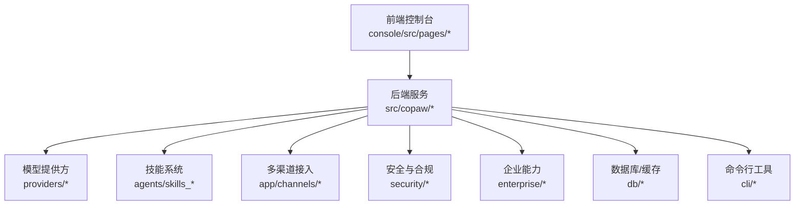
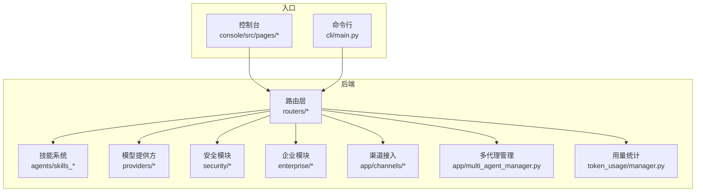
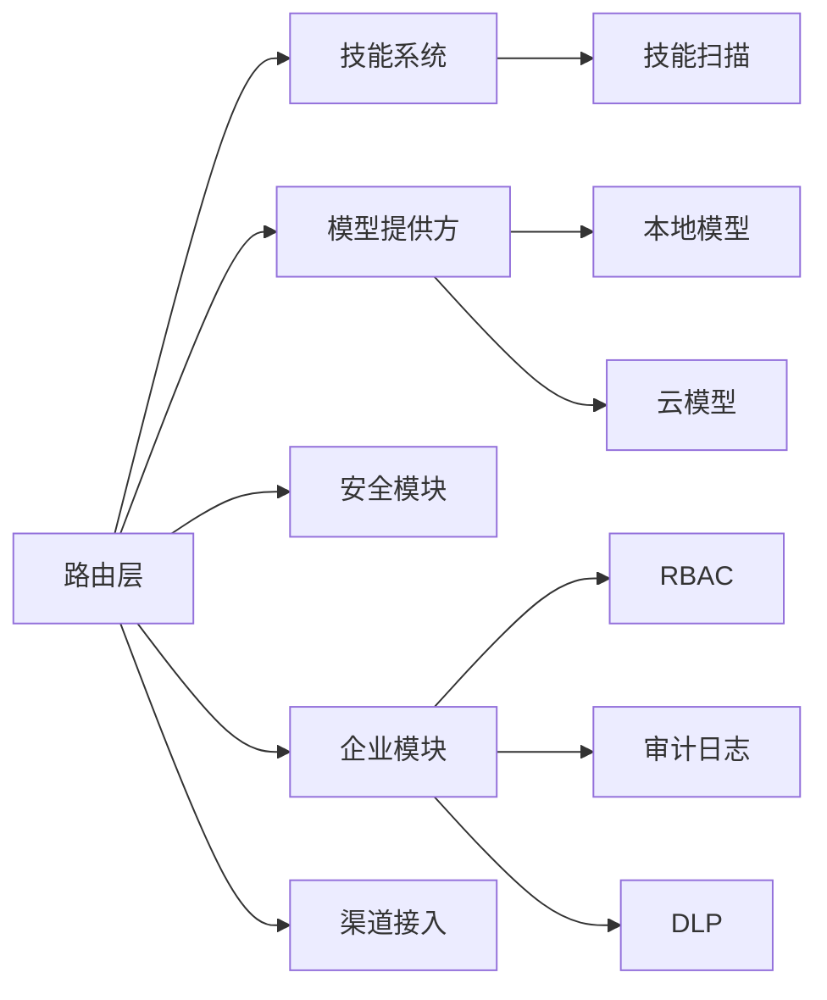

# 功能特性

<cite>
**本文引用的文件**
- [README.md](file://README.md)
- [QUICK-START.md](file://docs/QUICK-START.md)
- [ent-copaw.md](file://docs/ent-copaw.md)
- [src/copaw/constant.py](file://src/copaw/constant.py)
- [src/copaw/__init__.py](file://src/copaw/__init__.py)
- [src/copaw/agents/skills_hub.py](file://src/copaw/agents/skills_hub.py)
- [src/copaw/app/routers/skills.py](file://src/copaw/app/routers/skills.py)
- [src/copaw/app/routers/agent.py](file://src/copaw/app/routers/agent.py)
- [src/copaw/app/routers/mcp.py](file://src/copaw/app/routers/mcp.py)
- [src/copaw/providers/provider_manager.py](file://src/copaw/providers/provider_manager.py)
- [src/copaw/local_models/model_manager.py](file://src/copaw/local_models/model_manager.py)
- [src/copaw/security/skill_scanner/scanner.py](file://src/copaw/security/skill_scanner/scanner.py)
- [src/copaw/enterprise/auth_service.py](file://src/copaw/enterprise/auth_service.py)
- [src/copaw/enterprise/rbac_service.py](file://src/copaw/enterprise/rbac_service.py)
- [src/copaw/enterprise/dlp_service.py](file://src/copaw/enterprise/dlp_service.py)
- [src/copaw/enterprise/workflow_service.py](file://src/copaw/enterprise/workflow_service.py)
- [src/copaw/app/channels/base.py](file://src/copaw/app/channels/base.py)
- [src/copaw/app/multi_agent_manager.py](file://src/copaw/app/multi_agent_manager.py)
- [src/copaw/token_usage/manager.py](file://src/copaw/token_usage/manager.py)
- [src/copaw/cli/main.py](file://src/copaw/cli/main.py)
</cite>

## 目录
1. [简介](#简介)
2. [项目结构](#项目结构)
3. [核心组件](#核心组件)
4. [架构总览](#架构总览)
5. [详细组件分析](#详细组件分析)
6. [依赖分析](#依赖分析)
7. [性能考虑](#性能考虑)
8. [故障排查指南](#故障排查指南)
9. [结论](#结论)
10. [附录](#附录)

## 简介
本文件系统性梳理 CoPaw 的功能特性，重点对比个人版与企业版差异，涵盖多代理协作、多渠道集成、技能扩展、本地模型支持、安全防护等核心能力。文档提供使用场景、配置方法、最佳实践、技术实现原理、性能考量与限制条件，并给出可操作的使用示例与配置指南，帮助用户快速理解与落地。

## 项目结构
CoPaw 采用模块化架构，前端控制台与后端服务分离，后端以 Python 为主，提供多渠道接入、技能扩展、模型与工具管理、安全与合规、企业级权限与审计等能力。关键目录与职责概览：
- console：前端控制台，提供模型配置、技能管理、工作区与企业功能界面
- src/copaw：后端核心，包含 agents、app、providers、local_models、security、enterprise、db、cli 等模块
- docs：官方文档与企业版 PRD
- deploy：容器化与监控部署模板
- working：运行时工作区与机密存储

图示来源
- [README.md:113-155](file://README.md#L113-L155)
- [QUICK-START.md:19-122](file://docs/QUICK-START.md#L19-L122)

章节来源
- [README.md:113-155](file://README.md#L113-L155)
- [QUICK-START.md:19-122](file://docs/QUICK-START.md#L19-L122)

## 核心组件
- 多代理协作：支持创建多个独立 Agent，启用协作技能实现跨 Agent 通信与任务编排
- 多渠道集成：统一接入钉钉、飞书、微信、Discord、Telegram 等，提供一致交互体验
- 技能扩展：内置技能池与技能中心，支持本地/远程安装、冲突检测、版本管理与安全扫描
- 本地模型支持：llama.cpp、Ollama、LM Studio 等本地推理后端，无需 API Key
- 安全防护：工具守卫、文件访问控制、技能安全扫描、本地部署；企业版新增端到端加密、RBAC、审计日志、DLP、SSO
- 企业能力：多租户架构、组织管理、团队协作、工作流自动化（Dify 集成）、监控与告警

章节来源
- [README.md:35-47](file://README.md#L35-L47)
- [README.md:176-253](file://README.md#L176-L253)
- [ent-copaw.md:87-319](file://docs/ent-copaw.md#L87-L319)

## 架构总览
CoPaw 后端通过路由层暴露 API，前端控制台与 CLI 作为入口，技能系统负责能力扩展，模型提供方负责推理，安全模块保障执行安全，企业模块提供权限与合规能力。

图示来源
- [src/copaw/app/routers/skills.py](file://src/copaw/app/routers/skills.py)
- [src/copaw/providers/provider_manager.py](file://src/copaw/providers/provider_manager.py)
- [src/copaw/security/skill_scanner/scanner.py](file://src/copaw/security/skill_scanner/scanner.py)
- [src/copaw/enterprise/auth_service.py](file://src/copaw/enterprise/auth_service.py)
- [src/copaw/app/channels/base.py](file://src/copaw/app/channels/base.py)
- [src/copaw/app/multi_agent_manager.py](file://src/copaw/app/multi_agent_manager.py)
- [src/copaw/token_usage/manager.py](file://src/copaw/token_usage/manager.py)
- [src/copaw/cli/main.py](file://src/copaw/cli/main.py)

## 详细组件分析

### 多代理协作
- 使用场景
  - 团队任务分解与并行执行：一个复杂任务拆分为多个子任务，由不同 Agent 分别处理
  - 跨领域知识整合：如 HR Agent 负责人员信息，财务 Agent 负责费用核对，通过协作技能汇总结果
  - 实时协作：多人同时参与同一任务，Agent 作为“智能助手”提供上下文与建议
- 配置方法
  - 在控制台创建团队 Agent，设置角色与技能集合
  - 启用协作技能，配置跨 Agent 通信协议与权限
  - 通过工作区共享对话历史与知识库，便于上下文延续
- 最佳实践
  - 明确 Agent 角色边界，避免重复劳动
  - 使用任务追踪与进度提示，保持透明协作
  - 为关键流程设置回滚与审计点
- 技术实现原理
  - 多代理管理器负责生命周期与调度
  - 协作技能通过统一消息协议在 Agent 间传递
  - 记忆与知识库共享机制保证上下文一致性
- 性能与限制
  - 并发数量受模型并发与资源配额限制
  - 跨 Agent 通信延迟与网络抖动需纳入任务时序设计
- 使用示例
  - 在控制台创建“项目管理 Agent”，启用“会议助理”“报告生成”等技能，开启协作模式，邀请团队成员参与

章节来源
- [README.md:41](file://README.md#L41)
- [src/copaw/app/multi_agent_manager.py](file://src/copaw/app/multi_agent_manager.py)

### 多渠道集成
- 使用场景
  - 企业内部统一入口：通过钉钉、飞书、企业微信等渠道与 Agent 交互
  - 社交媒体运营：自动抓取热点、生成摘要、分发内容
  - 客服与支持：自动工单创建、状态查询与进度推送
- 配置方法
  - 在控制台选择目标渠道，填写应用 ID、密钥与回调地址
  - 绑定 Agent 与技能，配置消息渲染与富媒体回复
- 最佳实践
  - 为不同渠道设置差异化消息样式与快捷指令
  - 使用统一的富文本/卡片模板提升用户体验
- 技术实现原理
  - 渠道适配器统一抽象，屏蔽平台差异
  - 消息渲染器将结构化输出转换为平台可识别的富媒体
- 性能与限制
  - 平台速率限制与回调幂等性需严格处理
  - 大文件/多媒体需走直传与 CDN
- 使用示例
  - 在控制台启用钉钉渠道，配置“日报生成”技能，用户在群内发送“/skills”即可查看可用技能

章节来源
- [README.md:45](file://README.md#L45)
- [src/copaw/app/channels/base.py](file://src/copaw/app/channels/base.py)

### 技能扩展
- 使用场景
  - 业务自动化：发票 OCR、报销审批、会议纪要生成
  - 知识检索：对接企业知识库，提供智能问答
  - 外部系统集成：CRM、ERP、工单系统、数据库
- 配置方法
  - 本地安装：在控制台导入技能包或从技能中心安装
  - 远程安装：通过技能中心搜索、下载与安装
  - 版本管理：支持多版本并存与切换
- 最佳实践
  - 为技能编写清晰的 SKILL.md 与最小可运行示例
  - 使用标签与分类便于发现与治理
- 技术实现原理
  - 技能中心提供元数据与文件打包，安装时解析并注册
  - 冲突检测与命名规范化避免覆盖
  - 安全扫描在安装前拦截高风险行为
- 性能与限制
  - 技能执行受模型与工具调用影响
  - 大型依赖需考虑冷启动与缓存
- 使用示例
  - 在控制台打开“技能中心”，搜索“发票 OCR”，安装后在聊天中输入“/invoice_ocr”触发

章节来源
- [README.md:39](file://README.md#L39)
- [src/copaw/agents/skills_hub.py](file://src/copaw/agents/skills_hub.py)

### 本地模型支持
- 使用场景
  - 无网络或低延迟需求：本地快速推理
  - 数据隐私敏感：完全离线，无需上传
  - 资源受限环境：边缘设备或受限带宽
- 配置方法
  - llama.cpp：在控制台点击“下载 Llama.cpp”后启动
  - Ollama/LM Studio：先启动对应应用，再在模型配置中选择本地后端
- 最佳实践
  - 根据硬件选择合适模型尺寸
  - 合理设置并发与缓存，避免频繁加载
- 技术实现原理
  - 本地模型管理器统一调度不同后端
  - 与模型提供方管理器解耦，支持无缝切换
- 性能与限制
  - 受 GPU/CPU 与显存限制
  - 首次加载耗时较长，建议预热
- 使用示例
  - 在“设置 → 模型”中选择本地后端，下载模型后即可直接使用

章节来源
- [README.md:269-279](file://README.md#L269-L279)
- [src/copaw/local_models/model_manager.py](file://src/copaw/local_models/model_manager.py)

### 安全防护
- 个人版
  - 工具守卫：拦截危险命令，需人工确认
  - 文件访问控制：限制 Agent 对敏感路径的访问
  - 技能安全扫描：安装前扫描潜在风险
  - 本地部署：数据默认保存在本地
- 企业版
  - 端到端加密：数据在传输与存储中加密
  - RBAC：细粒度权限控制与继承
  - 审计日志：完整操作轨迹与可追溯性
  - DLP：敏感数据识别、脱敏与阻断
  - SSO：对接企业身份系统
- 配置方法
  - 在“设置 → 安全”中启用相关策略
  - 企业版在“企业 → 审计/权限/SSO/DLP”中配置
- 最佳实践
  - 默认最小权限原则，按需放权
  - 定期审计与合规检查
- 使用示例
  - 为“财务”角色配置只读报表权限，禁止导出敏感数据

章节来源
- [README.md:297-314](file://README.md#L297-L314)
- [src/copaw/security/skill_scanner/scanner.py](file://src/copaw/security/skill_scanner/scanner.py)
- [ent-copaw.md:147-201](file://docs/ent-copaw.md#L147-L201)

### 企业能力总览
- 多租户与组织管理：租户隔离、部门结构、用户与用户组
- RBAC 权限体系：角色定义、权限点、继承与覆盖
- 团队协作：共享 Agent、协作工作区、任务分配与追踪
- 工作流自动化：Dify 集成（双向），可视化编排与执行监控
- 安全与合规：端到端加密、审计日志、DLP、合规支持
- 监控与告警：Prometheus 指标、仪表板与告警规则

章节来源
- [README.md:176-253](file://README.md#L176-L253)
- [ent-copaw.md:87-319](file://docs/ent-copaw.md#L87-L319)

## 依赖分析
- 组件耦合
  - 路由层依赖技能、模型、安全与企业模块
  - 技能系统依赖文件系统与安全扫描
  - 渠道接入依赖统一消息协议与渲染器
  - 企业模块依赖认证、权限与审计服务
- 外部依赖
  - 模型提供方：OpenAI、Gemini、DashScope、Ollama 等
  - 企业集成：LDAP/SSO、数据库与缓存、监控系统
- 循环依赖
  - 通过模块化与接口抽象避免循环导入
- 风险点
  - 渠道回调幂等性与消息去重
  - 企业权限继承与覆盖的边界

图示来源
- [src/copaw/app/routers/skills.py](file://src/copaw/app/routers/skills.py)
- [src/copaw/providers/provider_manager.py](file://src/copaw/providers/provider_manager.py)
- [src/copaw/security/skill_scanner/scanner.py](file://src/copaw/security/skill_scanner/scanner.py)
- [src/copaw/enterprise/rbac_service.py](file://src/copaw/enterprise/rbac_service.py)
- [src/copaw/enterprise/dlp_service.py](file://src/copaw/enterprise/dlp_service.py)
- [src/copaw/local_models/model_manager.py](file://src/copaw/local_models/model_manager.py)

## 性能考虑
- 并发与限流
  - 模型并发与 QPM 限制，避免 429 与排队风暴
  - 工具守卫审批超时可配置，平衡安全与吞吐
- 存储与缓存
  - 记忆与嵌入缓存、技能包缓存、渠道媒体缓存
  - 企业版建议使用独立数据库 Schema 隔离与索引优化
- 网络与 I/O
  - 渠道回调与长轮询需幂等与去重
  - 大文件直传与 CDN 加速
- 资源配额
  - 企业版支持租户级资源配额与用量统计

章节来源
- [src/copaw/constant.py:206-249](file://src/copaw/constant.py#L206-L249)
- [src/copaw/token_usage/manager.py](file://src/copaw/token_usage/manager.py)

## 故障排查指南
- 常见问题
  - 端口占用：更换端口或释放占用进程
  - 数据库连接失败：检查连接字符串与网络可达性
  - Redis 连接失败：确认服务状态与认证
  - 渠道回调异常：检查签名、重试与幂等
- 排查步骤
  - 查看应用日志与错误码
  - 核对模型与技能配置
  - 验证企业权限与审计日志
- 建议
  - 开启调试模式与详细日志
  - 使用健康检查与心跳机制

章节来源
- [QUICK-START.md:309-337](file://docs/QUICK-START.md#L309-L337)

## 结论
CoPaw 以“个人可控、企业可管”为目标，既满足个人用户的隐私与易用性，又提供企业级的多租户、权限、安全与自动化能力。通过多代理协作、多渠道集成、技能扩展与本地模型支持，结合企业版的端到端加密、RBAC、审计与 Dify 工作流，可覆盖从个人助理到企业智能中枢的全场景需求。

## 附录

### 个人版与企业版功能对照
- 多代理协作：个人版可创建独立 Agent；企业版支持团队共享 Agent 与协作工作区
- 多渠道集成：个人版与企业版均支持主流渠道，企业版提供组织级接入策略
- 技能扩展：个人版与企业版均支持技能安装与安全扫描，企业版提供技能商店与版本治理
- 本地模型支持：个人版与企业版均支持本地推理后端
- 安全防护：企业版新增端到端加密、RBAC、审计日志、DLP、SSO

章节来源
- [README.md:176-253](file://README.md#L176-L253)
- [ent-copaw.md:87-319](file://docs/ent-copaw.md#L87-L319)

### 快速开始与配置要点
- 个人版
  - 安装与初始化：pip 安装、初始化配置、启动服务
  - 控制台配置：模型与 API Key、技能启用、渠道绑定
- 企业版
  - 安装与初始化：安装企业版、准备数据库与缓存、初始化企业配置
  - 控制台配置：用户与角色、部门与权限、审计与合规、工作流与 Dify 集成

章节来源
- [QUICK-START.md:19-122](file://docs/QUICK-START.md#L19-L122)
- [README.md:113-155](file://README.md#L113-L155)