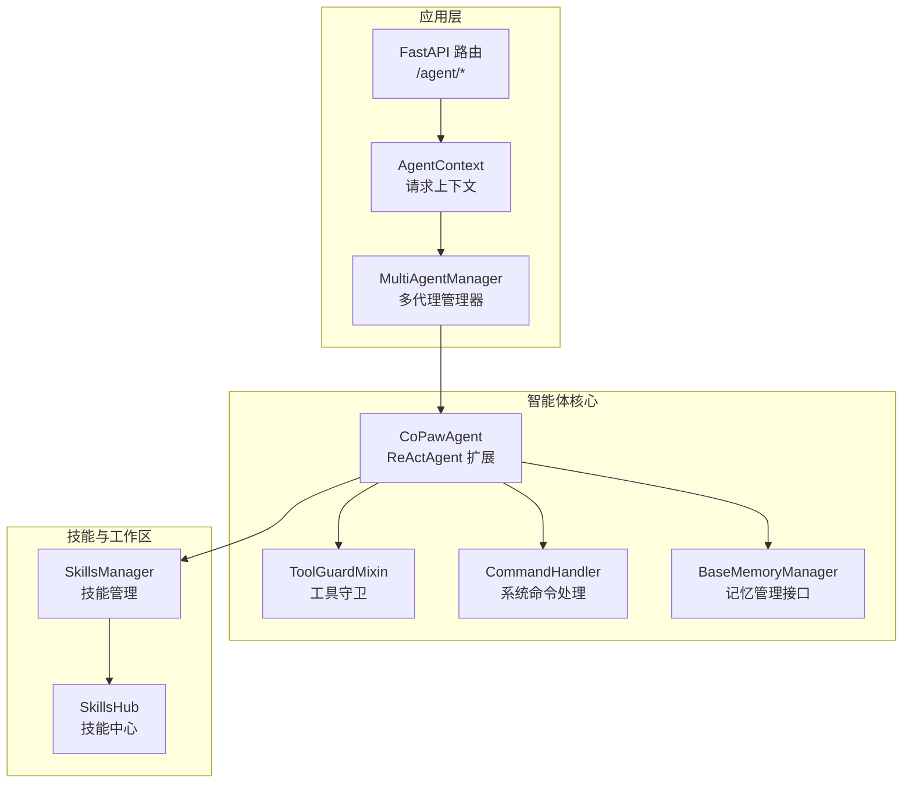
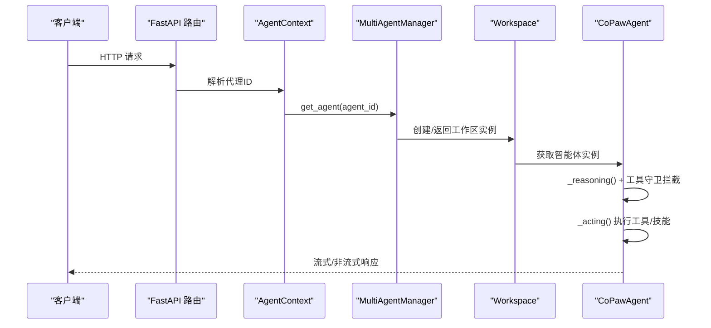
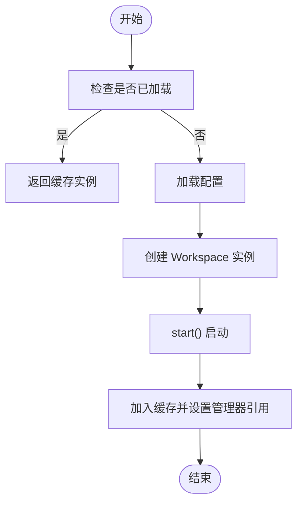
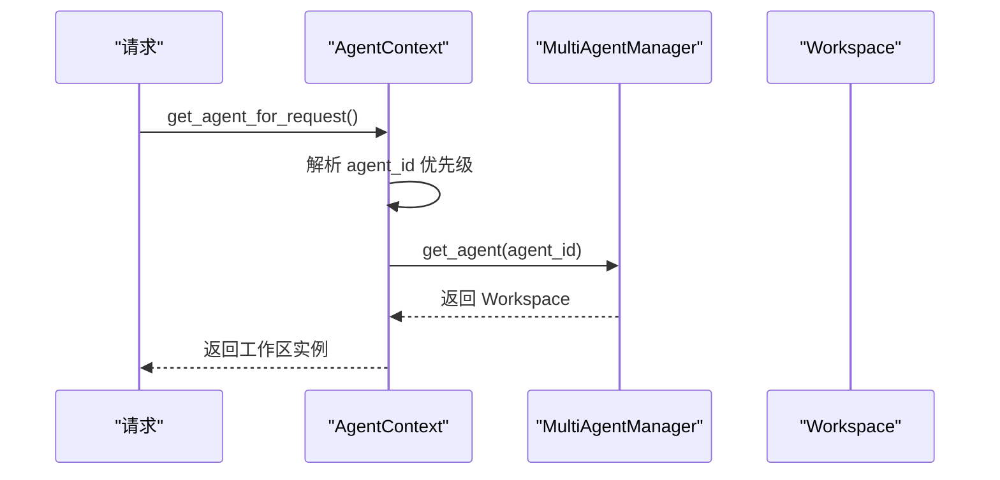
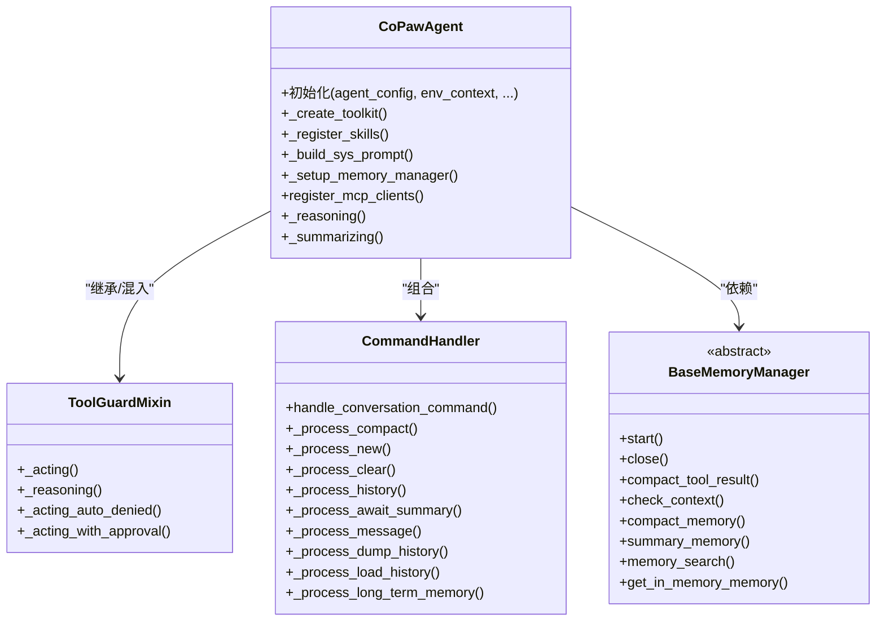
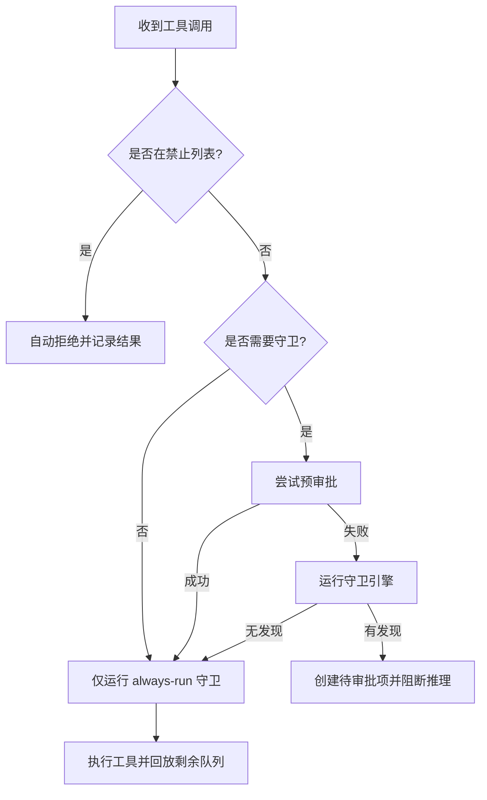
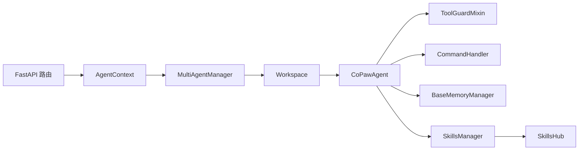

# 多代理系统

<cite>
**本文引用的文件**
- [react_agent.py](file://src/copaw/agents/react_agent.py)
- [tool_guard_mixin.py](file://src/copaw/agents/tool_guard_mixin.py)
- [command_handler.py](file://src/copaw/agents/command_handler.py)
- [base_memory_manager.py](file://src/copaw/agents/memory/base_memory_manager.py)
- [bootstrap.py](file://src/copaw/agents/hooks/bootstrap.py)
- [memory_compaction.py](file://src/copaw/agents/hooks/memory_compaction.py)
- [multi_agent_manager.py](file://src/copaw/app/multi_agent_manager.py)
- [agent_context.py](file://src/copaw/app/agent_context.py)
- [agent.py](file://src/copaw/app/routers/agent.py)
- [skills_manager.py](file://src/copaw/agents/skills_manager.py)
- [skills_hub.py](file://src/copaw/agents/skills_hub.py)
</cite>

## 目录
1. [引言](#引言)
2. [项目结构](#项目结构)
3. [核心组件](#核心组件)
4. [架构总览](#架构总览)
5. [详细组件分析](#详细组件分析)
6. [依赖分析](#依赖分析)
7. [性能考虑](#性能考虑)
8. [故障排查指南](#故障排查指南)
9. [结论](#结论)
10. [附录](#附录)

## 引言
本技术文档围绕 CoPaw 的多代理系统展开，系统性阐述其如何通过 ReAct 框架实现智能体的推理与行动闭环；如何在多代理场景下进行代理的创建、配置、生命周期管理、内存管理与协作；以及如何通过工具守卫、钩子机制、技能体系与工作区上下文实现安全、可控且可扩展的多智能体协同。文档同时给出最佳实践、性能优化策略与故障恢复建议，并提供多代理场景的使用示例与调试技巧。

## 项目结构
CoPaw 将“多代理”能力置于应用层（app），并通过工作区（Workspace）抽象每个代理实例，配合多代理管理器（MultiAgentManager）实现按需加载、零停机热重载与并发安全。智能体核心由 CoPawAgent 提供，基于 ReActAgent 并集成工具、技能、记忆与安全控制。技能体系通过技能管理器与技能中心进行统一编排与分发。

图示来源
- [multi_agent_manager.py:21-90](file://src/copaw/app/multi_agent_manager.py#L21-L90)
- [agent_context.py:22-106](file://src/copaw/app/agent_context.py#L22-L106)
- [react_agent.py:69-182](file://src/copaw/agents/react_agent.py#L69-L182)
- [tool_guard_mixin.py:45-109](file://src/copaw/agents/tool_guard_mixin.py#L45-L109)
- [command_handler.py:62-95](file://src/copaw/agents/command_handler.py#L62-L95)
- [base_memory_manager.py:21-56](file://src/copaw/agents/memory/base_memory_manager.py#L21-L56)
- [skills_manager.py:119-142](file://src/copaw/agents/skills_manager.py#L119-L142)
- [skills_hub.py:1-120](file://src/copaw/agents/skills_hub.py#L1-L120)

章节来源
- [multi_agent_manager.py:21-90](file://src/copaw/app/multi_agent_manager.py#L21-L90)
- [agent_context.py:22-106](file://src/copaw/app/agent_context.py#L22-L106)
- [react_agent.py:69-182](file://src/copaw/agents/react_agent.py#L69-L182)

## 核心组件
- 多代理管理器（MultiAgentManager）
  - 按需懒加载、零停机热重载、并发安全、批量启动与清理。
- 代理上下文（AgentContext）
  - 从请求中解析当前代理 ID，支持显式覆盖、头信息与配置回退。
- CoPawAgent（ReActAgent 扩展）
  - 集成工具、技能、系统提示构建、内存管理、媒体块过滤、MCP 客户端注册与恢复。
- 工具守卫（ToolGuardMixin）
  - 在推理与行动阶段拦截敏感工具调用，支持自动拒绝、预审批与人工审批队列。
- 系统命令处理器（CommandHandler）
  - 支持 /compact、/new、/clear、/history、/await_summary 等对话级命令。
- 记忆管理接口（BaseMemoryManager）
  - 统一的记忆生命周期、压缩、摘要与搜索接口，支持后台摘要任务。
- 技能管理（SkillsManager/SkillsHub）
  - 技能清单、冲突检测、环境注入、远程技能中心拉取与安装。

章节来源
- [multi_agent_manager.py:21-90](file://src/copaw/app/multi_agent_manager.py#L21-L90)
- [agent_context.py:22-106](file://src/copaw/app/agent_context.py#L22-L106)
- [react_agent.py:69-182](file://src/copaw/agents/react_agent.py#L69-L182)
- [tool_guard_mixin.py:45-109](file://src/copaw/agents/tool_guard_mixin.py#L45-L109)
- [command_handler.py:62-95](file://src/copaw/agents/command_handler.py#L62-L95)
- [base_memory_manager.py:21-56](file://src/copaw/agents/memory/base_memory_manager.py#L21-L56)
- [skills_manager.py:119-142](file://src/copaw/agents/skills_manager.py#L119-L142)
- [skills_hub.py:1-120](file://src/copaw/agents/skills_hub.py#L1-L120)

## 架构总览
CoPaw 的多代理系统以“请求-代理-工作区-智能体”的链路组织：请求进入后由 AgentContext 解析目标代理，MultiAgentManager 提供工作区实例，CoPawAgent 负责 ReAct 推理与行动、工具守卫与命令处理，记忆管理器负责上下文压缩与摘要，技能管理器负责动态加载与运行时注入。

图示来源
- [agent.py:38-106](file://src/copaw/app/routers/agent.py#L38-L106)
- [agent_context.py:22-106](file://src/copaw/app/agent_context.py#L22-L106)
- [multi_agent_manager.py:38-90](file://src/copaw/app/multi_agent_manager.py#L38-L90)
- [react_agent.py:621-648](file://src/copaw/agents/react_agent.py#L621-L648)

## 详细组件分析

### 多代理管理器（MultiAgentManager）
- 功能要点
  - 懒加载：首次请求才创建工作区并启动。
  - 零停机热重载：新旧实例原子替换，后台清理旧实例。
  - 并发安全：全局异步锁保护实例表更新。
  - 批量启动：并发启动启用的代理，失败不阻塞其他代理。
- 生命周期
  - get_agent：按需创建与启动。
  - reload_agent：创建新实例、交换引用、优雅停止旧实例。
  - stop_all/cancel_all_cleanup_tasks：优雅关停与清理后台任务。
- 关键路径
  - 实例缓存、配置校验、实例替换与延迟清理。

图示来源
- [multi_agent_manager.py:38-90](file://src/copaw/app/multi_agent_manager.py#L38-L90)

章节来源
- [multi_agent_manager.py:21-90](file://src/copaw/app/multi_agent_manager.py#L21-L90)
- [multi_agent_manager.py:208-320](file://src/copaw/app/multi_agent_manager.py#L208-L320)
- [multi_agent_manager.py:346-370](file://src/copaw/app/multi_agent_manager.py#L346-L370)

### 代理上下文与请求路由
- AgentContext
  - 优先级：参数覆盖 > 请求状态 > 头部 > 配置默认。
  - 校验代理存在性与启用状态，确保 MultiAgentManager 可用。
- FastAPI 路由
  - /agent/files、/agent/memory 等接口通过 get_agent_for_request 获取当前工作区，再委托管理器与智能体。

图示来源
- [agent_context.py:22-106](file://src/copaw/app/agent_context.py#L22-L106)
- [agent.py:38-106](file://src/copaw/app/routers/agent.py#L38-L106)

章节来源
- [agent_context.py:22-106](file://src/copaw/app/agent_context.py#L22-L106)
- [agent.py:38-106](file://src/copaw/app/routers/agent.py#L38-L106)

### CoPawAgent 与 ReAct 框架
- 初始化流程
  - 读取运行配置、语言设置、系统提示构建、模型与格式化器工厂、工具包注册、技能注册、内存管理器装配、命令处理器与钩子注册。
- 工具与技能
  - 内置工具集按配置启用，支持异步执行与后台任务管理工具自动注册；技能从工作区目录与技能池加载。
- 媒体块与模型能力
  - 主动/被动过滤多媒体块，避免模型拒绝；在总结阶段移除 tool_use 块，保证前端渲染一致性。
- MCP 客户端
  - 注册外部工具源，支持断线重连与重建恢复，失败时记录并跳过，避免中断主流程。

图示来源
- [react_agent.py:69-182](file://src/copaw/agents/react_agent.py#L69-L182)
- [tool_guard_mixin.py:45-109](file://src/copaw/agents/tool_guard_mixin.py#L45-L109)
- [command_handler.py:62-95](file://src/copaw/agents/command_handler.py#L62-L95)
- [base_memory_manager.py:21-56](file://src/copaw/agents/memory/base_memory_manager.py#L21-L56)

章节来源
- [react_agent.py:69-182](file://src/copaw/agents/react_agent.py#L69-L182)
- [react_agent.py:468-532](file://src/copaw/agents/react_agent.py#L468-L532)
- [react_agent.py:665-718](file://src/copaw/agents/react_agent.py#L665-L718)
- [react_agent.py:719-775](file://src/copaw/agents/react_agent.py#L719-L775)

### 工具守卫（ToolGuardMixin）
- 拦截策略
  - 自动拒绝：命中“禁止工具”直接拒绝。
  - 预审批：会话上下文存在时尝试一次性消耗预审批令牌。
  - 人工审批：记录待审批项，向审批服务写入，阻断后续推理直至审批完成或拒绝。
- 审批与回放
  - 记录兄弟工具调用队列与剩余队列，审批完成后回放未执行的工具调用，保持对话一致性。
- 线程安全
  - 决策在互斥锁内完成，实际执行在锁外并行，兼顾安全性与吞吐。

图示来源
- [tool_guard_mixin.py:316-371](file://src/copaw/agents/tool_guard_mixin.py#L316-L371)
- [tool_guard_mixin.py:398-421](file://src/copaw/agents/tool_guard_mixin.py#L398-L421)
- [tool_guard_mixin.py:497-616](file://src/copaw/agents/tool_guard_mixin.py#L497-L616)
- [tool_guard_mixin.py:621-715](file://src/copaw/agents/tool_guard_mixin.py#L621-L715)

章节来源
- [tool_guard_mixin.py:45-109](file://src/copaw/agents/tool_guard_mixin.py#L45-L109)
- [tool_guard_mixin.py:261-315](file://src/copaw/agents/tool_guard_mixin.py#L261-L315)
- [tool_guard_mixin.py:497-616](file://src/copaw/agents/tool_guard_mixin.py#L497-L616)
- [tool_guard_mixin.py:621-715](file://src/copaw/agents/tool_guard_mixin.py#L621-L715)

### 系统命令处理器（CommandHandler）
- 支持命令
  - /compact：触发记忆压缩与摘要生成。
  - /new：开启新对话并清空历史。
  - /clear：清空压缩摘要与历史。
  - /history：输出历史摘要与长度提示。
  - /await_summary：等待所有后台摘要任务完成。
  - /message n：查看第 n 条消息内容。
  - /dump_history：导出历史至 JSONL 文件。
  - /load_history：从 JSONL 文件加载历史。
  - /long_term_memory：查看长期记忆（若可用）。
- 行为特征
  - 对长历史进行截断显示；对异常进行友好提示；与记忆管理器交互。

章节来源
- [command_handler.py:62-95](file://src/copaw/agents/command_handler.py#L62-L95)
- [command_handler.py:116-161](file://src/copaw/agents/command_handler.py#L116-L161)
- [command_handler.py:162-188](file://src/copaw/agents/command_handler.py#L162-L188)
- [command_handler.py:189-202](file://src/copaw/agents/command_handler.py#L189-L202)
- [command_handler.py:220-246](file://src/copaw/agents/command_handler.py#L220-L246)
- [command_handler.py:247-274](file://src/copaw/agents/command_handler.py#L247-L274)
- [command_handler.py:275-342](file://src/copaw/agents/command_handler.py#L275-L342)
- [command_handler.py:343-398](file://src/copaw/agents/command_handler.py#L343-L398)
- [command_handler.py:399-474](file://src/copaw/agents/command_handler.py#L399-L474)
- [command_handler.py:475-498](file://src/copaw/agents/command_handler.py#L475-L498)

### 记忆管理接口（BaseMemoryManager）
- 角色定位
  - 作为记忆后端的抽象接口，屏蔽不同实现细节（如 ReMeInMemoryMemory）。
- 能力范围
  - 启动/关闭、工具结果压缩、上下文检查与压缩、摘要生成、内存搜索、后台摘要任务管理与等待。
- 与 Agent 协作
  - 在推理前通过钩子触发压缩与摘要任务，减少上下文开销；在命令处理中直接触发压缩与新对话。

章节来源
- [base_memory_manager.py:21-56](file://src/copaw/agents/memory/base_memory_manager.py#L21-L56)
- [base_memory_manager.py:116-139](file://src/copaw/agents/memory/base_memory_manager.py#L116-L139)
- [base_memory_manager.py:140-196](file://src/copaw/agents/memory/base_memory_manager.py#L140-L196)

### 钩子：引导与上下文压缩
- 引导钩子（BootstrapHook）
  - 首次用户交互时读取 BOOTSTRAP.md 并插入系统提示，标记完成以防重复。
- 上下文压缩钩子（MemoryCompactionHook）
  - 热加载运行配置，计算系统提示与压缩摘要的 token 预估；当阈值接近时触发压缩，保留最近消息与系统提示，后台生成摘要并更新压缩摘要。

章节来源
- [bootstrap.py:20-104](file://src/copaw/agents/hooks/bootstrap.py#L20-L104)
- [memory_compaction.py:27-83](file://src/copaw/agents/hooks/memory_compaction.py#L27-L83)
- [memory_compaction.py:167-214](file://src/copaw/agents/hooks/memory_compaction.py#L167-L214)

### 技能管理与技能中心
- 技能管理（SkillsManager）
  - 工作区技能目录与技能池同步、签名计算、冲突检测与重命名建议、环境变量注入、前置条件校验与锁定。
- 技能中心（SkillsHub）
  - 远程技能拉取、版本选择、ZIP 安全解压、内容校验、HTTP 重试与超时、取消检查、缓存与速率限制处理。

章节来源
- [skills_manager.py:119-142](file://src/copaw/agents/skills_manager.py#L119-L142)
- [skills_manager.py:666-711](file://src/copaw/agents/skills_manager.py#L666-L711)
- [skills_hub.py:1-120](file://src/copaw/agents/skills_hub.py#L1-L120)
- [skills_hub.py:286-400](file://src/copaw/agents/skills_hub.py#L286-L400)
- [skills_hub.py:402-439](file://src/copaw/agents/skills_hub.py#L402-L439)

## 依赖分析
- 组件耦合
  - CoPawAgent 与 ToolGuardMixin 通过 MRO 组合，确保推理与行动阶段均受控。
  - CommandHandler 与 BaseMemoryManager 解耦，通过接口契约交互。
  - MultiAgentManager 与 Workspace 解耦，通过管理器引用与异步锁协调。
- 外部依赖
  - FastAPI（路由与上下文）、AgentScope（ReActAgent、消息与工具）、内存与模型后端（ReMe、ChatModel）。
- 循环依赖
  - 未见循环导入；模块职责清晰，接口抽象良好。

图示来源
- [multi_agent_manager.py:21-90](file://src/copaw/app/multi_agent_manager.py#L21-L90)
- [react_agent.py:69-182](file://src/copaw/agents/react_agent.py#L69-L182)
- [tool_guard_mixin.py:45-109](file://src/copaw/agents/tool_guard_mixin.py#L45-L109)
- [command_handler.py:62-95](file://src/copaw/agents/command_handler.py#L62-L95)
- [base_memory_manager.py:21-56](file://src/copaw/agents/memory/base_memory_manager.py#L21-L56)
- [skills_manager.py:119-142](file://src/copaw/agents/skills_manager.py#L119-L142)
- [skills_hub.py:1-120](file://src/copaw/agents/skills_hub.py#L1-L120)
- [agent.py:38-106](file://src/copaw/app/routers/agent.py#L38-L106)
- [agent_context.py:22-106](file://src/copaw/app/agent_context.py#L22-L106)

章节来源
- [multi_agent_manager.py:21-90](file://src/copaw/app/multi_agent_manager.py#L21-L90)
- [react_agent.py:69-182](file://src/copaw/agents/react_agent.py#L69-L182)
- [tool_guard_mixin.py:45-109](file://src/copaw/agents/tool_guard_mixin.py#L45-L109)
- [command_handler.py:62-95](file://src/copaw/agents/command_handler.py#L62-L95)
- [base_memory_manager.py:21-56](file://src/copaw/agents/memory/base_memory_manager.py#L21-L56)
- [skills_manager.py:119-142](file://src/copaw/agents/skills_manager.py#L119-L142)
- [skills_hub.py:1-120](file://src/copaw/agents/skills_hub.py#L1-L120)
- [agent.py:38-106](file://src/copaw/app/routers/agent.py#L38-L106)
- [agent_context.py:22-106](file://src/copaw/app/agent_context.py#L22-L106)

## 性能考虑
- 懒加载与并发启动
  - MultiAgentManager 按需创建实例，批量启动时并发执行，显著降低冷启动时间。
- 零停机热重载
  - 新旧实例原子替换，避免请求中断；后台清理旧实例，保障平滑过渡。
- 记忆压缩与摘要
  - 基于上下文检查与阈值触发压缩，后台摘要任务避免阻塞主线推理。
- 工具守卫并行
  - 决策阶段加锁，执行阶段去锁并行，提升吞吐同时保证一致性。
- 技能加载与缓存
  - 技能中心 HTTP 缓存与重试策略，ZIP 安全校验与大小限制，避免资源浪费与安全风险。

## 故障排查指南
- 代理未找到或禁用
  - 检查配置 profiles 中是否存在该 agent_id 且 enabled=true；确认 X-Agent-Id 头或路由状态是否正确。
- 热重载失败
  - 查看新实例 start 是否抛出异常；确认旧实例延迟清理任务是否被取消或异常；必要时调用 cancel_all_cleanup_tasks。
- 工具守卫阻断
  - 使用 /history 查看最近消息；若出现“风险检测/工具已拦截”，确认审批服务状态与预审批令牌；必要时清理被标记的消息。
- 记忆压缩无效
  - 检查 memory_compact_threshold 与 memory_compact_reserve 设置；确认 memory_summary_enabled；使用 /await_summary 等待后台任务完成。
- 技能安装失败
  - 检查网络与 GITHUB_TOKEN；查看重试日志与错误消息；确认 ZIP 安全校验与大小限制。

章节来源
- [agent_context.py:64-106](file://src/copaw/app/agent_context.py#L64-L106)
- [multi_agent_manager.py:282-297](file://src/copaw/app/multi_agent_manager.py#L282-L297)
- [multi_agent_manager.py:321-344](file://src/copaw/app/multi_agent_manager.py#L321-L344)
- [tool_guard_mixin.py:497-616](file://src/copaw/agents/tool_guard_mixin.py#L497-L616)
- [command_handler.py:247-274](file://src/copaw/agents/command_handler.py#L247-L274)
- [skills_hub.py:330-399](file://src/copaw/agents/skills_hub.py#L330-L399)

## 结论
CoPaw 的多代理系统以 ReAct 框架为核心，结合工具守卫、记忆管理、技能体系与工作区抽象，实现了高可用、可扩展、可治理的多智能体协同平台。通过懒加载、零停机热重载与并发安全设计，系统在复杂场景下仍能保持稳定与高效；通过命令与钩子机制，用户可灵活控制上下文与行为；通过技能中心与守卫机制，系统在开放生态中保持安全可控。

## 附录
- 多代理协作场景示例
  - 用户明确请求：当前代理识别“代码助手”，查询可用代理列表，发送审查请求，整合结果回复用户。
  - 代理主动协作：当前代理在生成技术文档后，判断需要写作专家参与，调用“写作助手”进行润色，最终合并返回。
  - 数据共享：当前代理需要财务报告，直接请求“财务代理”获取数据并格式化返回。
- 最佳实践
  - 明确代理描述：为每个代理编写清晰的能力描述，便于跨域协作。
  - 合理配置阈值：根据模型上下文长度调整 memory_compact_threshold 与 reserve，避免频繁压缩。
  - 使用系统命令：定期使用 /history、/compact、/await_summary 管理上下文与摘要。
  - 安全优先：启用工具守卫与审批流程，合理设置预审批与禁止工具列表。
- 调试技巧
  - 使用 /dump_history 与 /load_history 快速导出/导入历史，便于问题复现。
  - 通过 /long_term_memory 检查长期记忆状态（若可用）。
  - 在工具守卫阻断时，查看审批队列头部信息与守护者标签，快速定位风险点。