# 多渠道集成

<cite>
**本文引用的文件**
- [src/copaw/app/channels/__init__.py](file://src/copaw/app/channels/__init__.py)
- [src/copaw/app/channels/base.py](file://src/copaw/app/channels/base.py)
- [src/copaw/app/channels/manager.py](file://src/copaw/app/channels/manager.py)
- [src/copaw/app/channels/registry.py](file://src/copaw/app/channels/registry.py)
- [src/copaw/app/channels/schema.py](file://src/copaw/app/channels/schema.py)
- [src/copaw/app/channels/dingtalk/channel.py](file://src/copaw/app/channels/dingtalk/channel.py)
- [src/copaw/app/channels/wecom/channel.py](file://src/copaw/app/channels/wecom/channel.py)
- [src/copaw/app/channels/feishu/channel.py](file://src/copaw/app/channels/feishu/channel.py)
- [src/copaw/app/channels/telegram/channel.py](file://src/copaw/app/channels/telegram/channel.py)
- [src/copaw/app/channels/discord_/channel.py](file://src/copaw/app/channels/discord_/channel.py)
</cite>

## 目录
1. [简介](#简介)
2. [项目结构](#项目结构)
3. [核心组件](#核心组件)
4. [架构总览](#架构总览)
5. [详细组件分析](#详细组件分析)
6. [依赖分析](#依赖分析)
7. [性能考虑](#性能考虑)
8. [故障排除指南](#故障排除指南)
9. [结论](#结论)
10. [附录](#附录)

## 简介
本技术文档围绕 CoPaw 的多渠道集成功能展开，系统性阐述其对即时通讯渠道的支持与实现方式。CoPaw 通过统一的通道框架，将来自不同平台的消息（如钉钉、企业微信、飞书、Telegram、Discord 等）统一接入到同一 Agent 流水线中，完成消息解析、会话路由、事件流式输出与回复发送。文档重点覆盖以下方面：
- 渠道适配器设计模式与扩展机制
- 消息路由与队列管理策略
- 状态同步与幂等处理
- 各渠道的特殊能力：卡片消息、主动推送、多媒体处理、提及策略、二维码认证等
- 配置方法与接入流程
- 常见问题排查与优化建议

## 项目结构
CoPaw 的多渠道集成位于应用层的 channels 子模块，采用“注册表 + 统一基类 + 管理器”的分层架构：
- 注册表负责内置与自定义渠道的发现与加载
- 基类定义统一的消息处理协议与通用能力
- 管理器负责通道实例化、队列与消费者、任务跟踪与事件派发
- 具体渠道在各自子包中实现平台特定逻辑

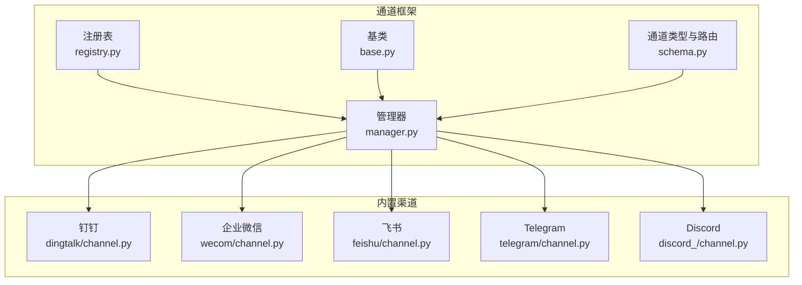

图表来源
- [src/copaw/app/channels/registry.py:190-195](file://src/copaw/app/channels/registry.py#L190-L195)
- [src/copaw/app/channels/base.py:70-127](file://src/copaw/app/channels/base.py#L70-L127)
- [src/copaw/app/channels/manager.py:68-106](file://src/copaw/app/channels/manager.py#L68-L106)
- [src/copaw/app/channels/schema.py:12-48](file://src/copaw/app/channels/schema.py#L12-L48)
- [src/copaw/app/channels/dingtalk/channel.py:89-101](file://src/copaw/app/channels/dingtalk/channel.py#L89-L101)
- [src/copaw/app/channels/wecom/channel.py:89-97](file://src/copaw/app/channels/wecom/channel.py#L89-L97)
- [src/copaw/app/channels/feishu/channel.py:156-165](file://src/copaw/app/channels/feishu/channel.py#L156-L165)
- [src/copaw/app/channels/telegram/channel.py:42-52](file://src/copaw/app/channels/telegram/channel.py#L42-L52)
- [src/copaw/app/channels/discord_/channel.py:42-46](file://src/copaw/app/channels/discord_/channel.py#L42-L46)

章节来源
- [src/copaw/app/channels/__init__.py:1-14](file://src/copaw/app/channels/__init__.py#L1-L14)
- [src/copaw/app/channels/registry.py:190-195](file://src/copaw/app/channels/registry.py#L190-L195)
- [src/copaw/app/channels/base.py:70-127](file://src/copaw/app/channels/base.py#L70-L127)
- [src/copaw/app/channels/manager.py:68-106](file://src/copaw/app/channels/manager.py#L68-L106)
- [src/copaw/app/channels/schema.py:12-48](file://src/copaw/app/channels/schema.py#L12-L48)

## 核心组件
- 通道基类 BaseChannel：定义统一的消息处理协议、渲染风格、去抖与合并策略、会话解析、请求构建、事件流式输出与错误处理等。
- 通道管理器 ChannelManager：负责从环境或配置创建通道实例、注入统一处理函数、启动队列与消费者、执行批量合并、任务跟踪与事件派发。
- 通道注册表 get_channel_registry：内置渠道映射与自定义渠道发现，支持按可用性筛选与懒加载。
- 通道类型与路由 ChannelType/ChannelAddress：统一标识渠道类型与目标路由，便于跨渠道一致的发送与追踪。

章节来源
- [src/copaw/app/channels/base.py:70-127](file://src/copaw/app/channels/base.py#L70-L127)
- [src/copaw/app/channels/manager.py:68-106](file://src/copaw/app/channels/manager.py#L68-L106)
- [src/copaw/app/channels/registry.py:190-195](file://src/copaw/app/channels/registry.py#L190-L195)
- [src/copaw/app/channels/schema.py:12-48](file://src/copaw/app/channels/schema.py#L12-L48)

## 架构总览
下图展示了从消息进入、统一路由、批处理合并、任务跟踪到回复发送的全链路：

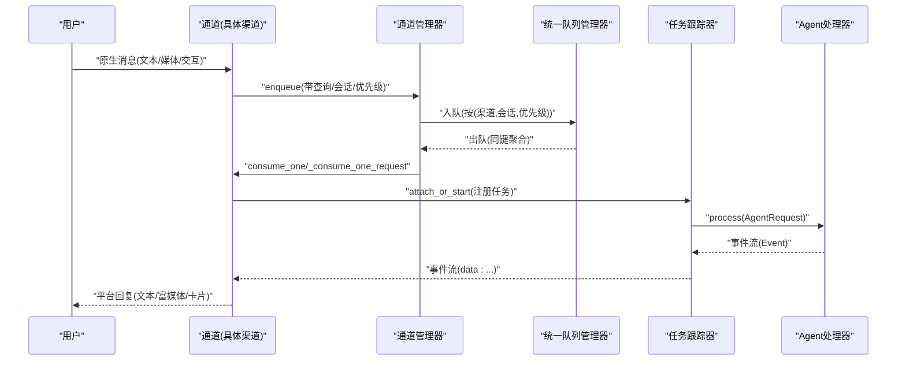

图表来源
- [src/copaw/app/channels/manager.py:255-301](file://src/copaw/app/channels/manager.py#L255-L301)
- [src/copaw/app/channels/manager.py:362-446](file://src/copaw/app/channels/manager.py#L362-L446)
- [src/copaw/app/channels/base.py:431-535](file://src/copaw/app/channels/base.py#L431-L535)

章节来源
- [src/copaw/app/channels/manager.py:255-301](file://src/copaw/app/channels/manager.py#L255-L301)
- [src/copaw/app/channels/manager.py:362-446](file://src/copaw/app/channels/manager.py#L362-L446)
- [src/copaw/app/channels/base.py:431-535](file://src/copaw/app/channels/base.py#L431-L535)

## 详细组件分析

### 通道基类 BaseChannel 设计
- 协议与职责
  - 将原生消息转换为 AgentRequest，再由统一 process 流程产生事件流
  - 提供渲染风格控制、工具消息过滤、思考内容过滤、内部工具白名单
  - 实现时间去抖与内容合并，避免部分输入未就绪导致的重复/碎片化回复
  - 会话解析与聊天创建，结合 TaskTracker 支持取消与幂等
- 关键机制
  - 去抖与合并：对同一会话的多个原生负载进行时间窗口合并，必要时回填音频直达
  - 批量合并：统一队列中同键消息的批量处理与合并
  - 事件流：SSE 格式输出，支持消息完成与响应事件回调
  - 安全策略：允许/拒绝列表、群聊@策略、机器人前缀注入

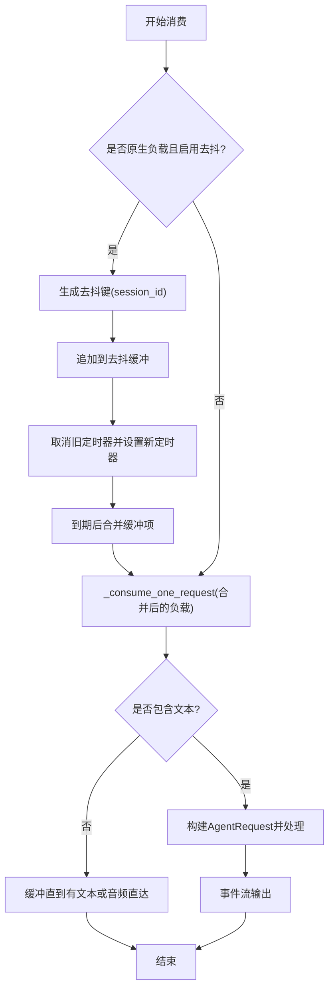

图表来源
- [src/copaw/app/channels/base.py:659-695](file://src/copaw/app/channels/base.py#L659-L695)
- [src/copaw/app/channels/base.py:726-757](file://src/copaw/app/channels/base.py#L726-L757)
- [src/copaw/app/channels/base.py:759-800](file://src/copaw/app/channels/base.py#L759-L800)

章节来源
- [src/copaw/app/channels/base.py:70-127](file://src/copaw/app/channels/base.py#L70-L127)
- [src/copaw/app/channels/base.py:210-282](file://src/copaw/app/channels/base.py#L210-L282)
- [src/copaw/app/channels/base.py:374-535](file://src/copaw/app/channels/base.py#L374-L535)

### 通道管理器 ChannelManager
- 初始化与装配
  - 从环境或配置创建通道实例，注入统一 process 与 on_reply_sent 回调
  - 为使用统一队列的通道设置 enqueue 回调
- 统一路由与批处理
  - 使用统一队列管理器按 (渠道, 会话, 优先级) 路由
  - 对原生负载进行合并，对非原生负载进行请求合并
- 任务跟踪与事件派发
  - 通过 TaskTracker 注册任务，支持取消
  - 事件流完成后触发 on_reply_sent 回调
- 替换与停止
  - 支持动态替换单个通道实例
  - 停止时清理队列、取消待处理任务并关闭通道

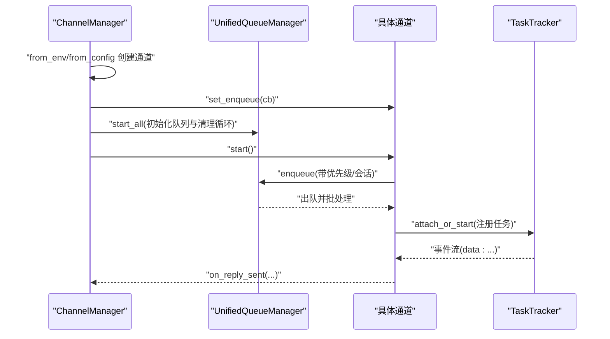

图表来源
- [src/copaw/app/channels/manager.py:86-106](file://src/copaw/app/channels/manager.py#L86-L106)
- [src/copaw/app/channels/manager.py:447-478](file://src/copaw/app/channels/manager.py#L447-L478)
- [src/copaw/app/channels/manager.py:362-446](file://src/copaw/app/channels/manager.py#L362-L446)

章节来源
- [src/copaw/app/channels/manager.py:68-106](file://src/copaw/app/channels/manager.py#L68-L106)
- [src/copaw/app/channels/manager.py:215-301](file://src/copaw/app/channels/manager.py#L215-L301)
- [src/copaw/app/channels/manager.py:362-446](file://src/copaw/app/channels/manager.py#L362-L446)
- [src/copaw/app/channels/manager.py:571-630](file://src/copaw/app/channels/manager.py#L571-L630)

### 通道注册表与扩展机制
- 内置渠道映射：通过键值映射到具体模块与类名，失败时按需抛出或记录日志
- 自定义渠道：扫描自定义目录，动态导入并注册符合规范的通道类
- 快速通道：支持仅加载必要通道以降低启动成本

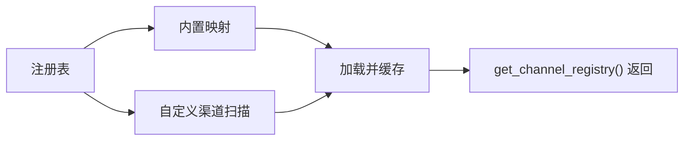

图表来源
- [src/copaw/app/channels/registry.py:20-36](file://src/copaw/app/channels/registry.py#L20-L36)
- [src/copaw/app/channels/registry.py:97-129](file://src/copaw/app/channels/registry.py#L97-L129)
- [src/copaw/app/channels/registry.py:190-195](file://src/copaw/app/channels/registry.py#L190-L195)

章节来源
- [src/copaw/app/channels/registry.py:20-36](file://src/copaw/app/channels/registry.py#L20-L36)
- [src/copaw/app/channels/registry.py:97-129](file://src/copaw/app/channels/registry.py#L97-L129)
- [src/copaw/app/channels/registry.py:190-195](file://src/copaw/app/channels/registry.py#L190-L195)

### 渠道适配器：钉钉
- 特性
  - 基于钉钉 Stream 的回调模型；默认一次回复，可通过会话 Webhook 发送多条消息
  - AI 卡片状态机与持久化，支持主动推送与会话上下文短键
  - 媒体下载与本地存储、消息去重、令牌缓存与刷新
- 会话与路由
  - 会话键基于 conversation_id 的短后缀，便于 cron 主动推送
  - 支持通过 sessionWebhook 进行主动发送

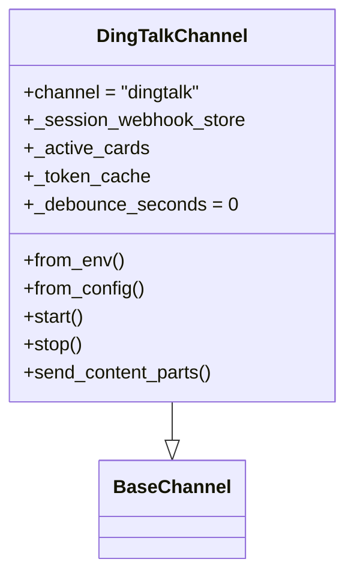

图表来源
- [src/copaw/app/channels/dingtalk/channel.py:89-101](file://src/copaw/app/channels/dingtalk/channel.py#L89-L101)
- [src/copaw/app/channels/dingtalk/channel.py:113-200](file://src/copaw/app/channels/dingtalk/channel.py#L113-L200)

章节来源
- [src/copaw/app/channels/dingtalk/channel.py:89-101](file://src/copaw/app/channels/dingtalk/channel.py#L89-L101)
- [src/copaw/app/channels/dingtalk/channel.py:113-200](file://src/copaw/app/channels/dingtalk/channel.py#L113-L200)

### 渠道适配器：企业微信
- 特性
  - 使用 WebSocket 接收与发送，支持文本、图片、语音、文件与混合消息
  - 媒体上传通过长连接命令流，分块传输并等待 ACK
  - 消息去重、欢迎语、断线重连策略
- 会话与路由
  - 单聊 session_id = wecom:<userid>，群聊 session_id = wecom:group:<chatid>
  - 通过 meta 中的帧信息回传至同一连接

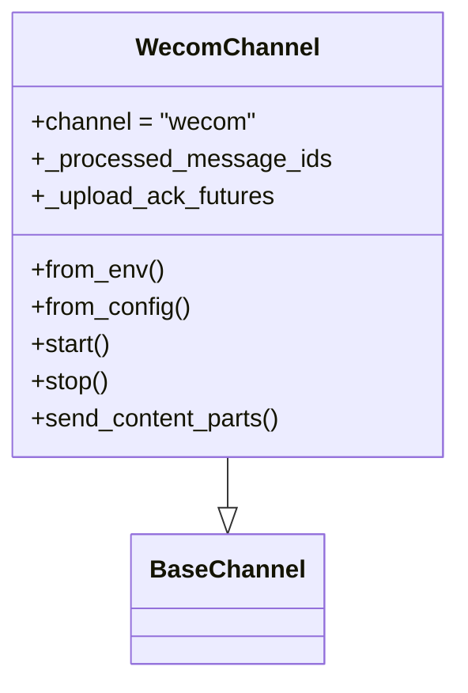

图表来源
- [src/copaw/app/channels/wecom/channel.py:89-97](file://src/copaw/app/channels/wecom/channel.py#L89-L97)
- [src/copaw/app/channels/wecom/channel.py:99-151](file://src/copaw/app/channels/wecom/channel.py#L99-L151)

章节来源
- [src/copaw/app/channels/wecom/channel.py:89-97](file://src/copaw/app/channels/wecom/channel.py#L89-L97)
- [src/copaw/app/channels/wecom/channel.py:99-151](file://src/copaw/app/channels/wecom/channel.py#L99-L151)

### 渠道适配器：飞书
- 特性
  - WebSocket 接收、Open API 发送；支持文本、图片、文件；具备昵称缓存与文件大小限制
  - 会话键基于 chat_id/open_id 的短键，便于主动推送
- 会话与路由
  - 群聊 session_id = feishu:chat_id:<chat_id>，单聊 session_id = feishu:open_id:<open_id>
  - 记录 receive_id/receive_id_type 用于后续回复与主动推送

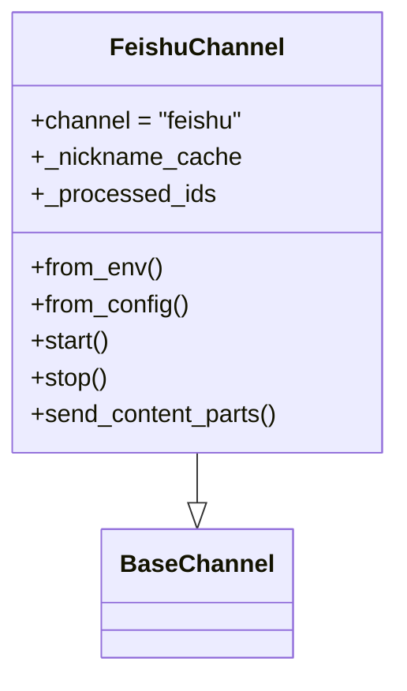

图表来源
- [src/copaw/app/channels/feishu/channel.py:156-165](file://src/copaw/app/channels/feishu/channel.py#L156-L165)
- [src/copaw/app/channels/feishu/channel.py:167-200](file://src/copaw/app/channels/feishu/channel.py#L167-L200)

章节来源
- [src/copaw/app/channels/feishu/channel.py:156-165](file://src/copaw/app/channels/feishu/channel.py#L156-L165)
- [src/copaw/app/channels/feishu/channel.py:167-200](file://src/copaw/app/channels/feishu/channel.py#L167-L200)

### 渠道适配器：Telegram
- 特性
  - Bot API 轮询接收；支持 HTML/Markdown 转换、大文件下载、分片发送
  - 媒体文件解析与远程 URL 解析，长度与大小限制
- 会话与路由
  - 会话键基于 chat_id；支持 @提及检测与命令识别

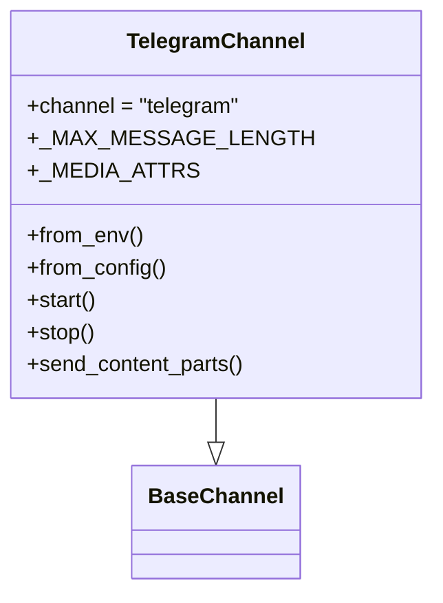

图表来源
- [src/copaw/app/channels/telegram/channel.py:42-52](file://src/copaw/app/channels/telegram/channel.py#L42-L52)
- [src/copaw/app/channels/telegram/channel.py:78-138](file://src/copaw/app/channels/telegram/channel.py#L78-L138)

章节来源
- [src/copaw/app/channels/telegram/channel.py:42-52](file://src/copaw/app/channels/telegram/channel.py#L42-L52)
- [src/copaw/app/channels/telegram/channel.py:140-200](file://src/copaw/app/channels/telegram/channel.py#L140-L200)

### 渠道适配器：Discord
- 特性
  - 使用 discord.py 客户端接收消息；支持提及检测、角色提及、代理与鉴权
  - 消息 ID 去重、最大长度限制、附件类型判断
- 会话与路由
  - 会话键基于消息 ID；支持忽略机器人消息或接受

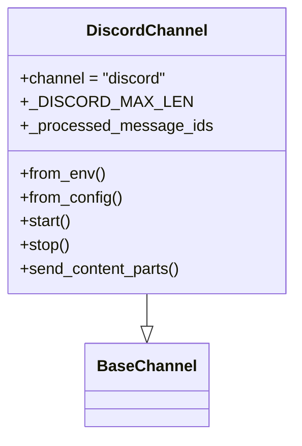

图表来源
- [src/copaw/app/channels/discord_/channel.py:42-46](file://src/copaw/app/channels/discord_/channel.py#L42-L46)
- [src/copaw/app/channels/discord_/channel.py:89-108](file://src/copaw/app/channels/discord_/channel.py#L89-L108)

章节来源
- [src/copaw/app/channels/discord_/channel.py:42-46](file://src/copaw/app/channels/discord_/channel.py#L42-L46)
- [src/copaw/app/channels/discord_/channel.py:110-167](file://src/copaw/app/channels/discord_/channel.py#L110-L167)

## 依赖分析
- 组件耦合
  - ChannelManager 与 BaseChannel：管理器持有通道实例并注入统一处理函数
  - BaseChannel 与 TaskTracker/ChatManager：通过工作空间注入任务跟踪与聊天管理
  - 各渠道与平台 SDK：钉钉 Stream、飞书 lark-oapi、企业微信 aibot、Telegram python-telegram-bot、Discord.py
- 外部依赖与集成点
  - 配置系统：从环境变量或配置文件读取渠道参数
  - 文件系统：媒体目录用于下载与缓存
  - HTTP/WS：各渠道的接收与发送通道

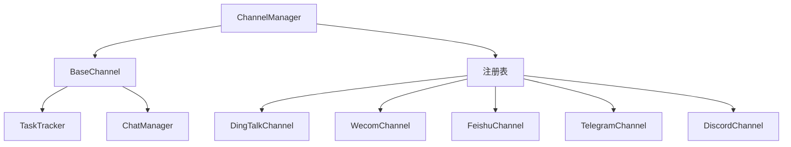

图表来源
- [src/copaw/app/channels/manager.py:534-545](file://src/copaw/app/channels/manager.py#L534-L545)
- [src/copaw/app/channels/base.py:374-430](file://src/copaw/app/channels/base.py#L374-L430)
- [src/copaw/app/channels/registry.py:190-195](file://src/copaw/app/channels/registry.py#L190-L195)

章节来源
- [src/copaw/app/channels/manager.py:534-545](file://src/copaw/app/channels/manager.py#L534-L545)
- [src/copaw/app/channels/base.py:374-430](file://src/copaw/app/channels/base.py#L374-L430)
- [src/copaw/app/channels/registry.py:190-195](file://src/copaw/app/channels/registry.py#L190-L195)

## 性能考虑
- 去抖与合并
  - 时间去抖减少重复与碎片化输出，适合语音转写等渐进式输入
  - 批量合并降低通道处理次数，提升吞吐
- 队列与并发
  - 统一队列按 (渠道, 会话, 优先级) 路由，避免跨渠道争用
  - 任务跟踪防止重复执行，支持取消
- 媒体处理
  - 下载与分块上传策略减少内存峰值与网络阻塞
  - 本地媒体目录与缓存策略降低重复下载
- 错误与退避
  - 平台 API 限流与错误重试策略，避免雪崩

## 故障排除指南
- 通道无法启动
  - 检查注册表是否正确加载对应渠道模块；查看日志中的导入异常
  - 确认配置中 enabled 字段与环境变量开关一致
- 消息未回复或延迟高
  - 检查统一队列是否正常运行与消费者是否启动
  - 查看去抖与合并逻辑是否导致延迟；必要时调整去抖秒数
- 媒体发送失败
  - 检查媒体目录权限与磁盘空间
  - 针对 Telegram/飞书/钉钉 的大小限制与格式要求
- 会话错乱或重复
  - 确认 session_id 生成规则与去重集合是否生效
  - 核对平台消息 ID 去重策略
- 机器人前缀与安全策略
  - 检查 bot_prefix 是否正确注入到 meta
  - 校验 allow_from/require_mention/group_policy 等策略

章节来源
- [src/copaw/app/channels/registry.py:64-76](file://src/copaw/app/channels/registry.py#L64-L76)
- [src/copaw/app/channels/manager.py:447-478](file://src/copaw/app/channels/manager.py#L447-L478)
- [src/copaw/app/channels/base.py:283-318](file://src/copaw/app/channels/base.py#L283-L318)

## 结论
CoPaw 的多渠道集成通过统一的通道框架实现了对多种即时通讯平台的一致接入与高效处理。其核心优势在于：
- 明确的适配器模式与可扩展注册机制
- 健壮的消息路由与批处理合并策略
- 丰富的平台特性支持（卡片、主动推送、多媒体、提及策略）
- 完善的任务跟踪与错误处理

在实际部署中，建议结合业务场景合理配置去抖、合并与安全策略，并针对各平台的 API 限制与特性进行针对性优化。

## 附录
- 渠道接入清单
  - 钉钉：配置 client_id/client_secret、机器人前缀、卡片模板等
  - 企业微信：配置 bot_id/secret、媒体目录、欢迎语、断线重连次数
  - 飞书：配置 app_id/app_secret、加密密钥、校验令牌、媒体目录
  - Telegram：配置 bot_token、媒体目录、HTML/Markdown 转换
  - Discord：配置 token、HTTP 代理与鉴权、是否接受机器人消息
- 配置示例路径
  - 环境变量与配置文件入口参考通道类的 from_env/from_config 方法
- 常用参数
  - show_tool_details/filter_tool_messages/filter_thinking：控制工具消息与思考内容展示
  - dm_policy/group_policy/allow_from/deny_message/require_mention：访问控制与提及策略

章节来源
- [src/copaw/app/channels/dingtalk/channel.py:113-136](file://src/copaw/app/channels/dingtalk/channel.py#L113-L136)
- [src/copaw/app/channels/wecom/channel.py:99-117](file://src/copaw/app/channels/wecom/channel.py#L99-L117)
- [src/copaw/app/channels/feishu/channel.py:167-188](file://src/copaw/app/channels/feishu/channel.py#L167-L188)
- [src/copaw/app/channels/telegram/channel.py:42-52](file://src/copaw/app/channels/telegram/channel.py#L42-L52)
- [src/copaw/app/channels/discord_/channel.py:48-66](file://src/copaw/app/channels/discord_/channel.py#L48-L66)