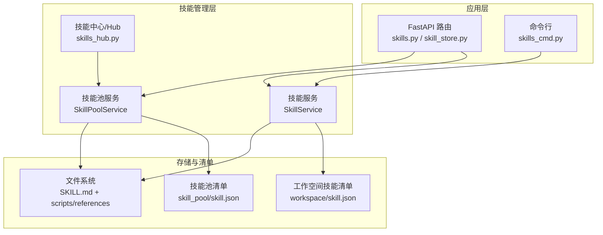
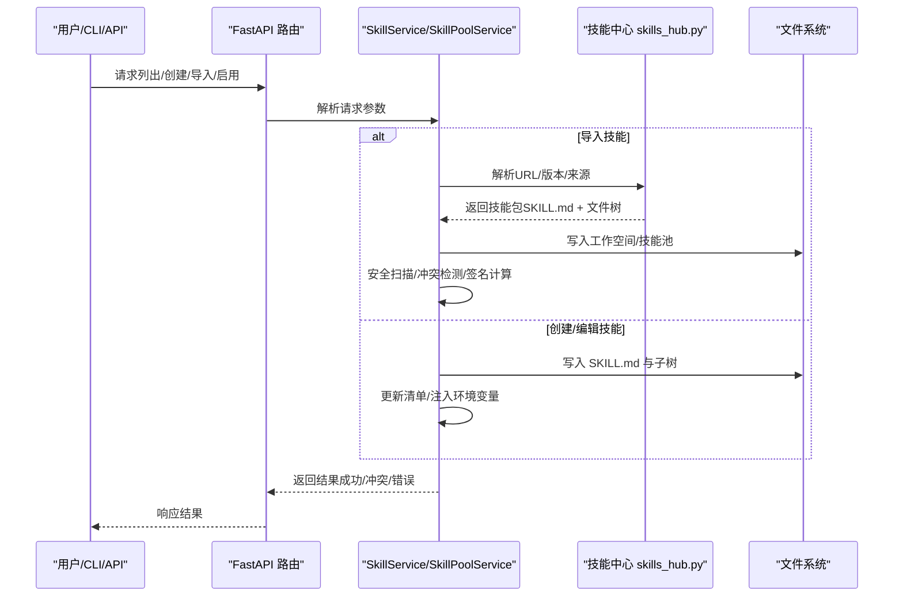
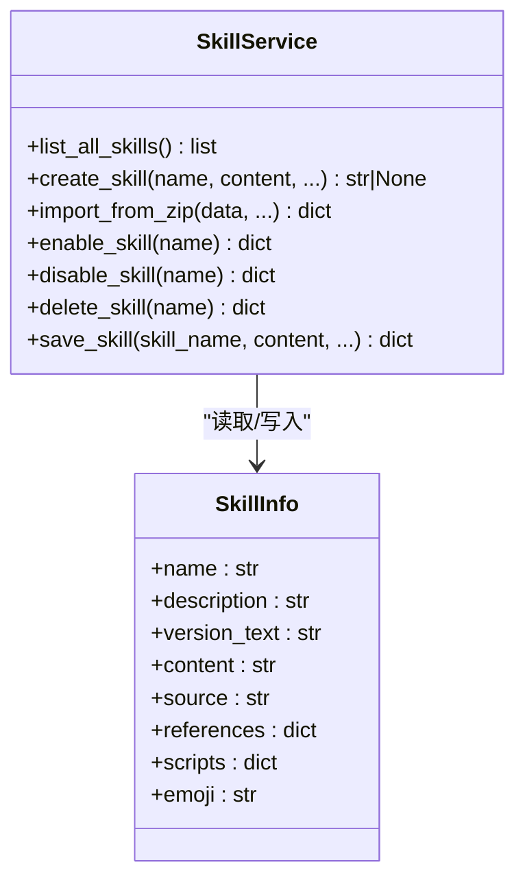
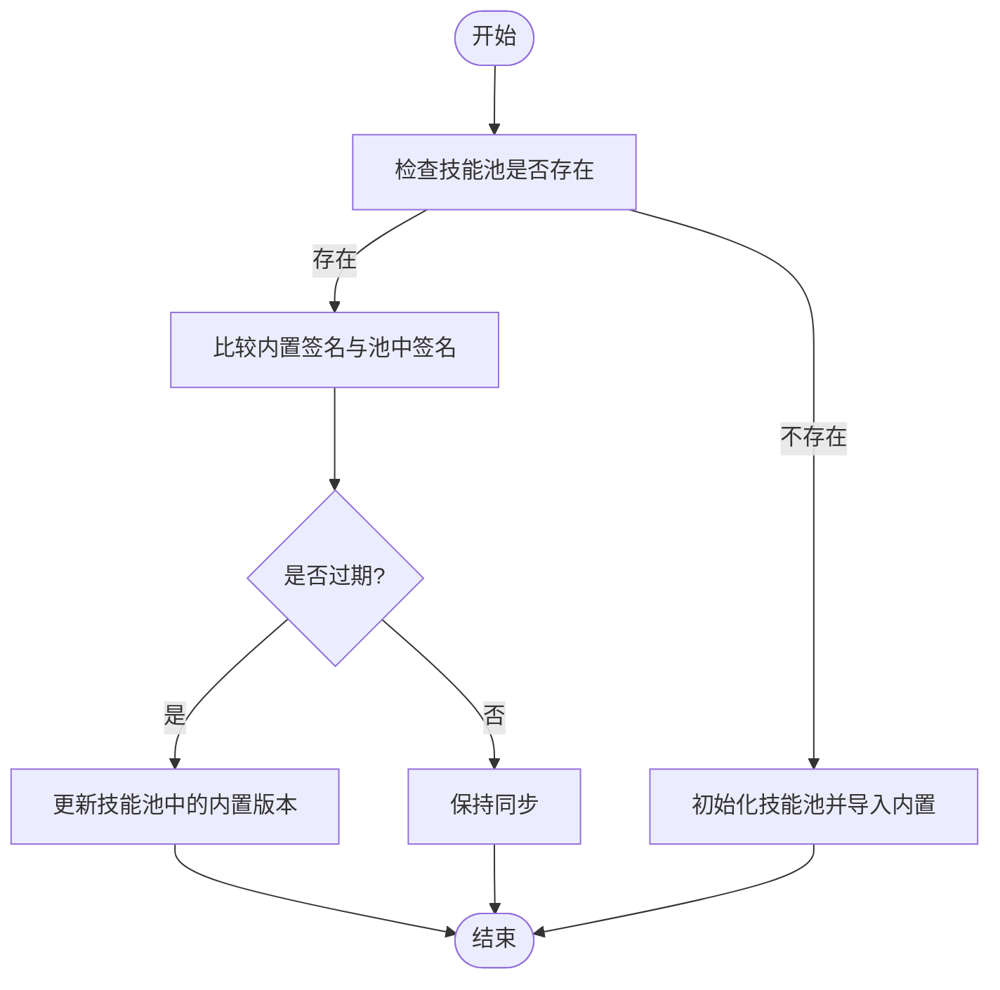
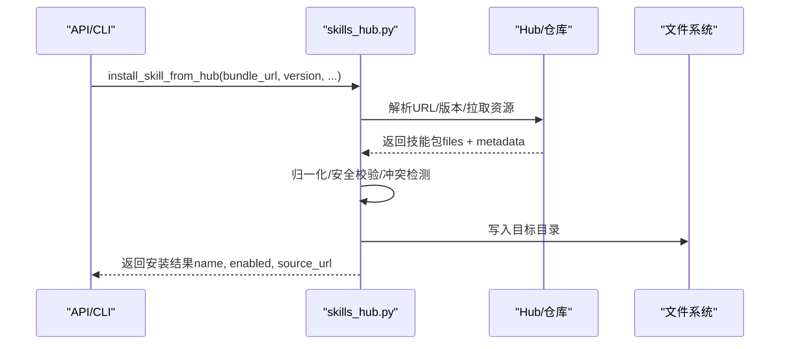
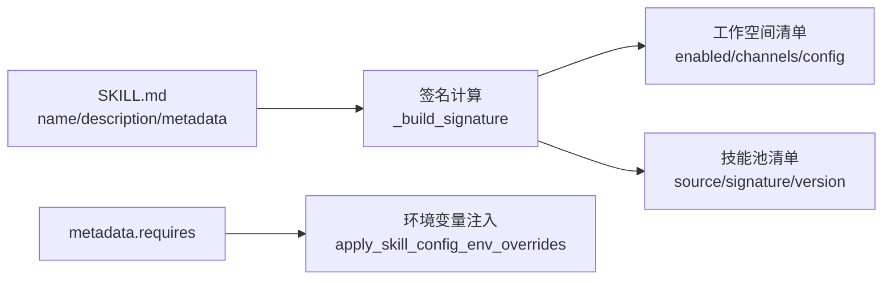

# 技能系统

<cite>
**本文引用的文件**
- [skills_hub.py](file://src/copaw/agents/skills_hub.py)
- [skills_manager.py](file://src/copaw/agents/skills_manager.py)
- [skills.py](file://src/copaw/app/routers/skills.py)
- [skill_store.py](file://src/copaw/app/routers/skill_store.py)
- [skills_cmd.py](file://src/copaw/cli/skills_cmd.py)
- [browser_cdp/SKILL.md](file://src/copaw/agents/skills/browser_cdp/SKILL.md)
- [pdf/SKILL.md](file://src/copaw/agents/skills/pdf/SKILL.md)
- [docx/SKILL.md](file://src/copaw/agents/skills/docx/SKILL.md)
- [xlsx/SKILL.md](file://src/copaw/agents/skills/xlsx/SKILL.md)
- [file_reader/SKILL.md](file://src/copaw/agents/skills/file_reader/SKILL.md)
- [skill.json](file://working/skill_pool/skill.json)
</cite>

## 目录
1. [简介](#简介)
2. [项目结构](#项目结构)
3. [核心组件](#核心组件)
4. [架构总览](#架构总览)
5. [详细组件分析](#详细组件分析)
6. [依赖关系分析](#依赖关系分析)
7. [性能考虑](#性能考虑)
8. [故障排查指南](#故障排查指南)
9. [结论](#结论)
10. [附录](#附录)

## 简介
本文件系统性阐述 CoPaw 的技能系统，覆盖内置技能、自定义技能、技能池管理、技能依赖关系与安全扫描等。文档从架构设计、组件职责、数据流、执行流程到开发规范、注册机制、结果处理进行深入解析，并提供常用技能的使用方法与开发指南，帮助开发者高效构建与维护技能生态。

## 项目结构
技能系统围绕“工作空间技能”和“共享技能池”两条主线展开：
- 工作空间技能：每个 Agent 的工作空间包含可编辑的技能目录与技能清单，用于声明启用状态、渠道路由、配置等。
- 共享技能池：集中存放内置与导入的技能，支持版本同步、冲突检测与批量管理。
- 技能中心/商店：提供技能发现、安装、批量下载与企业技能商店能力。

图表来源
- [skills.py:62-120](file://src/copaw/app/routers/skills.py#L62-L120)
- [skill_store.py:19-47](file://src/copaw/app/routers/skill_store.py#L19-L47)
- [skills_cmd.py:21-32](file://src/copaw/cli/skills_cmd.py#L21-L32)
- [skills_manager.py:1447-1568](file://src/copaw/agents/skills_manager.py#L1447-L1568)
- [skills_hub.py:190-220](file://src/copaw/agents/skills_hub.py#L190-L220)

章节来源
- [skills.py:62-120](file://src/copaw/app/routers/skills.py#L62-L120)
- [skill_store.py:19-47](file://src/copaw/app/routers/skill_store.py#L19-L47)
- [skills_cmd.py:21-32](file://src/copaw/cli/skills_cmd.py#L21-L32)

## 核心组件
- 技能服务（SkillService）：负责工作空间内技能的创建、导入、启用/禁用、配置注入与清单更新。
- 技能池服务（SkillPoolService）：负责共享技能池的导入、同步、版本比较与批量管理。
- 技能中心（skills_hub.py）：提供从多种来源（ClawHub、GitHub、LobeHub、ModelScope 等）拉取技能包的能力，并进行安全扫描与冲突处理。
- 路由与 CLI：提供 REST API 与命令行接口，统一管理技能生命周期。
- 清单与签名：基于 SKILL.md 与内容签名实现技能元数据与一致性校验。

章节来源
- [skills_manager.py:1447-1568](file://src/copaw/agents/skills_manager.py#L1447-L1568)
- [skills_hub.py:1589-1692](file://src/copaw/agents/skills_hub.py#L1589-L1692)
- [skills.py:62-120](file://src/copaw/app/routers/skills.py#L62-L120)
- [skills_cmd.py:21-32](file://src/copaw/cli/skills_cmd.py#L21-L32)

## 架构总览
技能系统采用“工作空间 + 技能池”的双层结构，结合清单与签名确保一致性与可追溯性。技能中心作为统一入口，支持多源导入与安全扫描；应用层通过路由与 CLI 提供统一的管理界面。

图表来源
- [skills.py:533-744](file://src/copaw/app/routers/skills.py#L533-L744)
- [skills_manager.py:1504-1568](file://src/copaw/agents/skills_manager.py#L1504-L1568)
- [skills_hub.py:1589-1692](file://src/copaw/agents/skills_hub.py#L1589-L1692)

## 详细组件分析

### 技能服务（SkillService）
- 职责
  - 管理工作空间内的技能：创建、导入 ZIP、启用/禁用、渠道路由、配置持久化。
  - 读取与重建工作空间清单，继承启用状态、渠道与配置。
  - 注入技能配置到运行时环境变量，支持按需覆盖。
- 关键流程
  - 创建技能：校验 SKILL.md 前言、写入目录、安全扫描、更新清单。
  - 启用/禁用：更新清单中的 enabled 字段并触发重载。
  - 配置注入：根据 metadata.requires.env 生成环境变量，避免冲突。
- 数据模型
  - 清单项包含 enabled、channels、config、requirements、updated_at 等字段。
  - 通过签名（content hash）与时间戳保证一致性与变更追踪。

图表来源
- [skills_manager.py:1447-1568](file://src/copaw/agents/skills_manager.py#L1447-L1568)
- [skills_manager.py:64-81](file://src/copaw/agents/skills_manager.py#L64-L81)

章节来源
- [skills_manager.py:1447-1568](file://src/copaw/agents/skills_manager.py#L1447-L1568)
- [skills_manager.py:64-81](file://src/copaw/agents/skills_manager.py#L64-L81)

### 技能池服务（SkillPoolService）
- 职责
  - 将内置技能导入技能池，支持批量导入与版本同步。
  - 比较技能池与内置源的签名，识别过期与最新状态。
  - 下载技能到指定工作空间，支持覆盖策略与冲突建议。
- 关键流程
  - 导入内置：复制目录、计算签名、写入清单、保留配置与标签。
  - 同步状态：对比内置签名，标记 outdate/synced。
  - 下载到工作空间：复制技能目录，更新清单并触发重载。

图表来源
- [skills_manager.py:930-946](file://src/copaw/agents/skills_manager.py#L930-L946)
- [skills_manager.py:1180-1218](file://src/copaw/agents/skills_manager.py#L1180-L1218)

章节来源
- [skills_manager.py:930-946](file://src/copaw/agents/skills_manager.py#L930-L946)
- [skills_manager.py:1180-1218](file://src/copaw/agents/skills_manager.py#L1180-L1218)

### 技能中心（skills_hub.py）
- 职责
  - 支持从多种来源解析技能包：ClawHub、GitHub、LobeHub、ModelScope、skills.sh 等。
  - 统一归一化技能包（提取 SKILL.md、references、scripts），并进行大小与路径安全校验。
  - 提供搜索、安装、取消安装与任务状态管理。
- 关键流程
  - URL 解析：根据 URL 类型选择对应解析器（GitHub、ClawHub、ModelScope 等）。
  - 包提取：下载 ZIP 或遍历仓库树，过滤非文本文件与危险路径。
  - 安装：写入工作空间/技能池，安全扫描，冲突处理，返回安装结果。

图表来源
- [skills_hub.py:1589-1692](file://src/copaw/agents/skills_hub.py#L1589-L1692)
- [skills_hub.py:1535-1558](file://src/copaw/agents/skills_hub.py#L1535-L1558)

章节来源
- [skills_hub.py:1589-1692](file://src/copaw/agents/skills_hub.py#L1589-L1692)
- [skills_hub.py:1535-1558](file://src/copaw/agents/skills_hub.py#L1535-L1558)

### 应用层路由与 CLI
- 路由（skills.py）
  - 列出工作空间技能、刷新清单、搜索 Hub、安装 Hub 技能、上传 ZIP、创建/保存技能等。
  - 支持异步安装任务与取消。
- 路由（skill_store.py）
  - 企业技能商店：列出池中技能、安装到指定工作空间。
- CLI（skills_cmd.py）
  - 交互式配置技能：选择启用/禁用、安装池中技能、预览变更并确认。

章节来源
- [skills.py:533-744](file://src/copaw/app/routers/skills.py#L533-L744)
- [skill_store.py:32-72](file://src/copaw/app/routers/skill_store.py#L32-L72)
- [skills_cmd.py:120-211](file://src/copaw/cli/skills_cmd.py#L120-L211)

## 依赖关系分析
- 技能清单
  - 工作空间清单：记录每个技能的启用状态、渠道、配置、需求与更新时间。
  - 技能池清单：记录内置/自定义来源、签名、版本与同步状态。
- 签名与一致性
  - 基于技能目录内容（排除缓存文件）计算 SHA256 签名，用于冲突检测与同步判断。
- 依赖声明
  - metadata.requires.bins/env 声明系统依赖与环境变量需求，运行时按需注入。

图表来源
- [skills_manager.py:273-290](file://src/copaw/agents/skills_manager.py#L273-L290)
- [skills_manager.py:542-566](file://src/copaw/agents/skills_manager.py#L542-L566)
- [skills_manager.py:666-710](file://src/copaw/agents/skills_manager.py#L666-L710)

章节来源
- [skills_manager.py:273-290](file://src/copaw/agents/skills_manager.py#L273-L290)
- [skills_manager.py:542-566](file://src/copaw/agents/skills_manager.py#L542-L566)
- [skills_manager.py:666-710](file://src/copaw/agents/skills_manager.py#L666-L710)

## 性能考虑
- 并发与锁
  - 清单写入采用原子替换与文件锁，避免并发写入导致的数据损坏。
- I/O 优化
  - ZIP 解压与文件收集限制最大条目数与字节数，防止过大包导致内存压力。
- 缓存
  - GitHub API 结果与速率限制缓存，降低重复请求与限流影响。
- 扫描与校验
  - 安全扫描在导入阶段执行，失败即回滚，避免运行时风险。

章节来源
- [skills_manager.py:352-375](file://src/copaw/agents/skills_manager.py#L352-L375)
- [skills_manager.py:452-473](file://src/copaw/agents/skills_manager.py#L452-L473)
- [skills_hub.py:92-127](file://src/copaw/agents/skills_hub.py#L92-L127)

## 故障排查指南
- 安装失败
  - Hub 安装失败：检查 URL 格式、版本号、网络与速率限制；查看任务状态与错误详情。
  - 冲突：根据建议重命名或覆盖；确认目标名称唯一性。
  - 安全扫描失败：根据 422 响应中的严重级别与规则 ID 修复。
- 清单异常
  - JSON 解析错误：检查清单文件完整性，必要时重置为默认模板。
  - 内容签名不一致：确认技能目录未被外部修改；必要时重新导入。
- 运行时问题
  - 环境变量冲突：检查 metadata.requires.env 与现有环境变量，避免重复注入。
  - 依赖缺失：根据 metadata.requires.bins 检查系统依赖是否满足。

章节来源
- [skills.py:68-109](file://src/copaw/app/routers/skills.py#L68-L109)
- [skills.py:389-474](file://src/copaw/app/routers/skills.py#L389-L474)
- [skills_manager.py:337-350](file://src/copaw/agents/skills_manager.py#L337-L350)

## 结论
CoPaw 技能系统通过“工作空间 + 技能池”的双层结构、严格的清单与签名机制、统一的 Hub 导入与安全扫描，实现了可扩展、可审计、易管理的技能生态。开发者可通过标准的 SKILL.md 规范与 API/CLI 快速创建、分发与集成技能，满足文件搜索、浏览器控制、PDF 处理、文档编辑等多样化场景。

## 附录

### 常用技能使用方法
- 文件搜索与读取
  - 使用文件搜索工具定位目标文件，再用文件读取技能读取文本内容并摘要。
  - 示例参考：[file_reader/SKILL.md:1-59](file://src/copaw/agents/skills/file_reader/SKILL.md#L1-L59)
- 浏览器控制（CDP/可见）
  - CDP：适合需要共享浏览器、远程调试或暴露端口的场景，注意隐私与单实例限制。
  - 可见浏览器：适合需要真实窗口展示与演示的场景。
  - 示例参考：[browser_cdp/SKILL.md:1-182](file://src/copaw/agents/skills/browser_cdp/SKILL.md#L1-L182)
- PDF 处理
  - 文本/表格提取、合并/拆分、旋转、加水印、表单填写、OCR、加密/解密等。
  - 示例参考：[pdf/SKILL.md:1-330](file://src/copaw/agents/skills/pdf/SKILL.md#L1-L330)
- 文档编辑（Word/Excel/PowerPoint）
  - Word：创建/编辑 .docx、插入图片、表格样式、目录与页眉页脚。
  - Excel：读取/分析、公式建模、格式化、公式重算与错误检查。
  - PowerPoint：创建/编辑幻灯片、布局与备注。
  - 示例参考：
    - [docx/SKILL.md:1-488](file://src/copaw/agents/skills/docx/SKILL.md#L1-L488)
    - [xlsx/SKILL.md:1-306](file://src/copaw/agents/skills/xlsx/SKILL.md#L1-L306)
    - [pdf/SKILL.md:1-330](file://src/copaw/agents/skills/pdf/SKILL.md#L1-L330)

章节来源
- [file_reader/SKILL.md:1-59](file://src/copaw/agents/skills/file_reader/SKILL.md#L1-L59)
- [browser_cdp/SKILL.md:1-182](file://src/copaw/agents/skills/browser_cdp/SKILL.md#L1-L182)
- [pdf/SKILL.md:1-330](file://src/copaw/agents/skills/pdf/SKILL.md#L1-L330)
- [docx/SKILL.md:1-488](file://src/copaw/agents/skills/docx/SKILL.md#L1-L488)
- [xlsx/SKILL.md:1-306](file://src/copaw/agents/skills/xlsx/SKILL.md#L1-L306)

### 开发规范与最佳实践
- 规范
  - 使用 SKILL.md 前言声明 name 与 description，必要时添加 emoji 与版本信息。
  - 通过 metadata.requires 声明系统依赖（bins/env）与可选的 copaw.emoji。
  - 将脚本与引用文件放入 scripts 与 references 子目录，便于 Hub 归一化。
- 测试
  - 导入前进行安全扫描，确保无高危规则命中。
  - 使用最小权限原则，避免注入敏感环境变量。
- 部署
  - 通过 API/CLI 创建/导入技能，启用后触发 Agent 重载。
  - 企业场景使用技能商店批量安装，配合工作空间隔离。

章节来源
- [skills_manager.py:1324-1335](file://src/copaw/agents/skills_manager.py#L1324-L1335)
- [skills_manager.py:542-566](file://src/copaw/agents/skills_manager.py#L542-L566)
- [skills.py:662-696](file://src/copaw/app/routers/skills.py#L662-L696)

### 技能池与清单参考
- 技能池清单（内置技能列表与元数据）
  - 参考：[skill.json:1-370](file://working/skill_pool/skill.json#L1-L370)

章节来源
- [skill.json:1-370](file://working/skill_pool/skill.json#L1-L370)