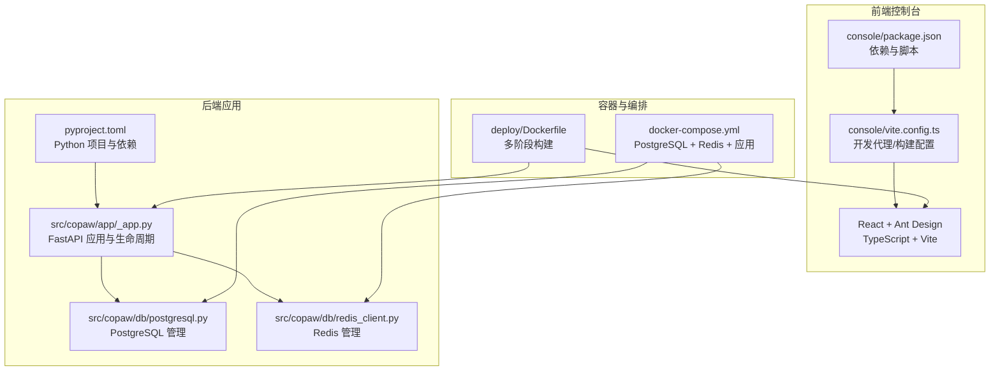
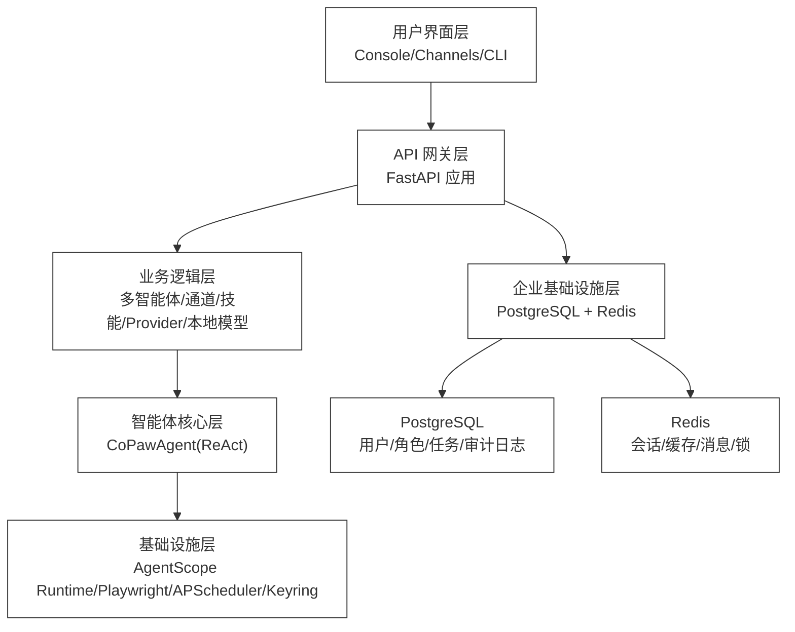
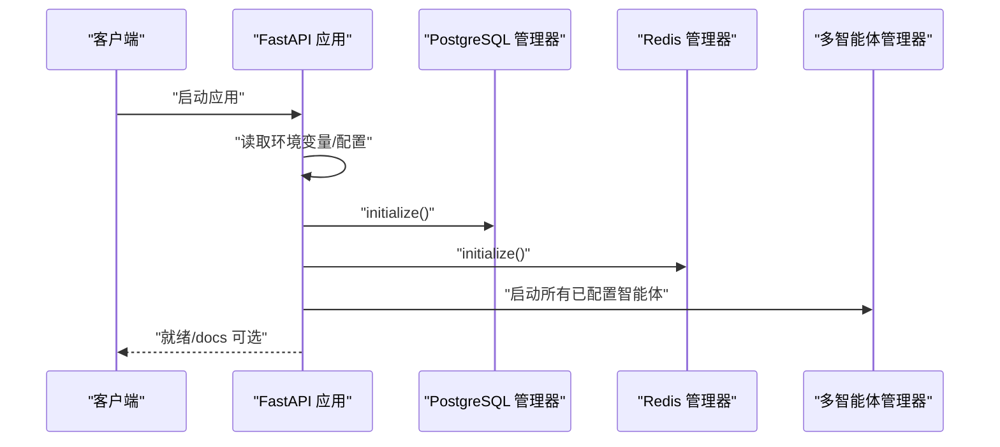
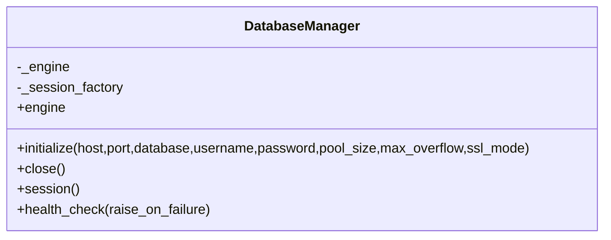
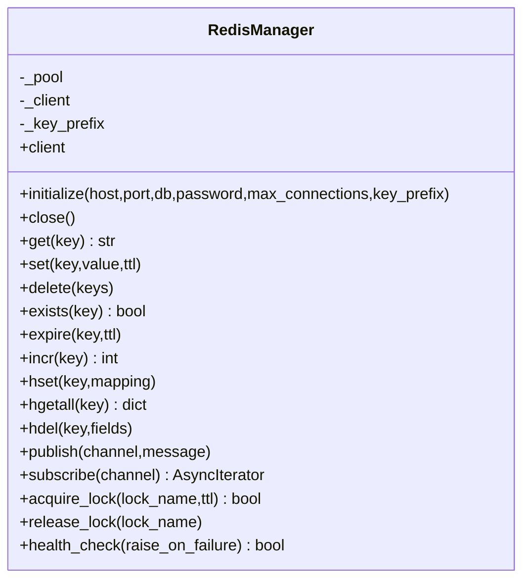
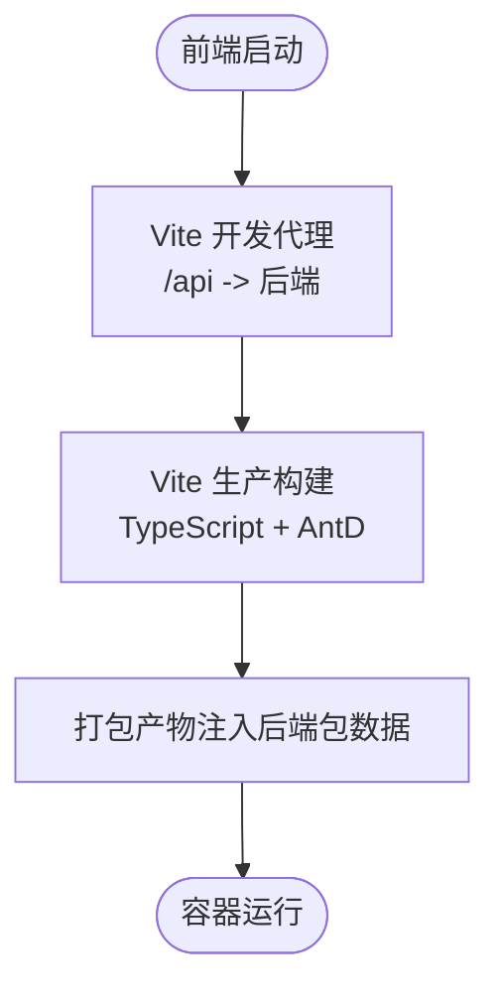
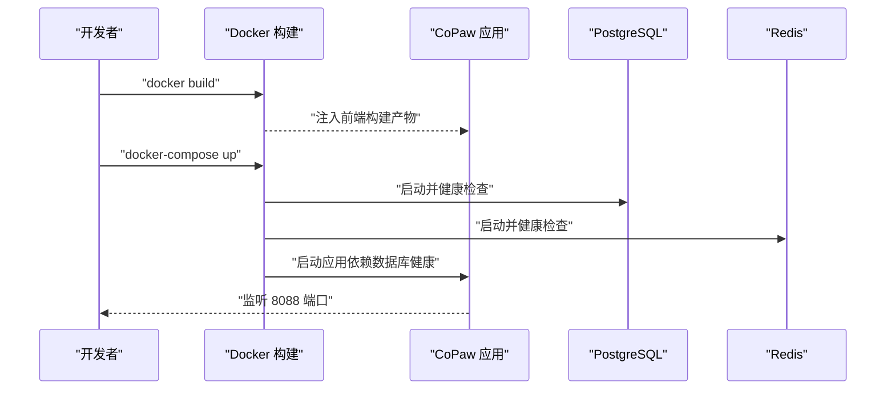
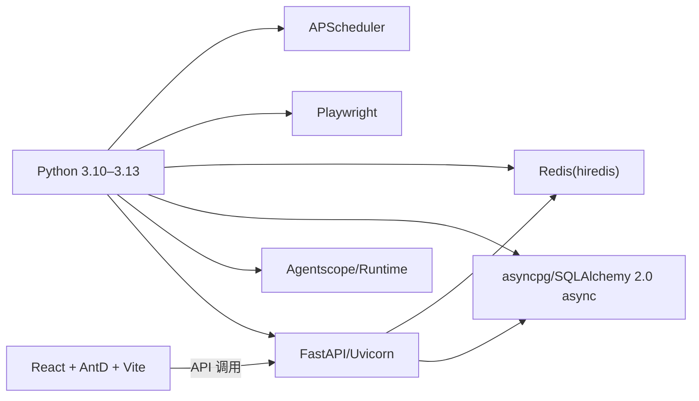

# 技术栈

<cite>
**本文引用的文件**
- [pyproject.toml](file://pyproject.toml)
- [console/package.json](file://console/package.json)
- [console/vite.config.ts](file://console/vite.config.ts)
- [deploy/Dockerfile](file://deploy/Dockerfile)
- [docker-compose.yml](file://docker-compose.yml)
- [src/copaw/db/postgresql.py](file://src/copaw/db/postgresql.py)
- [src/copaw/db/redis_client.py](file://src/copaw/db/redis_client.py)
- [src/copaw/app/_app.py](file://src/copaw/app/_app.py)
- [docs/wiki/Architecture.md](file://docs/wiki/Architecture.md)
- [docs/ENTERPRISE-RELEASE-NOTES.md](file://docs/ENTERPRISE-RELEASE-NOTES.md)
- [src/copaw/__version__.py](file://src/copaw/__version__.py)
</cite>

## 目录
1. [简介](#简介)
2. [项目结构](#项目结构)
3. [核心组件](#核心组件)
4. [架构总览](#架构总览)
5. [详细组件分析](#详细组件分析)
6. [依赖关系分析](#依赖关系分析)
7. [性能考量](#性能考量)
8. [故障排查指南](#故障排查指南)
9. [结论](#结论)
10. [附录](#附录)

## 简介
本文件系统性介绍 CoPaw 的技术栈与架构选型，覆盖后端（Python、FastAPI、asyncpg）、前端（React、TypeScript、Ant Design）、数据库（PostgreSQL、Redis）以及容器化（Docker、Compose）。文档解释各技术的职责、相互关系、版本与兼容性、性能特征，并结合项目文档梳理技术演进与未来规划。

## 项目结构
CoPaw 采用“后端 Python 包 + 前端 React 控制台 + 容器化部署”的分层组织方式：
- 后端：以 Python 包形式提供核心服务（FastAPI 应用、多智能体、通道、技能、企业功能等），通过包数据嵌入前端构建产物。
- 前端：独立的 React 控制台，使用 Vite 构建，TypeScript 类型保障，Ant Design 组件库。
- 部署：Docker 多阶段构建镜像，包含应用、Chromium、Supervisor；docker-compose 提供 PostgreSQL 与 Redis 企业基础设施编排。

图表来源
- [pyproject.toml:1-124](file://pyproject.toml#L1-L124)
- [console/package.json:1-63](file://console/package.json#L1-L63)
- [console/vite.config.ts:1-50](file://console/vite.config.ts#L1-L50)
- [deploy/Dockerfile:1-103](file://deploy/Dockerfile#L1-L103)
- [docker-compose.yml:1-92](file://docker-compose.yml#L1-L92)
- [src/copaw/app/_app.py:475-685](file://src/copaw/app/_app.py#L475-L685)
- [src/copaw/db/postgresql.py:1-187](file://src/copaw/db/postgresql.py#L1-L187)
- [src/copaw/db/redis_client.py:1-218](file://src/copaw/db/redis_client.py#L1-L218)

章节来源
- [pyproject.toml:1-124](file://pyproject.toml#L1-L124)
- [console/package.json:1-63](file://console/package.json#L1-L63)
- [console/vite.config.ts:1-50](file://console/vite.config.ts#L1-L50)
- [deploy/Dockerfile:1-103](file://deploy/Dockerfile#L1-L103)
- [docker-compose.yml:1-92](file://docker-compose.yml#L1-L92)
- [src/copaw/app/_app.py:475-685](file://src/copaw/app/_app.py#L475-L685)
- [src/copaw/db/postgresql.py:1-187](file://src/copaw/db/postgresql.py#L1-L187)
- [src/copaw/db/redis_client.py:1-218](file://src/copaw/db/redis_client.py#L1-L218)

## 核心组件
- 后端框架与运行时
  - FastAPI + Uvicorn：提供 REST 与 WebSocket 接口，支持 Prometheus 监控与多租户指标统计。
  - AgentScope Runtime：多智能体运行时与应用引擎，支持动态路由与流式任务。
- 数据库与缓存（企业版）
  - PostgreSQL + asyncpg + SQLAlchemy 2.0 async：异步连接池、健康检查、迁移驱动。
  - Redis（hiredis）：键值缓存、会话存储、发布订阅、分布式锁。
- 前端控制台
  - React 18 + TypeScript：类型安全与现代化开发体验。
  - Vite：快速开发与生产构建。
  - Ant Design：企业级 UI 组件库。
  - Zustand、i18next、React Router 等：状态管理、国际化与路由。
- 容器化与编排
  - Docker 多阶段构建：前端构建产物注入后端包数据，运行时包含 Chromium 与 Supervisor。
  - docker-compose：PostgreSQL 与 Redis 企业基础设施编排，应用容器暴露 8088 端口。

章节来源
- [src/copaw/app/_app.py:475-685](file://src/copaw/app/_app.py#L475-L685)
- [src/copaw/db/postgresql.py:1-187](file://src/copaw/db/postgresql.py#L1-L187)
- [src/copaw/db/redis_client.py:1-218](file://src/copaw/db/redis_client.py#L1-L218)
- [console/package.json:1-63](file://console/package.json#L1-L63)
- [deploy/Dockerfile:1-103](file://deploy/Dockerfile#L1-L103)
- [docker-compose.yml:1-92](file://docker-compose.yml#L1-L92)

## 架构总览
下图展示从用户界面到后端服务、再到数据库与缓存的整体交互路径，体现企业版的多租户、认证与监控能力。

图表来源
- [docs/wiki/Architecture.md:1-447](file://docs/wiki/Architecture.md#L1-L447)
- [src/copaw/app/_app.py:475-685](file://src/copaw/app/_app.py#L475-L685)
- [src/copaw/db/postgresql.py:1-187](file://src/copaw/db/postgresql.py#L1-L187)
- [src/copaw/db/redis_client.py:1-218](file://src/copaw/db/redis_client.py#L1-L218)

## 详细组件分析

### 后端：FastAPI 应用与生命周期
- 生命周期与中间件
  - 应用启动时初始化企业模式下的数据库与 Redis，注册认证中间件（单租户或企业 JWT），启用 CORS、Prometheus 监控与自定义指标。
  - 提供静态资源与 SPA 回退，确保控制台路由优先匹配。
- 动态多智能体路由
  - 通过动态 Runner 将请求按 Agent 上下文路由至对应工作区运行器，支持流式任务与超时控制。
- 企业功能
  - 企业模式下启用 PostgreSQL 与 Redis，提供多租户指标统计与插件体系初始化。

图表来源
- [src/copaw/app/_app.py:162-473](file://src/copaw/app/_app.py#L162-L473)
- [src/copaw/db/postgresql.py:61-114](file://src/copaw/db/postgresql.py#L61-L114)
- [src/copaw/db/redis_client.py:43-78](file://src/copaw/db/redis_client.py#L43-L78)

章节来源
- [src/copaw/app/_app.py:162-473](file://src/copaw/app/_app.py#L162-L473)

### 数据库：PostgreSQL（asyncpg + SQLAlchemy 2.0 async）
- 设计要点
  - 使用 asyncpg DSN 构造连接字符串，创建异步引擎与会话工厂，启用 pre_ping 与连接池参数。
  - 提供健康检查方法，启动即验证连通性，失败快速失败。
  - 通过模块级单例与上下文管理器在 FastAPI 生命周期中注入与释放。
- 企业版集成
  - 通过环境变量 COPAW_DB_* 自动配置主机、端口、数据库名、用户名与密码，支持 SSL 模式。

图表来源
- [src/copaw/db/postgresql.py:41-187](file://src/copaw/db/postgresql.py#L41-L187)

章节来源
- [src/copaw/db/postgresql.py:1-187](file://src/copaw/db/postgresql.py#L1-L187)

### 缓存：Redis（redis-py + hiredis）
- 设计要点
  - 使用 redis-py 5.x 异步客户端与 hiredis 连接池，支持命名空间前缀、键值操作、哈希、发布订阅、分布式锁与健康检查。
  - 通过模块级单例在企业模式下初始化，提供会话存储与缓存能力。
- 企业版集成
  - 通过 COPAW_REDIS_* 环境变量配置主机、端口、DB、密码与最大连接数。

图表来源
- [src/copaw/db/redis_client.py:22-218](file://src/copaw/db/redis_client.py#L22-L218)

章节来源
- [src/copaw/db/redis_client.py:1-218](file://src/copaw/db/redis_client.py#L1-L218)

### 前端：React + TypeScript + Ant Design
- 技术栈
  - React 18 + TypeScript：类型安全与现代 React 特性。
  - Ant Design 5：企业级 UI 组件库，配合主题与国际化。
  - Vite：开发与生产构建，支持代理与 CSS Modules。
  - 状态管理：Zustand；路由：React Router；国际化：i18next。
- 开发与构建
  - Vite 支持开发代理到后端 API，生产构建产物注入后端包数据，Docker 镜像直接使用。

图表来源
- [console/vite.config.ts:1-50](file://console/vite.config.ts#L1-L50)
- [console/package.json:1-63](file://console/package.json#L1-L63)

章节来源
- [console/package.json:1-63](file://console/package.json#L1-L63)
- [console/vite.config.ts:1-50](file://console/vite.config.ts#L1-L50)

### 容器化：Docker 与 Compose
- Dockerfile
  - 多阶段构建：先构建前端产物，再安装 Python 依赖与应用，注入前端 dist 到后端包数据目录。
  - 运行时包含 Chromium 与 Supervisor，支持容器内无沙箱浏览器运行与进程守护。
  - 默认暴露 8088 端口，支持 COPAW_PORT 环境变量覆盖。
- docker-compose
  - 提供 PostgreSQL 与 Redis 企业基础设施，设置健康检查、持久卷与密码策略。
  - 应用容器依赖数据库健康后再启动，挂载工作目录与密钥目录。

图表来源
- [deploy/Dockerfile:1-103](file://deploy/Dockerfile#L1-L103)
- [docker-compose.yml:1-92](file://docker-compose.yml#L1-L92)

章节来源
- [deploy/Dockerfile:1-103](file://deploy/Dockerfile#L1-L103)
- [docker-compose.yml:1-92](file://docker-compose.yml#L1-L92)

## 依赖关系分析
- 后端依赖
  - Python 3.10–3.13（requires-python），核心依赖包括 FastAPI、Uvicorn、APScheduler、Playwright、Agentscope、httpx、cryptography、keyring、PyYAML、json-repair、pillow 等。
  - 企业版可选依赖：SQLAlchemy[asyncio]、asyncpg、Alembic、Redis[hiredis]、passlib、Authlib、Prometheus 中间件等。
- 前端依赖
  - React 18、Ant Design 5、TypeScript、Vite、i18next、React Router、Zustand 等。
- 容器与编排
  - PostgreSQL 16-alpine、Redis 7-alpine，Compose 设置健康检查与持久卷。

图表来源
- [pyproject.toml:1-124](file://pyproject.toml#L1-L124)
- [console/package.json:1-63](file://console/package.json#L1-L63)
- [docker-compose.yml:1-92](file://docker-compose.yml#L1-L92)

章节来源
- [pyproject.toml:1-124](file://pyproject.toml#L1-L124)
- [console/package.json:1-63](file://console/package.json#L1-L63)
- [docker-compose.yml:1-92](file://docker-compose.yml#L1-L92)

## 性能考量
- 异步与并发
  - 后端全异步（asyncio + anyio），数据库连接池与预 ping，减少连接抖动。
  - Redis 使用 hiredis 与高并发连接池，支持发布订阅与分布式锁。
- 模型与工具
  - 全局速率限制（滑动窗口 QPM）、指数退避重试、流式响应降低首字延迟。
  - 工具异步执行与后台任务辅助（view/wait/cancel）。
- 前端
  - Vite 快速冷启与热更新；CSS Modules 作用域隔离；AntD 按需引入与主题切换。
- 监控
  - Prometheus 中间件与自定义多租户计数器，便于容量规划与问题定位。

章节来源
- [docs/wiki/Architecture.md:315-335](file://docs/wiki/Architecture.md#L315-L335)
- [src/copaw/app/_app.py:482-511](file://src/copaw/app/_app.py#L482-L511)

## 故障排查指南
- 数据库连接失败
  - 检查 COPAW_DB_HOST/PORT/NAME/USER/PASSWORD 是否正确；确认 PostgreSQL 健康检查通过；查看启动日志中的连接信息。
- Redis 连接异常
  - 检查 COPAW_REDIS_HOST/PORT/PASSWORD/DB；确认 Redis 健康检查与 ping 成功；关注最大连接数与键空间前缀。
- 应用启动卡住
  - 企业模式下需等待数据库与 Redis 健康检查通过；查看 lifespan 初始化日志。
- 前端跨域问题
  - 开发时通过 Vite 代理到后端 API；生产构建产物注入后端包数据，避免 CORS。
- 容器运行异常
  - 确认 Chromium 无沙箱参数与 Playwright 环境变量；检查卷挂载与端口映射；查看 Supervisor 日志。

章节来源
- [src/copaw/db/postgresql.py:144-156](file://src/copaw/db/postgresql.py#L144-L156)
- [src/copaw/db/redis_client.py:198-206](file://src/copaw/db/redis_client.py#L198-L206)
- [src/copaw/app/_app.py:162-209](file://src/copaw/app/_app.py#L162-L209)
- [console/vite.config.ts:34-46](file://console/vite.config.ts#L34-L46)
- [deploy/Dockerfile:71-78](file://deploy/Dockerfile#L71-L78)

## 结论
CoPaw 的技术栈围绕“异步后端 + 企业数据库 + 现代前端 + 容器化部署”展开，后端以 FastAPI + AgentScope Runtime 为核心，数据库与缓存采用 PostgreSQL + Redis 企业方案，前端以 React + AntD 提供一致的企业级体验。该组合兼顾性能、可观测性与可扩展性，适合个人到企业级场景的平滑演进。

## 附录

### 版本与兼容性
- Python：3.10–3.13（requires-python）
- FastAPI/Uvicorn：用于 HTTP 与 WebSocket 服务
- asyncpg/SQLAlchemy 2.0 async：异步数据库访问
- redis-py 5.x + hiredis：高性能异步 Redis
- React 18 + Ant Design 5 + TypeScript + Vite：前端开发与构建
- Docker 与 docker-compose：容器化与编排

章节来源
- [pyproject.toml:6](file://pyproject.toml#L6)
- [src/copaw/__version__.py:1-5](file://src/copaw/__version__.py#L1-L5)

### 技术演进与未来规划
- 企业版 v2.0：从个人助手升级为企业协作平台，引入多租户、RBAC、SSO、工作流、Dify 集成、监控与合规能力。
- 未来方向：多模态、语音/视频通话、大小模型协同、云原生集成、技能生态建设。

章节来源
- [docs/ENTERPRISE-RELEASE-NOTES.md:1-241](file://docs/ENTERPRISE-RELEASE-NOTES.md#L1-L241)
- [docs/wiki/Architecture.md:438-447](file://docs/wiki/Architecture.md#L438-L447)