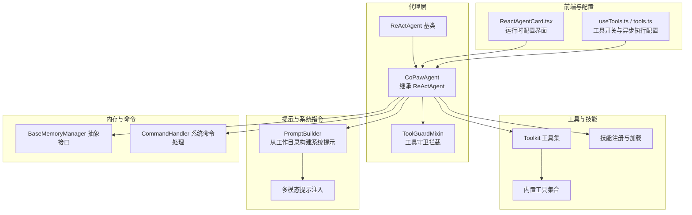
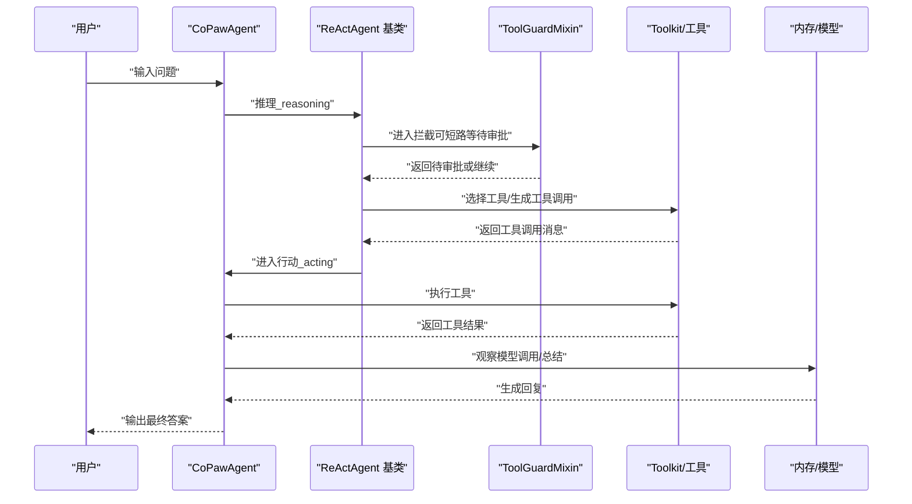
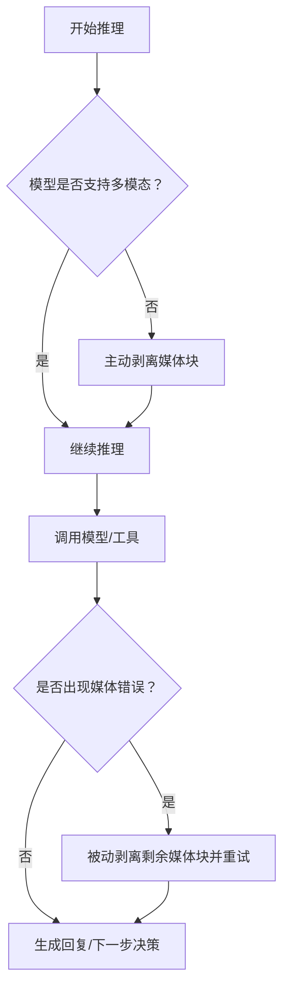
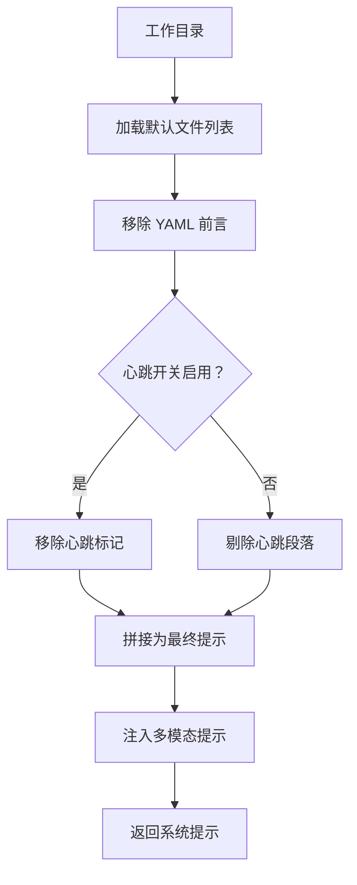
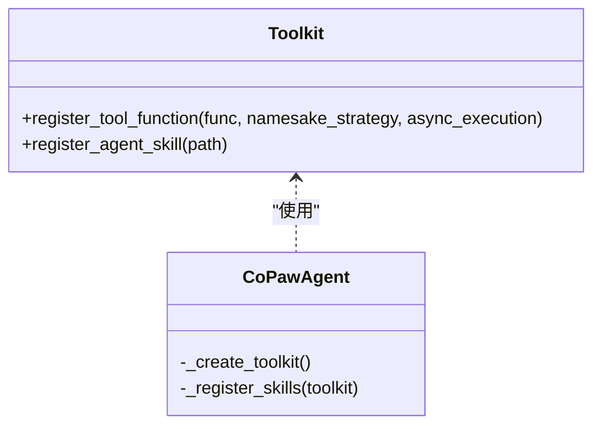
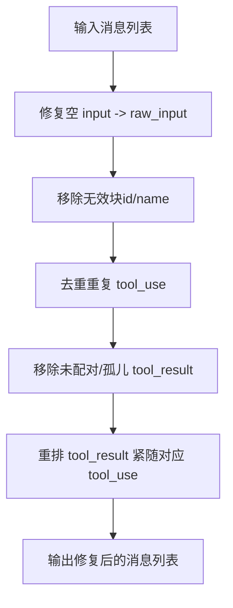
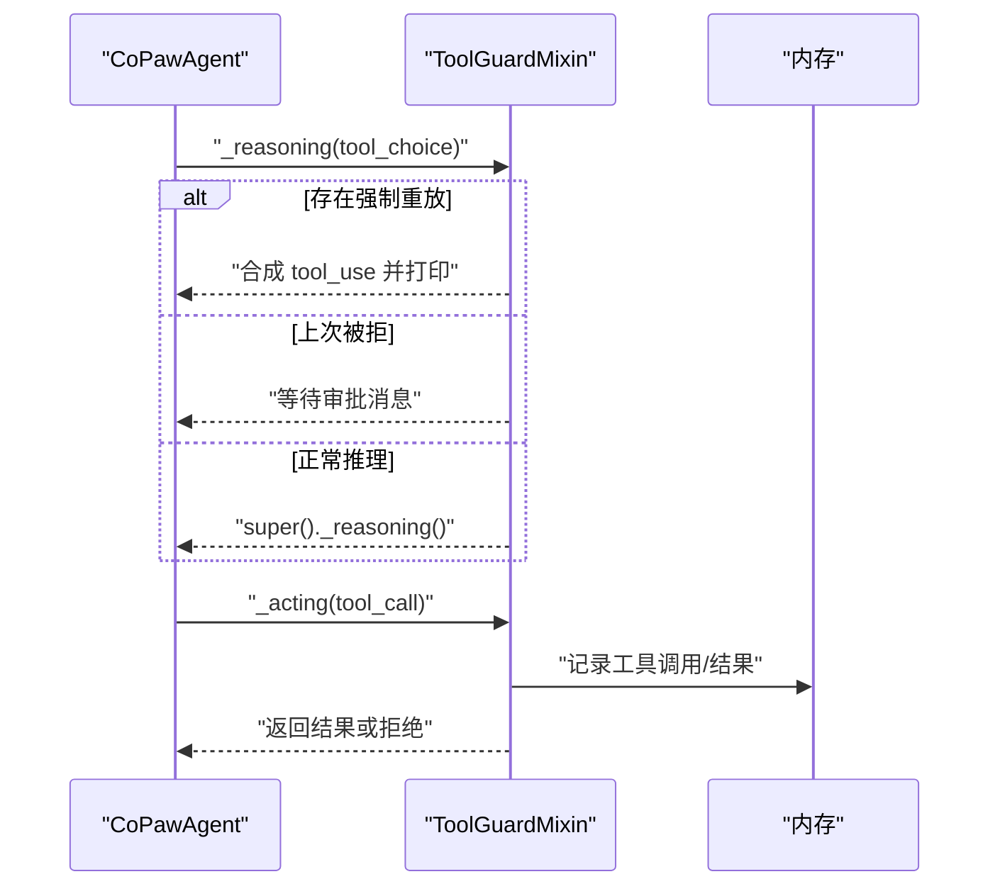
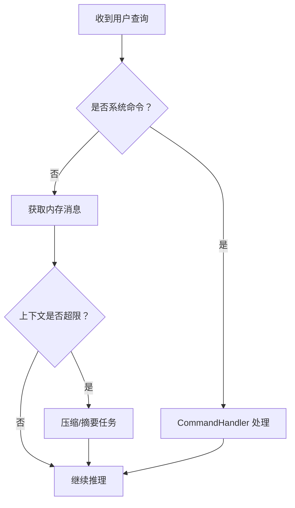
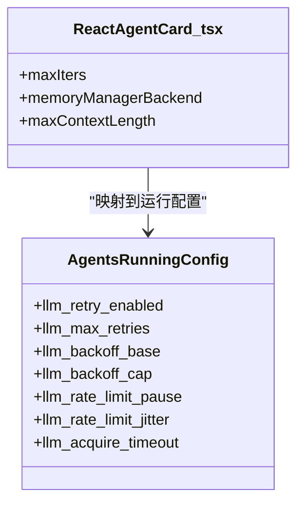
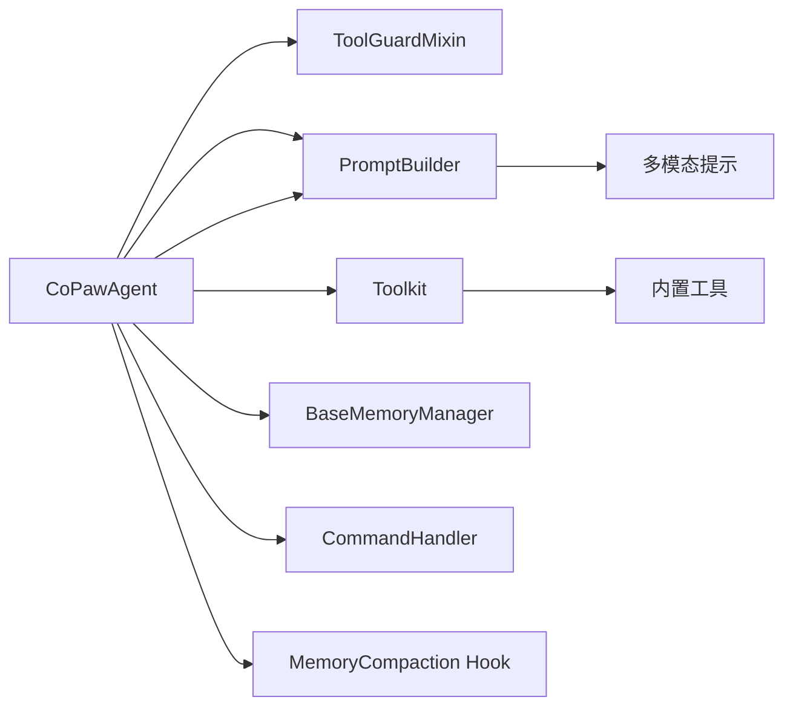

# ReAct 框架

<cite>
**本文档引用的文件**
- [react_agent.py](file://src/copaw/agents/react_agent.py)
- [prompt.py](file://src/copaw/agents/prompt.py)
- [tool_guard_mixin.py](file://src/copaw/agents/tool_guard_mixin.py)
- [command_handler.py](file://src/copaw/agents/command_handler.py)
- [base_memory_manager.py](file://src/copaw/agents/memory/base_memory_manager.py)
- [tool_message_utils.py](file://src/copaw/agents/utils/tool_message_utils.py)
- [tools/__init__.py](file://src/copaw/agents/tools/__init__.py)
- [schema.py](file://src/copaw/agents/schema.py)
- [bootstrap.py](file://src/copaw/agents/hooks/bootstrap.py)
- [memory_compaction.py](file://src/copaw/agents/hooks/memory_compaction.py)
- [runner.py](file://src/copaw/app/runner/runner.py)
- [exceptions.py](file://src/copaw/exceptions.py)
- [config.py](file://src/copaw/config/config.py)
- [ReactAgentCard.tsx](file://console/src/pages/Agent/Config/components/ReactAgentCard.tsx)
- [useTools.ts](file://console/src/pages/Agent/Tools/useTools.ts)
- [tools.ts](file://console/src/api/modules/tools.ts)
- [error.ts](file://console/src/utils/error.ts)
</cite>

## 目录
1. [简介](#简介)
2. [项目结构](#项目结构)
3. [核心组件](#核心组件)
4. [架构总览](#架构总览)
5. [详细组件分析](#详细组件分析)
6. [依赖关系分析](#依赖关系分析)
7. [性能考虑](#性能考虑)
8. [故障排查指南](#故障排查指南)
9. [结论](#结论)
10. [附录](#附录)

## 简介
本文件系统性阐述 ReAct（Reasoning and Acting）框架在 CoPaw 中的实现与应用，重点覆盖以下方面：
- 思考-行动-观察循环的完整实现路径
- 通过提示工程引导推理过程的方法
- 工具调用的解析、执行与结果处理流程
- 多模态能力感知与媒体块过滤机制
- 安全拦截与工具守卫（Tool Guard）流程
- 内存管理与压缩、摘要生成的后台任务机制
- 运行时配置项（最大迭代次数、上下文长度、重试与退避策略等）
- 错误处理与调试输出
- 实际集成与自定义建议（思维链提示、工具选择策略、迭代次数限制等）

## 项目结构
ReAct 框架的核心位于 agents 子模块，围绕 CoPawAgent 展开，其继承 ReActAgent 并组合了工具集、技能、内存管理、命令处理与安全拦截等能力。

图示来源
- [react_agent.py:69-182](file://src/copaw/agents/react_agent.py#L69-L182)
- [prompt.py:41-181](file://src/copaw/agents/prompt.py#L41-L181)
- [tool_guard_mixin.py:45-100](file://src/copaw/agents/tool_guard_mixin.py#L45-L100)
- [base_memory_manager.py:21-120](file://src/copaw/agents/memory/base_memory_manager.py#L21-L120)
- [command_handler.py:62-120](file://src/copaw/agents/command_handler.py#L62-L120)
- [ReactAgentCard.tsx:80-134](file://console/src/pages/Agent/Config/components/ReactAgentCard.tsx#L80-L134)
- [useTools.ts:1-86](file://console/src/pages/Agent/Tools/useTools.ts#L1-L86)
- [tools.ts:1-36](file://console/src/api/modules/tools.ts#L1-L36)

章节来源
- [react_agent.py:69-182](file://src/copaw/agents/react_agent.py#L69-L182)
- [prompt.py:41-181](file://src/copaw/agents/prompt.py#L41-L181)

## 核心组件
- CoPawAgent：继承 ReActAgent，负责系统提示构建、工具注册、技能加载、内存管理、命令处理与安全拦截。
- ToolGuardMixin：在推理与行动阶段插入工具调用拦截，支持“拒绝/放行/审批”流程。
- PromptBuilder：从工作目录的 Markdown 文件动态构建系统提示，支持心跳段落控制与多模态能力提示。
- Toolkit：统一管理工具函数与技能，支持异步任务管理工具的自动注册。
- BaseMemoryManager：抽象内存管理接口，支持后台摘要任务、上下文检查与压缩。
- CommandHandler：处理系统命令（如 /compact、/new、/clear 等），并与内存管理器协作。
- 工具消息校验与修复：确保 tool_use 与 tool_result 成对、有序、有效，修复流式解析缺陷。

章节来源
- [react_agent.py:183-304](file://src/copaw/agents/react_agent.py#L183-L304)
- [tool_guard_mixin.py:45-100](file://src/copaw/agents/tool_guard_mixin.py#L45-L100)
- [prompt.py:41-181](file://src/copaw/agents/prompt.py#L41-L181)
- [base_memory_manager.py:21-120](file://src/copaw/agents/memory/base_memory_manager.py#L21-L120)
- [command_handler.py:62-120](file://src/copaw/agents/command_handler.py#L62-L120)
- [tool_message_utils.py:13-357](file://src/copaw/agents/utils/tool_message_utils.py#L13-L357)

## 架构总览
ReAct 循环在 CoPaw 中的执行顺序如下：

图示来源
- [react_agent.py:665-718](file://src/copaw/agents/react_agent.py#L665-L718)
- [tool_guard_mixin.py:621-648](file://src/copaw/agents/tool_guard_mixin.py#L621-L648)

## 详细组件分析

### 推理与行动循环（ReAct Loop）
- 推理阶段：在多模态不支持时主动剥离媒体块；若模型调用失败且为媒体相关错误，则被动剥离并重试；同时在总结阶段过滤 tool_use 块以避免前端短暂渲染幻影调用。
- 行动阶段：执行工具调用，生成 tool_result，并写入内存；工具守卫可拦截敏感调用，要求人工审批或拒绝。
- 观察阶段：模型基于历史消息与工具结果生成下一步决策或最终答案。

图示来源
- [react_agent.py:665-718](file://src/copaw/agents/react_agent.py#L665-L718)
- [react_agent.py:719-775](file://src/copaw/agents/react_agent.py#L719-L775)

章节来源
- [react_agent.py:665-775](file://src/copaw/agents/react_agent.py#L665-L775)

### 提示工程与系统提示构建
- PromptBuilder 从工作目录按顺序加载 AGENTS.md、SOUL.md、PROFILE.md 等文件，移除 YAML 前言，支持心跳段落的条件保留/剔除。
- build_multimodal_hint 将当前模型的多模态能力注入系统提示，指导模型诚实告知自身能力边界。
- CoPawAgent 在初始化时构建系统提示并注入多模态提示与环境上下文。

图示来源
- [prompt.py:69-181](file://src/copaw/agents/prompt.py#L69-L181)
- [prompt.py:363-391](file://src/copaw/agents/prompt.py#L363-L391)
- [react_agent.py:342-378](file://src/copaw/agents/react_agent.py#L342-L378)

章节来源
- [prompt.py:41-181](file://src/copaw/agents/prompt.py#L41-L181)
- [prompt.py:363-391](file://src/copaw/agents/prompt.py#L363-L391)
- [react_agent.py:342-378](file://src/copaw/agents/react_agent.py#L342-L378)

### 工具与技能集成
- Toolkit 注册内置工具（文件操作、搜索、浏览器、截图、时间与时区、令牌用量统计等），并根据配置启用/禁用与异步执行。
- 当检测到至少一个工具开启异步执行时，自动注册后台任务管理工具（查看/等待/取消任务）。
- 技能通过注册表解析当前通道的有效技能集合，从工作空间目录加载并注册。

图示来源
- [react_agent.py:183-304](file://src/copaw/agents/react_agent.py#L183-L304)
- [tools/__init__.py:1-48](file://src/copaw/agents/tools/__init__.py#L1-L48)

章节来源
- [react_agent.py:183-304](file://src/copaw/agents/react_agent.py#L183-L304)
- [tools/__init__.py:1-48](file://src/copaw/agents/tools/__init__.py#L1-L48)

### 工具消息校验与修复
- 校验 tool_use 与 tool_result 是否成对、有序，去除无效/重复/未配对的消息块。
- 修复流式解析导致的空 input 但 raw_input 存在的情况，从 raw_input 解析参数填充 input。
- 文本内容截断策略，保留首尾并标注中间被截断字数。

图示来源
- [tool_message_utils.py:13-357](file://src/copaw/agents/utils/tool_message_utils.py#L13-L357)

章节来源
- [tool_message_utils.py:13-357](file://src/copaw/agents/utils/tool_message_utils.py#L13-L357)

### 工具守卫（Tool Guard）拦截
- 在推理阶段短路，当存在强制重放队列或被拒绝的上次结果时，发出等待审批消息或合成工具调用消息。
- 支持“拒绝”场景：构造 tool_result 返回“已拒绝”，并标记记忆。
- 保持与父类 ReActAgent 的交互，确保拦截逻辑不破坏主循环。

图示来源
- [tool_guard_mixin.py:621-648](file://src/copaw/agents/tool_guard_mixin.py#L621-L648)
- [tool_guard_mixin.py:597-616](file://src/copaw/agents/tool_guard_mixin.py#L597-L616)

章节来源
- [tool_guard_mixin.py:621-648](file://src/copaw/agents/tool_guard_mixin.py#L621-L648)
- [tool_guard_mixin.py:597-616](file://src/copaw/agents/tool_guard_mixin.py#L597-L616)

### 内存管理与命令处理
- BaseMemoryManager 定义内存管理抽象，支持后台摘要任务、上下文检查与压缩、语义检索与 in-memory 内存对象获取。
- CommandHandler 处理系统命令：/compact（压缩）、/new（新建会话）、/clear（清空）、/history（查看历史）、/await_summary（等待摘要）、/message（查看指定消息）、/dump/load_history（历史导出/导入）、/long_term_memory（长程记忆）。
- 内存压缩钩子在推理前检查上下文长度，超过阈值时触发压缩与摘要任务。

图示来源
- [command_handler.py:499-530](file://src/copaw/agents/command_handler.py#L499-L530)
- [base_memory_manager.py:116-196](file://src/copaw/agents/memory/base_memory_manager.py#L116-L196)
- [memory_compaction.py:62-85](file://src/copaw/agents/hooks/memory_compaction.py#L62-L85)

章节来源
- [command_handler.py:499-530](file://src/copaw/agents/command_handler.py#L499-L530)
- [base_memory_manager.py:116-196](file://src/copaw/agents/memory/base_memory_manager.py#L116-L196)
- [memory_compaction.py:62-85](file://src/copaw/agents/hooks/memory_compaction.py#L62-L85)

### 配置与运行时参数
- 运行时关键参数（来自前端配置卡片）：
  - 最大迭代次数（max_iters）：限制 ReAct 循环次数
  - 内存管理后端（memory_manager_backend）：切换内存管理实现
  - 最大上下文长度（max_input_length）：控制历史截断与显示
- 全局 LLM 速率限制与重试策略：
  - 每分钟最大请求数（llm_rate_limit_pause/jitter/acquire_timeout）
  - LLM 重试开关与退避参数（llm_max_retries、llm_backoff_base/cap）

图示来源
- [ReactAgentCard.tsx:80-134](file://console/src/pages/Agent/Config/components/ReactAgentCard.tsx#L80-L134)
- [config.py:546-586](file://src/copaw/config/config.py#L546-L586)

章节来源
- [ReactAgentCard.tsx:80-134](file://console/src/pages/Agent/Config/components/ReactAgentCard.tsx#L80-L134)
- [config.py:546-586](file://src/copaw/config/config.py#L546-L586)

### 工具开关与异步执行配置（前端）
- 列出内置工具、切换启用状态、更新异步执行开关
- 前端乐观更新与错误回滚，保证用户体验一致性

章节来源
- [useTools.ts:1-86](file://console/src/pages/Agent/Tools/useTools.ts#L1-L86)
- [tools.ts:1-36](file://console/src/api/modules/tools.ts#L1-L36)

## 依赖关系分析
- 组件耦合与内聚
  - CoPawAgent 对 ReActAgent 的扩展通过 Mixin（ToolGuardMixin）增强安全性，同时保持与基类的强内聚。
  - PromptBuilder 与多模态能力检测解耦于模型实现细节，便于跨提供商适配。
  - Toolkit 与工具函数解耦，通过 namesake_strategy 控制命名冲突策略。
- 外部依赖与集成点
  - MCP 客户端注册与恢复机制，支持 HTTP/STDIO 两类传输，具备重连与重建能力。
  - 前端通过 API 模块与后端交互，实现工具与安全规则的可视化配置。

图示来源
- [react_agent.py:69-182](file://src/copaw/agents/react_agent.py#L69-L182)
- [prompt.py:363-391](file://src/copaw/agents/prompt.py#L363-L391)
- [base_memory_manager.py:21-120](file://src/copaw/agents/memory/base_memory_manager.py#L21-L120)
- [memory_compaction.py:62-85](file://src/copaw/agents/hooks/memory_compaction.py#L62-L85)

章节来源
- [react_agent.py:69-182](file://src/copaw/agents/react_agent.py#L69-L182)
- [prompt.py:363-391](file://src/copaw/agents/prompt.py#L363-L391)
- [base_memory_manager.py:21-120](file://src/copaw/agents/memory/base_memory_manager.py#L21-L120)
- [memory_compaction.py:62-85](file://src/copaw/agents/hooks/memory_compaction.py#L62-L85)

## 性能考虑
- 多模态媒体块预处理：在模型不支持多模态时，推理前主动剥离媒体块，减少后续失败重试成本。
- 被动回退：若模型调用仍因媒体报错，再次剥离并重试，避免永久失败。
- 内存压缩与摘要：通过后台任务异步生成摘要，降低上下文长度，提升响应速度与稳定性。
- 工具异步执行：仅在特定工具开启异步执行时注册后台任务管理工具，避免不必要的开销。
- LLM 速率限制与退避：全局速率限制与指数退避，配合抖动与获取超时，平衡吞吐与稳定性。

## 故障排查指南
- 错误捕获与转换
  - 应用层将模型异常转换为统一格式，附加调试转储路径，便于定位问题。
  - 前端解析错误详情中的 JSON 字段，提取详细信息辅助诊断。
- 常见问题与处理
  - 工具调用被拒绝：检查工具守卫规则与审批状态，确认工具名称与输入参数。
  - 媒体块导致模型调用失败：确认模型多模态能力标识，必要时调整系统提示或禁用相关工具。
  - 内存上下文过长：使用 /compact 或 /new 清理历史，或调整 max_input_length。
  - MCP 客户端中断：框架尝试重连与重建，若失败则记录警告并跳过该客户端。

章节来源
- [runner.py:544-577](file://src/copaw/app/runner/runner.py#L544-L577)
- [exceptions.py:107-136](file://src/copaw/exceptions.py#L107-L136)
- [error.ts:1-11](file://console/src/utils/error.ts#L1-L11)

## 结论
ReAct 框架在 CoPaw 中通过 CoPawAgent 将“思考-行动-观察”循环与工具调用、系统提示、内存管理、安全拦截、多模态适配等能力有机结合。借助 PromptBuilder、Toolkit、MemoryManager 与 CommandHandler，实现了高可配置、可扩展、可维护的智能体运行时。通过合理的配置与优化策略（如多模态预处理、内存压缩、速率限制与退避），可在复杂任务场景下获得稳定且高效的推理与执行体验。

## 附录

### 关键参数与调优建议
- 最大迭代次数（max_iters）
  - 建议根据任务复杂度与上下文长度设定，避免无限循环。
- 最大上下文长度（max_input_length）
  - 建议结合模型上下文窗口与历史消息长度综合评估，避免频繁截断。
- 内存管理后端（memory_manager_backend）
  - 在长对话场景优先选择支持摘要与压缩的后端。
- LLM 速率限制与重试
  - 合理设置 llm_rate_limit_pause/jitter 与 acquire_timeout，避免 429 与阻塞。
  - llm_backoff_base/cap 需满足 base ≤ cap，防止配置错误导致退避异常。

章节来源
- [ReactAgentCard.tsx:80-134](file://console/src/pages/Agent/Config/components/ReactAgentCard.tsx#L80-L134)
- [config.py:546-586](file://src/copaw/config/config.py#L546-L586)