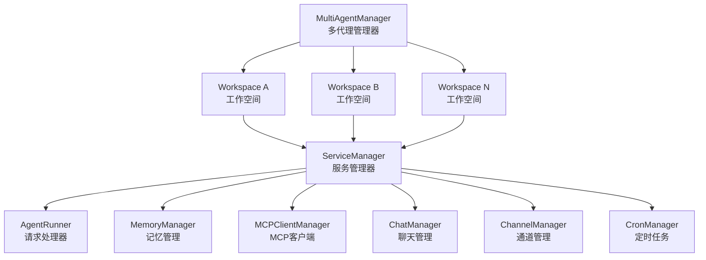
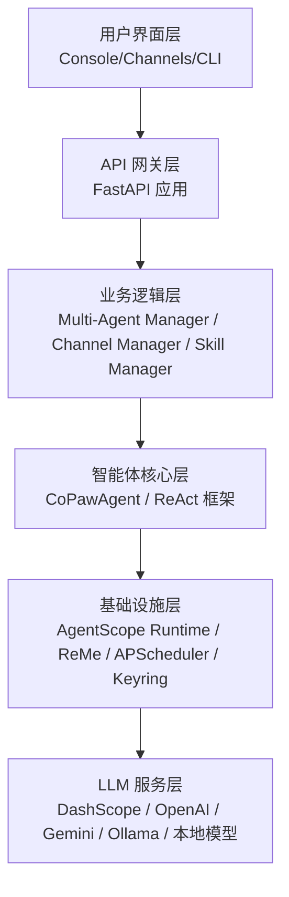
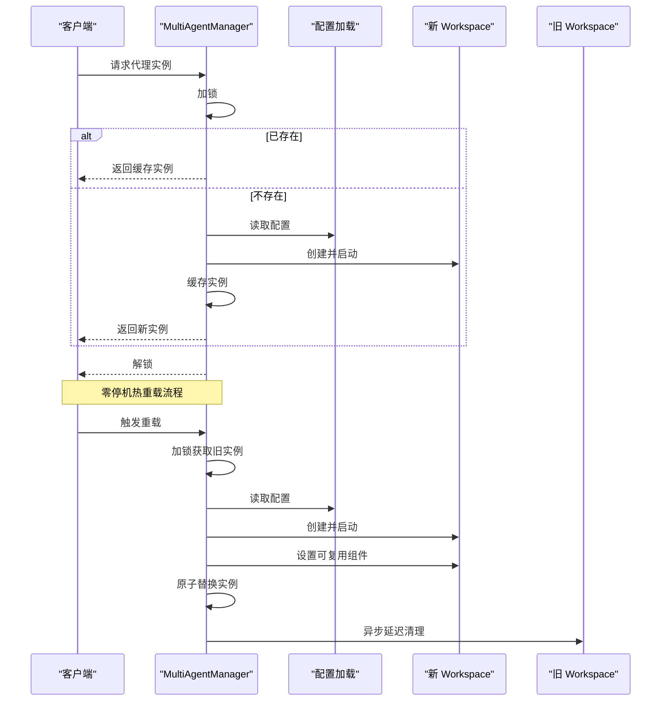
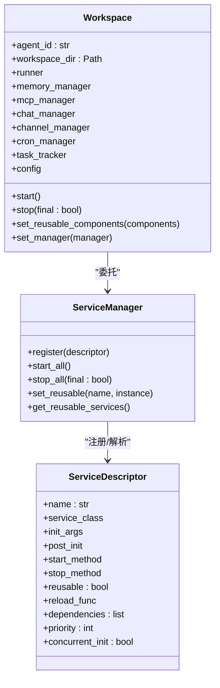
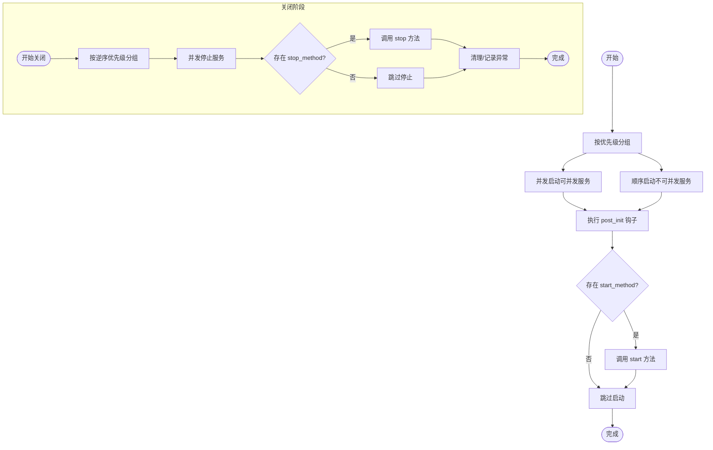
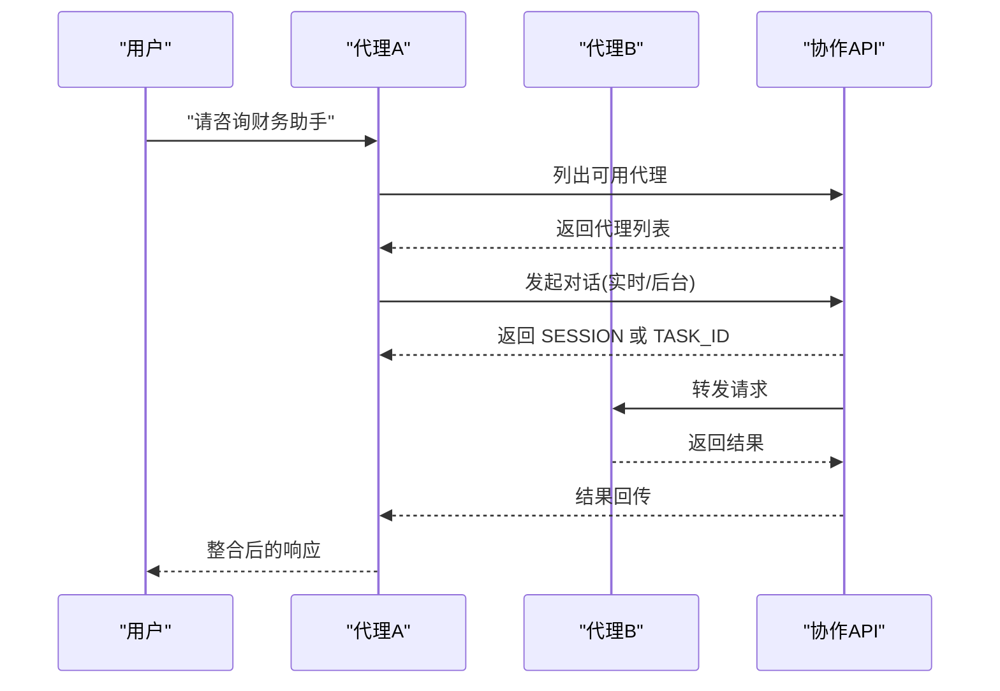
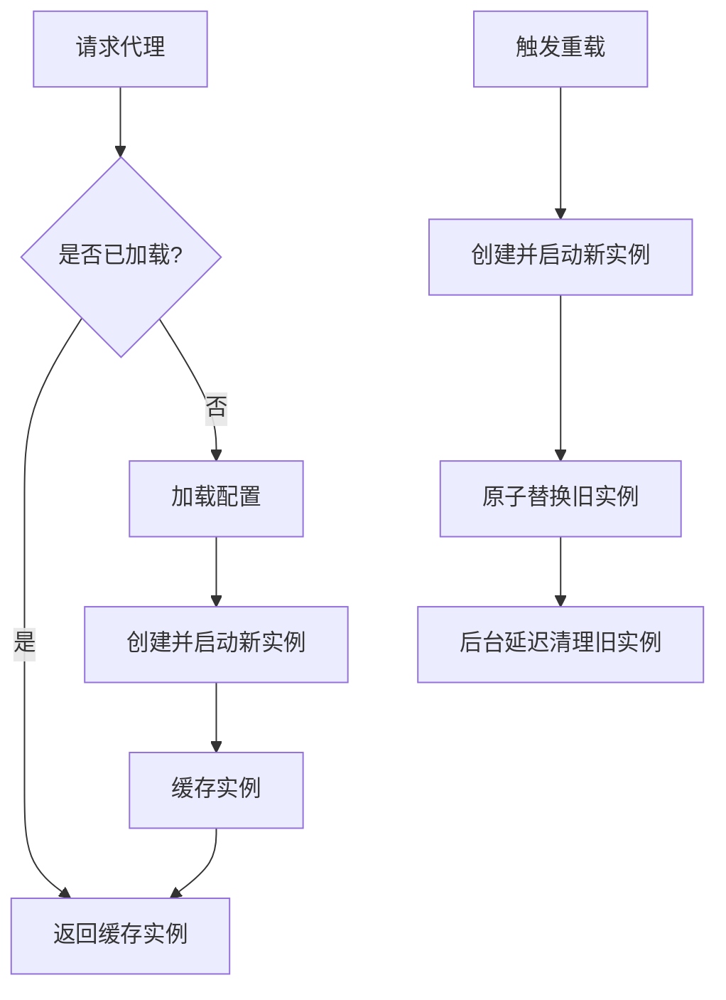
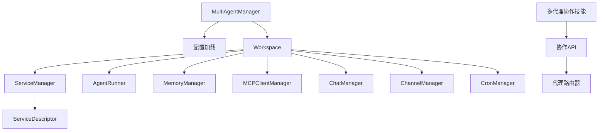

# 多代理协作

<cite>
**本文引用的文件**
- [multi_agent_manager.py](file://src/copaw/app/multi_agent_manager.py)
- [workspace.py](file://src/copaw/app/workspace/workspace.py)
- [service_manager.py](file://src/copaw/app/workspace/service_manager.py)
- [agent_context.py](file://src/copaw/app/agent_context.py)
- [SKILL.md](file://src/copaw/agents/skills/multi_agent_collaboration/README.md)
- [agents.py](file://src/copaw/app/routers/agents.py)
- [Architecture.md](file://docs/wiki/Architecture.md)
- [task_service.py](file://src/copaw/enterprise/task_service.py)
- [task.py](file://src/copaw/db/models/task.py)
</cite>

## 目录
1. [简介](#简介)
2. [项目结构](#项目结构)
3. [核心组件](#核心组件)
4. [架构总览](#架构总览)
5. [详细组件分析](#详细组件分析)
6. [依赖分析](#依赖分析)
7. [性能考虑](#性能考虑)
8. [故障排查指南](#故障排查指南)
9. [结论](#结论)
10. [附录](#附录)

## 简介
本技术文档围绕多代理协作机制展开，系统性阐述多代理架构的设计原理、代理间的通信机制、协作策略与任务分配算法，以及 MultiAgentManager 对多个独立代理实例的管理方式。文档还覆盖代理生命周期管理、状态同步、冲突解决、调度与资源分配、负载均衡、性能优化、故障恢复与监控告警等运维要点，并通过图示与路径引用帮助读者快速定位实现细节。

## 项目结构
多代理协作由“管理器-工作空间-服务管理器”三层协同构成：
- MultiAgentManager：集中管理多个 Workspace 实例，提供懒加载、零停机热重载、并发启动、清理任务跟踪等功能。
- Workspace：封装单个代理的完整运行时环境，包含 Runner、ChannelManager、MemoryManager、MCPClientManager、CronManager 等组件。
- ServiceManager：统一注册、生命周期管理与依赖处理，支持组件复用与热重载。

**图表来源**
- [multi_agent_manager.py:21-470](file://src/copaw/app/multi_agent_manager.py#L21-L470)
- [workspace.py:50-392](file://src/copaw/app/workspace/workspace.py#L50-L392)
- [service_manager.py:74-421](file://src/copaw/app/workspace/service_manager.py#L74-L421)

**章节来源**
- [multi_agent_manager.py:21-470](file://src/copaw/app/multi_agent_manager.py#L21-L470)
- [workspace.py:50-392](file://src/copaw/app/workspace/workspace.py#L50-L392)
- [service_manager.py:74-421](file://src/copaw/app/workspace/service_manager.py#L74-L421)

## 核心组件
- MultiAgentManager
  - 懒加载：首次请求时创建并启动 Workspace。
  - 生命周期：支持停止、重启、零停机热重载。
  - 并发与线程安全：使用异步锁保护共享状态，后台延迟清理任务集合。
  - 配置驱动：基于配置文件 profiles 动态发现与校验代理。
- Workspace
  - 单实例隔离：每个 Workspace 独立拥有 Runner、ChannelManager、MemoryManager、MCPClientManager、CronManager。
  - 服务编排：通过 ServiceManager 注册与启动服务，支持可复用组件。
  - 复用与热重载：在新实例启动后，将可复用组件（如 MemoryManager、ChatManager）从旧实例迁移至新实例。
- ServiceManager
  - 描述符驱动：ServiceDescriptor 定义服务类、初始化参数、启动/停止方法、依赖与优先级。
  - 启停顺序：按优先级分组并发启动，逆序关闭，确保依赖满足。
  - 可复用组件：标记 reusable 的服务可在热重载时复用，减少重建成本。

**章节来源**
- [multi_agent_manager.py:31-90](file://src/copaw/app/multi_agent_manager.py#L31-L90)
- [workspace.py:145-324](file://src/copaw/app/workspace/workspace.py#L145-L324)
- [service_manager.py:30-156](file://src/copaw/app/workspace/service_manager.py#L30-L156)

## 架构总览
多代理协作的整体架构自上而下分为用户界面层、API 网关层、业务逻辑层、智能体核心层与基础设施层。业务逻辑层中的 Multi-Agent Manager 与 Channel Manager、Skill Manager 协同，支撑跨代理协作与任务编排。

**图表来源**
- [Architecture.md:7-74](file://docs/wiki/Architecture.md#L7-L74)

**章节来源**
- [Architecture.md:7-74](file://docs/wiki/Architecture.md#L7-L74)

## 详细组件分析

### MultiAgentManager：多代理集中管理
MultiAgentManager 是多代理系统的心脏，负责：
- 懒加载与缓存：首次请求时创建 Workspace 并缓存，避免常驻开销。
- 零停机热重载：新实例完全启动后原子替换旧实例，旧实例在后台等待活动任务完成后优雅停止。
- 并发启动：根据配置筛选启用的代理，使用 gather 并发启动，提升启动效率。
- 清理任务跟踪：延迟清理任务集合，确保后台任务完成后再回收资源。
- 线程安全：全局异步锁保护并发访问，最小化锁持有时间。

**图表来源**
- [multi_agent_manager.py:38-90](file://src/copaw/app/multi_agent_manager.py#L38-L90)
- [multi_agent_manager.py:208-318](file://src/copaw/app/multi_agent_manager.py#L208-L318)

**章节来源**
- [multi_agent_manager.py:38-90](file://src/copaw/app/multi_agent_manager.py#L38-L90)
- [multi_agent_manager.py:208-318](file://src/copaw/app/multi_agent_manager.py#L208-L318)
- [multi_agent_manager.py:321-370](file://src/copaw/app/multi_agent_manager.py#L321-L370)
- [multi_agent_manager.py:407-464](file://src/copaw/app/multi_agent_manager.py#L407-L464)

### Workspace：独立代理运行时
Workspace 将代理运行时所需的组件整合为一个独立单元：
- 组件职责清晰：Runner 负责请求处理；ChannelManager 管理通信通道；MemoryManager 管理对话记忆；MCPClientManager 管理 MCP 工具客户端；CronManager 管理定时任务。
- 服务注册：通过 ServiceDescriptor 声明式注册，支持 post_init、start_method、stop_method、reusable、priority、concurrent_init 等元数据。
- 可复用组件：set_reusable_components 在新实例启动前注入旧实例的可复用组件，降低热重载成本。
- 配置惰性加载：config 属性在首次访问时才加载，避免不必要的 IO。

**图表来源**
- [workspace.py:50-133](file://src/copaw/app/workspace/workspace.py#L50-L133)
- [workspace.py:145-324](file://src/copaw/app/workspace/workspace.py#L145-L324)
- [service_manager.py:30-156](file://src/copaw/app/workspace/service_manager.py#L30-L156)

**章节来源**
- [workspace.py:50-133](file://src/copaw/app/workspace/workspace.py#L50-L133)
- [workspace.py:145-324](file://src/copaw/app/workspace/workspace.py#L145-L324)
- [service_manager.py:158-229](file://src/copaw/app/workspace/service_manager.py#L158-L229)
- [service_manager.py:330-421](file://src/copaw/app/workspace/service_manager.py#L330-L421)

### ServiceManager：服务编排与生命周期
ServiceManager 采用描述符驱动的方式统一管理服务：
- 优先级分组：按 priority 分组，同一优先级内可并发启动；逆序关闭保证依赖释放顺序正确。
- 可复用服务：reusable 标记的服务在热重载时可直接复用，reload_func 可选地在复用时执行迁移逻辑。
- 启停钩子：post_init 支持创建后初始化；start_method/stop_method 支持启动/停止方法调用。
- 错误处理：启动/停止阶段异常会被捕获并记录，避免中断整体流程。

**图表来源**
- [service_manager.py:158-229](file://src/copaw/app/workspace/service_manager.py#L158-L229)
- [service_manager.py:330-421](file://src/copaw/app/workspace/service_manager.py#L330-L421)

**章节来源**
- [service_manager.py:158-229](file://src/copaw/app/workspace/service_manager.py#L158-L229)
- [service_manager.py:330-421](file://src/copaw/app/workspace/service_manager.py#L330-L421)

### 代理协作机制与任务分配
多代理协作通过内置技能实现，核心流程如下：
- 启用协作：在 Console 或 CLI 中启用“多代理协作”技能。
- 触发方式：
  - 用户显式请求：例如“请咨询财务助手”。
  - 代理主动决策：当前代理判断需要其他代理的专业能力或上下文。
- 任务模式：
  - 实时模式：即时对话，适合简单查询。
  - 后台模式：复杂任务（数据分析、报告生成、批量处理等），提交后记录任务 ID，稍后查询状态。
- 会话复用：首次调用返回 SESSION 标识，后续续聊需携带该标识以保留上下文。
- 避免循环：不要回调消息来源代理，防止循环调用。

**图表来源**
- [SKILL.md:124-146](file://src/copaw/agents/skills/multi_agent_collaboration/README.md#L124-L146)
- [SKILL.md:293-465](file://src/copaw/agents/skills/multi_agent_collaboration/README.md#L293-L465)

**章节来源**
- [SKILL.md:12-40](file://src/copaw/agents/skills/multi_agent_collaboration/README.md#L12-L40)
- [SKILL.md:124-146](file://src/copaw/agents/skills/multi_agent_collaboration/README.md#L124-L146)
- [SKILL.md:293-465](file://src/copaw/agents/skills/multi_agent_collaboration/README.md#L293-L465)

### 代理生命周期管理与状态同步
- 获取与缓存：get_agent 懒加载，命中缓存则直接返回。
- 零停机重载：reload_agent 采用“新实例先行启动 + 原子替换 + 后台延迟清理”的策略，确保请求不中断。
- 状态同步：通过 Workspace 的 task_tracker 与 ServiceManager 的可复用组件，保障后台任务与共享资源在重载过程中的连续性。
- 停止与清理：stop_agent 与 stop_all 提供有序停止与清理，cancel_all_cleanup_tasks 在应用关闭前确保延迟任务被取消或完成。

**图表来源**
- [multi_agent_manager.py:38-90](file://src/copaw/app/multi_agent_manager.py#L38-L90)
- [multi_agent_manager.py:208-318](file://src/copaw/app/multi_agent_manager.py#L208-L318)

**章节来源**
- [multi_agent_manager.py:38-90](file://src/copaw/app/multi_agent_manager.py#L38-L90)
- [multi_agent_manager.py:208-318](file://src/copaw/app/multi_agent_manager.py#L208-L318)
- [multi_agent_manager.py:321-370](file://src/copaw/app/multi_agent_manager.py#L321-L370)

### 冲突解决与并发控制
- 代理间冲突：通过 SESSION 标识避免重复调用同一代理；技能规则禁止回调来源代理。
- 并发冲突：MultiAgentManager 使用异步锁保护共享状态，最小化锁持有时间；ServiceManager 的优先级与并发策略避免依赖死锁。
- 后台任务冲突：TaskTracker 与延迟清理任务集合确保旧实例在后台任务完成后优雅停止，避免资源泄漏。

**章节来源**
- [multi_agent_manager.py:91-187](file://src/copaw/app/multi_agent_manager.py#L91-L187)
- [service_manager.py:158-229](file://src/copaw/app/workspace/service_manager.py#L158-L229)

### 调度算法、资源分配与负载均衡
- 启动调度：start_all_configured_agents 并发启动启用的代理，过滤 disabled 代理，减少资源占用。
- 资源分配：ServiceDescriptor 的 priority 与 concurrent_init 控制组件启动顺序与并发度；可复用组件减少重复初始化。
- 负载均衡：多代理实例独立运行，请求通过 API 网关路由至目标代理；代理间协作通过 SESSION/TASK_ID 保持上下文一致性。

**章节来源**
- [multi_agent_manager.py:407-464](file://src/copaw/app/multi_agent_manager.py#L407-L464)
- [workspace.py:145-324](file://src/copaw/app/workspace/workspace.py#L145-L324)
- [service_manager.py:158-229](file://src/copaw/app/workspace/service_manager.py#L158-L229)

## 依赖分析
- MultiAgentManager 依赖配置加载与 Workspace；Workspace 依赖 ServiceManager 与各类运行时组件；ServiceManager 依赖 ServiceDescriptor 描述符。
- 协作技能依赖代理列表查询与聊天接口；API 路由器提供代理配置与排序接口。

**图表来源**
- [multi_agent_manager.py:15-18](file://src/copaw/app/multi_agent_manager.py#L15-L18)
- [workspace.py:18-31](file://src/copaw/app/workspace/workspace.py#L18-L31)
- [service_manager.py:30-72](file://src/copaw/app/workspace/service_manager.py#L30-L72)
- [agents.py:208-249](file://src/copaw/app/routers/agents.py#L208-L249)

**章节来源**
- [multi_agent_manager.py:15-18](file://src/copaw/app/multi_agent_manager.py#L15-L18)
- [workspace.py:18-31](file://src/copaw/app/workspace/workspace.py#L18-L31)
- [service_manager.py:30-72](file://src/copaw/app/workspace/service_manager.py#L30-L72)
- [agents.py:208-249](file://src/copaw/app/routers/agents.py#L208-L249)

## 性能考虑
- 启动性能：并发启动启用的代理，减少冷启动时间；可复用组件避免重复初始化。
- 运行时性能：ServiceManager 的优先级与并发策略优化启动顺序；MemoryManager 的压缩与摘要任务异步化降低上下文膨胀。
- I/O 优化：懒加载与按需启动减少磁盘与网络 I/O；后台任务模式避免阻塞主线程。
- 资源隔离：每个 Workspace 独立运行，避免相互影响；延迟清理确保资源回收及时。

[本节为通用指导，无需具体文件分析]

## 故障排查指南
- 代理未找到：检查配置文件中 agent_id 是否存在于 profiles；确认 enabled 字段。
- 启动失败：查看 Workspace.start 的异常日志；确认依赖组件（如 MemoryManager、ChatManager）初始化是否成功。
- 热重载失败：检查新实例启动是否成功；确认旧实例延迟清理任务是否正常完成。
- 协作异常：确认“多代理协作”技能已启用；检查 SESSION/TASK_ID 是否正确传递；避免循环调用。

**章节来源**
- [multi_agent_manager.py:59-90](file://src/copaw/app/multi_agent_manager.py#L59-L90)
- [workspace.py:355-362](file://src/copaw/app/workspace/workspace.py#L355-L362)
- [agent_context.py:64-106](file://src/copaw/app/agent_context.py#L64-L106)

## 结论
多代理协作通过 MultiAgentManager 的集中管理、Workspace 的独立隔离与 ServiceManager 的统一编排，实现了高可用、可扩展、可维护的多代理系统。配合“多代理协作”技能与后台任务模式，系统能够在复杂场景下保持上下文一致性与任务连续性，满足企业级应用对可靠性与性能的要求。

[本节为总结，无需具体文件分析]

## 附录
- 企业任务服务：提供任务状态机与持久化，可用于多代理协作中的后台任务追踪与治理。
- 数据模型：任务表包含状态、优先级、负责人、部门、截止日期等字段，支持企业级任务编排。

**章节来源**
- [task_service.py:16-58](file://src/copaw/enterprise/task_service.py#L16-L58)
- [task.py:39-73](file://src/copaw/db/models/task.py#L39-L73)