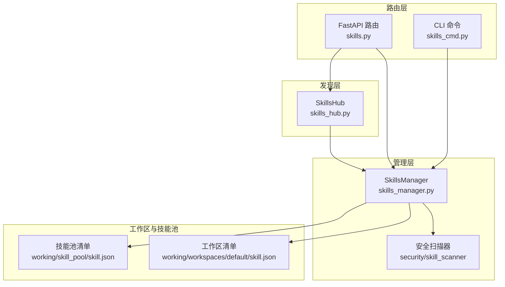
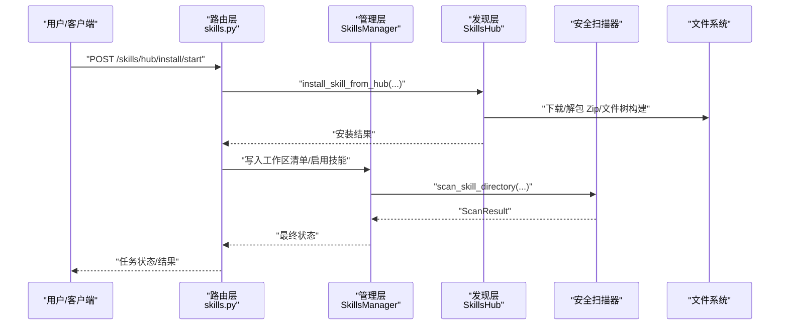
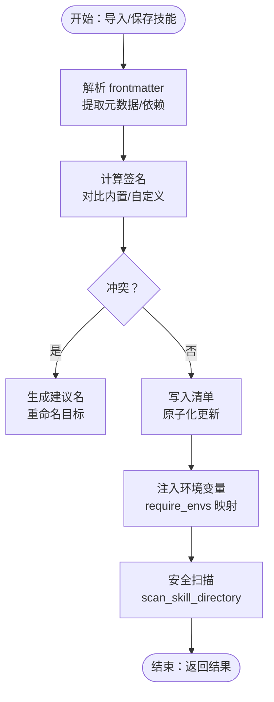
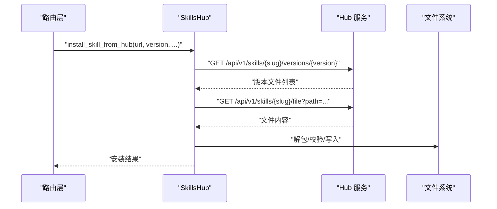
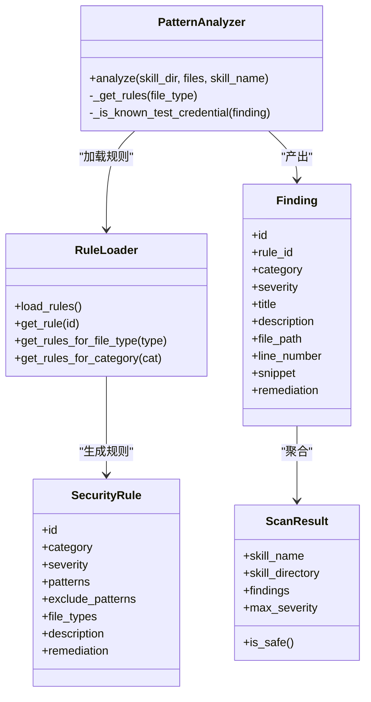
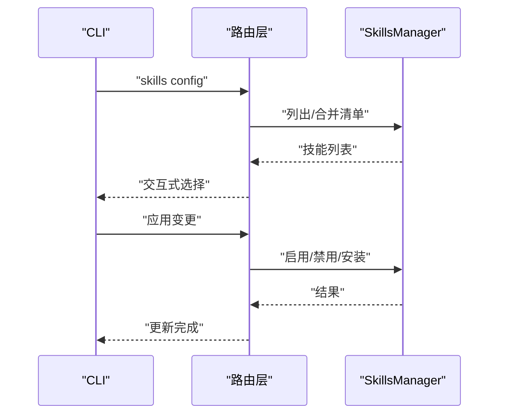
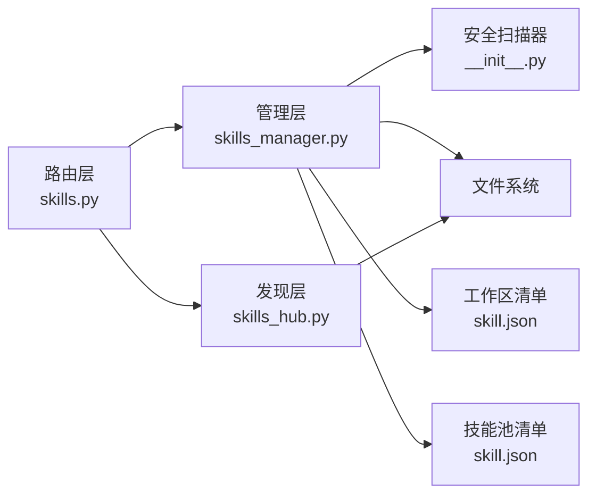

# 技能系统

<cite>
**本文引用的文件**
- [skills_hub.py](file://src/copaw/agents/skills_hub.py)
- [skills_manager.py](file://src/copaw/agents/skills_manager.py)
- [__init__.py（安全扫描器）](file://src/copaw/security/skill_scanner/__init__.py)
- [models.py（安全扫描器）](file://src/copaw/security/skill_scanner/models.py)
- [pattern_analyzer.py（安全扫描器）](file://src/copaw/security/skill_scanner/analyzers/pattern_analyzer.py)
- [skills.py（FastAPI 路由）](file://src/copaw/app/routers/skills.py)
- [skills_cmd.py（CLI 技能命令）](file://src/copaw/cli/skills_cmd.py)
- [file_handling.py（文件处理工具）](file://src/copaw/agents/utils/file_handling.py)
- [skill.json（技能池清单）](file://working/skill_pool/skill.json)
- [skill.json（工作区清单）](file://working/workspaces/default/skill.json)
- [browser_cdp/SKILL.md](file://src/copaw/agents/skills/browser_cdp/SKILL.md)
- [docx/SKILL.md](file://src/copaw/agents/skills/docx/SKILL.md)
</cite>

## 目录
1. [引言](#引言)
2. [项目结构](#项目结构)
3. [核心组件](#核心组件)
4. [架构总览](#架构总览)
5. [详细组件分析](#详细组件分析)
6. [依赖分析](#依赖分析)
7. [性能考虑](#性能考虑)
8. [故障排查指南](#故障排查指南)
9. [结论](#结论)
10. [附录](#附录)

## 引言
本技术文档围绕“技能系统”展开，系统性阐述技能的概念定义、分类体系、注册机制与执行流程；详解 SkillsManager 如何管理技能生命周期，SkillsHub 如何实现技能发现与加载；覆盖技能元数据、依赖管理、版本控制、安全扫描等能力；并提供技能开发最佳实践、测试方法、部署流程、热更新与回滚策略、权限与审计、使用统计等运维管理要点。

## 项目结构
技能系统由三层组成：
- 路由层：提供 Web API，负责技能的查询、导入、上传、下载、回滚等操作。
- 管理层：SkillsManager 负责技能清单、签名、冲突处理、环境注入、安全扫描集成等。
- 发现层：SkillsHub 负责从 Hub 搜索、拉取、解包、校验与安装。

图示来源
- [skills.py:1-1424](file://src/copaw/app/routers/skills.py#L1-L1424)
- [skills_manager.py:1-2621](file://src/copaw/agents/skills_manager.py#L1-L2621)
- [__init__.py（安全扫描器）:1-505](file://src/copaw/security/skill_scanner/__init__.py#L1-L505)
- [skills_hub.py:1-1692](file://src/copaw/agents/skills_hub.py#L1-L1692)
- [skill.json（工作区清单）:1-5](file://working/workspaces/default/skill.json#L1-L5)
- [skill.json（技能池清单）:1-370](file://working/skill_pool/skill.json#L1-L370)

章节来源
- [skills.py:1-1424](file://src/copaw/app/routers/skills.py#L1-L1424)
- [skills_manager.py:1-2621](file://src/copaw/agents/skills_manager.py#L1-L2621)
- [__init__.py（安全扫描器）:1-505](file://src/copaw/security/skill_scanner/__init__.py#L1-L505)
- [skills_hub.py:1-1692](file://src/copaw/agents/skills_hub.py#L1-L1692)
- [skill.json（工作区清单）:1-5](file://working/workspaces/default/skill.json#L1-L5)
- [skill.json（技能池清单）:1-370](file://working/skill_pool/skill.json#L1-L370)

## 核心组件
- SkillsManager（技能管理器）
  - 负责技能清单读写、签名计算、冲突建议、环境变量注入、内置技能同步、工作区与技能池的协调。
  - 关键职责：构建技能元数据、解析 frontmatter、提取版本与依赖、原子化写入清单、冲突检测与重命名建议。
- SkillsHub（技能发现与加载）
  - 负责从 Hub 搜索、下载、解包、校验与安装，支持取消、重试、超时与速率限制。
  - 关键职责：HTTP 请求封装、Zip 安全校验、文件树构建、Hub 元数据标准化、安装结果回传。
- 安全扫描器（SkillScanner）
  - 负责扫描技能目录，基于规则集进行威胁检测，支持白名单、缓存、阻断与告警。
  - 关键职责：规则加载、Finding 聚合、ScanResult 输出、阻断策略、历史记录持久化。
- 路由与 CLI
  - 路由提供 REST API，支持 Hub 安装任务、技能列表、上传、编辑、回滚等。
  - CLI 提供交互式技能配置与批量操作。

章节来源
- [skills_manager.py:64-800](file://src/copaw/agents/skills_manager.py#L64-L800)
- [skills_hub.py:57-400](file://src/copaw/agents/skills_hub.py#L57-L400)
- [__init__.py（安全扫描器）:415-505](file://src/copaw/security/skill_scanner/__init__.py#L415-L505)
- [skills.py:533-800](file://src/copaw/app/routers/skills.py#L533-L800)
- [skills_cmd.py:120-275](file://src/copaw/cli/skills_cmd.py#L120-L275)

## 架构总览
技能系统采用“路由-管理-发现-存储”的分层架构。路由层统一入口，管理层集中处理业务逻辑与安全扫描，发现层对接外部 Hub，存储层以工作区与技能池清单为核心。

图示来源
- [skills.py:582-641](file://src/copaw/app/routers/skills.py#L582-L641)
- [skills_hub.py:389-474](file://src/copaw/agents/skills_hub.py#L389-L474)
- [__init__.py（安全扫描器）:415-505](file://src/copaw/security/skill_scanner/__init__.py#L415-L505)
- [skills_manager.py:377-388](file://src/copaw/agents/skills_manager.py#L377-L388)

## 详细组件分析

### SkillsManager：技能生命周期管理
- 清单与签名
  - 读取/写入工作区与技能池清单，原子化写入，避免并发冲突。
  - 基于文件树与内容计算签名，用于冲突检测与内置技能一致性校验。
- 元数据与依赖
  - 解析 SKILL.md frontmatter，提取名称、描述、版本、emoji、依赖等。
  - 支持 metadata.requires 中的 bins/env 声明，运行时注入环境变量。
- 冲突与重命名
  - 冲突时生成带时间戳的建议名，避免覆盖。
- 环境注入
  - 将技能配置映射为环境变量，限定作用域，避免全局污染。
- 内置技能同步
  - 识别内置与自定义差异，保持用户定制化意图。

图示来源
- [skills_manager.py:206-290](file://src/copaw/agents/skills_manager.py#L206-L290)
- [skills_manager.py:542-624](file://src/copaw/agents/skills_manager.py#L542-L624)
- [__init__.py（安全扫描器）:415-505](file://src/copaw/security/skill_scanner/__init__.py#L415-L505)

章节来源
- [skills_manager.py:171-290](file://src/copaw/agents/skills_manager.py#L171-L290)
- [skills_manager.py:542-711](file://src/copaw/agents/skills_manager.py#L542-L711)
- [skills_manager.py:748-791](file://src/copaw/agents/skills_manager.py#L748-L791)

### SkillsHub：技能发现与加载
- 搜索与详情
  - 支持 Hub 搜索、详情、版本与文件下载，自动标准化为“包”结构。
- 下载与解包
  - 安全校验 Zip（大小、路径、符号链接），解压为文件树，过滤无关文件。
- 安装与取消
  - 支持取消检查、重试退避、超时控制、429/5xx 自适应重试。
- Hub 元数据标准化
  - 将 Hub 返回的 JSON 规范化为统一的“包”结构，包含 content、references、scripts 等。

图示来源
- [skills_hub.py:552-636](file://src/copaw/agents/skills_hub.py#L552-L636)
- [skills_hub.py:286-400](file://src/copaw/agents/skills_hub.py#L286-L400)

章节来源
- [skills_hub.py:286-400](file://src/copaw/agents/skills_hub.py#L286-L400)
- [skills_hub.py:552-636](file://src/copaw/agents/skills_hub.py#L552-L636)

### 安全扫描器：威胁检测与阻断
- 规则引擎
  - 基于 YAML 规则集的正则匹配，支持排除规则、文件类型过滤、多行模式。
- 扫描流程
  - 加载规则 → 遍历文件 → 匹配规则 → 生成 Finding → 聚合 ScanResult。
- 阻断策略
  - 支持 block/warn/off 模式，CRITICAL/HIGH 直接阻断，低危告警。
- 历史与缓存
  - 基于 mtime 的缓存，失败历史持久化，支持白名单与内容哈希。

图示来源
- [pattern_analyzer.py:38-230](file://src/copaw/security/skill_scanner/analyzers/pattern_analyzer.py#L38-L230)
- [models.py（安全扫描器）:16-235](file://src/copaw/security/skill_scanner/models.py#L16-L235)

章节来源
- [__init__.py（安全扫描器）:415-505](file://src/copaw/security/skill_scanner/__init__.py#L415-L505)
- [pattern_analyzer.py:236-393](file://src/copaw/security/skill_scanner/analyzers/pattern_analyzer.py#L236-L393)
- [models.py（安全扫描器）:168-235](file://src/copaw/security/skill_scanner/models.py#L168-L235)

### 路由与 CLI：技能操作入口
- 路由 API
  - 列表、刷新、搜索 Hub、Hub 安装任务（启动/状态/取消）、上传 Zip、创建/保存技能、回滚等。
- CLI
  - 交互式选择启用/禁用技能，批量应用变更，支持工作区选择。

图示来源
- [skills_cmd.py:120-275](file://src/copaw/cli/skills_cmd.py#L120-L275)
- [skills.py:533-641](file://src/copaw/app/routers/skills.py#L533-L641)

章节来源
- [skills.py:533-800](file://src/copaw/app/routers/skills.py#L533-L800)
- [skills_cmd.py:120-275](file://src/copaw/cli/skills_cmd.py#L120-L275)

### 技能元数据与依赖管理
- 元数据来源
  - SKILL.md frontmatter：name、description、metadata（含版本、emoji、requires）。
- 依赖声明
  - metadata.requires 支持 bins/env 两类，运行时注入环境变量。
- 版本控制
  - 从 frontmatter 与 metadata 中提取 version_text，配合签名与 updated_at。

章节来源
- [browser_cdp/SKILL.md:1-182](file://src/copaw/agents/skills/browser_cdp/SKILL.md#L1-L182)
- [docx/SKILL.md:1-488](file://src/copaw/agents/skills/docx/SKILL.md#L1-L488)
- [skills_manager.py:248-258](file://src/copaw/agents/skills_manager.py#L248-L258)
- [skills_manager.py:542-567](file://src/copaw/agents/skills_manager.py#L542-L567)

### 热更新、回滚与运维
- 回滚
  - 安装前对工作区技能目录做快照，失败或取消时可恢复。
- 任务取消
  - Hub 安装任务支持取消事件，清理半成品。
- 性能监控
  - 路由层提供刷新接口，便于在变更后快速同步状态。

章节来源
- [skills.py:260-310](file://src/copaw/app/routers/skills.py#L260-L310)
- [skills.py:389-474](file://src/copaw/app/routers/skills.py#L389-L474)

### 权限控制、访问审计与使用统计
- 权限控制
  - 路由层基于请求上下文获取代理工作区，限制操作范围。
- 访问审计
  - 安全扫描器记录被阻断/警告的技能与告警详情，持久化到历史文件。
- 使用统计
  - 技能清单包含 updated_at、signature 等元数据，可用于统计与追踪。

章节来源
- [skills.py:311-316](file://src/copaw/app/routers/skills.py#L311-L316)
- [__init__.py（安全扫描器）:231-303](file://src/copaw/security/skill_scanner/__init__.py#L231-L303)

## 依赖分析
- 路由层依赖管理层与发现层，管理层依赖安全扫描器与文件系统。
- 技能清单作为耦合点，贯穿工作区与技能池。

图示来源
- [skills.py:1-1424](file://src/copaw/app/routers/skills.py#L1-L1424)
- [skills_manager.py:1-2621](file://src/copaw/agents/skills_manager.py#L1-L2621)
- [__init__.py（安全扫描器）:1-505](file://src/copaw/security/skill_scanner/__init__.py#L1-L505)
- [skills_hub.py:1-1692](file://src/copaw/agents/skills_hub.py#L1-L1692)
- [skill.json（工作区清单）:1-5](file://working/workspaces/default/skill.json#L1-L5)
- [skill.json（技能池清单）:1-370](file://working/skill_pool/skill.json#L1-L370)

章节来源
- [skills.py:1-1424](file://src/copaw/app/routers/skills.py#L1-L1424)
- [skills_manager.py:1-2621](file://src/copaw/agents/skills_manager.py#L1-L2621)
- [__init__.py（安全扫描器）:1-505](file://src/copaw/security/skill_scanner/__init__.py#L1-L505)
- [skills_hub.py:1-1692](file://src/copaw/agents/skills_hub.py#L1-L1692)
- [skill.json（工作区清单）:1-5](file://working/workspaces/default/skill.json#L1-L5)
- [skill.json（技能池清单）:1-370](file://working/skill_pool/skill.json#L1-L370)

## 性能考虑
- 并发与锁
  - 清单写入采用文件锁，避免并发写入冲突。
- 缓存与去重
  - 安全扫描器基于 mtime 的缓存与去重策略，降低重复扫描成本。
- I/O 优化
  - Zip 安全校验与流式读取，限制最大字节数，防止内存压力。
- 超时与重试
  - Hub 访问支持超时、重试与指数退避，提升稳定性。

章节来源
- [skills_manager.py:317-388](file://src/copaw/agents/skills_manager.py#L317-L388)
- [__init__.py（安全扫描器）:327-380](file://src/copaw/security/skill_scanner/__init__.py#L327-L380)
- [skills_hub.py:452-474](file://src/copaw/agents/skills_hub.py#L452-L474)

## 故障排查指南
- 安全扫描阻断
  - 当扫描器返回阻断错误时，检查 findings 与最高严重级别，必要时调整规则或修复技能内容。
- Hub 安装失败
  - 关注 429/5xx 错误与速率限制，设置 GITHUB_TOKEN；检查取消事件与清理逻辑。
- 清单写入异常
  - 检查文件锁与 JSON 格式，确保原子化写入成功。
- 环境变量注入失败
  - 确认 require_envs 与配置项一致，查看日志中的告警提示。

章节来源
- [skills.py:440-474](file://src/copaw/app/routers/skills.py#L440-L474)
- [__init__.py（安全扫描器）:393-413](file://src/copaw/security/skill_scanner/__init__.py#L393-L413)
- [skills_manager.py:666-711](file://src/copaw/agents/skills_manager.py#L666-L711)

## 结论
技能系统通过清晰的分层设计实现了“发现—管理—扫描—存储”的闭环：路由层统一入口，管理层集中治理，发现层对接 Hub，安全扫描器贯穿始终。系统具备完善的冲突处理、依赖注入、版本与签名管理、热更新与回滚、安全阻断与审计能力，适合企业级技能生态的扩展与运维。

## 附录

### 技能开发最佳实践
- 使用 SKILL.md 统一元数据与依赖声明，遵循 frontmatter 规范。
- 将敏感配置放入 metadata.requires.env，并通过环境变量注入。
- 保持签名稳定，避免无关文件干扰；如需变更，更新版本号。
- 开启安全扫描，修复高危告警；必要时加入白名单。

章节来源
- [browser_cdp/SKILL.md:1-182](file://src/copaw/agents/skills/browser_cdp/SKILL.md#L1-L182)
- [docx/SKILL.md:1-488](file://src/copaw/agents/skills/docx/SKILL.md#L1-L488)
- [skills_manager.py:542-624](file://src/copaw/agents/skills_manager.py#L542-L624)
- [__init__.py（安全扫描器）:415-505](file://src/copaw/security/skill_scanner/__init__.py#L415-L505)

### 创建自定义技能与扩展现有生态
- 本地创建：通过路由或 CLI 创建/上传 Zip，启用后生效。
- Hub 分享：将技能保存至技能池，供多工作区共享。
- 内置同步：保留内置技能槽位，避免误改；自定义同名技能需重命名。

章节来源
- [skills.py:662-798](file://src/copaw/app/routers/skills.py#L662-L798)
- [skills_cmd.py:120-211](file://src/copaw/cli/skills_cmd.py#L120-L211)
- [skills_manager.py:407-446](file://src/copaw/agents/skills_manager.py#L407-L446)