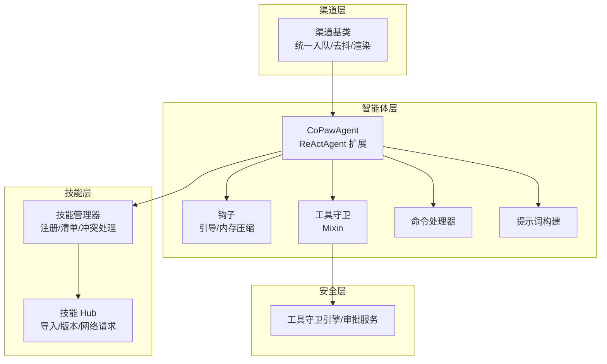
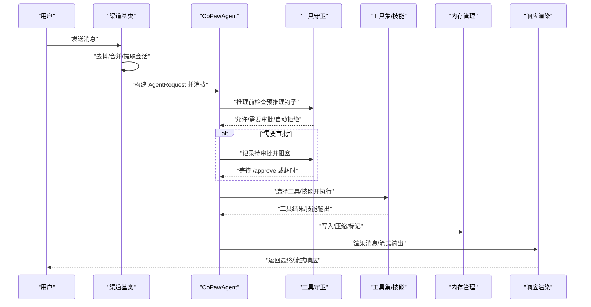
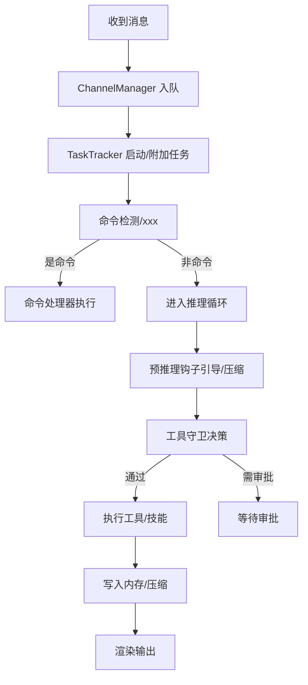
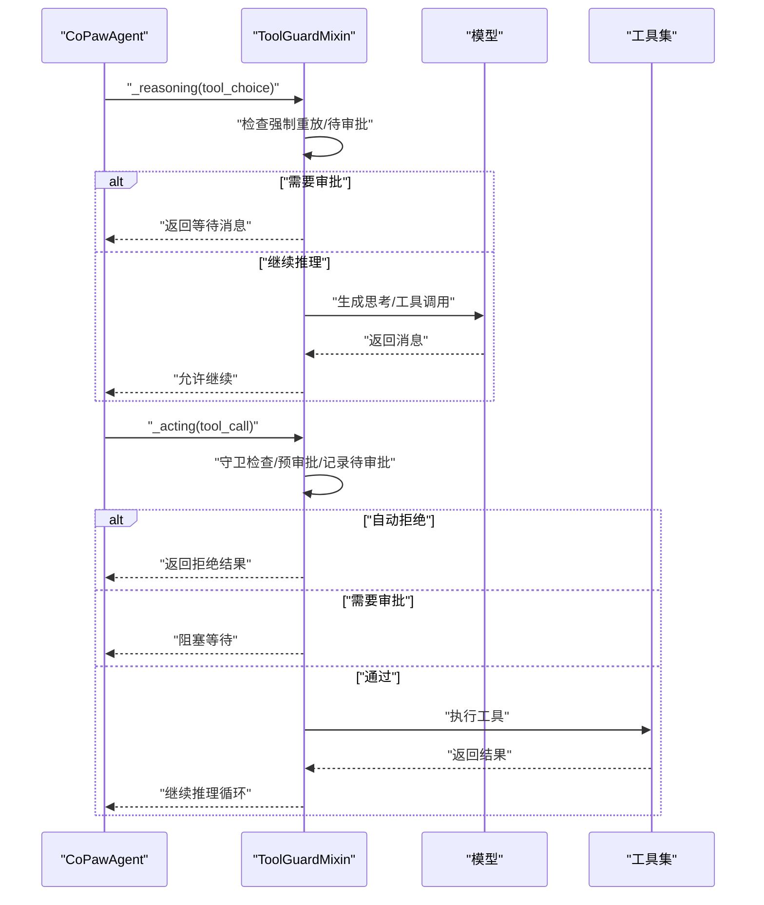
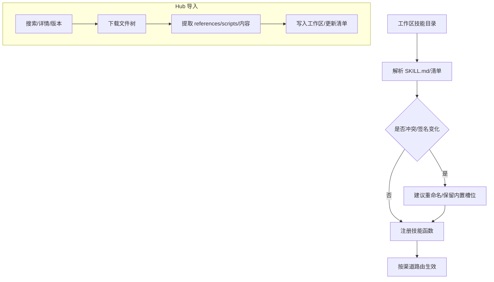
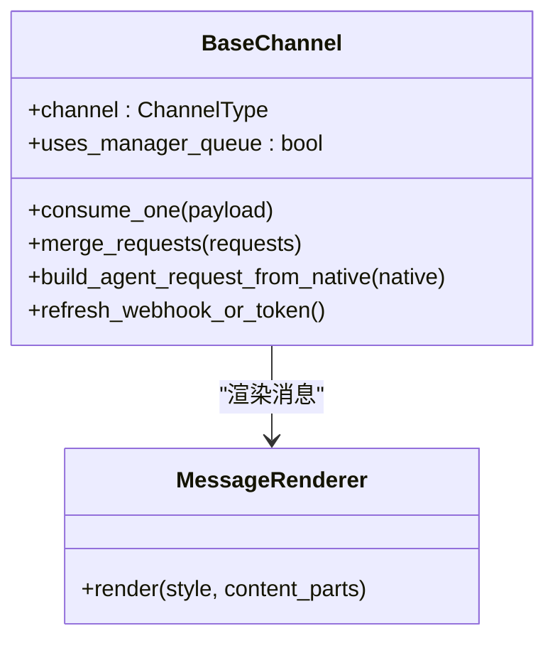
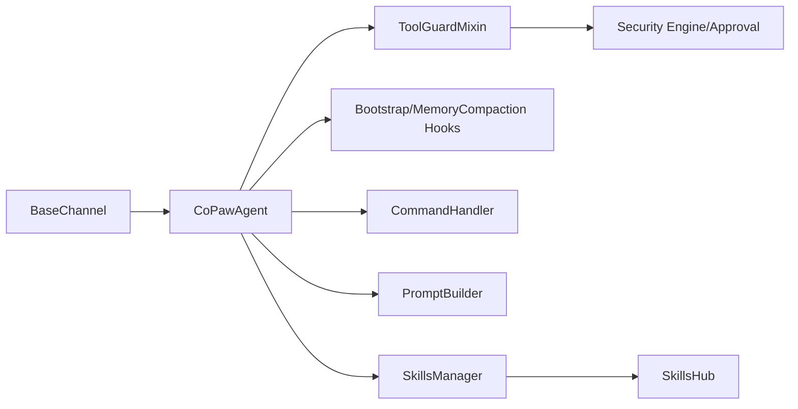

# 核心概念

<cite>
**本文引用的文件**
- [react_agent.py](file://src/copaw/agents/react_agent.py)
- [skills_manager.py](file://src/copaw/agents/skills_manager.py)
- [skills_hub.py](file://src/copaw/agents/skills_hub.py)
- [base.py](file://src/copaw/app/channels/base.py)
- [bootstrap.py](file://src/copaw/agents/hooks/bootstrap.py)
- [memory_compaction.py](file://src/copaw/agents/hooks/memory_compaction.py)
- [tool_guard_mixin.py](file://src/copaw/agents/tool_guard_mixin.py)
- [command_handler.py](file://src/copaw/agents/command_handler.py)
- [prompt.py](file://src/copaw/agents/prompt.py)
</cite>

## 目录
1. [引言](#引言)
2. [项目结构](#项目结构)
3. [核心组件](#核心组件)
4. [架构总览](#架构总览)
5. [详细组件分析](#详细组件分析)
6. [依赖分析](#依赖分析)
7. [性能考虑](#性能考虑)
8. [故障排查指南](#故障排查指南)
9. [结论](#结论)
10. [附录](#附录)

## 引言
本章节面向初学者与进阶开发者，系统化阐述 CoPaw 项目的核心概念：多代理协作机制、ReAct 框架原理、技能系统架构、渠道抽象设计。我们将结合代码级实现，解释代理如何通过“思考-行动-观察”循环与环境交互，技能如何实现可扩展的功能模块，渠道如何实现跨平台的消息路由；并通过图示与路径引用，帮助读者快速定位到具体实现位置。

## 项目结构
CoPaw 将“智能体”“技能”“渠道”“安全”“记忆”“提示词”等模块分层组织，形成清晰的职责边界：
- agents 层：智能体主类、ReAct 实现、工具守卫、命令处理、钩子、提示词构建、技能管理与 Hub。
- app/channels 层：渠道抽象基类与各平台适配器，统一消息入队、去抖、渲染与发送。
- security 层：工具守卫引擎与审批服务，保障工具调用安全。
- memory 层：内存管理与压缩、长期记忆等。
- config 与常量：全局与工作区配置、运行参数。

图表来源
- [react_agent.py:69-182](file://src/copaw/agents/react_agent.py#L69-L182)
- [skills_manager.py:131-387](file://src/copaw/agents/skills_manager.py#L131-L387)
- [skills_hub.py:190-224](file://src/copaw/agents/skills_hub.py#L190-L224)
- [base.py:70-127](file://src/copaw/app/channels/base.py#L70-L127)
- [tool_guard_mixin.py:45-70](file://src/copaw/agents/tool_guard_mixin.py#L45-L70)

章节来源
- [react_agent.py:69-182](file://src/copaw/agents/react_agent.py#L69-L182)
- [skills_manager.py:131-387](file://src/copaw/agents/skills_manager.py#L131-L387)
- [skills_hub.py:190-224](file://src/copaw/agents/skills_hub.py#L190-L224)
- [base.py:70-127](file://src/copaw/app/channels/base.py#L70-L127)
- [tool_guard_mixin.py:45-70](file://src/copaw/agents/tool_guard_mixin.py#L45-L70)

## 核心组件
- 多代理协作机制：通过工作区与会话隔离、任务跟踪与取消、统一队列管理，支持并发与串行控制。
- ReAct 框架原理：以“思考-行动-观察-反思”的循环驱动推理与工具调用，结合工具守卫与内存压缩，提升安全性与稳定性。
- 技能系统架构：基于工作区技能目录与清单，动态注册技能，支持 Hub 导入、版本与冲突处理、环境变量注入。
- 渠道抽象设计：统一消息模型与渲染策略，支持去抖合并、权限策略、提及要求、Webhook 回传等。

章节来源
- [react_agent.py:69-182](file://src/copaw/agents/react_agent.py#L69-L182)
- [skills_manager.py:131-387](file://src/copaw/agents/skills_manager.py#L131-L387)
- [base.py:70-127](file://src/copaw/app/channels/base.py#L70-L127)

## 架构总览
下图展示了从渠道消息到智能体推理再到工具执行与回复的整体流程，以及安全与记忆的关键节点。

图表来源
- [base.py:446-535](file://src/copaw/app/channels/base.py#L446-L535)
- [tool_guard_mixin.py:261-314](file://src/copaw/agents/tool_guard_mixin.py#L261-L314)
- [react_agent.py:665-717](file://src/copaw/agents/react_agent.py#L665-L717)
- [command_handler.py:499-525](file://src/copaw/agents/command_handler.py#L499-L525)

## 详细组件分析

### 多代理协作机制
- 会话与任务跟踪：渠道侧使用 TaskTracker 对同一会话进行排队与取消控制，避免并发冲突。
- 统一队列：ChannelManager 负责队列与消费者循环，渠道仅负责解析与消费。
- 控制命令：命令处理器识别以“/”开头的系统命令，提供紧凑、新建、清空、历史查看、摘要等待等功能。
- 内存管理：内存压缩钩子在推理前检查上下文长度，按阈值与保留策略进行压缩与摘要更新。

图表来源
- [base.py:374-430](file://src/copaw/app/channels/base.py#L374-L430)
- [command_handler.py:499-525](file://src/copaw/agents/command_handler.py#L499-L525)
- [memory_compaction.py:62-213](file://src/copaw/agents/hooks/memory_compaction.py#L62-L213)
- [tool_guard_mixin.py:316-370](file://src/copaw/agents/tool_guard_mixin.py#L316-L370)

章节来源
- [base.py:374-430](file://src/copaw/app/channels/base.py#L374-L430)
- [command_handler.py:499-525](file://src/copaw/agents/command_handler.py#L499-L525)
- [memory_compaction.py:62-213](file://src/copaw/agents/hooks/memory_compaction.py#L62-L213)

### ReAct 框架原理
- 推理与行动：CoPawAgent 在 ReActAgent 基础上扩展了工具注册、技能加载、媒体块过滤、总结阶段的工具调用块清理等能力。
- 安全拦截：ToolGuardMixin 在 _reasoning/_acting 中插入守卫逻辑，支持自动拒绝、预审批、审批队列与强制重放。
- 多模态感知：根据当前模型能力动态裁剪多媒体内容，避免模型不支持时报错。

图表来源
- [tool_guard_mixin.py:261-314](file://src/copaw/agents/tool_guard_mixin.py#L261-L314)
- [tool_guard_mixin.py:621-648](file://src/copaw/agents/tool_guard_mixin.py#L621-L648)
- [react_agent.py:665-717](file://src/copaw/agents/react_agent.py#L665-L717)

章节来源
- [react_agent.py:665-717](file://src/copaw/agents/react_agent.py#L665-L717)
- [tool_guard_mixin.py:261-314](file://src/copaw/agents/tool_guard_mixin.py#L261-L314)
- [tool_guard_mixin.py:621-648](file://src/copaw/agents/tool_guard_mixin.py#L621-L648)

### 技能系统架构
- 动态注册：CoPawAgent 在初始化时扫描工作区技能目录，按渠道路由规则与有效技能清单注册技能函数。
- 清单与冲突：技能管理器维护工作区与共享池清单，支持签名比对、冲突建议命名、忽略系统文件等。
- 环境注入：按技能声明的 require_envs 注入环境变量，支持 JSON 全量配置注入。
- Hub 导入：技能 Hub 支持从远程源搜索、版本选择、文件树提取、错误回退与重试策略。

图表来源
- [react_agent.py:306-341](file://src/copaw/agents/react_agent.py#L306-L341)
- [skills_manager.py:131-387](file://src/copaw/agents/skills_manager.py#L131-L387)
- [skills_manager.py:667-711](file://src/copaw/agents/skills_manager.py#L667-L711)
- [skills_hub.py:287-400](file://src/copaw/agents/skills_hub.py#L287-L400)
- [skills_hub.py:553-636](file://src/copaw/agents/skills_hub.py#L553-L636)

章节来源
- [react_agent.py:306-341](file://src/copaw/agents/react_agent.py#L306-L341)
- [skills_manager.py:131-387](file://src/copaw/agents/skills_manager.py#L131-L387)
- [skills_manager.py:667-711](file://src/copaw/agents/skills_manager.py#L667-L711)
- [skills_hub.py:287-400](file://src/copaw/agents/skills_hub.py#L287-L400)
- [skills_hub.py:553-636](file://src/copaw/agents/skills_hub.py#L553-L636)

### 渠道抽象设计
- 统一模型：渠道基类将平台原生消息转换为统一的 AgentRequest，使用内容块类型（文本/图片/音频/视频/文件/引用）表达多模态。
- 去抖与合并：对无文本内容进行缓冲合并，支持时间窗口内的同一会话聚合，减少噪声。
- 权限与提及：支持开放/白名单策略、群聊/私聊策略、@提及要求等。
- Webhook 与回传：支持 session_webhook 等元信息透传，便于外部回调。

图表来源
- [base.py:70-127](file://src/copaw/app/channels/base.py#L70-L127)
- [base.py:538-555](file://src/copaw/app/channels/base.py#L538-L555)
- [base.py:604-618](file://src/copaw/app/channels/base.py#L604-L618)

章节来源
- [base.py:70-127](file://src/copaw/app/channels/base.py#L70-L127)
- [base.py:538-555](file://src/copaw/app/channels/base.py#L538-L555)
- [base.py:604-618](file://src/copaw/app/channels/base.py#L604-L618)

### 提示词与引导
- 工作区提示词：从 AGENTS.md/SOUL.md/PROFILE.md 等文件构建系统提示词，支持心跳段落开关与回退默认提示。
- 引导钩子：首次交互时检查 BOOTSTRAP.md，向首条用户消息前置引导内容。
- 多模态提示：根据当前模型能力动态添加“仅支持文本”的提示，避免误导。

章节来源
- [prompt.py:183-263](file://src/copaw/agents/prompt.py#L183-L263)
- [prompt.py:266-315](file://src/copaw/agents/prompt.py#L266-L315)
- [prompt.py:363-391](file://src/copaw/agents/prompt.py#L363-L391)
- [bootstrap.py:42-103](file://src/copaw/agents/hooks/bootstrap.py#L42-L103)

### 命令与内存管理
- 命令处理：识别 /compact、/new、/clear、/history、/message、/dump/load、/await_summary、/long_term_memory 等系统命令，提供即时反馈与后台任务。
- 内存压缩：在推理前评估上下文长度，按阈值与保留策略压缩旧消息，生成压缩摘要并标记已压缩消息。

章节来源
- [command_handler.py:499-525](file://src/copaw/agents/command_handler.py#L499-L525)
- [memory_compaction.py:62-213](file://src/copaw/agents/hooks/memory_compaction.py#L62-L213)

## 依赖分析
- 组件耦合：CoPawAgent 通过 Mixin（工具守卫）、钩子（引导/压缩）、命令处理器与提示词构建器组合，保持高内聚低耦合。
- 外部依赖：渠道层依赖统一消息模型与渲染器；技能层依赖清单与 Hub；安全层依赖守卫引擎与审批服务。
- 循环依赖：未发现直接循环导入；各模块通过接口与方法名约定解耦。

图表来源
- [react_agent.py:69-182](file://src/copaw/agents/react_agent.py#L69-L182)
- [tool_guard_mixin.py:45-70](file://src/copaw/agents/tool_guard_mixin.py#L45-L70)
- [skills_manager.py:131-387](file://src/copaw/agents/skills_manager.py#L131-L387)
- [skills_hub.py:190-224](file://src/copaw/agents/skills_hub.py#L190-L224)
- [base.py:70-127](file://src/copaw/app/channels/base.py#L70-L127)

章节来源
- [react_agent.py:69-182](file://src/copaw/agents/react_agent.py#L69-L182)
- [tool_guard_mixin.py:45-70](file://src/copaw/agents/tool_guard_mixin.py#L45-L70)
- [skills_manager.py:131-387](file://src/copaw/agents/skills_manager.py#L131-L387)
- [skills_hub.py:190-224](file://src/copaw/agents/skills_hub.py#L190-L224)
- [base.py:70-127](file://src/copaw/app/channels/base.py#L70-L127)

## 性能考虑
- 上下文压缩：在推理前进行内存压缩与摘要更新，降低 token 使用，避免超出模型上下文限制。
- 工具异步：启用异步执行的工具会自动注册后台任务管理工具，避免阻塞主线程。
- 去抖合并：对无文本内容进行缓冲合并，减少无效事件与渲染开销。
- 多模态过滤：主动移除模型不支持的媒体块，减少失败重试与错误处理成本。

## 故障排查指南
- 工具守卫被拒绝：查看最近系统消息中的“工具已拦截/风险检测到”提示，确认是否需要 /approve 或调整守卫规则。
- 审批队列堆积：使用 /await_summary 等命令等待后台摘要任务完成；检查会话 ID 是否正确透传。
- 内存上下文溢出：使用 /compact 或 /new 重建摘要；检查 memory_compact_threshold 与保留策略。
- 渠道消息延迟：检查去抖时间与合并策略；确认 session_webhook 是否正确设置。
- 技能导入冲突：根据建议重命名或保留内置槽位；核对签名差异与忽略文件列表。

章节来源
- [tool_guard_mixin.py:447-496](file://src/copaw/agents/tool_guard_mixin.py#L447-L496)
- [command_handler.py:247-273](file://src/copaw/agents/command_handler.py#L247-L273)
- [memory_compaction.py:167-197](file://src/copaw/agents/hooks/memory_compaction.py#L167-L197)
- [base.py:653-658](file://src/copaw/app/channels/base.py#L653-L658)
- [skills_manager.py:748-768](file://src/copaw/agents/skills_manager.py#L748-L768)

## 结论
CoPaw 通过 ReAct 框架与工具守卫确保推理过程可控、安全；通过技能系统与 Hub 实现功能模块化与可扩展；通过渠道抽象实现跨平台一致体验；通过钩子与命令处理器提供强大的上下文管理与交互能力。上述设计既满足初学者快速上手，也为高级用户提供深度定制与扩展空间。

## 附录
- 关键实现路径参考
  - 推理与行动循环：[react_agent.py:665-717](file://src/copaw/agents/react_agent.py#L665-L717)
  - 工具守卫拦截：[tool_guard_mixin.py:261-314](file://src/copaw/agents/tool_guard_mixin.py#L261-L314)
  - 技能注册与清单：[react_agent.py:306-341](file://src/copaw/agents/react_agent.py#L306-L341)、[skills_manager.py:131-387](file://src/copaw/agents/skills_manager.py#L131-L387)
  - 渠道统一模型与渲染：[base.py:538-555](file://src/copaw/app/channels/base.py#L538-L555)
  - 引导与提示词构建：[bootstrap.py:42-103](file://src/copaw/agents/hooks/bootstrap.py#L42-L103)、[prompt.py:183-263](file://src/copaw/agents/prompt.py#L183-L263)
  - 命令处理与内存管理：[command_handler.py:499-525](file://src/copaw/agents/command_handler.py#L499-L525)、[memory_compaction.py:62-213](file://src/copaw/agents/hooks/memory_compaction.py#L62-L213)