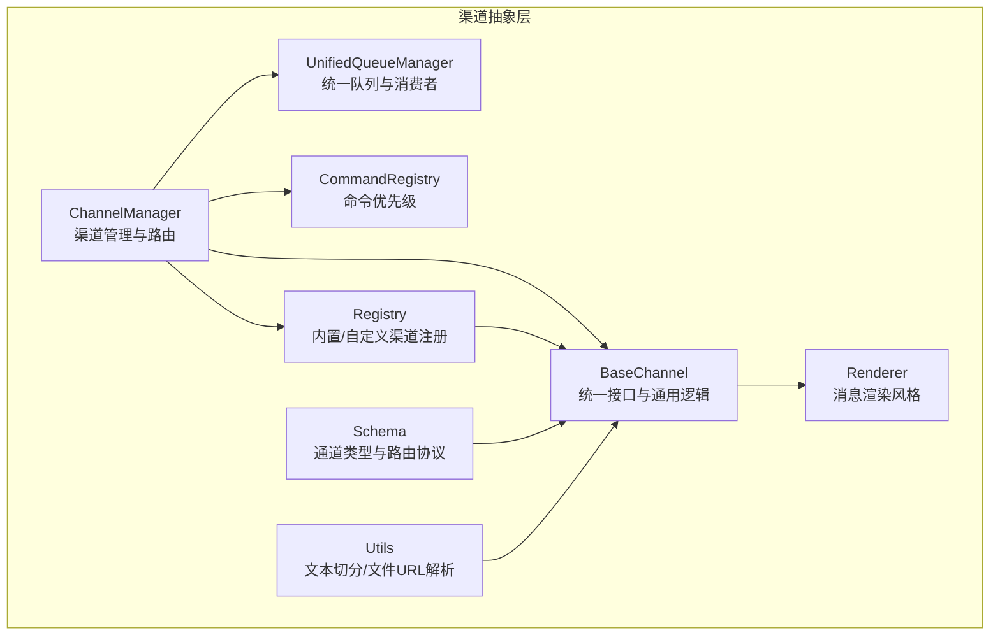
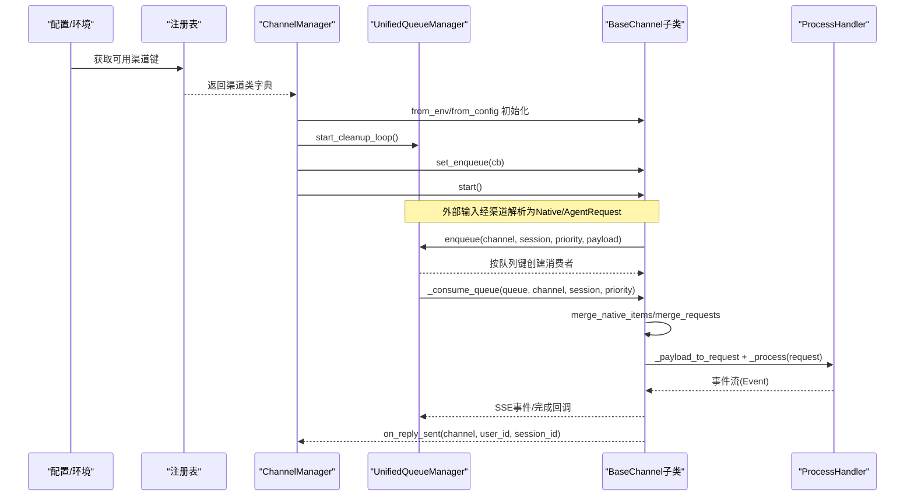
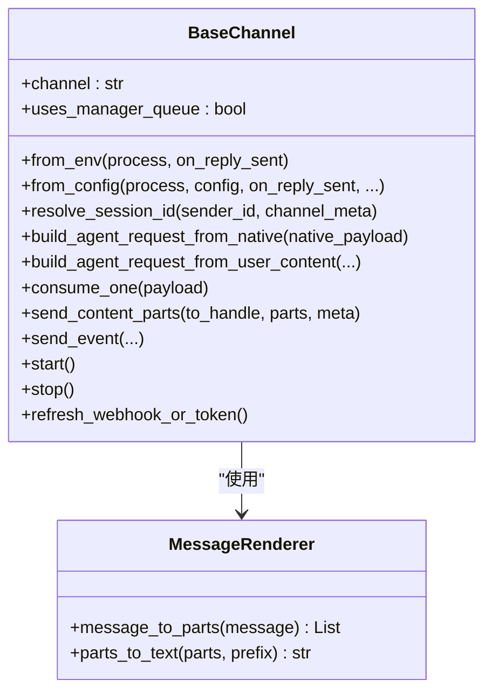
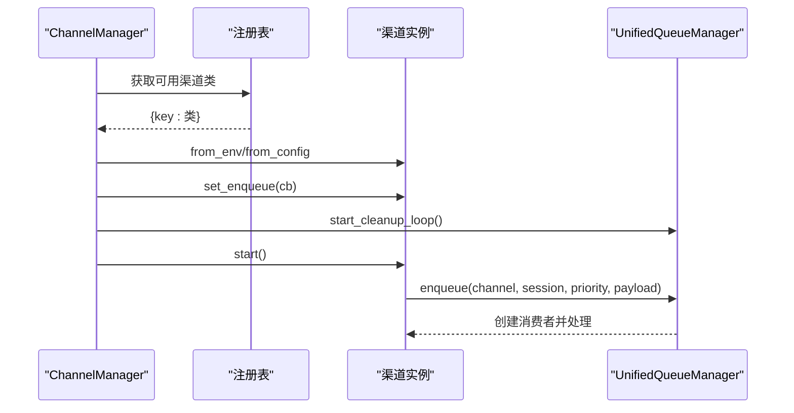
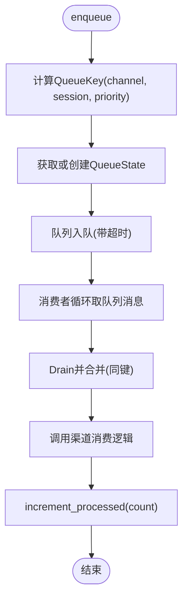
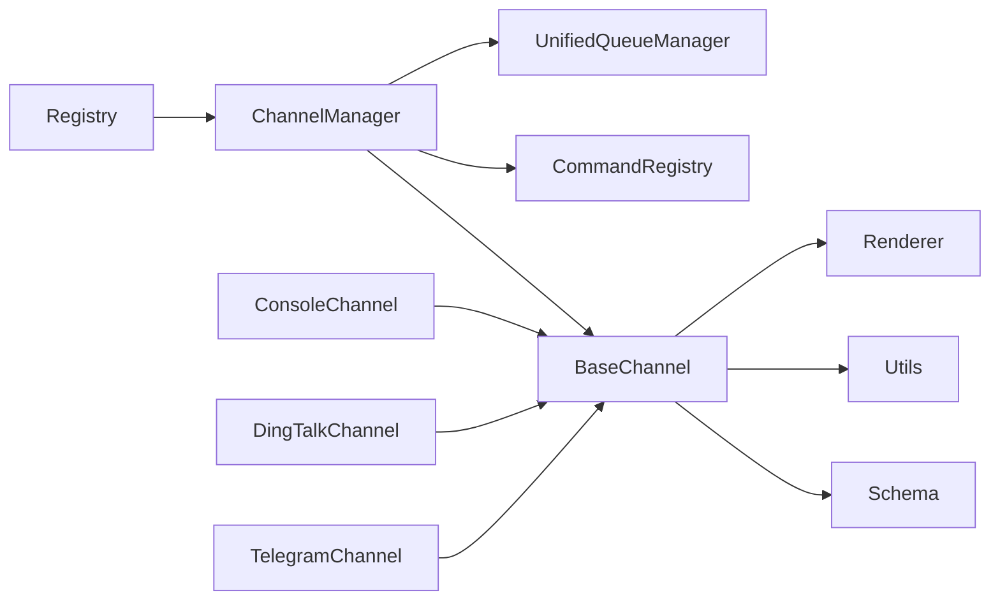

# 渠道抽象

<cite>
**本文引用的文件**
- [src/copaw/app/channels/base.py](file://src/copaw/app/channels/base.py)
- [src/copaw/app/channels/manager.py](file://src/copaw/app/channels/manager.py)
- [src/copaw/app/channels/registry.py](file://src/copaw/app/channels/registry.py)
- [src/copaw/app/channels/schema.py](file://src/copaw/app/channels/schema.py)
- [src/copaw/app/channels/unified_queue_manager.py](file://src/copaw/app/channels/unified_queue_manager.py)
- [src/copaw/app/channels/command_registry.py](file://src/copaw/app/channels/command_registry.py)
- [src/copaw/app/channels/utils.py](file://src/copaw/app/channels/utils.py)
- [src/copaw/app/channels/renderer.py](file://src/copaw/app/channels/renderer.py)
- [src/copaw/app/channels/console/channel.py](file://src/copaw/app/channels/console/channel.py)
- [src/copaw/app/channels/dingtalk/channel.py](file://src/copaw/app/channels/dingtalk/channel.py)
- [src/copaw/app/channels/telegram/channel.py](file://src/copaw/app/channels/telegram/channel.py)
</cite>

## 目录
1. [引言](#引言)
2. [项目结构](#项目结构)
3. [核心组件](#核心组件)
4. [架构总览](#架构总览)
5. [详细组件分析](#详细组件分析)
6. [依赖分析](#依赖分析)
7. [性能考虑](#性能考虑)
8. [故障排查指南](#故障排查指南)
9. [结论](#结论)
10. [附录](#附录)

## 引言
本技术文档围绕 Copaw 的“渠道抽象”体系展开，系统阐述渠道系统的设计理念、抽象层次与扩展机制；详解 BaseChannel 接口定义、ChannelManager 的动态注册与管理流程；覆盖消息路由、状态同步、错误处理、连接管理等核心能力；并提供渠道开发的完整指南（实现步骤、配置参数、调试方法）、如何集成新的即时通讯平台、处理不同渠道的特殊需求；同时解释渠道认证机制、消息格式转换、多媒体内容处理、会话管理等关键技术，并给出监控、性能优化与故障恢复的运维要点。

## 项目结构
渠道系统位于 src/copaw/app/channels 下，采用“基类 + 管理器 + 注册表 + 统一队列”的分层架构：
- 基类层：BaseChannel 定义统一的消息入栈、请求构建、事件流式输出、渲染与发送等契约
- 管理层：ChannelManager 负责渠道实例化、统一队列接入、批量合并、优先级调度与生命周期管理
- 注册层：registry 提供内置与自定义渠道的发现与注册
- 队列层：UnifiedQueueManager 实现按 (channel, session, priority) 的隔离队列与消费者
- 辅助层：renderer、utils、schema、command_registry 提供渲染风格、工具函数、消息转换协议与命令优先级

图表来源
- [src/copaw/app/channels/base.py:70-80](file://src/copaw/app/channels/base.py#L70-L80)
- [src/copaw/app/channels/manager.py:68-71](file://src/copaw/app/channels/manager.py#L68-L71)
- [src/copaw/app/channels/registry.py:190-195](file://src/copaw/app/channels/registry.py#L190-L195)
- [src/copaw/app/channels/unified_queue_manager.py:60-78](file://src/copaw/app/channels/unified_queue_manager.py#L60-L78)
- [src/copaw/app/channels/command_registry.py:23-41](file://src/copaw/app/channels/command_registry.py#L23-L41)
- [src/copaw/app/channels/renderer.py:78-86](file://src/copaw/app/channels/renderer.py#L78-L86)
- [src/copaw/app/channels/utils.py:121-134](file://src/copaw/app/channels/utils.py#L121-L134)
- [src/copaw/app/channels/schema.py:12-48](file://src/copaw/app/channels/schema.py#L12-L48)

章节来源
- [src/copaw/app/channels/base.py:70-127](file://src/copaw/app/channels/base.py#L70-L127)
- [src/copaw/app/channels/manager.py:68-106](file://src/copaw/app/channels/manager.py#L68-L106)
- [src/copaw/app/channels/registry.py:190-195](file://src/copaw/app/channels/registry.py#L190-L195)
- [src/copaw/app/channels/unified_queue_manager.py:60-117](file://src/copaw/app/channels/unified_queue_manager.py#L60-L117)
- [src/copaw/app/channels/command_registry.py:23-62](file://src/copaw/app/channels/command_registry.py#L23-L62)
- [src/copaw/app/channels/renderer.py:78-86](file://src/copaw/app/channels/renderer.py#L78-L86)
- [src/copaw/app/channels/utils.py:121-134](file://src/copaw/app/channels/utils.py#L121-L134)
- [src/copaw/app/channels/schema.py:12-48](file://src/copaw/app/channels/schema.py#L12-L48)

## 核心组件
- BaseChannel：定义渠道的统一接口与通用行为，包括：
  - 请求构建：build_agent_request_from_native、build_agent_request_from_user_content
  - 消费流程：consume_one、_consume_one_request、_stream_with_tracker
  - 会话与去抖：resolve_session_id、merge_native_items、merge_requests、时间去抖
  - 渲染与发送：MessageRenderer、send_content_parts、send_event、to_handle_from_target
  - 安全策略：允许列表、@提及策略、过滤工具消息/思考内容
  - 生命周期：start/stop、refresh_webhook_or_token
- ChannelManager：负责渠道的动态注册、统一队列接入、批量合并、优先级调度与生命周期管理
- Registry：内置渠道与自定义渠道的注册与发现
- UnifiedQueueManager：基于 (channel, session, priority) 的隔离队列与消费者，支持自动清理空闲队列
- CommandRegistry：命令前缀到优先级的映射，支持“紧急/高/正常/低”等优先级
- Renderer：可插拔的消息渲染风格，控制 Markdown、代码块、Emoji 等
- Utils：文本切分、本地文件 URL 解析等辅助能力
- Schema：通道类型标识、统一路由地址模型、消息转换协议

章节来源
- [src/copaw/app/channels/base.py:70-127](file://src/copaw/app/channels/base.py#L70-L127)
- [src/copaw/app/channels/manager.py:68-106](file://src/copaw/app/channels/manager.py#L68-L106)
- [src/copaw/app/channels/registry.py:190-195](file://src/copaw/app/channels/registry.py#L190-L195)
- [src/copaw/app/channels/unified_queue_manager.py:60-117](file://src/copaw/app/channels/unified_queue_manager.py#L60-L117)
- [src/copaw/app/channels/command_registry.py:23-62](file://src/copaw/app/channels/command_registry.py#L23-L62)
- [src/copaw/app/channels/renderer.py:78-86](file://src/copaw/app/channels/renderer.py#L78-L86)
- [src/copaw/app/channels/utils.py:121-134](file://src/copaw/app/channels/utils.py#L121-L134)
- [src/copaw/app/channels/schema.py:12-48](file://src/copaw/app/channels/schema.py#L12-L48)

## 架构总览
渠道系统通过 ChannelManager 将各 BaseChannel 实例纳入统一的队列与消费者框架中，实现：
- 动态注册：从配置或环境变量加载可用渠道
- 统一入队：按 (channel, session, priority) 入队，支持同会话/同优先级严格序列化
- 批量合并：同一队列内快速消息合并，减少重复处理
- 优先级调度：命令优先级决定处理顺序
- 任务跟踪：结合 TaskTracker 支持取消与幂等
- 渲染与发送：统一渲染风格，按渠道能力发送文本/媒体

图表来源
- [src/copaw/app/channels/manager.py:86-106](file://src/copaw/app/channels/manager.py#L86-L106)
- [src/copaw/app/channels/registry.py:190-195](file://src/copaw/app/channels/registry.py#L190-L195)
- [src/copaw/app/channels/unified_queue_manager.py:119-164](file://src/copaw/app/channels/unified_queue_manager.py#L119-L164)
- [src/copaw/app/channels/base.py:659-758](file://src/copaw/app/channels/base.py#L659-L758)
- [src/copaw/app/channels/manager.py:362-446](file://src/copaw/app/channels/manager.py#L362-L446)

章节来源
- [src/copaw/app/channels/manager.py:447-526](file://src/copaw/app/channels/manager.py#L447-L526)
- [src/copaw/app/channels/unified_queue_manager.py:274-428](file://src/copaw/app/channels/unified_queue_manager.py#L274-L428)

## 详细组件分析

### BaseChannel 接口与通用逻辑
- 请求构建
  - build_agent_request_from_native：将渠道原生负载解析为运行时内容列表与会话信息
  - build_agent_request_from_user_content：以运行时内容构造 AgentRequest
- 消费与事件流
  - consume_one/_consume_one_request：统一入口，支持去抖、命令检测、任务跟踪
  - _stream_with_tracker：将事件流包装为 SSE，处理完成事件与错误
- 会话与去抖
  - resolve_session_id：将 sender 与元数据映射为 session_id
  - merge_native_items/merge_requests：合并多条消息，保持顺序与一致性
  - 时间去抖：针对无文本内容的缓冲合并，避免空消息风暴
- 渲染与发送
  - MessageRenderer：根据 RenderStyle 将消息转换为可发送的内容块
  - send_content_parts/send_event：按渠道能力发送文本/媒体
- 安全与策略
  - 允许列表、@提及策略、工具消息/思考内容过滤
- 生命周期与刷新
  - start/stop：启动/停止渠道
  - refresh_webhook_or_token：刷新令牌或 Webhook（部分渠道）

图表来源
- [src/copaw/app/channels/base.py:70-127](file://src/copaw/app/channels/base.py#L70-L127)
- [src/copaw/app/channels/base.py:537-556](file://src/copaw/app/channels/base.py#L537-L556)
- [src/copaw/app/channels/base.py:557-618](file://src/copaw/app/channels/base.py#L557-L618)
- [src/copaw/app/channels/base.py:659-758](file://src/copaw/app/channels/base.py#L659-L758)
- [src/copaw/app/channels/base.py:759-800](file://src/copaw/app/channels/base.py#L759-L800)
- [src/copaw/app/channels/renderer.py:78-86](file://src/copaw/app/channels/renderer.py#L78-L86)

章节来源
- [src/copaw/app/channels/base.py:70-127](file://src/copaw/app/channels/base.py#L70-L127)
- [src/copaw/app/channels/base.py:537-618](file://src/copaw/app/channels/base.py#L537-L618)
- [src/copaw/app/channels/base.py:659-800](file://src/copaw/app/channels/base.py#L659-L800)
- [src/copaw/app/channels/renderer.py:78-384](file://src/copaw/app/channels/renderer.py#L78-L384)

### ChannelManager：动态注册与统一管理
- 动态注册
  - from_env/from_config：根据可用渠道键与配置实例化渠道
  - 注册表：内置 + 自定义渠道聚合
- 统一队列接入
  - set_enqueue：为每个渠道注入入队回调
  - start_all：初始化 UnifiedQueueManager、启动清理循环、启动各渠道
  - stop_all：优雅关闭所有渠道与队列
- 路由与优先级
  - _extract_session_id：标准化 session_id
  - CommandRegistry：命令前缀匹配与优先级提取
  - _enqueue_with_timeout：带超时保护的入队
- 替换与运维
  - replace_channel：热替换单个渠道
  - send_text/send_event：主动发送文本/事件

图表来源
- [src/copaw/app/channels/manager.py:86-106](file://src/copaw/app/channels/manager.py#L86-L106)
- [src/copaw/app/channels/manager.py:447-526](file://src/copaw/app/channels/manager.py#L447-L526)
- [src/copaw/app/channels/unified_queue_manager.py:119-164](file://src/copaw/app/channels/unified_queue_manager.py#L119-L164)

章节来源
- [src/copaw/app/channels/manager.py:68-106](file://src/copaw/app/channels/manager.py#L68-L106)
- [src/copaw/app/channels/manager.py:214-213](file://src/copaw/app/channels/manager.py#L214-L213)
- [src/copaw/app/channels/manager.py:349-361](file://src/copaw/app/channels/manager.py#L349-L361)
- [src/copaw/app/channels/manager.py:447-526](file://src/copaw/app/channels/manager.py#L447-L526)

### UnifiedQueueManager：隔离队列与消费者
- 队列键：(channel_id, session_id, priority_level)
- 特性：按键隔离、动态创建消费者、自动清理空闲队列、可观测指标
- 关键方法：enqueue、start_cleanup_loop、clear_queue、stop_all、increment_processed

图表来源
- [src/copaw/app/channels/unified_queue_manager.py:119-164](file://src/copaw/app/channels/unified_queue_manager.py#L119-L164)
- [src/copaw/app/channels/unified_queue_manager.py:214-273](file://src/copaw/app/channels/unified_queue_manager.py#L214-L273)
- [src/copaw/app/channels/unified_queue_manager.py:473-498](file://src/copaw/app/channels/unified_queue_manager.py#L473-L498)

章节来源
- [src/copaw/app/channels/unified_queue_manager.py:60-117](file://src/copaw/app/channels/unified_queue_manager.py#L60-L117)
- [src/copaw/app/channels/unified_queue_manager.py:119-164](file://src/copaw/app/channels/unified_queue_manager.py#L119-L164)
- [src/copaw/app/channels/unified_queue_manager.py:274-428](file://src/copaw/app/channels/unified_queue_manager.py#L274-L428)

### CommandRegistry：命令优先级
- 默认优先级：紧急(0)/高(10)/正常(20)/低(30)
- 支持命令前缀注册与查找，区分大小写但匹配时忽略大小写
- 提供 is_control_command 与 get_priority_level

章节来源
- [src/copaw/app/channels/command_registry.py:23-62](file://src/copaw/app/channels/command_registry.py#L23-L62)
- [src/copaw/app/channels/command_registry.py:136-218](file://src/copaw/app/channels/command_registry.py#L136-L218)

### Renderer：消息渲染风格
- RenderStyle 控制是否显示工具详情、是否过滤工具消息/思考内容、是否支持 Markdown/代码块/Emoji
- message_to_parts：将消息转换为运行时内容块（文本/图片/视频/音频/文件/拒绝）
- parts_to_text：将内容块转为纯文本，作为回退

章节来源
- [src/copaw/app/channels/renderer.py:37-86](file://src/copaw/app/channels/renderer.py#L37-L86)
- [src/copaw/app/channels/renderer.py:87-351](file://src/copaw/app/channels/renderer.py#L87-L351)
- [src/copaw/app/channels/renderer.py:352-384](file://src/copaw/app/channels/renderer.py#L352-L384)

### Utils：工具函数
- 文本切分：split_text，保留换行与代码块完整性
- 文件 URL 解析：file_url_to_local_path，支持 file:// 与本地路径

章节来源
- [src/copaw/app/channels/utils.py:18-76](file://src/copaw/app/channels/utils.py#L18-L76)
- [src/copaw/app/channels/utils.py:78-118](file://src/copaw/app/channels/utils.py#L78-L118)
- [src/copaw/app/channels/utils.py:121-134](file://src/copaw/app/channels/utils.py#L121-L134)

### Schema：通道类型与路由协议
- ChannelType：字符串类型，内置通道集合
- ChannelAddress：统一路由模型(kind/id/extra)，支持 to_handle
- ChannelMessageConverter：通道消息转换协议（构建请求/发送响应）

章节来源
- [src/copaw/app/channels/schema.py:12-48](file://src/copaw/app/channels/schema.py#L12-L48)
- [src/copaw/app/channels/schema.py:51-71](file://src/copaw/app/channels/schema.py#L51-L71)

### 典型渠道实现示例

#### ConsoleChannel：终端输出
- 输入来自 AgentApp 的 /agent/process 或 /console/chat
- 输出：Pretty-print 到 stdout，支持颜色与工具详情控制
- 上传媒体：解析 file:// 并落盘到工作区 media 目录

章节来源
- [src/copaw/app/channels/console/channel.py:63-135](file://src/copaw/app/channels/console/channel.py#L63-L135)
- [src/copaw/app/channels/console/channel.py:192-204](file://src/copaw/app/channels/console/channel.py#L192-L204)
- [src/copaw/app/channels/console/channel.py:255-277](file://src/copaw/app/channels/console/channel.py#L255-L277)
- [src/copaw/app/channels/console/channel.py:427-431](file://src/copaw/app/channels/console/channel.py#L427-L431)
- [src/copaw/app/channels/console/channel.py:524-559](file://src/copaw/app/channels/console/channel.py#L524-L559)
- [src/copaw/app/channels/console/channel.py:562-572](file://src/copaw/app/channels/console/channel.py#L562-L572)

#### DingTalkChannel：企业微信机器人
- 会话 Webhook 存储：内存 + 磁盘持久化，支持主动发送
- 去重：基于消息 ID 的去重集合
- 回复：支持早期 ACK（_ack_early）与批量回复（_reply_sync_batch）
- 卡片：AI Card 状态管理与持久化

章节来源
- [src/copaw/app/channels/dingtalk/channel.py:89-101](file://src/copaw/app/channels/dingtalk/channel.py#L89-L101)
- [src/copaw/app/channels/dingtalk/channel.py:279-290](file://src/copaw/app/channels/dingtalk/channel.py#L279-L290)
- [src/copaw/app/channels/dingtalk/channel.py:291-318](file://src/copaw/app/channels/dingtalk/channel.py#L291-L318)
- [src/copaw/app/channels/dingtalk/channel.py:320-369](file://src/copaw/app/channels/dingtalk/channel.py#L320-L369)
- [src/copaw/app/channels/dingtalk/channel.py:424-532](file://src/copaw/app/channels/dingtalk/channel.py#L424-L532)
- [src/copaw/app/channels/dingtalk/channel.py:598-683](file://src/copaw/app/channels/dingtalk/channel.py#L598-L683)
- [src/copaw/app/channels/dingtalk/channel.py:738-800](file://src/copaw/app/channels/dingtalk/channel.py#L738-L800)

#### TelegramChannel：Bot API 轮询
- 轮询与应用构建：Application.builder，代理支持
- 内容解析：文本、图片、视频、音频、文件，下载到本地 media 目录
- 发送：文本（HTML/纯文本回退）、媒体（含大小限制与错误处理）
- 会话：resolve_session_id = telegram:{chat_id}

章节来源
- [src/copaw/app/channels/telegram/channel.py:264-269](file://src/copaw/app/channels/telegram/channel.py#L264-L269)
- [src/copaw/app/channels/telegram/channel.py:335-334](file://src/copaw/app/channels/telegram/channel.py#L335-L334)
- [src/copaw/app/channels/telegram/channel.py:439-454](file://src/copaw/app/channels/telegram/channel.py#L439-L454)
- [src/copaw/app/channels/telegram/channel.py:528-548](file://src/copaw/app/channels/telegram/channel.py#L528-L548)
- [src/copaw/app/channels/telegram/channel.py:599-653](file://src/copaw/app/channels/telegram/channel.py#L599-L653)
- [src/copaw/app/channels/telegram/channel.py:654-800](file://src/copaw/app/channels/telegram/channel.py#L654-L800)

## 依赖分析
- 组件耦合
  - ChannelManager 依赖 Registry、UnifiedQueueManager、CommandRegistry、BaseChannel
  - BaseChannel 依赖 Renderer、Utils、Schema
  - 各具体渠道继承 BaseChannel 并实现 build_agent_request_from_native/send_* 等
- 外部依赖
  - 渠道侧依赖第三方 SDK（如 DingTalk、Telegram）
  - 统一队列与消费者基于 asyncio
- 可能的循环依赖
  - 当前结构清晰，未见循环导入

图表来源
- [src/copaw/app/channels/registry.py:190-195](file://src/copaw/app/channels/registry.py#L190-L195)
- [src/copaw/app/channels/manager.py:68-106](file://src/copaw/app/channels/manager.py#L68-L106)
- [src/copaw/app/channels/unified_queue_manager.py:60-78](file://src/copaw/app/channels/unified_queue_manager.py#L60-L78)
- [src/copaw/app/channels/command_registry.py:23-41](file://src/copaw/app/channels/command_registry.py#L23-L41)
- [src/copaw/app/channels/base.py:70-127](file://src/copaw/app/channels/base.py#L70-L127)
- [src/copaw/app/channels/renderer.py:78-86](file://src/copaw/app/channels/renderer.py#L78-L86)
- [src/copaw/app/channels/utils.py:121-134](file://src/copaw/app/channels/utils.py#L121-L134)
- [src/copaw/app/channels/schema.py:12-48](file://src/copaw/app/channels/schema.py#L12-L48)
- [src/copaw/app/channels/console/channel.py:63-135](file://src/copaw/app/channels/console/channel.py#L63-L135)
- [src/copaw/app/channels/dingtalk/channel.py:89-101](file://src/copaw/app/channels/dingtalk/channel.py#L89-L101)
- [src/copaw/app/channels/telegram/channel.py:264-269](file://src/copaw/app/channels/telegram/channel.py#L264-L269)

章节来源
- [src/copaw/app/channels/registry.py:190-195](file://src/copaw/app/channels/registry.py#L190-L195)
- [src/copaw/app/channels/manager.py:68-106](file://src/copaw/app/channels/manager.py#L68-L106)
- [src/copaw/app/channels/base.py:70-127](file://src/copaw/app/channels/base.py#L70-L127)

## 性能考虑
- 队列隔离与批处理
  - 按 (channel, session, priority) 隔离，避免跨会话/跨优先级串扰
  - 同键队列内 drain 合并，减少重复处理
- 去抖与合并
  - 无文本内容缓冲合并，降低空消息开销
  - 合并策略可按渠道定制（如 DingTalk 禁用时间去抖）
- 超时与背压
  - 入队/出队均设置超时，防止阻塞
  - 队列最大长度与清理周期可调
- 渲染与发送
  - 渲染风格可配置，避免冗余内容传输
  - 媒体发送前进行大小检查与本地化存储，减少网络往返

章节来源
- [src/copaw/app/channels/unified_queue_manager.py:80-117](file://src/copaw/app/channels/unified_queue_manager.py#L80-L117)
- [src/copaw/app/channels/base.py:249-282](file://src/copaw/app/channels/base.py#L249-L282)
- [src/copaw/app/channels/dingtalk/channel.py:188-190](file://src/copaw/app/channels/dingtalk/channel.py#L188-L190)
- [src/copaw/app/channels/telegram/channel.py:528-548](file://src/copaw/app/channels/telegram/channel.py#L528-L548)

## 故障排查指南
- 渠道无法启动
  - 检查配置项 enabled、必要参数（如 token/client_id/secret）是否正确
  - 查看日志中 from_env/from_config 初始化失败信息
- 消息未送达或延迟
  - 检查队列是否积压：UnifiedQueueManager.get_metrics
  - 检查去抖与合并逻辑是否导致延迟
- 命令未生效
  - 检查 CommandRegistry 是否正确注册命令前缀与优先级
  - 确认查询文本是否以 “/” 开头且匹配前缀
- 媒体发送失败
  - Telegram：检查文件大小限制、权限、网络错误与重试限制
  - DingTalk：检查 sessionWebhook 是否过期、是否被清空
- 日志与可观测性
  - 使用 ChannelManager 的 send_text/send_event 进行主动诊断
  - 记录 on_reply_sent 回调，确认用户与会话维度的交付情况

章节来源
- [src/copaw/app/channels/manager.py:630-658](file://src/copaw/app/channels/manager.py#L630-L658)
- [src/copaw/app/channels/manager.py:659-711](file://src/copaw/app/channels/manager.py#L659-L711)
- [src/copaw/app/channels/unified_queue_manager.py:430-472](file://src/copaw/app/channels/unified_queue_manager.py#L430-L472)
- [src/copaw/app/channels/command_registry.py:136-218](file://src/copaw/app/channels/command_registry.py#L136-L218)
- [src/copaw/app/channels/telegram/channel.py:718-770](file://src/copaw/app/channels/telegram/channel.py#L718-L770)
- [src/copaw/app/channels/dingtalk/channel.py:460-485](file://src/copaw/app/channels/dingtalk/channel.py#L460-L485)

## 结论
Copaw 的渠道抽象通过 BaseChannel 统一了消息入栈、请求构建、事件流式输出与渲染发送；ChannelManager 将各渠道纳入统一的队列与消费者框架，实现严格的会话隔离、批处理合并与优先级调度；配合 Registry、CommandRegistry、UnifiedQueueManager 与 Renderer/Utils/Scheam，形成可扩展、可观测、可运维的渠道体系。该设计既满足多平台即时通讯的差异化需求，又保证了核心流程的一致性与稳定性。

## 附录

### 渠道开发指南（新渠道实现步骤）
- 继承 BaseChannel，实现以下方法
  - from_env/from_config：从环境/配置创建实例
  - build_agent_request_from_native：解析原生负载为运行时内容与会话
  - send_content_parts/send_event：按渠道能力发送文本/媒体
  - resolve_session_id/to_handle_from_target：会话与目标句柄映射
  - start/stop：生命周期管理
- 在注册表中注册
  - 若为内置渠道：在注册表中添加键值映射
  - 若为自定义渠道：放置于自定义目录，模块内导出类并具备 channel 属性
- 配置参数
  - 通过 from_config 接收配置对象，支持启用开关、策略（允许列表/@提及）、渲染选项、媒体目录等
- 调试方法
  - 使用 ChannelManager.send_text/send_event 主动验证发送链路
  - 通过 UnifiedQueueManager.get_metrics 观察队列状态
  - 在 BaseChannel 中开启详细日志，关注去抖、合并与事件流
- 集成新平台
  - 若平台支持 Webhook：实现 sessionWebhook 存储与主动发送
  - 若平台需轮询：实现轮询线程/任务与消息入队
  - 若平台有令牌/鉴权：实现 refresh_webhook_or_token 与错误处理
- 特殊需求处理
  - 去抖策略：根据平台特性选择禁用或自定义去抖间隔
  - 命令优先级：在 CommandRegistry 中注册命令前缀与优先级
  - 多媒体：实现本地化存储与大小限制检查

章节来源
- [src/copaw/app/channels/registry.py:97-129](file://src/copaw/app/channels/registry.py#L97-L129)
- [src/copaw/app/channels/registry.py:190-195](file://src/copaw/app/channels/registry.py#L190-L195)
- [src/copaw/app/channels/base.py:537-556](file://src/copaw/app/channels/base.py#L537-L556)
- [src/copaw/app/channels/base.py:604-618](file://src/copaw/app/channels/base.py#L604-L618)
- [src/copaw/app/channels/manager.py:630-711](file://src/copaw/app/channels/manager.py#L630-L711)
- [src/copaw/app/channels/unified_queue_manager.py:430-472](file://src/copaw/app/channels/unified_queue_manager.py#L430-L472)
- [src/copaw/app/channels/command_registry.py:90-135](file://src/copaw/app/channels/command_registry.py#L90-L135)