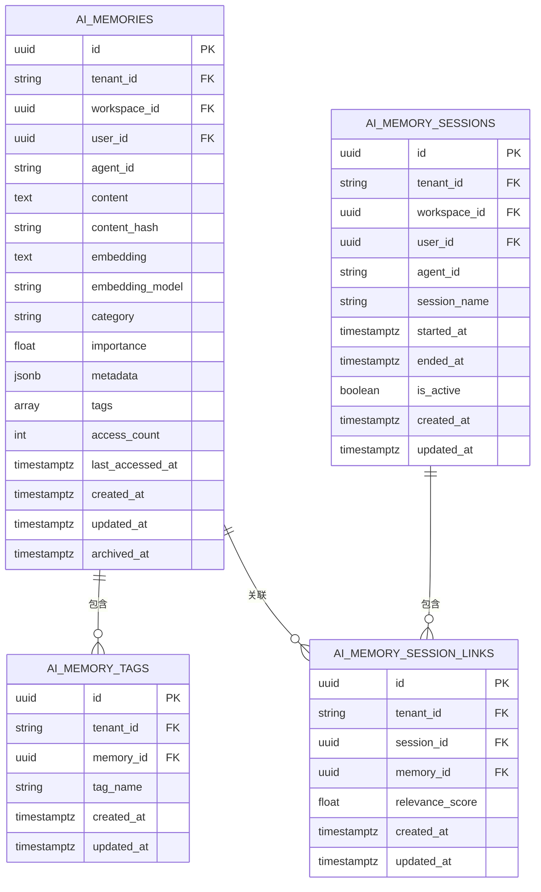
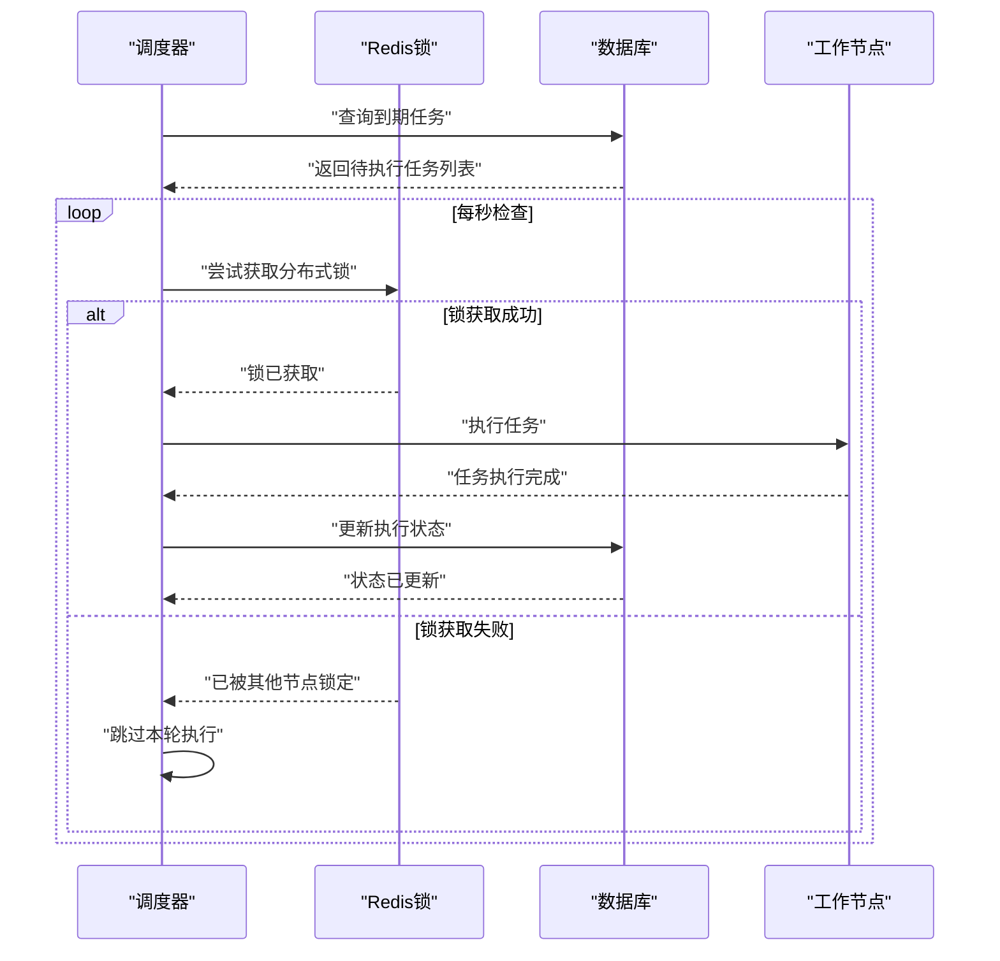
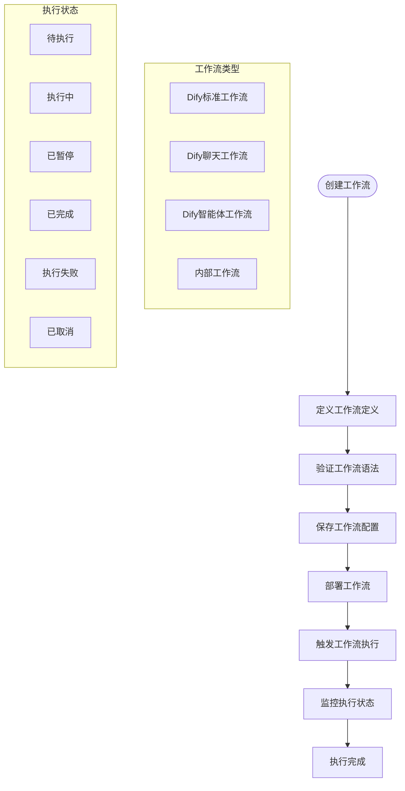
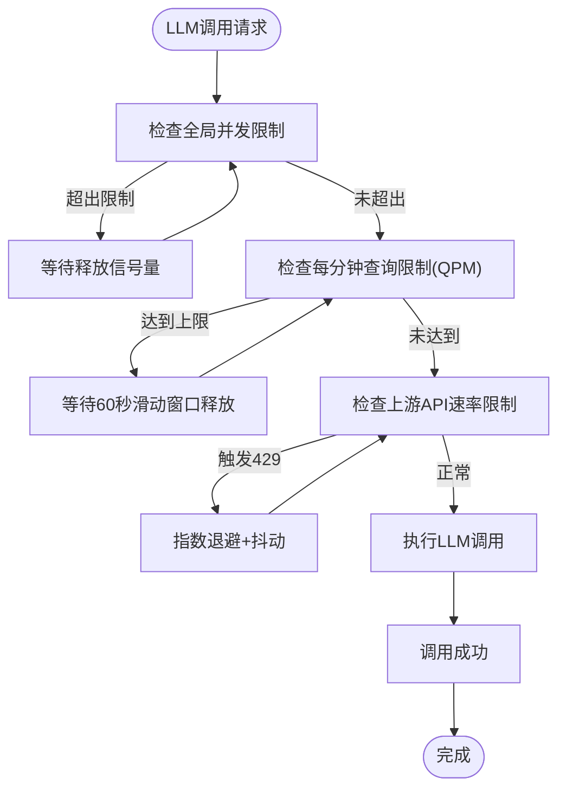
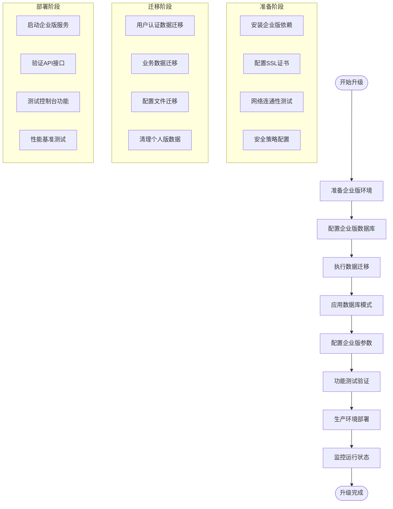
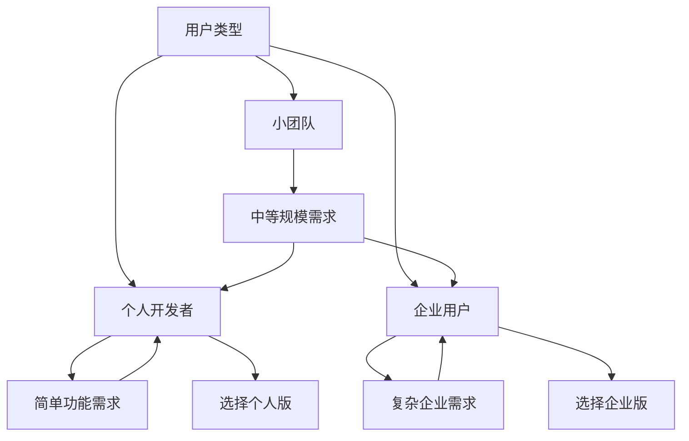

# 版本对比

<cite>
**本文引用的文件**
- [migrate_personal_to_enterprise.py](file://scripts/migrate_personal_to_enterprise.py)
- [001_initial_schema.py](file://alembic/versions/001_initial_schema.py)
- [002_enterprise_phase_a.py](file://alembic/versions/002_enterprise_phase_a.py)
- [003_enterprise_phase_c.py](file://alembic/versions/003_enterprise_phase_c.py)
- [004_storage_objects.py](file://alembic/versions/004_storage_objects.py)
- [005_ai_metadata_tables.py](file://alembic/versions/005_ai_metadata_tables.py)
- [006_ai_memories_pgvector.py](file://alembic/versions/006_ai_memories_pgvector.py)
- [007_ai_tasks_scheduling.py](file://alembic/versions/007_ai_tasks_scheduling.py)
- [008_ai_model_registry.py](file://alembic/versions/008_ai_model_registry.py)
- [env.py](file://alembic/env.py)
- [enterprise-users.ts](file://console/src/api/modules/enterprise-users.ts)
- [enterprise-roles.ts](file://console/src/api/modules/enterprise-roles.ts)
- [enterprise-groups.ts](file://console/src/api/modules/enterprise-groups.ts)
- [enterprise-audit.ts](file://console/src/api/modules/enterprise-audit.ts)
- [enterprise-alerts.ts](file://console/src/api/modules/enterprise-alerts.ts)
- [enterprise-workflows.ts](file://console/src/api/modules/enterprise-workflows.ts)
- [scheduler.py](file://src/copaw/enterprise/scheduler.py)
- [base.py](file://src/copaw/storage/base.py)
- [s3_adapter.py](file://src/copaw/storage/s3_adapter.py)
- [minio_adapter.py](file://src/copaw/storage/minio_adapter.py)
- [oss_adapter.py](file://src/copaw/storage/oss_adapter.py)
- [sftp_adapter.py](file://src/copaw/storage/sftp_adapter.py)
- [filesystem_adapter.py](file://src/copaw/storage/filesystem_adapter.py)
- [PHASE-2-4-FINAL-REPORT.md](file://docs/PHASE-2-4-FINAL-REPORT.md)
- [enterprise-storage-migration.md](file://docs/enterprise-storage-migration.md)
- [enterprise-new-features.md](file://docs/enterprise-new-features.md)
- [constant.py](file://src/copaw/constant.py)
- [rate_limiter.py](file://src/copaw/providers/rate_limiter.py)
- [API-Reference.md](file://docs/wiki/API-Reference.md)
- [Architecture.md](file://docs/wiki/Architecture.md)
- [config.en.md](file://website/public/docs/config.en.md)
</cite>

## 更新摘要
**所做更改**
- 新增企业存储系统章节，详细介绍多租户存储管理、对象存储适配器和元数据管理
- 新增向量内存系统章节，说明PostgreSQL + pgvector的AI记忆存储方案
- 新增任务调度系统章节，描述基于cron的分布式任务调度器
- 新增工作流管理系统章节，介绍Dify集成的工作流编排能力
- 新增审计与告警系统章节，涵盖ISO 27001合规的审计日志和告警规则
- 更新版本对比表格，突出个人版到企业版的核心功能升级差异
- 新增版本选择决策指南，帮助用户根据需求选择合适的版本

## 目录
1. [简介](#简介)
2. [版本对比概览](#版本对比概览)
3. [企业存储系统](#企业存储系统)
4. [向量内存系统](#向量内存系统)
5. [任务调度系统](#任务调度系统)
6. [工作流管理系统](#工作流管理系统)
7. [审计与告警系统](#审计与告警系统)
8. [性能与并发控制](#性能与并发控制)
9. [版本升级路径](#版本升级路径)
10. [版本选择决策指南](#版本选择决策指南)
11. [故障排查指南](#故障排查指南)
12. [结论](#结论)

## 简介
本文档详细对比CoPaw个人版与企业版的功能差异，重点突出个人版到企业版的核心升级，包括多租户存储管理、企业级存储系统、向量内存、任务调度、工作流管理、审计与告警等关键功能。通过详细的版本对比表格、功能说明和升级指南，帮助用户基于自身需求做出合适的选择。

## 版本对比概览

### 核心功能对比矩阵

| 功能特性 | 个人版 | 企业版 | 差异说明 |
|---------|--------|--------|----------|
| **多租户架构** | ❌ 不支持 | ✅ 支持 | 企业版具备完整的多租户隔离能力 |
| **企业存储系统** | ❌ 文件系统 | ✅ 多存储后端 | 支持S3、MinIO、OSS、本地存储 |
| **向量内存** | ❌ 无 | ✅ PostgreSQL+pgvector | 支持向量相似搜索和记忆管理 |
| **任务调度** | ❌ 无 | ✅ 分布式调度器 | 基于cron的定时任务执行 |
| **工作流管理** | ❌ 无 | ✅ Dify集成 | 支持复杂业务流程编排 |
| **审计日志** | ❌ 无 | ✅ ISO 27001合规 | 完整的操作审计和合规报告 |
| **告警系统** | ❌ 无 | ✅ 实时告警 | 多渠道通知和事件监控 |
| **RBAC权限** | ❌ 基础权限 | ✅ 完整RBAC | 细粒度的角色权限管理 |
| **用户组管理** | ❌ 无 | ✅ 用户组功能 | 支持用户分组和批量权限管理 |

### 性能与扩展性对比

| 指标 | 个人版 | 企业版 | 企业版优势 |
|------|--------|--------|------------|
| **并发用户数** | 有限制 | 无限制 | 支持大规模并发访问 |
| **代理数量** | 有限制 | 无限制 | 支持无限量代理部署 |
| **技能数量** | 有限制 | 无限制 | 支持大规模技能池管理 |
| **渠道数量** | 有限制 | 无限制 | 支持多渠道集成 |
| **存储容量** | 本地磁盘 | 云端存储 | 支持弹性扩容 |
| **内存管理** | 本地内存 | 向量内存 | 支持智能记忆检索 |

## 企业存储系统

### 多租户存储管理

企业版引入了完整的多租户存储管理体系，通过统一的存储抽象层实现跨多个存储后端的透明访问。

```mermaid
graph TB
subgraph "存储抽象层"
BASE["ObjectStorageProvider<br/>统一接口"]
META["ObjectMetadata<br/>对象元数据"]
LIST["ListResult<br/>列表结果"]
END
subgraph "存储后端适配器"
S3["S3StorageAdapter<br/>AWS S3/兼容存储"]
MINIO["MinIOStorageAdapter<br/>MinIO原生SDK"]
OSS["OSSStorageAdapter<br/>阿里云OSS"]
FS["FileSystemStorageAdapter<br/>本地文件系统"]
SFTP["SFTPStorageAdapter<br/>安全文件传输"]
END
subgraph "存储索引表"
SO["storage_objects<br/>通用文件对象索引"]
META["ai_agent_configs<br/>Agent配置元数据"]
SKILL["ai_skill_configs<br/>技能配置元数据"]
CONV["ai_conversations<br/>对话元数据"]
MEM["ai_memory_documents<br/>记忆文档元数据"]
MSG["ai_channel_messages<br/>通道消息"]
END
BASE --> S3
BASE --> MINIO
BASE --> OSS
BASE --> FS
BASE --> SFTP
S3 --> SO
MINIO --> SO
OSS --> SO
FS --> SO
SFTP --> SO
SO --> META
SO --> SKILL
SO --> CONV
SO --> MEM
SO --> MSG
```

**图表来源**
- [base.py:146-230](file://src/copaw/storage/base.py#L146-L230)
- [s3_adapter.py:428-477](file://src/copaw/storage/s3_adapter.py#L428-L477)
- [minio_adapter.py:26-46](file://src/copaw/storage/minio_adapter.py#L26-L46)
- [oss_adapter.py](file://src/copaw/storage/oss_adapter.py)
- [sftp_adapter.py](file://src/copaw/storage/sftp_adapter.py)
- [filesystem_adapter.py](file://src/copaw/storage/filesystem_adapter.py)
- [004_storage_objects.py:20-48](file://alembic/versions/004_storage_objects.py#L20-L48)
- [005_ai_metadata_tables.py:19-251](file://alembic/versions/005_ai_metadata_tables.py#L19-L251)

### 存储后端适配器

企业版支持多种存储后端，通过统一的抽象接口实现无缝切换：

**S3兼容存储**
- 支持AWS S3、Ceph、DigitalOcean Spaces等
- 提供完整的S3协议兼容性
- 支持自定义endpoint和region配置

**MinIO原生适配器**
- 使用miniopy-async SDK提供优化路径
- 完全兼容S3协议但具有原生性能优势
- 支持桶自动创建和管理

**阿里云OSS适配器**
- 使用oss2异步SDK实现
- 支持阿里云生态的完整功能
- 提供中文文档和示例

**存储索引表设计**
企业版通过`storage_objects`表实现统一的对象存储索引，支持：
- 多租户隔离的存储键管理
- 全文搜索和标签过滤
- 内容哈希去重和版本控制
- 自动化的元数据提取和管理

**章节来源**
- [base.py:146-230](file://src/copaw/storage/base.py#L146-L230)
- [s3_adapter.py:428-477](file://src/copaw/storage/s3_adapter.py#L428-L477)
- [minio_adapter.py:26-46](file://src/copaw/storage/minio_adapter.py#L26-L46)
- [oss_adapter.py](file://src/copaw/storage/oss_adapter.py)
- [004_storage_objects.py:20-83](file://alembic/versions/004_storage_objects.py#L20-L83)
- [enterprise-storage-migration.md:417-731](file://docs/enterprise-storage-migration.md#L417-L731)

## 向量内存系统

### PostgreSQL + pgvector架构

企业版实现了基于PostgreSQL + pgvector的向量内存系统，提供高效的AI记忆存储和相似度搜索能力。



**图表来源**
- [006_ai_memories_pgvector.py:22-121](file://alembic/versions/006_ai_memories_pgvector.py#L22-L121)

### 向量相似搜索

系统支持基于cosine相似度的向量搜索，通过IVFFlat索引实现高效检索：

**核心功能**
- ✅ IVFFlat索引支持大规模向量相似搜索
- ✅ 多维度嵌入向量存储（支持768维等）
- ✅ 记忆分类管理（事实、偏好、经验等）
- ✅ 重要性评分和访问追踪
- ✅ 会话-记忆关联和相关性评分

**搜索能力**
- 支持按类别过滤的记忆搜索
- 可配置的相似度阈值和返回数量
- 自动的向量嵌入生成和存储
- 记忆压缩和归档机制

**章节来源**
- [006_ai_memories_pgvector.py:18-130](file://alembic/versions/006_ai_memories_pgvector.py#L18-L130)
- [PHASE-2-4-FINAL-REPORT.md:217-232](file://docs/PHASE-2-4-FINAL-REPORT.md#L217-L232)
- [enterprise-new-features.md:73-99](file://docs/enterprise-new-features.md#L73-L99)

## 任务调度系统

### 分布式任务调度器

企业版提供了基于cron表达式的分布式任务调度系统，支持高可用和弹性扩展。



**图表来源**
- [scheduler.py:86-144](file://src/copaw/enterprise/scheduler.py#L86-L144)

### 调度功能特性

**核心能力**
- ✅ 标准cron表达式支持（* * * * *格式）
- ✅ Redis分布式锁防止重复执行
- ✅ 可配置的重试机制和超时控制
- ✅ 执行历史追踪和运行统计
- ✅ 失败任务监控和告警

**调度字段**
- `schedule_expr`: Cron表达式定义执行频率
- `next_run_at`: 下次执行时间计算
- `last_run_at`: 上次执行时间记录
- `run_count`: 总执行次数统计
- `max_retries`: 最大重试次数配置
- `timeout_seconds`: 任务执行超时设置
- `command`: 执行命令和参数配置

**章节来源**
- [scheduler.py:23-174](file://src/copaw/enterprise/scheduler.py#L23-L174)
- [007_ai_tasks_scheduling.py:18-31](file://alembic/versions/007_ai_tasks_scheduling.py#L18-L31)
- [tests/unit/enterprise/test_scheduler.py:1-158](file://tests/unit/enterprise/test_scheduler.py#L1-L158)

## 工作流管理系统

### Dify集成工作流

企业版集成了Dify工作流引擎，提供强大的业务流程编排能力。



**图表来源**
- [workflows.py:90-209](file://src/copaw/app/routers/workflows.py#L90-L209)

### 工作流功能特性

**工作流定义**
- 支持JSON格式的工作流定义
- 多种工作流类型（dify、dify_chatflow、dify_agent、internal）
- 版本管理和状态控制（draft、active、archived）

**执行管理**
- 支持异步工作流执行
- 执行历史记录和状态追踪
- 输入输出数据的完整记录
- 错误信息和调试支持

**集成能力**
- 与Dify平台深度集成
- 支持复杂的业务逻辑编排
- 提供RESTful API接口
- 支持与其他企业系统集成

**章节来源**
- [workflows.py:90-209](file://src/copaw/app/routers/workflows.py#L90-L209)
- [enterprise-workflows.ts:1-98](file://console/src/api/modules/enterprise-workflows.ts#L1-L98)

## 审计与告警系统

### ISO 27001合规审计

企业版提供了完整的审计日志系统，满足ISO 27001信息安全管理体系要求。

```mermaid
graph TB
subgraph "审计事件类型"
LOGIN["用户登录/登出"]
USER["用户管理操作"]
ROLE["角色权限操作"]
TASK["任务管理操作"]
WF["工作流操作"]
AGENT["Agent运行"]
CONFIG["配置变更"]
SECRET["密钥访问"]
END
subgraph "审计存储"
LOGS["audit_logs表<br/>结构化审计日志"]
META["审计元数据<br/>IP地址、设备信息"]
CONTEXT["上下文数据<br/>操作详情、影响范围"]
SENSITIVE["敏感标记<br/>PII、密钥访问"]
END
subgraph "审计查询"
QUERY["审计查询API"]
REPORT["合规报告生成"]
EXPORT["审计日志导出"]
POLICY["政策合规检查"]
END
LOGIN --> LOGS
USER --> LOGS
ROLE --> LOGS
TASK --> LOGS
WF --> LOGS
AGENT --> LOGS
CONFIG --> LOGS
SECRET --> LOGS
LOGS --> META
LOGS --> CONTEXT
LOGS --> SENSITIVE
LOGS --> QUERY
QUERY --> REPORT
REPORT --> EXPORT
EXPORT --> POLICY
```

**图表来源**
- [audit_service.py:24-51](file://src/copaw/enterprise/audit_service.py#L24-L51)

### 告警系统

企业版提供实时告警功能，支持多种告警规则和通知渠道。

**告警规则类型**
- ✅ 性能监控告警（CPU、内存、磁盘使用率）
- ✅ 业务指标告警（用户活跃度、任务成功率）
- ✅ 安全事件告警（异常登录、权限变更）
- ✅ 系统健康告警（服务可用性、响应时间）

**通知渠道**
- ✅ 邮件通知
- ✅ 钉钉/企业微信
- ✅ Slack集成
- ✅ Webhook回调
- ✅ 短信告警

**章节来源**
- [audit_service.py:1-52](file://src/copaw/enterprise/audit_service.py#L1-L52)
- [enterprise-audit.ts:1-44](file://console/src/api/modules/enterprise-audit.ts#L1-L44)
- [enterprise-alerts.ts:1-64](file://console/src/api/modules/enterprise-alerts.ts#L1-L64)

## 性能与并发控制

### 全局并发与速率限制

企业版在个人版基础上增强了性能控制机制，通过多层限制确保系统的稳定性和可靠性。



**图表来源**
- [rate_limiter.py:71-135](file://src/copaw/providers/rate_limiter.py#L71-L135)

### 性能优化策略

**并发控制**
- 全局最大并发数限制，防止资源争抢
- 每分钟查询上限（QPM），基于60秒滑动窗口
- 429状态码的统一重试暂停和抖动策略

**缓存优化**
- 向量内存的IVFFlat索引加速相似搜索
- 元数据缓存减少数据库查询压力
- 存储对象的索引优化提升检索性能

**扩展性设计**
- 支持水平扩展的分布式架构
- 弹性的存储后端选择
- 可配置的性能参数调优

**章节来源**
- [rate_limiter.py:71-135](file://src/copaw/providers/rate_limiter.py#L71-L135)
- [constant.py:188-249](file://src/copaw/constant.py#L188-L249)
- [config.en.md:356-368](file://website/public/docs/config.en.md#L356-L368)

## 版本升级路径

### 从个人版升级到企业版

企业版升级需要经过以下步骤，确保数据安全和平滑过渡：



**升级步骤详解**

**1. 环境准备**
- 安装企业版依赖包和数据库
- 配置SSL证书和网络安全
- 设置Redis缓存和分布式锁
- 准备存储后端（S3/MiNIO/OSS）

**2. 数据迁移**
- 验证数据库连接和权限
- 迁移用户认证和角色权限
- 迁移Agent配置和工作空间
- 迁移对话历史和技能数据

**3. 系统部署**
- 启动企业版服务进程
- 配置反向代理和负载均衡
- 验证所有API接口功能
- 进行性能和压力测试

**章节来源**
- [migrate_personal_to_enterprise.py:1-628](file://scripts/migrate_personal_to_enterprise.py#L1-L628)
- [env.py](file://alembic/env.py)

## 版本选择决策指南

### 个人版适用场景

**推荐使用个人版当您：**
- 是个人开发者或小团队成员
- 需要基本的AI代理功能
- 预算有限且不需要高级功能
- 数据量较小且访问量不高
- 不需要多租户和企业级安全

**个人版优势：**
- ✅ 简单易用，快速上手
- ✅ 低成本部署和维护
- ✅ 足够的基础功能
- ✅ 轻量级资源占用

### 企业版适用场景

**推荐使用企业版当您：**
- 是大型企业或组织
- 需要多租户隔离和权限管理
- 要求合规性和审计能力
- 需要大规模并发和扩展性
- 要求高级的存储和内存管理
- 需要工作流编排和任务调度

**企业版优势：**
- ✅ 完整的企业级功能
- ✅ 高可用和高扩展性
- ✅ 合规性和安全性保障
- ✅ 专业的技术支持
- ✅ 弹性付费模式

### 功能对比决策树



**决策要点：**
- **预算考虑**：企业版成本更高但功能更全面
- **团队规模**：超过5人的团队建议考虑企业版
- **合规要求**：有严格合规需求的企业必须选择企业版
- **扩展计划**：有快速增长计划的企业应直接选择企业版
- **技术能力**：缺乏运维能力的团队可考虑企业版托管服务

## 故障排查指南

### 常见问题及解决方案

**1. 存储后端连接问题**
- 检查存储配置参数是否正确
- 验证网络连通性和防火墙设置
- 确认存储权限和访问密钥
- 测试存储后端的可用性

**2. 向量内存搜索异常**
- 验证pgvector扩展是否正确安装
- 检查向量维度和嵌入模型匹配
- 确认IVFFlat索引是否正常工作
- 查看向量相似度阈值设置

**3. 任务调度执行失败**
- 检查Redis连接和分布式锁配置
- 验证cron表达式格式正确性
- 确认任务超时和重试参数设置
- 查看任务执行日志和错误信息

**4. 审计日志记录异常**
- 验证审计服务是否正常启动
- 检查数据库连接和权限设置
- 确认审计事件类型配置
- 查看审计查询API的响应

**章节来源**
- [scheduler.py:86-174](file://src/copaw/enterprise/scheduler.py#L86-L174)
- [006_ai_memories_pgvector.py:18-130](file://alembic/versions/006_ai_memories_pgvector.py#L18-L130)
- [audit_service.py:1-52](file://src/copaw/enterprise/audit_service.py#L1-L52)

## 结论

CoPaw的企业版相比个人版提供了全面的功能升级和架构改进，特别适合需要企业级功能和大规模部署的场景。通过多租户存储管理、向量内存系统、分布式任务调度、工作流编排、审计与告警等核心功能，企业版不仅提升了系统的功能完整性，还增强了安全性、可扩展性和可维护性。

**选择建议：**
- **个人开发者**：优先选择个人版，满足基本需求且成本较低
- **小团队**：考虑个人版，如需扩展功能可升级到企业版
- **企业用户**：直接选择企业版，获得完整的功能和安全保障

无论选择哪个版本，CoPaw都提供了清晰的升级路径和完善的文档支持，确保用户能够顺利完成版本迁移并充分利用新功能。