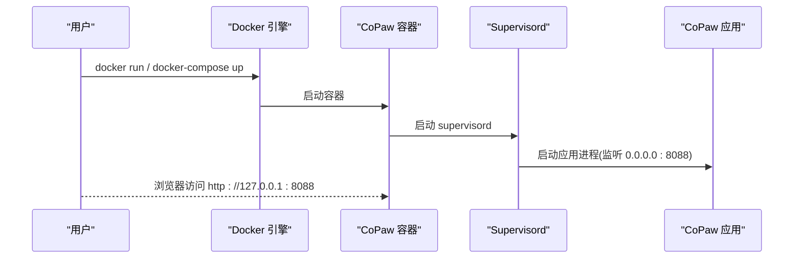
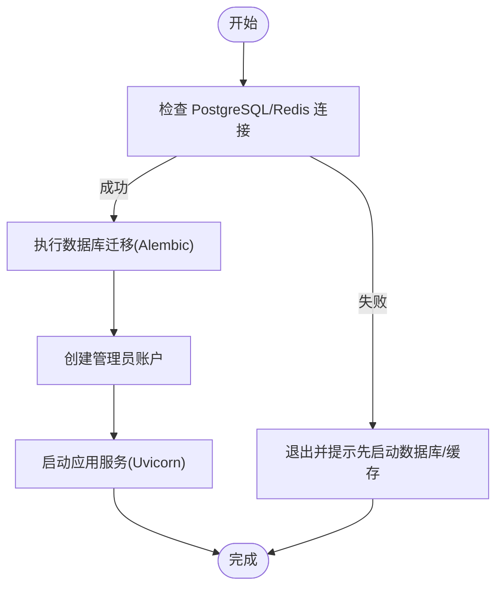
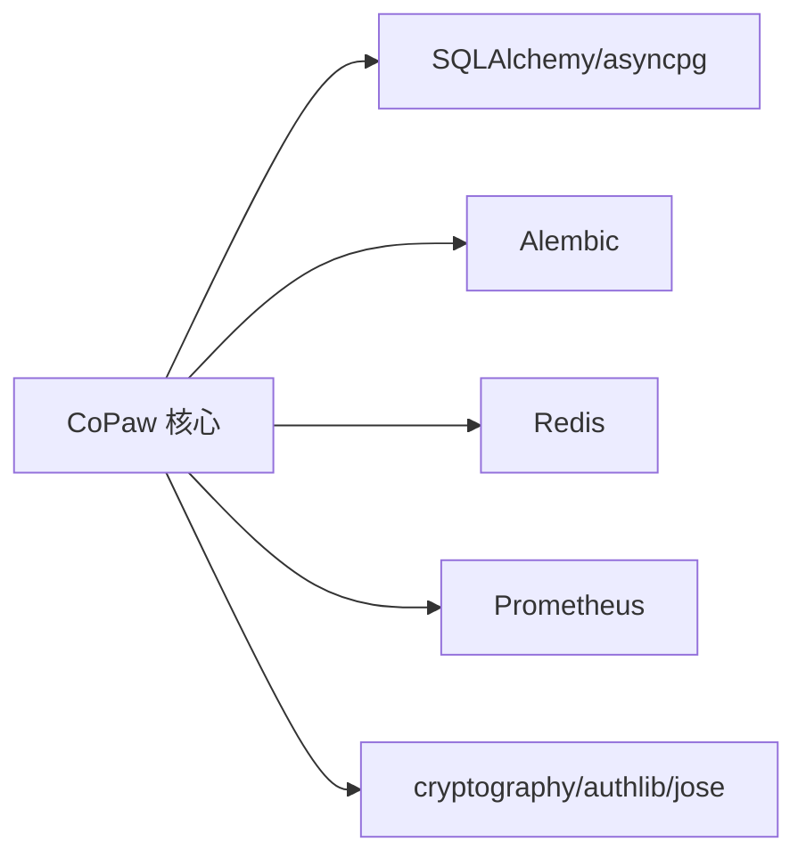

# 部署选项

<cite>
**本文引用的文件**
- [部署指南](file://docs/wiki/Deployment.md)
- [Dockerfile](file://deploy/Dockerfile)
- [入口脚本](file://deploy/entrypoint.sh)
- [Supervisord 配置模板](file://deploy/config/supervisord.conf.template)
- [Linux 安装脚本](file://scripts/install.sh)
- [Windows 安装脚本](file://scripts/install.ps1)
- [企业服务管理脚本（Linux）](file://scripts/start-enterprise.sh)
- [企业服务管理脚本（Windows）](file://scripts/start-enterprise.ps1)
- [Docker Compose（企业）](file://docker-compose.yml)
- [Docker 构建脚本](file://scripts/docker_build.sh)
- [Docker 镜像标签同步脚本](file://scripts/docker_sync_latest.sh)
- [快速入门](file://docs/QUICK-START.md)
- [企业版需求文档](file://docs/ent-copaw.md)
- [项目配置（pyproject.toml）](file://pyproject.toml)
- [README](file://README.md)
</cite>

## 目录
1. [简介](#简介)
2. [项目结构](#项目结构)
3. [核心组件](#核心组件)
4. [架构总览](#架构总览)
5. [详细组件分析](#详细组件分析)
6. [依赖分析](#依赖分析)
7. [性能考量](#性能考量)
8. [故障排查指南](#故障排查指南)
9. [结论](#结论)
10. [附录](#附录)

## 简介
本文件系统化梳理 CoPaw 的多种部署方式，覆盖本地安装、Docker 部署、企业部署、桌面应用与云平台部署。内容包括部署前准备、网络与存储规划、安全配置、环境变量与配置参数、后台运行与反向代理、监控与日志、备份恢复、性能优化与常见问题排查等，帮助不同技术背景的用户高效落地。

## 项目结构
围绕部署的相关文件主要分布在以下位置：
- 文档与部署指南：docs/wiki/Deployment.md、docs/QUICK-START.md、docs/ent-copaw.md
- 部署镜像与容器：deploy/Dockerfile、deploy/entrypoint.sh、deploy/config/supervisord.conf.template
- 安装与脚本：scripts/install.sh、scripts/install.ps1、scripts/start-enterprise.sh、scripts/start-enterprise.ps1、scripts/docker_build.sh、scripts/docker_sync_latest.sh
- 企业编排：docker-compose.yml
- 项目配置：pyproject.toml
- 顶层说明：README.md

```mermaid
graph TB
A["部署指南<br/>docs/wiki/Deployment.md"] --> B["Dockerfile<br/>deploy/Dockerfile"]
A --> C["入口脚本<br/>deploy/entrypoint.sh"]
A --> D["Supervisord 配置模板<br/>deploy/config/supervisord.conf.template"]
A --> E["Linux 安装脚本<br/>scripts/install.sh"]
A --> F["Windows 安装脚本<br/>scripts/install.ps1"]
A --> G["企业服务脚本(Linux)<br/>scripts/start-enterprise.sh"]
A --> H["企业服务脚本(Windows)<br/>scripts/start-enterprise.ps1"]
A --> I["Docker Compose(企业)<br/>docker-compose.yml"]
A --> J["Docker 构建脚本<br/>scripts/docker_build.sh"]
A --> K["镜像标签同步脚本<br/>scripts/docker_sync_latest.sh"]
A --> L["快速入门<br/>docs/QUICK-START.md"]
A --> M["企业版需求文档<br/>docs/ent-copaw.md"]
A --> N["项目配置(pyproject.toml)<br/>pyproject.toml"]
A --> O["README<br/>README.md"]
```



图表来源
- [部署指南:1-527](file://docs/wiki/Deployment.md#L1-L527)
- [Dockerfile:1-103](file://deploy/Dockerfile#L1-L103)
- [入口脚本:1-10](file://deploy/entrypoint.sh#L1-L10)
- [Supervisord 配置模板:1-40](file://deploy/config/supervisord.conf.template#L1-L40)
- [Linux 安装脚本:1-340](file://scripts/install.sh#L1-L340)
- [Windows 安装脚本:1-477](file://scripts/install.ps1#L1-L477)
- [企业服务管理脚本（Linux）:1-510](file://scripts/start-enterprise.sh#L1-L510)
- [企业服务管理脚本（Windows）:1-718](file://scripts/start-enterprise.ps1#L1-L718)
- [Docker Compose（企业）:1-92](file://docker-compose.yml#L1-L92)
- [Docker 构建脚本:1-32](file://scripts/docker_build.sh#L1-L32)
- [Docker 镜像标签同步脚本:1-77](file://scripts/docker_sync_latest.sh#L1-L77)
- [快速入门:1-356](file://docs/QUICK-START.md#L1-L356)
- [企业版需求文档:1-319](file://docs/ent-copaw.md#L1-L319)
- [项目配置（pyproject.toml）:1-124](file://pyproject.toml#L1-L124)
- [README:1-390](file://README.md#L1-L390)

章节来源
- [部署指南:1-527](file://docs/wiki/Deployment.md#L1-L527)
- [README:1-390](file://README.md#L1-L390)

## 核心组件
- 应用容器与运行时
  - Dockerfile 定义多阶段构建，包含前端构建与 Python 运行时，内置 Chromium 与桌面虚拟化支持，通过 supervisord 管理应用进程。
  - 入口脚本负责将 COPAW_PORT 注入 Supervisord 配置并启动服务。
  - Supervisord 配置模板定义 dbus、xvfb、xfce4 与应用进程的启动顺序与日志。
- 安装与初始化
  - Linux/Windows 安装脚本通过 uv 创建隔离 Python 环境，自动安装依赖并生成 CLI 包装器。
  - 企业版安装脚本提供数据库与缓存连接测试、初始化与管理员账户创建。
- 企业编排
  - docker-compose.yml 提供 PostgreSQL、Redis 与应用服务的编排，含健康检查与持久化卷。
- 配置与依赖
  - pyproject.toml 定义核心依赖与可选企业依赖（SQLAlchemy、Alembic、Redis、Prometheus 等）。

章节来源
- [Dockerfile:1-103](file://deploy/Dockerfile#L1-L103)
- [入口脚本:1-10](file://deploy/entrypoint.sh#L1-L10)
- [Supervisord 配置模板:1-40](file://deploy/config/supervisord.conf.template#L1-L40)
- [Linux 安装脚本:1-340](file://scripts/install.sh#L1-L340)
- [Windows 安装脚本:1-477](file://scripts/install.ps1#L1-L477)
- [企业服务管理脚本（Linux）:1-510](file://scripts/start-enterprise.sh#L1-L510)
- [企业服务管理脚本（Windows）:1-718](file://scripts/start-enterprise.ps1#L1-L718)
- [Docker Compose（企业）:1-92](file://docker-compose.yml#L1-L92)
- [项目配置（pyproject.toml）:1-124](file://pyproject.toml#L1-L124)

## 架构总览
下图展示 CoPaw 的典型部署形态与组件交互：

```mermaid
graph TB
subgraph "容器层"
APP["CoPaw 应用容器<br/>agentscope/copaw:latest"]
CHROMIUM["Chromium/Playwright<br/>浏览器自动化"]
XVFB["Xvfb/Virtual Display"]
DBUS["DBus"]
XFCE["XFCE 桌面环境"]
end
subgraph "基础设施"
PG["PostgreSQL 容器"]
REDIS["Redis 容器"]
VOL1["卷: working"]
VOL2["卷: working.secret"]
end
subgraph "外部访问"
PROXY["反向代理(Nginx/Caddy/Apache)"]
CLIENT["浏览器/客户端"]
end
CLIENT --> PROXY --> APP
APP --> CHROMIUM
APP --> XVFB
APP --> DBUS
APP --> XFCE
APP <- --> PG
APP <- --> REDIS
APP -. 挂载 .-> VOL1
APP -. 挂载 .-> VOL2
```

图表来源
- [Dockerfile:1-103](file://deploy/Dockerfile#L1-L103)
- [Supervisord 配置模板:1-40](file://deploy/config/supervisord.conf.template#L1-L40)
- [Docker Compose（企业）:1-92](file://docker-compose.yml#L1-L92)

## 详细组件分析

### 本地安装（pip）
- 适用场景
  - 个人开发与快速试用，无需容器或额外编排。
- 安装与初始化
  - 安装：pip 安装 copaw。
  - 初始化：copaw init --defaults 或交互式配置。
  - 启动：copaw app。
- 后台运行
  - Linux：systemd 或 supervisor。
- 环境要求
  - Python 3.10–3.14，网络可访问模型提供商。
- 注意事项
  - 首次运行需在控制台配置模型 API Key。
  - 若需企业功能，安装 copaw[enterprise] 并启用企业模式。

章节来源
- [部署指南:19-75](file://docs/wiki/Deployment.md#L19-L75)
- [快速入门:19-48](file://docs/QUICK-START.md#L19-L48)
- [README:113-137](file://README.md#L113-L137)

### 脚本安装（macOS/Linux / Windows）
- 适用场景
  - 无需预先配置 Python 环境，自动下载并使用 uv 管理虚拟环境。
- 安装选项
  - macOS/Linux：curl 安装脚本，支持指定版本、从源码安装、附加 extras（如 ollama）。
  - Windows：PowerShell 一键安装，支持从源码安装与自定义 uv 路径。
- 启动与配置
  - 安装完成后 copaw init --defaults 与 copaw app。
- 注意事项
  - Windows 首次运行可能需要调整执行策略或手动添加 PATH。

章节来源
- [部署指南:77-117](file://docs/wiki/Deployment.md#L77-L117)
- [Linux 安装脚本:1-340](file://scripts/install.sh#L1-L340)
- [Windows 安装脚本:1-477](file://scripts/install.ps1#L1-L477)
- [快速入门:179-218](file://docs/QUICK-START.md#L179-L218)

### Docker 部署
- 适用场景
  - 快速试用、容器化部署、便于迁移与扩展。
- 快速启动
  - 拉取镜像并映射端口与工作目录卷。
- 环境变量与 .env
  - 支持通过环境变量或 .env 文件注入 API Key、日志级别等。
- 连接宿主机服务
  - host.docker.internal 或 host 网络模式，便于访问本机 Ollama/LM Studio。
- Docker Compose（企业）
  - 同时编排 PostgreSQL、Redis 与应用，含健康检查与持久化卷。
- 自定义镜像
  - 通过 docker_build.sh 构建，支持通道白名单/黑名单参数。
- 国内镜像
  - 提供阿里云镜像仓库地址以加速拉取。



图表来源
- [Dockerfile:1-103](file://deploy/Dockerfile#L1-L103)
- [入口脚本:1-10](file://deploy/entrypoint.sh#L1-L10)
- [Supervisord 配置模板:1-40](file://deploy/config/supervisord.conf.template#L1-L40)
- [Docker Compose（企业）:1-92](file://docker-compose.yml#L1-L92)

章节来源
- [部署指南:119-244](file://docs/wiki/Deployment.md#L119-L244)
- [Dockerfile:1-103](file://deploy/Dockerfile#L1-L103)
- [入口脚本:1-10](file://deploy/entrypoint.sh#L1-L10)
- [Supervisord 配置模板:1-40](file://deploy/config/supervisord.conf.template#L1-L40)
- [Docker Compose（企业）:1-92](file://docker-compose.yml#L1-L92)
- [Docker 构建脚本:1-32](file://scripts/docker_build.sh#L1-L32)

### 企业部署
- 适用场景
  - 多租户、RBAC、审计日志、SSO、DLP 等企业级能力。
- 安装与初始化
  - 安装 copaw[enterprise]，使用 copaw init --enterprise 初始化数据库与缓存连接。
  - 通过 start-enterprise.sh（Linux）或 start-enterprise.ps1（Windows）进行数据库迁移、管理员账户创建与服务启动。
- 组件与依赖
  - PostgreSQL（用户、角色、任务、审计日志）、Redis（会话、缓存、消息）、Alembic（迁移）、Prometheus（指标）。
- 环境变量
  - COPAW_ENTERPRISE_ENABLED、COPAW_DB_*、COPAW_REDIS_*、COPAW_JWT_SECRET 等。



图表来源
- [企业服务管理脚本（Linux）:1-510](file://scripts/start-enterprise.sh#L1-L510)
- [企业服务管理脚本（Windows）:1-718](file://scripts/start-enterprise.ps1#L1-L718)
- [Docker Compose（企业）:1-92](file://docker-compose.yml#L1-L92)

章节来源
- [部署指南:247-284](file://docs/wiki/Deployment.md#L247-L284)
- [快速入门:59-121](file://docs/QUICK-START.md#L59-L121)
- [企业服务管理脚本（Linux）:1-510](file://scripts/start-enterprise.sh#L1-L510)
- [企业服务管理脚本（Windows）:1-718](file://scripts/start-enterprise.ps1#L1-L718)
- [Docker Compose（企业）:1-92](file://docker-compose.yml#L1-L92)
- [企业版需求文档:1-319](file://docs/ent-copaw.md#L1-L319)

### 桌面应用部署（Beta）
- 适用场景
  - 非技术用户，无需命令行操作。
- 下载与安装
  - 从 GitHub Releases 下载对应平台安装包，按提示安装并启动。
- macOS 安全绕过
  - 若出现安全警告，可通过右键打开或终端清除属性。

章节来源
- [部署指南:270-284](file://docs/wiki/Deployment.md#L270-L284)
- [快速入门:155-177](file://docs/QUICK-START.md#L155-L177)
- [README:156-162](file://README.md#L156-L162)

### 云平台部署（阿里云 ECS）
- 适用场景
  - 云上快速上线，结合安全组与实例规格推荐。
- 安全组与规格
  - 入站放通 8088 端口，推荐最低 2vCPU/4GB，本地模型建议 8vCPU/16GB+GPU。
- 一键部署链接
  - 提供阿里云 ComputeNest 一键创建链接。

章节来源
- [部署指南:247-268](file://docs/wiki/Deployment.md#L247-L268)
- [README:139-154](file://README.md#L139-L154)

### 反向代理配置
- 适用场景
  - 通过 Nginx、Caddy、Apache 将外部域名映射到本地服务，支持 WebSocket。
- 配置要点
  - 透传 Host、X-Real-IP、X-Forwarded-Proto、Connection/Upgrade 头。
  - 保持长连接与 WebSocket 升级。

章节来源
- [部署指南:286-332](file://docs/wiki/Deployment.md#L286-L332)

### 安全配置
- Web 认证
  - 通过环境变量或配置文件启用 Web 认证。
- HTTPS 与证书
  - 使用 Let’s Encrypt 自动签发与续期。
- 防火墙
  - UFW/firewalld 放通 80/443/8088 端口。

章节来源
- [部署指南:335-380](file://docs/wiki/Deployment.md#L335-L380)

### 监控与日志
- 日志位置与级别
  - 应用日志、supervisor 日志、系统日志；支持 debug/info/warning/error 级别。
- 健康检查
  - 通过 /api/health 或 copaw status 检查服务状态。

章节来源
- [部署指南:383-416](file://docs/wiki/Deployment.md#L383-L416)

### 备份与恢复
- 备份
  - 备份 ~/.copaw 或工作目录卷。
- 恢复
  - 解压备份并重启服务。

章节来源
- [部署指南:419-440](file://docs/wiki/Deployment.md#L419-L440)

### 性能优化
- 本地模型优化
  - GPU 加速（CUDA/Metal）与模型后端选择。
- 速率限制
  - 在配置中为提供商设置 QPM 与令牌配额。
- 内存优化
  - 调整消息上限、压缩阈值与自动压缩开关。

章节来源
- [部署指南:486-527](file://docs/wiki/Deployment.md#L486-L527)

## 依赖分析
- 运行时依赖
  - Python 3.10–3.14，uv 管理虚拟环境（脚本安装）。
  - 前端构建产物注入至 src/copaw/console/（Dockerfile）。
- 可选企业依赖
  - SQLAlchemy + asyncpg + Alembic（数据库与迁移）
  - Redis（会话与缓存）
  - Prometheus 监控
  - 加解密与鉴权库（cryptography、authlib、python-jose）



图表来源
- [项目配置（pyproject.toml）:102-116](file://pyproject.toml#L102-L116)

章节来源
- [项目配置（pyproject.toml）:1-124](file://pyproject.toml#L1-L124)

## 性能考量
- 本地模型
  - GPU/Metal 加速可显著提升推理性能；注意驱动与依赖版本兼容。
- 容器环境
  - Chromium 无沙箱模式与虚拟显示（Xvfb）影响性能与安全性，建议在可信环境使用。
- 企业数据库
  - PostgreSQL/Redis 性能与连接池配置直接影响并发与延迟。
- 日志与监控
  - 合理的日志级别与指标采集有助于定位瓶颈。

## 故障排查指南
- 端口占用
  - 更换端口或释放占用进程。
- 内存不足
  - 增加 swap 或优化内存配置。
- 容器无法启动
  - 查看容器日志与进入容器调试。
- API Key 无效
  - 校验格式、配额与网络连通性。
- 数据库/缓存连接失败
  - 使用脚本自带的连接测试与迁移工具。
- 服务状态检查
  - 使用健康检查接口或 CLI 状态命令。

章节来源
- [部署指南:443-484](file://docs/wiki/Deployment.md#L443-L484)
- [企业服务管理脚本（Linux）:59-195](file://scripts/start-enterprise.sh#L59-L195)
- [企业服务管理脚本（Windows）:60-266](file://scripts/start-enterprise.ps1#L60-L266)

## 结论
CoPaw 提供从个人到企业级的完整部署路径：本地 pip 安装适合快速试用，脚本安装降低环境门槛，Docker 部署便于标准化与迁移，企业部署提供多租户、RBAC、审计与工作流能力，桌面应用面向非技术用户，云平台部署适配弹性与合规要求。结合合理的网络与存储规划、安全加固、监控与备份策略，可在不同规模与场景下稳定运行。

## 附录
- 部署前清单
  - 确认 Python 版本与网络可达性
  - 准备持久化卷与备份策略
  - 配置反向代理与证书
  - 准备企业数据库与缓存
- 常用命令索引
  - copaw init / copaw app / copaw status
  - docker run / docker-compose up -d
  - alembic upgrade head（企业迁移）
  - curl /api/health（健康检查）